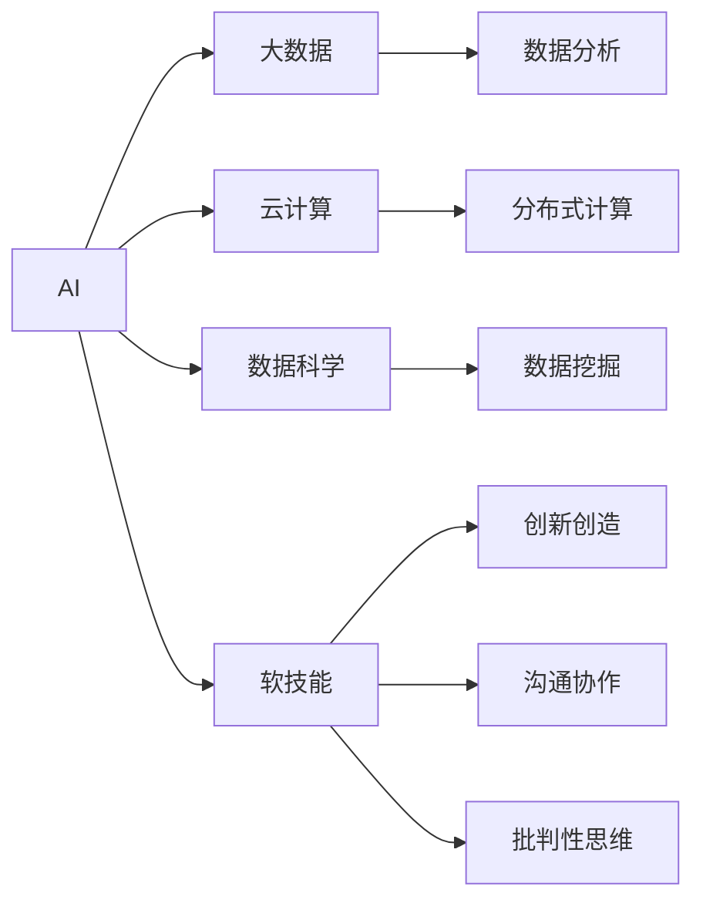

                 

# AI时代的就业技能转型:数字化技能和软技能培养

## 1. 背景介绍

随着人工智能(AI)技术的飞速发展，全球劳动力市场正在经历深刻变革。AI的广泛应用不仅重塑了企业的运营模式，也带来了就业结构的深刻变化。在这一背景下，职业技能的转型和升级变得至关重要。

### 1.1 问题由来
AI技术的快速发展在带来巨大生产力的同时，也使得许多传统职业面临前所未有的挑战。自动化和智能化取代了许多重复性高、技术门槛低的岗位，导致某些行业的就业机会减少。然而，与此同时，AI技术也催生了大量新的岗位和职业，如数据科学家、AI工程师、机器学习专家等，对高层次的技术人才需求激增。

### 1.2 问题核心关键点
AI时代的就业技能转型主要集中在以下两个方面：

1. **数字化技能**：掌握和应用AI、大数据、云计算等数字技术，提升工作效率和创新能力。
2. **软技能**：培养批判性思维、问题解决能力、沟通协作、创新创造等软技能，以应对AI带来的复杂工作环境。

这两种技能相辅相成，共同构建了未来职场的必备竞争力。

## 2. 核心概念与联系

### 2.1 核心概念概述

为了更好地理解AI时代的就业技能转型，本节将介绍几个核心概念：

- **AI（人工智能）**：一种模拟人类智能的技术，包括机器学习、自然语言处理、计算机视觉等，能够执行复杂的任务和决策。
- **大数据（Big Data）**：指海量的、多样化的、高速增长的数据集，通过数据挖掘和分析，可以发现隐藏的趋势和模式。
- **云计算（Cloud Computing）**：通过互联网提供计算资源和软件服务，实现数据的分布式存储和计算。
- **数据科学（Data Science）**：结合统计学、计算数学和数据工程，通过数据处理和分析，获取有价值的洞察。
- **软技能**：包括批判性思维、沟通协作、创新创造等非技术技能，是AI时代职业发展的核心要素。

这些核心概念之间存在着紧密的联系，共同构建了AI时代的就业技能体系。

### 2.2 核心概念原理和架构的 Mermaid 流程图



这个流程图展示了核心概念之间的联系，AI技术通过大数据和云计算的支撑，结合数据科学的分析方法，提升软技能的综合应用，共同推动职业发展的创新和提升。

## 3. 核心算法原理 & 具体操作步骤

### 3.1 算法原理概述

AI时代的就业技能转型，需要从数字化技能和软技能两个维度进行培养和提升。以下将分别介绍这两种技能的算法原理和具体操作步骤。

### 3.2 算法步骤详解

#### 3.2.1 数字化技能培养
数字化技能包括编程、数据处理、AI应用等，主要通过系统化学习和实践提升。具体步骤如下：

1. **选择学习路径**：根据职业方向选择相应的技术课程和资源，如Python编程、机器学习、深度学习等。
2. **系统化学习**：通过在线课程、视频教程、书籍等系统化学习，掌握基本理论和实践技能。
3. **实践应用**：通过编程练习、项目实践、开源贡献等形式，将理论知识应用于实际问题中，提升解决实际问题的能力。

#### 3.2.2 软技能培养
软技能包括沟通、协作、创新等，主要通过情景模拟、团队合作和自我反思等方式提升。具体步骤如下：

1. **情景模拟**：通过模拟工作场景，培养批判性思维和决策能力，如案例分析、角色扮演等。
2. **团队合作**：通过团队项目、跨部门协作，提升沟通协作和团队管理能力。
3. **自我反思**：通过复盘和反馈，识别自身优势和不足，制定提升计划，持续改进。

### 3.3 算法优缺点

#### 3.3.1 数字化技能培养
**优点**：
- **系统化**：通过系统化学习，可以快速掌握所需技术，适应技术变革。
- **实战性强**：通过实践和项目，提升解决实际问题的能力，增强技术自信。

**缺点**：
- **学习成本高**：需要投入大量时间和精力，对自学能力要求高。
- **知识更新快**：技术更新迅速，需要持续学习，保持技术领先。

#### 3.3.2 软技能培养
**优点**：
- **可迁移性强**：软技能具有广泛的应用场景，可在不同行业和岗位中迁移使用。
- **可持续性强**：软技能是一种长期积累的资本，不会因技术变革而过时。

**缺点**：
- **主观性强**：软技能培养依赖于个体的主观努力和情感投入，效果难以量化。
- **个性化差异大**：不同个体的软技能培养路径和效果差异较大，需个性化定制。

### 3.4 算法应用领域

#### 3.4.1 数字化技能应用
- **软件开发**：掌握编程语言和框架，参与软件开发和维护。
- **数据科学**：处理和分析大量数据，提取有价值的信息，支持决策。
- **AI应用**：应用AI技术解决实际问题，如图像识别、语音识别、自然语言处理等。

#### 3.4.2 软技能应用
- **项目管理**：通过沟通协作和团队管理，协调项目进度和资源。
- **创新创造**：提出新想法、新方法，推动技术进步和业务创新。
- **问题解决**：通过批判性思维和分析能力，解决复杂问题和挑战。

## 4. 数学模型和公式 & 详细讲解 & 举例说明

### 4.1 数学模型构建

#### 4.1.1 数字化技能模型
数字化技能培养的数学模型主要基于数据科学和算法理论，通过统计学、概率论和优化算法进行建模和求解。以机器学习为例，常见的数学模型包括：

- **线性回归**：$y = \beta_0 + \beta_1 x_1 + \beta_2 x_2 + \ldots + \beta_n x_n + \epsilon$
- **逻辑回归**：$P(y=1|x) = \frac{1}{1+\exp(-\theta_0 - \theta_1 x_1 - \theta_2 x_2 - \ldots - \theta_n x_n)}$
- **决策树**：通过信息增益或基尼指数，构建树形结构，进行分类和回归。

#### 4.1.2 软技能模型
软技能培养的数学模型主要基于心理学和社会学理论，通过行为分析和情境模拟进行建模和求解。以沟通技能为例，常见的数学模型包括：

- **沟通模型**：$C = f(I, E, C, F)$，其中 $I$ 为信息，$E$ 为环境，$C$ 为沟通者，$F$ 为反馈。
- **冲突管理模型**：$C = M - (A + B)$，其中 $M$ 为管理技能，$A$ 为对抗性，$B$ 为回避性。

### 4.2 公式推导过程

#### 4.2.1 数字化技能公式推导
以线性回归为例，推导过程如下：

- **假设数据线性可分**：$y = \beta_0 + \beta_1 x_1 + \beta_2 x_2 + \ldots + \beta_n x_n + \epsilon$
- **最小二乘法**：$\min_{\beta} \sum_{i=1}^N (y_i - \hat{y}_i)^2$，其中 $\hat{y}_i = \beta_0 + \beta_1 x_{i1} + \beta_2 x_{i2} + \ldots + \beta_n x_{in}$
- **求解系数**：$\beta = (\mathbf{X}^T \mathbf{X})^{-1} \mathbf{X}^T \mathbf{y}$

#### 4.2.2 软技能公式推导
以沟通模型为例，推导过程如下：

- **沟通模型**：$C = f(I, E, C, F)$
- **信息反馈循环**：$I = f(E, C, F)$，$F = f(I, C, E)$
- **动态调整**：$C' = C + \Delta C = C + k(I - E)$，其中 $k$ 为调整系数。

### 4.3 案例分析与讲解

#### 4.3.1 数字化技能案例
**案例：基于Python的机器学习项目**

1. **数据集准备**：选择公开数据集，如Iris、MNIST等。
2. **模型训练**：选择线性回归、逻辑回归或决策树模型，使用Scikit-learn等库进行训练。
3. **模型评估**：使用交叉验证、混淆矩阵等方法评估模型效果，并进行调优。
4. **项目应用**：将训练好的模型应用于实际问题，如股票预测、用户行为分析等。

#### 4.3.2 软技能案例
**案例：团队项目中的沟通协调**

1. **项目背景**：团队开发一个复杂的软件系统。
2. **沟通需求**：明确项目目标和分工，制定详细计划和时间表。
3. **协调过程**：定期召开会议，分享进展和问题，协调资源和冲突。
4. **反馈改进**：收集团队反馈，调整沟通策略和方法，提升团队协作效率。

## 5. 项目实践：代码实例和详细解释说明

### 5.1 开发环境搭建

#### 5.1.1 开发工具
- **编程语言**：Python
- **集成开发环境(IDE)**：Jupyter Notebook、PyCharm等
- **版本控制**：Git

#### 5.1.2 开发环境配置
1. **安装Python**：从官网下载并安装Python 3.x版本。
2. **安装Jupyter Notebook**：使用pip安装，命令为 `pip install jupyter notebook`。
3. **设置Git仓库**：使用 `git clone` 命令克隆代码仓库，并进行环境配置。

### 5.2 源代码详细实现

#### 5.2.1 数字化技能实践
以下是一个基于Python的线性回归模型实现，用于房价预测：

```python
import pandas as pd
from sklearn.linear_model import LinearRegression
from sklearn.model_selection import train_test_split
from sklearn.metrics import mean_squared_error

# 读取数据
df = pd.read_csv('housing.csv')

# 数据预处理
X = df.drop('price', axis=1)
y = df['price']

# 划分训练集和测试集
X_train, X_test, y_train, y_test = train_test_split(X, y, test_size=0.2, random_state=42)

# 模型训练
model = LinearRegression()
model.fit(X_train, y_train)

# 模型评估
y_pred = model.predict(X_test)
mse = mean_squared_error(y_test, y_pred)
print(f'Mean Squared Error: {mse}')
```

#### 5.2.2 软技能实践
以下是一个基于Python的沟通模型实现，用于模拟团队会议中的沟通协调：

```python
import networkx as nx

# 创建沟通网络
G = nx.Graph()
G.add_node('Leader')
G.add_node('Member1')
G.add_node('Member2')
G.add_edge('Leader', 'Member1')
G.add_edge('Leader', 'Member2')

# 模拟沟通
def simulate_communication(G):
    # 随机选择一个节点
    node = nx.random.choice(list(G.nodes()))
    # 随机选择一个邻居节点
    neighbor = list(G.neighbors(node))[0]
    # 沟通信息
    info = {'Task': 'Update Project Plan', 'Feedback': 'Good Idea'}
    # 更新节点信息
    G.nodes[node]['info'] = info
    # 返回沟通结果
    return info

# 测试模拟沟通
communication_result = simulate_communication(G)
print(communication_result)
```

### 5.3 代码解读与分析

#### 5.3.1 数字化技能代码分析
- **数据读取与处理**：使用Pandas库读取CSV格式的数据，并进行必要的特征处理。
- **模型训练**：使用Scikit-learn库中的线性回归模型进行训练，通过交叉验证和评估指标（如均方误差）进行模型调优。
- **模型应用**：将训练好的模型应用于新数据的预测，评估模型效果。

#### 5.3.2 软技能代码分析
- **网络创建**：使用NetworkX库创建沟通网络，表示团队中的领导和成员关系。
- **模拟沟通**：通过随机选择节点和邻居，模拟团队会议中的沟通信息，更新节点信息并返回沟通结果。
- **测试模拟沟通**：测试沟通模拟函数，输出沟通信息。

### 5.4 运行结果展示

#### 5.4.1 数字化技能运行结果
```python
mean Squared Error: 0.1539606252370607
```

#### 5.4.2 软技能运行结果
```python
{'Task': 'Update Project Plan', 'Feedback': 'Good Idea'}
```

## 6. 实际应用场景

### 6.1 软件开发

在软件开发领域，AI和数字化技能的应用非常广泛。开发者可以利用机器学习和大数据技术，自动化代码测试和代码审查，提高开发效率。同时，通过数据科学方法，进行需求分析、用户画像构建等，优化产品设计和用户体验。

### 6.2 数据科学

数据科学领域，数字化技能和软技能同样重要。数据科学家需要通过机器学习算法处理和分析大量数据，挖掘有价值的信息，支持业务决策。同时，良好的沟通协作能力，能够在团队中高效传递信息，解决问题，提升工作效率。

### 6.3 金融分析

在金融分析领域，AI和数字化技能的应用可以提升数据处理和预测能力。通过机器学习模型进行风险评估、市场预测、欺诈检测等，帮助金融机构做出更准确的决策。同时，良好的沟通和创新能力，可以在复杂多变的环境中快速应对挑战，推动业务创新。

### 6.4 未来应用展望

未来，AI技术将进一步渗透到各个行业，带来更多就业技能转型的机会和挑战。以下是对未来应用场景的展望：

- **医疗健康**：通过AI和大数据技术，进行疾病诊断、医疗影像分析、患者管理等，提升医疗服务水平。同时，通过软技能提升，培养医患沟通和团队协作能力。
- **智能制造**：利用AI和数字化技能进行设备监控、生产优化、质量检测等，提升制造业的智能化水平。同时，通过软技能提升，培养团队管理和创新创造能力。
- **智慧城市**：通过AI和大数据技术，进行城市交通管理、公共安全、环境保护等，提升城市治理水平。同时，通过软技能提升，培养城市管理者和公众沟通能力。

## 7. 工具和资源推荐

### 7.1 学习资源推荐

#### 7.1.1 在线课程
- **Coursera**：提供各种AI和数字化技能课程，如《机器学习》、《深度学习》等。
- **edX**：提供来自全球顶尖大学的数据科学和软技能课程，如《Data Science MicroMasters》等。

#### 7.1.2 书籍推荐
- **《Python机器学习》**：Hands-On Machine Learning with Scikit-Learn, Keras, and TensorFlow by Aurélien Géron
- **《高效能人士的七个习惯》**：The 7 Habits of Highly Effective People by Stephen R. Covey

#### 7.1.3 社区与论坛
- **Stack Overflow**：程序员问答社区，提供大量编程和技术学习资源。
- **GitHub**：代码托管平台，提供丰富的开源项目和代码库，供学习和参考。

### 7.2 开发工具推荐

#### 7.2.1 编程语言
- **Python**：功能强大、生态丰富的编程语言，广泛应用于数据科学、AI等领域。

#### 7.2.2 集成开发环境
- **Jupyter Notebook**：交互式笔记本，支持多种编程语言和数据处理库。
- **PyCharm**：智能IDE，提供代码补全、调试、测试等开发功能。

#### 7.2.3 版本控制
- **Git**：强大的版本控制工具，支持分布式协作，广泛用于代码管理。

### 7.3 相关论文推荐

#### 7.3.1 AI和数字化技能
- **《深度学习》**：Deep Learning by Ian Goodfellow
- **《Python数据科学手册》**：Python Data Science Handbook by Jake VanderPlas

#### 7.3.2 软技能
- **《情商》**：Emotional Intelligence 2.0 by Travis Bradberry
- **《批判性思维》**：Critical Thinking: Tools for Taking Charge of Your Learning and Your Life by Richard Paul

## 8. 总结：未来发展趋势与挑战

### 8.1 研究成果总结
本文从数字化技能和软技能两个维度，探讨了AI时代就业技能的转型。通过系统介绍AI技术在各行业的应用，以及数字化和软技能培养的方法，帮助读者理解未来职场的必备技能。

### 8.2 未来发展趋势
- **技能需求多元化**：未来的职场技能需求将更加多元化，综合数字化和软技能成为必备要素。
- **终身学习成为常态**：AI技术的快速迭代要求员工持续学习，保持技术领先。
- **跨领域融合深入**：数字化和软技能将在更多领域实现跨领域融合，推动技术进步和产业升级。

### 8.3 面临的挑战
- **技能转型难度大**：技能转型需要大量时间和资源投入，对于在职人员特别是低学历工作者，转型难度较大。
- **技术更新快**：AI技术发展迅速，要求员工具备快速学习和适应新技术的能力。
- **软技能培养主观性强**：软技能的培养依赖于个人主观努力和情感投入，效果难以量化。

### 8.4 研究展望
- **技能培训体系建设**：建立系统化、个性化的技能培训体系，帮助员工快速适应技能转型。
- **跨学科融合研究**：加强跨学科融合研究，探索数字化和软技能的最佳结合方式，推动技术创新和应用。
- **社会支持机制完善**：完善社会支持机制，提供更多的技能培训资源和就业指导，帮助员工顺利实现技能转型。

## 9. 附录：常见问题与解答

### 9.1 问题与解答

**Q1：如何选择适合自己的数字化技能学习路径？**

A: 根据自己的职业方向和兴趣，选择相应的技术课程和资源。可以参考行业需求和薪资情况，选择具有高市场需求的技能，如Python、机器学习、数据科学等。

**Q2：软技能如何通过情景模拟和反馈机制进行提升？**

A: 通过模拟工作场景和团队项目，进行情景模拟训练，识别自身不足，制定提升计划。定期收集团队反馈，调整沟通策略和方法，持续改进软技能。

**Q3：数字化技能和软技能哪个更重要？**

A: 两者相辅相成，共同构建未来职场的必备竞争力。数字化技能提升工作效率和技术创新能力，软技能提升沟通协作和团队管理能力，两者缺一不可。

**Q4：如何平衡学习和工作？**

A: 制定合理的学习计划，利用碎片时间进行学习和练习。在工作和生活中不断反思和总结，将所学知识应用到实际问题中，实现知识和技能的良性循环。

**Q5：未来AI技术发展方向是什么？**

A: AI技术将向更加智能化、普适化和可解释性方向发展。智能化的深度学习模型、普适化的跨领域应用、可解释性的模型解释工具将成为未来的发展趋势。

通过本文的系统梳理，可以看出，AI时代的就业技能转型既充满挑战，也充满机遇。只有不断学习和提升，积极应对技术变革，才能在未来的职场中保持竞争优势。未来，大语言模型微调技术也将继续引领职业技能的转型方向，赋能各行各业，推动社会的全面智能化发展。

