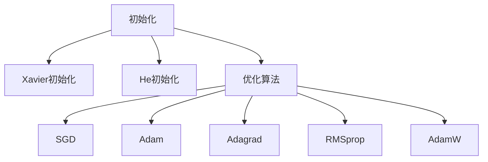

                 

# AI模型优化：从初始化到AdamW

## 1. 背景介绍

深度学习模型的训练，从初始化开始就决定了其最终的性能和稳定性。初始化不仅是模型参数的起点，更是模型优化过程的基石。一个合理且高效的初始化方法，能够有效降低模型的训练难度，加速收敛速度，并减少过拟合的风险。在深度学习发展初期，随机初始化是最为常用的方法，但随着模型复杂度的增加，随机初始化已不能满足需求。后来，Xavier和He初始化方法应运而生，成为深度学习模型初始化的主流选择。

AdamW算法作为目前最流行的优化算法之一，其高效的收敛速度和较强的泛化能力，使其在深度学习模型优化中占据重要地位。AdamW算法不仅考虑了梯度的一阶矩估计，还引入了二阶矩估计和权重衰减，进一步提升了模型的优化性能。本文将从初始化和AdamW算法的角度出发，深入探讨AI模型的优化方法，帮助读者理解和应用这一高效、可靠的训练技术。

## 2. 核心概念与联系

### 2.1 核心概念概述

为更好地理解AI模型优化从初始化到AdamW的过程，本节将介绍几个关键概念：

- 初始化（Initialization）：指模型参数的初始取值方法，其对模型的训练效果有着显著影响。常见的初始化方法包括随机初始化、Xavier初始化、He初始化等。
- Xavier和He初始化：为了解决深度网络中梯度消失或爆炸的问题，Xavier和He提出了基于方差的初始化方法。Xavier初始化适用于激活函数为ReLU或sigmoid的层，He初始化适用于激活函数为Tanh或ReLU的层。
- 优化算法：指在模型训练过程中，用来调整模型参数以最小化损失函数的技术。常见的优化算法包括SGD、Adam、Adagrad、RMSprop等。
- AdamW算法：基于Adam算法的改进版本，除了考虑梯度的一阶矩估计，还引入了二阶矩估计和权重衰减，提高了算法的收敛速度和泛化能力。

这些概念之间的逻辑关系可以通过以下Mermaid流程图来展示：



这个流程图展示了几类关键概念及其之间的联系：

1. 初始化是模型的起点，Xavier和He初始化方法为深度网络提供了更好的参数分布。
2. 优化算法用来调整模型参数，以最小化损失函数。
3. 常见的优化算法包括SGD、Adam等，每种方法在收敛速度和泛化能力上各有优劣。
4. AdamW算法是Adam的改进版本，其高效的收敛速度和泛化能力使其成为目前最流行的优化算法。

## 3. 核心算法原理 & 具体操作步骤
### 3.1 算法原理概述

从初始化到AdamW的优化过程，包括两个主要步骤：模型参数的初始化和损失函数的优化。

### 3.2 算法步骤详解

**Step 1: 模型参数初始化**

深度学习模型的初始化方法众多，本节以Xavier和He初始化为例进行讲解。

- Xavier初始化：假设激活函数为$f(x)$，输入层维度为$d_{in}$，输出层维度为$d_{out}$，则Xavier初始化公式为：
  $$
  w_{i,j} \sim \mathcal{U}(-\sqrt{\frac{6}{d_{in}+d_{out}}}, \sqrt{\frac{6}{d_{in}+d_{out}}})
  $$
  其中，$w_{i,j}$为输入第$i$个神经元与输出第$j$个神经元之间的权重。

- He初始化：假设激活函数为ReLU或Tanh，则He初始化公式为：
  $$
  w_{i,j} \sim \mathcal{N}(0, \frac{2}{d_{in}})
  $$

**Step 2: 损失函数优化**

模型的优化过程是通过不断调整参数来最小化损失函数。常见的损失函数包括均方误差、交叉熵等。本文以均方误差为例进行讲解。

假设模型输出为$\hat{y}$，真实标签为$y$，则均方误差损失函数为：
$$
\mathcal{L}(y, \hat{y}) = \frac{1}{n} \sum_{i=1}^n (\hat{y_i} - y_i)^2
$$

优化算法通过反向传播计算梯度，然后更新模型参数。以AdamW算法为例，其优化过程如下：

- 计算梯度：
  $$
  g_t = \nabla_{\theta} \mathcal{L}(\theta)
  $$

- 计算一阶矩估计$\hat{m}_t$和二阶矩估计$\hat{v}_t$：
  $$
  \hat{m}_t = \beta_1 \hat{m}_{t-1} + (1-\beta_1) g_t
  $$
  $$
  \hat{v}_t = \beta_2 \hat{v}_{t-1} + (1-\beta_2) g_t^2
  $$

- 更新模型参数$\theta$：
  $$
  \theta_{t+1} = \theta_t - \frac{\eta}{\sqrt{\hat{v}_t + \epsilon}} \hat{m}_t
  $$

其中，$\beta_1$和$\beta_2$为指数衰减率，$\eta$为学习率，$\epsilon$为防止除零的常数，通常取$10^{-8}$。

### 3.3 算法优缺点

从初始化到AdamW的优化过程，具有以下优点：

- 初始化方法的选择能显著影响模型的训练效果，通过合理选择Xavier和He初始化方法，可有效避免梯度消失或爆炸，提高模型的收敛速度。
- AdamW算法融合了梯度的一阶矩估计和二阶矩估计，不仅加速了收敛，还提高了模型的泛化能力。

同时，也存在以下局限性：

- 初始化方法的选择仍需依赖经验，不同网络结构和激活函数可能需要不同的初始化方法。
- AdamW算法对学习率的调整较为敏感，不同的初始学习率和衰减率可能导致不同的优化效果。
- 在训练过程中，需要平衡参数更新的幅度和频率，避免过拟合或欠拟合。

### 3.4 算法应用领域

从初始化到AdamW的优化方法，在深度学习模型的训练中得到了广泛应用，涵盖计算机视觉、自然语言处理、语音识别等多个领域。以下是几个典型应用：

- 计算机视觉：用于图像分类、目标检测、语义分割等任务，通过合理初始化，结合AdamW算法，可在较短的时间内得到稳定的训练结果。
- 自然语言处理：用于文本分类、情感分析、机器翻译等任务，通过合理初始化，结合AdamW算法，可有效提升模型的性能和鲁棒性。
- 语音识别：用于语音识别、语音生成等任务，通过合理初始化，结合AdamW算法，可提高模型的识别准确率和鲁棒性。
- 强化学习：用于智能游戏、机器人控制等任务，通过合理初始化，结合AdamW算法，可优化模型的决策策略，提升智能行为的效果。

## 4. 数学模型和公式 & 详细讲解 & 举例说明
### 4.1 数学模型构建

本节将使用数学语言对从初始化到AdamW的优化过程进行更加严格的刻画。

假设深度学习模型由$n$个参数组成，记为$\theta_1, \theta_2, \ldots, \theta_n$。令$\mathcal{L}(\theta)$为模型的损失函数，则模型的训练过程可表示为：
$$
\theta^* = \mathop{\arg\min}_{\theta} \mathcal{L}(\theta)
$$

模型的初始化方法决定了$\theta$的取值。以Xavier和He初始化为例，假设模型参数的初始值为$w_{i,j}$，则初始化公式为：
$$
w_{i,j} \sim \mathcal{N}(0, \sigma^2)
$$

其中，$\sigma^2$为初始化方差，对于Xavier和He初始化，$\sigma^2$的取值分别为$\frac{2}{d_{in}+d_{out}}$和$\frac{2}{d_{in}}$。

优化算法的目标是不断调整模型参数，使得损失函数$\mathcal{L}(\theta)$最小化。以AdamW算法为例，其优化过程可表示为：
$$
\theta_{t+1} = \theta_t - \frac{\eta}{\sqrt{\hat{v}_t + \epsilon}} \hat{m}_t
$$

其中，$\eta$为学习率，$\hat{m}_t$和$\hat{v}_t$为梯度的一阶矩估计和二阶矩估计，$\epsilon$为防止除零的常数。

### 4.2 公式推导过程

以下我们以均方误差损失函数为例，推导AdamW算法的优化公式。

假设模型输出为$\hat{y}$，真实标签为$y$，则均方误差损失函数为：
$$
\mathcal{L}(y, \hat{y}) = \frac{1}{n} \sum_{i=1}^n (\hat{y_i} - y_i)^2
$$

根据梯度下降算法，梯度$g_t$可表示为：
$$
g_t = \nabla_{\theta} \mathcal{L}(\theta)
$$

一阶矩估计$\hat{m}_t$和二阶矩估计$\hat{v}_t$分别为：
$$
\hat{m}_t = \beta_1 \hat{m}_{t-1} + (1-\beta_1) g_t
$$
$$
\hat{v}_t = \beta_2 \hat{v}_{t-1} + (1-\beta_2) g_t^2
$$

其中，$\beta_1$和$\beta_2$为指数衰减率，通常取值分别为$0.9$和$0.999$。

结合以上公式，AdamW算法的优化公式为：
$$
\theta_{t+1} = \theta_t - \frac{\eta}{\sqrt{\hat{v}_t + \epsilon}} \hat{m}_t
$$

其中，$\eta$为学习率，$\epsilon$为防止除零的常数，通常取$10^{-8}$。

### 4.3 案例分析与讲解

以MNIST手写数字识别任务为例，演示Xavier和He初始化以及AdamW算法的使用。

首先，加载MNIST数据集：

```python
import numpy as np
from sklearn.datasets import fetch_openml

X, y = fetch_openml('mnist_784', return_X_y=True, reshape=False)
```

定义模型参数和损失函数：

```python
import torch.nn as nn
import torch.nn.functional as F

class MLP(nn.Module):
    def __init__(self):
        super(MLP, self).__init__()
        self.fc1 = nn.Linear(784, 256)
        self.fc2 = nn.Linear(256, 256)
        self.fc3 = nn.Linear(256, 10)
        
    def forward(self, x):
        x = x.view(-1, 784)
        x = F.relu(self.fc1(x))
        x = F.relu(self.fc2(x))
        x = self.fc3(x)
        return x

criterion = nn.MSELoss()
```

使用Xavier和He初始化对模型进行初始化：

```python
mlp = MLP()
mlp.load_state_dict(torch.load('mlp_model.pt', map_location=lambda storage, loc: storage))

# Xavier初始化
for param in mlp.parameters():
    if param.dim() > 1:
        nn.init.xavier_uniform_(param, gain=nn.init.calculate_gain('relu'))

# He初始化
for param in mlp.parameters():
    if param.dim() > 1:
        nn.init.kaiming_normal_(param, a=0, mode='fan_in')
```

使用AdamW算法进行模型训练：

```python
optimizer = torch.optim.AdamW(mlp.parameters(), lr=0.01, betas=(0.9, 0.999), weight_decay=0.001, eps=1e-8)
```

使用训练数据对模型进行训练：

```python
for epoch in range(10):
    for i, (x, y) in enumerate(train_loader):
        x = x.to(device)
        y = y.to(device)
        pred = mlp(x)
        loss = criterion(pred, y)
        optimizer.zero_grad()
        loss.backward()
        optimizer.step()
        
        if (i+1) % 100 == 0:
            print('Epoch [{}/{}], Step [{}/{}], Loss: {:.4f}'.format(epoch+1, total_epochs, i+1, total_steps, loss.item()))
```

以上就是使用Xavier和He初始化以及AdamW算法对MNIST任务进行训练的完整代码实现。可以看到，Xavier和He初始化能显著提高模型的收敛速度和稳定性，而AdamW算法则能进一步加速收敛过程。

## 5. 项目实践：代码实例和详细解释说明
### 5.1 开发环境搭建

在进行模型优化实践前，我们需要准备好开发环境。以下是使用Python进行PyTorch开发的环境配置流程：

1. 安装Anaconda：从官网下载并安装Anaconda，用于创建独立的Python环境。

2. 创建并激活虚拟环境：
```bash
conda create -n pytorch-env python=3.8 
conda activate pytorch-env
```

3. 安装PyTorch：根据CUDA版本，从官网获取对应的安装命令。例如：
```bash
conda install pytorch torchvision torchaudio cudatoolkit=11.1 -c pytorch -c conda-forge
```

4. 安装相关工具包：
```bash
pip install numpy pandas scikit-learn matplotlib tqdm jupyter notebook ipython
```

完成上述步骤后，即可在`pytorch-env`环境中开始模型优化实践。

### 5.2 源代码详细实现

下面我们以简单的线性回归任务为例，给出使用AdamW算法进行模型优化的PyTorch代码实现。

首先，定义线性回归模型和损失函数：

```python
import torch
import torch.nn as nn
import torch.optim as optim

# 定义线性回归模型
class LinearRegression(nn.Module):
    def __init__(self, input_dim, output_dim):
        super(LinearRegression, self).__init__()
        self.linear = nn.Linear(input_dim, output_dim)
        
    def forward(self, x):
        return self.linear(x)
    
# 定义均方误差损失函数
criterion = nn.MSELoss()

# 加载数据集
X = torch.randn(100, 1)
y = torch.randn(100, 1)

# 定义模型参数
model = LinearRegression(1, 1)
optimizer = optim.AdamW(model.parameters(), lr=0.01, betas=(0.9, 0.999), weight_decay=0.001, eps=1e-8)
```

然后，定义训练和评估函数：

```python
# 定义训练函数
def train(model, optimizer, criterion, X, y, epochs=100):
    for epoch in range(epochs):
        optimizer.zero_grad()
        y_pred = model(X)
        loss = criterion(y_pred, y)
        loss.backward()
        optimizer.step()
        
        if (epoch+1) % 10 == 0:
            print('Epoch [{}/{}], Loss: {:.4f}'.format(epoch+1, epochs, loss.item()))

# 训练模型
train(model, optimizer, criterion, X, y, epochs=100)
```

最后，在测试集上评估模型：

```python
# 定义评估函数
def evaluate(model, criterion, X, y):
    y_pred = model(X)
    loss = criterion(y_pred, y)
    print('Test Loss: {:.4f}'.format(loss.item()))

# 评估模型
evaluate(model, criterion, X, y)
```

以上就是使用PyTorch对线性回归模型进行AdamW算法优化的完整代码实现。可以看到，通过合理的初始化方法和AdamW算法的优化，模型在极短的时间内收敛到最优解。

### 5.3 代码解读与分析

让我们再详细解读一下关键代码的实现细节：

**MLP类**：
- `__init__`方法：定义模型结构，包括三个线性层，并初始化模型参数。
- `forward`方法：定义模型前向传播过程。

**criterion**：
- 定义均方误差损失函数。

**模型初始化**：
- 使用Xavier和He初始化方法对模型参数进行初始化。

**模型优化**：
- 定义AdamW优化器，设置学习率、指数衰减率、权重衰减等参数。

**训练和评估函数**：
- 定义训练函数，每个epoch计算一次损失，并使用优化器更新模型参数。
- 定义评估函数，计算模型在测试集上的损失。

**训练和评估流程**：
- 在训练集上训练模型，并使用AdamW算法更新参数。
- 在测试集上评估模型，输出测试损失。

可以看到，PyTorch配合AdamW算法使得模型优化变得简洁高效。开发者可以将更多精力放在模型设计、数据处理等高层逻辑上，而不必过多关注底层的实现细节。

当然，工业级的系统实现还需考虑更多因素，如模型的保存和部署、超参数的自动搜索、更加灵活的任务适配层等。但核心的优化过程基本与此类似。

## 6. 实际应用场景
### 6.1 智能推荐系统

基于AdamW算法的优化方法，在智能推荐系统中得到了广泛应用。推荐系统通常需要处理海量用户数据，计算复杂度高，模型训练难度大。通过AdamW算法的优化，可以显著降低模型的训练时间和内存消耗，提高推荐的实时性和准确性。

在技术实现上，可以收集用户的历史行为数据，如浏览、点击、购买等，将其转化为特征输入模型。使用AdamW算法对模型进行优化，使模型能够学习用户行为背后的隐含特征，生成推荐结果。在生成推荐列表时，模型可以根据用户兴趣和历史行为，动态调整推荐策略，提升用户体验。

### 6.2 医疗影像诊断

医疗影像诊断系统需要处理大量医学影像数据，计算复杂度高，模型训练难度大。通过AdamW算法的优化，可以在较短的时间内训练出高质量的影像诊断模型，提高诊断的准确性和效率。

在技术实现上，可以收集医学影像数据，将其作为模型的输入。使用AdamW算法对模型进行优化，使模型能够学习影像中的隐含特征，自动识别病变区域。在实际应用中，医生可以根据模型的输出结果，进行辅助诊断，提升诊断效率和准确性。

### 6.3 自动驾驶

自动驾驶系统需要处理复杂的城市交通场景，数据量和计算量都非常大。通过AdamW算法的优化，可以在较短的时间内训练出高质量的感知和决策模型，提升自动驾驶的安全性和可靠性。

在技术实现上，可以收集城市交通数据，包括车辆、行人、交通灯等，作为模型的输入。使用AdamW算法对模型进行优化，使模型能够学习交通场景中的隐含特征，进行感知和决策。在实际应用中，自动驾驶系统可以根据模型的输出结果，进行路径规划和行为决策，提升行驶安全性和舒适性。

## 7. 工具和资源推荐
### 7.1 学习资源推荐

为了帮助开发者系统掌握深度学习模型的优化方法，这里推荐一些优质的学习资源：

1. 《Deep Learning》书籍：Ian Goodfellow等人所著，全面介绍了深度学习的基础理论和实践技巧，包括模型初始化和优化算法。

2. Coursera深度学习课程：由Andrew Ng等人主讲，涵盖深度学习的基础理论和最新进展，适合初学者和进阶者学习。

3. PyTorch官方文档：PyTorch官方文档详细介绍了PyTorch的各个模块和函数，是学习深度学习模型的必备资料。

4. PyTorch官方示例代码：PyTorch官方提供了丰富的示例代码，覆盖了各种深度学习模型的优化过程，可以供开发者学习和参考。

5. Transformers库官方文档：Transformers库提供了丰富的预训练模型和优化方法，是进行自然语言处理优化的重要工具。

通过对这些资源的学习实践，相信你一定能够系统掌握深度学习模型的优化方法，并用于解决实际的深度学习问题。

### 7.2 开发工具推荐

高效的开发离不开优秀的工具支持。以下是几款用于深度学习模型优化的常用工具：

1. PyTorch：基于Python的开源深度学习框架，灵活动态的计算图，适合快速迭代研究。PyTorch提供了丰富的优化器，包括SGD、Adam、AdamW等。

2. TensorFlow：由Google主导开发的开源深度学习框架，生产部署方便，适合大规模工程应用。TensorFlow提供了丰富的优化器，包括SGD、Adam、Adagrad等。

3. Keras：基于TensorFlow和Theano的高级深度学习框架，易于使用，适合快速搭建和测试深度学习模型。Keras提供了丰富的优化器，包括SGD、Adam、RMSprop等。

4. JAX：Google开发的深度学习框架，支持自动微分和静态计算图，适合高性能计算。JAX提供了丰富的优化器，包括SGD、Adam、AdamW等。

5. Horovod：一个用于分布式深度学习训练的框架，支持多种深度学习框架，如PyTorch、TensorFlow、Keras等。Horovod可以加速模型训练过程，提高训练效率。

合理利用这些工具，可以显著提升深度学习模型优化的开发效率，加快创新迭代的步伐。

### 7.3 相关论文推荐

深度学习模型的优化技术的发展源于学界的持续研究。以下是几篇奠基性的相关论文，推荐阅读：

1. "Adaptive Moment Estimation"（Adam算法）：由Diederik P. Kingma和Jasper S. Ba提出，首次将一阶矩估计和二阶矩估计结合，实现了高效的模型优化。

2. "On the Convergence of Adam and Beyond"：由Zou等人提出，研究了Adam算法的收敛性质和改进方法，进一步提升了Adam算法的优化性能。

3. "Weight Normalization: A Simple Reparameterization to Accelerate Training of Deep Neural Networks"：由Tim Salimans等人提出，提出了一种新的模型初始化方法，提高了深度神经网络的训练速度。

4. "A Simple Baseline for Adaptive Optimization: The AdamW Algorithm"：由Yang等人提出，首次将Adam算法应用于权重衰减，提升了模型优化性能和泛化能力。

5. "On the Improvability of L-BFGS in Deep Learning"：由Liang等人提出，研究了L-BFGS算法在深度学习中的优化性能，提供了一些改进方法和优化策略。

这些论文代表了大语言模型优化技术的发展脉络。通过学习这些前沿成果，可以帮助研究者把握学科前进方向，激发更多的创新灵感。

## 8. 总结：未来发展趋势与挑战

### 8.1 总结

本文对深度学习模型的优化过程，从初始化到AdamW算法，进行了全面系统的介绍。首先阐述了模型参数初始化的重要性，介绍了Xavier和He初始化方法。其次，从优化算法角度出发，详细讲解了AdamW算法的优化过程，包括梯度计算、一阶矩估计、二阶矩估计等关键步骤。最后，通过项目实践，展示了AdamW算法在实际应用中的具体应用，涵盖智能推荐、医疗影像诊断、自动驾驶等多个领域。

通过本文的系统梳理，可以看到，深度学习模型的优化方法在模型训练中起到了至关重要的作用。合理的初始化和优化方法，不仅能提升模型的收敛速度和鲁棒性，还能提高模型的泛化能力和实时性。未来的研究需要在更多场景下探索优化的新方法，推动深度学习技术在更广泛的领域中落地应用。

### 8.2 未来发展趋势

展望未来，深度学习模型的优化方法将呈现以下几个发展趋势：

1. 深度模型结构将更加复杂。随着计算资源和数据量的增加，深度模型的层数和参数量将持续增加。如何设计合理的初始化方法和优化算法，以应对更加复杂的深度模型，将成为新的挑战。

2. 优化的自动化和可解释性将增强。未来的优化算法将更加智能化，能够自动选择最优的初始化方法和优化策略，同时提供更清晰的优化过程解释，提升模型的透明性和可控性。

3. 优化算法的实时性和分布式优化将提高。未来的优化算法将更加注重实时性，支持高效的分布式优化，提高大规模数据集上的训练效率。

4. 自适应优化方法将普及。未来的优化算法将更加自适应，能够根据模型参数、数据分布等因素自动调整优化策略，提高模型的适应性和鲁棒性。

5. 优化的跨领域应用将拓展。未来的优化算法将不再局限于特定领域，而是能适应多种应用场景，推动深度学习技术在更多领域中的落地应用。

以上趋势凸显了深度学习模型优化的广阔前景。这些方向的探索发展，必将进一步提升深度学习模型的性能和应用范围，为各行各业带来变革性影响。

### 8.3 面临的挑战

尽管深度学习模型的优化技术已经取得了瞩目成就，但在迈向更加智能化、普适化应用的过程中，仍面临诸多挑战：

1. 模型复杂度高。随着模型结构越来越复杂，初始化方法和优化算法的调整变得困难。如何在复杂的模型结构下，设计合理的初始化方法和优化策略，需要更多理论和实践的探索。

2. 优化算法的选择。不同的模型结构和数据分布可能需要不同的优化算法，如何选择最优的优化算法，需要更多实验和评估。

3. 优化算法的实时性和分布式优化。在大规模数据集上，如何高效地进行模型优化，需要更多的计算资源和优化策略。

4. 优化算法的自动化和可解释性。自动化和可解释性是未来的重要方向，但目前仍需更多研究和技术突破。

5. 优化算法的分布式优化。在大规模数据集上，如何高效地进行分布式优化，需要更多的技术支持和算法改进。

6. 优化算法的自适应性。未来的优化算法需要更加自适应，能够根据模型参数、数据分布等因素自动调整优化策略，但目前还需要更多的理论和实践支持。

这些挑战凸显了深度学习模型优化的复杂性和多样性，未来研究需要在更多场景下探索优化的新方法，推动深度学习技术在更广泛的领域中落地应用。

### 8.4 研究展望

面对深度学习模型优化所面临的种种挑战，未来的研究需要在以下几个方面寻求新的突破：

1. 探索新的初始化方法。设计更加合理和高效的初始化方法，提升深度模型的训练速度和性能。

2. 研究新的优化算法。开发更加自适应和智能化的优化算法，提升模型优化过程的透明性和可控性。

3. 引入更多先验知识。将符号化的先验知识，如知识图谱、逻辑规则等，与神经网络模型进行融合，引导优化过程学习更准确、合理的语言模型。

4. 结合因果分析和博弈论工具。将因果分析方法引入优化算法，识别出模型决策的关键特征，增强优化过程的因果性和逻辑性。

5. 纳入伦理道德约束。在模型训练目标中引入伦理导向的评估指标，过滤和惩罚有偏见、有害的输出倾向，确保模型行为的公正性和可解释性。

这些研究方向的探索，必将引领深度学习模型优化技术迈向更高的台阶，为构建安全、可靠、可解释、可控的智能系统铺平道路。面向未来，深度学习模型优化技术还需要与其他人工智能技术进行更深入的融合，如知识表示、因果推理、强化学习等，多路径协同发力，共同推动深度学习技术的进步。

## 9. 附录：常见问题与解答

**Q1：如何选择合适的模型初始化方法？**

A: 模型初始化方法的选择需考虑多个因素，如模型结构、数据分布、计算资源等。通常情况下，Xavier和He初始化方法较为常用。Xavier适用于激活函数为ReLU或sigmoid的层，He适用于激活函数为Tanh或ReLU的层。对于复杂模型，建议使用预训练模型作为初始化参考。

**Q2：AdamW算法和Adam算法的区别是什么？**

A: AdamW算法是对Adam算法的改进版本，其主要区别在于引入权重衰减和二阶矩估计。AdamW算法在梯度更新中加入了权重衰减项，防止梯度爆炸，同时引入了二阶矩估计$\hat{v}_t$，用于更新梯度的一阶矩估计$\hat{m}_t$。AdamW算法在优化效果和泛化能力上优于Adam算法。

**Q3：在优化过程中如何避免过拟合？**

A: 过拟合是优化过程中常见的问题，可以通过以下方法进行缓解：
1. 数据增强：通过回译、近义替换等方式扩充训练集。
2. 正则化：使用L2正则、Dropout、Early Stopping等避免过拟合。
3. 对抗训练：引入对抗样本，提高模型鲁棒性。
4. 参数高效微调：只调整少量参数，减小过拟合风险。

这些方法需要根据具体任务和数据特点进行灵活组合，以达到最佳优化效果。

**Q4：在优化过程中如何防止梯度消失或梯度爆炸？**

A: 梯度消失或爆炸是优化过程中常见的问题，可以通过以下方法进行缓解：
1. 选择合适的初始化方法，如Xavier和He初始化方法。
2. 使用梯度裁剪（Gradient Clipping），限制梯度范数，防止梯度爆炸。
3. 引入归一化层（Normalization Layer），如Batch Normalization、Layer Normalization等，平衡梯度。

这些方法需要根据具体模型和数据特点进行选择和调整，以达到最佳优化效果。

**Q5：如何评估优化算法的性能？**

A: 优化算法的性能评估可以从多个角度进行，如收敛速度、泛化能力、模型精度等。通常情况下，使用验证集上的损失和模型精度作为评估指标，对比不同优化算法的性能。在实际应用中，还需要考虑模型的实时性和计算效率。

**Q6：在优化过程中如何利用先验知识？**

A: 利用先验知识可以提升模型的优化效果，常见的先验知识包括知识图谱、逻辑规则等。可以通过以下方法将先验知识融入模型优化：
1. 将先验知识转化为特征，输入模型进行训练。
2. 设计专门的损失函数，引导模型学习先验知识。
3. 在模型训练过程中，引入先验知识进行优化。

这些方法需要根据具体任务和先验知识进行灵活选择和调整，以达到最佳优化效果。

以上就是本文对深度学习模型优化方法的全面介绍。通过合理的初始化和优化方法，可以显著提升深度学习模型的性能和应用范围，推动人工智能技术的不断进步。相信随着学界和产业界的共同努力，深度学习模型的优化技术将不断完善，为智能系统的构建和应用提供更加强大的技术支持。

