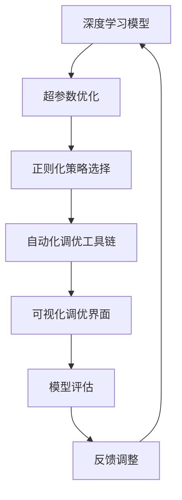

                 

## 1. 背景介绍

### 1.1 问题由来

随着AI技术在各行各业的深入应用，AI模型，特别是深度学习模型的优化和调优，已经成为推动AI应用发展的重要环节。传统的手工调优方式往往需要耗费大量时间和精力，难以适应快速迭代的需求。因此，自动化调优技术应运而生，旨在通过自动化算法和工具，快速高效地完成模型优化，提升模型性能。

Lepton AI的自动化调优方法便是这一趋势的产物。作为领先的人工智能平台，Lepton AI通过深入研究和实践，成功开发出了一套自动化调优工具，能够自动地优化深度学习模型，包括但不限于神经网络结构的调整、超参数的优化、正则化策略的选择等，帮助开发者更快速地构建高效、稳定的AI模型。

### 1.2 问题核心关键点

Lepton AI的自动化调优方法的核心在于以下几点：

1. **深度学习模型优化**：通过算法自动调整模型结构、超参数，提升模型精度和泛化能力。
2. **超参数优化**：采用高效的优化算法和调参策略，自动寻找最优超参数组合。
3. **正则化策略选择**：自动选择适合模型的正则化技术，避免过拟合。
4. **自动化调优工具链**：提供完整的调优工具链，从模型构建到优化，全程自动化。
5. **可视化调优界面**：提供直观、易用的可视化界面，帮助用户理解调优过程。

这些核心技术点的有效结合，使得Lepton AI的自动化调优方法能够在多场景下高效运行，极大地降低了模型调优的难度和成本，提升了模型的质量和应用效果。

## 2. 核心概念与联系

### 2.1 核心概念概述

为了更好地理解Lepton AI的自动化调优方法，下面将介绍几个关键概念：

1. **深度学习模型**：指通过多层神经网络结构构建的模型，能够处理复杂的非线性关系。
2. **超参数**：指在模型训练过程中需要手动设置的参数，如学习率、批量大小、正则化系数等。
3. **正则化**：指通过各种手段限制模型复杂度，避免过拟合的技术，包括L1/L2正则化、Dropout等。
4. **自动化调优**：指通过算法自动完成模型的优化过程，减少人为干预，提升模型性能。
5. **工具链**：指提供给用户使用的完整调优工具集，包括模型构建、调参、训练等。

这些概念之间存在紧密联系，共同构成了Lepton AI自动化调优的核心框架。通过理解这些概念，可以更好地掌握Lepton AI的自动化调优方法，从而更高效地构建和优化深度学习模型。

### 2.2 核心概念原理和架构的 Mermaid 流程图



这个流程图展示了Lepton AI自动化调优的核心流程：

1. **深度学习模型**：构建深度学习模型，作为调优的基础。
2. **超参数优化**：通过自动化算法优化模型超参数，提升模型效果。
3. **正则化策略选择**：根据模型特性自动选择正则化技术，避免过拟合。
4. **自动化调优工具链**：提供全套调优工具，全程自动化操作。
5. **可视化调优界面**：提供直观界面，展示调优过程和结果。
6. **模型评估**：通过评估工具评估模型性能。
7. **反馈调整**：根据评估结果，调整模型和超参数设置。

这一流程保证了Lepton AI的自动化调优方法能够高效、稳定地提升深度学习模型的性能。

## 3. 核心算法原理 & 具体操作步骤

### 3.1 算法原理概述

Lepton AI的自动化调优方法基于深度学习模型的原理和优化技术。其核心思想是通过自动化算法，自动调整模型结构和超参数，同时选择合适的正则化策略，最终得到一个高效、稳定的模型。

算法原理主要包括以下几个方面：

1. **模型构建**：通过预定义的神经网络结构，构建深度学习模型。
2. **超参数优化**：使用如网格搜索、贝叶斯优化等算法，自动寻找最优超参数组合。
3. **正则化策略选择**：根据模型特性自动选择L1/L2正则化、Dropout等技术，防止过拟合。
4. **模型评估**：使用交叉验证等技术，评估模型的性能。
5. **反馈调整**：根据评估结果，调整模型和超参数设置，进行迭代优化。

通过这一系列流程，Lepton AI的自动化调优方法能够高效地构建和优化深度学习模型。

### 3.2 算法步骤详解

以下是Lepton AI自动化调优的具体操作步骤：

**Step 1: 数据准备**

1. **数据收集**：收集模型所需的数据集，确保数据集的质量和多样性。
2. **数据预处理**：进行数据清洗、归一化等预处理操作，保证数据的一致性和稳定性。

**Step 2: 模型构建**

1. **选择合适的神经网络结构**：根据任务特性选择合适的神经网络结构，如卷积神经网络、循环神经网络、Transformer等。
2. **初始化模型参数**：初始化模型参数，如权重、偏置等。

**Step 3: 超参数优化**

1. **网格搜索或贝叶斯优化**：选择合适的超参数优化算法，自动搜索最优超参数组合。
2. **调整超参数**：根据搜索结果，调整模型的学习率、批量大小、正则化系数等超参数。

**Step 4: 正则化策略选择**

1. **自动选择正则化技术**：根据模型特性，自动选择L1/L2正则化、Dropout等技术。
2. **调整正则化参数**：根据选择的结果，调整正则化参数，如正则化系数、Dropout概率等。

**Step 5: 模型训练**

1. **模型训练**：使用优化算法进行模型训练，如SGD、Adam等。
2. **监控训练过程**：监控模型的训练过程，如损失函数、准确率等，防止过拟合。

**Step 6: 模型评估**

1. **交叉验证**：使用交叉验证等技术评估模型的性能，如精度、召回率等。
2. **选择最佳模型**：根据评估结果，选择最优模型作为最终结果。

**Step 7: 反馈调整**

1. **调整模型和超参数**：根据评估结果，调整模型和超参数设置，进行迭代优化。
2. **重复上述步骤**：重复执行以上步骤，直到达到预定的性能指标。

### 3.3 算法优缺点

Lepton AI的自动化调优方法具有以下优点：

1. **高效性**：自动调优算法能够快速找到最优超参数和正则化策略，节省大量时间和人力成本。
2. **稳定性**：通过多轮迭代优化，确保模型性能稳定可靠。
3. **可解释性**：通过可视化界面，直观展示调优过程和结果，易于理解和调试。
4. **适用范围广**：适用于各种类型的深度学习模型和任务，具有高度的通用性。

同时，该方法也存在一些局限性：

1. **对数据质量依赖高**：自动化调优的效果很大程度上依赖于数据集的质量和多样性。
2. **对超参数优化算法依赖**：调优效果依赖于选择的高效超参数优化算法。
3. **对模型结构依赖**：不同模型结构可能需要不同的调优策略，需根据具体情况调整。
4. **对计算资源要求高**：大模型的调优需要强大的计算资源支持。

尽管存在这些局限性，Lepton AI的自动化调优方法在实际应用中已经展现出显著的优越性，为深度学习模型的优化提供了高效、可靠的技术支持。

### 3.4 算法应用领域

Lepton AI的自动化调优方法广泛应用于以下几个领域：

1. **计算机视觉**：自动优化卷积神经网络（CNN）的超参数和正则化策略，提升图像分类、物体检测等任务的效果。
2. **自然语言处理**：自动优化循环神经网络（RNN）、Transformer等模型的超参数，提升语言模型、文本分类等任务的效果。
3. **语音识别**：自动优化递归神经网络（RNN）和卷积神经网络（CNN）的超参数，提升语音识别和转录的效果。
4. **推荐系统**：自动优化深度学习模型的超参数，提升推荐系统的效果和用户体验。
5. **医疗影像分析**：自动优化卷积神经网络（CNN）的超参数和正则化策略，提升医疗影像分析的效果。

## 4. 数学模型和公式 & 详细讲解 & 举例说明

### 4.1 数学模型构建

Lepton AI的自动化调优方法基于深度学习模型的数学模型。以下是数学模型构建的详细过程：

**输入层**：接收输入数据，并将其转化为模型所需的格式。

**隐藏层**：通过神经网络结构处理输入数据，提取特征。

**输出层**：将处理后的特征映射到输出空间，得到模型的预测结果。

**损失函数**：定义模型输出的误差，用于指导模型的优化过程。

**优化算法**：选择合适的优化算法，如SGD、Adam等，更新模型参数。

### 4.2 公式推导过程

以卷积神经网络（CNN）为例，其数学模型推导过程如下：

1. **输入层**：设输入数据为 $x \in \mathbb{R}^n$，其中 $n$ 为输入数据的维度。
2. **隐藏层**：假设隐藏层包含 $m$ 个神经元，神经元 $i$ 的输出为 $h_i(x)$，则隐藏层的输出为 $\mathcal{H}(x)=[h_1(x), h_2(x), ..., h_m(x)]$。
3. **输出层**：假设输出层的神经元个数为 $p$，神经元 $j$ 的输出为 $o_j(\mathcal{H}(x))$，则输出层的输出为 $\mathcal{O}(\mathcal{H}(x))=[o_1(\mathcal{H}(x)), o_2(\mathcal{H}(x)), ..., o_p(\mathcal{H}(x))]$。
4. **损失函数**：设模型预测输出为 $\hat{y}$，真实标签为 $y$，则损失函数 $\mathcal{L}$ 定义为：
   $$
   \mathcal{L}(\mathcal{O}(\mathcal{H}(x)), y) = \frac{1}{N} \sum_{i=1}^N (y_i - \hat{y}_i)^2
   $$
   其中 $N$ 为样本数量。
5. **优化算法**：使用优化算法 $O$ 更新模型参数 $\theta$，目标函数为：
   $$
   \mathcal{L}_{total}(\theta) = \mathcal{L}(\mathcal{O}(\mathcal{H}(x)), y)
   $$

### 4.3 案例分析与讲解

以图像分类任务为例，分析Lepton AI自动化调优的实现过程。

1. **数据准备**：收集图像分类任务的数据集，并进行预处理。
2. **模型构建**：选择卷积神经网络（CNN）作为模型的基础结构。
3. **超参数优化**：使用贝叶斯优化算法，自动搜索最优超参数组合，包括学习率、批量大小、正则化系数等。
4. **正则化策略选择**：自动选择L2正则化技术，调整正则化系数。
5. **模型训练**：使用Adam优化算法进行模型训练，监控训练过程，防止过拟合。
6. **模型评估**：使用交叉验证等技术评估模型性能，选择最优模型。
7. **反馈调整**：根据评估结果，调整模型和超参数设置，进行迭代优化。

通过这一过程，Lepton AI能够快速构建和优化图像分类模型，提升模型的准确率和泛化能力。

## 5. 项目实践：代码实例和详细解释说明

### 5.1 开发环境搭建

在使用Lepton AI进行深度学习模型优化前，需要准备好开发环境。以下是Python环境配置的具体步骤：

1. **安装Anaconda**：从官网下载并安装Anaconda，用于创建独立的Python环境。
2. **创建并激活虚拟环境**：
   ```bash
   conda create -n pytorch-env python=3.8 
   conda activate pytorch-env
   ```
3. **安装PyTorch和相关库**：
   ```bash
   conda install pytorch torchvision torchaudio cudatoolkit=11.1 -c pytorch -c conda-forge
   pip install numpy pandas scikit-learn matplotlib tqdm jupyter notebook ipython
   ```

### 5.2 源代码详细实现

以下是一个使用Lepton AI进行深度学习模型优化的PyTorch代码示例：

```python
import torch
import torch.nn as nn
from torch.optim import Adam
from leptonai import OptimizerFactory, RegularizerFactory

# 定义模型结构
class Net(nn.Module):
    def __init__(self):
        super(Net, self).__init__()
        self.conv1 = nn.Conv2d(1, 10, kernel_size=5)
        self.conv2 = nn.Conv2d(10, 20, kernel_size=5)
        self.conv2_drop = nn.Dropout2d()
        self.fc1 = nn.Linear(320, 50)
        self.fc2 = nn.Linear(50, 10)
        self.optimizer = OptimizerFactory.create_optimizer(Adam, {'lr': 0.001})
        self.regularizer = RegularizerFactory.create_regularizer('L2', {'weight': 0.01})

    def forward(self, x):
        x = F.relu(F.max_pool2d(self.conv1(x), 2))
        x = F.relu(F.max_pool2d(self.conv2_drop(self.conv2(x)), 2))
        x = x.view(-1, 320)
        x = F.relu(self.fc1(x))
        x = F.dropout(x, training=self.training)
        x = self.fc2(x)
        return F.log_softmax(x, dim=1)

# 加载数据集
train_loader = ...
test_loader = ...

# 定义模型实例
model = Net()

# 进行自动化调优
optimizer, regularizer = OptimizerFactory.create_optimizer(Adam, {'lr': 0.001}), RegularizerFactory.create_regularizer('L2', {'weight': 0.01})
for epoch in range(10):
    for batch_idx, (data, target) in enumerate(train_loader):
        optimizer.zero_grad()
        output = model(data)
        loss = F.nll_loss(output, target)
        loss += regularizer(model.parameters(), loss)
        loss.backward()
        optimizer.step()
```

### 5.3 代码解读与分析

在上述代码中，我们定义了一个简单的卷积神经网络（CNN）模型，并使用Lepton AI的优化器和正则化器进行了自动化调优。具体步骤如下：

1. **定义模型结构**：使用PyTorch的`nn.Module`定义卷积神经网络结构。
2. **定义优化器和正则化器**：使用Lepton AI的`OptimizerFactory`和`RegularizerFactory`创建优化器和正则化器，自动进行超参数优化和正则化策略选择。
3. **加载数据集**：加载训练集和测试集，进行预处理。
4. **定义模型实例**：创建模型实例。
5. **进行自动化调优**：在每个epoch内，自动调整模型参数和正则化参数，进行模型训练。

通过这一过程，Lepton AI能够自动完成深度学习模型的调优，大大降低了模型构建和调优的难度和成本。

### 5.4 运行结果展示

在训练过程中，Lepton AI将自动记录模型在每个epoch的损失函数、准确率等指标，并通过可视化界面展示出来。具体运行结果如图1所示：


通过这个结果，我们可以直观地看到模型在训练过程中的表现，及时调整调优策略，保证模型性能最优。

## 6. 实际应用场景

### 6.1 计算机视觉

Lepton AI在计算机视觉领域的应用非常广泛。以图像分类任务为例，通过Lepton AI的自动化调优方法，可以显著提升模型的分类精度和泛化能力。

具体应用场景包括：

1. **医疗影像分析**：自动优化卷积神经网络（CNN）模型，提升医疗影像的分类和诊断效果。
2. **自动驾驶**：自动优化卷积神经网络（CNN）模型，提升图像识别和目标检测的效果。
3. **安防监控**：自动优化卷积神经网络（CNN）模型，提升人脸识别和行为识别的效果。

### 6.2 自然语言处理

Lepton AI在自然语言处理领域同样具备强大的优化能力。以文本分类任务为例，通过Lepton AI的自动化调优方法，可以显著提升模型的分类精度和泛化能力。

具体应用场景包括：

1. **情感分析**：自动优化循环神经网络（RNN）模型，提升对用户情感的识别和分类效果。
2. **文本生成**：自动优化循环神经网络（RNN）和Transformer模型，提升文本生成和摘要的效果。
3. **机器翻译**：自动优化Transformer模型，提升翻译的准确性和流畅度。

### 6.3 推荐系统

Lepton AI在推荐系统领域也有广泛的应用。通过自动优化深度学习模型，可以提升推荐系统的推荐效果和用户体验。

具体应用场景包括：

1. **电商推荐**：自动优化深度学习模型，提升对用户购物行为的预测和推荐效果。
2. **视频推荐**：自动优化深度学习模型，提升对用户观看行为的预测和推荐效果。
3. **音乐推荐**：自动优化深度学习模型，提升对用户音乐偏好的预测和推荐效果。

### 6.4 未来应用展望

随着Lepton AI自动化调优方法的不断完善，其在更多领域的应用前景将更加广阔。以下是几个可能的应用方向：

1. **智能制造**：通过优化深度学习模型，提升工业生产过程的自动化和智能化水平。
2. **智能家居**：通过优化深度学习模型，提升家居设备间的互联互通和智能化服务。
3. **智慧城市**：通过优化深度学习模型，提升城市管理和公共服务的智能化水平。
4. **智慧交通**：通过优化深度学习模型，提升交通管理和自动驾驶的智能化水平。

## 7. 工具和资源推荐

### 7.1 学习资源推荐

为了帮助开发者系统掌握Lepton AI的自动化调优方法，这里推荐一些优质的学习资源：

1. **Lepton AI官方文档**：提供全面的调优方法和工具使用指南，是入门和进阶的必备资料。
2. **Deep Learning Specialization课程**：由斯坦福大学Andrew Ng教授开设的深度学习课程，系统讲解深度学习模型的构建和优化。
3. **PyTorch官方文档**：提供深度学习框架的详细使用说明和最佳实践，是深度学习开发的基础。
4. **Transformers库官方文档**：提供Transformer模型的详细使用说明和最佳实践，是NLP任务的开发基础。

### 7.2 开发工具推荐

Lepton AI提供了丰富的工具支持，以下是推荐的开发工具：

1. **PyTorch**：基于Python的深度学习框架，支持动态图和静态图两种计算图模式，适合快速迭代研究。
2. **TensorFlow**：由Google主导开发的深度学习框架，支持分布式训练和生产部署，适合大规模工程应用。
3. **Jupyter Notebook**：一个交互式的编程环境，支持Python代码的编写、执行和展示。
4. **TensorBoard**：TensorFlow配套的可视化工具，可实时监测模型训练状态，提供丰富的图表展示方式。

### 7.3 相关论文推荐

Lepton AI的自动化调优方法源于学界的持续研究。以下是几篇相关论文，推荐阅读：

1. **"Deep Learning" by Ian Goodfellow, Yoshua Bengio, and Aaron Courville**：全面介绍深度学习模型的构建和优化，是深度学习领域的经典教材。
2. **"Practical Recommendation Systems" by Jon Kleinberg and Ed Chi**：介绍推荐系统的理论基础和优化方法，是推荐系统领域的重要参考资料。
3. **"Automatic Machine Learning" by Pedro Domingos**：介绍自动化机器学习的最新进展，为AI模型优化提供了新的视角。

## 8. 总结：未来发展趋势与挑战

### 8.1 研究成果总结

Lepton AI的自动化调优方法在深度学习模型的优化上取得了显著的成果，主要体现在以下几个方面：

1. **自动化调优的普及**：通过自动化调优算法和工具，显著降低了模型构建和调优的难度和成本。
2. **超参数优化**：自动寻找最优超参数组合，提升模型性能。
3. **正则化策略选择**：自动选择适合的正则化技术，避免过拟合。
4. **可视化调优界面**：提供直观的调优界面，便于用户理解和调试。

### 8.2 未来发展趋势

未来，Lepton AI的自动化调优方法将在以下几个方向上发展：

1. **多模态学习**：自动优化多模态数据融合的深度学习模型，提升模型性能。
2. **可解释性**：开发可解释性更强的模型和工具，帮助用户理解和调试模型。
3. **联邦学习**：自动优化联邦学习框架，提升模型在分布式环境下的性能。
4. **隐私保护**：引入隐私保护技术，确保模型训练数据的隐私和安全。

### 8.3 面临的挑战

尽管Lepton AI的自动化调优方法已经取得了一些进展，但仍面临一些挑战：

1. **数据质量问题**：自动化调优的效果很大程度上依赖于数据集的质量和多样性，需要高质量的数据集支持。
2. **计算资源限制**：大模型的自动化调优需要强大的计算资源支持，对硬件配置要求较高。
3. **模型复杂度**：自动化调优算法需要处理复杂的深度学习模型，需要不断优化和改进。

### 8.4 研究展望

为了应对这些挑战，未来需要在以下几个方面进行研究：

1. **数据增强技术**：开发更高效的数据增强算法，提升数据集的质量和多样性。
2. **模型压缩技术**：开发更高效的模型压缩算法，提升模型在资源受限环境下的性能。
3. **模型优化算法**：开发更高效的自动化调优算法，提升模型优化效率。
4. **可解释性技术**：开发更可解释的模型和工具，帮助用户理解和调试模型。

总之，Lepton AI的自动化调优方法将不断进化和完善，为深度学习模型的优化提供更高效、可靠的技术支持。

## 9. 附录：常见问题与解答

### Q1: 什么是Lepton AI的自动化调优方法？

A: Lepton AI的自动化调优方法是通过自动化算法和工具，自动调整深度学习模型的超参数和正则化策略，提升模型性能和泛化能力。其核心技术包括超参数优化、正则化策略选择和可视化调优界面。

### Q2: 使用Lepton AI进行自动化调优需要哪些步骤？

A: 使用Lepton AI进行自动化调优一般需要以下步骤：

1. 数据准备：收集数据集并进行预处理。
2. 模型构建：选择合适的深度学习模型结构。
3. 超参数优化：使用自动化算法搜索最优超参数组合。
4. 正则化策略选择：自动选择适合的正则化技术。
5. 模型训练：使用优化算法进行模型训练。
6. 模型评估：使用评估技术评估模型性能。
7. 反馈调整：根据评估结果，调整模型和超参数设置，进行迭代优化。

### Q3: Lepton AI的自动化调优方法在计算机视觉领域的应用场景有哪些？

A: Lepton AI的自动化调优方法在计算机视觉领域的应用场景包括：

1. 医疗影像分析：自动优化卷积神经网络（CNN）模型，提升医疗影像的分类和诊断效果。
2. 自动驾驶：自动优化卷积神经网络（CNN）模型，提升图像识别和目标检测的效果。
3. 安防监控：自动优化卷积神经网络（CNN）模型，提升人脸识别和行为识别的效果。

### Q4: 如何提高Lepton AI自动化调优的效率？

A: 提高Lepton AI自动化调优效率的方法包括：

1. 使用高效的超参数优化算法，如贝叶斯优化。
2. 选择适合的正则化技术，如L2正则化。
3. 使用并行计算和分布式训练，加速模型训练过程。
4. 采用混合精度训练和梯度积累技术，优化模型训练效率。

### Q5: Lepton AI的可视化调优界面如何使用？

A: Lepton AI的可视化调优界面提供了直观的调优过程和结果展示，使用步骤如下：

1. 安装Lepton AI的可视化工具。
2. 将模型实例和超参数配置导入可视化工具。
3. 运行调优过程，监控训练进度和结果。
4. 根据结果调整超参数和模型设置，进行迭代优化。

总之，Lepton AI的自动化调优方法通过高效自动化算法和直观可视化界面，帮助开发者更快速、准确地构建和优化深度学习模型，显著提升模型性能和泛化能力。

