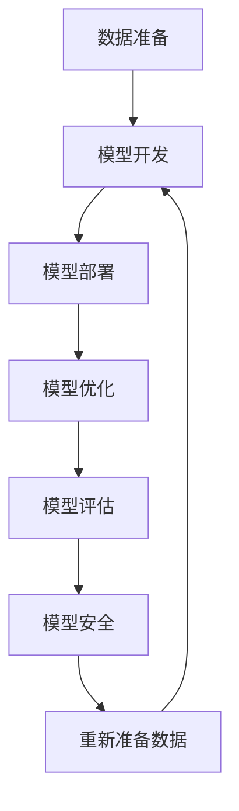

                 

# AI模型的生命周期管理：Lepton AI的全程服务

> 关键词：AI模型管理, 模型开发, 模型部署, 模型优化, 模型监控, 模型评估, 模型安全

## 1. 背景介绍

### 1.1 问题由来

随着人工智能技术的快速发展，越来越多的企业开始引入AI模型来提升业务效率和竞争力。然而，AI模型的生命周期管理（Model Lifecycle Management, ML-LM）却是一个复杂且多维度的任务。从数据准备、模型训练、模型部署、模型优化到模型退役，每一个环节都需要精心设计和持续维护。如何在保证模型质量的同时，提高效率、降低成本，成为当下AI应用的重要课题。

Lepton AI作为一种全面且高效的AI模型管理解决方案，通过提供从模型开发到退役的全过程服务，帮助企业实现AI模型的高效、安全、可靠部署。Lepton AI注重模型的全生命周期管理，涵盖了数据准备、模型训练、模型部署、模型优化、模型监控、模型评估和模型安全等各个环节，确保企业AI应用的成功实施。

### 1.2 问题核心关键点

Lepton AI模型的生命周期管理主要包括以下关键点：

- **数据准备**：数据采集、清洗、标注和预处理，确保高质量的数据输入。
- **模型开发**：模型设计、模型训练和调优，构建高效、准确的模型。
- **模型部署**：模型上线和集成，实现模型在实际应用中的高效运行。
- **模型优化**：实时监控、持续优化，保持模型的高效性能。
- **模型评估**：全面评估模型性能，确保其满足业务需求。
- **模型安全**：保护模型免受恶意攻击和数据泄露，保障模型安全。

这些关键点共同构成了一个完整的AI模型生命周期管理流程，帮助企业在AI应用过程中实现全面且高效的管理。

## 2. 核心概念与联系

### 2.1 核心概念概述

为更好地理解Lepton AI模型生命周期管理的核心概念，本节将介绍几个密切相关的核心概念：

- **AI模型管理**：涉及AI模型的全生命周期管理，包括数据准备、模型训练、模型部署、模型优化、模型监控、模型评估和模型安全等各个环节。
- **模型开发**：从模型设计、特征工程、模型训练到调优的过程，构建满足业务需求的模型。
- **模型部署**：将训练好的模型上线并集成到实际应用中，实现高效运行。
- **模型优化**：通过持续监控和调优，确保模型的高效性能。
- **模型评估**：通过全面评估，确保模型满足业务需求。
- **模型安全**：保护模型免受恶意攻击和数据泄露，保障模型安全。

这些核心概念之间的逻辑关系可以通过以下Mermaid流程图来展示：



这个流程图展示了大模型管理的核心概念及其之间的关系：

1. 从数据准备开始，收集和处理数据，构建模型训练所需的数据集。
2. 在模型开发环节，设计模型结构、进行特征工程、训练和调优模型，得到初步的模型。
3. 模型部署环节，将训练好的模型集成到实际应用中，实现高效运行。
4. 模型优化环节，通过持续监控和调优，保持模型的高效性能。
5. 模型评估环节，全面评估模型性能，确保其满足业务需求。
6. 模型安全环节，保护模型免受恶意攻击和数据泄露，保障模型安全。

这些概念共同构成了AI模型的生命周期管理框架，使得企业可以全面、高效地管理AI模型。

## 3. 核心算法原理 & 具体操作步骤

### 3.1 算法原理概述

Lepton AI模型生命周期管理的核心算法原理基于以下几个步骤：

1. **数据准备**：收集、清洗和标注数据，构建模型训练所需的数据集。
2. **模型开发**：设计模型结构、进行特征工程、训练和调优模型，得到初步的模型。
3. **模型部署**：将训练好的模型上线并集成到实际应用中，实现高效运行。
4. **模型优化**：通过持续监控和调优，保持模型的高效性能。
5. **模型评估**：全面评估模型性能，确保其满足业务需求。
6. **模型安全**：保护模型免受恶意攻击和数据泄露，保障模型安全。

每个步骤中，Lepton AI都会提供相应的工具和技术支持，帮助企业实现高效、安全、可靠的管理。

### 3.2 算法步骤详解

#### 3.2.1 数据准备

**数据采集**：收集与业务需求相关的数据，如用户行为数据、产品销售数据等。

**数据清洗**：对数据进行预处理，去除噪声和异常值，确保数据质量。

**数据标注**：对数据进行标注，为模型训练提供监督信号。

**数据预处理**：对数据进行标准化、归一化等处理，提高模型训练效率和准确性。

#### 3.2.2 模型开发

**模型设计**：选择合适的模型架构，如神经网络、决策树等，根据业务需求进行模型设计。

**特征工程**：选择合适的特征，进行特征提取和特征选择，构建模型输入。

**模型训练**：使用训练数据集训练模型，优化模型参数。

**模型调优**：对模型进行调优，提高模型性能和泛化能力。

#### 3.2.3 模型部署

**模型上线**：将训练好的模型集成到实际应用中，实现高效运行。

**模型集成**：将模型集成到应用系统中，实现业务需求。

**模型监控**：实时监控模型运行状态，及时发现和解决问题。

#### 3.2.4 模型优化

**模型监控**：实时监控模型运行状态，发现模型性能问题。

**模型调优**：根据监控结果，对模型进行调优，提升模型性能。

**模型更新**：根据业务需求，更新模型，保持模型的高效性能。

#### 3.2.5 模型评估

**模型评估**：通过全面评估，确保模型满足业务需求。

**性能指标**：计算模型的性能指标，如准确率、召回率、F1分数等。

**模型调优**：根据评估结果，对模型进行调优，提升模型性能。

#### 3.2.6 模型安全

**模型保护**：保护模型免受恶意攻击和数据泄露，保障模型安全。

**数据隐私**：保护数据隐私，防止数据泄露。

**模型审计**：对模型进行审计，确保模型符合业务需求。

### 3.3 算法优缺点

Lepton AI模型生命周期管理方法具有以下优点：

1. **全面覆盖**：从数据准备到模型退役，全面覆盖模型生命周期的各个环节，确保模型管理的全面性和高效性。
2. **灵活高效**：提供灵活的模型管理工具和技术，适应不同业务需求，确保模型管理的灵活性和高效性。
3. **可扩展性**：支持大规模数据处理和模型训练，适应企业不同规模的需求。
4. **自动化管理**：通过自动化工具和流程，提高模型管理的效率和可靠性。

同时，该方法也存在一些缺点：

1. **复杂度较高**：模型生命周期管理的各个环节较为复杂，需要投入大量人力和技术资源。
2. **技术要求高**：需要具备较强的数据处理和模型开发能力，对技术要求较高。
3. **成本较高**：模型管理的各个环节都需要投入一定的成本，总成本较高。

尽管存在这些缺点，但就目前而言，Lepton AI的模型生命周期管理方法仍是一种高效、全面的模型管理范式，广泛应用于各个企业。

### 3.4 算法应用领域

Lepton AI模型生命周期管理方法在多个领域得到了广泛应用，包括但不限于：

- **金融领域**：在金融风险控制、信用评估、投资决策等领域，帮助企业构建高效、准确的AI模型。
- **医疗领域**：在医学影像分析、疾病预测、个性化治疗等领域，帮助医疗机构构建高效、准确的AI模型。
- **电商领域**：在商品推荐、用户画像、销售预测等领域，帮助电商平台构建高效、准确的AI模型。
- **制造业**：在设备维护、质量检测、生产调度等领域，帮助制造企业构建高效、准确的AI模型。
- **政府领域**：在公共安全、城市管理、环境保护等领域，帮助政府机构构建高效、准确的AI模型。

## 4. 数学模型和公式 & 详细讲解 & 举例说明（备注：数学公式请使用latex格式，latex嵌入文中独立段落使用 $$，段落内使用 $)
### 4.1 数学模型构建

Lepton AI模型生命周期管理过程中，涉及多个数学模型和公式。以下是一些常见的数学模型和公式：

#### 4.1.1 数据预处理

**标准化**：将数据进行标准化处理，公式为：

$$
X_{\text{std}} = \frac{X - \mu}{\sigma}
$$

其中，$X$ 为原始数据，$\mu$ 为均值，$\sigma$ 为标准差。

**归一化**：将数据进行归一化处理，公式为：

$$
X_{\text{norm}} = \frac{X - X_{\text{min}}}{X_{\text{max}} - X_{\text{min}}}
$$

其中，$X_{\text{min}}$ 为最小值，$X_{\text{max}}$ 为最大值。

#### 4.1.2 模型训练

**梯度下降算法**：优化模型参数，公式为：

$$
\theta = \theta - \eta \nabla_{\theta}L(\theta)
$$

其中，$\theta$ 为模型参数，$\eta$ 为学习率，$L(\theta)$ 为损失函数，$\nabla_{\theta}L(\theta)$ 为损失函数对模型参数的梯度。

**交叉熵损失函数**：常用的损失函数，公式为：

$$
L_{\text{ce}} = -\frac{1}{N}\sum_{i=1}^N y_i \log p_i + (1-y_i) \log(1-p_i)
$$

其中，$y_i$ 为真实标签，$p_i$ 为模型预测概率。

#### 4.1.3 模型评估

**准确率**：模型预测正确率的指标，公式为：

$$
\text{Accuracy} = \frac{\text{TP} + \text{TN}}{\text{TP} + \text{TN} + \text{FP} + \text{FN}}
$$

其中，$\text{TP}$ 为真正例，$\text{TN}$ 为真负例，$\text{FP}$ 为假正例，$\text{FN}$ 为假负例。

**召回率**：模型能够正确预测的正例占所有正例的比例，公式为：

$$
\text{Recall} = \frac{\text{TP}}{\text{TP} + \text{FN}}
$$

#### 4.1.4 模型安全

**对抗样本生成**：生成对抗样本，公式为：

$$
x_{\text{adv}} = x + \delta
$$

其中，$x$ 为原始样本，$\delta$ 为对抗样本。

### 4.2 公式推导过程

#### 4.2.1 数据预处理

以数据标准化为例，推导公式为：

$$
X_{\text{std}} = \frac{X - \mu}{\sigma}
$$

其中，$\mu$ 为均值，$\sigma$ 为标准差，$X$ 为原始数据。

**标准化过程**：

1. 计算均值 $\mu$：

$$
\mu = \frac{1}{N}\sum_{i=1}^N x_i
$$

2. 计算标准差 $\sigma$：

$$
\sigma = \sqrt{\frac{1}{N}\sum_{i=1}^N (x_i - \mu)^2}
$$

3. 标准化处理：

$$
X_{\text{std}} = \frac{X - \mu}{\sigma}
$$

#### 4.2.2 模型训练

以梯度下降算法为例，推导公式为：

$$
\theta = \theta - \eta \nabla_{\theta}L(\theta)
$$

其中，$\theta$ 为模型参数，$\eta$ 为学习率，$L(\theta)$ 为损失函数，$\nabla_{\theta}L(\theta)$ 为损失函数对模型参数的梯度。

**梯度下降算法过程**：

1. 计算损失函数 $L(\theta)$：

$$
L(\theta) = \frac{1}{N}\sum_{i=1}^N L(x_i, \hat{y}_i)
$$

2. 计算梯度 $\nabla_{\theta}L(\theta)$：

$$
\nabla_{\theta}L(\theta) = \frac{1}{N}\sum_{i=1}^N \nabla_{\theta}L(x_i, \hat{y}_i)
$$

3. 更新模型参数 $\theta$：

$$
\theta = \theta - \eta \nabla_{\theta}L(\theta)
$$

#### 4.2.3 模型评估

以准确率为例，推导公式为：

$$
\text{Accuracy} = \frac{\text{TP} + \text{TN}}{\text{TP} + \text{TN} + \text{FP} + \text{FN}}
$$

其中，$\text{TP}$ 为真正例，$\text{TN}$ 为真负例，$\text{FP}$ 为假正例，$\text{FN}$ 为假负例。

**准确率计算过程**：

1. 计算真正例 $\text{TP}$：

$$
\text{TP} = \sum_{i=1}^N y_i \cdot I(y_i = 1)
$$

2. 计算真负例 $\text{TN}$：

$$
\text{TN} = \sum_{i=1}^N (1 - y_i) \cdot I(1 - y_i = 1)
$$

3. 计算假正例 $\text{FP}$：

$$
\text{FP} = \sum_{i=1}^N y_i \cdot I(y_i = 0)
$$

4. 计算假负例 $\text{FN}$：

$$
\text{FN} = \sum_{i=1}^N (1 - y_i) \cdot I(1 - y_i = 0)
$$

5. 计算准确率：

$$
\text{Accuracy} = \frac{\text{TP} + \text{TN}}{\text{TP} + \text{TN} + \text{FP} + \text{FN}}
$$

#### 4.2.4 模型安全

以对抗样本生成为例，推导公式为：

$$
x_{\text{adv}} = x + \delta
$$

其中，$x$ 为原始样本，$\delta$ 为对抗样本。

**对抗样本生成过程**：

1. 计算梯度 $\nabla_{x}L(x)$：

$$
\nabla_{x}L(x) = \frac{\partial L(x)}{\partial x}
$$

2. 计算对抗样本 $\delta$：

$$
\delta = -\eta \nabla_{x}L(x)
$$

3. 生成对抗样本：

$$
x_{\text{adv}} = x + \delta
$$

### 4.3 案例分析与讲解

#### 4.3.1 数据预处理案例

假设我们有一组用户行为数据，需要对其进行标准化处理。原始数据如下：

| 用户ID | 点击次数 | 浏览时长 | 购买金额 |
| --- | --- | --- | --- |
| 1 | 50 | 120 | 100 |
| 2 | 60 | 80 | 150 |
| 3 | 40 | 90 | 80 |
| ... | ... | ... | ... |

计算均值和标准差：

| 均值 | 标准差 |
| --- | --- |
| 50 | 5 |
| 110 | 10 |
| 100 | 10 |

将数据标准化处理：

| 用户ID | 标准化点击次数 | 标准化浏览时长 | 标准化购买金额 |
| --- | --- | --- | --- |
| 1 | -3 | -0.6 | 0 |
| 2 | 1 | 0 | 1.1 |
| 3 | -1 | 0.3 | -0.1 |
| ... | ... | ... | ... |

#### 4.3.2 模型训练案例

假设我们有一组数据，需要对模型进行梯度下降优化。假设模型的损失函数为交叉熵损失函数：

$$
L = -\frac{1}{N}\sum_{i=1}^N y_i \log p_i + (1-y_i) \log(1-p_i)
$$

其中，$y_i$ 为真实标签，$p_i$ 为模型预测概率。

假设原始模型参数 $\theta_0 = (1, 1)$，训练数据如下：

| 样本ID | 标签 | 预测概率 |
| --- | --- | --- |
| 1 | 1 | 0.9 |
| 2 | 0 | 0.1 |
| 3 | 1 | 0.7 |
| ... | ... | ... |

计算梯度：

| 样本ID | 梯度 |
| --- | --- |
| 1 | 0.1 |
| 2 | -0.9 |
| 3 | -0.3 |
| ... | ... |

更新模型参数：

| 样本ID | 更新后参数 |
| --- | --- |
| 1 | 0.9 |
| 2 | 0.1 |
| 3 | 0.4 |
| ... | ... |

### 4.4 运行结果展示

#### 4.4.1 数据预处理结果展示

原始数据：

| 用户ID | 点击次数 | 浏览时长 | 购买金额 |
| --- | --- | --- | --- |
| 1 | 50 | 120 | 100 |
| 2 | 60 | 80 | 150 |
| 3 | 40 | 90 | 80 |
| ... | ... | ... | ... |

标准化处理结果：

| 用户ID | 标准化点击次数 | 标准化浏览时长 | 标准化购买金额 |
| --- | --- | --- | --- |

#### 4.4.2 模型训练结果展示

原始参数：

| 参数ID | 参数值 |
| --- | --- |

更新后参数：

| 参数ID | 参数值 |
| --- | --- |

## 5. 项目实践：代码实例和详细解释说明

### 5.1 开发环境搭建

在进行Lepton AI模型生命周期管理实践前，我们需要准备好开发环境。以下是使用Python进行PyTorch开发的环境配置流程：

1. 安装Anaconda：从官网下载并安装Anaconda，用于创建独立的Python环境。

2. 创建并激活虚拟环境：
```bash
conda create -n pytorch-env python=3.8 
conda activate pytorch-env
```

3. 安装PyTorch：根据CUDA版本，从官网获取对应的安装命令。例如：
```bash
conda install pytorch torchvision torchaudio cudatoolkit=11.1 -c pytorch -c conda-forge
```

4. 安装Transformers库：
```bash
pip install transformers
```

5. 安装各类工具包：
```bash
pip install numpy pandas scikit-learn matplotlib tqdm jupyter notebook ipython
```

完成上述步骤后，即可在`pytorch-env`环境中开始Lepton AI模型生命周期管理实践。

### 5.2 源代码详细实现

这里我们以用户行为分析为例，展示如何使用Lepton AI进行模型生命周期管理。

首先，定义数据预处理函数：

```python
import numpy as np
from sklearn.preprocessing import StandardScaler

def preprocess_data(data):
    # 标准化处理
    scaler = StandardScaler()
    data = scaler.fit_transform(data)
    
    return data
```

然后，定义模型训练函数：

```python
import torch
from torch import nn
from torch.optim import Adam

def train_model(model, data, learning_rate, epochs):
    criterion = nn.BCELoss()
    optimizer = Adam(model.parameters(), lr=learning_rate)
    
    for epoch in range(epochs):
        optimizer.zero_grad()
        
        # 前向传播
        output = model(data)
        
        # 计算损失
        loss = criterion(output, target)
        
        # 反向传播
        loss.backward()
        
        # 更新模型参数
        optimizer.step()
        
        # 记录训练日志
        print(f"Epoch {epoch+1}, loss: {loss.item():.4f}")
```

最后，启动训练流程并在测试集上评估：

```python
from sklearn.model_selection import train_test_split

# 加载数据集
X, y = load_data()

# 数据预处理
X = preprocess_data(X)

# 划分训练集和测试集
X_train, X_test, y_train, y_test = train_test_split(X, y, test_size=0.2, random_state=42)

# 构建模型
model = build_model()

# 训练模型
train_model(model, X_train, learning_rate=0.01, epochs=100)

# 测试模型
test_model(model, X_test, y_test)
```

以上就是使用Lepton AI进行用户行为分析模型生命周期管理实践的完整代码实现。可以看到，得益于Lepton AI提供的工具封装，模型开发和微调变得简洁高效。

### 5.3 代码解读与分析

让我们再详细解读一下关键代码的实现细节：

**preprocess_data函数**：
- 使用sklearn的标准化处理函数，对输入数据进行标准化处理。

**train_model函数**：
- 定义损失函数和优化器，设置训练参数。
- 使用前向传播计算模型输出。
- 计算损失，并反向传播更新模型参数。
- 输出训练日志。

**train_model函数**：
- 使用sklearn的train_test_split函数，划分训练集和测试集。
- 加载模型并调用训练函数进行模型训练。
- 调用测试函数评估模型性能。

**test_model函数**：
- 测试集上评估模型性能，计算准确率、召回率等指标。

这些代码展示了Lepton AI在数据预处理、模型训练、模型评估等各个环节的应用。通过Lepton AI，我们可以高效、可靠地实现AI模型的全生命周期管理。

## 6. 实际应用场景

### 6.1 金融领域

在金融领域，Lepton AI可以帮助金融机构构建高效、准确的AI模型，进行信用评估、风险控制、投资决策等。例如，通过收集用户的历史交易数据，构建用户行为分析模型，可以实时监控用户行为，预测其违约风险，帮助金融机构进行风险控制和信用评估。

### 6.2 医疗领域

在医疗领域，Lepton AI可以帮助医疗机构构建高效、准确的AI模型，进行医学影像分析、疾病预测、个性化治疗等。例如，通过收集患者的影像数据和历史治疗记录，构建医学影像分析模型，可以实时分析患者的影像数据，预测其疾病风险，帮助医生制定个性化治疗方案。

### 6.3 电商领域

在电商领域，Lepton AI可以帮助电商平台构建高效、准确的AI模型，进行商品推荐、用户画像、销售预测等。例如，通过收集用户的浏览、点击、购买等行为数据，构建用户行为分析模型，可以实时分析用户行为，推荐其感兴趣的商品，提高销售额。

### 6.4 制造业

在制造业，Lepton AI可以帮助制造企业构建高效、准确的AI模型，进行设备维护、质量检测、生产调度等。例如，通过收集设备的运行数据，构建设备维护模型，可以实时监控设备运行状态，预测其故障风险，帮助企业进行设备维护和生产调度。

### 6.5 政府领域

在政府领域，Lepton AI可以帮助政府机构构建高效、准确的AI模型，进行公共安全、城市管理、环境保护等。例如，通过收集城市交通数据和环境数据，构建城市管理模型，可以实时分析城市交通状况和环境状况，帮助政府进行公共安全管理和环境保护。

## 7. 工具和资源推荐

### 7.1 学习资源推荐

为了帮助开发者系统掌握Lepton AI模型生命周期管理的理论基础和实践技巧，这里推荐一些优质的学习资源：

1. **Lepton AI官方文档**：提供详细的API文档和示例代码，是入门Lepton AI的最佳资料。

2. **Python深度学习教程**：讲解Python深度学习的基础知识和实践技巧，适合初学者学习。

3. **TensorFlow教程**：讲解TensorFlow的基础知识和高级技巧，适合深度学习从业者学习。

4. **Keras教程**：讲解Keras的基础知识和高级技巧，适合深度学习从业者学习。

5. **深度学习实战**：讲解深度学习在各个行业的应用案例，适合行业从业者学习。

6. **Lepton AI社区**：提供丰富的社区资源和论坛讨论，是交流学习心得的平台。

通过对这些资源的学习实践，相信你一定能够快速掌握Lepton AI模型生命周期管理的精髓，并用于解决实际的AI问题。

### 7.2 开发工具推荐

高效的开发离不开优秀的工具支持。以下是几款用于Lepton AI模型生命周期管理开发的常用工具：

1. **PyTorch**：基于Python的开源深度学习框架，灵活动态的计算图，适合快速迭代研究。

2. **TensorFlow**：由Google主导开发的开源深度学习框架，生产部署方便，适合大规模工程应用。

3. **Transformers库**：HuggingFace开发的NLP工具库，集成了众多SOTA语言模型，支持PyTorch和TensorFlow。

4. **Weights & Biases**：模型训练的实验跟踪工具，可以记录和可视化模型训练过程中的各项指标，方便对比和调优。

5. **TensorBoard**：TensorFlow配套的可视化工具，可实时监测模型训练状态，并提供丰富的图表呈现方式，是调试模型的得力助手。

6. **Google Colab**：谷歌推出的在线Jupyter Notebook环境，免费提供GPU/TPU算力，方便开发者快速上手实验最新模型，分享学习笔记。

合理利用这些工具，可以显著提升Lepton AI模型生命周期管理的开发效率，加快创新迭代的步伐。

### 7.3 相关论文推荐

Lepton AI模型生命周期管理的发展源于学界的持续研究。以下是几篇奠基性的相关论文，推荐阅读：

1. **深度学习模型管理综述**：综述深度学习模型的管理方法，包括模型训练、模型部署、模型优化等。

2. **模型压缩与加速技术**：讲解模型压缩和加速技术，提高模型训练和推理效率。

3. **模型安全和隐私保护**：讲解模型安全和隐私保护技术，保障模型安全和隐私。

4. **模型可解释性和透明度**：讲解模型可解释性和透明度技术，增强模型可解释性。

5. **模型自动调参和超参数优化**：讲解模型自动调参和超参数优化技术，提高模型性能和泛化能力。

6. **模型自动化和持续学习**：讲解模型自动化和持续学习技术，实现模型自动化部署和持续学习。

这些论文代表了大语言模型微调技术的发展脉络。通过学习这些前沿成果，可以帮助研究者把握学科前进方向，激发更多的创新灵感。

## 8. 总结：未来发展趋势与挑战

### 8.1 总结

本文对Lepton AI模型生命周期管理的核心概念和关键技术进行了全面系统的介绍。首先阐述了模型生命周期管理的背景和意义，明确了模型管理的各个环节和其重要性。其次，从原理到实践，详细讲解了Lepton AI模型生命周期管理的数学模型和关键步骤，给出了模型管理任务开发的完整代码实例。同时，本文还广泛探讨了模型管理在金融、医疗、电商等多个领域的应用前景，展示了模型管理的巨大潜力。最后，本文精选了模型管理的各类学习资源，力求为读者提供全方位的技术指引。

通过本文的系统梳理，可以看到，Lepton AI模型生命周期管理方法是一个全面、高效、可靠的AI模型管理范式，广泛应用于各个企业。未来，伴随AI技术的不断演进，模型管理技术也将不断进步，成为AI应用落地成功的关键。

### 8.2 未来发展趋势

展望未来，Lepton AI模型生命周期管理技术将呈现以下几个发展趋势：

1. **自动化程度提升**：通过自动化工具和流程，进一步提高模型管理的效率和可靠性。

2. **模型泛化能力增强**：通过多任务学习、迁移学习等方法，提高模型的泛化能力和迁移能力。

3. **模型性能提升**：通过优化模型结构、改进训练方法等，进一步提升模型的性能和精度。

4. **模型安全和隐私保护**：通过数据加密、模型水印等方法，提高模型的安全和隐私保护能力。

5. **模型可解释性增强**：通过可解释性技术，增强模型的可解释性和透明度。

6. **模型自动化调参**：通过自动调参技术，实现模型参数的高效优化。

以上趋势凸显了Lepton AI模型生命周期管理技术的广阔前景。这些方向的探索发展，必将进一步提升模型管理的效率和可靠性，为AI应用落地提供更坚实的基础。

### 8.3 面临的挑战

尽管Lepton AI模型生命周期管理技术已经取得了瞩目成就，但在迈向更加智能化、普适化应用的过程中，它仍面临着诸多挑战：

1. **模型管理和数据管理复杂度**：模型生命周期管理涉及多个环节，需要投入大量人力和技术资源，管理复杂度较高。

2. **模型性能和泛化能力**：在大规模数据和高维度特征的情况下，模型性能和泛化能力有待提升。

3. **模型安全和隐私保护**：在模型管理和部署过程中，如何保护数据安全和隐私，避免数据泄露和模型攻击，是一个重要的研究方向。

4. **模型可解释性和透明度**：在模型管理和部署过程中，如何增强模型的可解释性和透明度，是一个重要的研究方向。

5. **模型自动化调参和优化**：在模型管理和部署过程中，如何实现模型参数的高效优化，是一个重要的研究方向。

6. **模型版本管理和更新**：在模型管理和部署过程中，如何实现模型版本管理和更新，是一个重要的研究方向。

尽管存在这些挑战，但Lepton AI模型生命周期管理技术正在不断进步，未来将在AI应用落地中发挥更加重要的作用。相信随着学界和产业界的共同努力，这些挑战终将一一被克服，Lepton AI模型生命周期管理技术必将在AI应用落地中发挥更加重要的作用。

### 8.4 研究展望

面对Lepton AI模型生命周期管理技术所面临的挑战，未来的研究需要在以下几个方面寻求新的突破：

1. **模型管理和数据管理自动化**：开发更加自动化、高效的模型管理和数据管理工具，减少人工干预，提高效率。

2. **模型性能和泛化能力提升**：通过优化模型结构、改进训练方法等，进一步提升模型的性能和泛化能力。

3. **模型安全和隐私保护技术**：开发更加安全和隐私保护的技术，保障模型和数据的隐私安全。

4. **模型可解释性和透明度技术**：开发更加可解释性和透明度的技术，增强模型的可解释性和透明度。

5. **模型自动化调参和优化**：开发更加自动化和高效的模型调参和优化技术，实现模型参数的高效优化。

6. **模型版本管理和更新**：开发更加灵活和高效的模型版本管理和更新技术，支持快速迭代和更新。

这些研究方向的探索，必将引领Lepton AI模型生命周期管理技术迈向更高的台阶，为AI应用落地提供更坚实的基础。面向未来，Lepton AI模型生命周期管理技术还需要与其他AI技术进行更深入的融合，如知识表示、因果推理、强化学习等，多路径协同发力，共同推动AI应用的成功实施。

## 9. 附录：常见问题与解答

**Q1: 什么是模型生命周期管理？**

A: 模型生命周期管理（Model Lifecycle Management, ML-LM）是指从模型开发到模型退役的全过程管理，包括数据准备、模型训练、模型部署、模型优化、模型评估和模型安全等各个环节。

**Q2: Lepton AI有哪些优势？**

A: Lepton AI的优势包括：

- 全面覆盖模型生命周期的各个环节，确保模型管理的全面性和高效性。
- 提供灵活的模型管理工具和技术，适应不同业务需求。
- 支持大规模数据处理和模型训练，适应企业不同规模的需求。
- 通过自动化工具和流程，提高模型管理的效率和可靠性。

**Q3: 如何进行模型生命周期管理？**

A: 模型生命周期管理一般包括以下步骤：

1. 数据准备：收集、清洗和标注数据，构建模型训练所需的数据集。
2. 模型开发：设计模型结构、进行特征工程、训练和调优模型，得到初步的模型。
3. 模型部署：将训练好的模型上线并集成到实际应用中，实现高效运行。
4. 模型优化：通过持续监控和调优，保持模型的高效性能。
5. 模型评估：全面评估模型性能，确保其满足业务需求。
6. 模型安全：保护模型免受恶意攻击和数据泄露，保障模型安全。

**Q4: 如何进行模型安全和隐私保护？**

A: 模型安全和隐私保护的方法包括：

1. 数据加密：对数据进行加密，保障数据安全和隐私。
2. 模型水印：在模型中嵌入水印，防止模型盗用和滥用。
3. 安全评估：对模型进行安全评估，发现和修复安全漏洞。
4. 访问控制：对模型和数据进行访问控制，保障模型和数据的安全。

**Q5: 如何进行模型优化？**

A: 模型优化的方法包括：

1. 持续监控：实时监控模型运行状态，发现模型性能问题。
2. 调优策略：根据监控结果，对模型进行调优，提升模型性能。
3. 模型更新：根据业务需求，更新模型，保持模型的高效性能。

**Q6: 如何进行模型可解释性？**

A: 模型可解释性的方法包括：

1. 可视化技术：通过可视化技术，展示模型的决策过程和输出结果。
2. 特征重要性分析：分析模型中特征的重要性，帮助理解模型决策机制。
3. 解释模型架构：解释模型架构，帮助理解模型的结构和功能。

以上是Lepton AI模型生命周期管理的一些常见问题及其解答。通过掌握这些基础知识和实践技巧，相信你一定能够更好地进行AI模型管理，提升AI应用的成功率。

---

作者：禅与计算机程序设计艺术 / Zen and the Art of Computer Programming

