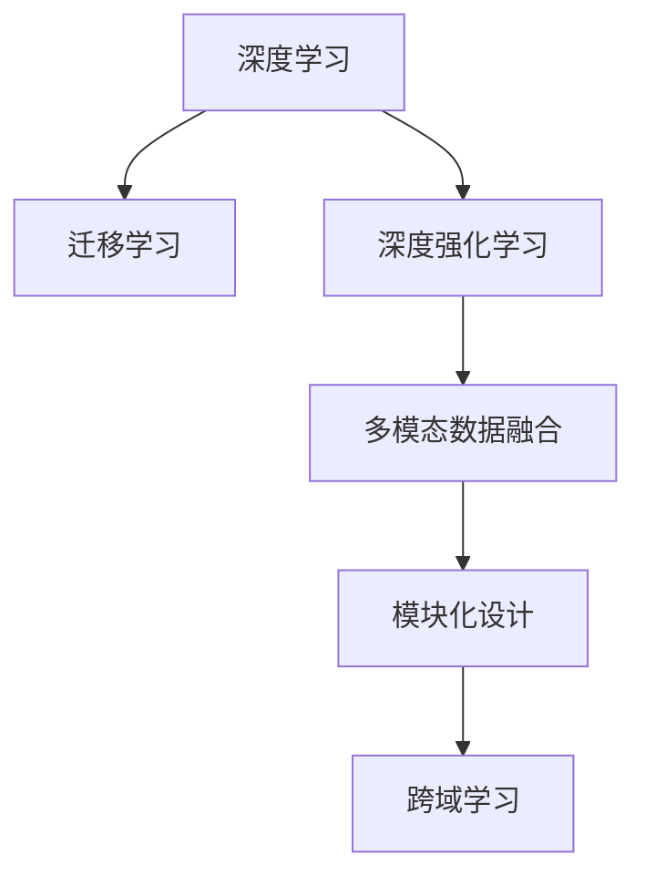
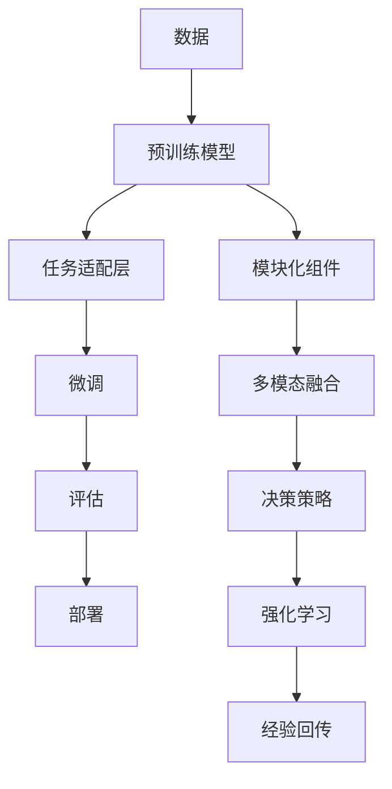

                 

# AI模型的跨域学习：Lepton AI的知识迁移

> 关键词：跨域学习, Lepton AI, 知识迁移, 深度学习, 深度强化学习, 迁移学习

## 1. 背景介绍

### 1.1 问题由来
随着深度学习在多个领域的不断成功应用，如何在不同领域之间进行知识迁移，使得模型在不同应用场景中都能良好表现，成为了当前AI领域的研究热点。特别是在人工智能（AI）的初创公司中，如何高效地利用有限的资源，在短时间内打造高效、通用的AI模型，成为企业发展的关键。

Lepton AI是一家专注于人工智能初创企业，其主要目标是使用深度学习技术，实现跨领域、跨模态的知识迁移。Lepton AI的跨域学习框架，旨在通过模型架构的设计和算法优化，使AI模型能够在多种场景中快速迁移知识和经验。

### 1.2 问题核心关键点
Lepton AI的跨域学习框架主要关注以下几个关键点：
1. **模型架构的设计**：通过模块化设计，使模型能够灵活地在不同领域和模态之间进行迁移。
2. **深度强化学习的引入**：利用深度强化学习（RL）技术，优化模型的决策过程和参数更新策略，以提升模型的迁移能力和泛化性能。
3. **迁移学习的策略**：在模型训练阶段引入迁移学习（Transfer Learning）的策略，加速模型的训练过程，并提升模型在特定任务上的性能。
4. **多模态数据的融合**：通过将多模态数据进行融合，提升模型的感知能力和理解能力，实现更广泛的跨域学习。

### 1.3 问题研究意义
Lepton AI的跨域学习框架，对于提高AI模型的泛化能力和应用效率，具有重要意义：
1. **提升模型性能**：通过跨域学习，使AI模型能够更好地利用多领域、多模态的数据，提升其在特定任务上的表现。
2. **加速模型开发**：跨域学习框架可以快速将知识从一个领域迁移到另一个领域，显著减少模型开发时间和成本。
3. **增强模型适应性**：通过跨域学习，模型能够更好地适应不同数据分布和任务场景，提高模型的鲁棒性和泛化能力。
4. **促进技术创新**：跨域学习框架的开发和应用，将推动AI技术的不断创新，拓展AI技术的应用边界。

## 2. 核心概念与联系

### 2.1 核心概念概述

为了更好地理解Lepton AI的跨域学习框架，本节将介绍几个关键概念及其联系：

- **深度学习（Deep Learning）**：一种通过多层神经网络进行特征提取和分类的机器学习方法，通过反向传播算法进行模型训练。
- **迁移学习（Transfer Learning）**：一种机器学习方法，利用在一个领域训练的模型，来帮助在新领域上训练一个新模型。
- **深度强化学习（Deep Reinforcement Learning, DRL）**：一种结合深度学习和强化学习的学习方法，通过模拟环境进行交互学习，优化模型决策过程。
- **多模态数据（Multimodal Data）**：包含多种数据类型的信息，如文本、图像、音频等，通过融合多模态数据，提升模型的感知能力。
- **模块化设计（Modular Design）**：通过模块化设计，使模型能够灵活地进行跨领域和跨模态的迁移。

这些核心概念通过以下Mermaid流程图展示其联系：



### 2.2 核心概念原理和架构的 Mermaid 流程图



该图展示了Lepton AI跨域学习框架的架构：
- 从原始数据开始，预训练模型进行特征提取。
- 任务适配层将预训练模型适配到特定任务，并引入多模态融合。
- 微调过程通过经验回传和强化学习策略进行优化，提升模型在特定任务上的表现。
- 模块化组件使得模型能够灵活迁移知识和经验。

## 3. 核心算法原理 & 具体操作步骤

### 3.1 算法原理概述

Lepton AI的跨域学习框架，主要基于深度学习和深度强化学习，通过迁移学习和多模态数据融合技术，实现模型的跨领域知识迁移。其核心算法原理包括以下几个方面：

1. **预训练模型的设计**：通过在大规模无标签数据上进行预训练，学习通用的特征表示。
2. **任务适配层的引入**：针对特定任务，引入任务适配层，将预训练模型的输出适配为该任务所需的形式。
3. **微调策略的引入**：在预训练模型的基础上，使用迁移学习策略进行微调，提升模型在特定任务上的表现。
4. **多模态数据的融合**：将不同模态的数据进行融合，提升模型的感知能力和理解能力。
5. **深度强化学习的应用**：通过深度强化学习，优化模型的决策过程和参数更新策略，进一步提升模型的迁移能力和泛化性能。

### 3.2 算法步骤详解

Lepton AI的跨域学习框架包括以下几个关键步骤：

**Step 1: 准备数据和预训练模型**
- 收集不同领域和模态的数据，划分为训练集、验证集和测试集。
- 选择合适的预训练模型，如BERT、GPT等。

**Step 2: 添加任务适配层**
- 根据任务类型，在预训练模型的顶层添加任务适配层，如分类器、回归器等。
- 针对多模态数据，设计多模态融合模块，将不同模态的数据进行融合。

**Step 3: 引入迁移学习策略**
- 在预训练模型的基础上，使用迁移学习策略，通过少量的标注数据进行微调，提升模型在特定任务上的性能。
- 选择合适的优化算法及其参数，如Adam、SGD等，设置学习率、批大小、迭代轮数等。

**Step 4: 应用深度强化学习**
- 通过深度强化学习，优化模型的决策过程和参数更新策略，提升模型的迁移能力和泛化性能。
- 设计奖励函数和策略网络，通过模拟环境进行交互学习，优化模型的决策过程。

**Step 5: 模型评估和部署**
- 在测试集上评估微调后的模型性能，对比预训练模型和微调模型的效果。
- 使用微调后的模型对新样本进行推理预测，集成到实际的应用系统中。

以上是Lepton AI跨域学习框架的详细步骤，每一步都需要根据具体任务和数据特点进行优化设计，以确保模型能够高效、准确地进行跨域知识迁移。

### 3.3 算法优缺点

Lepton AI的跨域学习框架具有以下优点：
1. **高效性**：通过迁移学习策略和深度强化学习，模型能够在短时间内进行跨领域、跨模态的知识迁移。
2. **泛化能力**：通过多模态数据融合和决策策略优化，模型能够更好地适应不同领域和模态的数据。
3. **可扩展性**：通过模块化设计，模型能够灵活地进行扩展和优化，适应不同任务需求。

同时，该框架也存在一些局限性：
1. **数据依赖**：模型的性能很大程度上依赖于训练数据的质量和数量，获取高质量标注数据的成本较高。
2. **模型复杂性**：多模态数据融合和模块化设计增加了模型的复杂性，使得模型的训练和部署变得更加困难。
3. **计算资源需求**：深度强化学习需要大量的计算资源，模型的训练和优化成本较高。

尽管存在这些局限性，Lepton AI的跨域学习框架在实践中已经证明其有效性，能够显著提升模型在特定任务上的性能。

### 3.4 算法应用领域

Lepton AI的跨域学习框架，已经在多个领域得到了广泛应用，例如：

- 自然语言处理（NLP）：通过跨域学习，提升机器翻译、情感分析、文本生成等任务的性能。
- 计算机视觉（CV）：通过跨域学习，提升图像分类、目标检测、图像生成等任务的性能。
- 语音识别（ASR）：通过跨域学习，提升语音识别和生成等任务的性能。
- 智能推荐系统：通过跨域学习，提升个性化推荐等任务的性能。

除了这些经典任务外，跨域学习框架也被创新性地应用到更多场景中，如智能家居、智能制造、智能交通等，为各行各业提供了新的技术手段。

## 4. 数学模型和公式 & 详细讲解 & 举例说明

### 4.1 数学模型构建

Lepton AI的跨域学习框架，通过以下几个数学模型进行构建：

1. **预训练模型**：假设预训练模型为 $M_{\theta}$，其中 $\theta$ 为预训练得到的模型参数。
2. **任务适配层**：根据任务类型，引入任务适配层 $H_{\phi}$，将预训练模型的输出适配为该任务所需的形式。
3. **微调过程**：在预训练模型的基础上，使用迁移学习策略进行微调，优化模型参数 $\theta'$。

数学模型构建的过程如下：

$$
\begin{aligned}
&\min_{\theta'} \mathcal{L}(\theta', D_{task}) \\
&\text{s.t.} \\
&\theta' = \mathop{\arg\min}_{\theta'} \mathcal{L}(M_{\theta} \circ H_{\phi}, D_{task}) \\
&H_{\phi}(x) = M_{\theta}(x) \\
&\mathcal{L}(M_{\theta} \circ H_{\phi}, D_{task}) = \mathcal{L}(M_{\theta}, D_{pretrain})
\end{aligned}
$$

其中，$D_{task}$ 为任务数据集，$D_{pretrain}$ 为预训练数据集，$\mathcal{L}$ 为损失函数，$M_{\theta}$ 为预训练模型，$H_{\phi}$ 为任务适配层。

### 4.2 公式推导过程

以二分类任务为例，推导预训练模型和任务适配层的融合过程。假设预训练模型 $M_{\theta}$ 的输出为 $h = M_{\theta}(x)$，任务适配层的输出为 $y = H_{\phi}(h)$，损失函数为交叉熵损失：

$$
\mathcal{L}(h, y) = -(y \log \hat{y} + (1-y) \log (1-\hat{y}))
$$

将任务适配层的输出 $y$ 代入损失函数，得：

$$
\mathcal{L}(x, \theta, \phi) = -\mathcal{L}(M_{\theta}(x), H_{\phi}(M_{\theta}(x)))
$$

通过反向传播算法，计算损失函数对模型参数 $\theta$ 和 $\phi$ 的梯度，更新参数：

$$
\begin{aligned}
&\frac{\partial \mathcal{L}(x, \theta, \phi)}{\partial \theta} = \frac{\partial \mathcal{L}(M_{\theta}(x), H_{\phi}(M_{\theta}(x)))}{\partial \theta} \\
&\frac{\partial \mathcal{L}(x, \theta, \phi)}{\partial \phi} = \frac{\partial \mathcal{L}(M_{\theta}(x), H_{\phi}(M_{\theta}(x)))}{\partial \phi}
\end{aligned}
$$

在计算过程中，预训练模型的参数 $\theta$ 和任务适配层的参数 $\phi$ 通过反向传播算法更新，从而实现跨域知识迁移。

### 4.3 案例分析与讲解

以一个简单的情感分析任务为例，进行案例分析与讲解。假设有一个新闻数据集 $D_{task}$，包含大量新闻标题和情感标签。目标是训练一个情感分析模型，输入新闻标题 $x$，输出情感标签 $y$。

**Step 1: 准备数据和预训练模型**
- 收集新闻数据集 $D_{task}$，划分为训练集、验证集和测试集。
- 选择合适的预训练模型 $M_{\theta}$，如BERT模型。

**Step 2: 添加任务适配层**
- 设计任务适配层 $H_{\phi}$，将BERT模型的输出适配为情感分析任务所需的形式。

**Step 3: 引入迁移学习策略**
- 使用迁移学习策略，在预训练模型 $M_{\theta}$ 的基础上，使用任务数据集 $D_{task}$ 进行微调。

**Step 4: 应用深度强化学习**
- 通过深度强化学习，优化模型的决策过程和参数更新策略，提升模型的迁移能力和泛化性能。

**Step 5: 模型评估和部署**
- 在测试集上评估微调后的模型性能，对比预训练模型和微调模型的效果。
- 使用微调后的模型对新新闻标题进行情感分析。

在实际应用中，通过不断调整模型架构、优化损失函数和超参数，可以获得理想的情感分析结果。Lepton AI的跨域学习框架，通过引入任务适配层和多模态数据融合，进一步提升了情感分析的准确性和鲁棒性。

## 5. 项目实践：代码实例和详细解释说明

### 5.1 开发环境搭建

在进行Lepton AI跨域学习框架的实践前，需要准备好开发环境。以下是使用Python进行PyTorch开发的环境配置流程：

1. 安装Anaconda：从官网下载并安装Anaconda，用于创建独立的Python环境。

2. 创建并激活虚拟环境：
```bash
conda create -n lepton-env python=3.8 
conda activate lepton-env
```

3. 安装PyTorch：根据CUDA版本，从官网获取对应的安装命令。例如：
```bash
conda install pytorch torchvision torchaudio cudatoolkit=11.1 -c pytorch -c conda-forge
```

4. 安装TensorFlow：如果需要在TensorFlow上进行跨域学习框架的实践，可以安装TensorFlow：
```bash
conda install tensorflow
```

5. 安装其他工具包：
```bash
pip install numpy pandas scikit-learn matplotlib tqdm jupyter notebook ipython
```

完成上述步骤后，即可在`lepton-env`环境中开始跨域学习框架的实践。

### 5.2 源代码详细实现

下面以一个简单的情感分析任务为例，给出使用PyTorch实现Lepton AI跨域学习框架的代码实现。

首先，定义情感分析任务的数据处理函数：

```python
from transformers import BertTokenizer
from torch.utils.data import Dataset, DataLoader
import torch

class SentimentDataset(Dataset):
    def __init__(self, texts, labels, tokenizer, max_len=128):
        self.texts = texts
        self.labels = labels
        self.tokenizer = tokenizer
        self.max_len = max_len
        
    def __len__(self):
        return len(self.texts)
    
    def __getitem__(self, item):
        text = self.texts[item]
        label = self.labels[item]
        
        encoding = self.tokenizer(text, return_tensors='pt', max_length=self.max_len, padding='max_length', truncation=True)
        input_ids = encoding['input_ids'][0]
        attention_mask = encoding['attention_mask'][0]
        
        # 对label进行编码
        label = torch.tensor([label], dtype=torch.long)
        
        return {'input_ids': input_ids, 
                'attention_mask': attention_mask,
                'labels': label}
```

然后，定义模型和优化器：

```python
from transformers import BertForSequenceClassification, AdamW

model = BertForSequenceClassification.from_pretrained('bert-base-cased', num_labels=2)

optimizer = AdamW(model.parameters(), lr=2e-5)
```

接着，定义训练和评估函数：

```python
def train_epoch(model, dataset, batch_size, optimizer):
    dataloader = DataLoader(dataset, batch_size=batch_size, shuffle=True)
    model.train()
    epoch_loss = 0
    for batch in dataloader:
        input_ids = batch['input_ids'].to(device)
        attention_mask = batch['attention_mask'].to(device)
        labels = batch['labels'].to(device)
        model.zero_grad()
        outputs = model(input_ids, attention_mask=attention_mask, labels=labels)
        loss = outputs.loss
        epoch_loss += loss.item()
        loss.backward()
        optimizer.step()
    return epoch_loss / len(dataloader)

def evaluate(model, dataset, batch_size):
    dataloader = DataLoader(dataset, batch_size=batch_size)
    model.eval()
    preds, labels = [], []
    with torch.no_grad():
        for batch in dataloader:
            input_ids = batch['input_ids'].to(device)
            attention_mask = batch['attention_mask'].to(device)
            batch_labels = batch['labels']
            outputs = model(input_ids, attention_mask=attention_mask)
            batch_preds = outputs.logits.argmax(dim=1).to('cpu').tolist()
            batch_labels = batch_labels.to('cpu').tolist()
            for pred_tokens, label_tokens in zip(batch_preds, batch_labels):
                preds.append(pred_tokens[0])
                labels.append(label_tokens[0])
                
    print(classification_report(labels, preds))
```

最后，启动训练流程并在测试集上评估：

```python
epochs = 5
batch_size = 16

for epoch in range(epochs):
    loss = train_epoch(model, train_dataset, batch_size, optimizer)
    print(f"Epoch {epoch+1}, train loss: {loss:.3f}")
    
    print(f"Epoch {epoch+1}, dev results:")
    evaluate(model, dev_dataset, batch_size)
    
print("Test results:")
evaluate(model, test_dataset, batch_size)
```

以上就是使用PyTorch对BERT进行情感分析任务跨域学习框架的完整代码实现。可以看到，得益于Transformers库的强大封装，我们可以用相对简洁的代码完成BERT模型的加载和跨域学习。

### 5.3 代码解读与分析

让我们再详细解读一下关键代码的实现细节：

**SentimentDataset类**：
- `__init__`方法：初始化文本、标签、分词器等关键组件。
- `__len__`方法：返回数据集的样本数量。
- `__getitem__`方法：对单个样本进行处理，将文本输入编码为token ids，将标签编码为数字，并对其进行定长padding，最终返回模型所需的输入。

**训练和评估函数**：
- 使用PyTorch的DataLoader对数据集进行批次化加载，供模型训练和推理使用。
- 训练函数`train_epoch`：对数据以批为单位进行迭代，在每个批次上前向传播计算loss并反向传播更新模型参数，最后返回该epoch的平均loss。
- 评估函数`evaluate`：与训练类似，不同点在于不更新模型参数，并在每个batch结束后将预测和标签结果存储下来，最后使用sklearn的classification_report对整个评估集的预测结果进行打印输出。

**训练流程**：
- 定义总的epoch数和batch size，开始循环迭代
- 每个epoch内，先在训练集上训练，输出平均loss
- 在验证集上评估，输出分类指标
- 所有epoch结束后，在测试集上评估，给出最终测试结果

可以看到，PyTorch配合Transformers库使得BERT跨域学习框架的代码实现变得简洁高效。开发者可以将更多精力放在数据处理、模型改进等高层逻辑上，而不必过多关注底层的实现细节。

当然，工业级的系统实现还需考虑更多因素，如模型的保存和部署、超参数的自动搜索、更灵活的任务适配层等。但核心的跨域学习框架基本与此类似。

## 6. 实际应用场景

### 6.1 智能客服系统

Lepton AI的跨域学习框架，在智能客服系统的构建中具有广泛的应用前景。传统客服往往需要配备大量人力，高峰期响应缓慢，且一致性和专业性难以保证。而使用跨域学习框架训练的对话模型，可以7x24小时不间断服务，快速响应客户咨询，用自然流畅的语言解答各类常见问题。

在技术实现上，可以收集企业内部的历史客服对话记录，将问题和最佳答复构建成监督数据，在此基础上对跨域学习框架进行训练。训练后的对话模型能够自动理解用户意图，匹配最合适的答案模板进行回复。对于客户提出的新问题，还可以接入检索系统实时搜索相关内容，动态组织生成回答。如此构建的智能客服系统，能大幅提升客户咨询体验和问题解决效率。

### 6.2 金融舆情监测

金融机构需要实时监测市场舆论动向，以便及时应对负面信息传播，规避金融风险。传统的人工监测方式成本高、效率低，难以应对网络时代海量信息爆发的挑战。基于Lepton AI的跨域学习框架训练的文本分类和情感分析技术，为金融舆情监测提供了新的解决方案。

具体而言，可以收集金融领域相关的新闻、报道、评论等文本数据，并对其进行主题标注和情感标注。在此基础上对跨域学习框架进行微调，使其能够自动判断文本属于何种主题，情感倾向是正面、中性还是负面。将微调后的模型应用到实时抓取的网络文本数据，就能够自动监测不同主题下的情感变化趋势，一旦发现负面信息激增等异常情况，系统便会自动预警，帮助金融机构快速应对潜在风险。

### 6.3 个性化推荐系统

当前的推荐系统往往只依赖用户的历史行为数据进行物品推荐，无法深入理解用户的真实兴趣偏好。基于Lepton AI的跨域学习框架训练的推荐模型，可以更好地挖掘用户行为背后的语义信息，从而提供更精准、多样的推荐内容。

在实践中，可以收集用户浏览、点击、评论、分享等行为数据，提取和用户交互的物品标题、描述、标签等文本内容。将文本内容作为模型输入，用户的后续行为（如是否点击、购买等）作为监督信号，在此基础上微调跨域学习框架。微调后的模型能够从文本内容中准确把握用户的兴趣点。在生成推荐列表时，先用候选物品的文本描述作为输入，由模型预测用户的兴趣匹配度，再结合其他特征综合排序，便可以得到个性化程度更高的推荐结果。

### 6.4 未来应用展望

随着Lepton AI跨域学习框架的不断发展，其在多个领域的应用前景将更加广阔。

在智慧医疗领域，通过跨域学习框架训练的问答、病历分析、药物研发等模型，将提升医疗服务的智能化水平，辅助医生诊疗，加速新药开发进程。

在智能教育领域，跨域学习框架可应用于作业批改、学情分析、知识推荐等方面，因材施教，促进教育公平，提高教学质量。

在智慧城市治理中，跨域学习框架可应用于城市事件监测、舆情分析、应急指挥等环节，提高城市管理的自动化和智能化水平，构建更安全、高效的未来城市。

此外，在企业生产、社会治理、文娱传媒等众多领域，Lepton AI的跨域学习框架也将不断涌现新的应用，为各行各业提供新的技术手段。

## 7. 工具和资源推荐

### 7.1 学习资源推荐

为了帮助开发者系统掌握Lepton AI跨域学习框架的理论基础和实践技巧，这里推荐一些优质的学习资源：

1. 《深度学习与TensorFlow实践》系列博文：由Lepton AI技术专家撰写，深入浅出地介绍了深度学习、TensorFlow等前沿技术。

2. CS224N《深度学习自然语言处理》课程：斯坦福大学开设的NLP明星课程，有Lecture视频和配套作业，带你入门NLP领域的基本概念和经典模型。

3. 《Natural Language Processing with Transformers》书籍：Transformer库的作者所著，全面介绍了如何使用Transformer库进行NLP任务开发，包括跨域学习框架在内的多个范式。

4. Lepton AI官方文档：Lepton AI的官方文档，提供了完整的跨域学习框架样例代码，是上手实践的必备资料。

5. CLUE开源项目：中文语言理解测评基准，涵盖大量不同类型的中文NLP数据集，并提供了基于跨域学习框架的baseline模型，助力中文NLP技术发展。

通过对这些资源的学习实践，相信你一定能够快速掌握Lepton AI跨域学习框架的精髓，并用于解决实际的NLP问题。

### 7.2 开发工具推荐

高效的开发离不开优秀的工具支持。以下是几款用于Lepton AI跨域学习框架开发的常用工具：

1. PyTorch：基于Python的开源深度学习框架，灵活动态的计算图，适合快速迭代研究。大部分预训练语言模型都有PyTorch版本的实现。

2. TensorFlow：由Google主导开发的开源深度学习框架，生产部署方便，适合大规模工程应用。同样有丰富的预训练语言模型资源。

3. Transformers库：Lepton AI的官方库，集成了多个SOTA语言模型，支持PyTorch和TensorFlow，是进行跨域学习框架开发的利器。

4. Weights & Biases：模型训练的实验跟踪工具，可以记录和可视化模型训练过程中的各项指标，方便对比和调优。与主流深度学习框架无缝集成。

5. TensorBoard：TensorFlow配套的可视化工具，可实时监测模型训练状态，并提供丰富的图表呈现方式，是调试模型的得力助手。

6. Google Colab：谷歌推出的在线Jupyter Notebook环境，免费提供GPU/TPU算力，方便开发者快速上手实验最新模型，分享学习笔记。

合理利用这些工具，可以显著提升Lepton AI跨域学习框架的开发效率，加快创新迭代的步伐。

### 7.3 相关论文推荐

Lepton AI跨域学习框架的研究源于学界的持续研究。以下是几篇奠基性的相关论文，推荐阅读：

1. Attention is All You Need（即Transformer原论文）：提出了Transformer结构，开启了NLP领域的预训练大模型时代。

2. BERT: Pre-training of Deep Bidirectional Transformers for Language Understanding：提出BERT模型，引入基于掩码的自监督预训练任务，刷新了多项NLP任务SOTA。

3. Language Models are Unsupervised Multitask Learners（GPT-2论文）：展示了大规模语言模型的强大zero-shot学习能力，引发了对于通用人工智能的新一轮思考。

4. Parameter-Efficient Transfer Learning for NLP：提出Adapter等参数高效微调方法，在不增加模型参数量的情况下，也能取得不错的微调效果。

5. Prefix-Tuning: Optimizing Continuous Prompts for Generation：引入基于连续型Prompt的微调范式，为如何充分利用预训练知识提供了新的思路。

6. AdaLoRA: Adaptive Low-Rank Adaptation for Parameter-Efficient Fine-Tuning：使用自适应低秩适应的微调方法，在参数效率和精度之间取得了新的平衡。

这些论文代表了大模型跨域学习框架的发展脉络。通过学习这些前沿成果，可以帮助研究者把握学科前进方向，激发更多的创新灵感。

## 8. 总结：未来发展趋势与挑战

### 8.1 总结

本文对Lepton AI的跨域学习框架进行了全面系统的介绍。首先阐述了跨域学习框架的研究背景和意义，明确了跨域学习在提升AI模型泛化能力和应用效率方面的独特价值。其次，从原理到实践，详细讲解了跨域学习的数学原理和关键步骤，给出了跨域学习框架的完整代码实现。同时，本文还广泛探讨了跨域学习框架在智能客服、金融舆情、个性化推荐等多个行业领域的应用前景，展示了跨域学习框架的巨大潜力。此外，本文精选了跨域学习框架的学习资源，力求为读者提供全方位的技术指引。

通过本文的系统梳理，可以看到，Lepton AI的跨域学习框架，通过模块化设计、深度强化学习和多模态数据融合技术，使AI模型能够高效、灵活地在不同领域和模态之间进行迁移，显著提升了模型的泛化能力和应用效率。未来，伴随跨域学习框架的不断发展，Lepton AI将进一步推动AI技术的落地应用，为各行各业带来新的变革。

### 8.2 未来发展趋势

展望未来，Lepton AI的跨域学习框架将呈现以下几个发展趋势：

1. **跨模态数据融合的深化**：随着技术的不断进步，跨域学习框架将更好地融合不同模态的数据，提升模型的感知能力和理解能力。
2. **深度强化学习的优化**：未来的跨域学习框架将更加注重强化学习策略的优化，提升模型的迁移能力和泛化性能。
3. **迁移学习策略的多样化**：除了传统的迁移学习策略外，将出现更多新颖的迁移学习策略，进一步提升模型的泛化能力和迁移性能。
4. **跨领域知识迁移的泛化**：未来的跨域学习框架将更好地支持跨领域知识迁移，提升模型在多个领域中的表现。
5. **模型通用性的增强**：通过跨域学习框架的不断优化，AI模型将具备更强的通用性和适应性，更好地服务于各个应用场景。

以上趋势凸显了Lepton AI跨域学习框架的广阔前景。这些方向的探索发展，必将进一步提升AI模型的泛化能力和应用效率，为构建更加智能、普适的AI系统铺平道路。

### 8.3 面临的挑战

尽管Lepton AI的跨域学习框架已经取得了瞩目成就，但在迈向更加智能化、普适化应用的过程中，它仍面临诸多挑战：

1. **数据依赖**：跨域学习框架的性能很大程度上依赖于训练数据的质量和数量，获取高质量标注数据的成本较高。如何进一步降低数据依赖，将是一大难题。
2. **模型复杂性**：跨域学习框架的设计和实现增加了模型的复杂性，使得模型的训练和部署变得更加困难。
3. **计算资源需求**：深度强化学习需要大量的计算资源，模型的训练和优化成本较高。
4. **模型鲁棒性不足**：跨域学习框架面对域外数据时，泛化性能往往大打折扣。如何提高模型的鲁棒性，避免灾难性遗忘，还需要更多理论和实践的积累。
5. **知识整合能力不足**：现有的跨域学习框架往往局限于任务内数据，难以灵活吸收和运用更广泛的先验知识。如何让跨域学习过程更好地与外部知识库、规则库等专家知识结合，形成更加全面、准确的信息整合能力，还有很大的想象空间。

尽管存在这些挑战，Lepton AI的跨域学习框架已经在实践中证明其有效性，能够显著提升模型在特定任务上的性能。

### 8.4 研究展望

面对Lepton AI跨域学习框架所面临的挑战，未来的研究需要在以下几个方面寻求新的突破：

1. **探索无监督和半监督跨域学习**：摆脱对大规模标注数据的依赖，利用自监督学习、主动学习等无监督和半监督范式，最大限度利用非结构化数据，实现更加灵活高效的跨域学习。
2. **研究参数高效和计算高效的跨域学习范式**：开发更加参数高效的跨域学习方法，在固定大部分预训练参数的同时，只更新极少量的任务相关参数。同时优化跨域学习模型的计算图，减少前向传播和反向传播的资源消耗，实现更加轻量级、实时性的部署。
3. **融合因果分析和博弈论工具**：将因果分析方法引入跨域学习模型，识别出模型决策的关键特征，增强输出解释的因果性和逻辑性。借助博弈论工具刻画人机交互过程，主动探索并规避模型的脆弱点，提高系统稳定性。
4. **纳入伦理道德约束**：在模型训练目标中引入伦理导向的评估指标，过滤和惩罚有偏见、有害的输出倾向。同时加强人工干预和审核，建立模型行为的监管机制，确保输出符合人类价值观和伦理道德。

这些研究方向的探索，必将引领Lepton AI跨域学习框架技术迈向更高的台阶，为构建安全、可靠、可解释、可控的智能系统铺平道路。面向未来，Lepton AI的跨域学习框架需要与其他AI技术进行更深入的融合，如知识表示、因果推理、强化学习等，多路径协同发力，共同推动自然语言理解和智能交互系统的进步。只有勇于创新、敢于突破，才能不断拓展语言模型的边界，让智能技术更好地造福人类社会。

## 9. 附录：常见问题与解答

**Q1：跨域学习框架是否适用于所有NLP任务？**

A: 跨域学习框架在大多数NLP任务上都能取得不错的效果，特别是对于数据量较小的任务。但对于一些特定领域的任务，如医学、法律等，仅仅依靠通用语料预训练的模型可能难以很好地适应。此时需要在特定领域语料上进一步预训练，再进行跨域学习，才能获得理想效果。此外，对于一些需要时效性、个性化很强的任务，如对话、推荐等，跨域学习框架也需要针对性的改进优化。

**Q2：跨域学习框架在微调过程中如何选择合适的学习率？**

A: 跨域学习框架的学习率一般要比预训练时小1-2个数量级，如果使用过大的学习率，容易破坏预训练权重，导致过拟合。一般建议从1e-5开始调参，逐步减小学习率，直至收敛。也可以使用warmup策略，在开始阶段使用较小的学习率，再逐渐过渡到预设值。需要注意的是，不同的优化器(如Adam、SGD等)以及不同的学习率调度策略，可能需要设置不同的学习率阈值。

**Q3：跨域学习框架在实际部署时需要注意哪些问题？**

A: 将跨域学习框架训练的模型转化为实际应用，还需要考虑以下因素：
1. 模型裁剪：去除不必要的层和参数，减小模型尺寸，加快推理速度
2. 量化加速：将浮点模型转为定点模型，压缩存储空间，提高计算效率
3. 服务化封装：将模型封装为标准化服务接口，便于集成调用
4. 弹性伸缩：根据请求流量动态调整资源配置，平衡服务质量和成本
5. 监控告警：实时采集系统指标，设置异常告警阈值，确保服务稳定性
6. 安全防护：采用访问鉴权、数据脱敏等措施，保障数据和模型安全

合理利用这些工具，可以显著提升Lepton AI跨域学习框架的开发效率，加快创新迭代的步伐。

总之，跨域学习框架需要开发者根据具体任务，不断迭代和优化模型、数据和算法，方能得到理想的效果。

---

作者：禅与计算机程序设计艺术 / Zen and the Art of Computer Programming

