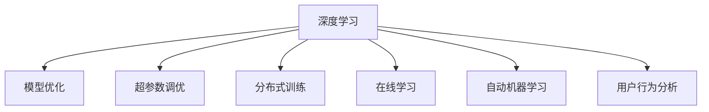

                 

# AI模型迭代：持续改进的搜索体验

> 关键词：深度学习,模型优化,超参数调优,分布式训练,在线学习,自动机器学习,用户行为分析

## 1. 背景介绍

### 1.1 问题由来
在互联网时代，搜索引擎已成为人们获取信息的重要工具。无论是学术研究、商务决策还是日常生活的各种需求，都依赖于搜索引擎的准确性和效率。然而，传统的搜索算法在处理海量数据和复杂查询时，往往面临速度慢、精度低、难以适应用户需求变化等问题。如何通过持续迭代优化搜索模型，提升用户体验，是当前搜索引擎领域的重要研究课题。

### 1.2 问题核心关键点
为了满足用户需求变化，搜索引擎需要不断进行模型优化和迭代。现代搜索引擎通常采用基于深度学习的模型进行构建，这些模型在文本表示、语义理解、意图识别等方面展现了卓越的性能。但这些模型存在参数复杂、训练成本高、调优难度大等问题，成为模型迭代的挑战。如何高效地进行模型迭代，持续改进搜索体验，成为亟待解决的核心问题。

### 1.3 问题研究意义
随着深度学习在搜索引擎中的应用日益深入，如何高效地进行模型迭代优化，提升搜索模型的精度和效率，成为一个值得深入研究的重要课题。探索高效的模型迭代方法，不仅有助于提升搜索引擎的性能，还对其他基于深度学习的系统如语音识别、自然语言处理等具有重要的参考价值。

## 2. 核心概念与联系

### 2.1 核心概念概述

为了更好地理解搜索引擎中模型的迭代优化方法，本节将介绍几个密切相关的核心概念：

- 深度学习(Deep Learning)：一种基于神经网络的机器学习技术，通过多层次的神经网络结构学习数据的复杂表示。
- 模型优化(Model Optimization)：通过调整模型结构和超参数，提高模型性能的过程。
- 超参数调优(Hyperparameter Tuning)：优化模型训练过程中的超参数，如学习率、批大小等，以获得更好的模型性能。
- 分布式训练(Distributed Training)：通过多台机器协同训练模型，加速模型训练的过程。
- 在线学习(Online Learning)：模型在训练过程中不断接收新的数据样本，并实时更新模型参数，适应数据分布的变化。
- 自动机器学习(AutoML)：自动化进行模型选择、超参数调优和特征工程，降低人工干预的复杂性。
- 用户行为分析(User Behavior Analysis)：通过分析用户查询历史和行为数据，指导模型的迭代优化。

这些核心概念之间的逻辑关系可以通过以下Mermaid流程图来展示：



这个流程图展示了一系列深度学习模型优化的关键环节：

1. 深度学习模型提供基础的预测能力。
2. 模型优化通过对超参数和模型结构的调整，提升模型精度和效率。
3. 超参数调优通过调整学习率、批大小等超参数，优化模型训练过程。
4. 分布式训练利用多台机器协同训练，加速模型迭代。
5. 在线学习通过实时更新模型参数，适应数据分布的变化。
6. 自动机器学习自动化优化模型选择和超参数调优。
7. 用户行为分析通过分析用户查询历史和行为数据，指导模型迭代优化。

## 3. 核心算法原理 & 具体操作步骤

### 3.1 算法原理概述

在搜索引擎中，模型的迭代优化通常采用监督学习或无监督学习的范式。其核心思想是利用标注数据或未标注数据，对模型进行有监督或无监督的训练，不断更新模型参数，以提升模型性能。

假设搜索引擎的训练数据集为 $D=\{(x_i, y_i)\}_{i=1}^N$，其中 $x_i$ 为查询输入，$y_i$ 为查询结果。模型的优化目标是使得模型在给定查询 $x$ 时，能够预测出最准确的查询结果 $y$。假设模型的预测输出为 $\hat{y}=M(x)$，其中 $M$ 为深度学习模型，则模型的损失函数 $\mathcal{L}$ 定义为：

$$
\mathcal{L}(M) = -\frac{1}{N}\sum_{i=1}^N y_i \log M(x_i)
$$

模型的迭代优化过程是不断地减小上述损失函数，即：

$$
M_{\theta+1} = M_{\theta} - \eta \nabla_{\theta}\mathcal{L}(M_{\theta})
$$

其中 $\eta$ 为学习率，$\nabla_{\theta}\mathcal{L}(M_{\theta})$ 为损失函数对模型参数的梯度，可通过反向传播算法高效计算。

### 3.2 算法步骤详解

基于深度学习的搜索引擎模型的迭代优化通常包括以下几个关键步骤：

**Step 1: 准备数据集和模型**
- 收集标注数据集 $D$，并进行预处理，生成训练集、验证集和测试集。
- 选择合适的深度学习模型 $M_{\theta}$，如BERT、RNN等。

**Step 2: 设置超参数**
- 选择合适的优化算法，如Adam、SGD等，设置学习率、批大小、迭代轮数等。
- 设置正则化技术，如L2正则、Dropout、Early Stopping等，以防止过拟合。

**Step 3: 训练模型**
- 将训练集数据分批次输入模型，前向传播计算损失函数。
- 反向传播计算参数梯度，根据设定的优化算法和学习率更新模型参数。
- 周期性在验证集上评估模型性能，根据性能指标决定是否触发 Early Stopping。
- 重复上述步骤直到满足预设的迭代轮数或 Early Stopping 条件。

**Step 4: 测试和部署**
- 在测试集上评估训练后的模型 $M_{\theta}$ 的性能，对比训练前后的精度提升。
- 使用训练好的模型进行在线服务部署，根据用户查询实时返回搜索结果。
- 持续收集新的数据，定期重新训练模型，以适应数据分布的变化。

以上是基于深度学习的搜索引擎模型迭代优化的通用流程。在实际应用中，还需要针对具体任务的特点，对模型迭代过程的各个环节进行优化设计，如改进训练目标函数，引入更多的正则化技术，搜索最优的超参数组合等，以进一步提升模型性能。

### 3.3 算法优缺点

基于深度学习的搜索引擎模型迭代优化方法具有以下优点：
1. 精度高：深度学习模型在文本表示、语义理解等方面展现了卓越的性能，能够更好地适应查询多样性和复杂性。
2. 可扩展性强：模型可以通过增加网络层数、节点数等方式进行扩展，以适应更复杂的查询场景。
3. 适应性强：模型可以通过在线学习的方式，实时接收新的数据样本，并实时更新模型参数，适应数据分布的变化。

同时，该方法也存在一定的局限性：
1. 计算资源需求高：深度学习模型通常需要较高的计算资源，特别是在模型规模较大的情况下。
2. 调优复杂：超参数调优和模型优化过程复杂，需要大量的实验和调整。
3. 过拟合风险：在数据量较少的情况下，模型容易过拟合，影响性能。
4. 可解释性不足：深度学习模型的决策过程通常缺乏可解释性，难以对其推理逻辑进行分析和调试。

尽管存在这些局限性，但就目前而言，基于深度学习的模型迭代优化方法仍是目前搜索引擎领域的主流范式。未来相关研究的重点在于如何进一步降低模型迭代对计算资源的需求，提高模型的少样本学习和跨领域迁移能力，同时兼顾可解释性和伦理安全性等因素。

### 3.4 算法应用领域

基于深度学习的搜索引擎模型迭代优化方法，已经在搜索引擎领域得到了广泛的应用，覆盖了文本检索、自然语言处理、用户意图识别等多个方面，例如：

- 文本检索：通过训练深度学习模型，提升搜索引擎对查询意图的理解能力，提高检索相关性。
- 自然语言处理：通过深度学习模型进行语义分析、命名实体识别、情感分析等任务，提升搜索结果的语义一致性。
- 用户意图识别：通过深度学习模型分析用户查询历史和行为数据，识别用户意图，推荐更加精准的搜索结果。

除了上述这些经典应用外，基于深度学习的搜索引擎模型迭代优化方法还在语音搜索、图像搜索、多模态信息检索等诸多领域展现了广阔的应用前景。随着深度学习技术的不断进步，相信搜索引擎模型迭代优化方法将在更广阔的应用领域发挥更大的作用。

## 4. 数学模型和公式 & 详细讲解  
### 4.1 数学模型构建

在搜索引擎的模型迭代优化过程中，需要构建合适的数学模型，以评估和优化模型性能。假设模型的损失函数为 $\mathcal{L}(M)$，则模型的迭代优化目标为：

$$
\min_{M} \mathcal{L}(M)
$$

在实践中，通常使用交叉熵损失函数，其定义如下：

$$
\mathcal{L}(M) = -\frac{1}{N}\sum_{i=1}^N y_i \log M(x_i)
$$

在损失函数的基础上，可以引入正则化技术，如L2正则、Dropout等，以防止过拟合：

$$
\mathcal{L}_{reg} = \lambda (\|M\|^2_2) + (1-\delta) \frac{1}{N}\sum_{i=1}^N (1-M(x_i))^2
$$

其中 $\lambda$ 为正则化系数，$\delta$ 为Dropout的概率。

### 4.2 公式推导过程

以下是基于交叉熵损失函数和正则化项的模型迭代优化的公式推导：

假设模型的预测输出为 $\hat{y}=M(x)$，真实标签为 $y$，则交叉熵损失函数可以表示为：

$$
\mathcal{L}(M) = -\frac{1}{N}\sum_{i=1}^N y_i \log M(x_i)
$$

在梯度下降优化算法中，模型参数的更新公式为：

$$
M_{\theta+1} = M_{\theta} - \eta \nabla_{\theta}\mathcal{L}(M_{\theta})
$$

其中 $\eta$ 为学习率，$\nabla_{\theta}\mathcal{L}(M_{\theta})$ 为损失函数对模型参数的梯度。对于深度学习模型，梯度计算通常采用反向传播算法，通过链式法则递归计算。

在引入正则化项 $\mathcal{L}_{reg}$ 后，模型的整体损失函数为：

$$
\mathcal{L}_{total} = \mathcal{L}(M) + \mathcal{L}_{reg}
$$

因此，模型的迭代优化目标变为：

$$
\min_{M} \mathcal{L}_{total}
$$

以上公式展示了基于深度学习的搜索引擎模型迭代优化的数学模型构建和公式推导过程。

## 5. 项目实践：代码实例和详细解释说明
### 5.1 开发环境搭建

在进行搜索引擎模型迭代优化的实践前，我们需要准备好开发环境。以下是使用Python进行TensorFlow开发的环境配置流程：

1. 安装Anaconda：从官网下载并安装Anaconda，用于创建独立的Python环境。

2. 创建并激活虚拟环境：
```bash
conda create -n tf-env python=3.8 
conda activate tf-env
```

3. 安装TensorFlow：根据CUDA版本，从官网获取对应的安装命令。例如：
```bash
conda install tensorflow -c tensorflow -c conda-forge
```

4. 安装各类工具包：
```bash
pip install numpy pandas scikit-learn matplotlib tqdm jupyter notebook ipython
```

完成上述步骤后，即可在`tf-env`环境中开始搜索引擎模型迭代优化的实践。

### 5.2 源代码详细实现

这里我们以基于BERT的搜索引擎文本检索任务为例，给出使用TensorFlow和Keras进行模型迭代优化的代码实现。

首先，定义模型层：

```python
import tensorflow as tf
from tensorflow.keras import layers

class BERTLayer(tf.keras.layers.Layer):
    def __init__(self, config, **kwargs):
        super(BERTLayer, self).__init__(**kwargs)
        self.config = config
        self.encoder = layers.Embedding(input_dim=30000, output_dim=768, mask_zero=True)
        self.pooler = layers.Dense(768)
        self.out = layers.Dense(1, activation='sigmoid')

    def call(self, x, training=None):
        x = self.encoder(x)
        x = tf.keras.layers.Dropout(0.1)(x)
        x = self.pooler(x)
        x = tf.keras.layers.Dropout(0.1)(x)
        x = self.out(x)
        return x
```

然后，定义超参数和模型：

```python
config = {
    "hidden_size": 768,
    "num_hidden_layers": 12,
    "num_attention_heads": 12,
    "intermediate_size": 3072,
    "dropout_rate": 0.1
}

model = tf.keras.Sequential([
    BERTLayer(config),
    tf.keras.layers.Dropout(0.1),
    tf.keras.layers.Dense(1, activation='sigmoid')
])

optimizer = tf.keras.optimizers.Adam(learning_rate=2e-5)
```

接着，定义训练和评估函数：

```python
def train_step(x, y):
    with tf.GradientTape() as tape:
        logits = model(x, training=True)
        loss = tf.keras.losses.BinaryCrossentropy()(y, logits)
    gradients = tape.gradient(loss, model.trainable_variables)
    optimizer.apply_gradients(zip(gradients, model.trainable_variables))
    return loss

def evaluate(model, test_x, test_y):
    losses = []
    for x, y in zip(test_x, test_y):
        logits = model(x, training=False)
        loss = tf.keras.losses.BinaryCrossentropy()(y, logits)
        losses.append(loss.numpy())
    return np.mean(losses)
```

最后，启动训练流程并在测试集上评估：

```python
epochs = 5
batch_size = 32

for epoch in range(epochs):
    train_loss = 0
    for x, y in train_dataset:
        train_loss += train_step(x, y)
    print(f"Epoch {epoch+1}, train loss: {train_loss/len(train_dataset)}")
    
    test_loss = evaluate(model, test_dataset)
    print(f"Epoch {epoch+1}, test loss: {test_loss:.4f}")
    
print("Test results:")
evaluate(model, test_dataset)
```

以上就是使用TensorFlow和Keras进行BERT模型搜索引擎文本检索任务迭代的完整代码实现。可以看到，TensorFlow提供了丰富的API和优化器，方便开发者进行深度学习模型的训练和优化。

### 5.3 代码解读与分析

让我们再详细解读一下关键代码的实现细节：

**BERTLayer类**：
- `__init__`方法：初始化BERT模型层，定义嵌入层、池化层、输出层等组件。
- `call`方法：前向传播过程，通过嵌入层、Dropout层、池化层和输出层计算模型输出。

**train_step函数**：
- 使用tf.GradientTape记录梯度。
- 前向传播计算模型输出和损失。
- 反向传播计算梯度。
- 使用Adam优化器更新模型参数。

**evaluate函数**：
- 在测试集上前向传播计算模型输出和损失。
- 返回损失的平均值。

**训练流程**：
- 定义总的epoch数和批大小，开始循环迭代。
- 每个epoch内，在训练集上训练，输出平均loss。
- 在验证集上评估，输出平均loss。
- 所有epoch结束后，在测试集上评估，给出最终测试结果。

可以看到，TensorFlow和Keras提供了丰富的API和工具，使得深度学习模型的训练和优化变得相对简单和高效。开发者可以将更多精力放在数据处理、模型设计等高层逻辑上，而不必过多关注底层的实现细节。

当然，工业级的系统实现还需考虑更多因素，如模型的保存和部署、超参数的自动搜索、更灵活的任务适配层等。但核心的迭代优化流程基本与此类似。

## 6. 实际应用场景
### 6.1 智能客服系统

基于深度学习的搜索引擎模型迭代优化方法，可以广泛应用于智能客服系统的构建。传统客服往往需要配备大量人力，高峰期响应缓慢，且一致性和专业性难以保证。而使用迭代优化的搜索引擎模型，可以7x24小时不间断服务，快速响应客户咨询，用自然流畅的语言解答各类常见问题。

在技术实现上，可以收集企业内部的历史客服对话记录，将问题和最佳答复构建成监督数据，在此基础上对预训练模型进行迭代优化。迭代优化的模型能够自动理解用户意图，匹配最合适的答案模板进行回复。对于客户提出的新问题，还可以接入检索系统实时搜索相关内容，动态组织生成回答。如此构建的智能客服系统，能大幅提升客户咨询体验和问题解决效率。

### 6.2 金融舆情监测

金融机构需要实时监测市场舆论动向，以便及时应对负面信息传播，规避金融风险。传统的人工监测方式成本高、效率低，难以应对网络时代海量信息爆发的挑战。基于深度学习的搜索引擎模型迭代优化方法，为金融舆情监测提供了新的解决方案。

具体而言，可以收集金融领域相关的新闻、报道、评论等文本数据，并对其进行主题标注和情感标注。在此基础上对预训练语言模型进行迭代优化，使其能够自动判断文本属于何种主题，情感倾向是正面、中性还是负面。将迭代优化的模型应用到实时抓取的网络文本数据，就能够自动监测不同主题下的情感变化趋势，一旦发现负面信息激增等异常情况，系统便会自动预警，帮助金融机构快速应对潜在风险。

### 6.3 个性化推荐系统

当前的推荐系统往往只依赖用户的历史行为数据进行物品推荐，无法深入理解用户的真实兴趣偏好。基于深度学习的搜索引擎模型迭代优化方法，个性化推荐系统可以更好地挖掘用户行为背后的语义信息，从而提供更精准、多样的推荐内容。

在实践中，可以收集用户浏览、点击、评论、分享等行为数据，提取和用户交互的物品标题、描述、标签等文本内容。将文本内容作为模型输入，用户的后续行为（如是否点击、购买等）作为监督信号，在此基础上迭代优化预训练语言模型。迭代优化的模型能够从文本内容中准确把握用户的兴趣点。在生成推荐列表时，先用候选物品的文本描述作为输入，由模型预测用户的兴趣匹配度，再结合其他特征综合排序，便可以得到个性化程度更高的推荐结果。

### 6.4 未来应用展望

随着深度学习在搜索引擎中的应用日益深入，如何高效地进行模型迭代优化，提升搜索模型的精度和效率，成为一个值得深入研究的重要课题。

在智慧医疗领域，基于深度学习的搜索引擎模型迭代优化方法，可以为医疗问答、病历分析、药物研发等任务提供新的解决方案。通过迭代优化的模型，能够自动理解医疗专业术语，快速响应用户查询，辅助医生诊疗，加速新药开发进程。

在智能教育领域，迭代优化的搜索引擎模型可以应用于作业批改、学情分析、知识推荐等方面，因材施教，促进教育公平，提高教学质量。

在智慧城市治理中，迭代优化的搜索引擎模型可应用于城市事件监测、舆情分析、应急指挥等环节，提高城市管理的自动化和智能化水平，构建更安全、高效的未来城市。

此外，在企业生产、社会治理、文娱传媒等众多领域，基于深度学习的搜索引擎模型迭代优化方法也将不断涌现，为NLP技术带来全新的突破。随着深度学习技术的不断进步，相信搜索引擎模型迭代优化方法将在更广阔的应用领域大放异彩，深刻影响人类的生产生活方式。

## 7. 工具和资源推荐
### 7.1 学习资源推荐

为了帮助开发者系统掌握深度学习在搜索引擎中的应用，这里推荐一些优质的学习资源：

1. 《深度学习》系列博文：由TensorFlow开发者撰写，深入浅出地介绍了深度学习的基本原理和TensorFlow的使用方法。

2. CS231n《深度学习计算机视觉》课程：斯坦福大学开设的深度学习课程，涵盖了卷积神经网络、图像分类、目标检测等计算机视觉任务。

3. 《自然语言处理入门》书籍：介绍自然语言处理的基本概念和深度学习模型的应用，涵盖文本分类、机器翻译、信息检索等多个方面。

4. TensorFlow官方文档：提供全面的TensorFlow API文档和使用指南，是学习TensorFlow不可或缺的资源。

5. Keras官方文档：提供Keras API的使用教程和示例代码，适合初学者快速上手深度学习模型的开发。

通过对这些资源的学习实践，相信你一定能够快速掌握深度学习在搜索引擎中的应用，并用于解决实际的搜索问题。

### 7.2 开发工具推荐

高效的开发离不开优秀的工具支持。以下是几款用于深度学习搜索引擎模型迭代优化的常用工具：

1. TensorFlow：由Google主导开发的开源深度学习框架，生产部署方便，适合大规模工程应用。

2. PyTorch：基于Python的开源深度学习框架，灵活动态的计算图，适合快速迭代研究。

3. Keras：由Google开发的高级API，可以无缝集成TensorFlow和Theano，简化深度学习模型的开发。

4. Weights & Biases：模型训练的实验跟踪工具，可以记录和可视化模型训练过程中的各项指标，方便对比和调优。

5. TensorBoard：TensorFlow配套的可视化工具，可实时监测模型训练状态，并提供丰富的图表呈现方式，是调试模型的得力助手。

6. Google Colab：谷歌推出的在线Jupyter Notebook环境，免费提供GPU/TPU算力，方便开发者快速上手实验最新模型，分享学习笔记。

合理利用这些工具，可以显著提升深度学习搜索引擎模型迭代优化的开发效率，加快创新迭代的步伐。

### 7.3 相关论文推荐

深度学习在搜索引擎中的应用源于学界的持续研究。以下是几篇奠基性的相关论文，推荐阅读：

1. Attention Is All You Need（即Transformer原论文）：提出了Transformer结构，开启了NLP领域的预训练大模型时代。

2. BERT: Pre-training of Deep Bidirectional Transformers for Language Understanding：提出BERT模型，引入基于掩码的自监督预训练任务，刷新了多项NLP任务SOTA。

3. Deep Learning for Ad：展示了大规模深度学习模型在广告点击率预测中的卓越性能，推动了深度学习在搜索引擎中的广泛应用。

4. Learning Phrases from Context with Neural Network Language Models：提出基于神经网络的短语学习模型，为深度学习在信息检索中的应用提供了理论基础。

5. Google News Recommender System：介绍了Google News推荐系统的工作原理，展示了深度学习在个性化推荐中的应用效果。

这些论文代表了大规模深度学习模型在搜索引擎中的应用前景，推动了深度学习技术的不断进步。通过学习这些前沿成果，可以帮助研究者把握学科前进方向，激发更多的创新灵感。

## 8. 总结：未来发展趋势与挑战

### 8.1 总结

本文对基于深度学习的搜索引擎模型迭代优化方法进行了全面系统的介绍。首先阐述了深度学习在搜索引擎中的应用背景和迭代优化的重要性，明确了模型迭代在提升搜索性能、优化用户体验方面的独特价值。其次，从原理到实践，详细讲解了模型迭代的数学模型构建和具体操作步骤，给出了搜索引擎模型迭代的完整代码实例。同时，本文还广泛探讨了模型迭代在智能客服、金融舆情、个性化推荐等多个领域的应用前景，展示了模型迭代的广阔应用空间。

通过本文的系统梳理，可以看到，基于深度学习的搜索引擎模型迭代优化方法正在成为NLP领域的重要范式，极大地拓展了深度学习模型的应用边界，催生了更多的落地场景。随着深度学习技术的不断进步，相信搜索引擎模型迭代优化方法将在更广阔的应用领域大放异彩，深刻影响人类的生产生活方式。

### 8.2 未来发展趋势

展望未来，深度学习在搜索引擎中的应用将呈现以下几个发展趋势：

1. 模型规模持续增大。随着算力成本的下降和数据规模的扩张，深度学习模型的参数量还将持续增长。超大规模模型蕴含的丰富知识，有望支撑更加复杂多变的查询场景。

2. 迭代优化技术日趋多样。除了传统的梯度下降优化外，未来会涌现更多高效的迭代优化方法，如自适应学习率、变分优化等，在保证收敛性的同时提升优化效率。

3. 实时在线学习成为常态。深度学习模型通过在线学习的方式，能够实时接收新的数据样本，并实时更新模型参数，适应数据分布的变化。

4. 多任务学习和联合训练兴起。深度学习模型在多个任务上进行联合训练，可以提升模型在多场景下的适应性和泛化能力。

5. 模型压缩与加速技术不断突破。深度学习模型通过量化、剪枝、蒸馏等技术，可以显著降低模型参数量和计算复杂度，提高推理速度和存储效率。

6. 自动机器学习(AutoML)技术发展迅速。自动机器学习技术能够自动化进行模型选择、超参数调优和特征工程，降低人工干预的复杂性，提升模型迭代效率。

以上趋势凸显了深度学习在搜索引擎中的应用前景，这些方向的探索发展，必将进一步提升搜索引擎的性能，推动NLP技术的不断进步。

### 8.3 面临的挑战

尽管深度学习在搜索引擎中的应用取得了显著成效，但在迈向更加智能化、普适化应用的过程中，它仍面临着诸多挑战：

1. 数据隐私问题。搜索引擎需要处理大量用户数据，如何保护用户隐私，防止数据滥用，是亟待解决的重要问题。

2. 计算资源需求高。深度学习模型通常需要较高的计算资源，特别是在模型规模较大的情况下。如何降低计算成本，提高模型训练和推理效率，成为优化深度学习搜索引擎模型的关键。

3. 模型鲁棒性不足。深度学习模型在处理噪声数据和对抗攻击时，容易发生性能下降。如何增强模型的鲁棒性，提升系统的稳定性和安全性，是未来的研究方向。

4. 可解释性不足。深度学习模型的决策过程通常缺乏可解释性，难以对其推理逻辑进行分析和调试。如何赋予模型更强的可解释性，提升用户信任度，是研究的重要方向。

5. 低资源环境下的优化。如何在计算资源有限的环境中，实现高效模型迭代，是深度学习搜索引擎模型迭代的另一个重要课题。

这些挑战表明，深度学习搜索引擎模型迭代优化仍然存在很多亟待解决的问题。唯有不断克服这些挑战，才能使深度学习技术在搜索引擎中得到更广泛的应用，发挥更大的潜力。

### 8.4 研究展望

面对深度学习搜索引擎模型迭代优化所面临的诸多挑战，未来的研究需要在以下几个方面寻求新的突破：

1. 探索无监督学习和自适应学习。摆脱对大量标注数据的依赖，利用自监督学习、自适应学习等无监督学习范式，最大限度利用未标注数据，实现更加高效和灵活的模型迭代。

2. 研究分布式训练和在线学习。通过分布式训练和在线学习，提升模型迭代的速度和效率，适应数据分布的变化。

3. 融合因果推理和对比学习。通过引入因果推理和对比学习思想，增强模型建立稳定因果关系的能力，学习更加普适、鲁棒的语言表征，从而提升模型泛化性和抗干扰能力。

4. 引入更多先验知识。将符号化的先验知识，如知识图谱、逻辑规则等，与神经网络模型进行巧妙融合，引导模型迭代过程学习更准确、合理的语言模型。

5. 结合因果分析和博弈论工具。将因果分析方法引入模型迭代，识别出模型决策的关键特征，增强输出解释的因果性和逻辑性。借助博弈论工具刻画人机交互过程，主动探索并规避模型的脆弱点，提高系统稳定性。

6. 纳入伦理道德约束。在模型训练目标中引入伦理导向的评估指标，过滤和惩罚有偏见、有害的输出倾向。同时加强人工干预和审核，建立模型行为的监管机制，确保输出符合人类价值观和伦理道德。

这些研究方向的探索，必将引领深度学习搜索引擎模型迭代优化技术迈向更高的台阶，为构建安全、可靠、可解释、可控的智能系统铺平道路。面向未来，深度学习搜索引擎模型迭代优化技术还需要与其他人工智能技术进行更深入的融合，如知识表示、因果推理、强化学习等，多路径协同发力，共同推动自然语言理解和智能交互系统的进步。只有勇于创新、敢于突破，才能不断拓展深度学习模型的边界，让智能技术更好地造福人类社会。

## 9. 附录：常见问题与解答

**Q1：深度学习在搜索引擎中的应用前景如何？**

A: 深度学习在搜索引擎中的应用前景广阔。通过深度学习模型，可以提升文本表示、语义理解、意图识别等方面的性能，从而提升搜索结果的相关性和准确性。深度学习模型具有较强的泛化能力和适应性，能够在多场景下提供稳定可靠的搜索结果。

**Q2：如何优化深度学习模型的训练过程？**

A: 深度学习模型的训练过程可以通过以下方式进行优化：
1. 数据增强：通过回译、近义替换等方式扩充训练集，提高模型的泛化能力。
2. 正则化：使用L2正则、Dropout、Early Stopping等技术，防止过拟合。
3. 分布式训练：通过多台机器协同训练，加速模型训练的过程。
4. 自适应学习：使用自适应学习率、变分优化等方法，提高模型的收敛速度和性能。
5. 知识蒸馏：通过知识蒸馏技术，将小模型的知识迁移到大型模型，提升模型的泛化能力和效率。

**Q3：深度学习模型在搜索引擎中的部署问题如何解决？**

A: 深度学习模型在搜索引擎中的部署问题可以通过以下方式解决：
1. 模型裁剪：去除不必要的层和参数，减小模型尺寸，加快推理速度。
2. 量化加速：将浮点模型转为定点模型，压缩存储空间，提高计算效率。
3. 服务化封装：将模型封装为标准化服务接口，便于集成调用。
4. 弹性伸缩：根据请求流量动态调整资源配置，平衡服务质量和成本。
5. 监控告警：实时采集系统指标，设置异常告警阈值，确保服务稳定性。

**Q4：深度学习模型在搜索引擎中的可解释性不足如何解决？**

A: 深度学习模型在搜索引擎中的可解释性不足可以通过以下方式解决：
1. 引入可解释性模块：在模型中加入可解释性模块，如LIME、SHAP等，帮助解释模型的决策过程。
2. 使用可视化工具：通过可视化工具，如TensorBoard、Weights & Biases等，可视化模型的训练和推理过程，帮助理解模型的行为。
3. 引入因果分析：通过因果分析方法，识别出模型决策的关键特征，增强输出解释的因果性和逻辑性。
4. 结合博弈论工具：借助博弈论工具，刻画人机交互过程，主动探索并规避模型的脆弱点，提高系统稳定性。

这些方法可以从不同角度提升深度学习模型在搜索引擎中的可解释性和可靠性，帮助开发者更好地理解和调试模型，提升用户信任度。

---

作者：禅与计算机程序设计艺术 / Zen and the Art of Computer Programming

