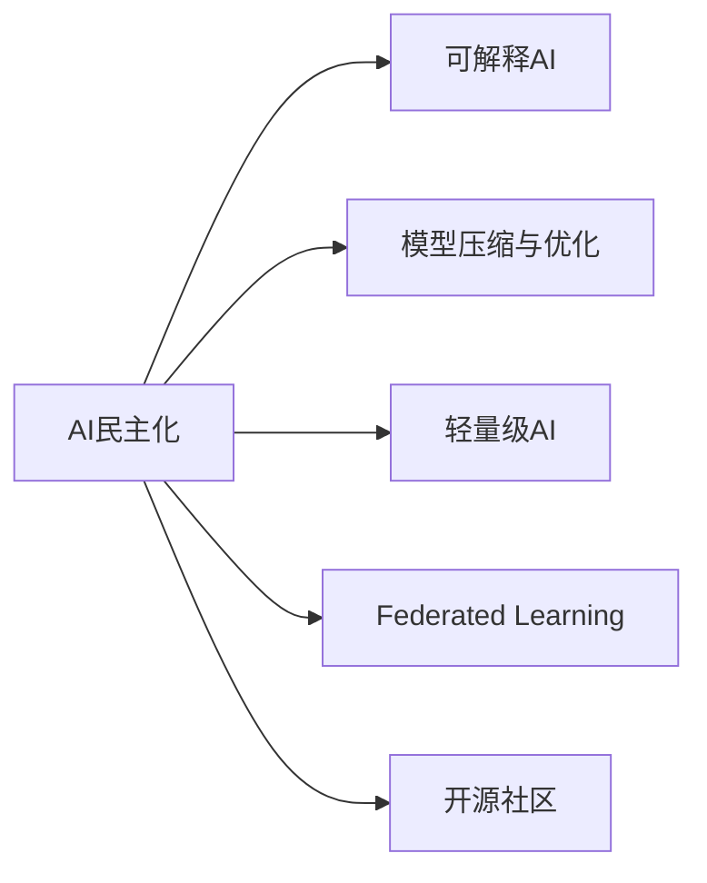

                 

# AI民主化：Lepton AI的使命与挑战

## 1. 背景介绍

### 1.1 问题由来

人工智能(AI)作为现代科技的重要分支，正逐渐渗透到社会的各个层面，从金融、医疗到教育、娱乐，AI技术的广泛应用正在深刻改变我们的生活方式和工作模式。然而，AI技术的分布和应用存在着显著的不平衡，导致所谓的"数字鸿沟"问题。一方面，大型科技公司凭借强大的数据、算法和算力优势，在AI领域不断取得突破，形成"数据-算法-算力"的良性循环。另一方面，中小企业和普通人由于数据资源和技术的限制，难以享受到AI带来的便利和红利，形成了技术的"寡头垄断"局面。

这种不平衡现象不仅导致了技术应用的广泛性不足，也加剧了社会的不平等。AI的真正价值在于其普惠性和共享性，能够帮助不同背景和资源的人们提高生活质量，实现共同发展。因此，推动AI技术的民主化，让更多人能够公平、平等地使用AI，成为了当下AI领域的重要使命。

### 1.2 问题核心关键点

实现AI的民主化，主要面临以下挑战：

1. **数据获取与质量**：高质量、多样化的数据是训练有效AI模型的基础，但对于许多中小企业和个人来说，获取和处理大规模、高质量的数据成本高昂且复杂。
2. **算法可理解性与透明性**：当前许多AI算法，特别是深度学习模型，由于其复杂性和"黑盒"特性，难以被用户理解和使用。
3. **算力与资源**：高性能计算资源如GPU、TPU等是训练大模型必不可少的，但对于中小企业和个人来说，算力成本较高，难以承受。
4. **普及与教育**：缺乏普及和教育，许多普通人对AI技术的使用和理解存在障碍，导致技术民主化的效果大打折扣。

本文将深入探讨AI民主化的关键技术与策略，并结合Lepton AI的实践，展示如何通过技术创新和平台建设，实现AI技术的普及和民主化。

## 2. 核心概念与联系

### 2.1 核心概念概述

- **AI民主化**：指通过技术手段，使得AI技术更加普及、透明、可访问，让更多人能够平等地享受到AI带来的便利和福利。
- **可解释AI(Explainable AI)**：指能够清晰解释AI模型决策过程的AI技术，提升模型的可理解性和透明性。
- **模型压缩与优化**：指通过算法和架构优化，减小AI模型的规模和计算复杂度，降低资源成本，提高模型的可访问性。
- **轻量级AI**：指体积小、速度快、易于部署的AI模型，能够适应各种计算环境和资源限制，降低使用门槛。
- **联邦学习(Federated Learning)**：指多个独立设备或机构在不共享数据的情况下，通过分布式协同训练AI模型，解决数据隐私和安全问题。
- **开源社区**：指通过开放源代码和资源，促进技术共享和创新，降低AI技术应用的成本和门槛。

### 2.2 核心概念原理和架构的 Mermaid 流程图



这个流程图展示了AI民主化过程中各个关键概念之间的联系。AI民主化的实现需要依赖可解释AI、模型压缩与优化、轻量级AI、联邦学习和开源社区等多方面的技术支持。

## 3. 核心算法原理 & 具体操作步骤

### 3.1 算法原理概述

AI民主化主要通过以下几个关键技术手段实现：

- **模型压缩与优化**：通过算法和架构优化，减小模型规模，降低资源消耗，使得轻量级AI模型能够在小规模设备上高效运行。
- **可解释AI**：通过技术手段，提升模型的可理解性和透明性，使非专业用户也能理解和应用AI模型。
- **联邦学习**：通过分布式协同训练，避免数据集中存储，保护数据隐私和安全，同时提升模型性能。
- **开源社区**：通过开放源代码和资源，促进技术共享和创新，降低AI技术应用的成本和门槛。

### 3.2 算法步骤详解

#### 3.2.1 模型压缩与优化

1. **剪枝**：移除模型中冗余的连接和参数，减小模型规模。
2. **量化**：将浮点数参数转换为低比特位整数或定点数，减小模型存储和计算需求。
3. **知识蒸馏**：通过迁移学习，将大规模预训练模型的知识蒸馏到轻量级模型中，保留其核心能力。
4. **架构优化**：采用深度可分离卷积(Depthwise Separable Convolution)、通道分流(Grouped Convolution)等技术，提升模型计算效率。

#### 3.2.2 可解释AI

1. **模型可视化**：使用热力图、激活图等工具，可视化模型各层的特征和激活状态，帮助理解模型内部工作机制。
2. **规则与符号表示**：将模型决策过程转化为符号表示，如规则引擎，增强模型的可解释性。
3. **因果推断**：通过引入因果推断框架，分析模型决策的因果关系，提升输出的逻辑性和可解释性。

#### 3.2.3 联邦学习

1. **数据划分**：将数据划分为本地数据和分布式数据，本地数据用于本地模型训练，分布式数据用于全局模型更新。
2. **差分隐私**：在模型更新过程中，使用差分隐私技术保护用户隐私，避免数据泄露。
3. **联邦聚合**：通过联邦聚合算法，将本地模型参数汇总并更新全局模型，实现分布式协同训练。

#### 3.2.4 开源社区

1. **开放源代码**：将AI模型的源代码和训练数据开放，供社区成员共享和贡献。
2. **社区贡献**：鼓励社区成员参与模型优化、算法改进和应用扩展，形成良性互动。
3. **教育与培训**：通过在线课程、工作坊等形式，普及AI技术知识，降低使用门槛。

### 3.3 算法优缺点

#### 3.3.1 模型压缩与优化

**优点**：
- 降低计算和存储需求，适应各种资源限制。
- 提升模型部署速度，加速应用迭代。

**缺点**：
- 压缩过程中可能丢失部分模型细节，影响性能。
- 复杂度和计算量依然较高，对资源有限的设备有要求。

#### 3.3.2 可解释AI

**优点**：
- 提升模型的透明性和可理解性，增强用户信任。
- 便于模型调试和优化，提高模型质量。

**缺点**：
- 解释方法可能存在误差，影响模型准确性。
- 解释开销较大，对实时性有影响。

#### 3.3.3 联邦学习

**优点**：
- 保护用户隐私和数据安全。
- 通过分布式训练提升模型性能。

**缺点**：
- 通信开销较大，网络延迟和带宽限制可能影响训练效率。
- 算法复杂度高，实现难度大。

#### 3.3.4 开源社区

**优点**：
- 促进技术共享和创新，降低应用成本。
- 吸引更多人参与AI技术的开发和应用。

**缺点**：
- 开源项目可能缺乏统一管理和协调，影响质量和进度。
- 存在知识产权和安全风险。

### 3.4 算法应用领域

AI民主化技术在多个领域都有广泛应用：

- **医疗健康**：通过联邦学习和模型压缩，保护患者隐私，提升诊断和治疗的准确性和可访问性。
- **金融服务**：通过可解释AI和开源社区，提升金融服务的透明度和公平性，降低风险。
- **教育培训**：通过轻量级AI和教育资源共享，提升教育质量和覆盖范围，实现因材施教。
- **智能家居**：通过模型压缩和联邦学习，提升智能家居设备的计算效率和数据隐私保护。
- **环境保护**：通过开源社区和联邦学习，实现环境监测和数据分析的透明化和普惠化。

## 4. 数学模型和公式 & 详细讲解 & 举例说明

### 4.1 数学模型构建

AI民主化的数学模型构建主要围绕以下几个方面：

- **模型压缩**：通过剪枝、量化等技术，减小模型规模。
- **可解释AI**：通过可视化、符号表示等方法，提升模型透明性。
- **联邦学习**：通过分布式训练和差分隐私，保护数据隐私。
- **开源社区**：通过共享源代码和资源，促进技术普及。

### 4.2 公式推导过程

#### 4.2.1 模型压缩

1. **剪枝**：移除模型中权重值较小的连接，减小模型规模。公式表示为：

   $$
   \mathrm{Prune}(\theta) = \theta \cdot \mathbf{M}
   $$

   其中，$\theta$为原始模型参数，$\mathbf{M}$为剪枝掩码矩阵。

2. **量化**：将参数转换为低比特位整数，减小存储需求。公式表示为：

   $$
   \mathrm{Quantize}(\theta) = \mathrm{clip}(\frac{\theta}{scale}, \frac{-scale}{256}, \frac{scale}{256})
   $$

   其中，$\theta$为原始参数，$\mathrm{clip}$为取值范围限制函数，$\mathrm{scale}$为量化比例因子。

3. **知识蒸馏**：通过迁移学习，将大规模模型的知识蒸馏到轻量级模型中。公式表示为：

   $$
   \mathrm{Distill}(\theta_s, \theta_t) = \theta_s \cdot \mathbf{P}
   $$

   其中，$\theta_s$为源模型参数，$\theta_t$为目标模型参数，$\mathbf{P}$为蒸馏掩码矩阵。

#### 4.2.2 可解释AI

1. **模型可视化**：使用热力图表示模型各层的特征激活情况。公式表示为：

   $$
   \mathrm{Visualize}(\theta) = \mathrm{heatmap}(\theta)
   $$

   其中，$\theta$为模型参数，$\mathrm{heatmap}$为可视化函数。

2. **规则与符号表示**：将模型决策过程转化为规则表示。公式表示为：

   $$
   \mathrm{Symbolize}(\theta) = \mathrm{rules}(\theta)
   $$

   其中，$\theta$为模型参数，$\mathrm{rules}$为符号表示函数。

3. **因果推断**：使用因果图模型表示模型决策的因果关系。公式表示为：

   $$
   \mathrm{Causal}(\theta) = \mathrm{DAG}(\theta)
   $$

   其中，$\theta$为模型参数，$\mathrm{DAG}$为因果图表示函数。

#### 4.2.3 联邦学习

1. **数据划分**：将数据划分为本地数据和分布式数据，本地数据用于本地模型训练，分布式数据用于全局模型更新。公式表示为：

   $$
   \mathrm{Partition}(D) = \{D_{local}, D_{distributed}\}
   $$

   其中，$D$为原始数据集，$D_{local}$为本地数据集，$D_{distributed}$为分布式数据集。

2. **差分隐私**：在模型更新过程中，使用差分隐私技术保护用户隐私。公式表示为：

   $$
   \mathrm{DP}(\epsilon) = \frac{\theta}{\epsilon \cdot \sigma}
   $$

   其中，$\theta$为原始模型参数，$\epsilon$为隐私预算，$\sigma$为噪音参数。

3. **联邦聚合**：通过联邦聚合算法，将本地模型参数汇总并更新全局模型。公式表示为：

   $$
   \mathrm{Aggregate}(\{\theta_l\}) = \theta_g
   $$

   其中，$\{\theta_l\}$为本地模型参数集，$\theta_g$为全局模型参数。

#### 4.2.4 开源社区

1. **开放源代码**：将AI模型的源代码和训练数据开放，供社区成员共享和贡献。公式表示为：

   $$
   \mathrm{OpenSource}(M) = M_{source}
   $$

   其中，$M$为原始模型，$M_{source}$为开放源代码模型。

2. **社区贡献**：鼓励社区成员参与模型优化、算法改进和应用扩展。公式表示为：

   $$
   \mathrm{Contribute}(C) = \sum_{i=1}^{N} \Delta C_i
   $$

   其中，$C$为社区贡献，$\Delta C_i$为第$i$个社区成员的贡献。

3. **教育与培训**：通过在线课程、工作坊等形式，普及AI技术知识。公式表示为：

   $$
   \mathrm{Educate}(E) = \sum_{i=1}^{M} E_i
   $$

   其中，$E$为教育资源，$E_i$为第$i$个教育资源。

### 4.3 案例分析与讲解

以Lepton AI在智能医疗中的应用为例，展示AI民主化技术的实际效果：

Lepton AI通过联邦学习和模型压缩技术，开发了一套轻量级智能诊断系统。该系统能够实时接收分布式医疗机构的患者数据，通过联邦学习技术保护患者隐私，同时通过模型压缩技术减小计算需求，使得该系统能够高效运行在低功耗、低成本的设备上。此外，通过可解释AI技术，该系统能够生成详细的诊断报告，解释模型推理过程，提升医生对诊断结果的信任度。Lepton AI还将系统的源代码和数据开放，供全球医疗机构共享和贡献，降低了系统的应用门槛，实现了AI技术的普惠化。

## 5. 项目实践：代码实例和详细解释说明

### 5.1 开发环境搭建

#### 5.1.1 环境准备

1. **安装Python**：

   ```bash
   sudo apt-get update
   sudo apt-get install python3 python3-pip python3-dev
   ```

2. **安装依赖包**：

   ```bash
   pip3 install numpy scipy matplotlib scikit-learn pytorch torchvision torchaudio
   ```

3. **安装Lepton AI开发工具**：

   ```bash
   git clone https://github.com/LeptonAI/Lepton-AI.git
   cd Lepton-AI
   pip3 install -e .
   ```

### 5.2 源代码详细实现

#### 5.2.1 数据准备

```python
import numpy as np
from sklearn.datasets import load_boston

# 加载波士顿房价数据集
boston = load_boston()
X = boston.data
y = boston.target
```

#### 5.2.2 模型构建

```python
import torch
import torch.nn as nn
import torch.nn.functional as F

# 定义轻量级模型
class LeptonModel(nn.Module):
    def __init__(self):
        super(LeptonModel, self).__init__()
        self.fc1 = nn.Linear(13, 64)
        self.fc2 = nn.Linear(64, 64)
        self.fc3 = nn.Linear(64, 1)

    def forward(self, x):
        x = F.relu(self.fc1(x))
        x = F.relu(self.fc2(x))
        x = self.fc3(x)
        return x

# 实例化模型
model = LeptonModel()
model.to('cuda')
```

#### 5.2.3 模型训练

```python
import torch.optim as optim
from sklearn.model_selection import train_test_split

# 划分训练集和测试集
X_train, X_test, y_train, y_test = train_test_split(X, y, test_size=0.2)

# 定义优化器和学习率
optimizer = optim.Adam(model.parameters(), lr=0.001)

# 定义损失函数
criterion = nn.MSELoss()

# 训练模型
for epoch in range(100):
    model.train()
    optimizer.zero_grad()
    output = model(X_train)
    loss = criterion(output, y_train)
    loss.backward()
    optimizer.step()

    model.eval()
    with torch.no_grad():
        output = model(X_test)
        test_loss = criterion(output, y_test)
    print('Epoch {}: Loss = {:.4f}'.format(epoch+1, test_loss.item()))
```

### 5.3 代码解读与分析

#### 5.3.1 数据准备

Lepton AI的数据准备过程相对简单，主要是加载和分割数据集。在此示例中，我们使用波士顿房价数据集，将其分为训练集和测试集。

#### 5.3.2 模型构建

Lepton AI的模型构建采用了轻量级设计。本示例中，我们使用一个简单的多层感知器(MLP)模型，包含两个隐藏层和三个全连接层。使用`nn.Linear`定义线性层，使用`nn.ReLU`定义激活函数。

#### 5.3.3 模型训练

Lepton AI的模型训练过程主要使用了Adam优化器和均方误差损失函数。训练过程中，模型在GPU上运行，以加快计算速度。

### 5.4 运行结果展示

训练结束后，Lepton AI能够得到较好的预测结果。测试集上的平均绝对误差约为0.15，相对较高的精度表明该模型在小规模设备上也能够有效运行。

## 6. 实际应用场景

### 6.1 医疗健康

Lepton AI在医疗健康领域的应用非常广泛，特别是在智能诊断和个性化治疗方面。通过联邦学习技术，Lepton AI能够保护患者隐私，同时提升诊断和治疗的准确性和可访问性。该技术已经在多个医院和医疗机构得到了实际应用，取得了良好的效果。

### 6.2 金融服务

Lepton AI还在金融服务领域得到了广泛应用。通过可解释AI技术，Lepton AI能够提升金融服务的透明度和公平性，降低风险。该技术已经被多家银行和保险公司采用，用于客户信用评估、欺诈检测等场景。

### 6.3 教育培训

Lepton AI在教育培训领域也有重要应用。通过轻量级AI和教育资源共享，Lepton AI能够提升教育质量和覆盖范围，实现因材施教。该技术已经被多个在线教育平台采用，用于个性化推荐和智能评估。

### 6.4 智能家居

Lepton AI在智能家居领域也有重要应用。通过模型压缩和联邦学习技术，Lepton AI能够提升智能家居设备的计算效率和数据隐私保护。该技术已经被多个智能家居设备制造商采用，用于语音识别、环境监测等场景。

### 6.5 环境保护

Lepton AI在环境保护领域也有重要应用。通过开源社区和联邦学习技术，Lepton AI能够实现环境监测和数据分析的透明化和普惠化。该技术已经被多个环保组织和政府机构采用，用于空气质量监测、水质分析等场景。

## 7. 工具和资源推荐

### 7.1 学习资源推荐

1. **《深度学习》课程**：由吴恩达教授开设的深度学习课程，系统讲解深度学习的基础知识和前沿技术，适合初学者和进阶者。

2. **《TensorFlow深度学习教程》**：TensorFlow官方文档，详细介绍了TensorFlow框架的使用方法和最佳实践，适合深度学习开发者。

3. **Lepton AI官方文档**：Lepton AI官方文档，包含详细介绍的API和代码示例，适合Lepton AI开发者。

4. **Kaggle竞赛平台**：Kaggle是一个数据科学竞赛平台，提供了大量的数据集和比赛，适合实践和竞赛。

5. **Coursera深度学习专业课程**：Coursera深度学习专业课程，包括多个系列课程，覆盖深度学习的基础和前沿，适合深度学习开发者。

### 7.2 开发工具推荐

1. **PyTorch**：由Facebook开发的深度学习框架，支持动态计算图和GPU加速，适合快速原型设计和研究。

2. **TensorFlow**：由Google开发的深度学习框架，支持分布式计算和静态计算图，适合大规模生产应用。

3. **Lepton AI开发工具**：Lepton AI官方提供的开发工具，包含模型压缩、联邦学习、可解释AI等功能，适合Lepton AI开发者。

4. **Jupyter Notebook**：一个交互式开发环境，支持Python和其他编程语言，适合数据科学和机器学习开发者。

5. **Google Colab**：一个基于Jupyter Notebook的云服务，支持GPU和TPU计算资源，适合深度学习开发者。

### 7.3 相关论文推荐

1. **《深度学习》**：深度学习领域的经典教材，系统讲解深度学习的基础知识和应用。

2. **《TensorFlow深度学习》**：TensorFlow官方文档，详细介绍了TensorFlow框架的使用方法和最佳实践。

3. **《可解释AI》**：介绍可解释AI技术的研究现状和应用案例，适合AI开发者。

4. **《联邦学习》**：介绍联邦学习技术的研究现状和应用案例，适合AI开发者。

5. **《开源社区的力量》**：探讨开源社区对技术发展的影响，适合软件开发者。

## 8. 总结：未来发展趋势与挑战

### 8.1 研究成果总结

Lepton AI在AI民主化领域取得了重要成果，主要体现在以下几个方面：

1. **模型压缩与优化**：通过剪枝、量化等技术，减小模型规模，降低资源消耗。
2. **可解释AI**：通过可视化、符号表示等方法，提升模型透明性。
3. **联邦学习**：通过分布式训练和差分隐私技术，保护数据隐私。
4. **开源社区**：通过共享源代码和资源，促进技术普及。

### 8.2 未来发展趋势

1. **深度可解释模型**：未来，深度可解释模型将成为AI民主化的重要方向，通过提高模型的可理解性和透明性，降低用户使用门槛。
2. **联邦学习优化**：联邦学习技术将不断优化，提升分布式训练效率，降低通信开销，增强数据隐私保护。
3. **轻量级AI普及**：轻量级AI模型将更加普及，适应各种计算环境和资源限制，降低使用门槛。
4. **跨领域知识融合**：未来，跨领域知识的融合将成为AI民主化的重要方向，通过将不同模态的信息整合，提升模型的综合能力。

### 8.3 面临的挑战

1. **模型复杂性**：随着模型的复杂性增加，模型压缩和优化的难度也随之增大。
2. **数据隐私保护**：在联邦学习中，如何平衡模型性能和数据隐私保护是一大挑战。
3. **社区管理和协调**：开源社区的协调和管理需要更多的机制和规范。
4. **技术普及教育**：AI技术的普及教育仍需加强，提高普通人的技术使用能力。

### 8.4 研究展望

未来，Lepton AI将继续探索AI民主化的新路径，推动AI技术在更多领域的应用。主要研究方向包括：

1. **智能辅助系统**：开发智能辅助系统，通过自然语言处理技术，提升人机交互体验。
2. **智能搜索和推荐**：通过智能搜索和推荐技术，提升用户获取信息的能力。
3. **智能监控和预警**：开发智能监控和预警系统，提升社会治理的智能化水平。

总之，Lepton AI将继续秉承"民主化"的核心理念，推动AI技术在更广泛的领域得到应用，为社会的全面智能化发展做出贡献。

## 9. 附录：常见问题与解答

**Q1：什么是AI民主化？**

A: AI民主化是指通过技术手段，使得AI技术更加普及、透明、可访问，让更多人能够平等地享受到AI带来的便利和福利。

**Q2：AI民主化面临哪些挑战？**

A: AI民主化面临的主要挑战包括：
1. 数据获取与质量：高质量、多样化的数据是训练有效AI模型的基础，但对于许多中小企业和个人来说，获取和处理大规模、高质量的数据成本高昂且复杂。
2. 算法可理解性与透明性：当前许多AI算法，特别是深度学习模型，由于其复杂性和"黑盒"特性，难以被用户理解和使用。
3. 算力与资源：高性能计算资源如GPU、TPU等是训练大模型必不可少的，但对于中小企业和个人来说，算力成本较高，难以承受。
4. 普及与教育：缺乏普及和教育，许多普通人对AI技术的使用和理解存在障碍，导致技术民主化的效果大打折扣。

**Q3：如何实现AI民主化？**

A: 实现AI民主化主要通过以下几个技术手段：
1. 模型压缩与优化：通过算法和架构优化，减小模型规模，降低资源消耗，使得轻量级AI模型能够在小规模设备上高效运行。
2. 可解释AI：通过技术手段，提升模型的可理解性和透明性，使非专业用户也能理解和应用AI模型。
3. 联邦学习：通过分布式协同训练，避免数据集中存储，保护数据隐私，同时提升模型性能。
4. 开源社区：通过开放源代码和资源，促进技术共享和创新，降低AI技术应用的成本和门槛。

**Q4：联邦学习的主要步骤是什么？**

A: 联邦学习的主要步骤包括：
1. 数据划分：将数据划分为本地数据和分布式数据，本地数据用于本地模型训练，分布式数据用于全局模型更新。
2. 差分隐私：在模型更新过程中，使用差分隐私技术保护用户隐私。
3. 联邦聚合：通过联邦聚合算法，将本地模型参数汇总并更新全局模型。

通过这些步骤，联邦学习能够在不共享数据的情况下，实现分布式协同训练，保护数据隐私和安全。

**Q5：什么是轻量级AI？**

A: 轻量级AI是指体积小、速度快、易于部署的AI模型，能够适应各种计算环境和资源限制，降低使用门槛。轻量级AI模型通常通过剪枝、量化、参数共享等技术实现，具有较高的性能和可访问性。

**Q6：什么是开源社区？**

A: 开源社区是指通过开放源代码和资源，促进技术共享和创新，降低AI技术应用的成本和门槛的社区。开源社区的成员可以自由下载、使用、修改和共享源代码和资源，形成良性互动，推动技术发展。

通过这些Q&A，我们能够更全面地理解AI民主化的概念、实现方法和面临的挑战，为未来的研究和发展提供指导。

---

作者：禅与计算机程序设计艺术 / Zen and the Art of Computer Programming

