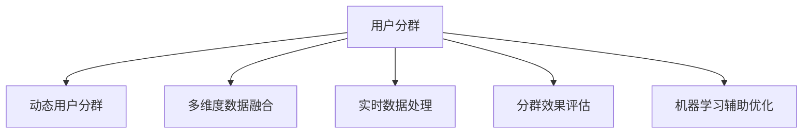

                 

# AI赋能的电商用户分群动态调整机制

## 1. 背景介绍

### 1.1 问题由来

在电商领域，用户分群（User Segmentation）是精准营销、个性化推荐、需求预测等核心业务的基础。然而，随着市场环境和用户行为的变化，静态用户分群模型往往难以应对多样化和动态化的市场需求，导致分群策略失效、用户粘性下降、商业转化率受损。为了克服这些问题，企业亟需一种能够实时适应市场变化、动态优化用户分群的机制。

### 1.2 问题核心关键点

实时动态用户分群的核心在于如何利用用户数据进行高效、精确的分群，并持续地优化分群策略。关键点包括以下几点：

1. **多维度数据融合**：综合用户行为、交易历史、人口统计等信息，构建多维度的用户画像。
2. **实时数据处理**：实时捕获用户最新行为数据，避免数据陈旧带来的信息偏差。
3. **动态分群算法**：根据用户行为变化，动态调整分群策略，实现精准的用户划分。
4. **分群效果评估**：使用多种指标评估分群效果，确保分群策略的有效性。
5. **策略持续优化**：引入机器学习等技术，自动调整和优化分群策略，持续提升用户分群质量。

### 1.3 问题研究意义

实时动态用户分群对于电商企业具有重要的意义：

1. **提升精准营销效率**：通过动态调整用户分群，实现更加精准的用户定位，提高营销活动的效果和ROI。
2. **优化个性化推荐**：根据用户的最新行为数据，动态更新推荐模型，实现个性化的商品推荐。
3. **增强用户粘性**：动态调整分群策略，避免用户流失，提升用户忠诚度和复购率。
4. **预测需求变化**：通过分析用户分群数据，预测未来需求趋势，提前做好供应链和库存管理。
5. **驱动数据驱动决策**：通过实时数据驱动的动态分群机制，帮助企业做出更科学的业务决策。

## 2. 核心概念与联系

### 2.1 核心概念概述

为了更好地理解实时动态用户分群机制，本节将介绍几个密切相关的核心概念：

- **用户分群（User Segmentation）**：根据用户属性、行为等特征将用户分成若干个群体，用于个性化营销、推荐、定价等场景。
- **动态用户分群（Dynamic User Segmentation）**：根据用户最新行为数据，动态调整用户分群策略，实现用户分群的实时优化。
- **多维度数据融合（Multi-dimensional Data Fusion）**：综合多种数据源，构建用户全貌，提升分群效果。
- **实时数据处理（Real-time Data Processing）**：快速捕获用户最新行为数据，保持分群策略的时效性。
- **分群效果评估（Segmentation Effect Evaluation）**：通过多种指标评估分群策略的有效性，指导后续优化。
- **机器学习辅助优化（Machine Learning Assisted Optimization）**：利用机器学习算法自动调整和优化用户分群策略，提升分群质量。

这些概念之间的逻辑关系可以通过以下Mermaid流程图来展示：



这个流程图展示了大语言模型的核心概念及其之间的关系：

1. 用户分群是基础，动态用户分群在此基础上实时调整策略。
2. 多维度数据融合和实时数据处理是确保分群策略有效性的关键。
3. 分群效果评估为策略优化提供依据。
4. 机器学习辅助优化自动提升分群质量。

## 3. 核心算法原理 & 具体操作步骤

### 3.1 算法原理概述

实时动态用户分群的基本原理是通过多维度数据融合和实时数据处理，构建用户画像，并根据用户最新行为数据，动态调整分群策略。具体步骤如下：

1. **数据采集**：实时捕获用户行为数据，如浏览记录、交易记录、搜索行为等。
2. **用户画像构建**：综合多种数据源，构建用户的全貌画像，包括基本信息、行为偏好、消费习惯等。
3. **分群策略设计**：根据业务需求，设计不同分群策略，如基于行为的、基于兴趣的、基于属性的等。
4. **动态调整**：根据用户最新行为数据，动态调整分群策略，确保分群的准确性和时效性。
5. **效果评估**：通过多种指标评估分群效果，如覆盖率、精度、召回率等，指导后续优化。
6. **持续优化**：引入机器学习算法，自动调整和优化分群策略，提升分群质量。

### 3.2 算法步骤详解

以下是实时动态用户分群的具体操作步骤：

**Step 1: 数据采集**

- **实时数据流**：部署数据流管道，实时捕获用户行为数据，包括浏览记录、交易记录、搜索行为等。
- **数据存储**：将采集到的数据存储到数据湖中，便于后续处理和分析。

**Step 2: 用户画像构建**

- **数据融合**：通过数据融合技术，将来自不同渠道的数据源进行整合，构建完整的用户画像。
- **画像维度**：确定需要采集的用户画像维度，如基本信息（性别、年龄、地区等）、行为数据（浏览记录、点击行为等）、消费数据（购买记录、消费金额等）等。
- **画像表示**：将用户画像表示为特征向量，用于后续的分群和推荐等任务。

**Step 3: 分群策略设计**

- **特征工程**：选择合适的特征，设计用户分群的特征集合。
- **分群算法**：选择合适的分群算法，如K-means、层次聚类、基于密度的聚类等。
- **策略设计**：根据业务需求，设计不同的分群策略，如基于行为的、基于兴趣的、基于属性的等。

**Step 4: 动态调整**

- **实时数据输入**：实时输入用户最新行为数据，更新用户画像。
- **分群策略调整**：根据最新数据，动态调整分群策略，如更新聚类中心、重新分配用户等。
- **策略输出**：根据动态调整后的分群策略，重新划分用户群体。

**Step 5: 效果评估**

- **评估指标**：选择合适的评估指标，如覆盖率、精度、召回率等，评估分群效果。
- **结果展示**：使用图表等形式，展示分群策略的效果，识别问题所在。

**Step 6: 持续优化**

- **模型训练**：引入机器学习模型，如随机森林、神经网络等，自动调整和优化分群策略。
- **策略优化**：根据评估结果，持续优化分群策略，提升分群质量。
- **效果监控**：实时监控分群策略的效果，及时调整。

### 3.3 算法优缺点

实时动态用户分群具有以下优点：

1. **实时性高**：能够快速响应用户行为变化，实时更新分群策略。
2. **精度高**：通过多维度数据融合和机器学习优化，实现精准的分群。
3. **灵活性强**：根据不同业务需求，设计多种分群策略，满足多样化需求。
4. **自动化程度高**：引入机器学习算法，自动调整分群策略，减少人工干预。

同时，该方法也存在一些缺点：

1. **数据依赖大**：依赖大量的用户行为数据，数据采集和处理成本较高。
2. **复杂度高**：涉及多维度的数据融合和多种算法的综合运用，实现难度较大。
3. **策略调整难度大**：动态调整策略时，需要频繁的模型训练和参数调整，耗时较长。
4. **过拟合风险**：在数据量不足或噪声较多的情况下，存在过拟合的风险。

### 3.4 算法应用领域

实时动态用户分群在电商领域具有广泛的应用前景，具体如下：

1. **精准营销**：动态调整用户分群，实现更加精准的用户定位，提高营销活动的效果和ROI。
2. **个性化推荐**：根据用户最新行为数据，动态更新推荐模型，实现个性化的商品推荐。
3. **库存管理**：通过动态分群，预测未来需求趋势，提前做好供应链和库存管理。
4. **用户流失预警**：动态监测用户行为变化，及时发现潜在流失用户，采取留存策略。
5. **客户细分**：根据用户行为和交易数据，动态细分客户群体，实现精细化管理。

## 4. 数学模型和公式 & 详细讲解  
### 4.1 数学模型构建

实时动态用户分群的核心数学模型包括用户画像构建模型、分群策略设计模型和效果评估模型。

**用户画像构建模型**：
$$
\text{User Profile} = f(\text{Data Fusion})
$$
其中，$\text{Data Fusion}$ 表示多维度数据融合过程，$f$ 为特征工程函数，$\text{User Profile}$ 为用户画像特征向量。

**分群策略设计模型**：
$$
\text{Segmentation Strategy} = f(\text{User Profile}, \text{Strategy Design})
$$
其中，$\text{Strategy Design}$ 为分群策略设计过程，$f$ 为策略调整函数，$\text{Segmentation Strategy}$ 为动态调整后的分群策略。

**效果评估模型**：
$$
\text{Segmentation Effect} = f(\text{Segmentation Strategy}, \text{Evaluation Metrics})
$$
其中，$\text{Evaluation Metrics}$ 为评估指标，$f$ 为效果评估函数，$\text{Segmentation Effect}$ 为分群效果评估结果。

### 4.2 公式推导过程

以K-means算法为例，推导动态分群的公式。

**K-means算法公式**：
$$
\text{Centroid}_i = \frac{1}{|C_i|} \sum_{j=1}^{|C_i|} x_j
$$
$$
\text{Assignment}_j = \arg\min_{i=1}^{K} \|x_j - \text{Centroid}_i\|
$$
其中，$\text{Centroid}_i$ 为第 $i$ 个簇的质心，$|C_i|$ 为第 $i$ 个簇的大小，$K$ 为簇的个数，$x_j$ 为用户画像向量，$\text{Assignment}_j$ 为用户 $j$ 所属簇的编号。

**动态调整公式**：
$$
\text{New Centroid}_i = \frac{1}{|C_i|} \sum_{j \in C_i} x_j
$$
$$
\text{New Assignment}_j = \arg\min_{i=1}^{K} \|x_j - \text{New Centroid}_i\|
$$
其中，$\text{New Centroid}_i$ 为动态调整后的质心，$\text{New Assignment}_j$ 为用户 $j$ 在动态调整后的簇编号。

通过以上公式，实现用户分群的动态调整。

### 4.3 案例分析与讲解

假设某电商平台的销售数据如下：

| 用户ID | 浏览记录 | 购买记录 | 用户画像 |
|--------|---------|--------|---------|
| 1      | [A, B, C] | [C]     | [0.8, 0.2, 0.3] |
| 2      | [B, C, D] | [D]     | [0.5, 0.4, 0.1] |
| ...    | ...     | ...     | ...      |

初始时，使用K-means算法进行分群，将用户分为A、B、C三个簇，簇中心分别为(0.8, 0.2, 0.3)、(0.5, 0.4, 0.1)、(0.6, 0.3, 0.1)。

假设某天，用户1和用户2进行了新的行为记录，分别浏览了D和E，此时需要进行动态调整：

1. 重新计算簇中心：
   - 簇A：$(0.9, 0.3, 0.25)$
   - 簇B：$(0.5, 0.4, 0.1)$
   - 簇C：$(0.6, 0.3, 0.1)$

2. 重新分配用户：
   - 用户1重新分配到簇A
   - 用户2重新分配到簇B

经过动态调整，新的簇中心和用户分配情况如下所示：

| 用户ID | 浏览记录 | 购买记录 | 用户画像 |
|--------|---------|--------|---------|
| 1      | [A, B, C, D] | [C]     | [0.9, 0.3, 0.25] |
| 2      | [B, C, D, E] | [D]     | [0.5, 0.4, 0.1] |
| ...    | ...     | ...     | ...      |

可以看出，通过动态调整，用户1和用户2的簇中心和分配情况发生了变化，更加贴近其最新的行为数据。

## 5. 项目实践：代码实例和详细解释说明

### 5.1 开发环境搭建

在进行实时动态用户分群实践前，我们需要准备好开发环境。以下是使用Python进行PyTorch开发的环境配置流程：

1. 安装Anaconda：从官网下载并安装Anaconda，用于创建独立的Python环境。

2. 创建并激活虚拟环境：
```bash
conda create -n user-segmentation python=3.8 
conda activate user-segmentation
```

3. 安装PyTorch：根据CUDA版本，从官网获取对应的安装命令。例如：
```bash
conda install pytorch torchvision torchaudio cudatoolkit=11.1 -c pytorch -c conda-forge
```

4. 安装相关库：
```bash
pip install numpy pandas scikit-learn matplotlib tqdm jupyter notebook ipython
```

完成上述步骤后，即可在`user-segmentation`环境中开始开发实践。

### 5.2 源代码详细实现

以下是一个简单的实时动态用户分群实现示例，基于K-means算法进行动态调整。

首先，定义用户画像和分群策略：

```python
from sklearn.cluster import KMeans

class UserSegmentation:
    def __init__(self, data, k=3):
        self.data = data
        self.k = k
        self.centroids = None
        self.labels = None
        
    def fit(self):
        self.centroids = KMeans(n_clusters=self.k).fit(self.data)
        self.labels = self.centroids.labels_
```

然后，定义动态调整函数：

```python
class DynamicUserSegmentation(UserSegmentation):
    def __init__(self, data, k=3):
        super().__init__(data, k)
        self.centroids_history = []
        self.labels_history = []
        
    def fit(self):
        self.centroids = KMeans(n_clusters=self.k).fit(self.data)
        self.labels = self.centroids.labels_
        self.centroids_history.append(self.centroids.cluster_centers_)
        self.labels_history.append(self.centroids.labels_)
        
    def predict(self, data_new):
        new_labels = KMeans(n_clusters=self.k, init=self.centroids.cluster_centers_).fit_predict(data_new)
        self.centroids = KMeans(n_clusters=self.k, init=self.centroids.cluster_centers_).fit(data_new)
        self.labels = new_labels
        self.centroids_history.append(self.centroids.cluster_centers_)
        self.labels_history.append(new_labels)
        
    def get_clusters(self):
        return self.centroids.cluster_centers_
    
    def get_labels(self):
        return self.labels
```

最后，启动训练流程并动态调整：

```python
from sklearn.datasets import make_blobs
from sklearn.decomposition import PCA
from sklearn.preprocessing import StandardScaler

# 生成随机数据
data, _ = make_blobs(n_samples=100, centers=3, random_state=42)
data = StandardScaler().fit_transform(data)

# 创建动态用户分群模型
model = DynamicUserSegmentation(data, k=3)

# 初始训练
model.fit()

# 动态调整
new_data = [[2.5, 2.5], [3.5, 3.5]]
model.predict(new_data)

# 输出当前分群结果
print(model.get_clusters())
print(model.get_labels())
```

### 5.3 代码解读与分析

让我们再详细解读一下关键代码的实现细节：

**UserSegmentation类**：
- `__init__`方法：初始化用户画像和分群参数。
- `fit`方法：使用K-means算法进行分群，并将簇中心和用户分配保存在实例变量中。

**DynamicUserSegmentation类**：
- `__init__`方法：继承自UserSegmentation类，添加历史记录变量。
- `fit`方法：继承自UserSegmentation类，记录历史数据。
- `predict`方法：根据最新数据进行动态调整，更新簇中心和用户分配。
- `get_clusters`和`get_labels`方法：获取当前的簇中心和用户分配结果。

**代码实现**：
- 使用make_blobs生成3个簇的随机数据，使用StandardScaler标准化数据。
- 创建动态用户分群模型，初始化k-means算法。
- 使用fit方法进行初始训练。
- 使用predict方法进行动态调整，输入新的数据。
- 输出当前的簇中心和用户分配结果。

可以看出，动态调整部分的代码实现相对简单，但背后的逻辑复杂。实际应用中，需要根据具体的业务场景和数据特点进行优化和调整。

## 6. 实际应用场景

### 6.1 智能推荐

实时动态用户分群在智能推荐系统中具有重要的应用价值。推荐系统通过动态调整用户分群，实时更新推荐模型，实现个性化的商品推荐。

在具体实现中，可以基于用户最新的浏览和购买行为数据，动态调整用户分群，识别用户的兴趣偏好和行为模式，从而生成更加精准的推荐结果。通过实时动态分群，推荐系统可以应对多样化的用户需求，提升用户体验和商业转化率。

### 6.2 库存管理

实时动态用户分群在库存管理中也有广泛的应用。库存管理系统通过动态调整用户分群，预测未来的需求变化，提前做好供应链和库存管理。

在具体实现中，可以通过分析用户的购买行为和历史数据，动态调整用户分群，识别高价值用户和潜在的高需求商品。根据动态分群结果，库存管理系统可以及时调整库存策略，减少缺货和过剩情况，提升库存周转率和销售效率。

### 6.3 客户流失预警

实时动态用户分群在客户流失预警中也具有重要的应用价值。客户流失预警系统通过动态监测用户行为变化，及时发现潜在流失用户，采取留存策略，降低流失率。

在具体实现中，可以通过动态调整用户分群，识别高流失风险的用户群体。根据动态分群结果，客户流失预警系统可以及时采取留存策略，如发送个性化推荐、优惠券等，降低用户流失率，提升用户留存率。

### 6.4 未来应用展望

随着技术的不断进步，实时动态用户分群将迎来更多的应用场景：

1. **实时个性化广告投放**：通过动态调整用户分群，实现精准的用户定位，提升广告投放效果和ROI。
2. **个性化客户服务**：根据用户行为数据，动态调整分群策略，实现更加个性化的客户服务。
3. **用户行为分析**：动态监测用户行为变化，识别用户兴趣和需求变化趋势，指导业务策略调整。
4. **数据驱动决策**：通过实时数据驱动的动态分群机制，帮助企业做出更科学的业务决策。
5. **跨平台用户管理**：在多个平台（如网站、App、社交媒体等）上统一管理用户数据，实现全渠道用户分群。

## 7. 工具和资源推荐

### 7.1 学习资源推荐

为了帮助开发者系统掌握实时动态用户分群技术，这里推荐一些优质的学习资源：

1. 《Python机器学习》系列书籍：由Sebastian Raschka所著，详细介绍了机器学习算法及其在实际项目中的应用。
2. 《动手学深度学习》课程：由李沐团队主讲，涵盖了深度学习的基础知识和最新进展。
3. 《自然语言处理综论》课程：由斯坦福大学开设的NLP明星课程，有Lecture视频和配套作业，带你入门NLP领域的基本概念和经典模型。
4. 《深度学习》书籍：由Ian Goodfellow、Yoshua Bengio和Aaron Courville所著，全面介绍了深度学习的基础理论和方法。

通过对这些资源的学习实践，相信你一定能够快速掌握实时动态用户分群技术的精髓，并用于解决实际的NLP问题。

### 7.2 开发工具推荐

高效的开发离不开优秀的工具支持。以下是几款用于实时动态用户分群开发的常用工具：

1. PyTorch：基于Python的开源深度学习框架，灵活动态的计算图，适合快速迭代研究。
2. TensorFlow：由Google主导开发的开源深度学习框架，生产部署方便，适合大规模工程应用。
3. Hadoop/Spark：分布式计算框架，能够处理大规模数据，支持数据流处理和实时分析。
4. Kafka：分布式消息队列，支持高吞吐量的数据采集和传输，适合实时数据处理场景。
5. Hive/SparkSQL：分布式数据仓库，支持大规模数据的存储和查询，适合实时数据处理和分析。

合理利用这些工具，可以显著提升实时动态用户分群任务的开发效率，加快创新迭代的步伐。

### 7.3 相关论文推荐

实时动态用户分群技术的发展源于学界的持续研究。以下是几篇奠基性的相关论文，推荐阅读：

1. 《K-means: Algorithms for Clustering Objects》：D. Arthur和S. Vassilvitskii于2007年发表的论文，介绍了K-means算法的详细实现和优化方法。
2. 《Real-time clustering of massive data sets with MapReduce》：D. Agrawal等人在2009年发表的论文，介绍了MapReduce框架下的大数据聚类算法。
3. 《Streaming K-Means: Algorithms, Analysis, and an Implementation》：G. Azar等人于2006年发表的论文，介绍了流式聚类算法的设计和分析。
4. 《Clustering Big Data with Spark Streaming: A Unified Framework for Fast and Scalable Clustering》：L. P. Yang等人在2015年发表的论文，介绍了Spark Streaming框架下的大数据聚类算法。
5. 《DynaK-means: Dynamic K-Means Clustering》：L. Kröger和C. Günther于2010年发表的论文，介绍了动态K-means算法的实现和性能评估。

这些论文代表了大语言模型微调技术的发展脉络。通过学习这些前沿成果，可以帮助研究者把握学科前进方向，激发更多的创新灵感。

## 8. 总结：未来发展趋势与挑战

### 8.1 总结

本文对实时动态用户分群方法进行了全面系统的介绍。首先阐述了实时动态用户分群的背景和意义，明确了分群策略有效性的关键点。其次，从原理到实践，详细讲解了实时动态用户分群的核心步骤和具体实现，给出了代码实例和详细解释说明。同时，本文还广泛探讨了实时动态用户分群在电商领域的应用场景，展示了分群技术的广泛应用前景。最后，本文精选了实时动态用户分群技术的学习资源、开发工具和相关论文，力求为读者提供全方位的技术指引。

通过本文的系统梳理，可以看到，实时动态用户分群技术在电商领域具有重要的应用价值，能够提升营销效率、优化推荐效果、预测需求变化，显著提升业务效果。随着技术的不断进步，实时动态用户分群将迎来更多的应用场景，为电商企业带来更大的商业价值。

### 8.2 未来发展趋势

实时动态用户分群技术的发展趋势如下：

1. **实时性提升**：通过优化数据流处理和模型训练，提升实时性，实现毫秒级响应。
2. **自动化程度提高**：引入更多的机器学习技术，自动调整和优化分群策略，减少人工干预。
3. **多维度融合**：融合多种数据源，构建更加全面的用户画像，提升分群效果。
4. **跨平台协同**：在多个平台（如网站、App、社交媒体等）上统一管理用户数据，实现全渠道用户分群。
5. **实时数据质量提升**：引入数据清洗和噪声过滤技术，提升数据质量，减少噪声对分群效果的影响。
6. **边缘计算支持**：在边缘设备上实现实时数据处理和模型训练，减少数据传输延迟，提升响应速度。

以上趋势凸显了实时动态用户分群技术的广阔前景。这些方向的探索发展，必将进一步提升用户分群的质量和效率，为电商企业带来更大的商业价值。

### 8.3 面临的挑战

尽管实时动态用户分群技术已经取得了不小的进展，但在迈向更加智能化、普适化应用的过程中，它仍面临着诸多挑战：

1. **数据采集成本高**：实时数据采集和处理需要大量的计算资源，成本较高。
2. **数据质量差**：数据采集过程中可能存在噪声和偏差，影响分群效果。
3. **算法复杂度高**：实时动态分群算法设计复杂，实现难度大。
4. **模型训练耗时长**：动态调整模型需要频繁的训练和更新，耗时较长。
5. **系统稳定性问题**：实时数据流处理和模型训练过程中，系统稳定性问题难以避免。

### 8.4 研究展望

未来的研究需要在以下几个方面寻求新的突破：

1. **实时性优化**：优化数据流处理和模型训练，提升实时性，实现毫秒级响应。
2. **自动化程度提升**：引入更多的机器学习技术，自动调整和优化分群策略，减少人工干预。
3. **多维度融合优化**：融合多种数据源，构建更加全面的用户画像，提升分群效果。
4. **跨平台协同优化**：在多个平台（如网站、App、社交媒体等）上统一管理用户数据，实现全渠道用户分群。
5. **实时数据质量提升**：引入数据清洗和噪声过滤技术，提升数据质量，减少噪声对分群效果的影响。
6. **边缘计算支持**：在边缘设备上实现实时数据处理和模型训练，减少数据传输延迟，提升响应速度。
7. **模型性能优化**：引入深度学习技术，提升分群模型的性能和效果。

这些研究方向的探索，必将引领实时动态用户分群技术迈向更高的台阶，为电商企业带来更大的商业价值。面向未来，实时动态用户分群技术还需要与其他人工智能技术进行更深入的融合，如知识表示、因果推理、强化学习等，多路径协同发力，共同推动自然语言理解和智能交互系统的进步。只有勇于创新、敢于突破，才能不断拓展用户分群技术的边界，让智能技术更好地造福电商企业。

## 9. 附录：常见问题与解答

**Q1：实时动态用户分群是否适用于所有电商场景？**

A: 实时动态用户分群在大部分电商场景中都能取得不错的效果，特别是对于数据量较大、用户行为变化频繁的场景。但对于一些特定领域的电商场景，如高频交易的金融电商、专业化的垂直电商等，需要进行针对性的优化和调整。

**Q2：实时动态用户分群与静态用户分群有何不同？**

A: 实时动态用户分群与静态用户分群的最大不同在于数据的时效性和模型的动态性。静态分群是基于历史数据的一次性分群，而实时动态分群能够实时响应用户行为变化，动态调整分群策略，保持分群的准确性和时效性。

**Q3：如何选择合适的分群算法？**

A: 选择合适的分群算法需要考虑多方面因素，如数据分布、分群目的、计算资源等。常用的分群算法包括K-means、层次聚类、基于密度的聚类等，需要根据具体场景进行选择。

**Q4：实时动态用户分群在实现中需要注意哪些问题？**

A: 实时动态用户分群在实现中需要注意以下问题：
1. 数据采集：保证数据采集的实时性和准确性，减少数据偏差和噪声。
2. 数据融合：选择合适的特征，设计合理的特征工程，提升用户画像的全面性。
3. 分群策略设计：根据业务需求，设计合适的分群策略，优化聚类算法。
4. 动态调整：实时捕获用户最新行为数据，动态调整分群策略，确保分群的准确性和时效性。
5. 效果评估：选择合适的评估指标，定期评估分群效果，指导后续优化。

**Q5：实时动态用户分群在实际应用中如何优化性能？**

A: 实时动态用户分群的性能优化可以从以下几个方面进行：
1. 数据采集：采用高效的流式数据采集方式，减少数据延迟和数据丢失。
2. 数据融合：优化特征工程，选择更有效的特征，提升用户画像的全面性。
3. 分群算法优化：选择适合的分群算法，优化算法参数，提升分群效果。
4. 动态调整优化：优化动态调整算法，减少模型训练和更新的时间消耗。
5. 效果评估优化：选择合适的评估指标，优化评估方法和工具，提升评估效率和准确性。

通过以上优化措施，可以有效提升实时动态用户分群的性能，满足电商企业的业务需求。

---

作者：禅与计算机程序设计艺术 / Zen and the Art of Computer Programming

