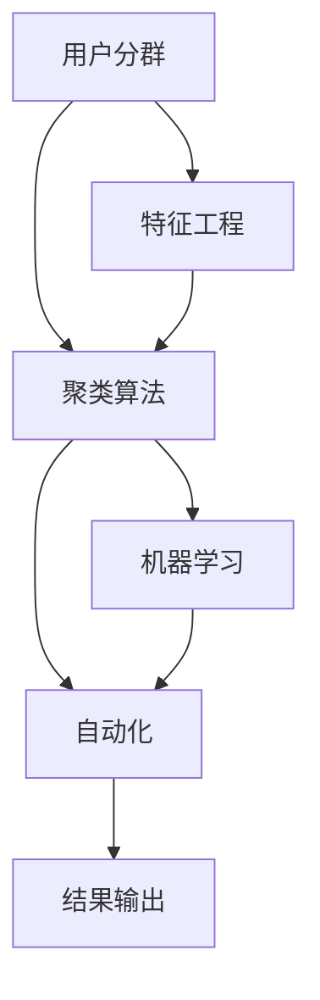

                 

# AI赋能的电商用户分群自动化

> 关键词：用户分群,电商,人工智能,机器学习,聚类算法,特征工程,自动化

## 1. 背景介绍

### 1.1 问题由来

随着电子商务的迅猛发展，用户分群成为电商运营策略的核心。用户分群的目标是识别和归类不同消费行为、需求和偏好的用户群体，从而实现更精准的市场营销、个性化推荐和用户转化。传统用户分群方法依赖人工标注，耗时耗力且结果依赖于标注人员的经验和主观判断，难以应对大规模用户数据的处理。

近年来，随着人工智能技术的进步，尤其是机器学习在用户分群领域的应用，为电商用户分群带来了新的可能。AI驱动的自动化用户分群技术，不仅大大降低了人工成本，还能更准确、更全面地理解用户特征，为电商运营策略的优化提供了强有力的数据支持。

### 1.2 问题核心关键点

AI赋能的电商用户分群自动化，本质上是通过机器学习算法，对电商用户的特征进行自动化的数据挖掘和分析，实现用户分群的目标。关键点包括：

- 用户特征工程：构建和选择用户特征，是用户分群的基础。
- 聚类算法选择：选择适合的聚类算法，对用户进行分群。
- 模型训练和优化：训练聚类模型，并通过优化算法提高模型性能。
- 自动化流程设计：设计自动化流程，确保用户分群的连续性、稳定性和高效性。

## 2. 核心概念与联系

### 2.1 核心概念概述

为更好地理解AI赋能的电商用户分群自动化的过程，本节将介绍几个密切相关的核心概念：

- **用户分群(User Segmentation)**：将电商用户依据一定的标准划分为不同的用户群体，以便于分析和制定针对性的运营策略。
- **特征工程(Feature Engineering)**：根据用户行为数据，选择和构造最具代表性的用户特征，作为用户分群的依据。
- **聚类算法(Clustering Algorithm)**：通过无监督学习，将具有相似特征的用户自动分群。
- **机器学习(Machine Learning)**：通过训练算法模型，对用户数据进行预测和分类。
- **自动化(Automatic)**：指将上述技术过程实现自动化，无需人工干预，持续产出用户分群结果。

这些核心概念之间的逻辑关系可以通过以下Mermaid流程图来展示：



这个流程图展示了从用户分群到特征工程、聚类算法、机器学习，再到自动化的整个过程，反映了用户分群自动化的核心步骤。

## 3. 核心算法原理 & 具体操作步骤

### 3.1 算法原理概述

AI赋能的电商用户分群自动化，主要基于无监督学习中的聚类算法，通过构建用户特征空间，自动发现具有相似特征的用户群体。聚类算法的核心在于度量用户特征之间的距离，并根据预设的相似度阈值，将用户分为不同的集群。

常用的聚类算法包括K-Means、层次聚类、DBSCAN、谱聚类等。这些算法的基本原理和步骤大致相似，主要区别在于距离度量函数和簇形成方式的不同。在实际应用中，需要根据数据特点和需求选择合适的算法。

### 3.2 算法步骤详解

#### 3.2.1 数据准备

- **数据采集**：收集电商平台的各类数据，包括用户基本信息（如年龄、性别、地理位置）、行为数据（如浏览记录、购买历史、评价内容）等。
- **数据清洗**：处理缺失值、异常值和重复数据，确保数据的完整性和一致性。
- **数据标准化**：对数据进行归一化处理，消除不同特征之间的尺度差异。

#### 3.2.2 特征选择与构建

- **特征选择**：选择最具代表性的用户特征，剔除噪声和冗余特征。常见特征包括用户性别、购买频率、浏览时长等。
- **特征构建**：对原始数据进行加工和变换，生成新的特征。例如，通过计算用户的购买次数和平均订单价值，构造“订单活跃度”特征。

#### 3.2.3 模型训练

- **聚类模型训练**：使用选择的聚类算法，对用户特征矩阵进行训练，得到聚类模型。常见的聚类算法如K-Means、层次聚类等。
- **模型评估**：使用内部和外部指标评估聚类模型的性能。例如，使用轮廓系数(Silhouette Coefficient)、Calinski-Harabasz指数等。

#### 3.2.4 自动化流程设计

- **模型自动化**：设计用户分群的自动化流程，包括数据预处理、特征工程、模型训练、结果输出等步骤，确保流程的连续性和稳定性。
- **结果输出**：将用户分群结果输出为表格、图表等形式，便于分析和应用。

#### 3.2.5 优化与迭代

- **参数调优**：根据模型评估结果，调整聚类算法的参数，优化模型性能。
- **模型迭代**：定期重新训练聚类模型，适应用户行为的变化和新数据的加入。

### 3.3 算法优缺点

AI赋能的电商用户分群自动化具有以下优点：

- **高效性**：自动化流程减少了人工干预，提高了用户分群的效率。
- **准确性**：算法可以自动识别用户特征的相似性，避免主观因素的影响。
- **可扩展性**：自动化流程可处理大规模数据，适用于电商平台的运营需求。

同时，该方法也存在一些缺点：

- **依赖数据质量**：算法结果依赖于数据的完整性和质量，数据采集和清洗难度较大。
- **模型选择复杂**：不同的聚类算法适用于不同的数据和需求，选择合适的算法需要经验和实验。
- **可解释性不足**：聚类模型通常缺乏直观的解释，难以理解聚类的内部机制。

尽管存在这些局限性，AI赋能的用户分群自动化仍然是大数据时代电商运营的重要手段，能够帮助企业更精准地理解用户需求，提升运营效率。

### 3.4 算法应用领域

AI赋能的电商用户分群自动化技术，已在电商平台的多个场景中得到应用，例如：

- **个性化推荐系统**：根据用户分群结果，实现精准的个性化商品推荐。
- **营销活动设计**：通过用户分群，设计更有效的广告投放策略和促销活动。
- **用户流失预警**：识别高流失风险用户群体，提前采取干预措施。
- **商品定价策略**：分析不同用户群体的购买行为，制定动态定价策略。

除了上述这些经典应用外，AI用户分群自动化技术还被创新性地应用于客户细分、渠道优化、库存管理等电商运营的更多环节，为电商平台带来了显著的运营效益。

## 4. 数学模型和公式 & 详细讲解 & 举例说明

### 4.1 数学模型构建

本节将使用数学语言对AI赋能的电商用户分群自动化的过程进行更加严格的刻画。

假设电商平台的原始数据集为 $D = \{(x_i, y_i)\}_{i=1}^N$，其中 $x_i$ 表示用户特征向量， $y_i$ 表示用户标签。用户分群的目标是将数据集中的用户分为若干个不同的簇 $C_k$，其中 $k$ 表示簇的编号，满足 $k=1,2,\dots,K$。

定义聚类模型的损失函数为 $L(C)$，其中 $C$ 表示聚类结果，即每个样本属于哪个簇。为了使聚类结果尽量符合真实情况，我们通常采用最小化损失函数 $L(C)$ 的方法，即寻找最优的聚类结果 $C^*$：

$$
C^* = \mathop{\arg\min}_{C} L(C)
$$

### 4.2 公式推导过程

#### 4.2.1 K-Means算法

K-Means算法是一种常用的聚类算法，其核心思想是将数据点分为 $K$ 个簇，使得每个数据点到其所属簇的中心的距离最小。设 $c_k$ 为簇 $k$ 的中心，$n_k$ 为簇 $k$ 中的数据点数量，则K-Means的损失函数为：

$$
L(C) = \sum_{k=1}^K \sum_{x_i \in C_k} ||x_i - c_k||^2
$$

其中，$||\cdot||$ 表示欧式距离。

推导过程如下：

设簇 $C_k$ 的中心为 $c_k$，则每个数据点 $x_i$ 到中心 $c_k$ 的距离为：

$$
d_{ik} = ||x_i - c_k||
$$

则数据点 $x_i$ 的平方距离为：

$$
d_{ik}^2 = (x_i - c_k)^T(x_i - c_k)
$$

总距离 $L(C)$ 的平方和为：

$$
L(C) = \sum_{k=1}^K \sum_{i=1}^{n_k} d_{ik}^2
$$

为了最小化损失函数 $L(C)$，我们需要最小化每个簇内的平方距离之和。使用拉格朗日乘子法，引入约束条件 $n_k \geq 0$，可得到优化目标：

$$
\mathop{\min}_{c_k} \sum_{k=1}^K \sum_{i=1}^{n_k} (x_i - c_k)^T(x_i - c_k)
$$

等价于：

$$
\mathop{\min}_{c_k} \sum_{k=1}^K \frac{1}{2} \sum_{i=1}^{n_k} ||x_i - c_k||^2
$$

对每个中心 $c_k$ 求偏导数，可得：

$$
\frac{\partial L(C)}{\partial c_k} = -\sum_{i=1}^{n_k} (x_i - c_k)
$$

根据上述公式，每次迭代更新中心 $c_k$ 的过程如下：

1. 初始化 $c_k$ 为随机值。
2. 计算每个数据点 $x_i$ 到每个中心的距离，分配到最近的簇。
3. 更新每个簇的中心 $c_k$，计算新的中心。
4. 重复步骤2-3，直到收敛。

最终得到的聚类结果 $C^*$ 即为最优的簇分配。

### 4.3 案例分析与讲解

#### 案例分析：电商用户分群

假设我们有一份电商用户数据集 $D = \{(x_i, y_i)\}_{i=1}^N$，其中 $x_i$ 包括用户的年龄、性别、购买频率、平均订单金额等特征。我们将用户分为三个簇 $C_1, C_2, C_3$，其中 $C_1$ 表示低价值用户，$C_2$ 表示中价值用户，$C_3$ 表示高价值用户。

1. **特征选择与构建**：
   - 选择用户的平均订单金额、购买频率等特征。
   - 构造“订单活跃度”特征：$x_{order\_activ} = \frac{\text{总购买次数}}{\text{总订单数}}$。

2. **聚类模型训练**：
   - 使用K-Means算法对用户特征矩阵进行训练。
   - 聚类结果分配给每个样本 $x_i$，得到用户分群标签 $y_i$。

3. **模型评估**：
   - 使用轮廓系数(Silhouette Coefficient)评估聚类效果，计算每个用户 $i$ 的轮廓系数 $s_i$：
     - $a_i = \frac{1}{|\mathcal{N}(i)|} \sum_{j \in \mathcal{N}(i)} \text{Similarity}(x_i, x_j)$
     - $b_i = \text{Max}_{j \notin \mathcal{N}(i)} \text{Similarity}(x_i, x_j)$
     - $s_i = \frac{b_i - a_i}{\text{Max}(a_i, b_i)}$

   - 计算所有用户 $i$ 的平均轮廓系数，得到聚类模型的轮廓系数。

4. **结果输出**：
   - 将用户分群结果输出为表格形式，便于分析和应用。

## 5. 项目实践：代码实例和详细解释说明

### 5.1 开发环境搭建

在进行用户分群实践前，我们需要准备好开发环境。以下是使用Python进行Scikit-learn开发的环境配置流程：

1. 安装Anaconda：从官网下载并安装Anaconda，用于创建独立的Python环境。

2. 创建并激活虚拟环境：
```bash
conda create -n sklearn-env python=3.8 
conda activate sklearn-env
```

3. 安装Scikit-learn：
```bash
conda install scikit-learn
```

4. 安装各类工具包：
```bash
pip install numpy pandas scikit-learn matplotlib tqdm jupyter notebook ipython
```

完成上述步骤后，即可在`sklearn-env`环境中开始用户分群实践。

### 5.2 源代码详细实现

下面我们以K-Means算法为例，给出使用Scikit-learn对电商用户进行分群的Python代码实现。

首先，定义用户数据处理函数：

```python
import pandas as pd
from sklearn.preprocessing import StandardScaler

def preprocess_data(data):
    # 数据清洗
    data.dropna(inplace=True)
    
    # 数据标准化
    scaler = StandardScaler()
    scaled_data = scaler.fit_transform(data[['age', 'gender', 'buy_frequency', 'avg_order_amount']])
    
    return scaled_data
```

然后，定义聚类函数：

```python
from sklearn.cluster import KMeans

def kmeans_clustering(data, k=3):
    # 聚类
    kmeans = KMeans(n_clusters=k)
    kmeans.fit(data)
    
    # 获取聚类结果
    clusters = kmeans.predict(data)
    
    return clusters
```

接着，定义模型评估函数：

```python
from sklearn.metrics import silhouette_score

def evaluate_model(clusters, labels):
    # 计算轮廓系数
    silhouette_avg = silhouette_score(labels, clusters)
    
    return silhouette_avg
```

最后，启动用户分群流程并评估：

```python
# 加载数据
data = pd.read_csv('user_data.csv')

# 数据预处理
scaled_data = preprocess_data(data)

# 聚类
clusters = kmeans_clustering(scaled_data)

# 评估
silhouette_avg = evaluate_model(clusters, data['labels'])

print(f"聚类模型的轮廓系数为: {silhouette_avg}")
```

以上就是使用Scikit-learn对电商用户进行分群的完整代码实现。可以看到，利用Scikit-learn的强大封装，我们可以用相对简洁的代码完成K-Means算法的实现。

### 5.3 代码解读与分析

让我们再详细解读一下关键代码的实现细节：

**preprocess_data函数**：
- 数据清洗：使用`dropna`方法删除缺失值。
- 数据标准化：使用`StandardScaler`对特征进行归一化处理。

**kmeans_clustering函数**：
- 使用`KMeans`算法对数据进行聚类。
- 输出聚类结果，即为用户的簇编号。

**evaluate_model函数**：
- 使用`silhouette_score`计算聚类模型的轮廓系数，评估聚类效果。

**启动流程**：
- 加载用户数据集。
- 对数据进行预处理。
- 进行K-Means聚类。
- 计算轮廓系数，输出评估结果。

## 6. 实际应用场景

### 6.1 智能推荐系统

基于用户分群的智能推荐系统，可以显著提升推荐的个性化和准确性。传统的推荐系统依赖用户的显式评分数据，难以捕捉用户的隐式偏好和行为。而通过用户分群，可以更准确地理解不同用户群体的需求和兴趣，实现更精准的商品推荐。

在技术实现上，可以设计多维度特征选择策略，如时间特征、地理位置、用户交互特征等，使用聚类算法对用户进行细分，构建更精准的推荐模型。通过用户分群，将相似用户分为同一群组，在推荐时将相似用户的历史行为作为推荐依据，提升推荐的个性化水平。

### 6.2 用户行为分析

用户分群还可以用于深入分析用户行为模式和消费趋势。通过对不同用户群体的行为数据进行统计分析，可以识别出不同群体的购买偏好、活跃时间、流失风险等特征，为产品迭代和运营策略提供有力支持。

例如，通过用户分群，可以发现哪些用户群体的购买频次低，流失率高，从而制定针对性的运营策略。对于高流失风险用户，可以设计个性化的留存活动，提升用户黏性。对于低价值用户，可以提供促销优惠，促使其转变为高价值用户。

### 6.3 个性化广告投放

基于用户分群的个性化广告投放，可以实现更高的广告转化率和ROI。传统的广告投放依赖用户的基本特征，难以对不同用户群体进行精细化管理。而通过用户分群，可以将用户按照行为特征、兴趣偏好等维度进行划分，针对性地设计广告内容，提升广告效果。

例如，对于高价值用户群体，可以投放高精准度的个性化广告，如推荐相关产品、优惠信息等。对于潜在高价值用户，可以推送引导性广告，激发其购买兴趣。通过用户分群，广告投放更加精准，广告预算的利用效率大幅提升。

### 6.4 未来应用展望

随着用户分群技术的发展，未来将在更多领域得到应用，为电商运营带来更大的变革潜力。

在智慧物流领域，用户分群技术可以用于分析不同用户群体的物流需求，优化仓储和配送策略，提升物流效率。在智能客服领域，通过用户分群，可以设计更精准的客服机器人，提供更个性化的服务体验。

未来，用户分群技术还将与其他人工智能技术进行更深度的融合，如知识图谱、深度学习、强化学习等，推动电商运营策略的智能化和自动化，提升运营效率和用户体验。

## 7. 工具和资源推荐

### 7.1 学习资源推荐

为了帮助开发者系统掌握用户分群技术的理论基础和实践技巧，这里推荐一些优质的学习资源：

1. 《Python数据科学手册》系列书籍：该书系统介绍了数据科学和机器学习的基本概念和方法，适合入门学习。
2. Coursera《机器学习》课程：斯坦福大学的经典课程，涵盖了机器学习的基本原理和算法。
3. Kaggle竞赛平台：通过参与Kaggle竞赛，可以积累实战经验，掌握数据预处理、特征工程等技巧。
4. Scikit-learn官方文档：Scikit-learn的强大文档，详细介绍了各种聚类算法的使用方法和参数调优技巧。
5. 《Python聚类分析》书籍：该书系统介绍了聚类算法的基本原理和应用，适合深入学习。

通过对这些资源的学习实践，相信你一定能够快速掌握用户分群技术的精髓，并用于解决实际的电商问题。

### 7.2 开发工具推荐

高效的开发离不开优秀的工具支持。以下是几款用于用户分群开发的常用工具：

1. Scikit-learn：Python中的机器学习库，提供了丰富的聚类算法实现，支持各种聚类模型和参数调优。
2. TensorFlow：Google开源的深度学习框架，支持大规模数据处理和高性能模型训练。
3. PyTorch：Facebook开源的深度学习框架，支持动态计算图和高效模型训练。
4. Weights & Biases：模型训练的实验跟踪工具，可以记录和可视化模型训练过程中的各项指标，方便对比和调优。
5. TensorBoard：TensorFlow配套的可视化工具，可实时监测模型训练状态，并提供丰富的图表呈现方式。

合理利用这些工具，可以显著提升用户分群任务的开发效率，加快创新迭代的步伐。

### 7.3 相关论文推荐

用户分群技术的发展源于学界的持续研究。以下是几篇奠基性的相关论文，推荐阅读：

1. K-Means: The Algorithm for Vector Quantization《K-Means算法》：K-Means算法的基础论文，详细介绍了算法的原理和步骤。
2. A Density-Based Algorithm for Discovering Clusters in Large Spatial Databases with Noise: An Application to Exploratory Data Analysis and Statistical Learning《基于密度的算法用于发现大型数据库中的聚类，包括噪声：应用于探索性数据分析和学习统计》：DBSCAN算法的经典论文，介绍了基于密度的聚类方法。
3. Hierarchical Clustering《层次聚类》：层次聚类的基础论文，介绍了基于层次的聚类方法。
4. Clustering by Passing Messages Between Data Points《通过数据点间传递消息进行聚类》：谱聚类的经典论文，介绍了基于图论的聚类方法。

这些论文代表了大数据时代用户分群技术的发展脉络。通过学习这些前沿成果，可以帮助研究者把握学科前进方向，激发更多的创新灵感。

## 8. 总结：未来发展趋势与挑战

### 8.1 研究成果总结

AI赋能的电商用户分群自动化技术，已经在大规模电商运营中得到广泛应用，并取得了显著的效益。通过用户分群，电商平台可以更精准地理解用户需求，实现更高效的运营策略。

### 8.2 未来发展趋势

展望未来，用户分群技术将呈现以下几个发展趋势：

1. **多模态数据融合**：未来的用户分群将不再局限于传统的用户行为数据，还将融合更多模态的数据，如用户语音、图像、地理位置等，提升分群结果的全面性和准确性。
2. **自动化水平提升**：自动化流程将进一步优化，实现全流程自动化，减少人工干预，提升用户分群的效率和精度。
3. **深度学习应用**：深度学习技术在用户分群中得到广泛应用，如自编码器、生成对抗网络等，提升用户分群的效果。
4. **模型可解释性增强**：未来的用户分群模型将更加注重可解释性，通过可视化、特征重要性分析等手段，帮助用户理解和信任模型的结果。
5. **跨领域迁移能力增强**：用户分群技术将更加注重跨领域迁移能力，能够适应不同行业和应用场景的需求，具有更广泛的适用性。

### 8.3 面临的挑战

尽管用户分群技术已经取得了显著进展，但在迈向更加智能化、普适化应用的过程中，仍面临诸多挑战：

1. **数据隐私和安全**：用户分群依赖于用户数据的收集和处理，如何保障用户隐私和安全成为关键问题。
2. **数据质量和多样性**：数据质量和多样性直接影响用户分群的效果，如何获取高质量、多样化的用户数据是一个难题。
3. **模型选择复杂**：不同的聚类算法适用于不同的数据和需求，选择合适的算法需要经验和实验。
4. **计算资源需求高**：用户分群涉及大规模数据的处理和复杂算法的训练，对计算资源有较高要求。

### 8.4 研究展望

面对用户分群技术所面临的种种挑战，未来的研究需要在以下几个方面寻求新的突破：

1. **数据隐私保护**：研究数据隐私保护技术，如差分隐私、联邦学习等，确保用户数据的隐私和安全。
2. **高质量数据采集**：开发高质量数据采集工具，自动获取用户行为数据，提升数据的多样性和完整性。
3. **自动化流程优化**：进一步优化自动化流程，减少人工干预，提升用户分群的效率和精度。
4. **模型参数优化**：研究模型参数优化技术，如自适应学习率、随机梯度下降等，提升模型的训练效果。
5. **模型可解释性增强**：研究可解释性增强技术，通过可视化、特征重要性分析等手段，帮助用户理解和信任模型的结果。

这些研究方向的探索，必将引领用户分群技术迈向更高的台阶，为构建智能化的电商运营策略提供强有力的技术支持。未来，用户分群技术还需要与其他人工智能技术进行更深入的融合，如知识图谱、深度学习、强化学习等，推动电商运营策略的智能化和自动化，提升运营效率和用户体验。

## 9. 附录：常见问题与解答

**Q1：用户分群技术是否适用于所有电商场景？**

A: 用户分群技术在大多数电商场景中都能取得良好的效果，特别是对于数据量较大的平台。但对于一些特定领域，如奢侈品、专业领域等，用户分群的难度较大，需要更复杂的模型和更多的数据支持。此外，对于即时性要求较高的场景，如直播带货等，用户分群技术也需要快速高效的处理能力。

**Q2：用户分群过程中如何选择合适的聚类算法？**

A: 选择合适的聚类算法需要考虑数据特点和业务需求。常见的聚类算法包括K-Means、层次聚类、DBSCAN、谱聚类等。K-Means适用于数据分布较为均匀的情况，层次聚类适用于层次结构明显的数据，DBSCAN适用于处理噪声数据，谱聚类适用于高维数据。实际应用中，可以通过交叉验证和模型评估选择最优的算法。

**Q3：用户分群结果如何应用到实际的业务场景中？**

A: 用户分群结果可以应用于多个业务场景中，如个性化推荐、营销活动设计、用户行为分析等。具体应用时，需要将用户分群结果与具体的业务需求结合起来，设计相应的模型和策略。例如，可以根据用户分群结果，设计更精准的广告投放策略和个性化推荐模型。

**Q4：用户分群技术是否需要定期更新和迭代？**

A: 是的，用户行为和市场需求是动态变化的，用户分群技术也需要定期更新和迭代。可以通过周期性地重新训练聚类模型，适应新数据的加入和用户行为的变化，提升用户分群的效果。此外，还可以设计自动化的流程，确保用户分群的持续性和稳定性。

**Q5：用户分群技术是否适用于小规模电商平台？**

A: 是的，用户分群技术同样适用于小规模电商平台。尽管小规模平台的用户数据量较小，但通过有效的数据采集和处理，依然可以取得良好的效果。例如，可以设计多维度特征选择策略，如用户行为、购买记录等，提升用户分群的准确性。

通过系统梳理和深入分析，我们希望本文能够为电商用户分群自动化技术的开发和应用提供有价值的参考。未来，随着AI技术的不断进步，用户分群技术将在电商运营中发挥更大的作用，推动电商行业的智能化和自动化发展。

