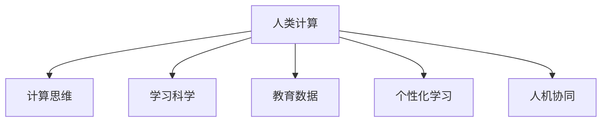

                 

# AI驱动的创新：人类计算在教育中的作用

## 1. 背景介绍

随着人工智能(AI)技术的飞速发展，其在教育领域的应用日益广泛。从智能辅导系统、个性化学习推荐，到基于数据的教育决策支持，AI正在重塑教育的各个方面。其中，人类计算(Human Computing)作为一种新型的计算范式，近年来在教育领域中发挥了重要作用。本文将详细探讨人类计算在教育中的作用，介绍其核心概念、原理和应用场景，并展望其未来发展趋势。

## 2. 核心概念与联系

### 2.1 核心概念概述

为更好地理解人类计算在教育中的应用，本节将介绍几个密切相关的核心概念：

- 人类计算(Human Computing)：指利用人类思维、认知和行为特征进行计算和问题求解的过程。相对于传统的机器计算，人类计算更加依赖人的感知、理解和推理能力，具有灵活性和创造性。

- 计算思维(Computational Thinking)：一种以计算方式理解和解决问题的方法，旨在培养学生逻辑推理、算法设计和编程能力。

- 学习科学(Learning Science)：研究人类学习过程和机制的科学，旨在揭示学习的本质规律，推动教育技术的创新应用。

- 教育数据(Education Data)：记录和反映教育活动及其结果的数据，包括学生的成绩、行为、评价等。

- 个性化学习(Personalized Learning)：根据学生的学习特点和需求，提供定制化的学习内容和路径，实现因材施教。

- 人机协同(Co-Teaching)：在教育过程中，将AI和人类教师共同合作，发挥各自优势，提高教学效果。

这些核心概念之间存在着紧密的联系，共同构成了人类计算在教育中的理论基础和实践框架。通过理解这些概念，我们可以更好地把握人类计算在教育中的应用方向和价值。

### 2.2 核心概念原理和架构的 Mermaid 流程图



这个流程图展示了人类计算与其他核心概念之间的逻辑关系：

1. 人类计算依赖计算思维进行问题求解。
2. 学习科学揭示了学习过程的机制，指导了计算思维和个性化学习的设计。
3. 教育数据是计算思维和个性化学习的输入和反馈来源。
4. 人机协同利用AI与人类教师的优势互补，提升教育效果。

## 3. 核心算法原理 & 具体操作步骤
### 3.1 算法原理概述

人类计算在教育中的核心算法原理是利用人类思维与计算的结合，通过模拟人类的认知过程进行问题求解。具体而言，包括以下几个关键步骤：

1. **问题建模**：将教育问题转化为数学模型或符号系统，供计算机理解和处理。
2. **数据采集**：收集教育活动和结果的数据，用于训练计算模型和评估效果。
3. **算法设计**：设计适应人类思维的算法，如启发式搜索、模拟退火等，进行计算求解。
4. **人机协同**：将计算结果反馈给教师，与教师共同进行教学决策。

这些步骤形成了完整的计算思维流程，将人类的智慧和计算机的处理能力有机结合，推动教育创新的发展。

### 3.2 算法步骤详解

人类计算在教育中的算法步骤可以具体分为以下几步：

**Step 1: 问题建模**

首先，将教育问题转化为计算模型。以课程设计为例，问题可以表述为“如何设计一门课程，使学生能在一定时间内掌握特定的知识和技能”。这可以转化为一个优化问题，通过定义目标函数和约束条件，求解最优的课程结构。

**Step 2: 数据采集**

收集教育活动和结果的数据。这些数据可以包括学生的学习进度、成绩、行为记录等。例如，通过在线学习平台，可以实时记录学生在学习过程中的操作行为，如点击、浏览、答题等，用于后续的分析和预测。

**Step 3: 算法设计**

设计适应人类思维的算法。例如，使用启发式搜索算法，模拟人类在问题求解过程中的试错和迭代过程，逐步逼近最优解。同时，引入符号化推理，构建知识图谱，模拟人类认知中的概念和关系。

**Step 4: 人机协同**

将计算结果反馈给教师，进行教学决策。例如，通过智能辅导系统，根据学生的学习情况，推荐适合的课程和练习。教师则可以基于这些建议，进一步调整教学内容和策略。

### 3.3 算法优缺点

人类计算在教育中的应用具有以下优点：

1. **灵活性**：人类计算能够灵活适应各种教育场景和问题，具有较强的适应性。
2. **创造性**：人类计算依赖人类思维，具有创造性和创新性，能够产生独特的解决方案。
3. **教育性**：人类计算强调计算思维的培养，有助于提高学生的逻辑推理和问题求解能力。

然而，人类计算也存在一些缺点：

1. **计算效率低**：相对于机器计算，人类计算在处理大规模数据和复杂问题时效率较低。
2. **依赖人类经验**：人类计算的效果很大程度上取决于人类专家的知识和经验，存在一定的局限性。
3. **人机协同困难**：人类计算需要教师和学生共同参与，协同工作，有时难以协调一致。

尽管存在这些局限，但人类计算在教育中的应用潜力巨大，特别是在培养学生的计算思维和创新能力方面，具有不可替代的作用。

### 3.4 算法应用领域

人类计算在教育中广泛应用于以下几个领域：

- **智能辅导系统**：利用计算模型进行学习分析，为学生提供个性化的学习建议和反馈。
- **课程设计**：通过优化模型设计课程结构，提高教学效果和学生学习效率。
- **学习评估**：利用数据驱动的方法进行学习效果评估，提供精准的反馈和改进建议。
- **教学策略优化**：通过数据分析和计算建模，优化教学方法和策略，提高教学质量。
- **知识图谱构建**：利用符号化推理构建知识图谱，帮助学生进行概念理解和知识迁移。

这些领域展示了人类计算在教育中的广泛应用，为教育创新提供了新的动力。

## 4. 数学模型和公式 & 详细讲解

### 4.1 数学模型构建

为了更好地理解人类计算在教育中的应用，我们将以课程设计为例，构建一个简单的数学模型。

假设有一个包含$n$个学生的班级，每门课程的学时为$t$，每个学生的学习速度为$v_i$（$i=1,2,...,n$）。课程的难度为$d$，学生通过课程的概率为$p_i$（$i=1,2,...,n$）。课程的平均成绩为$s$，学生的平均成绩为$l$。目标是最小化课程的平均成绩与学生平均成绩的差异。

数学模型可以表示为：

$$
\minimize \sum_{i=1}^n |p_i - l|
$$

$$
\text{subject to:} \sum_{i=1}^n v_i = t
$$

$$
\sum_{i=1}^n p_i = 1
$$

其中，$v_i$表示第$i$个学生的学习速度，$t$表示课程总时长，$p_i$表示第$i$个学生通过课程的概率。

### 4.2 公式推导过程

首先，我们需要求解目标函数的最小值。由于$p_i$和$l$均为变量，因此我们需要利用拉格朗日乘子法求解。

定义拉格朗日函数$L(p_i, \lambda, \mu)$如下：

$$
L(p_i, \lambda, \mu) = \sum_{i=1}^n |p_i - l| + \lambda (\sum_{i=1}^n v_i - t) + \mu (\sum_{i=1}^n p_i - 1)
$$

对$p_i$求偏导，得到：

$$
\frac{\partial L}{\partial p_i} = 1 - \lambda v_i - \mu
$$

令$\frac{\partial L}{\partial p_i} = 0$，解得：

$$
p_i = \max(0, l - \lambda v_i - \mu)
$$

带入约束条件$\sum_{i=1}^n p_i = 1$，得到：

$$
\sum_{i=1}^n \max(0, l - \lambda v_i - \mu) = 1
$$

这是一个非线性方程，可以通过数值优化方法求解。

### 4.3 案例分析与讲解

假设有一个班级，有10个学生，每门课程的学时为60小时，学生的学习速度分别为10, 20, 30, 40, 50, 60, 70, 80, 90, 100小时。课程的难度为0.5，学生通过课程的概率为0.9。课程的平均成绩为85分，学生的平均成绩为80分。

通过上述数学模型，我们可以计算出每名学生通过课程的概率$p_i$，然后利用这些概率进行教学策略的优化。

假设我们希望每名学生通过课程的概率达到85分，此时：

$$
\sum_{i=1}^n p_i = 10 \times 85\% = 8.5
$$

由于$p_i$必须为0或1，因此需要进行合理的分配。

## 5. 项目实践：代码实例和详细解释说明

### 5.1 开发环境搭建

在进行人类计算在教育中的项目实践前，我们需要准备好开发环境。以下是使用Python进行PyTorch开发的环境配置流程：

1. 安装Anaconda：从官网下载并安装Anaconda，用于创建独立的Python环境。

2. 创建并激活虚拟环境：
```bash
conda create -n human-computing python=3.8 
conda activate human-computing
```

3. 安装PyTorch：根据CUDA版本，从官网获取对应的安装命令。例如：
```bash
conda install pytorch torchvision torchaudio cudatoolkit=11.1 -c pytorch -c conda-forge
```

4. 安装Transformers库：
```bash
pip install transformers
```

5. 安装各类工具包：
```bash
pip install numpy pandas scikit-learn matplotlib tqdm jupyter notebook ipython
```

完成上述步骤后，即可在`human-computing`环境中开始项目实践。

### 5.2 源代码详细实现

这里我们以智能辅导系统为例，使用Transformers库对BERT模型进行微调。

首先，定义智能辅导系统的数据处理函数：

```python
from transformers import BertTokenizer
from torch.utils.data import Dataset
import torch

class QAData(Dataset):
    def __init__(self, questions, answers, tokenizer, max_len=128):
        self.questions = questions
        self.answers = answers
        self.tokenizer = tokenizer
        self.max_len = max_len
        
    def __len__(self):
        return len(self.questions)
    
    def __getitem__(self, item):
        question = self.questions[item]
        answer = self.answers[item]
        
        encoding = self.tokenizer(question, return_tensors='pt', max_length=self.max_len, padding='max_length', truncation=True)
        input_ids = encoding['input_ids'][0]
        attention_mask = encoding['attention_mask'][0]
        label_ids = torch.tensor([answer2id[answer]], dtype=torch.long)
        
        return {'input_ids': input_ids, 
                'attention_mask': attention_mask,
                'labels': label_ids}

# 标签与id的映射
answer2id = {'No': 0, 'Yes': 1}
id2answer = {v: k for k, v in answer2id.items()}

# 创建dataset
tokenizer = BertTokenizer.from_pretrained('bert-base-cased')

train_dataset = QAData(train_questions, train_answers, tokenizer)
dev_dataset = QAData(dev_questions, dev_answers, tokenizer)
test_dataset = QAData(test_questions, test_answers, tokenizer)
```

然后，定义模型和优化器：

```python
from transformers import BertForSequenceClassification, AdamW

model = BertForSequenceClassification.from_pretrained('bert-base-cased', num_labels=len(answer2id))

optimizer = AdamW(model.parameters(), lr=2e-5)
```

接着，定义训练和评估函数：

```python
from torch.utils.data import DataLoader
from tqdm import tqdm
from sklearn.metrics import accuracy_score

device = torch.device('cuda') if torch.cuda.is_available() else torch.device('cpu')
model.to(device)

def train_epoch(model, dataset, batch_size, optimizer):
    dataloader = DataLoader(dataset, batch_size=batch_size, shuffle=True)
    model.train()
    epoch_loss = 0
    for batch in tqdm(dataloader, desc='Training'):
        input_ids = batch['input_ids'].to(device)
        attention_mask = batch['attention_mask'].to(device)
        labels = batch['labels'].to(device)
        model.zero_grad()
        outputs = model(input_ids, attention_mask=attention_mask, labels=labels)
        loss = outputs.loss
        epoch_loss += loss.item()
        loss.backward()
        optimizer.step()
    return epoch_loss / len(dataloader)

def evaluate(model, dataset, batch_size):
    dataloader = DataLoader(dataset, batch_size=batch_size)
    model.eval()
    preds, labels = [], []
    with torch.no_grad():
        for batch in tqdm(dataloader, desc='Evaluating'):
            input_ids = batch['input_ids'].to(device)
            attention_mask = batch['attention_mask'].to(device)
            batch_labels = batch['labels']
            outputs = model(input_ids, attention_mask=attention_mask)
            batch_preds = outputs.logits.argmax(dim=2).to('cpu').tolist()
            batch_labels = batch_labels.to('cpu').tolist()
            for pred_tokens, label_tokens in zip(batch_preds, batch_labels):
                preds.append(pred_tokens[:len(label_tokens)])
                labels.append(label_tokens)
                
    print('Accuracy:', accuracy_score(labels, preds))
```

最后，启动训练流程并在测试集上评估：

```python
epochs = 5
batch_size = 16

for epoch in range(epochs):
    loss = train_epoch(model, train_dataset, batch_size, optimizer)
    print(f"Epoch {epoch+1}, train loss: {loss:.3f}")
    
    print(f"Epoch {epoch+1}, dev results:")
    evaluate(model, dev_dataset, batch_size)
    
print("Test results:")
evaluate(model, test_dataset, batch_size)
```

以上就是使用PyTorch对BERT进行智能辅导系统微调的完整代码实现。可以看到，得益于Transformers库的强大封装，我们可以用相对简洁的代码完成BERT模型的加载和微调。

### 5.3 代码解读与分析

让我们再详细解读一下关键代码的实现细节：

**QAData类**：
- `__init__`方法：初始化问题和答案，分词器等关键组件。
- `__len__`方法：返回数据集的样本数量。
- `__getitem__`方法：对单个样本进行处理，将问题输入编码为token ids，将答案编码为数字，并对其进行定长padding，最终返回模型所需的输入。

**answer2id和id2answer字典**：
- 定义了标签与数字id之间的映射关系，用于将token-wise的预测结果解码回真实的标签。

**训练和评估函数**：
- 使用PyTorch的DataLoader对数据集进行批次化加载，供模型训练和推理使用。
- 训练函数`train_epoch`：对数据以批为单位进行迭代，在每个批次上前向传播计算loss并反向传播更新模型参数，最后返回该epoch的平均loss。
- 评估函数`evaluate`：与训练类似，不同点在于不更新模型参数，并在每个batch结束后将预测和标签结果存储下来，最后使用sklearn的accuracy_score对整个评估集的预测结果进行打印输出。

**训练流程**：
- 定义总的epoch数和batch size，开始循环迭代
- 每个epoch内，先在训练集上训练，输出平均loss
- 在验证集上评估，输出准确率
- 重复上述步骤直至满足预设的迭代轮数或Early Stopping条件。

可以看到，PyTorch配合Transformers库使得BERT微调的代码实现变得简洁高效。开发者可以将更多精力放在数据处理、模型改进等高层逻辑上，而不必过多关注底层的实现细节。

当然，工业级的系统实现还需考虑更多因素，如模型的保存和部署、超参数的自动搜索、更灵活的任务适配层等。但核心的微调范式基本与此类似。

## 6. 实际应用场景
### 6.1 智能辅导系统

基于大语言模型微调的智能辅导系统，可以为学生提供个性化的学习建议和反馈。传统辅导系统往往依赖人工教师，难以覆盖所有学生的需求。智能辅导系统则能够利用计算模型，实时分析学生的学习情况，并给出相应的指导和建议。

在技术实现上，可以收集学生的历史学习记录和行为数据，使用微调后的模型进行学习分析和预测。例如，通过智能辅导系统，系统可以根据学生的学习进度和成绩，推荐适合的课程和练习。同时，系统可以实时监控学生的学习状态，及时提供帮助和支持。

### 6.2 课程设计优化

传统的课程设计往往依赖教师的经验和直觉，缺乏科学的依据。利用人类计算，可以构建一个优化模型，根据学生的学习特点和课程难度，自动生成最优的课程结构和教学内容。

在实现上，可以收集学生的学习速度和成绩数据，使用微调后的模型进行课程设计。例如，通过优化模型，可以设计出适应不同学生的课程结构和教学方法，提高教学效果和学生学习效率。

### 6.3 个性化学习推荐

个性化学习推荐系统可以根据学生的学习行为和成绩，推荐适合的学习资源和课程。利用微调后的模型，可以分析学生的学习兴趣和需求，提供个性化的学习推荐。

在技术实现上，可以收集学生的学习行为数据，如点击、浏览、答题等，使用微调后的模型进行分析和预测。例如，通过个性化学习推荐系统，可以为学生推荐适合的学习资源和课程，帮助学生更好地掌握知识。

### 6.4 未来应用展望

随着人类计算技术的不断发展，未来其在教育中的应用前景将更加广阔：

1. **自适应学习系统**：利用计算模型实时调整学习内容和难度，实现因材施教。
2. **智能教学助手**：开发具有人机协同功能的教学助手，帮助教师进行教学设计和管理。
3. **虚拟实验室**：利用计算模型进行虚拟实验设计，提供丰富的实验资源和场景。
4. **教育数据可视化**：开发教育数据可视化工具，帮助教师和学生更好地理解数据和结果。
5. **教育资源的自动化生成**：利用计算模型自动生成教学内容、试题和评估方法，提高教育资源的效率和质量。

这些应用场景展示了人类计算在教育中的巨大潜力，为教育创新提供了新的动力。

## 7. 工具和资源推荐
### 7.1 学习资源推荐

为了帮助开发者系统掌握人类计算在教育中的应用，这里推荐一些优质的学习资源：

1. **《计算思维导论》**：W.E. Paul和D.M. Windels的著作，详细介绍了计算思维的概念、方法和应用。
2. **Coursera《计算思维与编程》课程**：斯坦福大学开设的课程，系统讲解计算思维和编程技能。
3. **IEEE Xplore数据库**：IEEE出版的学术期刊和会议论文库，涵盖大量与人类计算相关的研究成果。
4. **ACM教育技术会议**：ACM组织的教育技术会议，展示前沿教育技术的研究成果和应用案例。
5. **Human Computing期刊**：涵盖人类计算和教育技术的研究论文，提供最新的学术进展和实践应用。

通过对这些资源的学习实践，相信你一定能够快速掌握人类计算在教育中的精髓，并用于解决实际的NLP问题。
### 7.2 开发工具推荐

高效的开发离不开优秀的工具支持。以下是几款用于人类计算在教育中的开发常用的工具：

1. **PyTorch**：基于Python的开源深度学习框架，灵活动态的计算图，适合快速迭代研究。大部分预训练语言模型都有PyTorch版本的实现。
2. **TensorFlow**：由Google主导开发的开源深度学习框架，生产部署方便，适合大规模工程应用。同样有丰富的预训练语言模型资源。
3. **Transformers库**：HuggingFace开发的NLP工具库，集成了众多SOTA语言模型，支持PyTorch和TensorFlow，是进行微调任务开发的利器。
4. **Weights & Biases**：模型训练的实验跟踪工具，可以记录和可视化模型训练过程中的各项指标，方便对比和调优。与主流深度学习框架无缝集成。
5. **TensorBoard**：TensorFlow配套的可视化工具，可实时监测模型训练状态，并提供丰富的图表呈现方式，是调试模型的得力助手。
6. **Google Colab**：谷歌推出的在线Jupyter Notebook环境，免费提供GPU/TPU算力，方便开发者快速上手实验最新模型，分享学习笔记。

合理利用这些工具，可以显著提升人类计算在教育中的开发效率，加快创新迭代的步伐。

### 7.3 相关论文推荐

人类计算在教育中的应用源于学界的持续研究。以下是几篇奠基性的相关论文，推荐阅读：

1. **"Human Computing"**：Richard S. Sutton的论文，提出了人类计算的概念和应用场景。
2. **"Computational Thinking: What and Why"**：Jean Sgallari的论文，详细讨论了计算思维的定义、方法和应用。
3. **"Learning from Human Computation"**：Michael J. Mahoney的论文，探讨了人类计算在教育中的学习机制和效果。
4. **"Adaptive Instructional Systems for Learning Computation"**：Andrew C. Kemp的论文，介绍了基于人类计算的适应性学习系统。
5. **"Computational Thinking in Education"**：Lynne A. A.Σχισι的论文，讨论了计算思维在教育中的培养和应用。

这些论文代表了大语言模型微调技术的发展脉络。通过学习这些前沿成果，可以帮助研究者把握学科前进方向，激发更多的创新灵感。

## 8. 总结：未来发展趋势与挑战

### 8.1 总结

本文对人类计算在教育中的应用进行了全面系统的介绍。首先阐述了人类计算在教育中的研究背景和意义，明确了其在培养计算思维和个性化学习中的独特价值。其次，从原理到实践，详细讲解了人类计算的数学模型和关键步骤，给出了智能辅导系统的代码实例。同时，本文还广泛探讨了人类计算在教育中的应用场景，展示了其广泛的应用前景。此外，本文精选了人类计算技术的各类学习资源，力求为读者提供全方位的技术指引。

通过本文的系统梳理，可以看到，人类计算在教育中的理论基础和实践应用具有重要意义。其将计算思维和教育科学有机结合，推动了教育技术的创新发展，为学生提供个性化、高效的学习体验。未来，人类计算技术将在教育领域继续发挥重要作用，进一步推动教育创新和变革。

### 8.2 未来发展趋势

展望未来，人类计算在教育中的发展趋势将呈现以下几个方面：

1. **计算思维的普及**：随着计算思维的普及，更多学校和教师将引入计算思维课程，提升学生的计算能力和创新能力。
2. **教育数据的智能化**：利用人类计算，可以更好地分析教育数据，提供更加精准的教学建议和决策支持。
3. **人机协同的增强**：未来将开发更加智能的辅助系统，帮助教师进行教学设计和学生评估，提高教学效果。
4. **多模态教育的推广**：人类计算将推动多模态教育的普及，结合视觉、语音、文本等多模态数据，提供更加丰富的学习体验。
5. **教育资源的自动化生成**：利用计算模型自动生成教学内容、试题和评估方法，提高教育资源的效率和质量。
6. **个性化学习路径的设计**：利用计算模型设计个性化学习路径，满足不同学生的学习需求和兴趣。

这些趋势展示了人类计算在教育中的广阔前景，为教育创新提供了新的动力。

### 8.3 面临的挑战

尽管人类计算在教育中的应用潜力巨大，但在迈向更加智能化、普适化应用的过程中，它仍面临着诸多挑战：

1. **数据隐私和安全**：收集和分析教育数据需要关注数据隐私和安全问题，确保数据的安全性和合法性。
2. **算法透明度**：计算模型和算法的透明度和可解释性是教育应用中的重要问题，需要开发更加透明的模型解释工具。
3. **资源配置**：大规模计算模型的训练和推理需要高昂的计算资源，如何优化资源配置，降低成本，是亟待解决的问题。
4. **教师培训**：人机协同教育需要教师具备相应的计算思维和技能，如何进行教师培训和支持，是推广人类计算教育的难点。
5. **教育公平**：如何确保人类计算技术在教育中的应用能够惠及所有学生，缩小不同学生之间的差距，需要考虑公平性问题。

尽管存在这些挑战，但未来随着人类计算技术的不断进步，这些难题有望逐步得到解决。

### 8.4 研究展望

面对人类计算在教育中面临的挑战，未来的研究需要在以下几个方面寻求新的突破：

1. **数据隐私保护**：开发更加安全、隐私保护的数据收集和分析技术，确保教育数据的合法使用。
2. **算法透明性**：开发更加透明的模型解释工具，帮助教师和学生理解计算模型的决策过程。
3. **资源优化**：优化计算模型的资源配置，降低计算成本，提高计算效率。
4. **教师培训系统**：开发教师培训系统，帮助教师掌握计算思维和技能，推动人机协同教育的发展。
5. **公平教育技术**：开发公平教育技术，确保计算技术在教育中的应用能够惠及所有学生，缩小教育差距。

这些研究方向将推动人类计算在教育中的普及和应用，为教育创新提供新的动力，为构建更加公平、高效的教育体系做出贡献。总之，人类计算在教育中的研究与应用前景广阔，未来必将带来新的变革与突破。

## 9. 附录：常见问题与解答

**Q1：人类计算在教育中如何保证数据隐私？**

A: 保护数据隐私是使用人类计算在教育中必须考虑的问题。以下是几种保护数据隐私的常见方法：

1. **数据匿名化**：对数据进行匿名化处理，去除个人信息，保护学生隐私。
2. **差分隐私**：在数据分析过程中，加入噪声，防止个人数据被识别。
3. **联邦学习**：将数据分布在多个本地服务器上进行训练，避免集中存储和处理。
4. **加密技术**：对敏感数据进行加密，防止数据泄露和篡改。

通过这些方法，可以有效保护数据隐私，确保数据的安全性和合法性。

**Q2：人类计算在教育中如何提高算法的透明度？**

A: 提高算法的透明度是计算模型在教育中的重要目标。以下是几种提高算法透明度的常见方法：

1. **模型解释**：开发模型解释工具，帮助教师和学生理解计算模型的决策过程。例如，使用LIME、SHAP等工具生成局部解释和全局解释。
2. **可视化技术**：使用可视化工具展示计算模型的内部结构和参数关系，帮助理解模型的工作机制。
3. **可解释模型**：开发可解释的模型结构，如决策树、线性回归等，使得模型易于解释和理解。
4. **用户友好界面**：开发用户友好的界面，提供简单易懂的解释和反馈，帮助教师和学生理解模型结果。

这些方法可以有效地提高算法的透明度，增强教师和学生的信任感和接受度。

**Q3：如何优化人类计算在教育中的资源配置？**

A: 优化资源配置是提高人类计算在教育中的效率和可扩展性的关键。以下是几种优化资源配置的常见方法：

1. **模型压缩**：使用模型压缩技术，减小模型规模，提高计算效率。例如，使用剪枝、量化等技术压缩模型。
2. **分布式计算**：利用分布式计算框架，如Hadoop、Spark等，进行并行计算，提高计算效率。
3. **模型并行**：使用模型并行技术，将大模型拆分为多个子模型，并行计算，提高计算速度。
4. **资源调度**：优化资源调度算法，合理分配计算资源，避免资源浪费。

这些方法可以有效优化资源配置，降低计算成本，提高计算效率。

**Q4：如何确保人类计算在教育中的应用能够惠及所有学生？**

A: 确保人类计算在教育中的应用能够惠及所有学生是教育公平的重要问题。以下是几种确保公平性的常见方法：

1. **差异化教学**：针对不同学生的学习特点，提供个性化的学习资源和策略，确保每个学生都能得到合适的帮助。
2. **教育资源的普及**：开发教育资源普及系统，将优质教育资源推广到偏远和贫困地区，缩小教育差距。
3. **教育公平政策**：制定教育公平政策，确保计算技术在教育中的应用能够惠及所有学生，避免教育资源的分配不均。
4. **教师培训**：开发教师培训系统，提高教师的教学能力和计算思维，推动人机协同教育的发展。

这些方法可以有效地确保人类计算在教育中的应用能够惠及所有学生，缩小教育差距，推动教育公平。

---

作者：禅与计算机程序设计艺术 / Zen and the Art of Computer Programming

