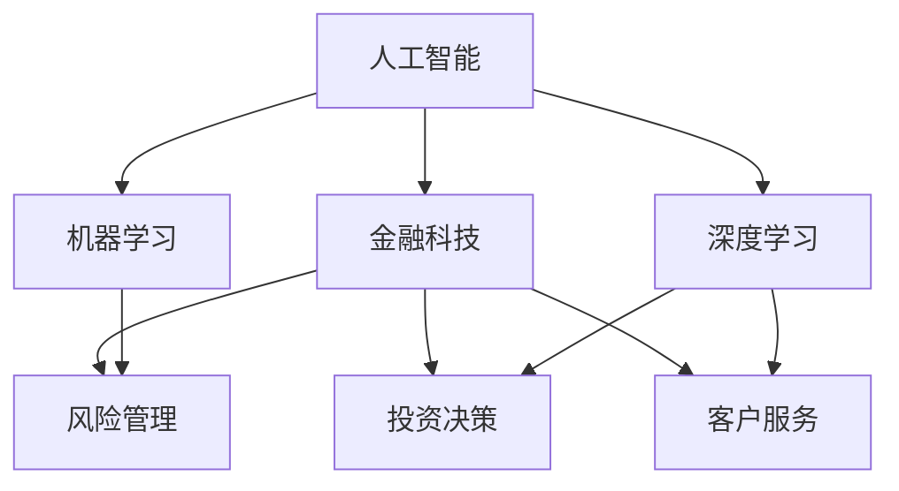

                 

# AI驱动的创新：人类计算在金融行业的应用

> 关键词：人工智能,金融科技,人类计算,机器学习,深度学习,算法优化,风险管理,投资决策

## 1. 背景介绍

### 1.1 问题由来
金融行业作为国民经济的神经中枢，其稳定性和效率直接影响着国家经济的健康发展。然而，传统的金融服务模式，如银行柜面服务、手工核算等，已经难以满足现代金融市场瞬息万变的业务需求。随着科技的进步，特别是人工智能(AI)的快速发展，金融行业迎来了数字化、智能化的转型机遇。

在AI技术的推动下，金融机构可以依托先进的数据分析、风险评估和决策支持系统，提升服务效率，降低运营成本，增强市场竞争力。人工智能驱动的金融创新，为金融行业的变革和升级带来了无限可能。

### 1.2 问题核心关键点
金融行业应用AI技术的主要目的是提升服务效率、降低运营成本、增强决策准确性，从而提高金融机构的业务表现。这其中，人类计算（Human-Calculating）作为AI在金融行业的重要应用，通过模拟人类大脑的认知能力，实现高效的决策支持，已经成为推动金融创新不可或缺的一环。

人类计算的核心理念是通过机器学习、深度学习等技术，模拟人类大脑对复杂金融问题的分析和判断能力，自动生成决策建议，辅助金融从业人员进行更精准的投资决策、风险管理和客户服务。

## 2. 核心概念与联系

### 2.1 核心概念概述

为更好地理解AI在金融行业的应用，本节将介绍几个密切相关的核心概念：

- **人工智能**：一种模拟人类智能的计算机技术，包括机器学习、深度学习、自然语言处理(NLP)、计算机视觉(CV)等多个领域。
- **金融科技**：结合金融服务与信息技术的交叉领域，旨在通过技术创新提升金融服务的效率和质量。
- **人类计算**：一种AI技术，通过模拟人类大脑的认知能力，实现对复杂金融问题的分析和决策支持。
- **机器学习**：一种通过数据驱动模型，让计算机自动学习和改进的算法，广泛应用于金融行业中的风险管理、投资决策、客户服务等。
- **深度学习**：一种基于多层神经网络的机器学习方法，通过模拟人脑神经元间的连接，实现对大量复杂数据的处理和分析。
- **算法优化**：通过优化算法，提高AI模型的性能和效率，使其在金融场景中发挥更优的决策支持作用。

这些核心概念之间的逻辑关系可以通过以下Mermaid流程图来展示：



这个流程图展示了几组核心概念及其之间的关系：

1. 人工智能是金融科技的基础，推动了金融行业的数字化、智能化发展。
2. 机器学习和深度学习作为AI的重要组成部分，在金融科技中的应用广泛。
3. 风险管理、投资决策和客户服务是AI在金融行业中的三个主要应用领域。
4. 人类计算利用AI技术，模拟人类大脑对金融问题的分析和决策能力，辅助金融从业人员。

这些概念共同构成了AI在金融行业的应用框架，使其能够更好地服务现代金融市场的需求。

## 3. 核心算法原理 & 具体操作步骤

### 3.1 算法原理概述

人类计算的核心算法原理，是通过机器学习、深度学习等技术，构建能够模拟人类大脑认知能力的模型，用于处理和分析复杂的金融问题。其核心思想是：利用大量历史金融数据，通过监督学习、无监督学习等方法，训练模型自动抽取金融市场的特征，生成基于模型计算的决策建议。

具体来说，人类计算包括以下几个步骤：

1. **数据准备**：收集历史金融数据，如股票价格、市场指数、财务报表等。
2. **特征工程**：通过统计分析、时间序列分析等方法，提取数据中的重要特征。
3. **模型训练**：使用机器学习、深度学习算法，训练模型学习数据特征与金融指标之间的关联。
4. **决策生成**：在新的金融数据输入模型后，生成基于模型计算的决策建议。
5. **反馈优化**：通过人工反馈，不断优化模型，提升决策建议的准确性。

### 3.2 算法步骤详解

以下是人类计算的具体操作步骤：

**Step 1: 数据收集与预处理**

- **数据收集**：从各类金融数据源，如股票交易所、金融网站、企业财报等，收集历史金融数据。确保数据的时效性和完备性。
- **数据清洗**：去除缺失、异常值，标准化数据格式，处理时间序列数据的时效性。

**Step 2: 特征工程与选择**

- **特征提取**：从原始数据中提取有意义的特征，如技术指标、财务比率、市场情绪等。
- **特征选择**：利用统计方法、相关性分析等手段，选择与目标变量高度相关的特征。
- **特征编码**：将特征数据转化为模型可接受的形式，如数值化、标准化等。

**Step 3: 模型训练**

- **选择算法**：根据问题特点，选择机器学习、深度学习等算法，如随机森林、支持向量机(SVM)、卷积神经网络(CNN)、循环神经网络(RNN)等。
- **训练模型**：使用历史数据训练模型，不断调整模型参数，优化模型性能。
- **交叉验证**：通过交叉验证等方法，评估模型的泛化能力，防止过拟合。

**Step 4: 模型评估**

- **性能评估**：使用测试集数据，评估模型预测的准确性、召回率、F1分数等指标。
- **误差分析**：分析模型预测的误差来源，进行模型优化。
- **超参数调优**：通过网格搜索、贝叶斯优化等方法，调整模型的超参数。

**Step 5: 决策生成与优化**

- **决策生成**：将新金融数据输入模型，生成决策建议，如买入、卖出、持仓等。
- **反馈循环**：收集人工反馈，进行模型迭代优化，提升决策准确性。

### 3.3 算法优缺点

人类计算的优点在于：

1. **高效率**：利用计算机的高计算能力，快速处理大量金融数据，生成决策建议。
2. **低成本**：自动化决策过程，减少人工干预，降低运营成本。
3. **高精度**：基于数据驱动的模型，可提高决策的准确性和一致性。
4. **可扩展性**：模型易于扩展和优化，适用于各种金融场景。

同时，人类计算也存在一些局限性：

1. **数据依赖性**：模型的预测能力高度依赖于历史数据的质量，新数据可能对模型预测有影响。
2. **黑盒问题**：模型的决策过程难以解释，不易理解其内部工作机制。
3. **市场风险**：模型预测可能受到市场变化和外部冲击的影响，存在一定的不确定性。
4. **技术门槛**：构建高质量的模型需要较高的技术门槛，对数据处理、算法调优等环节要求较高。

### 3.4 算法应用领域

人类计算在金融行业中的应用广泛，具体包括：

- **风险管理**：利用机器学习算法，构建信用评分、市场风险模型，评估金融产品的风险水平，辅助决策。
- **投资决策**：使用深度学习模型，分析股票、基金等金融产品，生成投资组合建议，优化资产配置。
- **客户服务**：通过NLP技术，解析客户咨询，生成个性化推荐和建议，提升客户服务体验。
- **财务分析**：利用数据挖掘、时间序列分析等技术，提供财务报表分析、收益预测等服务。
- **欺诈检测**：应用异常检测算法，识别交易中的异常行为，预防金融欺诈。

## 4. 数学模型和公式 & 详细讲解 & 举例说明

### 4.1 数学模型构建

本节将使用数学语言对人类计算的模型构建过程进行更加严格的刻画。

记金融数据为 $X_t = (x_1, x_2, \ldots, x_n)$，其中 $x_i$ 为第 $i$ 个特征值。记目标变量为 $Y$，即金融决策的结果，如股票价格、市场指数等。

定义模型 $f(X_t)$ 为金融数据到目标变量的映射关系，其中 $f$ 为机器学习或深度学习模型。通过训练模型，使得模型能够从历史数据中学习特征与目标变量之间的关联，从而生成对新数据的预测。

### 4.2 公式推导过程

以下是人类计算模型的基本推导过程：

**线性回归模型**：

线性回归模型是最常用的机器学习模型之一，其形式为：

$$
Y = \beta_0 + \beta_1 x_1 + \beta_2 x_2 + \ldots + \beta_n x_n + \epsilon
$$

其中 $\beta_i$ 为模型参数，$\epsilon$ 为误差项。模型训练的目的是最小化预测误差 $\epsilon$。

**随机森林模型**：

随机森林模型是常用的集成学习模型，其形式为：

$$
Y = \sum_{i=1}^{m} \text{tree}_i(X_t) \cdot \text{weight}_i
$$

其中 $\text{tree}_i$ 为随机生成的决策树，$\text{weight}_i$ 为每个决策树的权重。

**卷积神经网络模型**：

卷积神经网络模型常用于图像处理和自然语言处理，其形式为：

$$
Y = f_{CNN}(X_t)
$$

其中 $f_{CNN}$ 为卷积神经网络模型。

**循环神经网络模型**：

循环神经网络模型常用于时间序列数据的处理，其形式为：

$$
Y = f_{RNN}(X_t)
$$

其中 $f_{RNN}$ 为循环神经网络模型。

### 4.3 案例分析与讲解

以股票价格预测为例，分析人类计算模型的构建和应用。

**Step 1: 数据准备**

- **数据来源**：收集历史股票价格数据，如每日开盘价、收盘价、成交量等。
- **数据预处理**：标准化数据，处理缺失值和异常值，生成时间序列数据。

**Step 2: 特征工程与选择**

- **特征提取**：从原始数据中提取技术指标，如RSI、MACD、均线等。
- **特征选择**：使用相关性分析，选择与股票价格高度相关的特征。
- **特征编码**：将特征数据标准化，转换为模型可接受的形式。

**Step 3: 模型训练**

- **选择算法**：选择随机森林、支持向量机等算法。
- **训练模型**：使用历史数据训练模型，调整参数，优化模型性能。
- **交叉验证**：通过交叉验证，评估模型泛化能力。

**Step 4: 模型评估**

- **性能评估**：使用测试集数据评估模型预测准确性。
- **误差分析**：分析模型预测误差，进行模型优化。
- **超参数调优**：使用网格搜索或贝叶斯优化，调整模型超参数。

**Step 5: 决策生成与优化**

- **决策生成**：将新股票数据输入模型，生成股票价格预测。
- **反馈循环**：收集人工反馈，优化模型，提升预测准确性。

## 5. 项目实践：代码实例和详细解释说明

### 5.1 开发环境搭建

在进行人类计算实践前，我们需要准备好开发环境。以下是使用Python进行Keras、TensorFlow等深度学习框架的环境配置流程：

1. 安装Anaconda：从官网下载并安装Anaconda，用于创建独立的Python环境。

2. 创建并激活虚拟环境：
```bash
conda create -n pytorch-env python=3.8 
conda activate pytorch-env
```

3. 安装Keras和TensorFlow：根据CUDA版本，从官网获取对应的安装命令。例如：
```bash
conda install keras tensorflow cudatoolkit=11.1 -c pytorch -c conda-forge
```

4. 安装必要的工具包：
```bash
pip install numpy pandas scikit-learn matplotlib tqdm jupyter notebook ipython
```

完成上述步骤后，即可在`pytorch-env`环境中开始实践。

### 5.2 源代码详细实现

下面我以股票价格预测为例，给出使用Keras框架构建深度学习模型的代码实现。

首先，定义数据处理函数：

```python
from keras.preprocessing import sequence
import pandas as pd

def read_data(filename):
    df = pd.read_csv(filename, index_col='Date', parse_dates=True)
    return df

def preprocess_data(df, look_back=60):
    data = []
    labels = []
    for i in range(len(df) - look_back - 1):
        data.append(df['Close'].values[i:(i+look_back)])
        labels.append(df['Close'].values[i+look_back])
    return np.array(data), np.array(labels)
```

然后，定义模型和优化器：

```python
from keras.models import Sequential
from keras.layers import Dense, LSTM, Dropout
from keras.optimizers import Adam

model = Sequential()
model.add(LSTM(50, input_shape=(look_back, 1), return_sequences=True))
model.add(Dropout(0.2))
model.add(LSTM(50, return_sequences=True))
model.add(Dropout(0.2))
model.add(LSTM(50))
model.add(Dropout(0.2))
model.add(Dense(1))
model.compile(loss='mean_squared_error', optimizer=Adam(lr=0.001))
```

接着，定义训练和评估函数：

```python
from keras.utils import to_categorical
from sklearn.metrics import mean_squared_error
import numpy as np

def train_model(model, X_train, y_train, batch_size=32, epochs=100):
    X_train, y_train = preprocess_data(X_train, look_back)
    model.fit(X_train, y_train, epochs=epochs, batch_size=batch_size, verbose=1)

def evaluate_model(model, X_test, y_test, batch_size=32):
    X_test, y_test = preprocess_data(X_test, look_back)
    y_pred = model.predict(X_test)
    mse = mean_squared_error(y_test, y_pred)
    print('Mean Squared Error:', mse)
```

最后，启动训练流程并在测试集上评估：

```python
look_back = 60

train_data = read_data('train.csv')
test_data = read_data('test.csv')

X_train, y_train = train_data['Close'].values
y_train = y_train.reshape((len(y_train), 1))

X_test, y_test = test_data['Close'].values
y_test = y_test.reshape((len(y_test), 1))

train_model(model, X_train, y_train)
evaluate_model(model, X_test, y_test)
```

以上就是使用Keras框架进行股票价格预测的完整代码实现。可以看到，利用Keras构建深度学习模型的代码相对简洁，能够快速实现股票价格预测的功能。

### 5.3 代码解读与分析

让我们再详细解读一下关键代码的实现细节：

**read_data函数**：
- 从CSV文件中读取数据，使用Pandas库进行时间序列数据处理。

**preprocess_data函数**：
- 数据预处理函数，将原始数据转化为模型可接受的形式，即输入序列和目标序列。
- 使用滑动窗口的方式，将输入序列和目标序列划分为多个样本。
- 将数据标准化，并转化为模型可接受的形式。

**train_model函数**：
- 定义模型，使用LSTM和Dropout等层构建模型结构。
- 编译模型，选择损失函数和优化器。
- 使用训练数据进行模型训练。

**evaluate_model函数**：
- 评估模型，计算均方误差。
- 使用测试数据进行模型评估。

**train和evaluate函数**：
- 使用训练集和测试集进行模型训练和评估。
- 使用模型生成股票价格预测。

可以看到，Keras框架提供了方便易用的API，使得深度学习模型的构建和训练过程更加快捷。同时，Keras的灵活性和可扩展性也使得开发者可以根据具体需求进行模型优化和调整。

## 6. 实际应用场景

### 6.1 股票价格预测

股票价格预测是金融行业中最常见的人类计算应用之一。通过构建和训练股票价格预测模型，金融机构可以实时获取股票价格趋势，及时调整投资组合，优化资产配置，提升投资收益。

在实践中，可以收集历史股票价格数据，结合技术指标和市场情绪等特征，训练预测模型。模型可以根据最新的市场数据生成股票价格预测，辅助决策。

**实际应用**：
- **实时监控**：实时获取市场数据，生成股票价格预测，及时调整投资策略。
- **量化交易**：结合机器学习模型，进行算法交易，优化交易策略，提升投资收益。
- **风险管理**：分析股票价格预测结果，进行风险评估，制定风险管理方案。

### 6.2 信贷风险评估

金融机构在发放贷款时，需要进行详细的信贷风险评估，以降低坏账率。利用人类计算技术，可以构建信贷风险评估模型，自动分析客户财务信息，生成贷款审批建议。

在实践中，可以收集客户财务数据，如收入、负债、信用记录等，结合市场利率、宏观经济等外部因素，训练信贷风险评估模型。模型可以根据客户的财务信息，生成信贷审批结果，辅助决策。

**实际应用**：
- **自动化审批**：自动分析客户财务数据，生成贷款审批建议，提升审批效率。
- **信用评分**：使用机器学习模型，生成客户信用评分，辅助风险评估。
- **反欺诈检测**：通过异常检测算法，识别欺诈行为，预防金融风险。

### 6.3 资产配置优化

资产配置是金融机构进行投资管理的重要环节，需要根据市场环境、客户需求等综合因素进行动态调整。利用人类计算技术，可以构建资产配置优化模型，自动调整投资组合，优化资产配置，提升投资回报。

在实践中，可以收集市场数据，如股票、基金等金融产品的历史数据，结合客户需求和风险偏好，训练资产配置优化模型。模型可以根据市场数据和客户需求，生成资产配置建议，辅助决策。

**实际应用**：
- **投资组合管理**：自动调整投资组合，优化资产配置，提升投资收益。
- **风险管理**：分析市场数据，评估投资风险，制定风险管理方案。
- **客户服务**：根据客户需求，提供个性化资产配置建议，提升客户满意度。

### 6.4 未来应用展望

随着AI技术的不断进步，人类计算在金融行业的应用将更加广泛和深入。未来的发展趋势包括：

1. **自动化决策**：AI将更多地应用于金融决策过程，减少人工干预，提高决策效率。
2. **智能投顾**：基于AI技术的智能投顾系统将普及，提供个性化投资建议，优化资产配置。
3. **区块链金融**：结合区块链技术，构建透明、安全的金融交易系统，降低交易成本，提升交易效率。
4. **金融智能合约**：利用AI技术构建智能合约，自动执行金融交易，提升交易执行效率和安全性。
5. **金融安全**：通过AI技术，实时监测金融市场，预防金融风险，保障金融安全。
6. **金融社交网络**：利用AI技术，构建金融社交网络，提升金融市场的透明度和参与度。

未来，人类计算将在金融行业的各个领域发挥越来越重要的作用，推动金融行业的数字化、智能化转型。

## 7. 工具和资源推荐

### 7.1 学习资源推荐

为了帮助开发者系统掌握人类计算的理论基础和实践技巧，这里推荐一些优质的学习资源：

1. 《深度学习》书籍：Ian Goodfellow、Yoshua Bengio和Aaron Courville合著，系统介绍了深度学习的基本理论和应用。
2. 《Python深度学习》书籍：Francois Chollet著，介绍如何使用Keras构建深度学习模型。
3. 《机器学习实战》书籍：Peter Harrington著，介绍了机器学习的基本算法和实现方法。
4. 《金融大数据分析》课程：Coursera提供的金融科技课程，涵盖了大数据分析、金融模型等知识。
5. 《金融机器学习》课程：Udacity提供的金融科技课程，介绍了机器学习在金融领域的应用。

通过对这些资源的学习实践，相信你一定能够快速掌握人类计算的理论基础和实践技巧，并用于解决实际的金融问题。

### 7.2 开发工具推荐

高效的开发离不开优秀的工具支持。以下是几款用于人类计算开发的常用工具：

1. Keras：基于Python的深度学习框架，提供了灵活的API，方便快速构建和训练模型。
2. TensorFlow：由Google主导开发的开源深度学习框架，提供了灵活的计算图和自动微分，适合大规模工程应用。
3. PyTorch：由Facebook开发的深度学习框架，提供了动态计算图和高效的自动微分，适合快速原型开发。
4. Scikit-learn：基于Python的机器学习库，提供了简单易用的API，适合快速原型开发和算法实现。
5. Pandas：基于Python的数据处理库，提供了灵活的数据处理和分析功能，适合金融数据处理。

合理利用这些工具，可以显著提升人类计算模型的开发效率，加快创新迭代的步伐。

### 7.3 相关论文推荐

人类计算技术的发展源于学界的持续研究。以下是几篇奠基性的相关论文，推荐阅读：

1. Hinton G. E., Osindero S., Teh Y. W. (2006). Reducing the Dimensionality of Data with Neural Networks. Science 313(5786): 504-507.
2. Graves A., Hinton G., Mohamed A. (2009). Generating Sequences with Recurrent Neural Networks. Advances in Neural Information Processing Systems 30: 2392-2400.
3. LeCun Y., Bottou L., Bengio Y., Haffner P. (1998). Gradient-Based Learning Applied to Document Recognition. Proceedings of the IEEE 86(11): 2278-2324.
4. Hinton G., Deng L., Yu D., et al. (2012). Deep Neural Networks for Acoustic Modeling in Speech Recognition. IEEE Signal Processing Magazine 29(6): 82-97.
5. Bengio Y., Simard P., Frasconi P. (2003). Learning Long-Term Dependencies with Gradient Descent is Difficult. Advances in Neural Information Processing Systems 15: 903-910.

这些论文代表了大语言模型微调技术的发展脉络。通过学习这些前沿成果，可以帮助研究者把握学科前进方向，激发更多的创新灵感。

## 8. 总结：未来发展趋势与挑战

### 8.1 总结

本文对人类计算技术在金融行业的应用进行了全面系统的介绍。首先阐述了人类计算的基本原理和主要应用场景，明确了其在金融行业中的独特价值。其次，从原理到实践，详细讲解了人类计算的核心算法步骤和关键技术，给出了代码实例和详细解释。同时，本文还探讨了人类计算在金融行业中的实际应用场景，展示了其在金融决策支持中的强大潜力。

通过本文的系统梳理，可以看到，人类计算技术正在成为金融行业的重要支撑，通过模拟人类大脑的认知能力，实现了高效的决策支持。未来，随着AI技术的不断进步，人类计算在金融行业的应用将更加广泛和深入，为金融行业的数字化、智能化转型注入新的动力。

### 8.2 未来发展趋势

展望未来，人类计算技术在金融行业的发展趋势包括：

1. **自动化决策**：AI将更多地应用于金融决策过程，减少人工干预，提高决策效率。
2. **智能投顾**：基于AI技术的智能投顾系统将普及，提供个性化投资建议，优化资产配置。
3. **区块链金融**：结合区块链技术，构建透明、安全的金融交易系统，降低交易成本，提升交易效率。
4. **金融智能合约**：利用AI技术构建智能合约，自动执行金融交易，提升交易执行效率和安全性。
5. **金融安全**：通过AI技术，实时监测金融市场，预防金融风险，保障金融安全。
6. **金融社交网络**：利用AI技术，构建金融社交网络，提升金融市场的透明度和参与度。

这些趋势凸显了人类计算技术的广阔前景，为金融行业的数字化、智能化转型提供了新的技术路径。

### 8.3 面临的挑战

尽管人类计算技术已经取得了显著进展，但在向全面应用的过程中，仍面临诸多挑战：

1. **数据质量问题**：金融数据通常存在噪声和缺失，影响模型的训练和预测效果。
2. **模型鲁棒性不足**：金融市场波动性大，模型可能受到市场变化和外部冲击的影响，存在一定的不确定性。
3. **技术门槛较高**：构建高质量的模型需要较高的技术门槛，对数据处理、算法调优等环节要求较高。
4. **伦理道德问题**：模型可能学习到有偏见、有害的信息，输出结果需满足伦理道德要求。
5. **资源消耗较大**：金融数据规模大，模型训练和推理资源消耗较大，需要高效的计算资源支持。

正视这些挑战，积极应对并寻求突破，将是人机协同在金融行业成功应用的关键。

### 8.4 研究展望

未来的研究需要在以下几个方面寻求新的突破：

1. **数据质量提升**：提高金融数据的质量，减少噪声和缺失，提升模型训练效果。
2. **模型鲁棒性增强**：开发鲁棒性更强的算法，提高模型对市场变化和外部冲击的应对能力。
3. **技术门槛降低**：开发更易用、更灵活的开发工具和框架，降低模型构建的技术门槛。
4. **伦理道德保障**：引入伦理导向的评估指标，过滤和惩罚有偏见、有害的输出倾向。
5. **资源优化**：优化计算资源配置，提升模型训练和推理的效率。

这些研究方向的探索，将引领人类计算技术迈向更高的台阶，为金融行业的数字化、智能化转型提供新的技术支撑。

## 9. 附录：常见问题与解答

**Q1：人类计算如何克服数据质量问题？**

A: 数据质量问题是人类计算技术面临的重要挑战。为克服这一问题，可以采取以下措施：

1. **数据清洗**：对金融数据进行清洗，去除噪声和缺失值，标准化数据格式。
2. **数据增强**：利用数据增强技术，如回译、近义替换等，扩充训练集。
3. **特征选择**：选择与目标变量高度相关的特征，减少噪声数据的影响。
4. **模型优化**：采用更鲁棒的算法，如随机森林、支持向量机等，提高模型的泛化能力。

这些措施可以有效地提升数据质量，提高模型的预测效果。

**Q2：人类计算在金融行业中的应用场景有哪些？**

A: 人类计算在金融行业中的应用广泛，具体包括：

1. **股票价格预测**：利用机器学习模型，分析历史股票价格数据，生成股票价格预测。
2. **信贷风险评估**：构建信贷风险评估模型，自动分析客户财务信息，生成贷款审批建议。
3. **资产配置优化**：利用机器学习模型，分析市场数据和客户需求，生成资产配置建议。
4. **欺诈检测**：应用异常检测算法，识别金融交易中的异常行为，预防欺诈。
5. **财务分析**：利用数据挖掘、时间序列分析等技术，提供财务报表分析和收益预测。

这些应用场景展示了人类计算技术在金融行业中的强大潜力。

**Q3：如何提高人类计算模型的鲁棒性？**

A: 提高人类计算模型的鲁棒性是确保其在金融行业稳定应用的关键。以下是一些有效措施：

1. **多样化数据源**：从多个数据源收集数据，提高数据的多样性，减少数据偏差。
2. **多模型集成**：训练多个模型，取平均输出，降低单个模型的风险。
3. **对抗训练**：引入对抗样本，提高模型对攻击的鲁棒性。
4. **正则化**：使用L2正则、Dropout等正则化技术，防止模型过拟合。
5. **数据增强**：通过回译、近义替换等方式扩充训练集，提高模型的泛化能力。

这些措施可以显著提高模型的鲁棒性，确保其在金融行业的稳定应用。

**Q4：人类计算技术在金融行业中的应用有哪些限制？**

A: 人类计算技术在金融行业的应用也存在一些限制：

1. **技术门槛较高**：构建高质量的模型需要较高的技术门槛，对数据处理、算法调优等环节要求较高。
2. **伦理道德问题**：模型可能学习到有偏见、有害的信息，输出结果需满足伦理道德要求。
3. **数据质量问题**：金融数据通常存在噪声和缺失，影响模型的训练和预测效果。
4. **模型鲁棒性不足**：金融市场波动性大，模型可能受到市场变化和外部冲击的影响，存在一定的不确定性。
5. **资源消耗较大**：金融数据规模大，模型训练和推理资源消耗较大，需要高效的计算资源支持。

正视这些限制，积极应对并寻求突破，将是人机协同在金融行业成功应用的关键。

**Q5：人类计算技术的未来发展趋势是什么？**

A: 人类计算技术在金融行业的发展趋势包括：

1. **自动化决策**：AI将更多地应用于金融决策过程，减少人工干预，提高决策效率。
2. **智能投顾**：基于AI技术的智能投顾系统将普及，提供个性化投资建议，优化资产配置。
3. **区块链金融**：结合区块链技术，构建透明、安全的金融交易系统，降低交易成本，提升交易效率。
4. **金融智能合约**：利用AI技术构建智能合约，自动执行金融交易，提升交易执行效率和安全性。
5. **金融安全**：通过AI技术，实时监测金融市场，预防金融风险，保障金融安全。
6. **金融社交网络**：利用AI技术，构建金融社交网络，提升金融市场的透明度和参与度。

这些趋势凸显了人类计算技术的广阔前景，为金融行业的数字化、智能化转型提供了新的技术路径。

---

作者：禅与计算机程序设计艺术 / Zen and the Art of Computer Programming

