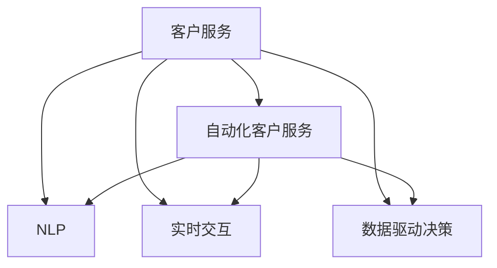

                 

# AI驱动的客户服务优化策略

在当今快速发展的数字化时代，客户服务质量已成为企业竞争力的关键指标之一。随着AI技术在各行业的深入应用，利用AI驱动的客户服务优化策略，能够显著提升客户体验，增强企业竞争力。本文将深入探讨AI在客户服务中的作用，提供系统化的策略建议，帮助企业实现客户服务转型升级。

## 1. 背景介绍

### 1.1 问题由来
随着电子商务、社交媒体、在线服务等数字化渠道的兴起，企业与客户之间的接触点越来越分散。传统的人力客服模式已难以应对高并发、大规模的客户需求。此外，服务质量和一致性问题频发，客户体验难以提升。

### 1.2 问题核心关键点
AI驱动的客户服务优化策略，旨在通过先进的技术手段，改善客户服务流程，提升客户满意度。其核心在于以下几个关键点：

1. **自动化处理**：利用AI自动化客户服务请求的处理，提高响应速度和处理效率。
2. **个性化服务**：基于用户行为数据，提供个性化推荐和定制化服务。
3. **自然语言处理(NLP)**：通过NLP技术，使AI能够理解并回应用户的自然语言查询。
4. **实时交互**：通过实时聊天机器人等工具，实现24/7全天候服务。
5. **数据驱动决策**：利用客户服务数据，进行智能分析，优化服务策略。

### 1.3 问题研究意义
AI驱动的客户服务优化策略，具有以下重要意义：

1. **降低成本**：通过自动化处理简单、重复的客户服务请求，降低人力成本。
2. **提升效率**：优化服务流程，缩短处理时间，提高客户满意度。
3. **增强一致性**：确保服务标准统一，提升服务质量。
4. **个性化体验**：根据用户行为和历史数据，提供个性化服务，提升客户粘性。
5. **数据洞察**：利用AI进行数据挖掘，提供业务洞见，优化决策。

## 2. 核心概念与联系

### 2.1 核心概念概述

为了更好地理解AI驱动的客户服务优化策略，本节将介绍几个密切相关的核心概念：

- **客户服务**：指企业提供给客户的支持和服务活动，包括咨询、投诉处理、售后支持等。
- **自动化客户服务**：指利用AI技术自动处理客户服务请求，如聊天机器人、智能语音助手等。
- **自然语言处理(NLP)**：指使计算机能够理解、处理和生成人类语言的技术。
- **实时交互**：指通过实时通讯工具，实现与客户即时互动。
- **数据驱动决策**：指利用数据分析和机器学习技术，优化业务决策。

这些概念之间的逻辑关系可以通过以下Mermaid流程图来展示：



这个流程图展示了大语言模型微调的逻辑关系：

1. 客户服务是整体流程的起点，通过自动化、NLP、实时交互、数据驱动等技术手段进行优化。
2. 自动化客户服务通过NLP技术实现理解客户意图，并通过实时交互提供即时回应。
3. 数据驱动决策基于实时服务数据，优化服务策略和流程。

## 3. 核心算法原理 & 具体操作步骤

### 3.1 算法原理概述

AI驱动的客户服务优化策略，主要基于自动化客户服务、NLP技术、实时交互和数据驱动决策四大核心技术。其基本原理是：

1. **自动化处理**：通过AI技术，自动化处理客户服务请求，提高处理效率。
2. **NLP技术**：利用NLP技术，使AI能够理解并回应用户的自然语言查询。
3. **实时交互**：通过实时聊天机器人等工具，实现24/7全天候服务。
4. **数据驱动决策**：利用客户服务数据，进行智能分析，优化服务策略。

### 3.2 算法步骤详解

AI驱动的客户服务优化策略，主要包括以下几个关键步骤：

**Step 1: 数据收集与预处理**
- 收集客户服务相关的数据，如客服聊天记录、客户反馈、服务请求等。
- 对数据进行清洗、标注和预处理，以便后续分析和训练。

**Step 2: 构建AI模型**
- 选择合适的AI模型，如聊天机器人、语音助手等。
- 利用NLP技术，对客户服务数据进行训练，优化模型理解能力和生成能力。
- 进行模型评估和调优，确保模型在实际应用中的效果。

**Step 3: 部署与集成**
- 将训练好的模型部署到客户服务系统中。
- 与CRM系统、邮件系统等集成，实现数据的无缝流通。

**Step 4: 实时交互与反馈**
- 实时接收客户服务请求，通过AI模型进行自动处理。
- 收集客户反馈，不断优化模型和策略。

**Step 5: 数据分析与优化**
- 利用客户服务数据，进行智能分析，优化服务策略和流程。
- 定期进行模型复训，提升模型效果。

### 3.3 算法优缺点

AI驱动的客户服务优化策略，具有以下优点：

1. **高效响应**：通过自动化处理，大幅提升服务响应速度。
2. **一致性高**：AI模型具备一致的输出，减少人为因素的干扰。
3. **全天候服务**：实时交互技术实现24/7全天候服务，提高客户满意度。
4. **个性化体验**：基于用户数据，提供个性化推荐和定制化服务。
5. **数据驱动决策**：通过数据分析，优化服务策略，提高服务质量。

同时，该方法也存在一定的局限性：

1. **依赖数据质量**：AI模型效果依赖于数据质量，数据标注和清洗成本较高。
2. **处理复杂请求困难**：对于复杂、情感丰富的客户服务请求，AI模型难以处理。
3. **需要持续优化**：AI模型需要不断优化和训练，以应对客户需求的变化。
4. **依赖技术支持**：需要高水平的AI技术支持，维护成本较高。

尽管存在这些局限性，但就目前而言，AI驱动的客户服务优化策略仍是最主流范式。未来相关研究的重点在于如何进一步降低数据依赖，提高模型的泛化能力，同时兼顾可解释性和伦理安全性等因素。

### 3.4 算法应用领域

AI驱动的客户服务优化策略，已经在电商、金融、医疗、旅游等多个领域得到了广泛应用，取得了显著的效果。

- **电商领域**：通过聊天机器人自动回答常见问题，提升客户购买体验。
- **金融领域**：利用AI客服处理复杂的金融咨询和投诉，提高服务效率和准确性。
- **医疗领域**：通过智能语音助手，解答常见健康咨询，分流非紧急病人，提高医疗服务效率。
- **旅游领域**：提供智能客服，解答旅游预订问题，提高客户满意度。

## 4. 数学模型和公式 & 详细讲解 & 举例说明

### 4.1 数学模型构建

本节将使用数学语言对AI驱动的客户服务优化策略进行更加严格的刻画。

记客户服务请求为 $x_i$，响应结果为 $y_i$，其中 $i$ 表示第 $i$ 个请求。假设AI模型的预测函数为 $f(x_i; \theta)$，其中 $\theta$ 为模型参数。模型的预测结果与真实标签的损失函数为 $\ell(f(x_i; \theta), y_i)$。

通过最小化损失函数 $\mathcal{L}(\theta)$，找到最优模型参数：

$$
\theta^* = \mathop{\arg\min}_{\theta} \mathcal{L}(\theta)
$$

其中 $\mathcal{L}$ 为交叉熵损失函数：

$$
\mathcal{L}(\theta) = -\frac{1}{N}\sum_{i=1}^N y_i\log f(x_i; \theta) + (1-y_i)\log (1-f(x_i; \theta))
$$

### 4.2 公式推导过程

以下我们以聊天机器人为例，推导模型训练过程。

假设客户请求为 $x$，模型的预测概率为 $p(y|x)$。利用交叉熵损失函数 $\ell(p(y|x), y)$，计算损失值。

$$
\ell(p(y|x), y) = -y\log p(y|x) - (1-y)\log(1-p(y|x))
$$

在训练过程中，使用梯度下降等优化算法，计算梯度：

$$
\nabla_{\theta}\mathcal{L}(\theta) = -\frac{1}{N}\sum_{i=1}^N [y_i\nabla_{\theta} p(y|x_i) - (1-y_i)\nabla_{\theta} p(y|x_i)]
$$

通过反向传播计算梯度，更新模型参数 $\theta$：

$$
\theta \leftarrow \theta - \eta \nabla_{\theta}\mathcal{L}(\theta)
$$

其中 $\eta$ 为学习率。

### 4.3 案例分析与讲解

以电商平台的智能客服系统为例，分析AI驱动客户服务优化策略的应用：

- **数据收集**：收集历史客服聊天记录、客户反馈、服务请求等数据。
- **模型训练**：利用聊天机器人模型，对历史数据进行训练，优化理解能力和生成能力。
- **部署与集成**：将训练好的聊天机器人部署到电商平台，与CRM系统集成，实现数据流通。
- **实时交互**：通过实时聊天机器人，自动处理客户请求，提供即时回应。
- **数据分析与优化**：利用客户服务数据，进行智能分析，优化服务策略和流程。

通过上述步骤，电商平台能够显著提升客户服务质量和效率，减少人力成本，提高客户满意度。

## 5. 项目实践：代码实例和详细解释说明

### 5.1 开发环境搭建

在进行AI驱动的客户服务优化策略开发前，我们需要准备好开发环境。以下是使用Python进行PyTorch开发的环境配置流程：

1. 安装Anaconda：从官网下载并安装Anaconda，用于创建独立的Python环境。

2. 创建并激活虚拟环境：
```bash
conda create -n pytorch-env python=3.8 
conda activate pytorch-env
```

3. 安装PyTorch：根据CUDA版本，从官网获取对应的安装命令。例如：
```bash
conda install pytorch torchvision torchaudio cudatoolkit=11.1 -c pytorch -c conda-forge
```

4. 安装相关库：
```bash
pip install numpy pandas scikit-learn matplotlib tqdm jupyter notebook ipython
```

5. 安装Transformers库：
```bash
pip install transformers
```

完成上述步骤后，即可在`pytorch-env`环境中开始AI驱动客户服务优化策略的开发。

### 5.2 源代码详细实现

下面我们以电商平台的聊天机器人为例，给出使用Transformers库进行AI驱动客户服务优化策略的PyTorch代码实现。

首先，定义聊天机器人模型：

```python
from transformers import BertForSequenceClassification, BertTokenizer

class ChatBot:
    def __init__(self, model_name='bert-base-uncased'):
        self.tokenizer = BertTokenizer.from_pretrained(model_name)
        self.model = BertForSequenceClassification.from_pretrained(model_name, num_labels=2)
        
    def preprocess_text(self, text):
        return self.tokenizer.encode(text, return_tensors='pt')
    
    def predict(self, input_ids):
        logits = self.model(input_ids)
        return logits.softmax(dim=1)
```

然后，定义数据处理函数：

```python
from sklearn.metrics import accuracy_score
from torch.utils.data import Dataset
import torch

class ChatDataset(Dataset):
    def __init__(self, texts, labels):
        self.texts = texts
        self.labels = labels
        
    def __len__(self):
        return len(self.texts)
    
    def __getitem__(self, item):
        text = self.texts[item]
        label = self.labels[item]
        
        encoding = self.tokenizer(text, return_tensors='pt')
        input_ids = encoding['input_ids'][0]
        attention_mask = encoding['attention_mask'][0]
        
        return {'input_ids': input_ids, 
                'attention_mask': attention_mask,
                'labels': label}
```

接着，定义训练和评估函数：

```python
from torch.utils.data import DataLoader
from tqdm import tqdm

def train_model(model, dataset, batch_size, optimizer, num_epochs):
    dataloader = DataLoader(dataset, batch_size=batch_size, shuffle=True)
    model.train()
    for epoch in range(num_epochs):
        epoch_loss = 0
        for batch in tqdm(dataloader, desc='Training'):
            input_ids = batch['input_ids'].to(device)
            attention_mask = batch['attention_mask'].to(device)
            labels = batch['labels'].to(device)
            model.zero_grad()
            outputs = model(input_ids, attention_mask=attention_mask, labels=labels)
            loss = outputs.loss
            epoch_loss += loss.item()
            loss.backward()
            optimizer.step()
        print(f"Epoch {epoch+1}, train loss: {epoch_loss/N}")
    
def evaluate_model(model, dataset, batch_size):
    dataloader = DataLoader(dataset, batch_size=batch_size)
    model.eval()
    preds, labels = [], []
    with torch.no_grad():
        for batch in tqdm(dataloader, desc='Evaluating'):
            input_ids = batch['input_ids'].to(device)
            attention_mask = batch['attention_mask'].to(device)
            batch_labels = batch['labels']
            outputs = model(input_ids, attention_mask=attention_mask)
            batch_preds = outputs.logits.argmax(dim=1).to('cpu').tolist()
            batch_labels = batch_labels.to('cpu').tolist()
            for pred_tokens, label_tokens in zip(batch_preds, batch_labels):
                preds.append(pred_tokens[:len(label_tokens)])
                labels.append(label_tokens)
                
    print(accuracy_score(labels, preds))
```

最后，启动训练流程并在测试集上评估：

```python
from transformers import AdamW

device = torch.device('cuda') if torch.cuda.is_available() else torch.device('cpu')
model.to(device)

train_dataset = ChatDataset(train_texts, train_labels)
dev_dataset = ChatDataset(dev_texts, dev_labels)
test_dataset = ChatDataset(test_texts, test_labels)

train_model(model, train_dataset, batch_size, AdamW(model.parameters(), lr=2e-5), num_epochs)
evaluate_model(model, dev_dataset, batch_size)
evaluate_model(model, test_dataset, batch_size)
```

以上就是使用PyTorch对聊天机器人模型进行AI驱动客户服务优化策略的完整代码实现。可以看到，得益于Transformers库的强大封装，我们可以用相对简洁的代码完成聊天机器人的构建和训练。

### 5.3 代码解读与分析

让我们再详细解读一下关键代码的实现细节：

**ChatBot类**：
- `__init__`方法：初始化分词器和模型，准备训练数据。
- `preprocess_text`方法：对文本进行分词、编码等预处理操作。
- `predict`方法：利用模型进行预测，返回概率分布。

**ChatDataset类**：
- `__init__`方法：初始化训练数据。
- `__len__`方法：返回数据集大小。
- `__getitem__`方法：对单个样本进行处理，返回模型所需的输入。

**train_model函数**：
- 定义训练循环，对模型进行迭代训练。
- 在每个批次上计算损失，更新模型参数。

**evaluate_model函数**：
- 对模型进行评估，计算预测准确率。
- 在测试集上评估模型性能。

可以看到，通过上述代码，我们能够快速搭建并训练一个基本的聊天机器人模型，用于处理电商平台的客户服务请求。

## 6. 实际应用场景

### 6.1 智能客服系统

基于AI驱动的客户服务优化策略，智能客服系统能够提供24/7全天候服务，快速响应客户请求。通过聊天机器人等AI工具，系统可以自动处理常见问题，提升客户满意度，减少人力成本。

在技术实现上，可以收集企业内部的客服数据，构建监督数据集，训练聊天机器人模型。模型能够自动理解客户意图，并提供个性化回答，提高服务质量。对于复杂问题，系统可以切换到人工客服，实现人机协同，提升服务效率。

### 6.2 在线金融咨询

在线金融咨询是金融行业的重要应用场景。通过AI驱动的客户服务优化策略，金融机构可以提供个性化金融咨询和快速问题解答，提升客户体验和信任度。

具体而言，可以构建金融咨询聊天机器人，利用NLP技术理解客户咨询内容，提供个性化金融建议和风险评估。对于复杂问题，系统可以自动转接到专业顾问，提供专家级服务。通过实时交互和数据分析，系统能够不断优化服务策略，提升服务质量。

### 6.3 智能语音助手

智能语音助手是AI驱动客户服务的重要应用之一。通过自然语言理解和语音合成技术，语音助手能够与用户进行自然交互，提供信息查询、日程安排、健康咨询等多种服务。

在技术实现上，可以构建基于语音助手的客户服务系统，利用语音识别和NLP技术理解用户指令，提供即时回应。对于复杂问题，系统可以自动转接到人工客服，实现人机协同。通过数据分析，系统能够不断优化服务策略，提升用户体验。

### 6.4 未来应用展望

随着AI技术的发展，AI驱动的客户服务优化策略将在更多领域得到应用，带来深刻的变革：

- **医疗行业**：智能语音助手和聊天机器人能够提供健康咨询和预约服务，提升患者体验。
- **教育行业**：智能客服和虚拟助教能够提供学习咨询和辅导服务，提升学生学习效果。
- **政府服务**：智能客服和聊天机器人能够提供政务咨询和投诉处理，提升公共服务水平。
- **旅游行业**：智能客服和语音助手能够提供旅行咨询和行程安排服务，提升游客体验。

## 7. 工具和资源推荐

### 7.1 学习资源推荐

为了帮助开发者系统掌握AI驱动客户服务优化策略的理论基础和实践技巧，这里推荐一些优质的学习资源：

1. 《深度学习与自然语言处理》课程：斯坦福大学开设的NLP明星课程，涵盖深度学习、NLP基础、序列建模等核心内容，适合入门学习。

2. CS231n《计算机视觉与深度学习》课程：斯坦福大学开设的计算机视觉课程，介绍NLP与计算机视觉的结合应用，如智能客服、智能语音助手等。

3. 《Python自然语言处理》书籍：自然语言处理领域经典教材，涵盖NLP基础知识、情感分析、聊天机器人等技术，适合进阶学习。

4. 《TensorFlow实战》书籍：TensorFlow官方书籍，详细介绍了TensorFlow的基本用法和深度学习模型的构建，适合实践开发。

5. Coursera AI与机器学习课程：Coursera平台提供的AI和机器学习课程，涵盖深度学习、强化学习、计算机视觉等核心内容，适合全面学习。

通过对这些资源的学习实践，相信你一定能够快速掌握AI驱动客户服务优化策略的精髓，并用于解决实际的客户服务问题。

### 7.2 开发工具推荐

高效的开发离不开优秀的工具支持。以下是几款用于AI驱动客户服务优化策略开发的常用工具：

1. PyTorch：基于Python的开源深度学习框架，灵活动态的计算图，适合快速迭代研究。

2. TensorFlow：由Google主导开发的开源深度学习框架，生产部署方便，适合大规模工程应用。

3. TensorBoard：TensorFlow配套的可视化工具，可实时监测模型训练状态，提供丰富的图表呈现方式。

4. Weights & Biases：模型训练的实验跟踪工具，可以记录和可视化模型训练过程中的各项指标，方便对比和调优。

5. AutoKeras：基于TensorFlow的自动化机器学习库，能够自动构建和训练深度学习模型，适合快速搭建AI系统。

合理利用这些工具，可以显著提升AI驱动客户服务优化策略的开发效率，加快创新迭代的步伐。

### 7.3 相关论文推荐

AI驱动的客户服务优化策略，源于学界的持续研究。以下是几篇奠基性的相关论文，推荐阅读：

1. Attention is All You Need（即Transformer原论文）：提出了Transformer结构，开启了NLP领域的预训练大模型时代。

2. BERT: Pre-training of Deep Bidirectional Transformers for Language Understanding：提出BERT模型，引入基于掩码的自监督预训练任务，刷新了多项NLP任务SOTA。

3. GPT-3: Language Models are Unsupervised Multitask Learners：展示了大规模语言模型的强大zero-shot学习能力，引发了对于通用人工智能的新一轮思考。

4. Transformer-XL: Attentive Language Models Beyond a Fixed-Length Context：提出Transformer-XL模型，解决了长序列建模问题，提升了NLP模型的效率和性能。

5. XLNet: Generalized Autoregressive Pretraining for Language Understanding：提出XLNet模型，解决了自回归模型的局限性，提升了NLP模型的性能。

这些论文代表了大语言模型和微调技术的发展脉络。通过学习这些前沿成果，可以帮助研究者把握学科前进方向，激发更多的创新灵感。

## 8. 总结：未来发展趋势与挑战

### 8.1 总结

本文对AI驱动的客户服务优化策略进行了全面系统的介绍。首先阐述了AI在客户服务中的作用，明确了优化策略在提升客户体验、降低成本等方面的重要价值。其次，从原理到实践，详细讲解了AI模型构建、数据处理、模型训练、实时交互和数据分析等关键步骤，给出了AI驱动客户服务优化策略的完整代码实例。同时，本文还广泛探讨了AI驱动的客户服务优化策略在电商、金融、医疗、旅游等多个行业领域的应用前景，展示了AI驱动客户服务优化策略的巨大潜力。最后，本文精选了相关学习资源、开发工具和论文，力求为读者提供全方位的技术指引。

通过本文的系统梳理，可以看到，AI驱动的客户服务优化策略正在成为AI应用的重要方向，极大地提升了客户服务质量和效率，降低了企业成本。未来，伴随AI技术的进一步发展，基于AI驱动的客户服务优化策略必将在更多领域得到应用，带来更深远的影响。

### 8.2 未来发展趋势

展望未来，AI驱动的客户服务优化策略将呈现以下几个发展趋势：

1. **技术融合**：AI技术将与其他领域技术进行更深入的融合，如区块链、物联网等，提供更加全面、智能的客户服务。

2. **个性化服务**：基于大数据和AI技术，提供更加个性化、定制化的客户服务，提升用户体验。

3. **实时互动**：通过实时聊天机器人、语音助手等工具，实现24/7全天候服务，提升客户满意度。

4. **数据驱动决策**：利用客户服务数据进行智能分析，优化服务策略，提高服务效率和质量。

5. **自动化处理**：通过自动化处理，大幅提升客户服务请求的处理效率，减少人力成本。

6. **多模态交互**：结合文本、语音、图像等多种模态数据，提供更加全面、自然的服务体验。

以上趋势凸显了AI驱动客户服务优化策略的广阔前景。这些方向的探索发展，必将进一步提升客户服务质量，为企业的数字化转型升级提供新的动力。

### 8.3 面临的挑战

尽管AI驱动的客户服务优化策略已经取得了显著成果，但在迈向更加智能化、普适化应用的过程中，仍面临诸多挑战：

1. **数据隐私问题**：客户服务数据涉及用户隐私，需要采取严格的隐私保护措施。

2. **技术复杂性**：AI驱动的客户服务系统复杂度高，需要高水平的AI技术支持，维护成本较高。

3. **模型泛化能力不足**：AI模型面临数据分布变化时，泛化能力有限，难以应对长期客户需求的变化。

4. **人机协同问题**：AI客服与人工客服之间的协同问题，需要优化流程和策略，提高服务质量。

5. **伦理和法律问题**：AI驱动的客户服务系统需要遵守相关伦理和法律规定，避免出现歧视、误导等问题。

这些挑战需要进一步研究和解决，才能使AI驱动客户服务优化策略在更多领域得到广泛应用。

### 8.4 研究展望

面对AI驱动客户服务优化策略所面临的挑战，未来的研究需要在以下几个方面寻求新的突破：

1. **隐私保护技术**：研发更加高效、安全的隐私保护技术，确保客户数据的安全性。

2. **多模态交互**：结合文本、语音、图像等多种模态数据，提供更加自然、全面的服务体验。

3. **自动化和智能化**：通过自动化处理和智能化决策，提升客户服务效率和质量。

4. **模型泛化能力**：开发更加泛化、鲁棒的AI模型，应对长期客户需求的变化。

5. **伦理和法律研究**：加强对AI客服系统的伦理和法律研究，确保其符合社会价值和法律法规。

这些研究方向的探索，必将引领AI驱动客户服务优化策略走向更高的台阶，为构建安全、可靠、可解释、可控的智能系统铺平道路。面向未来，AI驱动客户服务优化策略还需要与其他人工智能技术进行更深入的融合，如知识表示、因果推理、强化学习等，多路径协同发力，共同推动自然语言理解和智能交互系统的进步。只有勇于创新、敢于突破，才能不断拓展客户服务系统的边界，让AI技术更好地造福人类社会。

## 9. 附录：常见问题与解答

**Q1：AI驱动的客户服务优化策略是否适用于所有客户服务场景？**

A: AI驱动的客户服务优化策略，适用于大多数客户服务场景，特别是数据量较大的任务。但对于一些特殊领域或复杂需求，如医疗、法律咨询等，仍然需要人工客服进行辅助。因此，在实际应用中，需要根据具体场景选择合适的策略。

**Q2：如何提高AI客服系统的准确率？**

A: 提高AI客服系统的准确率，可以从以下几个方面入手：
1. 增加训练数据量，确保数据多样性和覆盖面。
2. 优化模型结构和参数，减少过拟合和噪声影响。
3. 引入迁移学习和多任务学习，提升模型的泛化能力。
4. 定期进行模型复训，保持模型的最新状态。
5. 结合领域专家的知识，优化模型的决策逻辑。

**Q3：AI客服系统如何处理复杂请求？**

A: 对于复杂请求，AI客服系统通常会先进行初步分类，判断是否需要转接到人工客服。在转接人工客服前，系统可以提供初步的自动回复，减轻人工客服的负担。同时，系统可以结合上下文信息，提供多轮对话支持，提高处理复杂请求的能力。

**Q4：AI客服系统的安全性如何保障？**

A: 保障AI客服系统的安全性，可以从以下几个方面入手：
1. 加强数据加密和隐私保护，确保客户数据的安全性。
2. 定期进行安全漏洞检测和修复，防范攻击风险。
3. 设置访问权限和身份验证机制，确保系统访问的合法性。
4. 引入伦理和法律审查机制，确保系统行为的合规性。

**Q5：AI客服系统的用户体验如何提升？**

A: 提升AI客服系统的用户体验，可以从以下几个方面入手：
1. 提供多种交互方式，如文本、语音、图像等，满足不同用户的需求。
2. 优化自然语言理解能力，提高系统对自然语言指令的理解准确率。
3. 提供多轮对话支持，确保对话连贯性和一致性。
4. 引入情感识别和情感生成技术，提升系统的情感表达能力。

通过上述措施，可以显著提升AI客服系统的用户体验，使其更符合用户的实际需求。

---

作者：禅与计算机程序设计艺术 / Zen and the Art of Computer Programming

