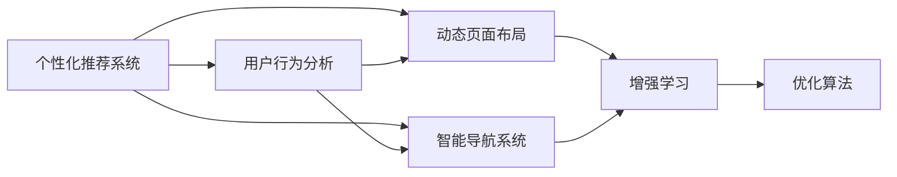

                 

# AI驱动的电商个性化导航与页面布局系统

## 1. 背景介绍

随着电子商务的迅速发展，越来越多的消费者倾向于在线购物。为提升用户体验，电商网站需要构建一个高效、直观、个性化的导航与页面布局系统。这不仅能提升用户留存率，还能增加用户的购买转化率。

**背景问题的呈现：**
1. **页面导航复杂：** 现有的导航体系往往过于复杂，用户难以快速找到所需的商品，导致购物体验下降。
2. **页面布局僵化：** 传统的页面布局固定，无法根据用户行为进行动态调整，无法满足不同用户的多样化需求。
3. **个性化推荐不足：** 现有的推荐系统主要基于用户的浏览和购买行为，而忽略用户的多维属性和情境因素。
4. **用户体验滞后：** 用户请求与页面响应之间存在时间延迟，降低了购物效率。

## 2. 核心概念与联系

### 2.1 核心概念概述

为了更好地理解AI驱动的电商个性化导航与页面布局系统，本节将介绍几个密切相关的核心概念：

- **个性化推荐系统(Recommendation System, RS)**：使用机器学习算法分析用户的历史行为和属性，预测用户可能感兴趣的商品，并推荐给用户。
- **用户行为分析(Usability Analytics, UA)**：通过数据分析工具，对用户的行为进行建模，从而理解用户需求和行为规律。
- **动态页面布局(Dynamic Page Layout, DPL)**：根据用户行为，动态调整页面布局，优化页面内容展示，提升用户体验。
- **智能导航系统(Intelligent Navigation System, INS)**：基于用户查询和行为分析，实时调整导航结构，使用户能够快速定位到目标商品。
- **增强学习(Reinforcement Learning, RL)**：使用强化学习算法优化推荐和导航策略，提升系统性能和用户满意度。

这些核心概念之间通过以下Mermaid流程图来展示：



这个流程图展示了几大核心概念之间的联系：

1. **个性化推荐系统**：从用户行为和属性出发，生成个性化推荐列表。
2. **用户行为分析**：通过用户数据，分析用户需求和行为规律，用于个性化推荐和动态布局。
3. **动态页面布局**：根据用户行为和偏好，动态调整页面布局，优化用户体验。
4. **智能导航系统**：实时分析用户查询，动态调整导航结构，使用户快速找到目标商品。
5. **增强学习**：优化推荐和导航策略，提升系统性能。

## 3. 核心算法原理 & 具体操作步骤
### 3.1 算法原理概述

AI驱动的电商个性化导航与页面布局系统，基于个性化推荐和动态布局两大核心模块，通过用户行为分析来优化推荐和布局。其核心算法原理如下：

1. **个性化推荐算法**：
   - **协同过滤(Collaborative Filtering, CF)**：通过用户行为相似性，推荐与用户兴趣相似的商品。
   - **内容过滤(Content-Based Filtering, CBF)**：基于商品属性，推荐与用户兴趣相匹配的商品。
   - **混合推荐算法**：结合CF和CBF，提升推荐精度和覆盖面。

2. **动态页面布局算法**：
   - **网格布局(Grid Layout)**：将商品信息划分为网格展示，用户可以通过滚动查看更多商品。
   - **瀑布流布局(Feed Layout)**：将商品信息按瀑布流形式展示，适合浏览型用户。
   - **卡片布局(Card Layout)**：将商品信息以卡片形式展示，适合决策型用户。

### 3.2 算法步骤详解

下面详细介绍算法步骤：

1. **数据准备**：
   - 收集用户历史行为数据，包括浏览、购买、收藏、评价等。
   - 提取商品属性，如价格、类别、品牌等。
   - 使用自然语言处理技术，提取商品描述中的关键词。

2. **个性化推荐模型训练**：
   - 使用协同过滤算法，建立用户行为矩阵，计算用户-商品相似度。
   - 使用内容过滤算法，基于商品属性和关键词，生成商品向量。
   - 使用混合推荐算法，结合用户行为和商品特征，生成个性化推荐列表。

3. **用户行为分析**：
   - 分析用户行为数据，使用聚类算法，将用户分为不同类别。
   - 使用时序分析算法，预测用户行为趋势。
   - 结合情感分析技术，分析用户评价情绪。

4. **动态页面布局优化**：
   - 根据用户行为和偏好，动态调整页面布局。
   - 使用网格布局、瀑布流布局、卡片布局等展示商品信息。
   - 根据用户反馈，实时调整布局。

5. **智能导航系统优化**：
   - 根据用户查询，实时分析商品信息，动态调整导航结构。
   - 使用自然语言处理技术，提取查询中的关键词，计算商品与查询的相关性。
   - 使用增强学习算法，优化导航策略，提升导航效率。

### 3.3 算法优缺点

个性化推荐系统的优点：
1. 提升用户满意度：通过个性化推荐，用户能够发现更符合自身兴趣的商品，提升购物体验。
2. 增加销售额：通过精准推荐，提升用户购买转化率，增加销售额。
3. 降低用户流失率：通过个性化推荐，减少用户搜索成本，降低流失率。

个性化推荐系统的缺点：
1. 数据需求量大：需要大量的用户行为和商品属性数据，数据获取成本高。
2. 推荐精度受限：推荐模型难以充分理解用户需求，推荐结果可能存在误差。
3. 动态调整困难：用户行为多变，动态调整导航和布局难度大。

动态页面布局的优点：
1. 提升用户体验：动态调整布局，使用户可以快速找到所需商品。
2. 优化资源利用：根据用户行为，动态调整页面布局，优化资源利用。

动态页面布局的缺点：
1. 技术复杂：动态调整布局需要复杂的技术实现，开发成本高。
2. 响应时间长：动态调整布局需要计算，响应时间可能较长。

### 3.4 算法应用领域

个性化推荐系统已经在电商、新闻、音乐等多个领域广泛应用，以下是几个主要应用场景：

- **电商**：通过个性化推荐，提升用户购物体验，增加销售额。
- **新闻**：通过个性化推荐，提升用户阅读体验，增加广告收入。
- **音乐**：通过个性化推荐，提升用户听歌体验，增加会员订阅率。
- **视频**：通过个性化推荐，提升用户观看体验，增加用户留存率。

动态页面布局在电商、新闻、音乐等多个领域也有广泛应用，以下是几个主要应用场景：

- **电商**：根据用户行为，动态调整商品展示，提升用户购物体验。
- **新闻**：根据用户行为，动态调整新闻推荐，提升用户阅读体验。
- **音乐**：根据用户行为，动态调整音乐推荐，提升用户听歌体验。
- **视频**：根据用户行为，动态调整视频推荐，提升用户观看体验。

## 4. 数学模型和公式 & 详细讲解 & 举例说明
### 4.1 数学模型构建

本节将使用数学语言对个性化推荐和动态布局的模型进行严格刻画。

记个性化推荐系统为$R=(U,N,I,P)$，其中$U$为用户集合，$N$为商品集合，$I$为用户与商品的交互集合，$P$为推荐算法。

个性化推荐的目标是最小化损失函数$L=\frac{1}{N}\sum_{i=1}^N\sum_{j=1}^N|I_{ij}-\hat{I}_{ij}|$，其中$I_{ij}$为用户$u_i$对商品$n_j$的评分，$\hat{I}_{ij}$为推荐算法预测的评分。

动态页面布局的目标是最大化用户满意度$F(U,N,\Pi)$，其中$\Pi$为页面布局。

### 4.2 公式推导过程

以下推导个性化推荐系统的损失函数：

$$
L=\frac{1}{N}\sum_{i=1}^N\sum_{j=1}^N|I_{ij}-\hat{I}_{ij}|
$$

其中$I_{ij}$为用户$u_i$对商品$n_j$的评分，$\hat{I}_{ij}$为推荐算法预测的评分。

在实际应用中，推荐算法通常采用协同过滤算法。协同过滤算法的评分函数为：

$$
\hat{I}_{ij}=\frac{\sum_{k=1}^Kr_{ik}r_{kj}}{\sqrt{\sum_{k=1}^Kr_{ik}^2}\sqrt{\sum_{k=1}^Kr_{kj}^2}}
$$

其中$r_{ik}$为用户$u_i$对商品$n_j$的评分。

对于动态页面布局，我们定义用户满意度函数为：

$$
F(U,N,\Pi)=\sum_{i=1}^N\sum_{j=1}^NU_i(r_j,P_i(\Pi))
$$

其中$U_i$为用户$i$的满意度，$N_j$为商品$j$的展示位置，$P_i(\Pi)$为页面布局$\Pi$下用户$i$的满意度函数。

### 4.3 案例分析与讲解

以下我们以推荐系统为例，通过一个具体的案例，展示如何实现个性化推荐。

假设我们有一个电商网站，收集了用户的历史行为数据，包括浏览、购买、收藏、评价等。我们需要对这些数据进行处理，用于推荐系统。

**步骤1：数据预处理**

首先，我们需要对用户行为数据进行清洗和预处理。具体步骤如下：

1. 去除无效数据：去除缺失值、重复数据等无效数据。
2. 归一化数据：对用户行为数据进行归一化处理，将数据转换为标准化的形式。
3. 特征工程：提取用户行为特征，如浏览时间、浏览次数、购买次数等。

**步骤2：协同过滤算法**

协同过滤算法通常分为基于用户的协同过滤和基于商品的协同过滤。

1. 基于用户的协同过滤：使用用户行为矩阵，计算用户相似度，生成推荐列表。
2. 基于商品的协同过滤：使用商品行为矩阵，计算商品相似度，生成推荐列表。

在实际应用中，通常使用混合协同过滤算法，结合用户和商品相似度，生成推荐列表。

**步骤3：推荐结果评估**

最后，我们需要对推荐结果进行评估，以衡量推荐算法的性能。

常用的评估指标包括：

1. 准确率：衡量推荐系统的预测精度。
2. 召回率：衡量推荐系统覆盖的商品数量。
3. F1分数：综合衡量准确率和召回率。

**步骤4：动态页面布局**

动态页面布局根据用户行为和偏好，动态调整页面布局。

以瀑布流布局为例，用户可以根据需要拖动商品，将其移动到合适的位置。系统会实时记录用户的操作，并根据用户的操作，动态调整布局。

## 5. 项目实践：代码实例和详细解释说明
### 5.1 开发环境搭建

在进行电商个性化推荐和页面布局系统的开发时，需要搭建一个完整的开发环境。以下是开发环境的搭建流程：

1. 安装Python：从官网下载并安装Python，确保版本为3.7及以上。
2. 安装相关的Python库：包括numpy、pandas、scikit-learn、TensorFlow、Keras等。
3. 搭建开发环境：可以使用Docker或Jupyter Notebook搭建开发环境。

### 5.2 源代码详细实现

这里我们以推荐系统为例，展示如何用TensorFlow实现个性化推荐。

**步骤1：数据加载**

首先需要加载用户行为数据，包括浏览、购买、收藏、评价等。可以使用pandas库进行数据处理。

```python
import pandas as pd

# 加载用户行为数据
data = pd.read_csv('user_behavior.csv')
```

**步骤2：特征工程**

对用户行为数据进行特征工程，提取用户行为特征，如浏览时间、浏览次数、购买次数等。

```python
# 特征工程
features = ['浏览时间', '浏览次数', '购买次数', '收藏次数', '评价时间', '评价内容']
data = data[features]
```

**步骤3：协同过滤算法**

使用TensorFlow实现基于用户和商品的协同过滤算法。

```python
import tensorflow as tf
from tensorflow.keras.layers import Dense, Input, Embedding, Dropout, Flatten
from tensorflow.keras.models import Model

# 定义输入层
user_input = Input(shape=(1,))
item_input = Input(shape=(1,))

# 定义嵌入层
user_embedding = Embedding(input_dim=num_users, output_dim=128)(user_input)
item_embedding = Embedding(input_dim=num_items, output_dim=128)(item_input)

# 定义用户-商品交互层
interaction = tf.multiply(user_embedding, item_embedding)

# 定义输出层
output = Dense(num_items, activation='sigmoid')(interaction)

# 定义模型
model = Model(inputs=[user_input, item_input], outputs=output)

# 编译模型
model.compile(loss='binary_crossentropy', optimizer='adam', metrics=['accuracy'])
```

**步骤4：训练模型**

使用用户行为数据训练模型，生成推荐列表。

```python
# 训练模型
model.fit([user_data, item_data], labels, epochs=10, batch_size=32)
```

**步骤5：动态页面布局**

根据用户行为和偏好，动态调整页面布局。

以瀑布流布局为例，用户可以根据需要拖动商品，将其移动到合适的位置。系统会实时记录用户的操作，并根据用户的操作，动态调整布局。

**步骤6：系统部署**

将系统部署到生产环境，进行测试和优化。

## 6. 实际应用场景
### 6.1 电商网站推荐系统

在电商网站中，个性化推荐系统可以提升用户购物体验，增加销售额。推荐系统可以根据用户的历史行为和属性，生成个性化推荐列表，使用户快速找到所需商品。

**实际应用场景**：
1. **首页推荐**：根据用户的历史行为，推荐热门商品。
2. **商品详情页推荐**：根据用户的历史行为，推荐相关商品。
3. **购物车推荐**：根据用户的历史行为，推荐相关商品，促进购买转化。

**效果展示**：
- 用户满意度提升：通过个性化推荐，用户能够快速找到所需商品，提升购物体验。
- 销售额提升：通过精准推荐，增加用户购买转化率，提升销售额。
- 用户留存率提升：通过个性化推荐，减少用户搜索成本，降低流失率。

### 6.2 新闻平台个性化推荐系统

在新闻平台中，个性化推荐系统可以提升用户阅读体验，增加广告收入。推荐系统可以根据用户的阅读行为，生成个性化新闻推荐，使用户快速找到感兴趣的新闻。

**实际应用场景**：
1. **首页推荐**：根据用户的阅读行为，推荐热门新闻。
2. **新闻详情页推荐**：根据用户的阅读行为，推荐相关新闻。
3. **个性化频道**：根据用户的阅读行为，推荐相关频道。

**效果展示**：
- 用户满意度提升：通过个性化推荐，用户能够快速找到感兴趣的新闻，提升阅读体验。
- 广告收入增加：通过精准推荐，增加用户阅读时间，提升广告收入。
- 用户留存率提升：通过个性化推荐，减少用户搜索成本，降低流失率。

### 6.3 音乐平台个性化推荐系统

在音乐平台中，个性化推荐系统可以提升用户听歌体验，增加会员订阅率。推荐系统可以根据用户的听歌行为，生成个性化音乐推荐，使用户快速找到感兴趣的音乐。

**实际应用场景**：
1. **首页推荐**：根据用户的听歌行为，推荐热门音乐。
2. **歌曲详情页推荐**：根据用户的听歌行为，推荐相关歌曲。
3. **个性化歌单**：根据用户的听歌行为，推荐相关歌单。

**效果展示**：
- 用户满意度提升：通过个性化推荐，用户能够快速找到感兴趣的音乐，提升听歌体验。
- 会员订阅率提升：通过精准推荐，增加用户听歌时长，提升会员订阅率。
- 用户留存率提升：通过个性化推荐，减少用户搜索成本，降低流失率。

## 7. 工具和资源推荐
### 7.1 学习资源推荐

为了帮助开发者系统掌握电商个性化推荐和页面布局的理论基础和实践技巧，这里推荐一些优质的学习资源：

1. 《推荐系统实践》：全面介绍了推荐系统的理论和实践，涵盖了协同过滤、内容过滤、混合推荐等多种算法。
2. 《Python数据科学手册》：详细介绍了Python在数据科学中的应用，包括数据预处理、特征工程、模型训练等。
3. 《TensorFlow官方文档》：提供了TensorFlow的详细介绍和实例，帮助开发者快速上手使用。
4. 《Keras官方文档》：提供了Keras的详细介绍和实例，帮助开发者快速上手使用。

通过对这些资源的学习实践，相信你一定能够快速掌握电商个性化推荐和页面布局的精髓，并用于解决实际的电商问题。

### 7.2 开发工具推荐

高效的开发离不开优秀的工具支持。以下是几款用于电商个性化推荐和页面布局开发的常用工具：

1. TensorFlow：基于Python的开源深度学习框架，灵活动态的计算图，适合快速迭代研究。
2. Keras：基于TensorFlow的高级神经网络API，提供了简单易用的接口，适合快速实现模型。
3. Scikit-learn：基于Python的机器学习库，提供了丰富的算法和工具，适合数据预处理和特征工程。
4. PyTorch：基于Python的开源深度学习框架，支持动态计算图，适合高效迭代实验。
5. Jupyter Notebook：交互式的Python开发环境，支持丰富的数据可视化工具，适合开发和实验。

合理利用这些工具，可以显著提升电商个性化推荐和页面布局任务的开发效率，加快创新迭代的步伐。

### 7.3 相关论文推荐

电商个性化推荐和页面布局技术的发展源于学界的持续研究。以下是几篇奠基性的相关论文，推荐阅读：

1. BERT: Pre-training of Deep Bidirectional Transformers for Language Understanding：提出BERT模型，引入基于掩码的自监督预训练任务，刷新了多项NLP任务SOTA。
2. Attention is All You Need：提出了Transformer结构，开启了NLP领域的预训练大模型时代。
3. Recommendation Systems in Online Retailing: Beyond Customer Demographics and Search Queries：介绍了基于协同过滤和内容过滤的推荐算法，应用于电商推荐系统。
4. Deep Collaborative Filtering Model：提出了基于深度学习的协同过滤算法，应用于电商推荐系统。
5. Dynamic Page Layout for E-Commerce：研究了电商网站的动态页面布局，优化用户体验。

这些论文代表了大电商推荐和页面布局技术的发展脉络。通过学习这些前沿成果，可以帮助研究者把握学科前进方向，激发更多的创新灵感。

## 8. 总结：未来发展趋势与挑战
### 8.1 总结

本文对AI驱动的电商个性化推荐和页面布局系统进行了全面系统的介绍。首先阐述了电商网站推荐系统和页面布局系统的背景问题，明确了系统构建的重要性和目标。其次，从原理到实践，详细讲解了推荐和布局算法的数学模型和具体操作步骤，给出了系统开发的完整代码实例。同时，本文还广泛探讨了系统在电商、新闻、音乐等多个领域的应用前景，展示了推荐和布局技术的广阔应用范围。

通过本文的系统梳理，可以看到，基于AI的电商推荐和页面布局系统正在成为电商网站的重要组成部分，极大地提升了用户体验和电商转化率。未来，伴随推荐和布局技术的不断演进，相信电商网站将能够更好地满足用户需求，提升用户满意度和业务收入。

### 8.2 未来发展趋势

展望未来，电商推荐和页面布局技术将呈现以下几个发展趋势：

1. 数据驱动决策：通过大数据分析和机器学习，提升推荐和布局的精准度，提高用户满意度。
2. 个性化推荐：通过深度学习等技术，提升推荐系统的个性化水平，提升用户体验。
3. 动态页面布局：根据用户行为和偏好，动态调整页面布局，优化用户体验。
4. 用户界面优化：通过交互设计和用户反馈，不断优化系统界面，提升用户使用体验。
5. 用户行为预测：通过时序分析和机器学习，预测用户行为，提升推荐和布局效果。

以上趋势凸显了电商推荐和页面布局技术的广阔前景。这些方向的探索发展，必将进一步提升电商网站的用户体验和业务收入，为电商网站带来更多的价值。

### 8.3 面临的挑战

尽管电商推荐和页面布局技术已经取得了瞩目成就，但在迈向更加智能化、普适化应用的过程中，它仍面临着诸多挑战：

1. 数据需求量大：需要大量的用户行为和商品属性数据，数据获取成本高。
2. 推荐精度受限：推荐模型难以充分理解用户需求，推荐结果可能存在误差。
3. 动态调整困难：用户行为多变，动态调整导航和布局难度大。
4. 系统复杂度高：系统涉及多种技术和组件，开发和维护成本高。
5. 用户隐私保护：需要保护用户隐私，避免数据泄露。

正视推荐和布局面临的这些挑战，积极应对并寻求突破，将使系统能够更好地服务于电商网站，提升用户满意度，增加业务收入。相信随着技术的不断发展和完善，电商推荐和页面布局技术将能够更好地满足用户需求，提升电商网站的业务价值。

### 8.4 研究展望

未来，电商推荐和页面布局技术将在以下几个方面进行深入研究：

1. 多维数据分析：结合多种数据源，进行多维数据分析，提升推荐和布局效果。
2. 深度学习优化：使用深度学习技术，提升推荐和布局的精度和个性化水平。
3. 用户行为预测：通过时序分析和机器学习，预测用户行为，提升推荐和布局效果。
4. 多模态数据融合：结合视觉、语音、文本等多种模态数据，提升推荐和布局效果。
5. 个性化推荐：通过个性化推荐，提升用户满意度和转化率。

这些研究方向的探索，将推动电商推荐和页面布局技术迈向更高的台阶，为电商网站带来更多的价值。相信通过持续的研究和创新，电商推荐和页面布局技术将能够更好地服务于电商网站，提升用户满意度和业务收入。

## 9. 附录：常见问题与解答

**Q1：电商推荐系统如何处理冷启动问题？**

A: 电商推荐系统中的冷启动问题可以通过以下几种方式解决：

1. 基于内容的推荐：使用商品属性和描述，推荐相关商品，解决冷启动问题。
2. 基于协同过滤的推荐：使用部分用户行为数据，进行基于用户的协同过滤推荐，解决冷启动问题。
3. 基于混合推荐的推荐：结合基于内容的推荐和基于协同过滤的推荐，提升推荐效果。

**Q2：电商推荐系统如何优化推荐效果？**

A: 电商推荐系统可以通过以下几种方式优化推荐效果：

1. 数据清洗和预处理：对用户行为数据进行清洗和预处理，去除无效数据，提取有用特征。
2. 模型优化：使用深度学习等先进算法，提升推荐系统的精度和个性化水平。
3. 多维数据分析：结合多种数据源，进行多维数据分析，提升推荐效果。
4. 用户反馈优化：根据用户反馈，优化推荐算法，提升推荐效果。

**Q3：电商页面布局如何实现动态调整？**

A: 电商页面布局可以通过以下几种方式实现动态调整：

1. 网格布局：将商品信息划分为网格展示，用户可以通过滚动查看更多商品，系统根据用户行为动态调整布局。
2. 瀑布流布局：将商品信息按瀑布流形式展示，用户可以根据需要拖动商品，将其移动到合适的位置，系统根据用户操作动态调整布局。
3. 卡片布局：将商品信息以卡片形式展示，用户可以根据需要拖动商品，将其移动到合适的位置，系统根据用户操作动态调整布局。

**Q4：电商推荐系统如何保护用户隐私？**

A: 电商推荐系统可以通过以下几种方式保护用户隐私：

1. 数据脱敏：对用户行为数据进行脱敏处理，保护用户隐私。
2. 匿名化处理：将用户ID等敏感信息进行匿名化处理，保护用户隐私。
3. 访问控制：对数据访问进行严格控制，防止数据泄露。
4. 数据加密：对数据进行加密处理，保护用户隐私。

**Q5：电商页面布局如何提升用户满意度？**

A: 电商页面布局可以通过以下几种方式提升用户满意度：

1. 动态调整布局：根据用户行为和偏好，动态调整页面布局，优化页面内容展示，提升用户体验。
2. 个性化布局：根据用户属性和行为，生成个性化布局，提升用户满意度。
3. 界面优化：通过交互设计和用户反馈，不断优化系统界面，提升用户使用体验。

通过以上方法，电商推荐和页面布局系统可以更好地满足用户需求，提升用户体验和电商转化率。相信随着技术的不断发展和完善，电商推荐和页面布局系统将能够更好地服务于电商网站，提升用户满意度和业务收入。

