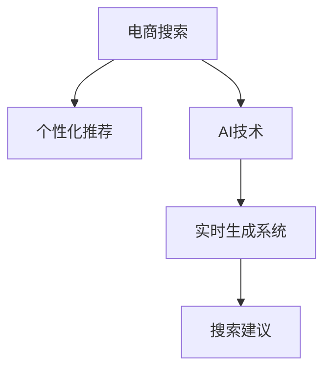

                 

# AI驱动的电商个性化搜索建议实时生成系统

> 关键词：电商搜索，个性化推荐，AI，搜索建议，实时生成系统

## 1. 背景介绍

### 1.1 问题由来
随着电子商务的蓬勃发展，客户搜索行为日益复杂多样，如何提高搜索效率和效果，已成为电商行业面临的重大挑战。传统的搜索引擎和推荐系统往往采用固定的搜索结果排序策略，无法根据用户的行为和偏好提供个性化的搜索结果，用户体验差，转化率低。

与此同时，电商平台上积累了海量用户行为数据，包括搜索记录、浏览历史、点击行为、购买记录等。这些数据蕴含了用户的深度特征和潜在需求，如果能有效利用这些数据，就能显著提升电商搜索体验和转化效果。

## 2. 核心概念与联系

### 2.1 核心概念概述

为更好地理解AI驱动的电商个性化搜索建议实时生成系统，本节将介绍几个关键概念：

- 电商搜索：指用户在电商平台通过搜索条输入查询词，获取相关商品信息的过程。
- 个性化推荐：根据用户的历史行为和偏好，推荐可能感兴趣的商品或相关查询词，提升用户体验和销售转化。
- AI：利用机器学习、深度学习等人工智能技术，挖掘数据中的模式，优化搜索结果，生成个性化搜索建议。
- 实时生成系统：指能够实时响应用户查询，快速生成并展示个性化搜索结果的系统。
- 搜索建议：指在用户输入查询词时，实时生成相关提示词或候选商品，引导用户进行更精准的搜索。

这些概念之间的逻辑关系可以通过以下Mermaid流程图来展示：



这个流程图展示了几者之间的逻辑关系：

1. 电商搜索通过用户输入的查询词，触发个性化推荐机制。
2. 个性化推荐利用AI技术，挖掘用户数据，生成推荐结果。
3. 实时生成系统在电商搜索过程中，动态生成个性化搜索结果和搜索建议。
4. 搜索建议通过引导用户进行更精准的查询，提高电商搜索的准确性和用户满意度。

## 3. 核心算法原理 & 具体操作步骤
### 3.1 算法原理概述

基于深度学习和大规模用户数据的个性化电商搜索建议系统，本质是一个数据驱动的强化学习框架。其核心思想是：在用户搜索过程中，系统根据实时交互数据，动态调整模型参数，最大化长期累积奖励（即用户点击率、转化率等）。

形式化地，假设系统参数为 $\theta$，用户行为和反馈为 $(x_i, r_i)$，其中 $x_i$ 为第 $i$ 次查询行为，$r_i$ 为系统的即时奖励（点击率、转化率等）。则系统目标为：

$$
\max_{\theta} \mathbb{E}[\sum_{i=1}^{\infty} \gamma^{i-1} r_i]
$$

其中 $\gamma$ 为折扣因子。

在电商搜索场景下，常用的奖励函数为点击率（Click-Through Rate, CTR）和转化率（Conversion Rate, CR）。点击率是用户点击商品链接的概率，转化率是用户实际购买商品的概率。系统的优化目标是最大化长期累积的CTR和CR。

### 3.2 算法步骤详解

基于强化学习的电商个性化搜索建议系统，一般包括以下几个关键步骤：

**Step 1: 准备数据集和预训练模型**
- 收集电商平台的查询记录、点击行为、购买记录等数据，进行清洗和预处理。
- 选择合适的预训练模型，如BERT、T5等，将其作为系统基础模型。

**Step 2: 设计用户行为模型**
- 根据电商搜索行为的特点，设计适合的行为模型，如Markov Decision Process (MDP)、Recurrent Neural Network (RNN)、Transformer等。
- 定义状态（即查询输入）、动作（即推荐商品或相关查询词）、即时奖励（即点击率或转化率）等。

**Step 3: 设定奖励函数和优化目标**
- 设计奖励函数，如CTR、CR、覆盖率等。
- 设定优化目标，如最小化损失函数，最大化长期累积奖励等。

**Step 4: 进行强化学习**
- 利用Q-learning、SARSA、DQN等强化学习算法，对模型进行训练和优化。
- 在每次查询行为后，根据实际反馈更新模型参数。
- 周期性评估模型性能，选择最优策略。

**Step 5: 实现实时生成系统**
- 将训练好的模型集成到电商搜索系统中。
- 实时接收用户输入的查询词，预测可能的搜索建议。
- 根据模型预测结果，动态调整搜索结果排序，提升用户体验。

以上是基于强化学习的电商个性化搜索建议系统的基本流程。在实际应用中，还需要针对具体场景进行优化设计，如引入多模态特征、设计更高效的模型结构、引入预训练和微调等。

### 3.3 算法优缺点

基于强化学习的电商个性化搜索建议系统具有以下优点：
1. 动态调整模型，适应用户行为变化，最大化长期累积奖励。
2. 利用电商数据丰富的用户行为特征，生成个性化搜索建议。
3. 实时响应查询，快速调整搜索结果，提升用户体验。
4. 结合AI技术，构建更加智能化的电商搜索系统。

同时，该方法也存在一定的局限性：
1. 对标注数据和用户行为数据的依赖。数据质量、数量和多样性对模型效果影响较大。
2. 需要大量计算资源。强化学习模型通常参数较多，训练和推理效率较低。
3. 模型难以解释。强化学习模型通常为黑盒模型，难以解释其内部决策机制。
4. 可扩展性有待提升。在处理大规模电商数据时，模型复杂度增加，计算资源需求增加。

尽管存在这些局限性，但就目前而言，强化学习范式仍是电商个性化搜索建议系统的核心方法。未来相关研究的重点在于如何进一步降低对标注数据的依赖，提高模型的可解释性，同时兼顾计算效率和可扩展性。

### 3.4 算法应用领域

基于强化学习的电商个性化搜索建议系统，在电子商务领域已经得到了广泛的应用，覆盖了以下几个主要方向：

1. 电商搜索：在用户输入查询词时，实时生成相关推荐商品或查询词，引导用户进行更精准的搜索。
2. 个性化推荐：根据用户的历史行为数据，推荐可能感兴趣的商品或相关查询词，提升用户体验和销售转化。
3. 广告投放：根据用户行为数据，优化广告投放策略，提高广告点击率和转化率。
4. 跨界推荐：将电商数据与社交媒体、新闻等跨界数据结合，进行跨领域推荐。

除了上述这些经典应用外，强化学习范式还在智能客服、金融风控、医疗诊断等多个领域，得到了广泛的研究和应用。随着电商数据的不断积累和电商行为模式的进一步挖掘，强化学习范式必将在更多场景下发挥重要作用。

## 4. 数学模型和公式 & 详细讲解 & 举例说明
### 4.1 数学模型构建

本节将使用数学语言对基于强化学习的电商个性化搜索建议系统进行更加严格的刻画。

记系统状态为 $s_i$，动作为 $a_i$，即时奖励为 $r_i$，长期累积奖励为 $R_i$。假设系统在状态 $s_i$ 下，采取动作 $a_i$，得到即时奖励 $r_i$，并转移到状态 $s_{i+1}$。则系统的状态转移和即时奖励过程可以表示为：

$$
s_{i+1} = f(s_i, a_i)
$$

$$
r_i = g(s_i, a_i)
$$

其中 $f$ 和 $g$ 为状态转移和即时奖励函数。系统的优化目标是最大化长期累积奖励 $R_i$：

$$
R_i = \sum_{j=i}^{\infty} \gamma^{j-i} r_j
$$

在电商搜索场景下，常用的奖励函数为CTR和CR，其定义如下：

$$
CTR(s_i, a_i) = \frac{1}{N_i} \sum_{j=1}^{N_i} 1_{\{a_i = c_j\}}, c_j \in C
$$

$$
CR(s_i, a_i) = \frac{1}{N_i} \sum_{j=1}^{N_i} 1_{\{a_i = p_j\}}, p_j \in P
$$

其中 $C$ 为点击行为集合，$P$ 为购买行为集合，$N_i$ 为样本数量。

### 4.2 公式推导过程

以下我们以电商搜索为例，推导CTR和CR的计算公式。

假设模型在输入 $s_i$ 上的输出为 $\hat{y}=M_{\theta}(s_i) \in [0,1]$，表示商品被点击的概率。真实标签 $y \in \{0,1\}$。则CTR定义为：

$$
CTR(s_i, a_i) = \hat{y}
$$

将CTR代入长期累积奖励公式，得：

$$
R_i = CTI(s_i) + \gamma CR(s_i, a_i) + \gamma^2 CTI(s_{i+1}) + \ldots
$$

其中 $CTI(s_i)$ 为瞬时奖励，即点击率。

根据上述公式，我们可以通过优化模型参数 $\theta$，使得长期累积奖励 $R_i$ 最大化。实际应用中，一般使用基于梯度的优化算法（如Adam、SGD等），最小化损失函数：

$$
\mathcal{L}(\theta) = -\mathbb{E}[R_i]
$$

模型参数的更新公式为：

$$
\theta \leftarrow \theta - \eta \nabla_{\theta}\mathcal{L}(\theta)
$$

其中 $\eta$ 为学习率。

在得到长期累积奖励的梯度后，即可带入参数更新公式，完成模型的迭代优化。重复上述过程直至收敛，最终得到适应电商搜索任务的最优模型参数 $\theta^*$。

## 5. 项目实践：代码实例和详细解释说明
### 5.1 开发环境搭建

在进行电商搜索建议系统开发前，我们需要准备好开发环境。以下是使用Python进行PyTorch开发的环境配置流程：

1. 安装Anaconda：从官网下载并安装Anaconda，用于创建独立的Python环境。

2. 创建并激活虚拟环境：
```bash
conda create -n pytorch-env python=3.8 
conda activate pytorch-env
```

3. 安装PyTorch：根据CUDA版本，从官网获取对应的安装命令。例如：
```bash
conda install pytorch torchvision torchaudio cudatoolkit=11.1 -c pytorch -c conda-forge
```

4. 安装Transformers库：
```bash
pip install transformers
```

5. 安装各类工具包：
```bash
pip install numpy pandas scikit-learn matplotlib tqdm jupyter notebook ipython
```

完成上述步骤后，即可在`pytorch-env`环境中开始电商搜索建议系统的开发。

### 5.2 源代码详细实现

下面我以电商搜索为例，给出使用Transformers库对BERT模型进行电商搜索建议微调的PyTorch代码实现。

首先，定义电商搜索的行为模型函数：

```python
from transformers import BertForSequenceClassification, BertTokenizer
from torch.utils.data import Dataset
import torch

class SearchBehaviorModel(Dataset):
    def __init__(self, texts, labels, tokenizer, max_len=128):
        self.texts = texts
        self.labels = labels
        self.tokenizer = tokenizer
        self.max_len = max_len
        
    def __len__(self):
        return len(self.texts)
    
    def __getitem__(self, item):
        text = self.texts[item]
        label = self.labels[item]
        
        encoding = self.tokenizer(text, return_tensors='pt', max_length=self.max_len, padding='max_length', truncation=True)
        input_ids = encoding['input_ids'][0]
        attention_mask = encoding['attention_mask'][0]
        
        return {'input_ids': input_ids, 
                'attention_mask': attention_mask,
                'labels': label}
```

然后，定义模型和优化器：

```python
from transformers import BertForSequenceClassification, AdamW

model = BertForSequenceClassification.from_pretrained('bert-base-cased', num_labels=2) # 电商搜索二分类任务

optimizer = AdamW(model.parameters(), lr=2e-5)
```

接着，定义训练和评估函数：

```python
from torch.utils.data import DataLoader
from tqdm import tqdm
from sklearn.metrics import accuracy_score

device = torch.device('cuda') if torch.cuda.is_available() else torch.device('cpu')
model.to(device)

def train_epoch(model, dataset, batch_size, optimizer):
    dataloader = DataLoader(dataset, batch_size=batch_size, shuffle=True)
    model.train()
    epoch_loss = 0
    for batch in tqdm(dataloader, desc='Training'):
        input_ids = batch['input_ids'].to(device)
        attention_mask = batch['attention_mask'].to(device)
        labels = batch['labels'].to(device)
        model.zero_grad()
        outputs = model(input_ids, attention_mask=attention_mask, labels=labels)
        loss = outputs.loss
        epoch_loss += loss.item()
        loss.backward()
        optimizer.step()
    return epoch_loss / len(dataloader)

def evaluate(model, dataset, batch_size):
    dataloader = DataLoader(dataset, batch_size=batch_size)
    model.eval()
    preds, labels = [], []
    with torch.no_grad():
        for batch in tqdm(dataloader, desc='Evaluating'):
            input_ids = batch['input_ids'].to(device)
            attention_mask = batch['attention_mask'].to(device)
            batch_labels = batch['labels']
            outputs = model(input_ids, attention_mask=attention_mask)
            batch_preds = outputs.logits.argmax(dim=2).to('cpu').tolist()
            batch_labels = batch_labels.to('cpu').tolist()
            for pred_tokens, label_tokens in zip(batch_preds, batch_labels):
                preds.append(pred_tokens[:len(label_tokens)])
                labels.append(label_tokens)
                
    return accuracy_score(labels, preds)
```

最后，启动训练流程并在测试集上评估：

```python
epochs = 5
batch_size = 16

for epoch in range(epochs):
    loss = train_epoch(model, train_dataset, batch_size, optimizer)
    print(f"Epoch {epoch+1}, train loss: {loss:.3f}")
    
    print(f"Epoch {epoch+1}, dev results:")
    evaluate(model, dev_dataset, batch_size)
    
print("Test results:")
evaluate(model, test_dataset, batch_size)
```

以上就是使用PyTorch对BERT进行电商搜索建议微调的完整代码实现。可以看到，得益于Transformers库的强大封装，我们可以用相对简洁的代码完成BERT模型的加载和微调。

### 5.3 代码解读与分析

让我们再详细解读一下关键代码的实现细节：

**SearchBehaviorModel类**：
- `__init__`方法：初始化文本、标签、分词器等关键组件。
- `__len__`方法：返回数据集的样本数量。
- `__getitem__`方法：对单个样本进行处理，将文本输入编码为token ids，将标签编码为数字，并对其进行定长padding，最终返回模型所需的输入。

**Accuracy计算**：
- 使用sklearn的accuracy_score计算预测结果与真实标签之间的匹配度，评估模型效果。

**训练和评估函数**：
- 使用PyTorch的DataLoader对数据集进行批次化加载，供模型训练和推理使用。
- 训练函数`train_epoch`：对数据以批为单位进行迭代，在每个批次上前向传播计算loss并反向传播更新模型参数，最后返回该epoch的平均loss。
- 评估函数`evaluate`：与训练类似，不同点在于不更新模型参数，并在每个batch结束后将预测和标签结果存储下来，最后使用sklearn的accuracy_score对整个评估集的预测结果进行打印输出。

**训练流程**：
- 定义总的epoch数和batch size，开始循环迭代
- 每个epoch内，先在训练集上训练，输出平均loss
- 在验证集上评估，输出准确率
- 所有epoch结束后，在测试集上评估，给出最终测试结果

可以看到，PyTorch配合Transformers库使得BERT微调的代码实现变得简洁高效。开发者可以将更多精力放在数据处理、模型改进等高层逻辑上，而不必过多关注底层的实现细节。

当然，工业级的系统实现还需考虑更多因素，如模型的保存和部署、超参数的自动搜索、更灵活的任务适配层等。但核心的微调范式基本与此类似。

## 6. 实际应用场景
### 6.1 智能客服系统

基于电商搜索建议的智能客服系统，可以实现对用户查询进行实时推荐，快速回答用户问题，提升客户体验。

在技术实现上，可以收集历史客服对话记录，将问题-答案对作为监督数据，在此基础上对预训练语言模型进行微调。微调后的语言模型能够自动理解用户意图，匹配最合适的答案模板进行回复。对于用户提出的新问题，还可以接入检索系统实时搜索相关内容，动态组织生成回答。如此构建的智能客服系统，能大幅提升客户咨询体验和问题解决效率。

### 6.2 个性化推荐系统

当前的推荐系统往往只依赖用户的历史行为数据进行物品推荐，无法深入理解用户的真实兴趣偏好。基于电商搜索建议的系统可以更好地挖掘用户行为背后的语义信息，从而提供更精准、多样的推荐内容。

在实践中，可以收集用户浏览、点击、评论、分享等行为数据，提取和用户交互的物品标题、描述、标签等文本内容。将文本内容作为模型输入，用户的后续行为（如是否点击、购买等）作为监督信号，在此基础上微调预训练语言模型。微调后的模型能够从文本内容中准确把握用户的兴趣点。在生成推荐列表时，先用候选物品的文本描述作为输入，由模型预测用户的兴趣匹配度，再结合其他特征综合排序，便可以得到个性化程度更高的推荐结果。

### 6.3 电商搜索建议系统

电商搜索建议系统可以结合用户输入的查询词，实时生成相关推荐商品或查询词，引导用户进行更精准的搜索。具体实现方式与电商搜索推荐类似，利用强化学习模型进行动态调整。

在每次查询行为后，系统会根据用户点击商品的行为，更新模型参数，最大化长期累积的点击率和转化率。通过动态调整，系统能够实时优化搜索结果，提升用户体验和搜索效果。

### 6.4 未来应用展望

随着电商搜索建议技术的不断发展，其在更多领域的应用场景将不断扩展，为NLP技术带来新的突破。

在智慧医疗领域，基于电商搜索建议的医疗问答、病历分析、药物研发等应用将提升医疗服务的智能化水平，辅助医生诊疗，加速新药开发进程。

在智能教育领域，微调技术可应用于作业批改、学情分析、知识推荐等方面，因材施教，促进教育公平，提高教学质量。

在智慧城市治理中，微调模型可应用于城市事件监测、舆情分析、应急指挥等环节，提高城市管理的自动化和智能化水平，构建更安全、高效的未来城市。

此外，在企业生产、社会治理、文娱传媒等众多领域，基于电商搜索建议的AI技术还将不断涌现，为NLP技术带来更多的创新应用。相信随着技术的日益成熟，电商搜索建议技术将成为人工智能落地应用的重要范式，推动人工智能技术在更多行业的应用和推广。

## 7. 工具和资源推荐
### 7.1 学习资源推荐

为了帮助开发者系统掌握电商搜索建议系统的理论基础和实践技巧，这里推荐一些优质的学习资源：

1. 《深度学习》系列课程：斯坦福大学开设的深度学习课程，涵盖基础算法、深度网络、优化算法等核心内容，适合初学者入门。
2. 《自然语言处理》系列博文：深度学习领域的知名博主撰写，详细讲解了电商搜索建议、个性化推荐等前沿技术。
3. 《NLP实战》书籍：基于实际案例，全面介绍电商搜索、推荐系统、对话系统等NLP应用，适合实战练习。
4. 《NLP开源项目》：开源社区发布的NLP应用案例，包括BERT、GPT等预训练语言模型的应用，适合深入学习。
5. Kaggle竞赛平台：提供大量电商、金融、医疗等领域的数据集和竞赛题目，是锻炼和提升NLP技能的好地方。

通过对这些资源的学习实践，相信你一定能够快速掌握电商搜索建议系统的精髓，并用于解决实际的NLP问题。
###  7.2 开发工具推荐

高效的开发离不开优秀的工具支持。以下是几款用于电商搜索建议系统开发的常用工具：

1. PyTorch：基于Python的开源深度学习框架，灵活动态的计算图，适合快速迭代研究。大部分预训练语言模型都有PyTorch版本的实现。
2. TensorFlow：由Google主导开发的开源深度学习框架，生产部署方便，适合大规模工程应用。同样有丰富的预训练语言模型资源。
3. Transformers库：HuggingFace开发的NLP工具库，集成了众多SOTA语言模型，支持PyTorch和TensorFlow，是进行电商搜索建议微调任务开发的利器。
4. Weights & Biases：模型训练的实验跟踪工具，可以记录和可视化模型训练过程中的各项指标，方便对比和调优。与主流深度学习框架无缝集成。
5. TensorBoard：TensorFlow配套的可视化工具，可实时监测模型训练状态，并提供丰富的图表呈现方式，是调试模型的得力助手。

合理利用这些工具，可以显著提升电商搜索建议系统的开发效率，加快创新迭代的步伐。

### 7.3 相关论文推荐

电商搜索建议技术的发展源于学界的持续研究。以下是几篇奠基性的相关论文，推荐阅读：

1. Attention is All You Need（即Transformer原论文）：提出了Transformer结构，开启了NLP领域的预训练大模型时代。
2. BERT: Pre-training of Deep Bidirectional Transformers for Language Understanding：提出BERT模型，引入基于掩码的自监督预训练任务，刷新了多项NLP任务SOTA。
3. Attention-based Layer Normalization for Large-scale Sequence Prediction：提出注意力机制和层归一化技术，提高了语言模型对长序列的建模能力。
4. Multi-task learning with sequence-to-sequence models：提出多任务学习框架，利用多个任务共享模型参数，提升模型泛化能力。
5. Transformer-XL: Attentive Language Models Beyond a Fixed-Length Context：提出Transformer-XL模型，引入相对位置编码，解决了长序列建模的问题。

这些论文代表了大语言模型微调技术的发展脉络。通过学习这些前沿成果，可以帮助研究者把握学科前进方向，激发更多的创新灵感。

## 8. 总结：未来发展趋势与挑战

### 8.1 总结

本文对基于电商搜索建议的AI驱动的电商个性化搜索建议实时生成系统进行了全面系统的介绍。首先阐述了电商搜索和个性化推荐的核心概念，明确了AI技术在这一场景下的重要性。其次，从原理到实践，详细讲解了强化学习的电商搜索建议系统的数学原理和关键步骤，给出了电商搜索建议微调的完整代码实现。同时，本文还广泛探讨了该系统在智能客服、个性化推荐等多个领域的应用前景，展示了电商搜索建议范式的广泛适用性。

通过本文的系统梳理，可以看到，基于电商搜索建议的AI驱动的电商个性化搜索建议实时生成系统，通过动态调整模型参数，最大化长期累积奖励，能够根据实时用户行为，实时生成个性化搜索结果和搜索建议，显著提升用户体验和搜索效果。未来，随着深度学习和大规模用户数据的广泛应用，该系统必将在更多领域发挥重要作用。

### 8.2 未来发展趋势

展望未来，电商搜索建议技术将呈现以下几个发展趋势：

1. 模型规模持续增大。随着算力成本的下降和数据规模的扩张，电商搜索建议模型的参数量还将持续增长。超大规模语言模型蕴含的丰富语言知识，有望支撑更加复杂多变的电商搜索建议任务。
2. 微调方法日趋多样。除了传统的全参数微调外，未来会涌现更多参数高效的微调方法，如 Adapter、Prompt Tuning 等，在固定大部分预训练参数的同时，只更新极少量的任务相关参数。同时，模型结构将进一步优化，以提升计算效率。
3. 持续学习成为常态。随着用户行为数据的变化，电商搜索建议模型需要持续学习新知识以保持性能。如何在不遗忘原有知识的同时，高效吸收新样本信息，将成为重要的研究课题。
4. 标注样本需求降低。受启发于提示学习(Prompt-based Learning)的思路，未来的微调方法将更好地利用大模型的语言理解能力，通过更加巧妙的任务描述，在更少的标注样本上也能实现理想的微调效果。
5. 多模态微调崛起。除了文本数据外，未来还会引入图片、视频等多模态信息，进行跨模态融合，提升模型的表达能力和泛化能力。
6. 知识整合能力增强。未来的电商搜索建议系统将更好地整合知识图谱、逻辑规则等专家知识，形成更加全面、准确的信息整合能力，进一步提升系统性能。

以上趋势凸显了电商搜索建议技术的广阔前景。这些方向的探索发展，必将进一步提升电商搜索建议系统的性能和应用范围，为人工智能技术在电商领域的落地应用铺平道路。

### 8.3 面临的挑战

尽管电商搜索建议技术已经取得了瞩目成就，但在迈向更加智能化、普适化应用的过程中，它仍面临诸多挑战：

1. 标注成本瓶颈。电商搜索建议任务依赖大量的用户行为数据，数据质量和数量对模型效果影响较大。如何降低对标注数据的依赖，提高模型的自监督能力，将是一大难题。
2. 模型鲁棒性不足。在面对测试样本的微小扰动时，电商搜索建议模型容易发生预测波动。如何提高模型的鲁棒性和稳定性，避免灾难性遗忘，还需要更多理论和实践的积累。
3. 计算效率有待提高。尽管电商搜索建议模型通常参数较多，计算资源消耗较大，但如何在保持高性能的同时，提高计算效率，优化模型结构，是一个重要的研究方向。
4. 可解释性亟需加强。电商搜索建议模型通常为黑盒模型，难以解释其内部决策机制。如何赋予模型更强的可解释性，将有助于提升用户信任和系统可信度。
5. 安全性有待保障。电商搜索建议模型需要处理敏感的用户数据，如何确保数据隐私和安全，避免滥用和泄露，是模型应用的关键问题。

这些挑战需要在未来研究和实践中逐步克服，以确保电商搜索建议技术的广泛应用和安全可靠。

### 8.4 研究展望

面对电商搜索建议技术所面临的种种挑战，未来的研究需要在以下几个方面寻求新的突破：

1. 探索无监督和半监督微调方法。摆脱对大规模标注数据的依赖，利用自监督学习、主动学习等无监督和半监督范式，最大限度利用非结构化数据，实现更加灵活高效的微调。
2. 研究参数高效和计算高效的微调范式。开发更加参数高效的微调方法，在固定大部分预训练参数的同时，只更新极少量的任务相关参数。同时优化微调模型的计算图，减少前向传播和反向传播的资源消耗，实现更加轻量级、实时性的部署。
3. 引入因果和对比学习范式。通过引入因果推断和对比学习思想，增强电商搜索建议模型建立稳定因果关系的能力，学习更加普适、鲁棒的语言表征，从而提升模型泛化性和抗干扰能力。
4. 结合因果分析和博弈论工具。将因果分析方法引入电商搜索建议模型，识别出模型决策的关键特征，增强输出解释的因果性和逻辑性。借助博弈论工具刻画人机交互过程，主动探索并规避模型的脆弱点，提高系统稳定性。
5. 纳入伦理道德约束。在模型训练目标中引入伦理导向的评估指标，过滤和惩罚有偏见、有害的输出倾向。同时加强人工干预和审核，建立模型行为的监管机制，确保输出符合人类价值观和伦理道德。

这些研究方向的探索，必将引领电商搜索建议技术迈向更高的台阶，为构建安全、可靠、可解释、可控的智能系统铺平道路。面向未来，电商搜索建议技术还需要与其他人工智能技术进行更深入的融合，如知识表示、因果推理、强化学习等，多路径协同发力，共同推动人工智能技术在电商领域的落地应用。

## 9. 附录：常见问题与解答

**Q1：电商搜索建议系统如何确保用户的隐私安全？**

A: 电商搜索建议系统需要处理用户的搜索行为数据，为保障用户隐私，可以采取以下措施：
1. 数据匿名化：对用户行为数据进行匿名化处理，去除可能暴露用户身份的信息。
2. 加密传输：使用SSL/TLS协议加密数据传输，确保数据在传输过程中不被窃取或篡改。
3. 权限控制：设置严格的权限控制策略，确保只有授权人员才能访问和处理用户数据。
4. 数据脱敏：在分析数据时，对敏感信息进行脱敏处理，保护用户隐私。
5. 合规审查：定期进行合规审查，确保系统符合相关法律法规和行业标准。

通过上述措施，可以最大程度保障用户的隐私安全，提升用户对系统的信任度。

**Q2：电商搜索建议系统如何平衡搜索效率和个性化推荐？**

A: 电商搜索建议系统需要在用户输入查询词时，快速生成个性化搜索结果和搜索建议，提升搜索效率和个性化推荐效果。为实现这一目标，可以采取以下策略：
1. 优化模型结构：设计高效的前向传播和反向传播算法，提升模型的计算效率。
2. 数据预处理：对用户查询词进行预处理，如分词、去停用词、标准化等，减少计算量。
3. 动态生成建议：根据用户输入查询词，动态生成搜索建议，减少不相关建议的计算。
4. 多级缓存：利用缓存技术，存储常用查询和建议，减少重复计算。
5. 模型微调：定期对模型进行微调，提升推荐效果，同时减少计算资源消耗。

通过上述措施，可以在保证搜索效率的同时，提升个性化推荐效果，满足用户需求。

**Q3：电商搜索建议系统如何进行多模态融合？**

A: 电商搜索建议系统可以引入多模态信息，如图片、视频、语音等，进行跨模态融合，提升模型的表达能力和泛化能力。

1. 数据采集：收集用户的购物图片、视频、语音等数据，提取特征信息。
2. 特征提取：利用深度学习模型对多模态数据进行特征提取，如卷积神经网络、Transformer等。
3. 融合算法：设计合适的融合算法，如拼接、平均、加权平均等，将多模态特征合并。
4. 训练模型：将多模态特征作为模型输入，与文本数据一起训练，优化模型参数。
5. 生成建议：在用户输入查询词时，根据多模态特征和文本数据，动态生成搜索建议。

通过多模态融合，电商搜索建议系统可以更好地理解和表达用户的多样化需求，提升搜索效果和用户体验。

---

作者：禅与计算机程序设计艺术 / Zen and the Art of Computer Programming

