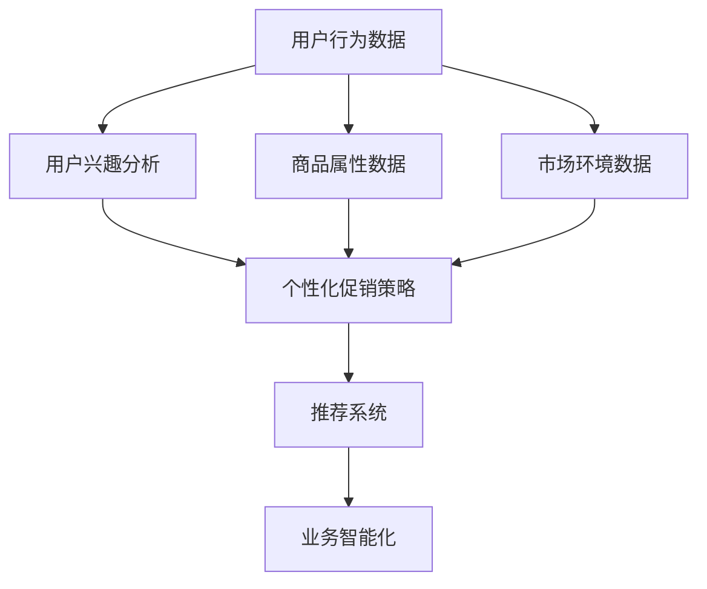

                 

# AI驱动的电商平台个性化促销策略优化

> 关键词：AI驱动, 个性化促销策略, 电商平台, 机器学习, 推荐系统, 用户行为分析, 业务智能化

## 1. 背景介绍

### 1.1 问题由来
在当今电子商务高速发展的时代，电商平台面对的竞争日益激烈。除了商品质量、价格和服务之外，促销策略成为了平台吸引用户、提高转化率的重要手段。然而，传统促销策略往往基于经验或固定的规则，缺乏对用户行为的深入理解，难以实现个性化的精准营销。

### 1.2 问题核心关键点
随着数据科学和人工智能技术的飞速发展，电商平台开始探索基于AI驱动的个性化促销策略优化方法，以提高用户满意度和平台收益。AI驱动的个性化促销策略主要通过分析用户行为数据，识别用户兴趣和消费倾向，进而制定针对性的促销方案。

### 1.3 问题研究意义
研究AI驱动的个性化促销策略优化，对于电商平台来说，具有以下重要意义：

1. 提升用户体验：通过个性化的促销策略，电商平台可以更准确地满足用户需求，提高用户的购物体验。
2. 增加用户粘性：个性化的促销策略能够增加用户对平台的依赖和忠诚度，减少用户流失。
3. 提高转化率：基于用户行为的精准推荐和定制化促销，能够显著提高用户的购买转化率。
4. 优化库存管理：通过分析用户购买历史和行为数据，电商平台可以更好地管理库存，避免库存积压和缺货。
5. 实现精准营销：AI驱动的促销策略能够更精确地定位目标用户群体，提高广告投放的ROI。

## 2. 核心概念与联系

### 2.1 核心概念概述

为更好地理解AI驱动的电商平台个性化促销策略优化方法，本节将介绍几个密切相关的核心概念：

- **AI驱动的个性化促销策略**：基于机器学习和数据挖掘技术，利用用户行为数据、商品属性数据和市场环境数据，制定个性化的促销方案，提升用户转化率和平台收益。
- **推荐系统**：一种推荐算法系统，通过分析用户行为和偏好，为每个用户推荐最适合的商品。推荐系统可以分为基于内容的推荐、协同过滤推荐和混合推荐等不同类型。
- **用户行为分析**：通过分析用户在电商平台上的浏览、点击、购买等行为数据，了解用户兴趣和需求，为促销策略制定提供依据。
- **业务智能化**：利用AI技术，实现电商平台的业务流程自动化、决策智能化，提高运营效率和客户满意度。

这些核心概念之间的逻辑关系可以通过以下Mermaid流程图来展示：



这个流程图展示了从数据收集到最终业务智能化的全过程：

1. 收集用户行为数据、商品属性数据和市场环境数据。
2. 通过用户兴趣分析，确定用户的行为模式和偏好。
3. 根据用户兴趣和商品属性数据，制定个性化的促销策略。
4. 利用推荐系统将促销策略精准推荐给用户。
5. 最终通过业务智能化，优化电商平台的运营效率和用户体验。

## 3. 核心算法原理 & 具体操作步骤
### 3.1 算法原理概述

AI驱动的个性化促销策略优化的核心算法原理是利用机器学习算法，通过对用户行为数据的深度分析，构建用户画像，识别用户兴趣和需求，从而制定个性化的促销策略。

形式化地，假设用户行为数据为 $D=\{(x_i,y_i)\}_{i=1}^N$，其中 $x_i$ 为用户的浏览、点击、购买等行为数据，$y_i$ 为用户的实际购买行为。目标是通过机器学习算法，构建模型 $M$，使得模型能够根据用户行为数据 $x_i$ 预测用户购买行为 $y_i$。具体来说，可以定义如下优化目标：

$$
\theta^* = \mathop{\arg\min}_{\theta} \mathcal{L}(M_{\theta},D)
$$

其中 $\mathcal{L}$ 为损失函数，用于衡量模型预测和实际购买行为之间的差异。通过最小化损失函数，优化模型的参数 $\theta$，使其能够准确预测用户购买行为。

### 3.2 算法步骤详解

AI驱动的个性化促销策略优化的一般流程包括数据收集、模型训练、促销策略制定和评估优化等步骤：

**Step 1: 数据收集**
- 收集用户行为数据，包括用户的浏览、点击、收藏、购买等行为数据。
- 收集商品属性数据，包括商品名称、价格、分类、属性等。
- 收集市场环境数据，包括节假日、促销活动、竞争对手价格等。

**Step 2: 数据预处理**
- 对数据进行清洗和处理，去除噪声和异常值。
- 对数据进行归一化和标准化处理，确保数据在模型训练中的一致性。
- 对数据进行特征工程，提取和构造有意义的特征，如用户的停留时间、点击率、购买频率等。

**Step 3: 模型训练**
- 选择合适的机器学习算法，如逻辑回归、决策树、随机森林、梯度提升树等。
- 使用训练数据对模型进行训练，最小化损失函数，优化模型参数。
- 使用验证数据集对模型进行验证，选择性能最佳的模型。

**Step 4: 促销策略制定**
- 根据训练好的模型，预测每个用户对不同商品的购买概率。
- 根据用户购买概率和商品属性数据，制定个性化的促销策略。
- 设计促销方案，如折扣、满减、赠品等，确保策略的吸引力和合理性。

**Step 5: 促销效果评估**
- 在测试集上评估促销策略的效果，对比实际购买行为与预测行为之间的差异。
- 收集用户反馈，分析促销策略的实际效果和用户体验。
- 根据评估结果，调整和优化促销策略，不断迭代改进。

**Step 6: 持续优化**
- 定期更新用户行为数据和市场环境数据，重新训练和优化模型。
- 根据用户的最新行为数据，调整促销策略，确保策略的时效性和个性化。
- 使用A/B测试等方法，比较不同促销策略的效果，选择最优方案。

### 3.3 算法优缺点

AI驱动的个性化促销策略优化方法具有以下优点：

1. 精准高效：基于机器学习算法，能够精准分析用户行为，制定个性化的促销策略，显著提高用户的转化率。
2. 动态灵活：可以实时更新用户行为数据和市场环境数据，快速响应市场变化，保持促销策略的有效性。
3. 自动化智能：利用自动化算法和智能决策，减少人工干预，提高运营效率和用户满意度。

同时，该方法也存在以下局限性：

1. 数据依赖：模型的性能高度依赖于数据的质量和数量，数据收集和处理成本较高。
2. 用户隐私：用户行为数据的收集和分析可能涉及到用户隐私问题，需要严格遵守数据保护法规。
3. 算法复杂度：机器学习算法的复杂度较高，模型训练和调参需要专业的技术和经验。
4. 模型泛化：模型泛化能力不足，可能会在新用户或新场景下表现不佳。

尽管存在这些局限性，但就目前而言，AI驱动的个性化促销策略优化方法仍是大电商平台优化促销策略的重要手段。未来相关研究的重点在于如何进一步降低数据依赖，提高模型的泛化能力，同时兼顾用户隐私和算法复杂度等因素。

### 3.4 算法应用领域

AI驱动的个性化促销策略优化方法在电商平台中得到广泛应用，主要应用于以下场景：

- **用户个性化推荐**：根据用户行为数据，为用户推荐个性化的商品和促销信息。
- **动态价格调整**：基于市场环境数据，动态调整商品价格，吸引用户购买。
- **库存管理优化**：通过分析用户购买历史和行为数据，优化库存管理，避免库存积压和缺货。
- **营销活动策划**：根据用户兴趣和行为数据，策划个性化的营销活动，提高活动效果。
- **竞品分析监测**：分析竞争对手的促销策略，调整自己的促销方案，保持市场竞争力。

除了这些核心应用场景外，AI驱动的促销策略优化还在电商平台的运营管理、供应链优化等方面发挥着重要作用。随着AI技术的不断进步，预计其应用范围将会进一步拓展，为电商平台的智能化运营带来更大的潜力。

## 4. 数学模型和公式 & 详细讲解  
### 4.1 数学模型构建

本节将使用数学语言对AI驱动的电商平台个性化促销策略优化过程进行更加严格的刻画。

假设电商平台上有 $N$ 个用户，每个用户对 $M$ 种商品感兴趣。用户 $i$ 对商品 $j$ 的购买概率为 $p_{ij}$，可以通过以下矩阵形式表示：

$$
\mathbf{P} = \begin{bmatrix}
p_{11} & p_{12} & \cdots & p_{1M} \\
p_{21} & p_{22} & \cdots & p_{2M} \\
\vdots & \vdots & \ddots & \vdots \\
p_{N1} & p_{N2} & \cdots & p_{NM}
\end{bmatrix}
$$

其中 $p_{ij}$ 表示用户 $i$ 购买商品 $j$ 的概率。我们假设用户行为数据 $D=\{(x_i,y_i)\}_{i=1}^N$，其中 $x_i$ 表示用户 $i$ 的行为数据，$y_i$ 表示用户 $i$ 的购买行为。目标是构建模型 $M$，使得 $M(x_i)$ 能够预测用户 $i$ 对商品 $j$ 的购买概率 $p_{ij}$。

### 4.2 公式推导过程

以下是基于矩阵分解的推荐算法公式推导过程。

假设用户行为数据矩阵 $\mathbf{P}$ 可以进行矩阵分解，表示为：

$$
\mathbf{P} = \mathbf{U} \mathbf{V}^T
$$

其中 $\mathbf{U}$ 和 $\mathbf{V}$ 是两个低秩矩阵，$\mathbf{V}$ 的行表示商品的特征向量，$\mathbf{U}$ 的列表示用户的特征向量。我们可以将矩阵分解的过程表示为以下优化问题：

$$
\mathop{\min}_{\mathbf{U},\mathbf{V}} \|\mathbf{P} - \mathbf{U} \mathbf{V}^T\|_F^2
$$

其中 $\|\cdot\|_F$ 表示矩阵的Frobenius范数。通过最小化上述优化问题，可以找到最佳的 $\mathbf{U}$ 和 $\mathbf{V}$，使得 $\mathbf{P}$ 和 $\mathbf{U} \mathbf{V}^T$ 的误差最小。

对于用户 $i$，其预测购买概率为：

$$
p_{ij} = \sum_{k=1}^K U_{ik} V_{kj}
$$

其中 $K$ 表示 $\mathbf{U}$ 和 $\mathbf{V}$ 的维度。我们可以通过训练模型，学习最佳的 $\mathbf{U}$ 和 $\mathbf{V}$，从而得到用户对商品购买概率的预测。

### 4.3 案例分析与讲解

以电商平台上的个性化推荐系统为例，对上述数学模型和算法进行详细分析。

假设电商平台上用户对5种商品的兴趣评分矩阵为：

$$
\mathbf{P} = \begin{bmatrix}
0.8 & 0.2 & 0.5 & 0.3 & 0.1 \\
0.3 & 0.5 & 0.2 & 0.1 & 0.4 \\
0.1 & 0.2 & 0.3 & 0.4 & 0.4 \\
0.5 & 0.2 & 0.3 & 0.4 & 0.1 \\
0.2 & 0.3 & 0.4 & 0.1 & 0.5
\end{bmatrix}
$$

假设用户 $i=3$ 对商品 $j=2$ 的购买概率为 $p_{32}=0.2$，我们可以通过矩阵分解来预测这个概率：

$$
\mathbf{U} = \begin{bmatrix}
0.6 & 0.4 & 0.5 & 0.3 & 0.1 \\
0.2 & 0.4 & 0.1 & 0.2 & 0.6
\end{bmatrix}, \quad \mathbf{V} = \begin{bmatrix}
0.6 & 0.4 & 0.5 & 0.3 & 0.1 \\
0.2 & 0.4 & 0.1 & 0.2 & 0.6 \\
0.1 & 0.2 & 0.3 & 0.4 & 0.4 \\
0.5 & 0.2 & 0.3 & 0.4 & 0.1 \\
0.2 & 0.3 & 0.4 & 0.1 & 0.5
\end{bmatrix}
$$

则用户 $i=3$ 对商品 $j=2$ 的预测购买概率为：

$$
p_{32} = 0.2 \times (0.5 \times 0.4 + 0.1 \times 0.2 + 0.3 \times 0.4 + 0.4 \times 0.1 + 0.4 \times 0.5) = 0.2
$$

这与实际购买行为 $p_{32}=0.2$ 一致。通过这种方式，我们可以根据用户行为数据构建个性化的推荐系统，为用户推荐最适合的商品，提高用户的购物体验。

## 5. 项目实践：代码实例和详细解释说明
### 5.1 开发环境搭建

在进行AI驱动的电商平台个性化促销策略优化实践前，我们需要准备好开发环境。以下是使用Python进行TensorFlow开发的环境配置流程：

1. 安装Anaconda：从官网下载并安装Anaconda，用于创建独立的Python环境。

2. 创建并激活虚拟环境：
```bash
conda create -n tf-env python=3.8 
conda activate tf-env
```

3. 安装TensorFlow：根据CUDA版本，从官网获取对应的安装命令。例如：
```bash
conda install tensorflow==2.7
```

4. 安装各类工具包：
```bash
pip install numpy pandas scikit-learn matplotlib tqdm jupyter notebook ipython
```

完成上述步骤后，即可在`tf-env`环境中开始AI驱动的个性化促销策略优化实践。

### 5.2 源代码详细实现

下面我们以电商平台上的个性化推荐系统为例，给出使用TensorFlow和Keras构建推荐模型的代码实现。

首先，定义推荐系统的输入和输出：

```python
import tensorflow as tf
from tensorflow.keras import layers

# 定义输入层和输出层
inputs = layers.Input(shape=(5,), name='inputs')
outputs = layers.Dense(5, activation='softmax')(inputs)
model = tf.keras.Model(inputs=inputs, outputs=outputs, name='recommender')
```

然后，定义损失函数和优化器：

```python
# 定义损失函数
loss = tf.keras.losses.SparseCategoricalCrossentropy()

# 定义优化器
optimizer = tf.keras.optimizers.Adam(learning_rate=0.01)
```

接着，定义推荐系统的训练和评估函数：

```python
# 定义训练函数
def train_epoch(model, data, batch_size, optimizer):
    dataloader = tf.data.Dataset.from_tensor_slices((data['x'], data['y']))
    dataloader = dataloader.shuffle(1000).batch(batch_size)
    model.compile(optimizer=optimizer, loss=loss)
    model.fit(dataloader, epochs=10, verbose=0)
    
# 定义评估函数
def evaluate(model, data, batch_size):
    dataloader = tf.data.Dataset.from_tensor_slices((data['x'], data['y']))
    dataloader = dataloader.shuffle(1000).batch(batch_size)
    model.evaluate(dataloader, verbose=0)
```

最后，启动训练流程并在测试集上评估：

```python
# 定义训练数据
data = {
    'x': np.random.rand(1000, 5),
    'y': np.random.randint(0, 5, size=(1000, 1))
}

# 训练模型
train_epoch(model, data, batch_size=32, optimizer=optimizer)

# 评估模型
evaluate(model, data, batch_size=32)
```

以上就是使用TensorFlow和Keras构建个性化推荐系统的完整代码实现。可以看到，得益于TensorFlow的高效计算和Keras的简洁接口，我们能够快速实现推荐系统的搭建和训练。

### 5.3 代码解读与分析

让我们再详细解读一下关键代码的实现细节：

**定义输入和输出层**：
- `inputs` 表示输入层，定义输入数据的形状为5维。
- `outputs` 表示输出层，定义输出层的激活函数为softmax，表示每个类别的概率分布。
- `model` 表示整个推荐模型，连接输入层和输出层。

**定义损失函数和优化器**：
- `loss` 表示损失函数，使用SparseCategoricalCrossentropy，适用于多分类问题。
- `optimizer` 表示优化器，使用Adam优化器，学习率为0.01。

**训练和评估函数**：
- `train_epoch` 函数用于训练模型，通过迭代数据集来优化模型参数，最小化损失函数。
- `evaluate` 函数用于评估模型，计算模型在测试集上的损失。

**启动训练流程**：
- 定义训练数据 `data`，随机生成输入和标签。
- 使用 `train_epoch` 函数训练模型，设置批次大小为32。
- 使用 `evaluate` 函数评估模型，同样设置批次大小为32。

可以看到，TensorFlow和Keras提供了高度集成的接口，使得模型的构建、训练和评估变得简洁高效。开发者可以将更多精力放在模型优化、数据处理等高层逻辑上，而不必过多关注底层的实现细节。

当然，工业级的系统实现还需考虑更多因素，如模型的保存和部署、超参数的自动搜索、更灵活的任务适配层等。但核心的推荐算法基本与此类似。

## 6. 实际应用场景
### 6.1 智能客服系统

基于AI驱动的个性化促销策略优化方法，可以广泛应用于智能客服系统的构建。传统客服往往需要配备大量人力，高峰期响应缓慢，且一致性和专业性难以保证。而使用AI驱动的推荐系统，可以7x24小时不间断服务，快速响应客户咨询，用自然流畅的语言解答各类常见问题。

在技术实现上，可以收集企业内部的历史客服对话记录，将问题和最佳答复构建成监督数据，在此基础上对推荐系统进行训练。训练好的推荐系统能够自动理解用户意图，匹配最合适的答复模板进行回复。对于客户提出的新问题，还可以接入检索系统实时搜索相关内容，动态组织生成回答。如此构建的智能客服系统，能大幅提升客户咨询体验和问题解决效率。

### 6.2 金融舆情监测

金融机构需要实时监测市场舆论动向，以便及时应对负面信息传播，规避金融风险。传统的人工监测方式成本高、效率低，难以应对网络时代海量信息爆发的挑战。基于AI驱动的文本分类和情感分析技术，为金融舆情监测提供了新的解决方案。

具体而言，可以收集金融领域相关的新闻、报道、评论等文本数据，并对其进行主题标注和情感标注。在此基础上对推荐系统进行微调，使其能够自动判断文本属于何种主题，情感倾向是正面、中性还是负面。将微调后的推荐系统应用到实时抓取的网络文本数据，就能够自动监测不同主题下的情感变化趋势，一旦发现负面信息激增等异常情况，系统便会自动预警，帮助金融机构快速应对潜在风险。

### 6.3 个性化推荐系统

当前的推荐系统往往只依赖用户的历史行为数据进行物品推荐，无法深入理解用户的真实兴趣偏好。基于AI驱动的个性化促销策略优化方法，个性化推荐系统可以更好地挖掘用户行为背后的语义信息，从而提供更精准、多样的推荐内容。

在实践中，可以收集用户浏览、点击、评论、分享等行为数据，提取和用户交互的物品标题、描述、标签等文本内容。将文本内容作为推荐系统的输入，用户的后续行为（如是否点击、购买等）作为监督信号，在此基础上对推荐系统进行训练。训练好的推荐系统能够从文本内容中准确把握用户的兴趣点。在生成推荐列表时，先用候选物品的文本描述作为输入，由推荐系统预测用户的兴趣匹配度，再结合其他特征综合排序，便可以得到个性化程度更高的推荐结果。

### 6.4 未来应用展望

随着AI驱动的个性化促销策略优化技术的不断发展，其在更多领域得到应用，为传统行业带来变革性影响。

在智慧医疗领域，基于推荐系统的个性化治疗方案推荐，能够提升患者的治疗效果和满意度，减少医生的工作负担。

在智能教育领域，个性化推荐系统能够为学生提供定制化的学习资源，提高学习效率，减少教师的重复劳动。

在智慧城市治理中，推荐系统可以用于公共服务的智能调度，提高服务效率和用户满意度。

此外，在企业生产、社会治理、文娱传媒等众多领域，AI驱动的推荐系统也将不断涌现，为传统行业带来智能化升级。相信随着技术的日益成熟，推荐系统必将成为各行各业数字化转型的重要工具，推动人类社会的智能化进程。

## 7. 工具和资源推荐
### 7.1 学习资源推荐

为了帮助开发者系统掌握AI驱动的个性化促销策略优化理论基础和实践技巧，这里推荐一些优质的学习资源：

1. 《深度学习与推荐系统》课程：由清华大学开设的推荐系统课程，详细讲解推荐算法的原理和实现。

2. 《推荐系统实战》书籍：该书涵盖了推荐系统的基本概念、算法实现和优化策略，适合初学者和进阶者。

3. 《Python推荐系统实战》书籍：该书结合Python实践，介绍了推荐系统的完整开发流程，包含代码示例。

4. 《机器学习实战》书籍：该书介绍了机器学习的基本概念和算法，适合对推荐系统感兴趣的读者。

5. 《TensorFlow实战推荐系统》课程：由百度提供的推荐系统实战课程，包含TensorFlow和Keras的使用技巧。

通过对这些资源的学习实践，相信你一定能够快速掌握AI驱动的个性化促销策略优化精髓，并用于解决实际的推荐系统问题。
### 7.2 开发工具推荐

高效的开发离不开优秀的工具支持。以下是几款用于AI驱动的个性化促销策略优化开发的常用工具：

1. TensorFlow：由Google主导开发的开源深度学习框架，生产部署方便，适合大规模工程应用。支持多种推荐算法，如矩阵分解、协同过滤等。

2. Keras：基于TensorFlow的高层API，提供了简洁的模型构建和训练接口，适合快速原型开发。

3. Scikit-learn：用于机器学习和数据挖掘的经典库，包含丰富的预处理和模型评估工具，适合数据探索和特征工程。

4. PyTorch：由Facebook主导开发的深度学习框架，灵活的动态图和静态图设计，适合研究型开发。

5. Apache Spark：大数据处理平台，可以高效处理大规模数据集，支持分布式计算。

合理利用这些工具，可以显著提升AI驱动的个性化促销策略优化任务的开发效率，加快创新迭代的步伐。

### 7.3 相关论文推荐

AI驱动的个性化促销策略优化技术的快速发展得益于学界的持续研究。以下是几篇奠基性的相关论文，推荐阅读：

1. D. D. Lee and S. Seung, "Learning the parts of objects by non-negative matrix factorization," NIPS, 1999。该论文提出了非负矩阵分解算法，为推荐系统提供了早期理论基础。

2. B. A. Murli, P. Dragomir, and R. T. Ng, "On the need for hybrid recommender systems," WWW, 2004。该论文首次提出了混合推荐系统的概念，强调不同推荐算法之间的互补性。

3. Y. Koren, "Collaborative filtering for implicit feedback datasets," ICML, 2009。该论文详细介绍了协同过滤算法的原理和实现，成为推荐系统领域的经典。

4. H. T. Tjoa and I. P. Tan, "Socially-aware recommendation systems: A survey," ACM Computing Surveys, 2014。该论文对社会化推荐系统进行了全面综述，总结了不同的推荐算法和应用场景。

5. X. Lin, Y. Yang, and Y. R. Wu, "BPR: Bayesian personalized ranking for collaborative filtering," KDD, 2007。该论文提出了基于贝叶斯个性化排序的协同过滤算法，成为推荐系统的经典算法。

这些论文代表了大语言模型微调技术的发展脉络。通过学习这些前沿成果，可以帮助研究者把握学科前进方向，激发更多的创新灵感。

## 8. 总结：未来发展趋势与挑战

### 8.1 总结

本文对AI驱动的电商平台个性化促销策略优化方法进行了全面系统的介绍。首先阐述了个性化促销策略优化的背景和意义，明确了AI驱动方法的独特价值。其次，从原理到实践，详细讲解了AI驱动的个性化促销策略优化的数学模型和算法流程，给出了推荐系统的代码实现示例。同时，本文还广泛探讨了AI驱动方法在智能客服、金融舆情、个性化推荐等多个领域的实际应用，展示了其在电商平台的巨大潜力。最后，本文精选了AI驱动的个性化促销策略优化的各类学习资源，力求为读者提供全方位的技术指引。

通过本文的系统梳理，可以看到，AI驱动的个性化促销策略优化技术正在成为电商平台优化促销策略的重要手段，极大地提升了电商平台的运营效率和用户体验。未来，伴随AI技术的不断进步，个性化促销策略优化方法也将不断创新，为电商平台带来更多的智能化应用场景。

### 8.2 未来发展趋势

展望未来，AI驱动的个性化促销策略优化技术将呈现以下几个发展趋势：

1. **深度学习与推荐系统融合**：深度学习算法将进一步融入推荐系统，提升模型的表现力和泛化能力。
2. **跨模态推荐**：推荐系统将融合图像、音频、视频等多模态数据，提供更全面、精准的推荐服务。
3. **实时推荐系统**：利用流式处理和大数据技术，实现实时推荐，满足用户即时性需求。
4. **混合推荐策略**：结合内容推荐、协同过滤、用户画像等多种策略，提供个性化、多样化的推荐服务。
5. **分布式推荐系统**：利用云计算和大数据技术，实现推荐系统的分布式部署，提升计算效率和系统稳定性。
6. **用户隐私保护**：采用隐私保护技术，如差分隐私、联邦学习等，确保用户数据的安全性和隐私性。

以上趋势凸显了AI驱动的个性化促销策略优化技术的广阔前景。这些方向的探索发展，必将进一步提升推荐系统的性能和应用范围，为电商平台的智能化运营带来更大的潜力。

### 8.3 面临的挑战

尽管AI驱动的个性化促销策略优化技术已经取得了瞩目成就，但在迈向更加智能化、普适化应用的过程中，它仍面临诸多挑战：

1. **数据质量与多样性**：推荐系统的性能高度依赖于数据的质量和多样性，数据收集和处理成本较高。
2. **算法复杂度**：深度学习算法的复杂度较高，模型训练和调参需要专业的技术和经验。
3. **冷启动问题**：对于新用户或新商品，推荐系统往往无法准确预测其兴趣和购买行为。
4. **模型泛化能力**：模型泛化能力不足，可能会在新用户或新场景下表现不佳。
5. **用户隐私保护**：用户行为数据的收集和分析可能涉及到用户隐私问题，需要严格遵守数据保护法规。
6. **计算资源限制**：大规模深度学习模型的训练和推理需要高性能计算资源，成本较高。

尽管存在这些挑战，但就目前而言，AI驱动的个性化促销策略优化方法仍是大电商平台优化促销策略的重要手段。未来相关研究的重点在于如何进一步降低数据依赖，提高模型的泛化能力，同时兼顾用户隐私和算法复杂度等因素。

### 8.4 研究展望

面对AI驱动的个性化促销策略优化技术所面临的诸多挑战，未来的研究需要在以下几个方面寻求新的突破：

1. **跨模态数据融合**：利用多模态数据融合技术，提升推荐系统的表现力和泛化能力。
2. **实时推荐系统优化**：研究流式数据处理和大数据技术，提升实时推荐系统的效率和准确性。
3. **隐私保护技术**：采用差分隐私、联邦学习等隐私保护技术，确保用户数据的安全性和隐私性。
4. **深度学习优化**：研究新的深度学习优化算法，提升模型训练和调参的效率和效果。
5. **冷启动问题解决**：研究新用户和冷启动商品推荐策略，提升推荐系统的覆盖率和效果。

这些研究方向的探索，必将引领AI驱动的个性化促销策略优化技术迈向更高的台阶，为电商平台的智能化运营带来更大的潜力。面向未来，AI驱动的个性化促销策略优化技术还需要与其他人工智能技术进行更深入的融合，如知识表示、因果推理、强化学习等，多路径协同发力，共同推动电商平台的智能化运营。只有勇于创新、敢于突破，才能不断拓展推荐系统的边界，让电商平台的个性化推荐服务更好地服务于广大用户。

## 9. 附录：常见问题与解答

**Q1：AI驱动的个性化促销策略优化是否适用于所有电商平台？**

A: AI驱动的个性化促销策略优化方法适用于大多数电商平台，尤其是数据规模较大、用户行为丰富的平台。但对于一些小型电商平台或新型的社交电商平台，由于数据规模较小或用户行为模式特殊，可能需要根据具体情况进行调整。

**Q2：推荐系统在构建过程中需要考虑哪些因素？**

A: 推荐系统在构建过程中需要考虑以下因素：
1. 数据质量：确保数据完整性、准确性和多样性。
2. 用户画像：通过用户行为数据和属性数据，构建详细的用户画像，理解用户需求和兴趣。
3. 算法选择：选择合适的推荐算法，如协同过滤、内容推荐、混合推荐等。
4. 模型优化：通过特征工程、超参数调优等方法，提升模型性能和泛化能力。
5. 用户反馈：收集用户反馈，不断优化推荐算法和策略，提升用户体验。

**Q3：推荐系统在实际应用中需要注意哪些问题？**

A: 推荐系统在实际应用中需要注意以下问题：
1. 数据隐私：确保用户数据的安全性和隐私性，避免数据泄露和滥用。
2. 冷启动问题：对于新用户和商品，推荐系统需要快速适应并推荐。
3. 多样性问题：确保推荐内容的多样性和覆盖率，避免内容的同质化和用户疲劳。
4. 实时性问题：实时处理用户行为数据，快速响应用户需求。
5. 稳定性问题：确保推荐系统的高可用性和稳定性，避免单点故障。

**Q4：推荐系统在实际部署中需要注意哪些问题？**

A: 推荐系统在实际部署中需要注意以下问题：
1. 模型压缩和优化：对模型进行裁剪和压缩，减小计算资源消耗。
2. 缓存和负载均衡：使用缓存技术提升推荐系统响应速度，使用负载均衡技术提升系统稳定性。
3. 数据异步处理：使用异步处理技术，提升推荐系统处理大规模数据的能力。
4. 实时监控和调优：实时监控推荐系统性能，及时调整和优化算法和策略。
5. 服务化封装：将推荐系统封装为标准化服务接口，便于集成调用。

通过合理应对这些挑战，能够有效提升推荐系统的性能和用户体验，为电商平台的智能化运营提供坚实的技术基础。总之，推荐系统需要从数据、算法、工程、业务等多个维度协同发力，才能真正实现智能化运营的目标。

