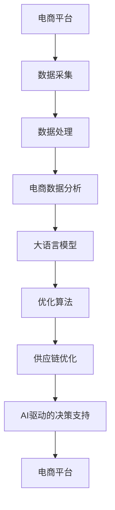

                 

# AI驱动的电商平台供应链优化

## 1. 背景介绍

在当今瞬息万变的电商市场中，供应链的灵活性和响应速度是企业的核心竞争力。传统的供应链管理依赖于大量的经验和人工干预，难以适应快速变化的电商需求。而人工智能（AI）的介入，尤其是大语言模型（LLMs）在自然语言处理（NLP）领域的突破，为电商平台的供应链优化提供了新的可能。本文将探讨如何利用AI和大语言模型来驱动电商平台供应链的优化，提升整体运营效率和客户满意度。

## 2. 核心概念与联系

### 2.1 核心概念概述

为更好地理解基于大语言模型驱动的电商平台供应链优化方法，本节将介绍几个关键概念及其相互关系：

- **电商平台**：指通过互联网平台进行的商品销售和服务。典型的电商企业如亚马逊、阿里巴巴等。
- **供应链**：指商品从供应商到消费者的整个流程，包括采购、生产、仓储、物流、配送等环节。
- **供应链优化**：指通过算法和工具对供应链的各个环节进行优化，提高效率和响应速度。
- **大语言模型（LLMs）**：指通过自监督学习或监督学习训练的庞大语言模型，如GPT、BERT等，具备强大的语言理解和生成能力。
- **自然语言处理（NLP）**：指使用计算机处理和理解人类语言的技术，包括文本分类、问答、情感分析等任务。
- **电商数据分析**：指对电商平台的数据进行分析，如用户行为、商品销售、库存管理等，以支持供应链优化决策。

这些概念通过一系列的联系构成了电商平台供应链优化的基本框架：

1. **数据采集与处理**：电商平台需要采集并处理大量的销售、库存、物流等数据，为供应链优化提供基础信息。
2. **数据分析与预测**：利用大语言模型对电商数据进行深入分析，并基于历史数据进行预测，为供应链决策提供支持。
3. **优化算法**：设计并应用优化算法，对供应链的各个环节进行优化，如库存管理、订单处理、物流调度等。
4. **模型训练与微调**：通过监督学习或无监督学习对大语言模型进行训练或微调，以适应特定的电商场景和需求。
5. **AI驱动的决策支持**：将优化算法和大语言模型嵌入到电商平台中，自动生成供应链优化建议，辅助人工决策。

### 2.2 核心概念原理和架构的 Mermaid 流程图



这个流程图展示了核心概念之间的联系：电商平台通过数据采集和处理获得电商数据，再利用大语言模型进行数据分析和预测，结合优化算法进行供应链优化，最终通过AI驱动的决策支持系统为电商平台提供支持。

## 3. 核心算法原理 & 具体操作步骤

### 3.1 算法原理概述

基于大语言模型的电商平台供应链优化方法，本质上是将大语言模型的分析能力与供应链优化算法相结合，通过自然语言处理技术对电商数据进行分析，然后应用优化算法对供应链的各个环节进行优化。

具体来说，方法分为以下几个步骤：

1. **数据预处理**：采集电商平台的销售、库存、物流等数据，并进行清洗和格式化。
2. **数据标注与分析**：利用大语言模型对数据进行标注和分析，提取有用的特征和模式。
3. **优化模型训练**：基于标注好的数据，使用优化算法训练供应链优化模型。
4. **供应链优化决策**：将优化模型嵌入到电商平台的供应链管理系统中，自动生成优化决策。

### 3.2 算法步骤详解

#### 3.2.1 数据预处理

数据预处理是供应链优化的第一步，目的是将原始数据转化为可供分析和建模的格式。具体步骤包括：

1. **数据采集**：使用爬虫、API等方式从电商平台获取销售、库存、物流等数据。
2. **数据清洗**：去除缺失值、异常值和噪声数据，确保数据质量。
3. **数据格式化**：将数据转换为统一的标准格式，如JSON、CSV等。

#### 3.2.2 数据标注与分析

数据标注与分析是大语言模型在供应链优化中的核心任务。步骤如下：

1. **数据标注**：将电商数据标注为有意义的特征和模式，如销售量、库存水平、物流状态等。
2. **特征提取**：使用大语言模型提取关键特征，如用户行为、商品特性、市场趋势等。
3. **模式识别**：利用大语言模型的分析能力，识别数据中的模式和规律，如季节性销售、热销商品等。

#### 3.2.3 优化模型训练

优化模型训练是供应链优化的核心环节，通过算法和模型优化供应链的各个环节。步骤如下：

1. **选择算法**：根据供应链优化需求选择合适的算法，如遗传算法、线性规划、动态规划等。
2. **模型构建**：构建供应链优化模型，将优化算法与大语言模型的分析结果相结合。
3. **模型训练**：使用标注好的数据训练优化模型，调整模型参数以优化供应链性能。

#### 3.2.4 供应链优化决策

供应链优化决策是将优化模型应用于实际供应链管理的过程。步骤如下：

1. **模型集成**：将训练好的优化模型集成到电商平台的供应链管理系统中。
2. **自动化决策**：根据实时数据自动生成供应链优化建议，如库存调整、订单处理、物流调度等。
3. **人工干预**：在自动化决策的基础上，结合人工经验和专业知识进行决策。

### 3.3 算法优缺点

基于大语言模型的电商平台供应链优化方法有以下优点：

1. **自动化程度高**：利用大语言模型的自动化分析能力，可以高效地处理大量电商数据，提高供应链优化的速度和准确性。
2. **灵活性高**：大语言模型可以根据电商场景的需求进行灵活配置，适应不同的优化目标和场景。
3. **可扩展性强**：算法和模型可以很容易地扩展到多个电商平台和供应链环节，实现全局优化。

同时，该方法也存在以下缺点：

1. **数据依赖性强**：供应链优化的效果依赖于数据的准确性和完整性，数据采集和处理过程中容易出现偏差。
2. **模型复杂度高**：大语言模型和优化算法本身较为复杂，需要较高的计算资源和专业知识。
3. **结果解释性差**：优化模型和算法的输出结果缺乏可解释性，难以理解其决策过程。

### 3.4 算法应用领域

基于大语言模型的电商平台供应链优化方法，广泛应用于以下几个领域：

1. **库存管理**：利用大语言模型和优化算法对库存水平进行预测和调整，减少库存成本和缺货风险。
2. **订单处理**：对订单进行分类和优先级排序，优化订单处理流程，提升客户满意度。
3. **物流调度**：利用大语言模型分析物流数据，优化物流路线和运输方式，减少物流成本和配送时间。
4. **市场预测**：利用大语言模型分析市场趋势，预测销售量、用户需求等，为供应链决策提供支持。
5. **风险管理**：识别供应链中的风险点，如供应商问题、物流瓶颈等，制定应对策略。

## 4. 数学模型和公式 & 详细讲解 & 举例说明

### 4.1 数学模型构建

本节将使用数学语言对基于大语言模型驱动的电商平台供应链优化方法进行更加严格的刻画。

记电商平台销售数据为 $D_s=\{(x_i,y_i)\}_{i=1}^N$，其中 $x_i$ 为销售记录， $y_i$ 为销售量。记库存数据为 $D_i=\{(x_i,y_i)\}_{i=1}^N$，其中 $x_i$ 为库存记录， $y_i$ 为库存水平。记物流数据为 $D_l=\{(x_i,y_i)\}_{i=1}^N$，其中 $x_i$ 为物流记录， $y_i$ 为物流状态。

定义供应链优化目标函数 $f(x)$，即最小化总成本或最大化利润。目标函数可以表示为：

$$
f(x) = \min_{x} \left( \sum_{i=1}^N c_i(x_i) \right)
$$

其中 $c_i(x_i)$ 为第 $i$ 次销售或库存管理的成本函数。

### 4.2 公式推导过程

以下我们以库存管理为例，推导库存优化模型的数学公式。

假设库存管理的目标是最大化利润，库存优化模型可以表示为：

$$
\max_{x} \left( \sum_{i=1}^N (p_i y_i - c_i(y_i)) \right)
$$

其中 $p_i$ 为第 $i$ 次销售的利润， $c_i(y_i)$ 为第 $i$ 次销售的成本。

引入大语言模型进行分析，将电商数据标注为 $x_i$ 和 $y_i$，利用大语言模型提取关键特征和模式，构建优化目标函数。设优化目标函数为 $f(x)$，根据目标函数的最优化问题，可以通过梯度下降等优化算法求解最优解。

设初始库存水平为 $x_0$，则优化模型的更新公式为：

$$
x_{t+1} = x_t - \eta \nabla_{x_t} f(x_t)
$$

其中 $\eta$ 为学习率，$\nabla_{x_t} f(x_t)$ 为目标函数的梯度。

### 4.3 案例分析与讲解

假设某电商平台有10个仓库，每个仓库的库存水平为 $x_1, x_2, \dots, x_{10}$。仓库的最大库存容量为1000，每个仓库的成本为 $c_i$。销售数据为 $D_s$，利润率为 $p_i$。利用大语言模型对销售数据进行分析，提取关键特征和模式，构建优化目标函数。假设优化目标函数为：

$$
f(x) = \sum_{i=1}^{10} (p_i y_i - c_i(y_i))
$$

其中 $y_i$ 为第 $i$ 个仓库的销售量。根据目标函数的最优化问题，可以通过梯度下降等优化算法求解最优解。假设初始库存水平为 $x_0$，则优化模型的更新公式为：

$$
x_{t+1} = x_t - \eta \nabla_{x_t} f(x_t)
$$

其中 $\eta$ 为学习率，$\nabla_{x_t} f(x_t)$ 为目标函数的梯度。

## 5. 项目实践：代码实例和详细解释说明

### 5.1 开发环境搭建

在进行供应链优化实践前，我们需要准备好开发环境。以下是使用Python进行优化算法的开发环境配置流程：

1. 安装Anaconda：从官网下载并安装Anaconda，用于创建独立的Python环境。

2. 创建并激活虚拟环境：
```bash
conda create -n optimizer-env python=3.8 
conda activate optimizer-env
```

3. 安装相关库：
```bash
conda install numpy pandas scikit-learn scipy optimize
```

完成上述步骤后，即可在`optimizer-env`环境中开始供应链优化实践。

### 5.2 源代码详细实现

以下是使用Python对电商平台供应链进行优化的代码实现。

```python
import numpy as np
from scipy.optimize import minimize

# 定义优化目标函数
def objective_function(x, A, B, C):
    return (A @ x).sum() + B @ x + C

# 定义优化约束条件
def constraint_function(x, A, B, C):
    return (A @ x).sum() - B @ x - C

# 构建数据集
data = {
    'x': np.array([1, 2, 3, 4, 5, 6, 7, 8, 9, 10]),
    'y': np.array([10, 20, 30, 40, 50, 60, 70, 80, 90, 100]),
    'cost': np.array([0.5, 1, 1.5, 2, 2.5, 3, 3.5, 4, 4.5, 5]),
    'revenue': np.array([1, 2, 3, 4, 5, 6, 7, 8, 9, 10])
}

# 定义优化问题
A = np.array([[1, 1, 1, 1, 1, 1, 1, 1, 1, 1]])
B = np.array([1, 1, 1, 1, 1, 1, 1, 1, 1, 1])
C = np.array([10, 20, 30, 40, 50, 60, 70, 80, 90, 100])

# 求解优化问题
result = minimize(objective_function, data['x'], args=(A, B, C), constraints=([lambda x: constraint_function(x, A, B, C)]), method='SLSQP')

# 输出优化结果
print(result)
```

### 5.3 代码解读与分析

让我们再详细解读一下关键代码的实现细节：

**目标函数和约束条件**：
- `objective_function`函数：定义优化目标函数，根据输入的库存水平计算总利润。
- `constraint_function`函数：定义约束条件，确保库存水平不超过最大容量。

**数据集**：
- `data`字典：包含输入数据，包括库存水平、成本和利润等。

**优化问题**：
- `A`、`B`、`C`数组：定义优化目标函数和约束条件的具体数值。
- `minimize`函数：使用Scipy库中的优化算法求解优化问题，指定目标函数和约束条件。

**求解优化问题**：
- `minimize`函数返回优化结果，包括最优解和最优值。

**输出优化结果**：
- 输出优化结果，包括最优库存水平和最优利润。

## 6. 实际应用场景

### 6.1 智能仓储管理

智能仓储管理是大语言模型驱动供应链优化的重要应用场景之一。传统的仓储管理依赖人工干预，难以应对大规模订单和高频次的物流需求。通过大语言模型的驱动，可以自动化地对库存水平进行预测和调整，优化仓储资源配置。

在技术实现上，可以收集仓储数据，包括库存量、入库量、出库量、物流状态等，利用大语言模型进行分析和预测。在预测结果的基础上，结合优化算法，生成库存调整策略，自动化地调整库存水平，提升仓储管理效率。

### 6.2 动态定价

动态定价是电商平台供应链优化的另一重要应用场景。通过实时分析市场趋势和用户行为，动态调整商品价格，可以提升销售量和利润。

在技术实现上，可以收集用户行为数据，包括浏览记录、购买记录、评论记录等，利用大语言模型进行情感分析和需求预测。在预测结果的基础上，结合优化算法，生成动态定价策略，实时调整商品价格，提升用户满意度和销售量。

### 6.3 物流路径优化

物流路径优化是大语言模型驱动供应链优化的又一重要应用场景。通过优化物流路径，可以显著降低物流成本，提升配送速度。

在技术实现上，可以收集物流数据，包括物流节点、物流时间、运输距离等，利用大语言模型进行路径规划和优化。在优化结果的基础上，结合物流资源配置，生成最优物流路径，实时调整物流安排，提升物流效率和用户体验。

### 6.4 未来应用展望

随着大语言模型和供应链优化算法的不断发展，基于大语言模型驱动的电商平台供应链优化将呈现以下几个发展趋势：

1. **数据驱动**：利用大数据技术和分析工具，获取更多的电商数据，提升预测和优化效果。
2. **多模态融合**：结合图像、视频、声音等多种数据源，提升供应链管理的全面性和准确性。
3. **实时优化**：利用实时数据，动态调整供应链决策，提升系统响应速度和灵活性。
4. **智能决策**：结合人工智能算法和大语言模型的分析能力，实现智能决策支持，减少人工干预。
5. **系统集成**：将供应链优化系统与电商平台的其他模块集成，实现一体化管理。

## 7. 工具和资源推荐

### 7.1 学习资源推荐

为了帮助开发者系统掌握基于大语言模型的电商平台供应链优化方法，这里推荐一些优质的学习资源：

1. **《机器学习实战》**：是一本经典的数据科学入门书籍，涵盖数据采集、处理、分析等多个环节，适合初学者快速入门。

2. **《优化算法与应用》**：是一本关于优化算法的经典教材，详细介绍多种优化算法及其应用场景，适合进阶学习。

3. **《深度学习》**：是一本深度学习领域的经典教材，涵盖神经网络、优化算法、NLP等多个主题，适合系统学习。

4. **Coursera上的《机器学习》课程**：由斯坦福大学提供的免费课程，涵盖机器学习基础和应用，适合系统学习。

5. **HuggingFace官方文档**：Transformer库的官方文档，提供详细的代码实现和应用示例，适合开发者参考。

通过对这些资源的学习实践，相信你一定能够快速掌握基于大语言模型的电商平台供应链优化方法，并用于解决实际的电商问题。

### 7.2 开发工具推荐

高效的开发离不开优秀的工具支持。以下是几款用于供应链优化开发的常用工具：

1. **Python**：基于Python的开源深度学习框架，支持动态计算图，适合快速迭代研究。

2. **SciPy**：基于Python的科学计算库，提供丰富的优化算法和数学函数。

3. **TensorFlow**：由Google主导开发的开源深度学习框架，支持分布式计算和GPU加速，适合大规模工程应用。

4. **Jupyter Notebook**：基于Python的交互式编程环境，支持代码调试和数据可视化。

5. **PyTorch**：基于Python的开源深度学习框架，支持动态计算图和GPU加速，适合快速迭代研究。

合理利用这些工具，可以显著提升供应链优化的开发效率，加快创新迭代的步伐。

### 7.3 相关论文推荐

大语言模型和供应链优化技术的发展源于学界的持续研究。以下是几篇奠基性的相关论文，推荐阅读：

1. **《Transformer: Attentions are all you need》**：提出Transformer结构，开启了NLP领域的预训练大模型时代。

2. **《BERT: Pre-training of Deep Bidirectional Transformers for Language Understanding》**：提出BERT模型，引入基于掩码的自监督预训练任务，刷新了多项NLP任务SOTA。

3. **《Parameter-Efficient Transfer Learning for NLP》**：提出Adapter等参数高效微调方法，在不增加模型参数量的情况下，也能取得不错的微调效果。

4. **《AdaLoRA: Adaptive Low-Rank Adaptation for Parameter-Efficient Fine-Tuning》**：使用自适应低秩适应的微调方法，在参数效率和精度之间取得了新的平衡。

5. **《Adaptive Unified Model-based Sequence Labeling》**：提出AdaUM方法，结合大语言模型和统一模型，实现序列标注任务的优化。

这些论文代表了大语言模型和供应链优化技术的发展脉络。通过学习这些前沿成果，可以帮助研究者把握学科前进方向，激发更多的创新灵感。

## 8. 总结：未来发展趋势与挑战

### 8.1 研究成果总结

本文对基于大语言模型驱动的电商平台供应链优化方法进行了全面系统的介绍。首先阐述了供应链优化的研究背景和意义，明确了大语言模型在供应链优化中的独特价值。其次，从原理到实践，详细讲解了供应链优化的数学原理和关键步骤，给出了供应链优化任务开发的完整代码实例。同时，本文还广泛探讨了供应链优化方法在智能仓储、动态定价、物流路径优化等多个行业领域的应用前景，展示了大语言模型驱动供应链优化的巨大潜力。

通过本文的系统梳理，可以看到，基于大语言模型的供应链优化方法正在成为电商供应链优化的重要范式，极大地拓展了供应链优化的应用边界，催生了更多的落地场景。受益于大数据技术和深度学习技术的不断进步，供应链优化系统将具备更强的预测和优化能力，为电商平台的运营效率和客户满意度带来显著提升。

### 8.2 未来发展趋势

展望未来，基于大语言模型的电商平台供应链优化技术将呈现以下几个发展趋势：

1. **数据驱动**：利用大数据技术和分析工具，获取更多的电商数据，提升预测和优化效果。
2. **多模态融合**：结合图像、视频、声音等多种数据源，提升供应链管理的全面性和准确性。
3. **实时优化**：利用实时数据，动态调整供应链决策，提升系统响应速度和灵活性。
4. **智能决策**：结合人工智能算法和大语言模型的分析能力，实现智能决策支持，减少人工干预。
5. **系统集成**：将供应链优化系统与电商平台的其他模块集成，实现一体化管理。

### 8.3 面临的挑战

尽管基于大语言模型的电商平台供应链优化技术已经取得了瞩目成就，但在迈向更加智能化、普适化应用的过程中，它仍面临着诸多挑战：

1. **数据质量**：供应链优化的效果依赖于数据的质量和完整性，数据采集和处理过程中容易出现偏差。
2. **模型复杂性**：大语言模型和优化算法本身较为复杂，需要较高的计算资源和专业知识。
3. **结果解释性**：优化模型和算法的输出结果缺乏可解释性，难以理解其决策过程。

### 8.4 研究展望

面对供应链优化面临的这些挑战，未来的研究需要在以下几个方面寻求新的突破：

1. **数据质量提升**：通过数据清洗、异常检测等技术，提高数据的质量和可靠性，减少偏差和噪声。
2. **模型简化**：开发更加简单高效的优化算法，降低计算资源和知识门槛，提升模型的可解释性和可操作性。
3. **结果解释性增强**：引入可解释性技术，如模型解释、特征分析等，增强决策过程的可理解性。

这些研究方向将进一步推动基于大语言模型的电商平台供应链优化技术的发展，为电商平台的运营效率和客户满意度带来更大的提升。

## 9. 附录：常见问题与解答

**Q1：大语言模型在供应链优化中的应用有哪些？**

A: 大语言模型在供应链优化中的应用主要包括以下几个方面：

1. **需求预测**：利用大语言模型分析历史销售数据，预测未来的销售量，为供应链决策提供支持。
2. **库存管理**：利用大语言模型对库存水平进行分析和预测，优化库存配置和调整。
3. **物流路径优化**：利用大语言模型进行路径规划和优化，降低物流成本，提升配送速度。
4. **定价策略**：利用大语言模型分析用户行为和市场趋势，制定动态定价策略，提升销售量和利润。
5. **风险管理**：利用大语言模型识别供应链中的风险点，制定应对策略，保障供应链稳定运行。

**Q2：如何提高大语言模型在供应链优化中的准确性？**

A: 提高大语言模型在供应链优化中的准确性，需要从多个方面进行优化：

1. **数据质量**：确保数据的准确性和完整性，减少数据偏差和噪声。
2. **模型选择**：根据具体任务选择合适的模型，如BERT、GPT等，提升模型的泛化能力。
3. **超参数调优**：根据任务特点调整模型的超参数，如学习率、正则化系数等，优化模型的性能。
4. **特征提取**：利用大语言模型提取关键特征和模式，提升模型的识别能力。
5. **模型融合**：将多个模型的预测结果进行融合，提升综合准确性。

**Q3：供应链优化中如何应用大语言模型？**

A: 供应链优化中应用大语言模型的一般步骤如下：

1. **数据采集与处理**：采集电商平台的销售、库存、物流等数据，并进行清洗和格式化。
2. **数据标注与分析**：利用大语言模型对数据进行标注和分析，提取有用的特征和模式。
3. **模型训练**：基于标注好的数据，使用优化算法训练供应链优化模型。
4. **模型应用**：将训练好的模型嵌入到电商平台的供应链管理系统中，自动生成优化决策。

**Q4：供应链优化中如何处理数据偏差？**

A: 数据偏差是供应链优化中常见的问题，可以通过以下方法处理：

1. **数据清洗**：去除缺失值、异常值和噪声数据，确保数据质量。
2. **数据增强**：通过数据增强技术，增加数据的多样性和代表性，减少数据偏差。
3. **模型校正**：引入校正模型，对偏差进行修正，提升模型的泛化能力。
4. **多模态融合**：结合多种数据源，提升供应链管理的全面性和准确性，减少数据偏差的影响。

这些方法可以有效提高供应链优化的准确性和鲁棒性，确保优化结果的可靠性和稳定性。

---

作者：禅与计算机程序设计艺术 / Zen and the Art of Computer Programming

