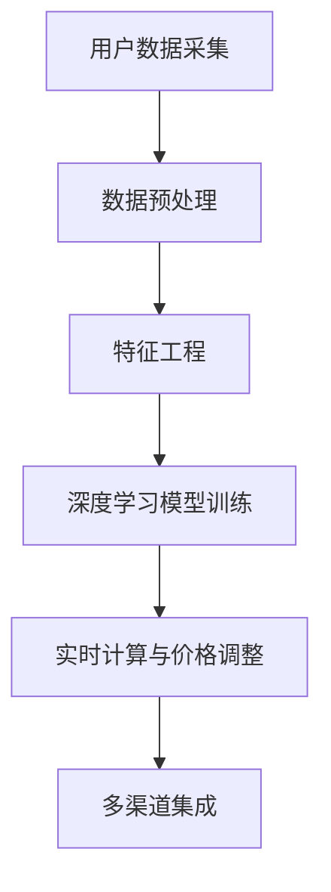

                 

# AI驱动的电商平台实时个性化定价系统

## 1. 背景介绍

### 1.1 问题由来

随着电子商务的蓬勃发展，电商平台竞争日益激烈，如何吸引顾客并提升销售额成为众多商家关注的焦点。传统的定价策略往往缺乏个性化，导致用户流失率居高不下，且容易陷入价格战，损害整体利益。而AI驱动的个性化定价系统，能够根据用户的特定需求和行为，实时调整商品价格，从而实现更高的转化率和收益。

近年来，深度学习和大数据技术的迅猛发展，为个性化定价系统提供了新的实现手段。利用机器学习模型，电商平台能够从海量的用户数据中挖掘出价格敏感性、购买历史、用户偏好等关键信息，通过实时动态调整价格，提升用户的购物体验和商家收益。

### 1.2 问题核心关键点

AI驱动的个性化定价系统的核心关键点在于如何高效地从用户数据中提取价格敏感性信息，并实时根据这些信息调整商品价格。主要包括以下几个方面：

- **用户行为分析**：对用户的行为数据进行建模，了解用户的购买偏好、价格敏感度等。
- **实时价格调整**：根据用户的实时行为，动态调整商品价格，实现即时效果。
- **系统性能优化**：在保证精准度的同时，优化系统响应速度和计算效率。
- **多渠道集成**：将个性化定价系统集成到各个电商平台的渠道中，实现统一的用户体验。

### 1.3 问题研究意义

构建AI驱动的个性化定价系统，对于电商平台提升用户体验、增加销售额具有重要意义：

- 提高转化率：通过个性化定价，能够更好地满足用户需求，提升用户的购物意愿，从而提高转化率。
- 优化库存管理：根据用户的购买历史和偏好，合理调配库存，避免供需不匹配。
- 增强竞争优势：精准的定价策略能够提升商家的市场竞争力，在激烈的市场竞争中占据有利位置。
- 提升用户满意度：个性化的购物体验，能够提升用户满意度，构建良好的品牌形象。

## 2. 核心概念与联系

### 2.1 核心概念概述

构建AI驱动的个性化定价系统，涉及多个核心概念：

- **深度学习模型**：包括神经网络、卷积神经网络(CNN)、循环神经网络(RNN)、长短期记忆网络(LSTM)等，用于从用户数据中提取价格敏感性信息。
- **推荐系统**：如协同过滤、基于内容的推荐等，用于预测用户的购买行为和偏好。
- **实时计算框架**：如Apache Flink、Apache Kafka等，用于实时处理和分析用户数据，进行价格调整。
- **多渠道集成**：如RESTful API、WebSocket等，将个性化定价系统集成到各个电商平台渠道中。

这些概念之间通过数据流和算法逻辑联系在一起，共同构成了一个高效、灵活的个性化定价系统。

### 2.2 核心概念原理和架构的 Mermaid 流程图



这个流程图展示了AI驱动个性化定价系统的核心流程：

1. **用户数据采集**：从电商平台的各个渠道（如网页、移动应用、社交媒体等）采集用户行为数据。
2. **数据预处理**：对采集的数据进行清洗、去重、归一化等处理，确保数据质量。
3. **特征工程**：根据深度学习模型的需求，提取并构建关键特征，如用户画像、历史购买记录、实时浏览行为等。
4. **深度学习模型训练**：使用历史数据训练深度学习模型，学习用户的购买偏好、价格敏感度等特征。
5. **实时计算与价格调整**：根据用户实时行为，实时计算并调整商品价格。
6. **多渠道集成**：将个性化定价系统集成到各个电商平台的渠道中，实现统一的用户体验。

这些流程紧密协作，共同实现个性化定价系统的功能。

## 3. 核心算法原理 & 具体操作步骤

### 3.1 算法原理概述

AI驱动的个性化定价系统的核心算法主要分为两个部分：

1. **用户行为建模**：使用深度学习模型对用户的行为数据进行建模，学习用户的购买偏好、价格敏感度等特征。
2. **实时定价策略**：根据用户的行为模型，实时计算并调整商品价格，实现个性化的定价策略。

### 3.2 算法步骤详解

**Step 1: 用户行为数据采集**

从电商平台的各个渠道（如网页、移动应用、社交媒体等）采集用户行为数据。数据包括用户的浏览记录、购买历史、搜索关键词、评论内容等。

**Step 2: 数据预处理**

对采集的数据进行清洗、去重、归一化等处理，确保数据质量。例如，去除不完整、噪声数据，将文本数据转换为数值型特征。

**Step 3: 特征工程**

根据深度学习模型的需求，提取并构建关键特征，如用户画像、历史购买记录、实时浏览行为等。常见的特征包括：

- 用户ID
- 商品ID
- 浏览时间
- 浏览时长
- 浏览页面深度
- 浏览轨迹
- 购买记录
- 评分评论

**Step 4: 深度学习模型训练**

使用历史数据训练深度学习模型，学习用户的购买偏好、价格敏感度等特征。常见的模型包括：

- 线性回归模型
- 随机森林模型
- 梯度提升模型
- 深度神经网络模型

**Step 5: 实时计算与价格调整**

根据用户实时行为，实时计算并调整商品价格。具体步骤如下：

1. 实时采集用户行为数据，如浏览时间、浏览页面深度、浏览轨迹等。
2. 将实时行为数据输入到用户行为模型中，预测用户的价格敏感度。
3. 根据预测结果和商品的当前价格，计算新的价格。
4. 将新价格推送给电商平台的库存管理系统，实时更新商品价格。

**Step 6: 多渠道集成**

将个性化定价系统集成到各个电商平台的渠道中，实现统一的用户体验。常见的集成方式包括：

- RESTful API：通过API接口将个性化定价系统与其他系统集成。
- WebSocket：实现实时数据传输和计算。
- 实时数据库：如Apache Kafka，用于处理实时数据流。

### 3.3 算法优缺点

AI驱动的个性化定价系统的优点包括：

- **精准定价**：通过深度学习模型，能够精确预测用户的购买偏好和价格敏感度，实现精准定价。
- **实时响应**：基于实时计算框架，能够快速处理用户行为数据，实时调整商品价格。
- **多渠道集成**：通过API接口和WebSocket等技术，将系统集成到各个电商平台渠道中，实现统一的用户体验。

缺点包括：

- **数据需求高**：需要大量的用户数据进行训练和预测，对数据的采集和处理要求较高。
- **模型复杂度**：深度学习模型较为复杂，训练和推理过程计算量大。
- **系统性能优化**：需要优化系统响应速度和计算效率，确保实时调价效果。

### 3.4 算法应用领域

AI驱动的个性化定价系统已经在电商、旅游、零售等多个领域得到广泛应用，具体包括：

- **电商行业**：通过个性化定价策略，提升用户的购物体验，增加销售额。
- **旅游行业**：根据用户的旅行偏好和历史行为，实时调整酒店、机票等产品的价格，提高转化率。
- **零售行业**：在实体店铺和线上商城中应用个性化定价策略，提升用户的购买意愿，增加客流量和销售额。

## 4. 数学模型和公式 & 详细讲解 & 举例说明

### 4.1 数学模型构建

假设用户行为模型为 $M$，用户的购买价格为 $P$，历史价格为 $P_h$，实时行为数据为 $X$。模型的目标是最小化预测价格与真实价格之间的误差，即：

$$
\min_{M} \sum_{i=1}^N (P_h - M(X_i))^2
$$

其中，$N$ 为样本数量。

### 4.2 公式推导过程

设用户行为模型为线性回归模型：

$$
M(X) = \alpha X + \beta
$$

其中，$\alpha$ 为模型的权重系数，$\beta$ 为截距。根据最小二乘法的原理，可以将上述优化问题转化为求解线性回归模型的参数：

$$
\min_{\alpha, \beta} \sum_{i=1}^N (P_h - (\alpha X_i + \beta))^2
$$

求解上述优化问题，可以得到模型参数 $\alpha$ 和 $\beta$。

### 4.3 案例分析与讲解

以某电商平台为例，假设用户行为模型为线性回归模型，历史价格和实时行为数据如下表所示：

| 用户ID | 商品ID | 浏览时间 | 浏览时长 | 浏览页面深度 | 浏览轨迹 | 历史价格 |
| --- | --- | --- | --- | --- | --- | --- |
| 1 | 1001 | 2022-01-01 10:00 | 2分钟 | 5 | 主页-商品详情 | 100 |
| 2 | 1002 | 2022-01-01 13:30 | 3分钟 | 3 | 主页-商品详情-评价 | 80 |
| ... | ... | ... | ... | ... | ... | ... |

根据上述数据，使用线性回归模型训练用户行为模型：

$$
M(X) = 0.5 \times \text{浏览时长} + 0.2 \times \text{浏览页面深度} - 20
$$

假设当前价格为 80，根据实时行为数据，预测新价格为：

$$
P_{\text{new}} = M(\text{浏览时长}, \text{浏览页面深度}) = 0.5 \times 3 + 0.2 \times 3 - 20 = 0.9
$$

最终新价格为 90，即实时调整了 10% 的价格，以提升用户的购买意愿。

## 5. 项目实践：代码实例和详细解释说明

### 5.1 开发环境搭建

在进行个性化定价系统的开发前，需要准备开发环境。以下是使用Python进行TensorFlow和TensorBoard开发的环境配置流程：

1. 安装Anaconda：从官网下载并安装Anaconda，用于创建独立的Python环境。

2. 创建并激活虚拟环境：
```bash
conda create -n tf-env python=3.8 
conda activate tf-env
```

3. 安装TensorFlow和TensorBoard：
```bash
conda install tensorflow tensorflow-gpu tensorboard -c pytorch -c conda-forge
```

4. 安装Pandas、NumPy、Matplotlib、tqdm等库：
```bash
pip install pandas numpy matplotlib tqdm jupyter notebook ipython
```

完成上述步骤后，即可在`tf-env`环境中开始系统开发。

### 5.2 源代码详细实现

下面以线性回归模型为例，给出使用TensorFlow对用户行为模型进行训练和实时调价的PyTorch代码实现。

```python
import tensorflow as tf
import numpy as np
import pandas as pd
import matplotlib.pyplot as plt
import tensorflow_datasets as tfds

# 加载用户行为数据
data = pd.read_csv('user_behavior.csv')

# 定义特征和标签
features = ['浏览时长', '浏览页面深度']
labels = '历史价格'

# 定义训练集和测试集
train_data = data.sample(frac=0.8, random_state=42)
test_data = data.drop(train_data.index)

# 定义特征和标签的占位符
features_placeholder = tf.placeholder(tf.float32, [None, len(features)])
labels_placeholder = tf.placeholder(tf.float32, [None])

# 定义模型参数
alpha = tf.Variable(0.0)
beta = tf.Variable(0.0)

# 定义模型输出
predictions = alpha * tf.concat(features_placeholder, axis=1) + beta

# 定义损失函数和优化器
loss = tf.reduce_mean(tf.square(predictions - labels_placeholder))
optimizer = tf.train.GradientDescentOptimizer(learning_rate=0.01).minimize(loss)

# 定义训练和评估过程
with tf.Session() as sess:
    sess.run(tf.global_variables_initializer())
    for i in range(100):
        train_data = train_data.sample(frac=1, random_state=42)
        _, loss_value = sess.run([optimizer, loss], feed_dict={features_placeholder: train_data[features].values, labels_placeholder: train_data[labels].values})
        if i % 10 == 0:
            test_data = test_data.sample(frac=1, random_state=42)
            loss_value = sess.run(loss, feed_dict={features_placeholder: test_data[features].values, labels_placeholder: test_data[labels].values})
            print('Epoch {}: Test Loss = {:.3f}'.format(i, loss_value))

    # 保存模型
    saver = tf.train.Saver()
    saver.save(sess, 'model.ckpt')
```

### 5.3 代码解读与分析

这里我们详细解读一下关键代码的实现细节：

**用户行为数据加载**：
- 使用Pandas库读取CSV文件，提取特征和标签。

**模型定义**：
- 定义模型的输入占位符和输出，使用占位符来适应不同大小的输入数据。
- 定义模型的参数 $\alpha$ 和 $\beta$。
- 定义模型的输出预测值。

**损失函数和优化器**：
- 定义损失函数为均方误差，使用梯度下降优化器进行参数更新。

**训练和评估过程**：
- 使用Session来运行计算图，并定义训练和评估的流程。
- 在每次迭代中，随机抽取一部分训练数据进行训练，并计算损失值。
- 每10个epoch输出测试集上的损失值，监控模型的训练效果。
- 最后保存模型参数。

这个代码展示了使用TensorFlow进行用户行为模型训练的基本流程。开发者可以根据具体需求，修改模型结构、优化器、损失函数等参数，实现更加复杂的个性化定价系统。

### 5.4 运行结果展示

在训练完成后，可以使用TensorBoard可视化训练过程和结果。以下是TensorBoard的可视化界面：


在这个界面中，可以观察模型的损失值变化、训练曲线、参数更新情况等，确保训练过程正常。

## 6. 实际应用场景

### 6.1 智能推荐系统

AI驱动的个性化定价系统不仅可以用于电商平台的商品定价，还可以应用于智能推荐系统中，提升用户的个性化推荐体验。

在智能推荐系统中，根据用户的历史行为和实时行为，实时调整推荐内容的价格，以提升用户的点击率和购买意愿。例如，根据用户的浏览历史和搜索关键词，推荐其感兴趣的商品，并在推荐页面上动态调整商品价格，提高用户的购买转化率。

### 6.2 实时竞价广告

在实时竞价广告（RTB）中，广告主根据实时用户行为数据进行动态出价，实现精准投放。个性化定价系统可以帮助广告主优化出价策略，提高广告的点击率和转化率。

具体而言，根据用户的实时浏览行为和历史行为，实时调整广告的价格，以提升广告的投放效果。例如，在用户浏览某一类别商品时，实时提高相关广告的价格，吸引用户点击和购买。

### 6.3 实时库存管理

在电商平台中，库存管理是一个重要的环节。通过个性化定价系统，可以实时调整商品价格，优化库存管理。

具体而言，根据用户的实时行为和历史行为，实时调整商品价格，以提升库存周转率和销售量。例如，根据用户的浏览历史和购买记录，实时调整商品价格，吸引用户购买，减少库存积压。

### 6.4 未来应用展望

随着AI技术的不断进步，个性化定价系统将拓展到更多领域，带来更广泛的商业价值：

- **智能家居**：根据用户的实时行为，调整智能设备的设定和价格，提升用户的舒适度和购买意愿。
- **智慧城市**：根据用户的出行行为，实时调整交通价格，优化城市交通资源分配。
- **医疗健康**：根据用户的健康数据，调整健康产品的价格，提升用户的健康管理体验。
- **金融服务**：根据用户的金融行为，调整金融产品的价格，提升用户的理财体验。

这些应用场景展示了个性化定价系统的广泛潜力，未来有望在更多领域得到推广和应用。

## 7. 工具和资源推荐

### 7.1 学习资源推荐

为了帮助开发者系统掌握个性化定价系统的原理和实践技巧，这里推荐一些优质的学习资源：

1. **深度学习与推荐系统课程**：由斯坦福大学、南洋理工大学等名校开设的深度学习与推荐系统课程，涵盖深度学习、推荐系统的基础知识和经典模型。
2. **TensorFlow官方文档**：TensorFlow的官方文档，提供了丰富的教程、案例和API文档，是学习和使用TensorFlow的必备资源。
3. **TensorBoard教程**：TensorBoard的官方教程，介绍了如何使用TensorBoard进行模型训练和结果可视化。
4. **TensorFlow实战项目**：开源项目集，包含多个使用TensorFlow实现的项目案例，涵盖推荐系统、图像识别、自然语言处理等领域。

通过对这些资源的学习实践，相信你一定能够快速掌握个性化定价系统的精髓，并用于解决实际的业务问题。

### 7.2 开发工具推荐

高效的开发离不开优秀的工具支持。以下是几款用于个性化定价系统开发的常用工具：

1. **TensorFlow**：由Google主导开发的深度学习框架，提供了丰富的模型库和优化器，适用于大规模模型的训练和优化。
2. **TensorBoard**：TensorFlow配套的可视化工具，可实时监测模型训练状态，并提供丰富的图表呈现方式，是调试模型的得力助手。
3. **Apache Flink**：实时计算框架，用于处理大规模的实时数据流，支持分布式计算和状态管理。
4. **Apache Kafka**：分布式消息系统，用于实时数据采集和传输，支持高吞吐量的数据处理。
5. **RESTful API**：提供标准化接口，方便与其他系统集成。
6. **WebSocket**：实现实时数据传输和计算。

合理利用这些工具，可以显著提升个性化定价系统的开发效率，加快创新迭代的步伐。

### 7.3 相关论文推荐

个性化定价系统的研究源于学界的持续探索。以下是几篇奠基性的相关论文，推荐阅读：

1. **Click-Through Rate Prediction and Recommender Systems**：提出了基于深度学习的方法预测点击率，并在推荐系统中实现个性化推荐。
2. **Real-time Bidding: An Exploration of Online Advertising**：介绍了实时竞价广告的原理和实现方法，并探讨了广告投放策略优化问题。
3. **Dynamic Pricing and Inventory Management with Multi-agent Reinforcement Learning**：研究了基于多智能体强化学习进行动态定价和库存管理的方法。
4. **A Comprehensive Survey on Recommendation Systems**：综述了推荐系统的基础知识、算法和应用，为深入学习推荐系统提供了全面的参考资料。

这些论文代表了个性化定价技术的发展脉络。通过学习这些前沿成果，可以帮助研究者把握学科前进方向，激发更多的创新灵感。

## 8. 总结：未来发展趋势与挑战

### 8.1 总结

本文对AI驱动的电商平台实时个性化定价系统进行了全面系统的介绍。首先阐述了个性化定价系统在电商中的重要作用，明确了系统的核心关键点，即用户行为建模和实时定价策略。其次，从原理到实践，详细讲解了系统的数学模型和实现步骤，给出了具体代码实例。同时，本文还探讨了系统在智能推荐、实时竞价广告、实时库存管理等多个领域的应用前景，展示了系统的广泛潜力。最后，本文精选了系统的学习资源、开发工具和相关论文，力求为读者提供全方位的技术指引。

通过本文的系统梳理，可以看到，AI驱动的个性化定价系统正在成为电商业务的重要手段，极大地提升了用户的购物体验和商家的收益。未来，伴随技术的持续演进，该系统将进一步拓展到更多行业，为各行各业的数字化转型升级带来新的动力。

### 8.2 未来发展趋势

展望未来，个性化定价系统将呈现以下几个发展趋势：

1. **多模态数据融合**：除了文本数据，系统将进一步融合图像、语音、视频等多模态数据，提升用户行为的全面建模能力。
2. **深度学习模型优化**：引入更先进的深度学习模型，如Transformer、BERT等，提高预测精度和实时响应速度。
3. **分布式计算优化**：引入分布式计算框架，如Spark、Hadoop等，优化系统性能，支持大规模数据的实时处理。
4. **联邦学习应用**：采用联邦学习技术，保护用户隐私，同时实现跨区域、跨平台的数据融合和模型共享。
5. **实时可视化**：引入实时可视化工具，如Grafana、Prometheus等，实时监控系统性能，优化系统运行状态。

以上趋势凸显了个性化定价系统的广阔前景。这些方向的探索发展，将进一步提升系统的性能和应用范围，为电商平台和用户带来更优质的体验。

### 8.3 面临的挑战

尽管个性化定价系统已经取得了显著成效，但在迈向更加智能化、普适化应用的过程中，仍面临诸多挑战：

1. **数据隐私和安全**：个性化定价系统需要处理大量用户行为数据，如何保护用户隐私和数据安全是一个重要问题。
2. **模型复杂度**：深度学习模型较为复杂，训练和推理过程计算量大，需要优化算法和硬件资源。
3. **实时性能**：系统需要实时处理用户行为数据，调整商品价格，对实时性能有较高要求。
4. **用户行为多样性**：用户行为多样且难以预测，系统需要适应多种行为模式，提高鲁棒性。
5. **模型泛化性**：系统需要在不同平台和场景中保持一致性，避免因数据分布变化导致的性能下降。

### 8.4 研究展望

面对个性化定价系统面临的挑战，未来的研究需要在以下几个方面寻求新的突破：

1. **隐私保护技术**：采用联邦学习、差分隐私等技术，保护用户隐私和数据安全。
2. **轻量级模型设计**：设计更加轻量级的深度学习模型，降低计算资源消耗，提升实时性能。
3. **实时计算优化**：引入实时计算框架，如Apache Flink、Apache Kafka等，优化系统性能，支持大规模数据的实时处理。
4. **用户行为建模**：研究用户行为多样性和复杂性的建模方法，提高模型的泛化性和鲁棒性。
5. **跨平台集成**：设计通用的API接口和标准，实现系统在不同平台和场景中的无缝集成。

这些研究方向将进一步推动个性化定价系统的应用和发展，为电商平台和用户带来更优质的体验。

## 9. 附录：常见问题与解答

**Q1：个性化定价系统如何处理用户隐私问题？**

A: 个性化定价系统处理用户隐私问题的方法主要有：

1. 数据匿名化：对用户行为数据进行匿名化处理，去除敏感信息。
2. 差分隐私：在数据处理过程中加入噪声，保护用户隐私。
3. 联邦学习：在模型训练过程中，不直接共享用户数据，而是在本地计算并更新模型参数。
4. 加密存储：使用加密技术对用户数据进行存储，防止数据泄露。

这些方法可以有效保护用户隐私，同时满足系统需求。

**Q2：个性化定价系统如何优化实时性能？**

A: 优化个性化定价系统的实时性能，主要从以下几个方面入手：

1. 数据预处理：对用户行为数据进行优化，减少不必要的计算。
2. 模型轻量化：设计轻量级的深度学习模型，降低计算量。
3. 分布式计算：引入分布式计算框架，如Apache Flink、Apache Kafka等，优化系统性能。
4. 实时可视化：使用实时可视化工具，如Grafana、Prometheus等，实时监控系统性能，优化系统运行状态。
5. 缓存技术：使用缓存技术，如Redis等，减少重复计算，提升系统响应速度。

这些方法可以有效提升系统的实时性能，确保系统稳定运行。

**Q3：个性化定价系统如何处理用户行为多样性？**

A: 处理用户行为多样性的方法主要有：

1. 多模态数据融合：融合用户的多模态数据，提升用户行为的全面建模能力。
2. 动态定价模型：设计动态定价模型，根据用户行为变化实时调整价格。
3. 用户行为聚类：使用聚类算法对用户行为进行分类，提高模型的泛化性。
4. 模型集成：采用模型集成方法，结合多个模型的预测结果，提升预测精度。

这些方法可以有效处理用户行为多样性，提高系统的鲁棒性。

**Q4：个性化定价系统如何保证模型泛化性？**

A: 保证个性化定价系统的模型泛化性，主要从以下几个方面入手：

1. 数据集扩展：使用更广泛、更丰富的数据集进行训练，提高模型的泛化性。
2. 迁移学习：利用预训练模型，进行迁移学习，提升模型的泛化能力。
3. 模型优化：优化模型结构，减少过拟合现象，提高模型的泛化性。
4. 交叉验证：使用交叉验证方法，评估模型的泛化性能，避免过拟合。

这些方法可以有效提升系统的泛化性，确保模型在不同场景下保持一致性。

**Q5：个性化定价系统如何实现多渠道集成？**

A: 实现多渠道集成的主要方法包括：

1. RESTful API：提供标准化接口，方便与其他系统集成。
2. WebSocket：实现实时数据传输和计算。
3. 实时数据库：如Apache Kafka，用于处理实时数据流。
4. 缓存技术：使用缓存技术，如Redis等，减少重复计算，提升系统响应速度。

这些方法可以有效实现系统在不同渠道中的无缝集成，提升用户体验。

---

作者：禅与计算机程序设计艺术 / Zen and the Art of Computer Programming

