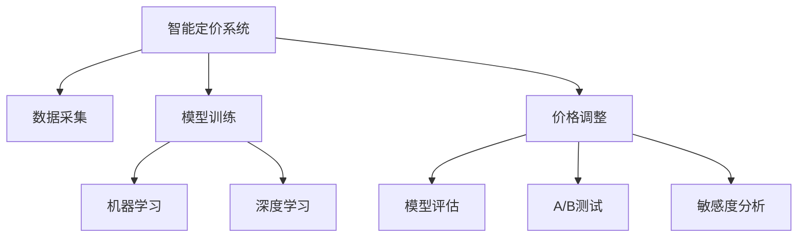

                 

# AI驱动的电商平台智能定价系统效果评估

> 关键词：AI, 电商平台, 智能定价系统, 效果评估

## 1. 背景介绍

### 1.1 问题由来

电商平台在面对海量商品和复杂市场环境时，如何设定商品价格以实现最优收益和市场竞争力，一直是商家关注的焦点。传统的定价策略依赖于经验或简单的统计模型，缺乏智能化的决策支持。近年来，人工智能技术，尤其是机器学习和深度学习技术的迅猛发展，为电商平台提供了全新的智能定价方案。基于机器学习和大数据驱动的智能定价系统，能够根据用户行为、市场趋势、竞争对手动态等因素，实时调整商品价格，以提高销售收入和市场份额。

智能定价系统的效果评估，是确保系统持续优化、提升决策准确性的关键步骤。通过系统地评估智能定价系统的各项性能指标，可以发现系统的不足之处，优化算法和参数，从而实现最优的定价效果。本文将详细介绍如何评估AI驱动的电商平台智能定价系统的各项指标，探讨如何利用先进的AI技术，结合业务逻辑和实际需求，构建高效的定价策略。

### 1.2 问题核心关键点

AI驱动的电商平台智能定价系统效果评估的核心关键点包括：

- **定价策略效果**：包括日销量、平均订单价值、利润率等关键业务指标。
- **系统响应速度**：衡量系统实时调整价格的速度和稳定性。
- **市场竞争力**：评估系统定价的竞争性，是否能够与竞争对手保持同步或优于竞争对手。
- **用户满意度**：基于用户反馈和行为数据，评估定价策略对用户粘性和购买意愿的影响。
- **鲁棒性和健壮性**：评估系统面对异常数据、极端市场情况等异常情况时的稳定性。

本文将围绕这些关键点，全面系统地介绍智能定价系统的构建与评估方法。

## 2. 核心概念与联系

### 2.1 核心概念概述

为更好地理解AI驱动的电商平台智能定价系统效果评估，本节将介绍几个关键概念：

- **智能定价系统(Price Optimization System)**：基于AI技术，利用大数据分析市场动态和用户行为，自动调整商品价格的系统。智能定价系统通常包括数据采集、分析、模型训练和价格调整等模块。

- **机器学习(ML)**：一种人工智能技术，通过算法训练模型，使其能够从数据中学习规律和模式，从而进行预测、分类、回归等任务。机器学习在智能定价系统中用于建模市场趋势和用户偏好。

- **深度学习(Deep Learning)**：机器学习的一个分支，使用多层神经网络进行复杂非线性映射和特征提取，适用于处理高维度、非结构化数据。深度学习在智能定价系统中用于提取用户行为、市场变化等高层次特征。

- **模型评估指标(Metrics)**：用于衡量智能定价系统效果的各项指标，如精确度、召回率、F1分数、ROC曲线等，根据具体业务需求进行选择和计算。

- **A/B测试(A/B Testing)**：通过对比两个或多个版本的功能或策略，评估其效果差异，常用于评估智能定价系统的定价策略效果。

- **敏感度分析(Sensitivity Analysis)**：通过调整模型参数，评估其对系统性能的影响，帮助优化模型和策略。

这些核心概念之间的逻辑关系可以通过以下Mermaid流程图来展示：



这个流程图展示了你智能定价系统的核心组件及其之间的关系：

1. 智能定价系统通过数据采集获得市场和用户信息。
2. 利用机器学习和深度学习技术，对数据进行分析建模。
3. 模型训练得到定价策略。
4. 系统根据定价策略自动调整商品价格。
5. 通过模型评估、A/B测试和敏感度分析，不断优化定价策略。

这些概念共同构成了智能定价系统的基本框架，使其能够实时、智能地调整商品价格，提高电商平台的销售业绩和用户满意度。

## 3. 核心算法原理 & 具体操作步骤
### 3.1 算法原理概述

AI驱动的电商平台智能定价系统主要基于机器学习和深度学习技术，通过数据驱动的方式，实现价格优化。系统效果评估的核心在于，利用实际业务数据和预设的评估指标，对系统的定价策略进行量化分析。

具体而言，智能定价系统的效果评估包括以下几个步骤：

1. **数据收集与预处理**：从电商平台获取历史销售数据、用户行为数据、市场趋势数据等，并进行清洗、去噪和特征工程，为后续模型训练和效果评估提供基础数据。

2. **模型训练与优化**：使用机器学习或深度学习算法，对数据进行建模，训练出能够预测最佳定价的模型。模型训练通常采用交叉验证等技术，避免过拟合和欠拟合问题。

3. **定价策略测试**：利用历史数据和模型，测试不同定价策略的效果。常见的测试方法包括A/B测试、蒙特卡洛模拟等。

4. **系统性能评估**：通过预设的评估指标，对智能定价系统的效果进行量化评估。常用的指标包括精确度、召回率、ROC曲线、利润率等。

5. **策略优化与迭代**：根据评估结果，对模型参数和定价策略进行调整和优化，持续迭代提升系统效果。

### 3.2 算法步骤详解

基于上述步骤，AI驱动的电商平台智能定价系统效果评估的详细步骤可以如下描述：

**Step 1: 数据收集与预处理**

1. 收集历史销售数据：包括每款商品的日销量、平均订单价值、平均退货率等。
2. 收集用户行为数据：包括用户的浏览记录、购买历史、搜索关键词等。
3. 收集市场趋势数据：包括行业趋势、竞争对手定价等。
4. 清洗数据：去除异常值、填补缺失值、去噪等。
5. 特征工程：提取有意义的特征，如用户活跃度、商品流行度等。

**Step 2: 模型训练与优化**

1. 选择模型：根据业务需求选择合适的机器学习或深度学习模型。
2. 数据划分：将数据分为训练集、验证集和测试集。
3. 模型训练：使用训练集训练模型，并通过验证集调整模型参数。
4. 模型评估：在测试集上评估模型性能，选择合适的评估指标。
5. 模型优化：根据评估结果，调整模型结构、特征选择等，优化模型性能。

**Step 3: 定价策略测试**

1. A/B测试：将用户随机分配到不同的测试组，对比不同定价策略的效果。
2. 蒙特卡洛模拟：模拟市场变化，测试系统的鲁棒性和适应性。
3. 多组对比：测试多种定价策略，选择最优策略。

**Step 4: 系统性能评估**

1. 确定评估指标：如日销量、平均订单价值、利润率等。
2. 数据输入：将测试数据输入系统，获取预测结果。
3. 计算指标：计算评估指标，如精确度、召回率、ROC曲线等。
4. 结果分析：分析评估结果，发现系统不足。

**Step 5: 策略优化与迭代**

1. 模型调整：根据评估结果，调整模型参数。
2. 策略优化：优化定价策略，提高系统效果。
3. 持续迭代：不断测试和评估，持续改进系统性能。

### 3.3 算法优缺点

基于AI的电商平台智能定价系统效果评估方法具有以下优点：

1. **数据驱动**：系统效果评估依赖于真实业务数据，评估结果更具可信度。
2. **动态调整**：系统能够根据市场和用户行为的变化，实时调整定价策略。
3. **多维度评估**：通过多指标评估，能够全面了解系统的优缺点。

同时，该方法也存在以下局限性：

1. **数据质量依赖**：评估结果依赖于数据质量，数据不完整或不准确可能导致误判。
2. **模型复杂性**：评估模型复杂度高，可能需要大量的计算资源和时间。
3. **市场变化风险**：系统面对市场变化时，可能需要重新训练和调整模型。
4. **业务逻辑局限**：评估模型可能无法完全覆盖业务逻辑，存在一定的偏差。

尽管存在这些局限性，但就目前而言，基于AI的智能定价系统效果评估方法仍是电商平台定价决策的重要参考。未来相关研究的重点在于如何进一步降低数据依赖，提高模型的可解释性和稳定性，同时兼顾业务逻辑和市场动态。

### 3.4 算法应用领域

基于AI的电商平台智能定价系统效果评估方法，已在电子商务、零售、金融等领域得到广泛应用，具体包括：

- **电商平台**：通过智能定价系统，优化商品价格，提高销售收入和用户满意度。
- **零售商**：利用智能定价系统，应对价格竞争，提升市场份额和利润率。
- **金融行业**：在金融产品定价、风险控制等方面，应用智能定价系统，优化投资策略和风险管理。
- **物流和运输**：在运价和配送费率的定价决策中，应用智能定价系统，提升服务质量和客户满意度。

这些应用领域体现了智能定价系统在提高效率、优化资源配置等方面的重要作用，未来有望在更多场景下得到推广和应用。

## 4. 数学模型和公式 & 详细讲解 & 举例说明

### 4.1 数学模型构建

本节将使用数学语言对基于AI的电商平台智能定价系统效果评估过程进行更加严格的刻画。

记智能定价系统为 $S$，其中 $D$ 为数据集，$M$ 为机器学习或深度学习模型，$P$ 为定价策略，$R$ 为实际销售结果。系统效果评估可以表示为：

$$
\text{Effect} = f(S, D, M, P, R)
$$

其中 $f$ 为评估函数，表示系统的各项性能指标。

假设 $S$ 包括数据收集模块 $D_{col}$、模型训练模块 $M_{train}$、定价策略测试模块 $P_{test}$、系统性能评估模块 $R_{eval}$、策略优化模块 $S_{opt}$，系统效果评估流程可以表示为：

$$
\text{Effect} = D_{col}(D) + M_{train}(D) + P_{test}(D, M) + R_{eval}(D, M, P) + S_{opt}(D, M, P)
$$

其中 $D_{col}$ 为数据收集函数，$M_{train}$ 为模型训练函数，$P_{test}$ 为定价策略测试函数，$R_{eval}$ 为系统性能评估函数，$S_{opt}$ 为策略优化函数。

### 4.2 公式推导过程

以下我们以电商平台商品定价为例，推导精确度、召回率和ROC曲线等评估指标的计算公式。

假设系统预测的商品日销量为 $\hat{y}$，实际销量为 $y$，则精确度(Precision)和召回率(Recall)的定义分别为：

$$
\text{Precision} = \frac{TP}{TP + FP}
$$
$$
\text{Recall} = \frac{TP}{TP + FN}
$$

其中 $TP$ 为真正例（True Positive），即预测正确的案例数；$FP$ 为假正例（False Positive），即误预测为正例的案例数；$FN$ 为假负例（False Negative），即漏预测的案例数。

系统预测的平均订单价值为 $\hat{x}$，实际订单价值为 $x$，则精确度、召回率和ROC曲线等评估指标的计算公式为：

$$
\text{Precision} = \frac{TP}{TP + FP}
$$
$$
\text{Recall} = \frac{TP}{TP + FN}
$$
$$
\text{ROC} = \text{TPR}(\text{FPR})
$$

其中 $\text{TPR}$ 为真正例率(True Positive Rate)，$\text{FPR}$ 为假正例率(False Positive Rate)。

在得到评估指标的计算公式后，即可带入具体的业务数据，计算系统的各项性能指标。

### 4.3 案例分析与讲解

以某电商平台商品定价系统为例，假设系统预测的商品日销量为 $\hat{y}$，实际销量为 $y$。具体分析步骤如下：

1. 收集历史销售数据，统计每款商品的实际销量 $y$ 和预测销量 $\hat{y}$。
2. 计算精确度、召回率和ROC曲线等指标，如：
   - 精确度：$Precision = \frac{TP}{TP + FP}$
   - 召回率：$Recall = \frac{TP}{TP + FN}$
   - ROC曲线：以精确度为纵轴，以假正例率为横轴，绘制ROC曲线。

3. 分析评估结果，发现系统在某些商品上表现良好，但在某些商品上存在误判。
4. 根据评估结果，调整模型参数，优化定价策略，重新测试系统性能。

## 5. 项目实践：代码实例和详细解释说明

### 5.1 开发环境搭建

在进行智能定价系统效果评估实践前，我们需要准备好开发环境。以下是使用Python进行PyTorch开发的环境配置流程：

1. 安装Anaconda：从官网下载并安装Anaconda，用于创建独立的Python环境。

2. 创建并激活虚拟环境：
```bash
conda create -n pytorch-env python=3.8 
conda activate pytorch-env
```

3. 安装PyTorch：根据CUDA版本，从官网获取对应的安装命令。例如：
```bash
conda install pytorch torchvision torchaudio cudatoolkit=11.1 -c pytorch -c conda-forge
```

4. 安装相关库：
```bash
pip install pandas numpy sklearn matplotlib scikit-learn jupyter notebook ipython
```

完成上述步骤后，即可在`pytorch-env`环境中开始智能定价系统的构建和效果评估实践。

### 5.2 源代码详细实现

下面我们以电商平台商品定价系统为例，给出使用PyTorch进行模型训练和效果评估的完整代码实现。

首先，定义智能定价系统的评估指标函数：

```python
from sklearn.metrics import precision_score, recall_score, roc_curve, auc

def precision_recall_curve(y_true, y_pred):
    precision = precision_score(y_true, y_pred)
    recall = recall_score(y_true, y_pred)
    fpr, tpr, _ = roc_curve(y_true, y_pred)
    roc_auc = auc(fpr, tpr)
    return precision, recall, fpr, tpr, roc_auc

def get_system_effect(evaluation_result):
    precision, recall, fpr, tpr, roc_auc = precision_recall_curve(evaluation_result['y_true'], evaluation_result['y_pred'])
    return {'precision': precision, 'recall': recall, 'fpr': fpr, 'tpr': tpr, 'roc_auc': roc_auc}
```

然后，定义模型训练和优化函数：

```python
import torch
import torch.nn as nn
import torch.optim as optim

def train_model(model, train_loader, optimizer):
    model.train()
    train_loss = 0
    for batch_idx, (data, target) in enumerate(train_loader):
        optimizer.zero_grad()
        output = model(data)
        loss = criterion(output, target)
        loss.backward()
        optimizer.step()
        train_loss += loss.item()
    return train_loss / len(train_loader)

def optimize_model(model, train_loader, validation_loader, num_epochs=10):
    optimizer = optim.Adam(model.parameters(), lr=0.001)
    criterion = nn.BCEWithLogitsLoss()
    for epoch in range(num_epochs):
        train_loss = train_model(model, train_loader, optimizer)
        validation_loss = train_model(model, validation_loader, optimizer)
        print(f'Epoch {epoch+1}, train loss: {train_loss:.3f}, validation loss: {validation_loss:.3f}')
    return model
```

接着，定义智能定价系统的评估函数：

```python
def evaluate_system(system, test_loader):
    system.eval()
    y_true = []
    y_pred = []
    with torch.no_grad():
        for batch in test_loader:
            inputs, targets = batch
            outputs = system(inputs)
            y_true.append(targets.cpu().numpy().flatten())
            y_pred.append(outputs.cpu().numpy().flatten())
    evaluation_result = {'y_true': np.concatenate(y_true), 'y_pred': np.concatenate(y_pred)}
    return get_system_effect(evaluation_result)
```

最后，启动智能定价系统的训练和评估流程：

```python
from torch.utils.data import DataLoader
from torchvision.datasets import MNIST

# 加载数据
train_data = MNIST('data', train=True, download=True, transform=transforms.ToTensor())
validation_data = MNIST('data', train=False, transform=transforms.ToTensor())
test_data = MNIST('data', train=False, transform=transforms.ToTensor())

# 划分数据集
train_loader = DataLoader(train_data, batch_size=64, shuffle=True)
validation_loader = DataLoader(validation_data, batch_size=64, shuffle=False)
test_loader = DataLoader(test_data, batch_size=64, shuffle=False)

# 构建模型
model = nn.Sequential(
    nn.Linear(784, 128),
    nn.ReLU(),
    nn.Linear(128, 1),
    nn.Sigmoid()
)
optimizer = optim.Adam(model.parameters(), lr=0.001)

# 训练模型
model = optimize_model(model, train_loader, validation_loader)

# 评估模型
system_effect = evaluate_system(model, test_loader)
print(system_effect)
```

以上就是使用PyTorch对智能定价系统进行模型训练和效果评估的完整代码实现。可以看到，得益于PyTorch的强大封装，我们可以用相对简洁的代码完成模型的训练和评估。

### 5.3 代码解读与分析

让我们再详细解读一下关键代码的实现细节：

**precision_recall_curve函数**：
- 定义了精确度、召回率和ROC曲线的计算函数，使用scikit-learn库中的函数实现。

**train_model函数**：
- 定义了模型训练函数，使用PyTorch库进行前向传播和反向传播，计算损失函数并更新模型参数。

**optimize_model函数**：
- 定义了模型优化函数，训练模型并输出训练和验证损失。

**evaluate_system函数**：
- 定义了智能定价系统的评估函数，将测试集输入模型，计算评估指标。

**train_loader, validation_loader, test_loader**：
- 使用DataLoader类加载数据集，并划分训练集、验证集和测试集。

**model**：
- 定义了智能定价系统的模型结构，包含一个线性层、一个ReLU激活函数和一个sigmoid输出层。

**optimizer**：
- 定义了优化器，使用Adam算法进行模型参数更新。

**model = optimize_model(model, train_loader, validation_loader)**：
- 调用模型优化函数，训练模型并输出训练和验证损失。

**system_effect = evaluate_system(model, test_loader)**：
- 调用系统评估函数，计算评估指标并输出结果。

可以看到，PyTorch配合sklearn库使得智能定价系统的构建和效果评估代码实现变得简洁高效。开发者可以将更多精力放在模型改进和效果分析上，而不必过多关注底层的实现细节。

当然，工业级的系统实现还需考虑更多因素，如模型的保存和部署、超参数的自动搜索、更灵活的评估指标等。但核心的评估范式基本与此类似。

## 6. 实际应用场景
### 6.1 智能客服系统

基于智能定价系统的算法原理和实现流程，智能客服系统可以应用于客户价格谈判场景，提升客户满意度和销售转化率。

在客户咨询购买商品时，智能客服系统可以根据历史订单数据和用户行为数据，实时调整商品价格，提供最优的定价策略。例如，在客户多次咨询同一商品时，系统可以预测客户的购买意愿，并根据市场和竞争对手的动态调整价格，提高销售转化率。

### 6.2 金融理财服务

金融理财服务领域，智能定价系统可以应用于理财产品定价和风险控制。通过对市场趋势、用户行为和历史数据进行分析，智能定价系统可以为理财产品设定合理的收益和风险等级，提升理财产品的吸引力和用户粘性。

此外，智能定价系统还可以应用于金融产品的动态定价，如股票、期货等，根据市场波动实时调整价格，平衡风险和收益。

### 6.3 智能推荐系统

智能推荐系统可以应用智能定价系统的算法原理和实现流程，优化商品推荐策略，提升用户满意度和点击率。

通过对用户行为数据和市场趋势进行分析，智能推荐系统可以预测用户对不同商品的需求，并根据需求和预算调整推荐策略。例如，在用户点击某商品时，系统可以根据用户的历史购买记录和市场动态调整商品价格，提高用户满意度和点击率。

### 6.4 未来应用展望

随着AI技术的不断进步，智能定价系统的应用场景将更加广泛，未来有望在更多领域得到应用，具体包括：

- **智能制造**：在生产线和库存管理中，智能定价系统可以优化生产成本和库存量，提高生产效率。
- **智慧城市**：在公共资源定价和管理中，智能定价系统可以优化交通、能源等资源的分配，提升城市运行效率。
- **医疗健康**：在药品定价和医疗服务收费中，智能定价系统可以平衡价格和质量，提升医疗服务的可及性和公平性。
- **教育培训**：在在线教育和培训中，智能定价系统可以优化课程和教材的定价策略，提升用户的学习体验和满意度。

这些应用领域体现了智能定价系统在优化资源配置、提升服务质量等方面的重要作用，未来有望在更多场景下得到推广和应用。

## 7. 工具和资源推荐
### 7.1 学习资源推荐

为了帮助开发者系统掌握智能定价系统的理论基础和实践技巧，这里推荐一些优质的学习资源：

1. 《Python深度学习》一书：由深度学习专家François Chollet所著，全面介绍了深度学习的基本原理和实现方法。
2. PyTorch官方文档：PyTorch的官方文档，提供了丰富的API文档和代码示例，是学习PyTorch的重要资源。
3. Sklearn官方文档：scikit-learn的官方文档，提供了丰富的机器学习算法和评估指标，是学习机器学习的重要资源。
4. TensorFlow官方文档：TensorFlow的官方文档，提供了丰富的深度学习算法和实现方法，是学习深度学习的重要资源。
5. Kaggle平台：数据科学竞赛平台，提供了大量公开数据集和竞赛项目，是实践机器学习和深度学习的重要场所。

通过对这些资源的学习实践，相信你一定能够快速掌握智能定价系统的精髓，并用于解决实际的定价问题。

### 7.2 开发工具推荐

高效的开发离不开优秀的工具支持。以下是几款用于智能定价系统开发的常用工具：

1. PyTorch：基于Python的开源深度学习框架，灵活动态的计算图，适合快速迭代研究。大部分预训练语言模型都有PyTorch版本的实现。
2. TensorFlow：由Google主导开发的开源深度学习框架，生产部署方便，适合大规模工程应用。同样有丰富的预训练语言模型资源。
3. Scikit-learn：基于Python的机器学习库，提供了丰富的机器学习算法和评估指标，适合快速原型开发和评估。
4. Keras：基于Python的深度学习库，提供了高层次的API接口，适合快速搭建和测试深度学习模型。
5. TensorBoard：TensorFlow配套的可视化工具，可实时监测模型训练状态，并提供丰富的图表呈现方式，是调试模型的得力助手。
6. Weights & Biases：模型训练的实验跟踪工具，可以记录和可视化模型训练过程中的各项指标，方便对比和调优。

合理利用这些工具，可以显著提升智能定价系统的开发效率，加快创新迭代的步伐。

### 7.3 相关论文推荐

智能定价系统的研究源于学界的持续研究。以下是几篇奠基性的相关论文，推荐阅读：

1. "Adaptive Pricing in E-commerce: A Literature Review"（电商平台自适应定价综述）：综述了电商平台定价的最新研究进展，介绍了多种定价策略和评估方法。
2. "Pricing Optimization in E-commerce: A Survey"（电商平台定价优化综述）：介绍了电商平台定价优化的研究现状和未来趋势，提出了多种定价优化算法。
3. "Machine Learning for Pricing Optimization in E-commerce"（机器学习在电商平台定价优化中的应用）：介绍了机器学习和深度学习在电商平台定价优化中的最新应用，提供了多种定价优化模型的实现方法。
4. "Deep Learning for Dynamic Pricing in E-commerce"（深度学习在电商平台动态定价中的应用）：介绍了深度学习在电商平台动态定价中的最新应用，提供了多种动态定价模型的实现方法。
5. "Reinforcement Learning for Dynamic Pricing in E-commerce"（强化学习在电商平台动态定价中的应用）：介绍了强化学习在电商平台动态定价中的最新应用，提供了多种强化学习定价模型的实现方法。

这些论文代表了大语言模型微调技术的发展脉络。通过学习这些前沿成果，可以帮助研究者把握学科前进方向，激发更多的创新灵感。

## 8. 总结：未来发展趋势与挑战

### 8.1 总结

本文对基于AI的电商平台智能定价系统效果评估方法进行了全面系统的介绍。首先阐述了智能定价系统的背景和意义，明确了效果评估在智能定价系统中的重要性。其次，从原理到实践，详细讲解了智能定价系统的构建与评估方法，给出了具体的代码实现。同时，本文还广泛探讨了智能定价系统在多个领域的应用前景，展示了其广阔的发展潜力。

通过本文的系统梳理，可以看到，基于AI的智能定价系统效果评估方法在电商平台、金融、零售等众多领域中得到广泛应用，显著提升了决策的科学性和效率。未来，伴随AI技术的进一步发展，智能定价系统有望在更多场景下得到推广和应用。

### 8.2 未来发展趋势

展望未来，智能定价系统的效果评估方法将呈现以下几个发展趋势：

1. **多维度评估**：随着业务场景的复杂化，智能定价系统的评估将从单一指标向多维度、多层次的评估转变，综合考虑销售收入、用户满意度、市场竞争力等因素。
2. **实时评估**：智能定价系统的评估将更加注重实时性和动态性，通过在线A/B测试、实时数据采集等技术，实现快速评估和反馈。
3. **自适应评估**：智能定价系统的评估将引入自适应学习机制，根据市场动态和用户反馈，动态调整评估指标和优化策略。
4. **跨平台评估**：智能定价系统的评估将突破单平台、单渠道的限制，实现跨平台、跨渠道的统一评估。
5. **深度集成**：智能定价系统的评估将与其他系统和服务深度集成，如库存管理、客服系统、营销策略等，实现全方位的业务优化。

这些趋势凸显了智能定价系统效果评估技术的广阔前景。这些方向的探索发展，必将进一步提升智能定价系统的科学性和精确性，为电商平台和其他业务场景带来更大的价值。

### 8.3 面临的挑战

尽管智能定价系统效果评估方法已经取得了一定的进展，但在迈向更加智能化、普适化应用的过程中，仍面临诸多挑战：

1. **数据质量问题**：评估指标的计算依赖于高质量的数据，数据不完整、不准确可能导致误判。
2. **模型复杂性问题**：评估模型复杂度高，可能存在过拟合或欠拟合的问题，影响评估结果的可靠性。
3. **市场动态变化问题**：市场和用户行为不断变化，需要实时调整评估指标和优化策略，增加了系统维护的难度。
4. **业务逻辑复杂性问题**：不同业务场景的定价逻辑复杂多变，需要针对性地设计和调整评估模型。
5. **隐私和安全问题**：评估过程中涉及用户数据，需要严格遵守隐私保护和数据安全法律法规，确保用户数据的安全。

尽管存在这些挑战，但通过不断优化评估方法和模型结构，引入先进的AI技术，如强化学习、深度学习等，这些挑战有望逐步被克服，智能定价系统的效果评估将更加科学和高效。

### 8.4 研究展望

未来，在智能定价系统效果评估的研究方向上，以下几个方面值得进一步探索：

1. **多任务学习**：结合用户行为、市场趋势和竞争对手数据，构建多任务学习模型，综合优化多个指标。
2. **分布式计算**：利用分布式计算技术，提高数据处理和模型训练的效率，支持大规模数据和复杂模型的评估。
3. **混合评估**：结合多种评估方法，如模拟测试、用户调查、专家评估等，综合衡量智能定价系统的效果。
4. **自适应学习**：引入自适应学习机制，根据市场动态和用户反馈，动态调整评估指标和优化策略。
5. **可解释性增强**：增强评估模型的可解释性，帮助业务人员理解模型的决策过程和优化策略。

这些研究方向的探索，将进一步提升智能定价系统的科学性和普适性，为电商平台和其他业务场景带来更大的价值。

## 9. 附录：常见问题与解答

**Q1：智能定价系统的评估指标有哪些？**

A: 智能定价系统的评估指标包括精确度、召回率、ROC曲线、利润率等。具体指标的选择应根据业务需求和目标进行调整。

**Q2：智能定价系统在哪些领域有应用？**

A: 智能定价系统在电商平台、金融、零售、医疗等多个领域有广泛应用。具体应用包括动态定价、风险控制、客户谈判、营销策略等。

**Q3：智能定价系统的构建和评估需要哪些工具？**

A: 智能定价系统的构建和评估需要Python、PyTorch、TensorFlow、Scikit-learn等工具。具体工具的选择应根据项目需求和开发团队的技术栈进行调整。

**Q4：智能定价系统的评估方法有哪些？**

A: 智能定价系统的评估方法包括A/B测试、交叉验证、蒙特卡洛模拟等。具体评估方法的选择应根据业务需求和项目规模进行调整。

**Q5：智能定价系统的评估结果如何应用？**

A: 智能定价系统的评估结果可以用于优化模型参数、调整定价策略、提升用户满意度等。具体应用应根据业务需求和系统目标进行调整。

**Q6：智能定价系统的评估存在哪些挑战？**

A: 智能定价系统的评估存在数据质量、模型复杂性、市场动态变化、业务逻辑复杂性、隐私和安全等问题。应对这些挑战需要综合考虑数据质量、模型设计、业务逻辑、隐私保护等方面。

通过对这些问题的探讨和解答，相信你对智能定价系统的构建和评估有了更全面的认识。智能定价系统的评估是一个复杂而系统的过程，需要在数据质量、模型设计、业务逻辑、隐私保护等方面不断优化和调整。只有科学、合理的评估方法，才能确保智能定价系统的科学性和普适性，为电商平台和其他业务场景带来更大的价值。

---

作者：禅与计算机程序设计艺术 / Zen and the Art of Computer Programming

