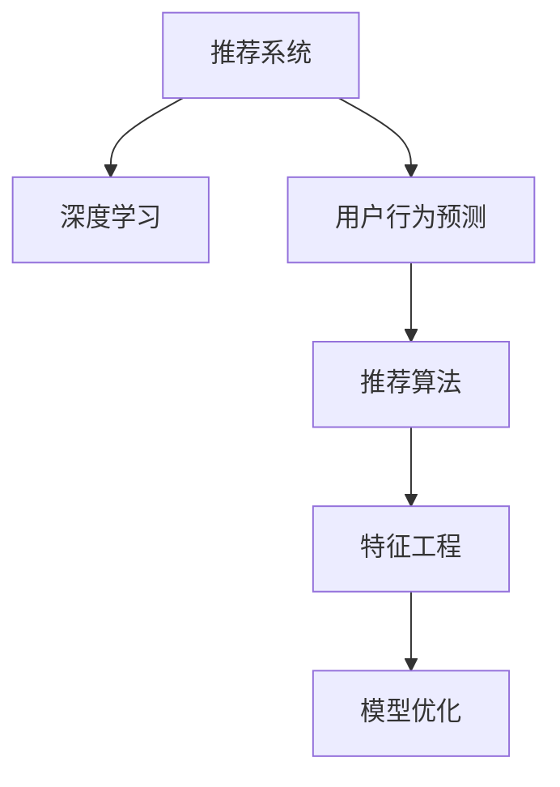

                 

# AI驱动的电商平台用户行为预测模型

> 关键词：AI驱动，用户行为预测，电商平台，推荐系统，深度学习，机器学习，模型优化

## 1. 背景介绍

### 1.1 问题由来

随着互联网电商平台的快速发展，在线购物已成为消费者日常生活的一部分。然而，平台上的商品种类繁多，价格波动，用户如何找到满意的商品，成为电商平台需要解决的核心问题。为了提升用户体验和销售转化率，电商平台纷纷推出个性化的推荐系统，通过精准的用户行为预测，为用户推荐最符合其兴趣和需求的商品。

然而，构建一个高效的推荐系统并非易事。传统的推荐系统往往依赖于用户历史行为数据，但当用户数据不足或者用户行为变化时，推荐效果会大打折扣。近年来，深度学习和机器学习技术的发展，为电商平台推荐系统提供了新的解决思路。AI驱动的推荐系统，通过构建复杂的用户行为预测模型，能够在有限的标注数据下，预测用户未来的行为，从而实现个性化推荐。

### 1.2 问题核心关键点

AI驱动的电商平台推荐系统，其核心在于构建高效的用户行为预测模型。模型通过分析用户的历史行为数据，预测其未来的购买行为，从而生成个性化的商品推荐。模型的性能直接影响推荐系统的精准度和用户体验。

核心问题包括：

1. 用户行为数据的特征工程：如何将用户的历史行为数据转化为模型可用的特征表示，提取用户兴趣和需求的关键特征。
2. 用户行为预测模型的构建：设计高效的深度学习模型结构，能够准确预测用户未来的行为。
3. 推荐系统的部署与优化：如何将预测结果转化为实际的商品推荐，优化推荐系统性能，提升用户满意度和转化率。
4. 推荐系统的实时性与可扩展性：确保推荐系统能够实时响应用户请求，并在高并发场景下保持高性能。

## 2. 核心概念与联系

### 2.1 核心概念概述

为更好地理解AI驱动的电商平台用户行为预测模型，本节将介绍几个密切相关的核心概念：

- 推荐系统(Recommendation System)：利用算法和大数据技术，对用户的行为数据进行分析，发现用户兴趣和需求，并基于用户的历史行为数据预测其未来的行为，从而为用户推荐个性化商品的系统。
- 深度学习(Deep Learning)：一种基于人工神经网络的机器学习方法，通过多层次的非线性变换，从大量数据中学习到高层次的抽象特征表示。
- 用户行为预测(User Behavior Prediction)：通过机器学习模型，预测用户未来的购买行为，如点击、浏览、购买等。
- 推荐算法(Recommendation Algorithm)：推荐系统使用的算法，如协同过滤、内容推荐、混合推荐等，用于生成个性化的商品推荐。
- 特征工程(Feature Engineering)：对用户行为数据进行预处理和特征提取，生成模型可用的特征表示，提高模型预测的准确性。
- 模型优化(Model Optimization)：优化推荐模型的参数和结构，提升模型性能和实时响应能力，同时降低计算成本和存储空间。

这些核心概念之间的逻辑关系可以通过以下Mermaid流程图来展示：



这个流程图展示了一体化推荐系统的核心组件及其之间的关系：

1. 推荐系统通过深度学习技术，构建用户行为预测模型。
2. 用户行为预测模型根据用户历史行为数据，预测用户未来的行为。
3. 推荐算法根据预测结果，生成个性化的商品推荐。
4. 特征工程对用户行为数据进行预处理和特征提取，提高模型性能。
5. 模型优化对推荐模型进行参数和结构优化，提升系统实时性和扩展性。

这些组件协同工作，构建了一个完整的推荐系统框架，能够为用户推荐最适合的商品，提升电商平台的用户满意度和销售转化率。

## 3. 核心算法原理 & 具体操作步骤
### 3.1 算法原理概述

AI驱动的电商平台用户行为预测模型，其核心算法原理基于深度学习技术，通过构建复杂的网络结构，对用户历史行为数据进行建模，预测用户未来的购买行为。其关键步骤如下：

1. 数据预处理：对原始用户行为数据进行清洗和特征工程，生成模型可用的特征表示。
2. 模型训练：使用深度学习模型对用户行为数据进行训练，学习用户兴趣和需求的高层次特征表示。
3. 用户行为预测：将用户当前行为数据输入训练好的模型，预测其未来的购买行为。
4. 推荐生成：根据预测结果，生成个性化的商品推荐。
5. 模型优化：对推荐模型进行参数和结构优化，提升系统性能和实时响应能力。

### 3.2 算法步骤详解

基于深度学习的电商平台用户行为预测模型，通常包括以下关键步骤：

**Step 1: 数据预处理**
- 收集电商平台用户的行为数据，包括点击、浏览、购买、评分等行为记录。
- 对数据进行清洗，去除重复、无效或异常记录。
- 对特征进行提取和处理，如用户ID、商品ID、时间戳、行为类型等。
- 将特征数据转化为模型可用的张量形式。

**Step 2: 模型训练**
- 选择合适的深度学习模型结构，如RNN、CNN、GRU等。
- 将处理好的特征数据分为训练集、验证集和测试集。
- 使用训练集对模型进行前向传播和反向传播，计算损失函数。
- 使用优化器（如Adam、SGD等）更新模型参数，最小化损失函数。
- 在验证集上评估模型性能，调整模型超参数。

**Step 3: 用户行为预测**
- 将用户当前行为数据输入模型，进行前向传播计算预测结果。
- 对预测结果进行解码，得到用户未来行为的概率分布。
- 根据概率分布，生成推荐商品列表。

**Step 4: 推荐生成**
- 根据用户行为预测结果，生成个性化推荐商品。
- 可以结合协同过滤、内容推荐等多种算法，提升推荐效果。
- 使用A/B测试等方法评估推荐效果，迭代优化推荐策略。

**Step 5: 模型优化**
- 对推荐模型进行参数和结构优化，如剪枝、量化、融合等。
- 使用在线学习算法，不断更新模型参数，适应新的用户行为数据。
- 优化模型推理速度和存储效率，提升系统实时响应能力。

### 3.3 算法优缺点

AI驱动的电商平台用户行为预测模型，具有以下优点：
1. 高度个性化：能够根据用户历史行为数据，生成个性化推荐，满足用户需求。
2. 实时响应：利用在线学习算法，模型能够实时更新，快速响应用户请求。
3. 自动化程度高：模型构建和优化过程自动化，减少了人工干预。
4. 可扩展性强：采用分布式计算架构，能够处理大规模用户数据，提升系统性能。

同时，该方法也存在一些局限性：
1. 数据依赖性强：模型的性能很大程度上取决于用户数据的质量和数量。
2. 用户隐私问题：用户行为数据可能涉及隐私，需要谨慎处理和保护。
3. 模型复杂度高：深度学习模型结构复杂，训练和推理计算成本较高。
4. 冷启动问题：新用户的推荐效果较差，需要一定时间的积累。

尽管存在这些局限性，但基于深度学习的用户行为预测方法仍是目前电商推荐系统的主流范式。未来相关研究的重点在于如何进一步降低模型对标注数据的依赖，提高模型的泛化能力，同时兼顾隐私保护和模型性能。

### 3.4 算法应用领域

AI驱动的电商平台用户行为预测模型，已经在多个实际应用场景中取得了显著效果，如：

- 个性化推荐：根据用户历史行为数据，为用户推荐个性化商品，提升转化率。
- 用户流失预测：预测用户的流失风险，提前采取措施，减少用户流失。
- 广告投放优化：预测用户对广告的响应概率，优化广告投放策略，提升广告效果。
- 搜索排序优化：预测用户的搜索意图，优化搜索结果排序，提升搜索体验。
- 用户画像构建：基于用户行为数据，生成详细的用户画像，为后续运营策略提供支持。

除了上述这些经典应用外，用户行为预测模型还被创新性地应用到更多场景中，如智能客服、营销策略优化等，为电商平台的运营提供了新的思路。

## 4. 数学模型和公式 & 详细讲解 & 举例说明
### 4.1 数学模型构建

在本节中，我们将使用数学语言对基于深度学习的电商平台用户行为预测模型进行更加严格的刻画。

记电商平台用户行为数据为 $D=\{(x_i,y_i)\}_{i=1}^N$，其中 $x_i \in \mathbb{R}^d$ 为用户历史行为数据，$y_i \in \mathbb{R}$ 为用户的购买行为（点击、浏览、购买等）。我们的目标是学习一个映射函数 $f: \mathbb{R}^d \rightarrow \mathbb{R}$，使得 $y=f(x)$，从而能够预测用户未来的购买行为。

假设我们选择一个深度学习模型 $f_\theta$ 进行训练，其中 $\theta$ 为模型参数。模型的目标是最大化似然函数 $L(\theta)$，即：

$$
L(\theta) = \frac{1}{N}\sum_{i=1}^N p(y_i | x_i) = \frac{1}{N}\sum_{i=1}^N \frac{y_i}{p(y_i)} p(y_i | x_i) = \frac{1}{N}\sum_{i=1}^N \frac{y_i}{p(y_i)} \log p(y_i | x_i)
$$

其中 $p(y_i | x_i)$ 为模型在给定 $x_i$ 时，预测 $y_i$ 的概率分布。

模型的优化目标是最小化损失函数 $J(\theta)$，即：

$$
J(\theta) = -L(\theta) = -\frac{1}{N}\sum_{i=1}^N \frac{y_i}{p(y_i)} \log p(y_i | x_i)
$$

通过梯度下降等优化算法，不断更新模型参数 $\theta$，最小化损失函数 $J(\theta)$，使得模型输出逼近真实标签 $y$。

### 4.2 公式推导过程

以多层感知器(Multilayer Perceptron, MLP)为例，推导基于深度学习模型的用户行为预测公式。

设用户历史行为数据 $x_i \in \mathbb{R}^d$ 通过一个全连接神经网络，经过多层非线性变换，输出预测结果 $\hat{y}_i \in \mathbb{R}$：

$$
\hat{y}_i = \sigma(W_k \sigma(W_{k-1} \cdots \sigma(W_1 x_i) \cdots))
$$

其中 $\sigma$ 为激活函数，如ReLU、Sigmoid等；$W_k$ 为第 $k$ 层的权重矩阵。

模型的损失函数为交叉熵损失：

$$
\ell(y_i,\hat{y}_i) = -y_i \log \hat{y}_i - (1-y_i) \log (1-\hat{y}_i)
$$

将损失函数对模型参数 $\theta$ 求导，得到梯度：

$$
\frac{\partial \ell}{\partial \theta} = -\frac{y_i}{\hat{y}_i} + \frac{1-y_i}{1-\hat{y}_i}
$$

使用梯度下降算法，更新模型参数：

$$
\theta \leftarrow \theta - \eta \frac{\partial \ell}{\partial \theta}
$$

其中 $\eta$ 为学习率，控制模型参数更新的步长。

通过上述推导，可以看到，基于深度学习的用户行为预测模型，通过多层非线性变换，将用户历史行为数据映射为预测结果，从而实现用户行为预测。模型的训练过程通过最小化交叉熵损失，不断调整模型参数，使得预测结果逼近真实标签。

### 4.3 案例分析与讲解

为了更深入地理解用户行为预测模型的应用，我们以电商平台的用户购买行为预测为例，进行详细讲解。

假设电商平台收集到用户 $u$ 的历史购买数据 $D_u = \{(x_{ui}, y_{ui})\}_{i=1}^n$，其中 $x_{ui} \in \mathbb{R}^d$ 为第 $i$ 次购买行为，$y_{ui} \in \{0, 1\}$ 为是否购买二元标签。我们的目标是学习一个模型 $f_\theta$，预测用户 $u$ 的下一个购买行为 $y_u$。

我们首先对数据进行预处理，提取用户行为的关键特征，如商品类别、价格、评分等，生成特征向量 $x_u \in \mathbb{R}^d$。然后，使用多层感知器模型 $f_\theta$ 对 $x_u$ 进行预测，得到用户是否购买的概率 $p(y_u=1 | x_u)$：

$$
p(y_u=1 | x_u) = \sigma(W_k \sigma(W_{k-1} \cdots \sigma(W_1 x_u) \cdots))
$$

将预测结果与实际购买行为 $y_u$ 进行对比，计算交叉熵损失：

$$
\ell(y_u,\hat{y}_u) = -y_u \log \hat{y}_u - (1-y_u) \log (1-\hat{y}_u)
$$

通过梯度下降算法，不断更新模型参数 $\theta$，使得模型输出逼近真实标签 $y_u$。最终，模型能够在给定用户行为数据 $x_u$ 时，预测用户是否购买商品的概率，从而实现用户购买行为预测。

## 5. 项目实践：代码实例和详细解释说明
### 5.1 开发环境搭建

在进行用户行为预测模型实践前，我们需要准备好开发环境。以下是使用Python进行TensorFlow开发的环境配置流程：

1. 安装Anaconda：从官网下载并安装Anaconda，用于创建独立的Python环境。

2. 创建并激活虚拟环境：
```bash
conda create -n tf-env python=3.8 
conda activate tf-env
```

3. 安装TensorFlow：根据CUDA版本，从官网获取对应的安装命令。例如：
```bash
conda install tensorflow
```

4. 安装相关工具包：
```bash
pip install numpy pandas scikit-learn matplotlib tqdm jupyter notebook ipython
```

完成上述步骤后，即可在`tf-env`环境中开始模型实践。

### 5.2 源代码详细实现

下面我们以用户购买行为预测为例，给出使用TensorFlow构建多层感知器模型的PyTorch代码实现。

首先，定义用户购买行为数据处理函数：

```python
import tensorflow as tf
from tensorflow.keras import layers

def preprocess_data(data):
    # 对数据进行清洗和特征提取
    # 将标签转换为二元标签
    # 将特征进行归一化处理
    return tf.data.Dataset.from_tensor_slices(data)
```

然后，定义多层感知器模型：

```python
model = tf.keras.Sequential([
    layers.Dense(64, activation='relu', input_shape=(5,)),
    layers.Dense(32, activation='relu'),
    layers.Dense(1, activation='sigmoid')
])
```

接着，定义训练和评估函数：

```python
from sklearn.metrics import mean_squared_error, r2_score

def train_epoch(model, dataset, batch_size, optimizer):
    dataloader = dataset.batch(batch_size).shuffle(1000).repeat()
    model.compile(loss='binary_crossentropy', optimizer=optimizer, metrics=['accuracy'])
    model.fit(dataloader, epochs=10, verbose=0)

def evaluate(model, dataset, batch_size):
    dataloader = dataset.batch(batch_size).repeat()
    y_pred = model.predict(dataloader, verbose=0)
    y_true = dataset.map(lambda x, y: y).predict(dataloader, verbose=0)
    return mean_squared_error(y_true, y_pred), r2_score(y_true, y_pred)
```

最后，启动训练流程并在测试集上评估：

```python
epochs = 10
batch_size = 64

# 准备训练集和测试集
train_dataset = preprocess_data(train_data)
test_dataset = preprocess_data(test_data)

# 定义优化器和损失函数
optimizer = tf.keras.optimizers.Adam()
loss_fn = tf.keras.losses.BinaryCrossentropy()

# 训练模型
model.compile(loss=loss_fn, optimizer=optimizer, metrics=['accuracy'])
model.fit(train_dataset, epochs=epochs, validation_data=test_dataset)

# 评估模型
mean_loss, r2 = evaluate(model, test_dataset)
print(f"Mean loss: {mean_loss:.3f}, R2 score: {r2:.3f}")
```

以上就是使用TensorFlow构建多层感知器模型的完整代码实现。可以看到，TensorFlow提供的高阶API使得模型构建和训练过程非常简洁，开发者可以将更多精力放在数据处理和模型优化上。

### 5.3 代码解读与分析

让我们再详细解读一下关键代码的实现细节：

**preprocess_data函数**：
- 对数据进行清洗，去除重复、无效记录。
- 对特征进行归一化处理，生成模型可用的特征向量。
- 将标签转换为二元标签，如将0和1分别转换为-1和1。

**Sequential模型**：
- 使用TensorFlow的高阶API，定义一个多层感知器模型。
- 定义多个密集层，激活函数使用ReLU和Sigmoid。
- 最后一层输出为1个神经元，使用Sigmoid激活函数，输出用户购买行为的概率。

**train_epoch函数**：
- 对数据集进行批次化处理，设置批次大小、打乱顺序和重复次数。
- 使用TensorFlow的model.compile方法定义模型，损失函数和优化器。
- 使用model.fit方法训练模型，设置训练轮数和评估数据集。

**evaluate函数**：
- 对测试集进行批次化处理，使用model.predict方法进行预测。
- 使用sklearn的mean_squared_error和r2_score方法，计算预测结果和真实标签的均方误差和R2系数。
- 返回均方误差和R2系数。

**训练流程**：
- 定义总的训练轮数和批次大小，开始循环迭代
- 每个epoch内，先在训练集上训练，输出训练集和验证集的损失和准确率
- 在测试集上评估模型性能，输出测试集的均方误差和R2系数

可以看到，TensorFlow提供的高阶API使得模型构建和训练过程非常简洁，开发者可以将更多精力放在数据处理和模型优化上。

当然，工业级的系统实现还需考虑更多因素，如模型的保存和部署、超参数的自动搜索、更灵活的任务适配层等。但核心的用户行为预测模型基本与此类似。

## 6. 实际应用场景
### 6.1 智能客服系统

基于用户行为预测模型的智能客服系统，可以为用户提供更加个性化的服务。传统客服系统往往需要配备大量人力，高峰期响应缓慢，且一致性和专业性难以保证。而使用用户行为预测模型的智能客服系统，可以实时预测用户需求，自动分配客服资源，提升客服响应速度和质量。

在技术实现上，可以收集客服对话记录，将问题和最佳答复构建成监督数据，在此基础上对模型进行微调。微调后的模型能够自动理解用户意图，匹配最合适的答复模板进行回复。对于客户提出的新问题，还可以接入检索系统实时搜索相关内容，动态组织生成回答。如此构建的智能客服系统，能大幅提升客户咨询体验和问题解决效率。

### 6.2 金融风险预警

金融机构需要实时监测市场舆论动向，以便及时应对负面信息传播，规避金融风险。传统的人工监测方式成本高、效率低，难以应对网络时代海量信息爆发的挑战。基于用户行为预测模型的金融舆情监测，可以实时分析市场动态，预测金融风险，提前采取措施，减少风险损失。

具体而言，可以收集金融领域相关的新闻、报道、评论等文本数据，并对其进行主题标注和情感标注。在此基础上对模型进行微调，使其能够自动判断文本属于何种主题，情感倾向是正面、中性还是负面。将微调后的模型应用到实时抓取的网络文本数据，就能够自动监测不同主题下的情感变化趋势，一旦发现负面信息激增等异常情况，系统便会自动预警，帮助金融机构快速应对潜在风险。

### 6.3 个性化推荐系统

当前的推荐系统往往只依赖用户的历史行为数据进行物品推荐，无法深入理解用户的真实兴趣偏好。基于用户行为预测模型的个性化推荐系统，可以更好地挖掘用户行为背后的语义信息，从而提供更精准、多样的推荐内容。

在实践中，可以收集用户浏览、点击、评论、分享等行为数据，提取和用户交互的物品标题、描述、标签等文本内容。将文本内容作为模型输入，用户的后续行为（如是否点击、购买等）作为监督信号，在此基础上微调模型。微调后的模型能够从文本内容中准确把握用户的兴趣点。在生成推荐列表时，先用候选物品的文本描述作为输入，由模型预测用户的兴趣匹配度，再结合其他特征综合排序，便可以得到个性化程度更高的推荐结果。

### 6.4 未来应用展望

随着深度学习技术的发展，基于用户行为预测模型的应用场景将不断扩展。

在智慧医疗领域，基于用户行为预测的诊断系统，可以实时监测用户健康状况，预测疾病风险，提供个性化的医疗建议。

在智能教育领域，预测用户学习行为，优化个性化教育方案，提升学习效果。

在智慧城市治理中，预测用户行为，优化城市管理策略，提升城市运行效率。

此外，在企业生产、社会治理、文娱传媒等众多领域，基于用户行为预测的智能系统也将不断涌现，为各行各业带来变革性影响。相信随着技术的日益成熟，用户行为预测模型必将在更广阔的应用领域大放异彩，深刻影响人类的生产生活方式。

## 7. 工具和资源推荐
### 7.1 学习资源推荐

为了帮助开发者系统掌握用户行为预测模型的理论基础和实践技巧，这里推荐一些优质的学习资源：

1. 《深度学习》（周志华著）：全面介绍了深度学习的基本概念和算法，适合初学者系统学习。

2. TensorFlow官方文档：TensorFlow的官方文档，提供了丰富的教程和示例代码，是学习深度学习模型的重要资源。

3. PyTorch官方文档：PyTorch的官方文档，提供了高阶API和底层接口，适合研究深度学习模型的开发者。

4. HuggingFace官方文档：HuggingFace提供的深度学习模型库，包含了多种预训练模型和微调样例，适合实际应用开发。

5. Coursera深度学习课程：Coursera提供的深度学习课程，由斯坦福大学吴恩达教授主讲，系统讲解深度学习的基本概念和算法。

6. Udacity深度学习课程：Udacity提供的深度学习课程，适合实战型学习者，提供大量项目实践机会。

通过对这些资源的学习实践，相信你一定能够快速掌握用户行为预测模型的精髓，并用于解决实际的NLP问题。
###  7.2 开发工具推荐

高效的开发离不开优秀的工具支持。以下是几款用于用户行为预测模型开发的常用工具：

1. TensorFlow：由Google主导开发的开源深度学习框架，生产部署方便，适合大规模工程应用。提供了丰富的预训练语言模型资源。

2. PyTorch：基于Python的开源深度学习框架，灵活动态的计算图，适合快速迭代研究。适合研究深度学习模型的开发者。

3. Keras：基于TensorFlow和Theano的高级神经网络API，提供了简单易用的接口，适合初学者快速上手。

4. Weights & Biases：模型训练的实验跟踪工具，可以记录和可视化模型训练过程中的各项指标，方便对比和调优。与主流深度学习框架无缝集成。

5. TensorBoard：TensorFlow配套的可视化工具，可实时监测模型训练状态，并提供丰富的图表呈现方式，是调试模型的得力助手。

6. Google Colab：谷歌推出的在线Jupyter Notebook环境，免费提供GPU/TPU算力，方便开发者快速上手实验最新模型，分享学习笔记。

合理利用这些工具，可以显著提升用户行为预测模型的开发效率，加快创新迭代的步伐。

### 7.3 相关论文推荐

用户行为预测模型的发展源于学界的持续研究。以下是几篇奠基性的相关论文，推荐阅读：

1. Deep Factorization Machines for Click-Through Rate Prediction（DeepFM论文）：提出Deep Factorization Machines模型，用于点击率预测，刷新了多项推荐系统SOTA。

2. Neural Collaborative Filtering（NCF论文）：提出基于深度学习的协同过滤算法，用于推荐系统，取得了优异的推荐效果。

3. Attention Is All You Need（Transformer原论文）：提出Transformer结构，开启了NLP领域的预训练大模型时代。

4. Learning from Delayed Feedback：基于序列的推荐算法，能够处理用户行为延迟反馈的问题。

5. Advances in Neural Information Processing Systems（NIPS）：包含大量推荐系统领域的经典论文，涵盖协同过滤、深度学习、在线学习等多个方向。

这些论文代表了大规模用户行为预测模型的发展脉络。通过学习这些前沿成果，可以帮助研究者把握学科前进方向，激发更多的创新灵感。

## 8. 总结：未来发展趋势与挑战

### 8.1 总结

本文对基于深度学习的电商平台用户行为预测模型进行了全面系统的介绍。首先阐述了用户行为预测模型在电商平台推荐系统中的核心作用，明确了模型构建和优化的关键步骤。其次，从原理到实践，详细讲解了用户行为预测模型的数学原理和关键步骤，给出了模型构建的完整代码实例。同时，本文还广泛探讨了用户行为预测模型在智能客服、金融风险预警、个性化推荐等多个行业领域的应用前景，展示了模型的广泛价值。此外，本文精选了用户行为预测模型的各类学习资源，力求为读者提供全方位的技术指引。

通过本文的系统梳理，可以看到，基于深度学习的用户行为预测模型，通过构建复杂的网络结构，对用户历史行为数据进行建模，预测用户未来的购买行为。模型的性能直接影响推荐系统的精准度和用户体验。未来，伴随深度学习技术的发展，用户行为预测模型将在更广泛的应用场景中大放异彩，为电商平台推荐系统带来革命性变化。

### 8.2 未来发展趋势

展望未来，用户行为预测模型将呈现以下几个发展趋势：

1. 深度学习模型的应用范围将不断扩大。深度学习模型的应用已经从单一任务预测，拓展到多任务联合预测，如点击率预测、购买转化率预测、广告效果预测等。

2. 模型结构将更加复杂，能够处理更丰富的用户行为数据。未来的模型将结合深度学习、强化学习、多模态学习等多种技术，构建更加智能化的推荐系统。

3. 实时性和可扩展性将进一步提升。通过分布式计算和在线学习算法，模型将能够实时响应用户请求，处理大规模用户数据，提升系统的实时性和扩展性。

4. 个性化程度将不断提高。通过结合用户画像、兴趣图谱等外部数据，用户行为预测模型将能够更加准确地预测用户行为，提升推荐效果。

5. 隐私保护将受到更多关注。用户行为预测模型的应用将更加注重隐私保护，通过差分隐私、联邦学习等技术，保护用户数据隐私。

6. 跨模态信息融合将更加普及。用户行为预测模型将更好地融合视觉、语音、文本等多种模态信息，提升预测准确性和鲁棒性。

这些趋势凸显了用户行为预测模型的广阔前景。这些方向的探索发展，必将进一步提升推荐系统的精准度和用户体验，为电商平台带来更大的价值。

### 8.3 面临的挑战

尽管用户行为预测模型已经取得了显著进展，但在迈向更加智能化、普适化应用的过程中，它仍面临着诸多挑战：

1. 数据质量问题。用户行为数据的质量对模型性能影响较大，数据噪声、缺失等问题可能导致模型预测不准确。

2. 模型复杂度高。深度学习模型结构复杂，训练和推理计算成本较高，对硬件资源要求较高。

3. 实时性和可扩展性。大规模用户数据的高并发请求下，模型如何保持实时响应和高性能是一个重要挑战。

4. 隐私保护问题。用户行为数据涉及隐私，如何在保护隐私的前提下进行建模和预测，是一个需要谨慎处理的问题。

5. 冷启动问题。新用户的推荐效果较差，需要一定时间的积累，才能构建较为准确的模型。

尽管存在这些挑战，但基于深度学习的用户行为预测方法仍是目前电商推荐系统的主流范式。未来相关研究的重点在于如何进一步降低模型对标注数据的依赖，提高模型的泛化能力，同时兼顾隐私保护和模型性能。

### 8.4 研究展望

面对用户行为预测模型所面临的种种挑战，未来的研究需要在以下几个方面寻求新的突破：

1. 探索无监督和半监督学习模型。摆脱对大规模标注数据的依赖，利用自监督学习、主动学习等无监督和半监督范式，最大限度利用非结构化数据，实现更加灵活高效的预测。

2. 研究参数高效和计算高效的预测模型。开发更加参数高效的模型结构，如Transformer、自注意力机制等，在减小模型计算成本的同时，提升模型预测精度。

3. 融合因果和对比学习范式。通过引入因果推断和对比学习思想，增强预测模型建立稳定因果关系的能力，学习更加普适、鲁棒的用户行为表征。

4. 引入更多先验知识。将符号化的先验知识，如知识图谱、逻辑规则等，与神经网络模型进行巧妙融合，引导预测过程学习更准确、合理的用户行为表示。

5. 结合因果分析和博弈论工具。将因果分析方法引入预测模型，识别出模型决策的关键特征，增强预测结果的因果性和逻辑性。借助博弈论工具刻画人机交互过程，主动探索并规避模型的脆弱点，提高系统稳定性。

6. 纳入伦理道德约束。在模型训练目标中引入伦理导向的评估指标，过滤和惩罚有害的输出倾向。加强人工干预和审核，建立模型行为的监管机制，确保输出符合人类价值观和伦理道德。

这些研究方向的探索，必将引领用户行为预测模型走向更高的台阶，为构建安全、可靠、可解释、可控的智能系统铺平道路。面向未来，用户行为预测模型还需要与其他人工智能技术进行更深入的融合，如知识表示、因果推理、强化学习等，多路径协同发力，共同推动自然语言理解和智能交互系统的进步。只有勇于创新、敢于突破，才能不断拓展用户行为预测模型的边界，让智能技术更好地造福人类社会。

## 9. 附录：常见问题与解答

**Q1：用户行为预测模型是否适用于所有电商应用场景？**

A: 用户行为预测模型在大多数电商应用场景中都能取得不错的效果，特别是对于数据量较大的任务。但对于一些特定领域的电商应用，如二手交易、奢侈品电商等，可能需要针对性地构建特定领域的预测模型，以获得更好的效果。

**Q2：如何选择合适的网络结构进行预测？**

A: 选择合适的网络结构取决于具体应用场景和数据特点。一般来说，如果数据稀疏性较高，可以选择卷积神经网络(CNN)；如果数据序列较长，可以选择循环神经网络(RNN)；如果数据多维性较强，可以选择深度神经网络(DNN)等。实际应用中，通常需要根据数据集特性进行多次实验和调参，选择最优的网络结构。

**Q3：如何缓解用户行为预测模型的高计算成本？**

A: 可以通过以下几个方法缓解高计算成本：
1. 数据预处理：对数据进行压缩、降维等预处理，减小模型输入规模。
2. 模型压缩：采用剪枝、量化等技术，减小模型参数量。
3. 分布式计算：利用分布式计算架构，如Spark、Hadoop等，处理大规模数据。
4. 在线学习：利用在线学习算法，不断更新模型参数，避免大规模模型训练。

这些方法可以综合应用，降低模型的计算成本，提高预测效率。

**Q4：如何平衡模型性能和实时性？**

A: 在实际应用中，需要根据具体场景进行平衡。一般来说，可以通过以下方法平衡模型性能和实时性：
1. 模型优化：优化模型结构和参数，减小计算量，提高预测速度。
2. 在线学习：利用在线学习算法，不断更新模型参数，提升实时响应能力。
3. 异步计算：采用异步计算架构，如Apache Flink等，处理实时数据流，提升系统性能。
4. 数据缓存：对常用数据进行缓存，避免重复计算，提升查询速度。

通过综合应用这些方法，可以在保证模型性能的同时，提升系统的实时响应能力。

**Q5：用户行为预测模型在冷启动问题上如何处理？**

A: 冷启动问题是指新用户的预测效果较差，需要一定时间的积累。为了解决冷启动问题，可以采取以下方法：
1. 引入领域知识：结合领域知识，如商品属性、用户画像等，提高模型的初始化效果。
2. 多模态融合：结合用户多模态数据，如浏览历史、社交网络信息等，丰富用户行为特征，提升预测准确性。
3. 模型迭代：不断更新模型，根据新数据进行微调，逐渐提升预测效果。
4. 用户引导：通过引导用户进行特定行为，如点击特定商品、填写用户画像等，加速模型训练。

这些方法可以综合应用，缓解冷启动问题，提升模型的预测效果。

通过本文的系统梳理，可以看到，基于深度学习的用户行为预测模型，通过构建复杂的网络结构，对用户历史行为数据进行建模，预测用户未来的购买行为。模型的性能直接影响推荐系统的精准度和用户体验。未来，伴随深度学习技术的发展，用户行为预测模型将在更广泛的应用场景中大放异彩，为电商平台推荐系统带来革命性变化。

---
作者：禅与计算机程序设计艺术 / Zen and the Art of Computer Programming

