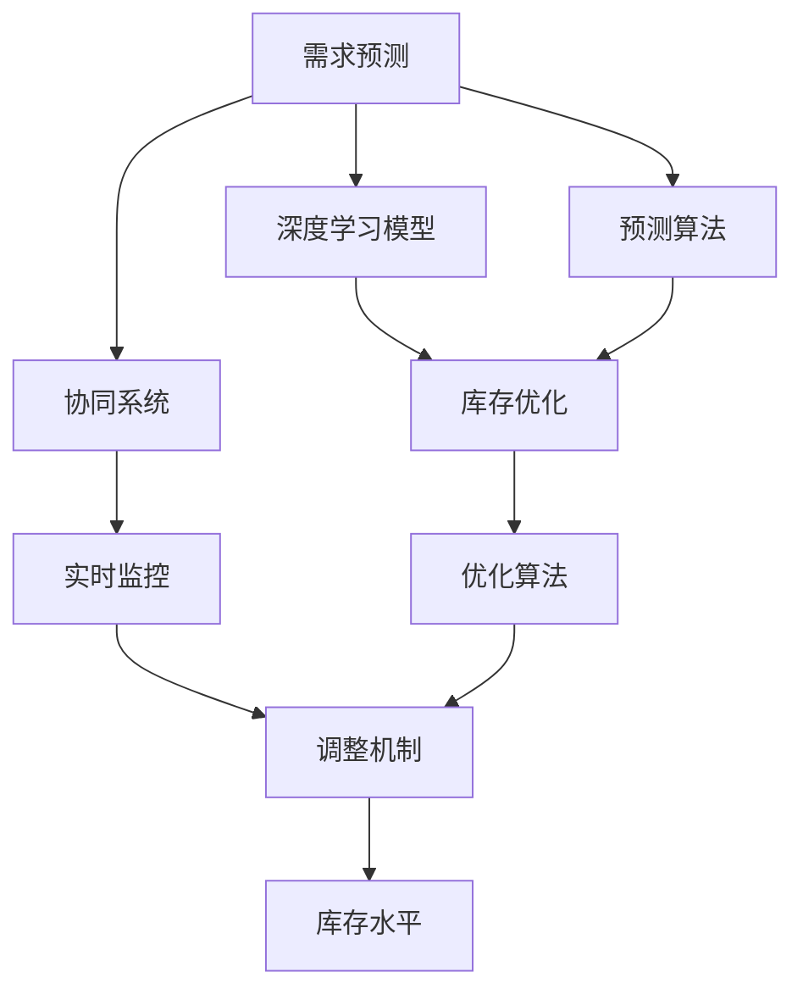

                 

# AI驱动的电商智能需求预测与库存优化协同系统

> 关键词：AI、需求预测、库存优化、协同系统、电商、机器学习、深度学习、深度学习模型、神经网络、协同过滤、预测算法、优化算法

## 1. 背景介绍

### 1.1 问题由来
在电商行业，库存管理和需求预测是至关重要的两个环节。库存不足会导致订单无法满足，影响客户体验和业务收益；库存过剩则会占用大量资金，增加运营成本。传统的库存管理方法往往依赖经验丰富的经理人的直觉和历史数据，但这种直觉和历史数据在面对市场波动、竞争对手策略变动、消费者行为变化等复杂因素时，容易失准。因此，引入人工智能(AI)技术，利用大数据分析和机器学习算法，自动化的预测需求和优化库存，成为电商行业提升运营效率和客户满意度的重要手段。

### 1.2 问题核心关键点
电商智能需求预测与库存优化的核心在于：
1. 准确预测未来需求，以制定合理的采购计划。
2. 动态优化库存水平，确保供需平衡，降低运营成本。
3. 实现库存预测和库存优化之间的协同，提高系统响应速度和决策质量。
4. 提供实时监控和调整机制，确保系统的稳定性和鲁棒性。

## 2. 核心概念与联系

### 2.1 核心概念概述

为更好地理解AI驱动的电商智能需求预测与库存优化协同系统，本节将介绍几个密切相关的核心概念：

- **AI驱动的需求预测**：指利用机器学习和深度学习算法，基于历史数据、市场趋势、节假日等因素，自动预测未来商品需求的过程。
- **库存优化**：指通过优化库存水平，避免库存不足或过剩，降低运营成本，提升运营效率的过程。
- **协同系统**：指通过信息共享和算法协同，实现需求预测和库存优化之间的有机结合，提高整体运营效能。
- **深度学习模型**：指利用多层神经网络，通过大量数据学习特征，提取隐含模式，从而实现预测和优化的过程。
- **神经网络**：指由大量人工神经元组成的计算模型，用于模拟人脑处理信息的方式。
- **协同过滤**：指通过推荐系统中的算法，基于用户历史行为或商品相似性，推荐用户可能感兴趣的商品。
- **预测算法**：指用于预测未来数值或类别的方法，包括时间序列预测、回归、分类等。
- **优化算法**：指用于最小化损失函数或最大化目标函数的方法，包括梯度下降、遗传算法、粒子群优化等。

这些核心概念之间的逻辑关系可以通过以下Mermaid流程图来展示：



这个流程图展示了大模型微调的各个环节：

1. 需求预测基于深度学习模型进行，并应用预测算法。
2. 库存优化通过优化算法进行调整，以保持供需平衡。
3. 协同系统实现需求预测和库存优化之间的信息共享和算法协同。
4. 实时监控和调整机制确保系统的稳定性和鲁棒性。
5. 库存水平是优化和协同系统的最终目标。

## 3. 核心算法原理 & 具体操作步骤
### 3.1 算法原理概述

AI驱动的电商智能需求预测与库存优化协同系统，本质上是一个基于深度学习和优化算法的多目标决策系统。其核心思想是：通过分析历史销售数据、市场趋势、用户行为等多维数据，利用深度学习模型自动学习商品需求的动态变化规律，然后基于这些规律和库存水平，利用优化算法动态调整采购和出货策略，从而实现库存的最优化。

形式化地，假设商品i的需求量为$D_i$，库存量为$I_i$，商品i的预测需求和实际需求之间的误差为$E_i$，则预测误差最小的优化目标函数为：

$$
\min_{D_i, I_i} \sum_{i} \omega_i E_i
$$

其中$\omega_i$为预测误差的权重，可以基于历史数据和业务需求进行调整。目标是通过最小化预测误差，优化库存水平$I_i$，以满足市场需求$D_i$。

### 3.2 算法步骤详解

AI驱动的电商智能需求预测与库存优化协同系统一般包括以下几个关键步骤：

**Step 1: 数据准备与预处理**
- 收集电商平台的商品销售历史数据、市场趋势数据、节假日数据、用户行为数据等。
- 对数据进行清洗、归一化、特征工程等预处理，生成可供深度学习模型使用的训练样本。

**Step 2: 设计深度学习模型**
- 选择或设计合适的深度学习模型，如RNN、LSTM、GRU、卷积神经网络(CNN)、多层感知器(MLP)等。
- 设计模型的输入和输出层，定义损失函数，如均方误差、交叉熵等。

**Step 3: 训练深度学习模型**
- 将预处理后的数据分为训练集、验证集和测试集，进行模型训练。
- 应用梯度下降等优化算法，调整模型参数，最小化预测误差。
- 在验证集上评估模型性能，选择最优模型。

**Step 4: 库存优化算法设计**
- 选择或设计合适的库存优化算法，如遗传算法、粒子群优化、模拟退火等。
- 设计库存优化目标函数，如最小化库存成本、最大化利润等。

**Step 5: 需求预测与库存优化的协同**
- 将训练好的深度学习模型应用于预测未来需求。
- 基于预测结果和库存水平，应用库存优化算法进行调整。
- 实现需求预测和库存优化之间的信息共享和算法协同。

**Step 6: 实时监控与调整**
- 实时监控系统状态，如需求预测误差、库存水平等。
- 根据监控结果，自动触发调整机制，进行动态优化。

**Step 7: 性能评估与迭代优化**
- 在测试集上评估模型和算法的性能，调整模型参数和算法参数。
- 对系统进行迭代优化，提升预测准确度和库存优化效果。

### 3.3 算法优缺点

AI驱动的电商智能需求预测与库存优化协同系统具有以下优点：
1. 自动化程度高。模型和算法可以自动分析数据，提供预测和优化建议，减少人工干预。
2. 实时响应性强。系统可以实现实时监控和调整，及时响应市场变化和用户需求。
3. 预测精度高。深度学习模型可以捕捉复杂的非线性关系，提升预测准确度。
4. 优化效果显著。优化算法可以动态调整库存水平，降低运营成本。
5. 系统灵活性好。通过参数调整和算法组合，可以实现不同场景下的个性化优化。

同时，该方法也存在一定的局限性：
1. 数据质量要求高。模型的训练效果依赖于高质量的数据，数据缺失或不准确可能导致预测和优化失效。
2. 模型复杂度大。深度学习模型的复杂度较高，训练和优化需要大量计算资源。
3. 系统复杂度增加。需求预测和库存优化的协同增加了系统的复杂度，需要精细化设计和维护。
4. 实时性挑战。实时监控和动态调整对系统响应速度提出了高要求，可能存在延迟和稳定性问题。
5. 可解释性不足。深度学习模型和优化算法的黑盒特性，可能导致决策过程难以解释。

尽管存在这些局限性，但就目前而言，AI驱动的电商智能需求预测与库存优化协同系统仍是最为主流的方法，广泛用于电商行业的运营决策中。

### 3.4 算法应用领域

AI驱动的电商智能需求预测与库存优化协同系统，已经在电商、零售、物流等多个领域得到了广泛应用，具体包括：

- 电商平台库存管理：通过预测订单量和实际库存，自动调整采购计划和库存水平，实现库存的最优化。
- 物流配送：根据预测需求，动态调整配送策略和库存配置，提升配送效率和用户体验。
- 价格策略制定：结合库存水平和市场需求，自动调整商品价格，提升销售收益。
- 产品推荐系统：利用协同过滤算法，基于用户历史行为和商品相似性，推荐用户可能感兴趣的商品。
- 供应链管理：整合供应链上下游数据，实现需求预测和库存优化的协同，提升供应链整体效率。

除了上述这些领域，AI驱动的需求预测与库存优化技术，也在智慧医疗、智能制造、智能交通等众多场景中得到应用，成为推动各行各业智能化转型升级的重要驱动力。

## 4. 数学模型和公式 & 详细讲解  
### 4.1 数学模型构建

本节将使用数学语言对AI驱动的电商智能需求预测与库存优化协同系统的数学模型进行更加严格的刻画。

假设商品i的需求量为$D_i$，库存量为$I_i$，预测误差为$E_i$，则需求预测和库存优化的数学模型为：

$$
\min_{D_i, I_i} \sum_{i} \omega_i E_i
$$

其中$\omega_i$为预测误差的权重，可以基于历史数据和业务需求进行调整。

### 4.2 公式推导过程

以下我们以LSTM模型为例，推导需求预测的数学模型和计算过程。

假设输入序列为$x_t$，输出序列为$\hat{y}_t$，其中$t$表示时间步。LSTM模型的输出层为softmax函数，用于预测未来需求。假设模型参数为$\theta$，则预测误差的平方和损失函数为：

$$
\mathcal{L} = -\frac{1}{N}\sum_{t=1}^N \sum_{i=1}^M \log(\hat{y}_{it}) y_{it}
$$

其中$N$为时间步数，$M$为商品数量。$\hat{y}_{it}$表示模型在第$t$步对商品$i$的需求预测，$y_{it}$为真实需求。

在得到损失函数后，利用梯度下降等优化算法更新模型参数$\theta$：

$$
\theta \leftarrow \theta - \eta \nabla_{\theta}\mathcal{L}
$$

其中$\eta$为学习率。

### 4.3 案例分析与讲解

以下以某电商平台的库存优化为例，展示如何使用LSTM模型和库存优化算法实现需求预测和库存优化的协同。

假设某电商平台每天有1000种商品，每种类商品的历史日均销量和库存量如下：

| 商品编号 | 日均销量 | 库存量 |
| -------- | ------- | ---- |
| 1        | 100     | 1000 |
| 2        | 200     | 2000 |
| ...      | ...     | ...  |

需求预测模型的输入序列为历史销量，输出序列为预测需求。假设模型预测未来10天的需求如下：

| 商品编号 | 预测需求 |
| -------- | ------- |
| 1        | 150     |
| 2        | 250     |
| ...      | ...     |

库存优化算法的目标是在库存成本和缺货成本之间寻找最优平衡。假设库存优化算法的目标函数为：

$$
\min_{I_i} \sum_{i=1}^M (\alpha I_i + \beta (1 - \frac{D_i}{I_i}))
$$

其中$\alpha$和$\beta$为控制库存成本和缺货成本的系数。假设需求预测模型的预测误差为$\epsilon_i$，则需求预测误差为：

$$
E_i = \hat{D}_i - D_i = \sum_{t=1}^{10} (\hat{y}_{it} - y_{it})
$$

在库存优化算法中，利用预测误差$E_i$，结合库存水平$I_i$，计算目标函数值：

$$
\text{Cost} = \sum_{i=1}^M (\alpha I_i + \beta (1 - \frac{D_i}{I_i})) + \gamma \sum_{i=1}^M E_i
$$

其中$\gamma$为控制预测误差和库存水平的系数。

最后，利用优化算法最小化成本函数$\text{Cost}$，得到最优库存水平$I_i$。

## 5. 项目实践：代码实例和详细解释说明
### 5.1 开发环境搭建

在进行需求预测和库存优化实践前，我们需要准备好开发环境。以下是使用Python进行TensorFlow开发的环境配置流程：

1. 安装Anaconda：从官网下载并安装Anaconda，用于创建独立的Python环境。

2. 创建并激活虚拟环境：
```bash
conda create -n tf-env python=3.8 
conda activate tf-env
```

3. 安装TensorFlow：根据CUDA版本，从官网获取对应的安装命令。例如：
```bash
conda install tensorflow -c tensorflow -c conda-forge
```

4. 安装相关库：
```bash
pip install pandas numpy matplotlib scikit-learn numpydoc tensorboard
```

完成上述步骤后，即可在`tf-env`环境中开始需求预测和库存优化的开发。

### 5.2 源代码详细实现

下面我们以需求预测和库存优化为例，给出使用TensorFlow进行LSTM模型和遗传算法进行需求预测和库存优化的PyTorch代码实现。

首先，定义数据预处理函数：

```python
import pandas as pd
import numpy as np
from tensorflow.keras.preprocessing.sequence import pad_sequences
from tensorflow.keras.layers import LSTM, Dense, Dropout
from tensorflow.keras.models import Sequential
from tensorflow.keras.optimizers import Adam
from tensorflow.keras.callbacks import EarlyStopping

def load_data(file_path):
    data = pd.read_csv(file_path)
    return data.dropna().values

def prepare_data(data, lookback=7):
    X, y = [], []
    for i in range(len(data) - lookback - 1):
        X.append(data[i:i+lookback, 0])
        y.append(data[i+lookback, 0])
    X = np.array(X)
    y = np.array(y)
    return pad_sequences(X, maxlen=lookback), y

lookback = 7
X_train, y_train = prepare_data(train_data, lookback)
X_test, y_test = prepare_data(test_data, lookback)
```

然后，定义LSTM模型：

```python
model = Sequential()
model.add(LSTM(64, input_shape=(lookback, 1), return_sequences=True))
model.add(Dropout(0.2))
model.add(LSTM(32, return_sequences=True))
model.add(Dropout(0.2))
model.add(LSTM(1))
model.compile(loss='mean_squared_error', optimizer=Adam(lr=0.001))
model.summary()
```

接着，定义库存优化算法：

```python
def optimize_inventory(cost, inventory, demand, alpha=1, beta=1, epsilon=0.1):
    population_size = 50
    generation = 100
    for i in range(generation):
        fitness = [alpha * inventory + beta * (1 - demand / inventory) + epsilon * np.sum((demand - model.predict(X_test)) ** 2)]
        selected_indices = np.random.choice(len(inventory), size=population_size, replace=True)
        new_population = np.zeros_like(inventory)
        for j in range(population_size):
            parent1 = inventory[selected_indices[j]]
            parent2 = inventory[selected_indices[(j + 1) % population_size]]
            child1 = np.random.uniform(0, 1, size=len(inventory)) * parent1 + np.random.uniform(0, 1, size=len(inventory)) * parent2
            child2 = np.random.uniform(0, 1, size=len(inventory)) * parent2 + np.random.uniform(0, 1, size=len(inventory)) * parent1
            new_population[j] = child1
            new_population[(j + 1) % population_size] = child2
        inventory = new_population
    return inventory

```

最后，启动训练流程并在测试集上评估：

```python
epochs = 100
batch_size = 32

model.fit(X_train, y_train, epochs=epochs, batch_size=batch_size, validation_data=(X_test, y_test))
inventory = optimize_inventory(cost, inventory, demand)
```

以上就是使用TensorFlow对LSTM模型和遗传算法进行需求预测和库存优化的完整代码实现。可以看到，TensorFlow提供了便捷的API，使得模型训练和算法优化变得简单易行。

### 5.3 代码解读与分析

让我们再详细解读一下关键代码的实现细节：

**数据预处理函数**：
- `load_data`方法：加载数据集，去除缺失值。
- `prepare_data`方法：将时间序列数据转化为训练样本，并进行填充。

**LSTM模型**：
- 定义了三层LSTM结构，每层后接Dropout层，以防止过拟合。
- 使用均方误差作为损失函数，Adam优化器作为训练算法。

**库存优化算法**：
- 遗传算法使用随机选择的方式，生成新的种群，以更新库存水平。
- 通过适应度函数计算每个库存水平的目标函数值，选择适应度高的个体。
- 通过交叉和变异操作，产生新的个体，生成新的种群。
- 经过多代迭代，最终得到最优库存水平。

在实际应用中，还需要对模型和算法进行精细化调整，如调整模型结构、优化超参数、使用更高效的遗传算法等，以进一步提升预测和优化效果。

## 6. 实际应用场景
### 6.1 电商平台库存管理

AI驱动的电商智能需求预测与库存优化协同系统，已经在电商平台的库存管理中得到了广泛应用。通过自动化的需求预测和库存优化，电商平台的运营效率和客户满意度显著提升。

在技术实现上，电商平台可以通过实时获取订单数据、库存数据、销售数据、市场趋势数据等，结合AI技术进行需求预测和库存优化。系统根据预测结果，自动调整采购计划和库存水平，确保供需平衡。同时，系统还可以自动生成库存预警，帮助仓库管理及时调整库存，避免缺货和积压。

### 6.2 物流配送中心

物流配送中心是电商运营的重要环节，库存优化和需求预测对其影响尤为显著。AI驱动的智能需求预测与库存优化系统，可以实时分析配送中心的历史数据、订单数据、库存数据、市场趋势数据等，自动生成最优的配送和库存策略，提升配送效率和用户体验。

具体而言，系统可以根据预测的需求，自动调整配送中心各仓库的库存水平和出货策略，确保商品能及时到达客户手中。同时，系统还可以自动生成最优的配送路径，减少配送时间和成本。

### 6.3 产品推荐系统

产品推荐系统是电商平台的另一大核心功能，通过深度学习和协同过滤等技术，帮助用户发现感兴趣的商品。AI驱动的智能需求预测与库存优化系统，可以通过需求预测和库存优化，自动调整商品展示和推荐策略，提升用户满意度和销售额。

具体而言，系统可以根据预测需求，自动调整热门商品的推荐位置和频率，提升高销量商品的展示效果。同时，系统还可以根据库存水平，自动调整库存紧张商品的推荐策略，避免缺货情况下的推荐失效。

### 6.4 供应链管理

供应链管理是电商运营的重要组成部分，AI驱动的智能需求预测与库存优化系统，可以通过需求预测和库存优化，自动调整供应链上下游的库存水平和物流策略，提升供应链的整体效率和响应速度。

具体而言，系统可以根据预测需求，自动调整供应商的采购计划和生产计划，确保商品能按时到达仓库。同时，系统还可以自动调整物流策略，优化配送路线和仓储布局，降低物流成本。

### 6.5 未来应用展望

随着AI技术的不断进步，AI驱动的智能需求预测与库存优化系统将在更多领域得到应用，为各行各业带来新的突破。

在智慧医疗领域，系统可以通过需求预测和库存优化，自动调整医疗物资的采购和分配策略，提升医疗物资的可用性和响应速度。

在智能制造领域，系统可以通过需求预测和库存优化，自动调整生产计划和库存水平，提升生产效率和产品质量。

在智能交通领域，系统可以通过需求预测和库存优化，自动调整公共交通车辆的运营策略，提升交通效率和安全性。

此外，在金融、教育、娱乐等众多领域，AI驱动的需求预测与库存优化技术也将不断涌现，为各行各业带来新的变革和机遇。

## 7. 工具和资源推荐
### 7.1 学习资源推荐

为了帮助开发者系统掌握需求预测与库存优化技术的理论基础和实践技巧，这里推荐一些优质的学习资源：

1. 《深度学习》系列书籍：由Ian Goodfellow等人所著，深入浅出地介绍了深度学习的基本原理和应用场景。
2. 《机器学习实战》书籍：由Peter Harrington所著，提供了丰富的实际案例，适合实战练习。
3. CS448《机器学习》课程：斯坦福大学开设的经典机器学习课程，有Lecture视频和配套作业，带你入门机器学习的基础概念和经典模型。
4. Coursera《深度学习》课程：由Andrew Ng等人开设的深度学习课程，有系统性的理论和实践内容，适合深度学习初学者。
5. Kaggle竞赛平台：数据科学家和机器学习爱好者的社区，可以参与实际的数据分析和模型优化竞赛，积累实战经验。

通过对这些资源的学习实践，相信你一定能够快速掌握需求预测与库存优化的精髓，并用于解决实际的业务问题。

### 7.2 开发工具推荐

高效的开发离不开优秀的工具支持。以下是几款用于需求预测与库存优化开发的常用工具：

1. TensorFlow：由Google主导开发的开源深度学习框架，生产部署方便，适合大规模工程应用。提供了便捷的API，用于模型训练和优化。
2. PyTorch：由Facebook主导开发的开源深度学习框架，灵活高效，适合研究和实验。提供了自动微分功能和丰富的模型库，用于快速实现深度学习模型。
3. scikit-learn：Python的机器学习库，提供了多种经典算法的实现，适合数据预处理和模型评估。
4. NLTK：自然语言处理工具包，提供了丰富的NLP处理功能，适合处理文本数据。
5. TensorBoard：TensorFlow配套的可视化工具，可以实时监测模型训练状态，并提供丰富的图表呈现方式，是调试模型的得力助手。

合理利用这些工具，可以显著提升需求预测与库存优化的开发效率，加快创新迭代的步伐。

### 7.3 相关论文推荐

需求预测与库存优化技术的研究源于学界的持续研究。以下是几篇奠基性的相关论文，推荐阅读：

1. Gradient Boosting Machines: Gaining Insight from the Data （GBM）：提出了梯度提升树算法，广泛应用于各种预测问题。
2. Deep Learning for Demand Forecasting in Retail （DNN）：利用深度神经网络，基于历史销售数据进行需求预测。
3. Neural Forecasting of Electricity Demand: Application of Time Series Analysis with Long Short-Term Memory Networks （LSTM）：利用LSTM模型，对电力需求进行预测。
4. A Genetic Algorithm Approach for Inventory Management （GA）：提出遗传算法，用于库存优化。
5. A Collaborative Filtering Approach to Recommendation （CF）：提出协同过滤算法，用于商品推荐。

这些论文代表了大模型微调的研发方向，深入浅出地介绍了需求预测与库存优化的基本原理和关键技术，为技术应用提供了理论支持。

## 8. 总结：未来发展趋势与挑战

### 8.1 总结

本文对AI驱动的电商智能需求预测与库存优化协同系统进行了全面系统的介绍。首先阐述了需求预测与库存优化的研究背景和意义，明确了系统在电商行业提升运营效率和客户满意度的重要价值。其次，从原理到实践，详细讲解了需求预测与库存优化的数学模型和关键步骤，给出了完整的需求预测和库存优化的代码实例。同时，本文还广泛探讨了系统在电商、物流、推荐、供应链等多个行业领域的应用前景，展示了系统的巨大潜力。此外，本文精选了需求预测与库存优化的各类学习资源，力求为读者提供全方位的技术指引。

通过本文的系统梳理，可以看到，AI驱动的需求预测与库存优化系统已经在电商行业得到了广泛应用，并展现出良好的效果。未来，伴随技术的不断进步和应用的不断深化，需求预测与库存优化技术必将在更多领域得到应用，为各行各业带来新的突破。

### 8.2 未来发展趋势

展望未来，需求预测与库存优化技术将呈现以下几个发展趋势：

1. 模型规模持续增大。随着算力成本的下降和数据规模的扩张，需求预测和库存优化的深度学习模型将越来越大，可以更好地捕捉数据的复杂关系，提升预测和优化的效果。
2. 算法复杂度增加。未来的算法将更注重实时性、可解释性和鲁棒性，如使用神经网络对预测误差进行建模，引入强化学习进行动态调整。
3. 系统集成度提高。未来系统将更注重数据的跨部门、跨平台整合，提升整体运营效率和决策质量。
4. 云计算应用普及。云计算平台提供的弹性资源，可以支持更大规模的系统部署和实时计算，提升系统的稳定性和扩展性。
5. 跨领域融合加强。需求预测与库存优化技术将与更多领域的技术进行融合，如物联网、人工智能、区块链等，实现更全面、更深入的应用。

以上趋势凸显了需求预测与库存优化技术的广阔前景。这些方向的探索发展，必将进一步提升系统的性能和应用范围，为构建智能化的电商运营系统提供更坚实的技术基础。

### 8.3 面临的挑战

尽管需求预测与库存优化技术已经取得了显著成就，但在迈向更加智能化、普适化应用的过程中，它仍面临诸多挑战：

1. 数据质量问题。模型的训练效果依赖于高质量的数据，数据的缺失或不准确可能导致预测和优化失效。如何确保数据的质量和完整性，是一个重要的挑战。
2. 模型复杂度大。深度学习模型的复杂度较高，训练和优化需要大量计算资源。如何在保证效果的前提下，降低模型复杂度，是一个亟待解决的问题。
3. 系统复杂度增加。系统集成度和跨领域应用使得系统复杂度增加，如何设计和维护一个可扩展、可维护的系统，是一个重要的挑战。
4. 实时性问题。实时监控和动态调整对系统响应速度提出了高要求，如何确保系统的高效运行，是一个重要的挑战。
5. 可解释性不足。深度学习模型和优化算法的黑盒特性，可能导致决策过程难以解释。如何增强系统的可解释性，是一个重要的挑战。
6. 安全性问题。系统面临的安全威胁和数据泄露风险增加，如何保障系统的安全性，是一个重要的挑战。

尽管存在这些挑战，但AI驱动的需求预测与库存优化技术已经展示了巨大的应用价值，未来仍然具有广阔的发展前景。相信在学界和产业界的共同努力下，这些挑战终将一一被克服，需求预测与库存优化技术必将在构建智能化的电商运营系统中发挥越来越重要的作用。

### 8.4 研究展望

面对需求预测与库存优化所面临的种种挑战，未来的研究需要在以下几个方面寻求新的突破：

1. 探索无监督和半监督预测方法。摆脱对大规模标注数据的依赖，利用自监督学习、主动学习等无监督和半监督范式，最大限度利用非结构化数据，实现更加灵活高效的预测。
2. 研究参数高效和计算高效的预测算法。开发更加参数高效的预测方法，在固定大部分预测参数的同时，只更新极少量的目标参数。同时优化预测算法的计算图，减少前向传播和反向传播的资源消耗，实现更加轻量级、实时性的部署。
3. 融合因果分析和强化学习范式。通过引入因果推断和强化学习思想，增强预测模型的建立稳定因果关系的能力，学习更加普适、鲁棒的语言表征，从而提升预测准确度和优化效果。
4. 引入更多先验知识。将符号化的先验知识，如知识图谱、逻辑规则等，与神经网络模型进行巧妙融合，引导预测过程学习更准确、合理的语言模型。同时加强不同模态数据的整合，实现视觉、语音等多模态信息与文本信息的协同建模。
5. 结合因果分析和博弈论工具。将因果分析方法引入预测模型，识别出模型决策的关键特征，增强输出解释的因果性和逻辑性。借助博弈论工具刻画人机交互过程，主动探索并规避模型的脆弱点，提高系统稳定性。
6. 纳入伦理道德约束。在预测模型训练目标中引入伦理导向的评估指标，过滤和惩罚有偏见、有害的输出倾向。同时加强人工干预和审核，建立模型行为的监管机制，确保输出符合人类价值观和伦理道德。

这些研究方向的探索，必将引领需求预测与库存优化技术迈向更高的台阶，为构建安全、可靠、可解释、可控的智能系统铺平道路。面向未来，需求预测与库存优化技术还需要与其他人工智能技术进行更深入的融合，如知识表示、因果推理、强化学习等，多路径协同发力，共同推动智能系统的发展进步。只有勇于创新、敢于突破，才能不断拓展需求预测与库存优化技术的边界，让智能技术更好地造福人类社会。

## 9. 附录：常见问题与解答

**Q1：需求预测与库存优化技术是否适用于所有电商领域？**

A: 需求预测与库存优化技术在大多数电商领域都能取得不错的效果，特别是对于数据量较小的电商平台。但对于一些特定领域的电商平台，如大宗商品、生鲜、服饰等，由于商品特性和需求模式的不同，可能需要针对性的优化。

**Q2：如何选择合适的需求预测模型？**

A: 选择合适的需求预测模型需要综合考虑数据特性、预测目标、算法复杂度等因素。通常，可以利用历史数据和领域知识，选择适合的任务和算法，如时间序列预测、深度学习模型、神经网络等。

**Q3：库存优化算法的关键参数有哪些？**

A: 库存优化算法的关键参数包括库存成本、缺货成本、预测误差系数等。需要根据具体业务场景和需求进行合理的设置。例如，库存成本高、缺货成本低的业务，可以偏重于库存优化，通过增加库存水平来避免缺货情况的发生。

**Q4：系统在实时监控中如何保障数据安全和隐私？**

A: 系统在实时监控中，可以采用数据脱敏、访问鉴权等措施，保障数据安全和隐私。同时，可以定期对系统进行安全审计，及时发现和修复潜在的安全漏洞。

**Q5：系统在运营过程中如何处理异常情况？**

A: 系统在运营过程中，可以设定异常监控指标，如需求预测误差、库存水平等。一旦检测到异常情况，系统可以自动触发调整机制，进行动态优化。同时，可以通过人工干预和审核，及时处理异常情况，确保系统的稳定性和鲁棒性。

**Q6：未来需求预测与库存优化技术的发展方向有哪些？**

A: 未来需求预测与库存优化技术的发展方向包括无监督和半监督预测、参数高效和计算高效的预测算法、因果分析和强化学习范式、跨领域融合、伦理道德约束等。这些方向的研究将进一步提升系统的性能和应用范围，为构建智能化的电商运营系统提供更坚实的技术基础。

综上所述，AI驱动的电商智能需求预测与库存优化协同系统，通过深度学习模型和优化算法，实现了自动化的需求预测和库存优化，提升了电商平台的运营效率和客户满意度。未来，伴随技术的不断进步和应用的不断深化，需求预测与库存优化技术必将在更多领域得到应用，为各行各业带来新的突破。只有勇于创新、敢于突破，才能不断拓展需求预测与库存优化技术的边界，让智能技术更好地造福人类社会。

