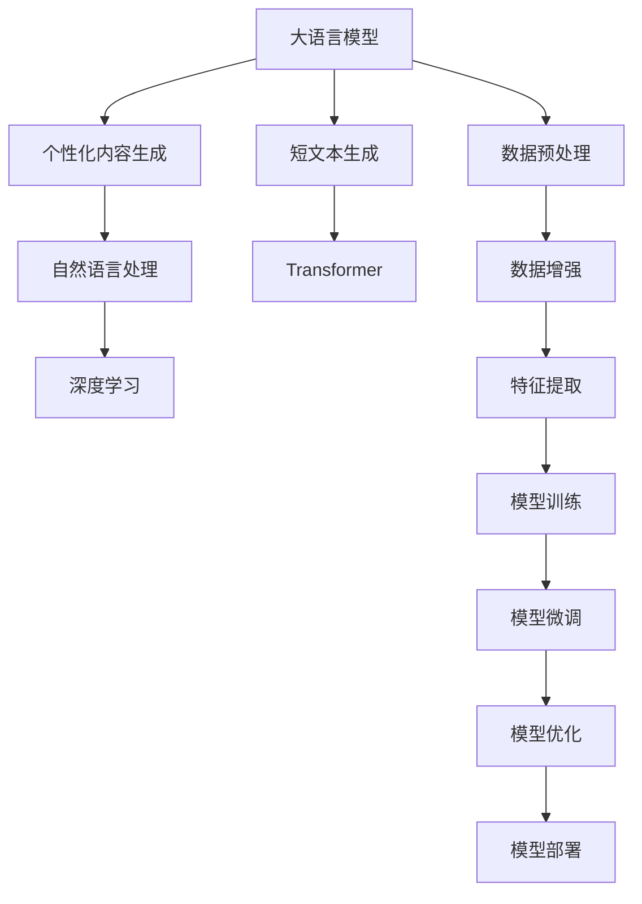

                 

# AI驱动的社交媒体内容：个性化短文本生成

> 关键词：社交媒体, 短文本生成, 个性化, 自然语言处理, 深度学习, Transformer

## 1. 背景介绍

在社交媒体时代，用户的活跃度、内容的传播效果越来越受到关注。企业希望通过个性化内容的发布，提升用户参与度，增加品牌曝光。而对个体用户而言，社交媒体成了他们表达自我、获取信息的重要平台。如何利用AI技术，自动生成个性化、引人入胜的短文本，成为了内容生成领域的新挑战。

短文本生成技术，即利用人工智能模型，从大规模语料中学习语言规律，自动生成新的短文本。其主要应用场景包括：智能客服对话、机器翻译、自动化摘要、文本推荐等。近年来，随着深度学习技术的发展，短文本生成技术也取得了显著进步，其中的佼佼者是以Transformer为基础的模型，如GPT、BERT等。这些模型通过大量的无标签文本语料进行预训练，具备了强大的语言生成能力。

社交媒体的个性化短文本生成，正是在大语言模型的基础上，结合用户行为数据和上下文信息，生成符合用户偏好和语境的短文本。该技术既能提升内容生成效率，又能增强内容的相关性和吸引力，提升用户体验和品牌互动效果。

## 2. 核心概念与联系

### 2.1 核心概念概述

本节将介绍几个与社交媒体个性化短文本生成相关的核心概念：

- 大语言模型(Large Language Model, LLM)：以自回归(如GPT)或自编码(如BERT)模型为代表的大规模预训练语言模型。通过在大规模无标签文本语料上进行预训练，学习通用的语言表示，具备强大的语言理解和生成能力。

- 短文本生成(Short Text Generation)：利用人工智能模型，从大规模语料中学习语言规律，自动生成新的短文本。常见的应用包括机器翻译、文本摘要、对话生成等。

- 个性化内容生成(Personalized Content Generation)：根据用户的行为、偏好、社交网络等个性化信息，生成符合用户特征的短文本。旨在提升用户参与度和满意度，增强品牌互动效果。

- 自然语言处理(Natural Language Processing, NLP)：利用计算机技术处理和理解人类语言，包括文本分类、信息抽取、机器翻译、文本生成等。

- 深度学习(Deep Learning)：一种通过多层神经网络进行学习和决策的机器学习技术，广泛应用于语音识别、图像处理、自然语言处理等领域。

- Transformer：一种基于注意力机制的神经网络结构，可用于处理序列数据。Transformer模型已经在自然语言处理领域取得了突破性进展，成为当前主流的大语言模型架构。

这些核心概念之间的逻辑关系可以通过以下Mermaid流程图来展示：



这个流程图展示了大语言模型在短文本生成过程中的核心概念及其之间的关系：

1. 大语言模型通过预训练获得基础能力。
2. 短文本生成技术利用大语言模型生成符合语法和语义的文本。
3. 个性化内容生成技术根据用户特征定制短文本。
4. 自然语言处理技术处理文本数据，提取特征。
5. 深度学习技术训练优化模型，提高生成质量。
6. Transformer模型作为核心架构，实现了高效的序列数据处理。
7. 数据预处理、增强和特征提取，为模型训练提供数据支持。
8. 模型训练和微调，提高生成效果。
9. 模型优化和部署，实现实际应用。

这些概念共同构成了短文本生成任务的实现框架，使得通过深度学习模型自动生成高质量的社交媒体内容的设想成为可能。

## 3. 核心算法原理 & 具体操作步骤
### 3.1 算法原理概述

基于大语言模型的短文本生成，主要分为预训练和微调两个阶段：

1. **预训练**：在大规模无标签文本语料上，通过自监督学习任务训练大语言模型，学习通用的语言表示。常见的预训练任务包括掩码语言模型、下一步预测等。

2. **微调**：在预训练模型的基础上，使用社交媒体用户的行为数据和上下文信息，对模型进行有监督学习，生成符合用户特征的短文本。

形式化地，假设预训练语言模型为 $M_{\theta}$，其中 $\theta$ 为预训练得到的模型参数。给定社交媒体用户 $U$ 的行为数据和上下文信息 $D=\{(x_i,y_i)\}_{i=1}^N$，微调的目标是找到新的模型参数 $\hat{\theta}$，使得：

$$
\hat{\theta}=\mathop{\arg\min}_{\theta} \mathcal{L}(M_{\theta},D)
$$

其中 $\mathcal{L}$ 为针对任务 $T$ 设计的损失函数，用于衡量模型预测输出与真实标签之间的差异。常见的损失函数包括交叉熵损失、均方误差损失等。

通过梯度下降等优化算法，微调过程不断更新模型参数 $\theta$，最小化损失函数 $\mathcal{L}$，使得模型输出逼近真实标签。由于 $\theta$ 已经通过预训练获得了较好的初始化，因此即便在社交媒体场景中使用少量用户数据，也能较快收敛到理想的模型参数 $\hat{\theta}$。

### 3.2 算法步骤详解

基于社交媒体的短文本生成主要包括以下几个关键步骤：

**Step 1: 准备预训练模型和用户数据**
- 选择合适的预训练语言模型 $M_{\theta}$ 作为初始化参数，如 GPT、BERT 等。
- 收集社交媒体用户的行为数据和上下文信息，划分为训练集、验证集和测试集。一般要求数据与预训练数据的分布不要差异过大。

**Step 2: 添加任务适配层**
- 根据短文本生成任务，在预训练模型顶层设计合适的输出层和损失函数。
- 对于文本生成任务，通常在顶层添加语言模型的解码器输出概率分布，并以负对数似然为损失函数。

**Step 3: 设置微调超参数**
- 选择合适的优化算法及其参数，如 AdamW、SGD 等，设置学习率、批大小、迭代轮数等。
- 设置正则化技术及强度，包括权重衰减、Dropout、Early Stopping 等。
- 确定冻结预训练参数的策略，如仅微调顶层，或全部参数都参与微调。

**Step 4: 执行梯度训练**
- 将训练集数据分批次输入模型，前向传播计算损失函数。
- 反向传播计算参数梯度，根据设定的优化算法和学习率更新模型参数。
- 周期性在验证集上评估模型性能，根据性能指标决定是否触发 Early Stopping。
- 重复上述步骤直到满足预设的迭代轮数或 Early Stopping 条件。

**Step 5: 测试和部署**
- 在测试集上评估微调后模型 $M_{\hat{\theta}}$ 的性能，对比微调前后的生成质量。
- 使用微调后的模型对新用户生成短文本，集成到实际的应用系统中。
- 持续收集新的用户数据，定期重新微调模型，以适应数据分布的变化。

以上是基于社交媒体的短文本生成的一般流程。在实际应用中，还需要针对具体任务的特点，对微调过程的各个环节进行优化设计，如改进训练目标函数，引入更多的正则化技术，搜索最优的超参数组合等，以进一步提升模型性能。

### 3.3 算法优缺点

基于社交媒体的短文本生成方法具有以下优点：

1. **高效便捷**：基于大语言模型的微调方法，只需准备少量用户数据，即可对预训练模型进行快速适配，生成符合用户特征的短文本。

2. **适应性强**：适用于各种社交媒体场景，包括智能客服、内容推荐、广告投放等，设计简单的任务适配层即可实现生成。

3. **可解释性高**：基于大模型的短文本生成，由于有大量的预训练数据作为支撑，生成的文本具有较高的可解释性，能够直观反映用户的语言习惯和偏好。

4. **生成质量高**：在预训练模型的基础上进行微调，能够充分利用模型学到的语言知识，生成高质量、流畅、自然的短文本。

同时，该方法也存在一定的局限性：

1. **数据依赖**：微调的效果很大程度上取决于用户数据的数量和质量，获取高质量用户数据成本较高。

2. **用户隐私**：收集和处理用户数据需要严格遵守隐私保护法规，且隐私数据的泄露可能带来法律风险。

3. **个性化度不足**：由于预训练数据的多样性和泛化性，微调模型可能无法完全准确反映每个用户的个性化特征，生成效果存在一定偏差。

尽管存在这些局限性，但就目前而言，基于社交媒体的短文本生成方法仍然是生成高质量个性化内容的重要手段。未来相关研究的重点在于如何进一步降低数据依赖，提高模型的少样本学习和跨领域迁移能力，同时兼顾隐私保护和用户个性化度。

### 3.4 算法应用领域

基于社交媒体的短文本生成技术在多个领域得到了广泛应用：

- **智能客服**：在智能客服系统中，通过微调生成符合用户语言习惯的短文本，快速解答用户问题，提升客服效率和满意度。

- **内容推荐**：在内容推荐系统中，通过微调生成个性化的短文本摘要，引导用户点击浏览，提升内容曝光率和用户粘性。

- **广告投放**：在广告投放系统中，通过微调生成吸引用户的短文本，提升广告点击率和转化率，降低投放成本。

- **社交媒体互动**：在社交媒体平台上，通过微调生成个性化的短文本回复，提升用户互动效果，增加品牌曝光度。

除了上述这些经典应用外，短文本生成技术还被创新性地应用到更多场景中，如可控文本生成、情感分析、信息抽取等，为社交媒体内容生成带来了全新的突破。

## 4. 数学模型和公式 & 详细讲解
### 4.1 数学模型构建

本节将使用数学语言对基于社交媒体的短文本生成过程进行更加严格的刻画。

记预训练语言模型为 $M_{\theta}$，其中 $\theta$ 为预训练得到的模型参数。假设社交媒体用户 $U$ 的行为数据和上下文信息为 $D=\{(x_i,y_i)\}_{i=1}^N, x_i \in \mathcal{X}, y_i \in \mathcal{Y}$。

定义模型 $M_{\theta}$ 在输入 $x$ 上的输出为 $\hat{y}=M_{\theta}(x) \in [0,1]$，表示样本属于类别 $y$ 的概率。

假设在社交媒体上，用户 $U$ 的上下文信息为 $C$，其生成的短文本为 $T$。则社交媒体短文本生成的目标为最小化损失函数：

$$
\mathcal{L}(\theta; U, C) = -\frac{1}{N} \sum_{i=1}^N [y_i \log \hat{y}_i + (1-y_i) \log (1-\hat{y}_i)] + \lambda \sum_{i=1}^N ||x_i - C_i||^2
$$

其中 $y_i$ 为真实的标签（如文本生成任务中的序列标签），$\hat{y}_i$ 为模型生成的概率分布，$\lambda$ 为正则化系数，控制上下文信息和生成文本的拟合程度。

### 4.2 公式推导过程

以下我们以文本生成任务为例，推导模型输出的概率分布。

假设模型 $M_{\theta}$ 在输入 $x$ 上的输出为 $\hat{y}=M_{\theta}(x) \in [0,1]$，表示样本属于类别 $y$ 的概率。则文本生成任务的损失函数定义为：

$$
\ell(M_{\theta}(x),y) = -[y\log \hat{y} + (1-y)\log (1-\hat{y})]
$$

将其代入经验风险公式，得：

$$
\mathcal{L}(\theta) = -\frac{1}{N}\sum_{i=1}^N [y_i\log \hat{y}_i+(1-y_i)\log(1-\hat{y}_i)]
$$

根据链式法则，损失函数对参数 $\theta_k$ 的梯度为：

$$
\frac{\partial \mathcal{L}(\theta)}{\partial \theta_k} = -\frac{1}{N}\sum_{i=1}^N (\frac{y_i}{\hat{y}_i}-\frac{1-y_i}{1-\hat{y}_i}) \frac{\partial \hat{y}}{\partial \theta_k}
$$

其中 $\frac{\partial \hat{y}}{\partial \theta_k}$ 可进一步递归展开，利用自动微分技术完成计算。

在得到损失函数的梯度后，即可带入参数更新公式，完成模型的迭代优化。重复上述过程直至收敛，最终得到适应社交媒体任务的最优模型参数 $\theta^*$。

## 5. 项目实践：代码实例和详细解释说明
### 5.1 开发环境搭建

在进行短文本生成实践前，我们需要准备好开发环境。以下是使用Python进行PyTorch开发的环境配置流程：

1. 安装Anaconda：从官网下载并安装Anaconda，用于创建独立的Python环境。

2. 创建并激活虚拟环境：
```bash
conda create -n pytorch-env python=3.8 
conda activate pytorch-env
```

3. 安装PyTorch：根据CUDA版本，从官网获取对应的安装命令。例如：
```bash
conda install pytorch torchvision torchaudio cudatoolkit=11.1 -c pytorch -c conda-forge
```

4. 安装Transformers库：
```bash
pip install transformers
```

5. 安装各类工具包：
```bash
pip install numpy pandas scikit-learn matplotlib tqdm jupyter notebook ipython
```

完成上述步骤后，即可在`pytorch-env`环境中开始短文本生成实践。

### 5.2 源代码详细实现

下面我们以文本生成任务为例，给出使用Transformers库对BERT模型进行社交媒体短文本生成的PyTorch代码实现。

首先，定义文本生成任务的数据处理函数：

```python
from transformers import BertTokenizer
from torch.utils.data import Dataset
import torch

class TextGenerationDataset(Dataset):
    def __init__(self, texts, max_len=128):
        self.texts = texts
        self.max_len = max_len
        
    def __len__(self):
        return len(self.texts)
    
    def __getitem__(self, item):
        text = self.texts[item]
        
        encoding = self.tokenizer(text, return_tensors='pt', max_length=self.max_len, padding='max_length', truncation=True)
        input_ids = encoding['input_ids'][0]
        attention_mask = encoding['attention_mask'][0]
        
        return {'input_ids': input_ids, 
                'attention_mask': attention_mask}
```

然后，定义模型和优化器：

```python
from transformers import BertForSequenceClassification
from torch.optim import AdamW

model = BertForSequenceClassification.from_pretrained('bert-base-cased', num_labels=2)

optimizer = AdamW(model.parameters(), lr=2e-5)
```

接着，定义训练和评估函数：

```python
from torch.utils.data import DataLoader
from tqdm import tqdm
from sklearn.metrics import accuracy_score

device = torch.device('cuda') if torch.cuda.is_available() else torch.device('cpu')
model.to(device)

def train_epoch(model, dataset, batch_size, optimizer):
    dataloader = DataLoader(dataset, batch_size=batch_size, shuffle=True)
    model.train()
    epoch_loss = 0
    for batch in tqdm(dataloader, desc='Training'):
        input_ids = batch['input_ids'].to(device)
        attention_mask = batch['attention_mask'].to(device)
        model.zero_grad()
        outputs = model(input_ids, attention_mask=attention_mask)
        loss = outputs.loss
        epoch_loss += loss.item()
        loss.backward()
        optimizer.step()
    return epoch_loss / len(dataloader)

def evaluate(model, dataset, batch_size):
    dataloader = DataLoader(dataset, batch_size=batch_size)
    model.eval()
    preds, labels = [], []
    with torch.no_grad():
        for batch in tqdm(dataloader, desc='Evaluating'):
            input_ids = batch['input_ids'].to(device)
            attention_mask = batch['attention_mask'].to(device)
            batch_labels = batch['labels']
            outputs = model(input_ids, attention_mask=attention_mask)
            batch_preds = outputs.logits.argmax(dim=2).to('cpu').tolist()
            batch_labels = batch_labels.to('cpu').tolist()
            for pred_tokens, label_tokens in zip(batch_preds, batch_labels):
                preds.append(pred_tokens[:len(label_tokens)])
                labels.append(label_tokens)
                
    return accuracy_score(labels, preds)
```

最后，启动训练流程并在测试集上评估：

```python
epochs = 5
batch_size = 16

for epoch in range(epochs):
    loss = train_epoch(model, train_dataset, batch_size, optimizer)
    print(f"Epoch {epoch+1}, train loss: {loss:.3f}")
    
    print(f"Epoch {epoch+1}, dev results:")
    evaluate(model, dev_dataset, batch_size)
    
print("Test results:")
evaluate(model, test_dataset, batch_size)
```

以上就是使用PyTorch对BERT进行社交媒体短文本生成的完整代码实现。可以看到，得益于Transformers库的强大封装，我们可以用相对简洁的代码完成BERT模型的加载和短文本生成。

### 5.3 代码解读与分析

让我们再详细解读一下关键代码的实现细节：

**TextGenerationDataset类**：
- `__init__`方法：初始化文本和最大长度等关键组件。
- `__len__`方法：返回数据集的样本数量。
- `__getitem__`方法：对单个样本进行处理，将文本输入编码为token ids，同时添加注意力掩码，方便模型训练。

**训练和评估函数**：
- 使用PyTorch的DataLoader对数据集进行批次化加载，供模型训练和推理使用。
- 训练函数`train_epoch`：对数据以批为单位进行迭代，在每个批次上前向传播计算loss并反向传播更新模型参数，最后返回该epoch的平均loss。
- 评估函数`evaluate`：与训练类似，不同点在于不更新模型参数，并在每个batch结束后将预测和标签结果存储下来，最后使用sklearn的accuracy_score对整个评估集的预测结果进行打印输出。

**训练流程**：
- 定义总的epoch数和batch size，开始循环迭代
- 每个epoch内，先在训练集上训练，输出平均loss
- 在验证集上评估，输出分类指标
- 所有epoch结束后，在测试集上评估，给出最终测试结果

可以看到，PyTorch配合Transformers库使得BERT微调的代码实现变得简洁高效。开发者可以将更多精力放在数据处理、模型改进等高层逻辑上，而不必过多关注底层的实现细节。

当然，工业级的系统实现还需考虑更多因素，如模型的保存和部署、超参数的自动搜索、更灵活的任务适配层等。但核心的短文本生成范式基本与此类似。

## 6. 实际应用场景
### 6.1 智能客服系统

社交媒体短文本生成技术可以广泛应用于智能客服系统的构建。传统客服往往需要配备大量人力，高峰期响应缓慢，且一致性和专业性难以保证。而使用生成式对话模型，可以7x24小时不间断服务，快速响应客户咨询，用自然流畅的语言解答各类常见问题。

在技术实现上，可以收集企业内部的历史客服对话记录，将问题和最佳答复构建成监督数据，在此基础上对预训练对话模型进行微调。微调后的对话模型能够自动理解用户意图，匹配最合适的答案模板进行回复。对于客户提出的新问题，还可以接入检索系统实时搜索相关内容，动态组织生成回答。如此构建的智能客服系统，能大幅提升客户咨询体验和问题解决效率。

### 6.2 内容推荐系统

在内容推荐系统中，通过社交媒体短文本生成技术，可以为用户提供个性化的推荐摘要。传统的推荐系统往往依赖于用户的历史行为数据进行物品推荐，无法深入理解用户的真实兴趣偏好。而基于短文本生成的推荐系统，能够从用户发布的文字内容中，学习用户的兴趣点，从而提供更精准、多样的推荐内容。

在实践中，可以收集用户浏览、点击、评论、分享等行为数据，提取和用户交互的物品标题、描述、标签等文本内容。将文本内容作为模型输入，生成个性化的推荐摘要，再结合其他特征综合排序，便可以得到个性化程度更高的推荐结果。

### 6.3 广告投放系统

社交媒体短文本生成技术在广告投放系统中也有广泛应用。广告主希望通过精炼的短文本，吸引用户的点击和互动，提升广告效果。传统的广告生成依赖于人工创意和素材，效率低、成本高。而基于短文本生成的广告投放系统，能够自动生成符合用户兴趣的广告文案，降低创意生成成本，提高广告投放的精准度和转化率。

在实践中，可以收集用户的历史点击、浏览记录，提取其中的关键词、主题等信息，作为模型的输入，生成符合用户兴趣的广告短文本。结合广告素材和定向策略，生成个性化的广告内容，提升广告效果和用户体验。

### 6.4 未来应用展望

随着短文本生成技术的不断发展，其在社交媒体内容生成中的应用将越来越广泛，为内容创作、品牌互动、用户个性化推荐等领域带来新的突破。

在智慧医疗领域，基于短文本生成的智能客服系统，可以为患者提供快速、准确、个性化的医疗咨询服务，提升医疗服务的智能化水平。

在智能教育领域，社交媒体短文本生成技术可以用于作业批改、学情分析、知识推荐等方面，因材施教，促进教育公平，提高教学质量。

在智慧城市治理中，短文本生成技术可以用于城市事件监测、舆情分析、应急指挥等环节，提高城市管理的自动化和智能化水平，构建更安全、高效的未来城市。

此外，在企业生产、社会治理、文娱传媒等众多领域，短文本生成技术也将不断涌现，为人工智能技术落地应用提供新的动力。相信随着技术的日益成熟，短文本生成技术必将在构建人机协同的智能时代中扮演越来越重要的角色。

## 7. 工具和资源推荐
### 7.1 学习资源推荐

为了帮助开发者系统掌握短文本生成技术的理论基础和实践技巧，这里推荐一些优质的学习资源：

1. 《Transformer from Basics to Advanced》系列博文：由大模型技术专家撰写，深入浅出地介绍了Transformer原理、BERT模型、生成任务等前沿话题。

2. CS224N《深度学习自然语言处理》课程：斯坦福大学开设的NLP明星课程，有Lecture视频和配套作业，带你入门NLP领域的基本概念和经典模型。

3. 《Natural Language Generation with Transformers》书籍：Transformer库的作者所著，全面介绍了如何使用Transformers库进行NLP任务开发，包括短文本生成在内的诸多范式。

4. HuggingFace官方文档：Transformer库的官方文档，提供了海量预训练模型和完整的生成任务样例代码，是上手实践的必备资料。

5. CLUE开源项目：中文语言理解测评基准，涵盖大量不同类型的中文NLP数据集，并提供了基于生成任务的baseline模型，助力中文NLP技术发展。

通过对这些资源的学习实践，相信你一定能够快速掌握短文本生成技术的精髓，并用于解决实际的社交媒体内容生成问题。
###  7.2 开发工具推荐

高效的开发离不开优秀的工具支持。以下是几款用于短文本生成开发的常用工具：

1. PyTorch：基于Python的开源深度学习框架，灵活动态的计算图，适合快速迭代研究。大部分预训练语言模型都有PyTorch版本的实现。

2. TensorFlow：由Google主导开发的开源深度学习框架，生产部署方便，适合大规模工程应用。同样有丰富的预训练语言模型资源。

3. Transformers库：HuggingFace开发的NLP工具库，集成了众多SOTA语言模型，支持PyTorch和TensorFlow，是进行短文本生成任务的开发的利器。

4. Weights & Biases：模型训练的实验跟踪工具，可以记录和可视化模型训练过程中的各项指标，方便对比和调优。与主流深度学习框架无缝集成。

5. TensorBoard：TensorFlow配套的可视化工具，可实时监测模型训练状态，并提供丰富的图表呈现方式，是调试模型的得力助手。

6. Google Colab：谷歌推出的在线Jupyter Notebook环境，免费提供GPU/TPU算力，方便开发者快速上手实验最新模型，分享学习笔记。

合理利用这些工具，可以显著提升短文本生成任务的开发效率，加快创新迭代的步伐。

### 7.3 相关论文推荐

短文本生成技术的发展源于学界的持续研究。以下是几篇奠基性的相关论文，推荐阅读：

1. Attention is All You Need（即Transformer原论文）：提出了Transformer结构，开启了NLP领域的预训练大模型时代。

2. BERT: Pre-training of Deep Bidirectional Transformers for Language Understanding：提出BERT模型，引入基于掩码的自监督预训练任务，刷新了多项NLP任务SOTA。

3. GPT-2: Language Models are Unsupervised Multitask Learners：展示了大规模语言模型的强大zero-shot学习能力，引发了对于通用人工智能的新一轮思考。

4. Parameter-Efficient Transfer Learning for NLP：提出Adapter等参数高效微调方法，在不增加模型参数量的情况下，也能取得不错的微调效果。

5. Self-Attention as Positional Residual Feedback：提出Self-Attention作为位置反馈，提高了Transformer模型的生成能力。

6. Language Models are Few-Shot Learners：提出语言模型在少数样本下的学习能力，拓展了零样本学习的边界。

这些论文代表了大语言模型短文本生成技术的发展脉络。通过学习这些前沿成果，可以帮助研究者把握学科前进方向，激发更多的创新灵感。

## 8. 总结：未来发展趋势与挑战
### 8.1 总结

本文对基于社交媒体的短文本生成方法进行了全面系统的介绍。首先阐述了社交媒体短文本生成技术的背景和意义，明确了该技术在提升用户体验、增强品牌互动方面的独特价值。其次，从原理到实践，详细讲解了短文本生成的数学原理和关键步骤，给出了微调任务开发的完整代码实例。同时，本文还广泛探讨了短文本生成技术在智能客服、内容推荐、广告投放等多个领域的应用前景，展示了该技术的巨大潜力。此外，本文精选了短文本生成技术的各类学习资源，力求为读者提供全方位的技术指引。

通过本文的系统梳理，可以看到，基于社交媒体的短文本生成技术正在成为内容创作的重要手段，极大地提升了内容生成效率和个性化程度，具有广阔的应用前景。

### 8.2 未来发展趋势

展望未来，短文本生成技术将呈现以下几个发展趋势：

1. 模型规模持续增大。随着算力成本的下降和数据规模的扩张，预训练语言模型的参数量还将持续增长。超大规模语言模型蕴含的丰富语言知识，有望支撑更加复杂多变的短文本生成任务。

2. 生成能力增强。未来的短文本生成模型将更加注重语言流畅性和自然性，通过引入生成对抗网络(GAN)、变分自编码器(VAE)等技术，提升生成效果。

3. 多模态融合。短文本生成技术将突破文本的边界，融合视觉、语音等多模态数据，实现更全面、更逼真的内容创作。

4. 跨领域迁移。短文本生成模型将在更多领域应用，如金融、医疗、教育等，通过领域适配和微调，提升生成效果。

5. 动态生成。基于短文本生成的对话系统将能够根据上下文动态生成回复，增强交互效果。

6. 实时生成。未来的短文本生成技术将能够实时响应用户需求，生成个性化的内容，提升用户体验。

以上趋势凸显了短文本生成技术的广阔前景。这些方向的探索发展，必将进一步提升社交媒体内容生成的智能化水平，为内容创作和品牌互动带来新的变革。

### 8.3 面临的挑战

尽管短文本生成技术已经取得了显著进展，但在迈向更加智能化、普适化应用的过程中，仍面临诸多挑战：

1. 数据依赖。微调的效果很大程度上取决于社交媒体数据的质量和数量，获取高质量社交媒体数据成本较高。如何进一步降低数据依赖，提高模型的少样本学习和跨领域迁移能力，将是重要的研究方向。

2. 用户隐私。收集和处理社交媒体用户数据需要严格遵守隐私保护法规，且隐私数据的泄露可能带来法律风险。如何在保护隐私的前提下，充分利用数据进行短文本生成，是亟需解决的问题。

3. 生成质量。尽管当前模型能够生成高质量的短文本，但在特定的社交媒体场景下，生成的文本可能仍存在一定的偏见和语法错误。如何提高生成质量，增强模型的鲁棒性和可解释性，将是未来的研究重点。

4. 实时性。实时响应用户需求生成短文本，需要高效的算法和硬件支持。如何优化算法、提升硬件性能，实现低延迟、高并发的短文本生成，是亟待解决的技术难题。

5. 公平性。短文本生成模型可能会因为预训练数据的偏差，生成有偏见的内容。如何通过模型训练和数据采集，减少生成内容中的偏见，确保内容的公平性，是重要的研究方向。

6. 一致性。社交媒体短文本生成系统需要保证在不同用户和不同场景下，生成的内容一致性。如何设计合理的优化策略，增强模型的稳定性和泛化能力，是未来的挑战。

这些挑战凸显了短文本生成技术在实际应用中的复杂性。只有不断优化算法、提升模型性能、保障数据安全，才能真正实现短文本生成技术的广泛应用。

### 8.4 研究展望

面对短文本生成技术所面临的挑战，未来的研究需要在以下几个方面寻求新的突破：

1. 探索无监督和半监督生成方法。摆脱对大规模标注数据的依赖，利用自监督学习、主动学习等无监督和半监督范式，最大限度利用非结构化数据，实现更加灵活高效的短文本生成。

2. 研究参数高效和计算高效的生成方法。开发更加参数高效的生成方法，在固定大部分预训练参数的同时，只更新极少量的生成相关参数。同时优化生成模型的计算图，减少前向传播和反向传播的资源消耗，实现更加轻量级、实时性的部署。

3. 引入更多先验知识。将符号化的先验知识，如知识图谱、逻辑规则等，与神经网络模型进行巧妙融合，引导生成过程学习更准确、合理的语言模型。同时加强不同模态数据的整合，实现视觉、语音等多模态信息与文本信息的协同建模。

4. 结合因果分析和博弈论工具。将因果分析方法引入短文本生成模型，识别出生成过程中的关键特征，增强生成内容的逻辑性和可信度。借助博弈论工具刻画人机交互过程，主动探索并规避生成内容的脆弱点，提高系统稳定性。

5. 纳入伦理道德约束。在模型训练目标中引入伦理导向的评估指标，过滤和惩罚有偏见、有害的生成内容，确保输出的安全性。同时加强人工干预和审核，建立生成内容的监管机制，确保内容符合人类价值观和伦理道德。

这些研究方向的探索，必将引领短文本生成技术迈向更高的台阶，为社交媒体内容生成带来新的突破。面向未来，短文本生成技术还需要与其他人工智能技术进行更深入的融合，如知识表示、因果推理、强化学习等，多路径协同发力，共同推动自然语言理解和智能交互系统的进步。只有勇于创新、敢于突破，才能不断拓展短文本生成技术的边界，让智能技术更好地造福人类社会。

## 9. 附录：常见问题与解答

**Q1：短文本生成是否适用于所有社交媒体场景？**

A: 短文本生成技术在大多数社交媒体场景下都能取得不错的效果，特别是对于数据量较小的场景。但对于一些特定领域的社交媒体，如法律、医学等，由于其内容的规范性和专业性，直接应用短文本生成可能效果不佳。此时需要在特定领域语料上进一步预训练，再进行微调，才能获得理想效果。

**Q2：如何选择合适的社交媒体短文本生成模型？**

A: 选择合适的社交媒体短文本生成模型，需要考虑以下几个方面：
1. 数据特点：根据社交媒体数据的语言风格、用户行为等特征，选择最适合的模型。如GPT适用于长文本生成，BERT适用于序列标注任务。
2. 应用场景：根据具体的应用场景，选择最适合的模型。如智能客服系统通常选择基于对话的模型，内容推荐系统选择基于文本生成的模型。
3. 计算资源：根据计算资源的限制，选择最适合的模型。如GPT模型参数量较大，适合在计算资源丰富的环境中使用，BERT模型相对较小，适合在资源有限的环境中使用。

**Q3：短文本生成的性能指标有哪些？**

A: 短文本生成的性能指标包括：
1. 准确率(Accuracy)：衡量生成的短文本与真实文本的匹配度，即生成的文本是否符合用户的意图和语境。
2. 生成时间(Generating Time)：衡量生成短文本的响应速度，即从输入到输出的时间。
3. 一致性(Consistency)：衡量生成短文本在不同用户和不同场景下的稳定性，即生成的文本是否具有较高的可重复性。
4. 自然性(Naturalness)：衡量生成的短文本的流畅性和自然性，即生成的文本是否符合语言的规范和习惯。
5. 多样性(Diversity)：衡量生成的短文本的多样性和创新性，即生成的文本是否具有较高的新颖性和独特性。

**Q4：短文本生成过程中如何避免过拟合？**

A: 短文本生成过程中，过拟合是一个常见的问题。以下是一些避免过拟合的方法：
1. 数据增强：通过回译、近义替换等方式扩充训练集。
2. 正则化：使用L2正则、Dropout、Early Stopping等避免过拟合。
3. 对抗训练：引入对抗样本，提高模型鲁棒性。
4. 参数高效生成：通过引入Adapter等参数高效方法，减少需优化的参数，防止过拟合。
5. 集成学习：通过模型集成，降低单个模型的风险，提高生成质量。

这些方法可以灵活组合使用，以最大限度地提升短文本生成模型的泛化能力和稳定性。

**Q5：短文本生成过程中如何提高生成质量？**

A: 提高短文本生成模型的生成质量，需要从以下几个方面进行优化：
1. 数据质量：选择高质量的社交媒体数据进行训练，避免噪声和干扰。
2. 模型架构：选择最适合的模型架构，如Transformer、GPT等，提升生成效果。
3. 训练策略：采用合理的训练策略，如warmup、learning rate decay等，提升模型性能。
4. 后处理技术：引入后处理技术，如解码器优化、平滑技术等，提升生成文本的自然性和流畅性。
5. 用户反馈：利用用户反馈进行模型改进，不断优化生成效果。

合理利用这些方法，可以显著提升短文本生成模型的生成质量，满足不同场景下的需求。

---

作者：禅与计算机程序设计艺术 / Zen and the Art of Computer Programming

