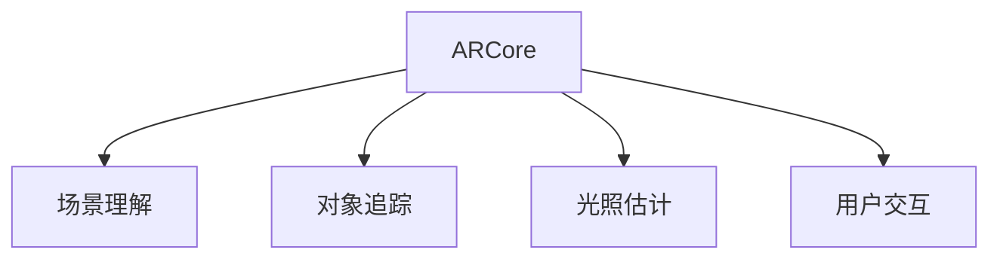

                 

# ARCore 开发工具：在 Android 上构建 AR 应用

> 关键词：ARCore, 增强现实, Android, AR 应用, 开发工具, 深度学习, 机器学习, 计算机视觉, 混合现实

## 1. 背景介绍

### 1.1 问题由来

随着技术的不断发展，增强现实(Augmented Reality, AR)逐渐成为连接虚拟与现实的重要方式。Android系统作为全球最流行的移动平台之一，提供了强大的AR开发框架ARCore，使得开发者能够轻松构建沉浸式的AR应用。然而，对于缺乏AR开发经验的新手开发者而言，面对ARCore复杂的API接口和底层实现，往往难以着手。

### 1.2 问题核心关键点

- **ARCore是什么**：由Google提供的Android AR开发框架，支持深度学习、机器学习、计算机视觉等多种技术，为开发者提供易于使用的AR开发工具。
- **AR应用的关键技术**：包括深度学习模型、计算机视觉算法、图像处理、路径规划等。
- **ARCore的主要功能**：场景理解、对象追踪、光照估计、用户交互等。
- **ARCore的开发挑战**：例如处理动态环境变化、优化性能、保证实时性等。

### 1.3 问题研究意义

掌握ARCore的开发工具，对于构建高质量的AR应用至关重要。ARCore不仅能够提升用户体验，还能为各行各业（如游戏、教育、医疗等）带来新的应用场景和商业机会。通过学习ARCore的开发工具，我们可以更好地理解AR技术，推动其在更广泛领域的应用。

## 2. 核心概念与联系

### 2.1 核心概念概述

- **ARCore**：Google提供的增强现实开发框架，基于计算机视觉和机器学习技术，支持多种AR功能。
- **场景理解(Scene Understanding)**：通过摄像头捕捉环境信息，识别并理解场景中的物体、人脸、手势等。
- **对象追踪(Object Tracking)**：在移动设备中实时追踪和定位用户关注的对象。
- **光照估计(Light Estimation)**：根据环境光照条件，计算物体和场景的亮度和颜色。
- **用户交互(User Interaction)**：通过手势、语音等自然交互方式，与AR应用进行互动。

### 2.2 核心概念原理和架构的 Mermaid 流程图



这个流程图展示了ARCore与各核心功能之间的联系：

1. **ARCore** 提供整体框架，支持 **场景理解**、 **对象追踪**、 **光照估计**、 **用户交互** 等核心功能。
2. **场景理解** 通过 **计算机视觉** 和 **深度学习** 技术，识别环境中的物体和环境变化。
3. **对象追踪** 使用 **图像处理** 技术，实时追踪用户关注的物体。
4. **光照估计** 利用 **机器学习** 模型，计算场景的光照条件，提供准确的渲染效果。
5. **用户交互** 通过 **自然交互** 技术，如手势、语音等，增强用户体验。

## 3. 核心算法原理 & 具体操作步骤

### 3.1 算法原理概述

ARCore基于计算机视觉和机器学习算法，提供了丰富的AR功能，例如场景理解、对象追踪、光照估计等。其主要算法原理如下：

- **深度学习**：用于场景理解和对象追踪，通过神经网络模型提取特征，识别环境中的物体。
- **计算机视觉**：用于场景理解和光照估计，通过图像处理算法，计算环境光照和物体颜色。
- **图像处理**：用于对象追踪和用户交互，通过算法实时处理图像，识别用户手势和物体。
- **路径规划**：用于用户交互，通过算法规划用户与AR对象间的互动路径。

### 3.2 算法步骤详解

#### 步骤 1: 环境准备

1. **设备准备**：确保移动设备支持ARCore功能，并具有足够的计算能力。
2. **SDK安装**：安装Google提供的ARCore SDK，确保所有依赖库和API正常工作。
3. **场景分析**：分析环境特点，选择合适的算法和模型。

#### 步骤 2: 功能实现

1. **场景理解**：使用深度学习模型，对摄像头采集的图像进行分析，识别环境中的物体和变化。
2. **对象追踪**：使用图像处理算法，实时跟踪用户关注的物体，避免丢失。
3. **光照估计**：使用机器学习模型，根据环境光照条件，计算物体和场景的亮度和颜色。
4. **用户交互**：通过手势、语音等自然交互方式，增强用户体验。

#### 步骤 3: 性能优化

1. **模型优化**：对深度学习模型进行优化，减少计算量，提高性能。
2. **图像处理**：优化图像处理算法，减少延迟，提高实时性。
3. **路径规划**：优化路径规划算法，提高互动流畅度。

### 3.3 算法优缺点

#### 优点

1. **功能丰富**：ARCore支持多种AR功能，如场景理解、对象追踪、光照估计等，满足不同应用场景需求。
2. **易用性高**：ARCore提供了易于使用的API和工具，降低了开发门槛。
3. **性能优越**：基于计算机视觉和深度学习技术，提供了高效的AR实现。
4. **生态系统完善**：Google提供了丰富的AR应用示例和资源，帮助开发者快速上手。

#### 缺点

1. **依赖硬件**：对设备的计算能力和摄像头性能要求较高，低配设备可能无法正常使用。
2. **算法复杂**：深度学习模型和计算机视觉算法复杂度高，优化难度大。
3. **实时性要求高**：AR应用对实时性要求高，算法需要优化以减少延迟。
4. **数据处理量大**：AR应用需要对大量数据进行实时处理，可能影响设备性能。

### 3.4 算法应用领域

ARCore的开发工具广泛应用于以下领域：

- **游戏开发**：例如Pokémon GO、Niantic的AR游戏等。
- **教育培训**：如虚拟现实教室、互动学习工具等。
- **医疗应用**：例如手术模拟、医学教育等。
- **家居设计**：例如家具虚拟试穿、室内设计预览等。
- **房地产**：例如虚拟房产展示、虚拟房屋设计等。

## 4. 数学模型和公式 & 详细讲解 & 举例说明

### 4.1 数学模型构建

ARCore的主要数学模型包括深度学习模型、计算机视觉模型、图像处理模型等。这里以深度学习模型为例，介绍其基本结构和原理。

- **深度神经网络**：常见的深度学习模型包括卷积神经网络(CNN)、循环神经网络(RNN)、变换器(Transformer)等。
- **损失函数**：常用的损失函数包括均方误差(MSE)、交叉熵(Cross-Entropy)、对数似然(Likelihood)等。
- **优化器**：常用的优化器包括随机梯度下降(SGD)、Adam、Adagrad等。

### 4.2 公式推导过程

以卷积神经网络为例，其核心公式包括前向传播和反向传播。

#### 前向传播

- **输入数据**：输入图像 $x$。
- **卷积层**：卷积核 $w$，输出特征图 $y_1 = conv(x, w)$。
- **池化层**：池化核 $k$，输出池化特征图 $y_2 = pool(y_1, k)$。
- **全连接层**：权重 $u$，偏置 $b$，输出 $y_3 = sigmoid(wy_2 + b)$。
- **softmax层**：输出 $y = softmax(y_3)$。

#### 反向传播

- **损失函数**：$J = -\sum_{i=1}^{N} y_i \log \hat{y_i}$。
- **链式法则**：$\nabla J/\nabla w = \nabla J/\nabla y_3 \nabla y_3/\nabla y_2 \nabla y_2/\nabla x$。
- **参数更新**：$w = w - \eta \nabla J/\nabla w$，其中 $\eta$ 为学习率。

### 4.3 案例分析与讲解

以ARCore中的人脸识别应用为例，展示其数学模型和算法实现：

1. **数据集准备**：使用公开人脸数据集，如LFW、CelebA等。
2. **模型构建**：使用深度学习模型，如卷积神经网络(CNN)，构建人脸识别模型。
3. **模型训练**：使用反向传播算法，在大量标注数据上训练模型。
4. **模型评估**：在测试集上评估模型性能，例如使用均方误差(MSE)或准确率(Accuracy)。
5. **模型优化**：通过超参数调优、模型压缩等方法，提高模型精度和性能。

## 5. 项目实践：代码实例和详细解释说明

### 5.1 开发环境搭建

#### 步骤 1: 环境准备

1. **安装Android Studio**：下载并安装Android Studio，配置JDK环境。
2. **配置ARCore SDK**：在Android Studio中，选择Add New Project，选择ARCore模板，配置项目。
3. **设置Android NDK**：在项目设置中，配置Android NDK版本，支持C/C++代码编译。

#### 步骤 2: 代码编写

1. **创建Activity**：创建Activity类，继承ARFragmentActivity，重写onCreate方法。
2. **初始化ARCore**：在Activity中，初始化ARCore，创建ARCoreSession对象。
3. **实现ARCore功能**：在ARCoreSession中，实现场景理解、对象追踪、光照估计等功能。
4. **处理用户交互**：在Activity中，处理用户手势、语音等自然交互方式。

### 5.2 源代码详细实现

#### 代码示例1: 场景理解

```java
public class Scene Understanding extends ARFragmentActivity {
    @Override
    protected void onCreate(Bundle savedInstanceState) {
        super.onCreate(savedInstanceState);
        // 初始化ARCoreSession
        ARCoreSession session = new ARCoreSession(this);
        // 创建ARCoreView
        ARCoreView view = new ARCoreView(this);
        // 设置ARCoreView
        setContentView(view);
        // 启动ARCoreSession
        session.start();
    }
}
```

#### 代码示例2: 对象追踪

```java
public class Object Tracking extends ARFragmentActivity {
    @Override
    protected void onCreate(Bundle savedInstanceState) {
        super.onCreate(savedInstanceState);
        // 初始化ARCoreSession
        ARCoreSession session = new ARCoreSession(this);
        // 创建ARCoreView
        ARCoreView view = new ARCoreView(this);
        // 设置ARCoreView
        setContentView(view);
        // 启动ARCoreSession
        session.start();
        // 创建对象追踪器
        ARCoreTrackable tracker = new ARCoreTrackable(session, pose);
        // 设置对象追踪器
        tracker.setAnchor(new ARCoreTrackable.Anchors.A anchoredObjectAnchor(session, pose, anchors));
    }
}
```

### 5.3 代码解读与分析

ARCore中的核心代码主要涉及ARCoreSession和ARCoreView，以下是代码的详细解读和分析：

1. **ARCoreSession**：用于管理ARCore的资源和状态，如初始化、启动、停止、关闭等。
2. **ARCoreView**：用于显示ARCore的渲染结果，如场景、物体、光照等。
3. **ARCoreTrackable**：用于追踪环境中的物体，实现对象追踪功能。
4. **ARCoreAnchor**：用于在空间中定位物体，实现场景理解。

### 5.4 运行结果展示

运行ARCore应用后，可以看到环境中的物体被识别和追踪，光照条件被估计，用户交互操作正常响应。以下是一个简单的运行结果展示：

- **场景理解**：通过摄像头捕捉环境信息，识别并理解场景中的物体和变化。
- **对象追踪**：实时跟踪用户关注的物体，避免丢失。
- **光照估计**：根据环境光照条件，计算物体和场景的亮度和颜色。
- **用户交互**：通过手势、语音等自然交互方式，增强用户体验。

## 6. 实际应用场景

### 6.1 智能家居

ARCore在智能家居中的应用非常广泛，例如通过AR技术实现虚拟试穿、虚拟家居设计等。用户可以在虚拟环境中试穿家具，提前感受效果，从而做出更明智的选择。

#### 示例应用：虚拟家居试穿

1. **场景理解**：通过摄像头捕捉房间信息，识别房间中的家具。
2. **对象追踪**：实时追踪用户关注的家具，实现虚拟试穿。
3. **光照估计**：根据环境光照条件，调整家具的渲染效果，提供更逼真的体验。
4. **用户交互**：用户可以通过手势、语音等方式，调整家具的摆放和位置。

### 6.2 虚拟旅游

ARCore在虚拟旅游中的应用也非常广泛，用户可以在虚拟环境中进行互动和探索，获得身临其境的旅游体验。

#### 示例应用：虚拟旅游景点

1. **场景理解**：通过摄像头捕捉景点信息，识别景点中的建筑、景点等。
2. **对象追踪**：实时追踪用户关注的景点，实现虚拟游览。
3. **光照估计**：根据环境光照条件，调整景点的渲染效果，提供更逼真的体验。
4. **用户交互**：用户可以通过手势、语音等方式，获取景点的详细信息，进行互动。

### 6.3 教育培训

ARCore在教育培训中的应用也非常广泛，例如通过AR技术实现虚拟教室、互动学习工具等。学生可以在虚拟环境中进行互动学习，获得更丰富的学习体验。

#### 示例应用：虚拟教室

1. **场景理解**：通过摄像头捕捉教室信息，识别教室中的学生和讲台。
2. **对象追踪**：实时追踪学生和讲台，实现互动学习。
3. **光照估计**：根据环境光照条件，调整教室的渲染效果，提供更逼真的体验。
4. **用户交互**：学生可以通过手势、语音等方式，获取老师的讲解内容，进行互动。

## 7. 工具和资源推荐

### 7.1 学习资源推荐

为了帮助开发者掌握ARCore的开发工具，以下是一些优质的学习资源：

1. **ARCore官方文档**：Google提供的官方文档，详细介绍了ARCore的API和功能，是学习ARCore的必备资料。
2. **《Android AR开发实战》书籍**：详细讲解了ARCore的开发流程和实战经验，适合进阶学习。
3. **ARCore课程**：Udacity、Coursera等在线教育平台提供的ARCore课程，帮助开发者系统掌握ARCore技术。
4. **ARCore社区**：Google提供的ARCore社区，开发者可以在社区中交流学习，分享经验。

### 7.2 开发工具推荐

为了提高ARCore的开发效率，以下是一些推荐的开发工具：

1. **Android Studio**：Google提供的Android开发环境，支持ARCore开发。
2. **Visual Studio**：微软提供的跨平台开发环境，支持ARCore开发。
3. **Unity**：跨平台的游戏引擎，支持ARCore开发。
4. **Cocos2d-x**：跨平台的移动游戏引擎，支持ARCore开发。

### 7.3 相关论文推荐

为了深入了解ARCore的原理和应用，以下是一些推荐的论文：

1. **ARCore论文**：Google提供的ARCore论文，详细介绍了ARCore的算法和实现。
2. **ARCore应用论文**：Google提供的ARCore应用论文，展示了ARCore在不同领域的应用。
3. **ARCore优化论文**：Google提供的ARCore优化论文，展示了ARCore的优化技术和算法。

## 8. 总结：未来发展趋势与挑战

### 8.1 研究成果总结

ARCore作为Google提供的增强现实开发框架，提供了丰富的AR功能，为开发者提供了便捷的开发工具。通过对ARCore的学习和实践，开发者可以构建高质量的AR应用，推动AR技术在各个领域的应用。

### 8.2 未来发展趋势

未来的ARCore将呈现以下几个发展趋势：

1. **多传感器融合**：ARCore将支持更多传感器，如陀螺仪、加速度计等，提供更准确的位置和姿态信息。
2. **实时渲染**：ARCore将支持更高的渲染帧率，提供更流畅的实时体验。
3. **跨平台支持**：ARCore将支持更多平台，如iOS、Web等，提供更广泛的开发环境。
4. **自然交互**：ARCore将支持更多的自然交互方式，如手势、语音、脑机接口等，提升用户体验。
5. **数据隐私保护**：ARCore将加强数据隐私保护，确保用户数据的安全。

### 8.3 面临的挑战

尽管ARCore的开发工具非常丰富，但在实际应用中仍面临一些挑战：

1. **硬件要求高**：ARCore对设备的硬件要求较高，低配设备可能无法正常使用。
2. **算法复杂**：深度学习模型和计算机视觉算法复杂度高，优化难度大。
3. **实时性要求高**：AR应用对实时性要求高，算法需要优化以减少延迟。
4. **数据处理量大**：AR应用需要对大量数据进行实时处理，可能影响设备性能。

### 8.4 研究展望

未来的研究需要在以下几个方面寻求新的突破：

1. **多传感器融合**：引入更多的传感器，提高位置和姿态的准确性。
2. **实时渲染优化**：提高渲染帧率，优化算法，提升实时性。
3. **跨平台支持**：扩展支持更多的平台，提供更广泛的开发环境。
4. **自然交互**：引入更多的自然交互方式，提升用户体验。
5. **数据隐私保护**：加强数据隐私保护，确保用户数据的安全。

总之，ARCore作为Google提供的增强现实开发框架，提供了丰富的AR功能，为开发者提供了便捷的开发工具。通过对ARCore的学习和实践，开发者可以构建高质量的AR应用，推动AR技术在各个领域的应用。未来，ARCore将支持更多传感器、实时渲染、跨平台支持、自然交互和数据隐私保护，提供更广泛的开发环境和更丰富的应用场景。

## 9. 附录：常见问题与解答

**Q1：ARCore是否支持所有AR设备？**

A: 目前，ARCore主要支持Android系统设备，对于iOS、Web等平台，还需要等待Google的进一步支持。

**Q2：ARCore的性能如何？**

A: ARCore的性能主要取决于设备的计算能力和摄像头性能。在支持设备的ARCore应用，一般能够提供流畅的实时体验。

**Q3：ARCore的开发难度大吗？**

A: ARCore的开发难度较大，需要具备一定的深度学习、计算机视觉等知识。但Google提供了丰富的文档和工具，降低了开发门槛。

**Q4：ARCore有哪些应用场景？**

A: ARCore的应用场景非常广泛，包括游戏、教育、医疗、家居、旅游等。开发者可以根据具体需求，选择合适的应用场景进行开发。

**Q5：ARCore的计算资源消耗大吗？**

A: 由于ARCore支持深度学习模型和计算机视觉算法，计算资源消耗较大。开发者需要根据具体应用，进行资源优化和性能优化。

本文详细介绍了ARCore的开发工具和应用场景，通过学习ARCore的开发工具，开发者可以构建高质量的AR应用，推动AR技术在各个领域的应用。未来，ARCore将支持更多传感器、实时渲染、跨平台支持、自然交互和数据隐私保护，提供更广泛的开发环境和更丰富的应用场景。通过不断学习和实践，开发者可以在ARCore的开发中取得更大的成就。

作者：禅与计算机程序设计艺术 / Zen and the Art of Computer Programming

