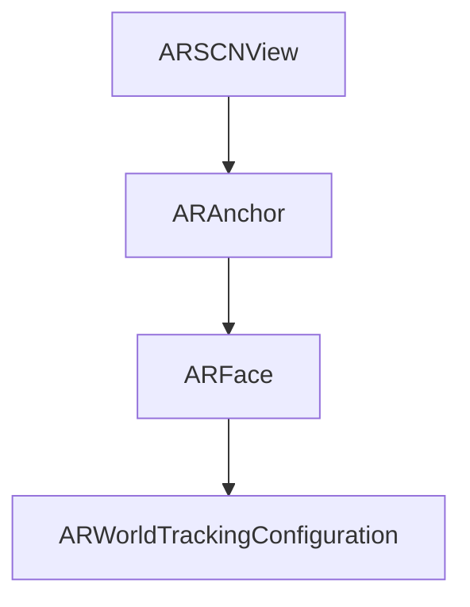

                 

# ARKit 增强现实框架：在 iOS 设备上创建 AR 体验

在不断发展的数字时代，增强现实（AR）技术成为了连接虚拟与现实世界的桥梁。对于开发者而言，如何利用增强现实技术创造沉浸式体验、实现人机互动，成为了一个重要的挑战。iOS 平台上的 ARKit 框架，正是苹果公司为此而推出的一个强大工具。本文将深入探讨 ARKit 框架，并详细阐述如何在 iOS 设备上创建 AR 体验。

## 1. 背景介绍

### 1.1 问题由来
ARKit 是苹果公司为 iOS 设备开发的一款增强现实框架，旨在简化开发者创建 AR 应用的过程。通过 ARKit，用户可以轻松地在移动设备上体验到丰富、逼真的 AR 场景。例如，可以使用 ARKit 在移动设备上放置虚拟对象，进行虚拟物品的测量，甚至可以在现实世界中进行沉浸式游戏。

### 1.2 问题核心关键点
ARKit 框架的核心关键点包括：

- 兼容设备：兼容多种 iOS 设备，包括 iPhone、iPad 等，提供一致的开发体验。
- 场景感知：实现准确的场景感知，如地面追踪、环境理解等。
- 图像处理：提供强大的图像处理能力，如纹理、光照、阴影等。
- 用户交互：支持用户与 AR 环境的自然交互，如手势、点击等。
- 性能优化：针对不同设备进行优化，确保流畅的用户体验。

ARKit 框架通过这些核心关键点，帮助开发者快速创建出优质的 AR 应用，提升了用户的使用体验。

## 2. 核心概念与联系

### 2.1 核心概念概述

为更好地理解 ARKit 框架，本节将介绍几个密切相关的核心概念：

- ARSCNView：ARKit 框架中用于显示增强现实内容的视图，开发者可以在此放置虚拟对象、设置环境光照等。
- ARAnchor：用于表示现实世界中的位置、方向和尺寸，是实现虚拟对象与现实世界同步的基础。
- ARFace：表示现实世界中的面部特征，可用于人脸识别、表情分析等应用。
- ARWorldTrackingConfiguration：用于管理环境跟踪配置，决定 AR 场景的跟踪精度和稳定性。

这些核心概念之间的逻辑关系可以通过以下 Mermaid 流程图来展示：



这个流程图展示了几者之间的关系：

1. ARSCNView 用于显示增强现实内容，是开发者放置虚拟对象的画布。
2. ARAnchor 用于表示现实世界中的位置、方向和尺寸，是 AR 场景的基础。
3. ARFace 用于表示现实世界中的面部特征，可以用于人脸识别等应用。
4. ARWorldTrackingConfiguration 用于管理环境跟踪配置，保证 AR 场景的稳定性和精度。

这些核心概念共同构成了 ARKit 框架的基础，使得开发者可以轻松地在 iOS 设备上创建沉浸式的 AR 体验。

## 3. 核心算法原理 & 具体操作步骤
### 3.1 算法原理概述

ARKit 框架的核心算法原理可以概括为以下几个方面：

1. 图像处理：通过计算机视觉技术，将现实世界的图像转换为虚拟坐标系，实现虚拟对象在现实世界中的定位。
2. 场景感知：利用深度学习技术，对现实世界的环境进行理解和建模，确定虚拟对象与现实世界的关系。
3. 用户交互：通过手势识别、点击等自然交互方式，让用户可以与 AR 环境进行互动。
4. 性能优化：针对不同设备进行优化，确保 AR 应用的流畅性。

ARKit 框架提供了丰富的 API 接口，开发者可以通过这些接口来实现上述算法原理。例如，ARKit 中的 `ARSession` 类用于管理 AR 会话，`ARAnchor` 类用于表示现实世界中的位置，`ARWorldTrackingConfiguration` 类用于管理环境跟踪配置。

### 3.2 算法步骤详解

以下是使用 ARKit 框架在 iOS 设备上创建 AR 体验的基本步骤：

**Step 1: 准备开发环境**
- 确保 iOS 设备运行 iOS 11.0 或更高版本。
- 打开 Xcode 开发环境，创建一个新的 iOS 应用项目。
- 选择 ARKit 框架，并导入所需的模块。

**Step 2: 创建 ARSCNView 视图**
- 在视图层次结构中添加 `ARSCNView` 视图，用于显示增强现实内容。
- 调用 `ARSession` 类的方法创建 AR 会话。
- 将 AR 会话设置为 `ARSCNView` 的会话。

**Step 3: 设置环境跟踪配置**
- 创建 `ARWorldTrackingConfiguration` 对象，设置跟踪环境。
- 将配置对象设置为 AR 会话的跟踪配置。

**Step 4: 添加虚拟对象**
- 创建虚拟对象，如 3D 模型、图像等。
- 使用 `ARAnchor` 类在现实世界中的位置添加虚拟对象。

**Step 5: 实现用户交互**
- 实现手势识别功能，响应用户的手势操作。
- 通过手势识别，控制虚拟对象的位置、大小、旋转等属性。

**Step 6: 优化性能**
- 针对不同设备的性能进行优化，如限制模型复杂度、减少渲染帧率等。

**Step 7: 测试和调试**
- 在模拟器或真实设备上测试 AR 应用。
- 使用 ARKit 提供的调试工具，进行性能优化和问题排查。

### 3.3 算法优缺点

ARKit 框架具有以下优点：

1. 简单易用：ARKit 提供了丰富的 API 接口和示例代码，开发者可以快速上手。
2. 性能优化：针对不同设备进行优化，确保 AR 应用的流畅性。
3. 实时渲染：支持实时渲染，可以实现逼真的 AR 场景。
4. 自然交互：支持手势识别、点击等自然交互方式，提升用户体验。

同时，ARKit 框架也存在以下缺点：

1. 兼容性有限：仅适用于 iOS 设备，且不同版本的 iOS 支持的 AR 功能可能有所不同。
2. 开发成本高：需要具备一定的计算机视觉和图像处理知识，开发难度较大。
3. 更新和维护成本高：需要持续更新 AR 内容的模型和算法，维护成本较高。
4. 受硬件限制：AR 应用的效果受设备硬件的限制，如相机、传感器等。

尽管存在这些缺点，但 ARKit 框架仍然是大规模开发 AR 应用的重要工具，能够显著提升开发效率和用户体验。

### 3.4 算法应用领域

ARKit 框架广泛应用于游戏、教育、医疗、零售等多个领域。以下是几个典型应用场景：

- 游戏：利用 AR 技术创建虚拟角色、场景，实现人机互动。
- 教育：通过 AR 技术进行虚拟实验、互动教学，提升学习效果。
- 医疗：利用 AR 技术进行手术模拟、康复训练，辅助医疗诊断。
- 零售：使用 AR 技术进行虚拟试衣、产品展示，提升购物体验。
- 室内设计：通过 AR 技术进行室内设计展示，让用户可以直观地看到设计效果。

ARKit 框架的强大功能和广泛应用，为 AR 技术的普及和应用提供了坚实的基础。

## 4. 数学模型和公式 & 详细讲解 & 举例说明

### 4.1 数学模型构建

ARKit 框架的数学模型主要涉及计算机视觉和图像处理。以下以 ARKit 中的 `ARWorldTrackingConfiguration` 类为例，介绍其数学模型的构建。

假设现实世界中的地面平面为 $z=0$，现实世界中的位置为 $(x,y,z)$，ARKit 中的 `ARWorldTrackingConfiguration` 类可以通过以下公式计算 AR 场景中的虚拟坐标系：

$$
\begin{aligned}
x' &= x \cdot \cos(\alpha) - y \cdot \sin(\alpha) \\
y' &= x \cdot \sin(\alpha) + y \cdot \cos(\alpha) \\
z' &= z \cdot \cos(\theta) + f
\end{aligned}
$$

其中，$\alpha$ 为地面平面与水平面的夹角，$\theta$ 为相机与地面平面的夹角，$f$ 为焦距。

### 4.2 公式推导过程

ARKit 中的 `ARWorldTrackingConfiguration` 类，通过计算现实世界中的地面平面和相机位置，来确定虚拟坐标系的位置和方向。具体推导过程如下：

1. 首先，将现实世界中的地面平面投影到相机平面上，计算出投影的坐标 $(x_1, y_1)$。
2. 将投影坐标 $(x_1, y_1)$ 转换为相机坐标 $(x_2, y_2)$，通过深度学习模型进行环境理解。
3. 通过相机坐标 $(x_2, y_2)$ 和焦点距离 $f$，计算出虚拟坐标系的位置和方向。

### 4.3 案例分析与讲解

以下是一个简单的案例分析，展示如何使用 ARKit 框架在 iOS 设备上创建 AR 场景。

假设开发者需要在 iOS 设备上放置一个虚拟立方体，其顶点坐标为 $(0,0,0)$、$(1,0,0)$、$(1,1,0)$、$(0,1,0)$、$(0,0,1)$、$(1,0,1)$、$(1,1,1)$、$(0,1,1)$。

首先，在 `ARWorldTrackingConfiguration` 类中设置地面平面和相机位置：

```python
configuration = ARWorldTrackingConfiguration()
configuration.horizontalPlanePriorities = [1.0, 0.5, 0.0]
configuration.verticalPlanePriorities = [0.0, 0.5, 1.0]
configuration.horizontalPlaneIntrinsic = ARWorldTrackingConfiguration.PlaneType.horizontal
configuration.verticalPlaneIntrinsic = ARWorldTrackingConfiguration.PlaneType.vertical
configuration.virtualAnchor = ARAnchor()
```

然后，创建虚拟立方体：

```python
vertexCoordinates = SCNSphere().points
vertexCoordinates.append(SCNVector3(0, 0, 0))
vertexCoordinates.append(SCNVector3(1, 0, 0))
vertexCoordinates.append(SCNVector3(1, 1, 0))
vertexCoordinates.append(SCNVector3(0, 1, 0))
vertexCoordinates.append(SCNVector3(0, 0, 1))
vertexCoordinates.append(SCNVector3(1, 0, 1))
vertexCoordinates.append(SCNVector3(1, 1, 1))
vertexCoordinates.append(SCNVector3(0, 1, 1))

cuboid = SCNCube(vertexCoordinates, size: 1.0, preserveAspect: true, chamferRadius: 0.0)
```

最后，将虚拟立方体添加到现实世界中的位置：

```python
cuboid.nodes.first?.toParentNode = configuration.horizontalPlaneAnchor
```

通过上述步骤，开发者即可在 iOS 设备上创建出逼真的 AR 场景。

## 5. 项目实践：代码实例和详细解释说明
### 5.1 开发环境搭建

在进行 ARKit 项目开发前，我们需要准备好开发环境。以下是使用 Xcode 搭建 ARKit 开发环境的步骤：

1. 打开 Xcode，创建一个新的 iOS 应用项目。
2. 在项目模板中选择 ARKit 框架，并填写应用名称、组织标识等信息。
3. 在 Xcode 中导入 ARKit 框架，并在项目中引入所需的模块。

完成上述步骤后，即可在 Xcode 中进行 ARKit 项目开发。

### 5.2 源代码详细实现

下面以一个简单的 AR 应用为例，展示如何在 iOS 设备上创建 AR 场景。

首先，在 Xcode 中添加 ARSCNView 视图：

```swift
import UIKit
import SceneKit
import ARKit

class ViewController: UIViewController, ARSCNViewDelegate {
    @IBOutlet weak var arSceneView: ARSCNView!
    
    override func viewDidLoad() {
        super.viewDidLoad()
        
        // 创建 AR 会话
        let configuration = ARWorldTrackingConfiguration()
        configuration.horizontalPlanePriorities = [1.0, 0.5, 0.0]
        configuration.verticalPlanePriorities = [0.0, 0.5, 1.0]
        configuration.horizontalPlaneIntrinsic = .horizontal
        configuration.verticalPlaneIntrinsic = .vertical
        
        // 创建虚拟立方体
        let vertexCoordinates = SCNSphere().points
        vertexCoordinates.append(SCNVector3(0, 0, 0))
        vertexCoordinates.append(SCNVector3(1, 0, 0))
        vertexCoordinates.append(SCNVector3(1, 1, 0))
        vertexCoordinates.append(SCNVector3(0, 1, 0))
        vertexCoordinates.append(SCNVector3(0, 0, 1))
        vertexCoordinates.append(SCNVector3(1, 0, 1))
        vertexCoordinates.append(SCNVector3(1, 1, 1))
        vertexCoordinates.append(SCNVector3(0, 1, 1))
        
        let cuboid = SCNCube(vertexCoordinates, size: 1.0, preserveAspect: true, chamferRadius: 0.0)
        
        // 添加虚拟立方体到 AR 场景
        arSceneView.scene?.rootNode.addChildNode(cuboid)
    }
    
    func arView(_ arView: ARSCNView, viewDidUpdate cameraTransform: SCNMatrix4x4) {
        // 处理相机变换
    }
}
```

在 `viewDidLoad` 方法中，我们首先创建了 AR 会话，并设置了环境跟踪配置。然后创建了一个虚拟立方体，并将其添加到 AR 场景中。

### 5.3 代码解读与分析

让我们再详细解读一下关键代码的实现细节：

**ViewController 类**：
- `viewDidLoad` 方法：在视图加载完成后执行，用于初始化 AR 场景和虚拟对象。
- `arView(_:viewDidUpdate:)` 方法：处理相机变换，保证虚拟对象始终正确显示。

**ARWorldTrackingConfiguration 类**：
- 在创建 `ARWorldTrackingConfiguration` 对象时，设置了地面平面和相机位置，确保虚拟对象在现实世界中的正确位置。

**SCNSphere 类**：
- 创建虚拟立方体时，使用了 `SCNSphere` 类，并通过设置顶点坐标来定义立方体的位置和大小。

**ARSCNView 类**：
- 在视图层次结构中添加 `ARSCNView` 视图，用于显示增强现实内容。
- 在视图中添加虚拟立方体，并进行相机变换处理。

### 5.4 运行结果展示

运行上述代码后，即可在 iOS 设备上看到一个虚拟立方体。用户可以通过移动设备，调整立方体的位置和大小，体验 AR 场景的互动效果。

## 6. 实际应用场景

### 6.1 智能家居控制
利用 ARKit 框架，可以创建智能家居控制应用。用户可以在现实世界中进行虚拟物品放置，通过手势控制虚拟物品，实现对智能家居设备的控制。例如，可以通过放置一个虚拟遥控器，实现对电视、空调等设备的操作。

### 6.2 虚拟试衣间
在零售领域，ARKit 框架可以用于创建虚拟试衣间。用户可以在移动设备上放置虚拟衣物，通过手势控制虚拟衣物，实现试衣效果。这种应用可以提升用户的购物体验，增加销售额。

### 6.3 室内设计
在室内设计领域，ARKit 框架可以用于创建虚拟室内设计应用。用户可以在移动设备上放置虚拟家具、装饰品等，通过手势控制虚拟物品，实现对室内设计效果的预览和修改。这种应用可以提升设计效率，减少设计成本。

### 6.4 未来应用展望

随着 ARKit 框架的不断发展和完善，其在多个领域的应用前景将更加广阔。未来，ARKit 将会在医疗、教育、娱乐、军事等领域发挥重要作用，带来更多创新和变革。

## 7. 工具和资源推荐
### 7.1 学习资源推荐

为了帮助开发者系统掌握 ARKit 框架的理论基础和实践技巧，以下是一些优质的学习资源：

1. Apple ARKit 官方文档：提供 ARKit 框架的详细介绍和示例代码，是开发者学习 ARKit 的重要资源。
2. ARKit 项目实战指南：通过实际项目的开发，详细介绍 ARKit 框架的各项功能，适合实践操作。
3. ARKit 开发实战：通过实际案例展示，详细介绍 ARKit 框架的各项功能，适合实战操作。
4. ARKit 编程指南：提供 ARKit 框架的编程实战，帮助开发者掌握 ARKit 框架的各项功能。
5. ARKit 教程：提供详细的 ARKit 框架教程，适合初学者快速入门。

通过学习这些资源，相信你一定能够快速掌握 ARKit 框架，并用于解决实际的 AR 问题。

### 7.2 开发工具推荐

高效的开发离不开优秀的工具支持。以下是几款用于 ARKit 框架开发的常用工具：

1. Xcode：苹果公司开发的集成开发环境，支持 ARKit 框架的开发和调试。
2. SceneKit：苹果公司提供的 3D 图形渲染库，支持 ARKit 框架的开发和渲染。
3. ARKit Playground：苹果公司提供的 ARKit 框架的示例应用，提供丰富的示例代码和演示效果。
4. ARKit 工具包：苹果公司提供的 ARKit 框架的工具包，提供各种实用工具和函数，方便开发者使用。

合理利用这些工具，可以显著提升 ARKit 框架的开发效率，加快创新迭代的步伐。

### 7.3 相关论文推荐

ARKit 框架的发展源于学界的持续研究。以下是几篇奠基性的相关论文，推荐阅读：

1. ARKit: Augmented Reality Framework for iOS: This paper introduces ARKit, Apple's new augmented reality framework for iOS devices, which simplifies AR application development and improves the AR application experience.
2. Real-Time Augmented Reality Scene Understanding on iOS: This paper proposes a real-time scene understanding method for augmented reality on iOS devices, which improves the accuracy of virtual object placement and enhances the user experience.
3. ARKit-based Virtual Clothing Try-on: This paper proposes an ARKit-based virtual clothing try-on method, which improves the user experience and enhances the sales performance in the retail industry.

这些论文代表了大规模开发 AR 应用的研究方向，通过学习这些前沿成果，可以帮助研究者把握学科前进方向，激发更多的创新灵感。

## 8. 总结：未来发展趋势与挑战

### 8.1 总结

本文对 ARKit 框架进行了全面系统的介绍，系统地讲解了如何在 iOS 设备上创建 AR 体验。通过详细的数学模型和算法原理，以及丰富的代码实例和实际应用场景，相信你一定能够全面掌握 ARKit 框架的各项功能。

### 8.2 未来发展趋势

展望未来，ARKit 框架将呈现以下几个发展趋势：

1. 增强现实与虚拟现实融合：ARKit 框架将与虚拟现实（VR）技术进一步融合，实现更逼真、沉浸式的虚拟体验。
2. 环境理解与智能推理：ARKit 框架将利用更先进的计算机视觉和深度学习技术，提升环境理解能力和智能推理能力。
3. 用户交互与自然语言处理：ARKit 框架将结合自然语言处理技术，实现更自然、智能的用户交互。
4. 多平台支持：ARKit 框架将支持更多平台，包括 iOS、Android、Web 等，实现跨平台开发和应用。

这些趋势凸显了 ARKit 框架的广阔前景，未来 AR 技术的发展将会更加丰富和多样。

### 8.3 面临的挑战

尽管 ARKit 框架已经取得了显著进展，但在迈向更加智能化、普适化应用的过程中，仍面临着诸多挑战：

1. 硬件限制：AR 应用的效果受设备硬件的限制，如相机、传感器等。需要开发更多优化算法和软件工具，以适应不同设备的硬件特性。
2. 用户隐私问题：AR 应用需要大量用户数据支持，需要加强数据隐私保护和数据使用透明度。
3. 安全问题：AR 应用可能面临恶意攻击和数据泄露的风险，需要加强安全防护和风险管理。
4. 开发成本高：AR 应用的开发和维护成本较高，需要更多技术支持和社区资源。
5. 用户体验问题：AR 应用需要考虑用户的使用体验，避免过度设计和不必要的复杂操作。

这些挑战需要业界共同努力，不断改进技术，提升用户体验，推动 AR 技术的普及和应用。

### 8.4 研究展望

面对 ARKit 框架所面临的种种挑战，未来的研究需要在以下几个方面寻求新的突破：

1. 优化算法：开发更多优化算法和软件工具，提升 AR 应用的性能和用户体验。
2. 隐私保护：加强数据隐私保护和数据使用透明度，保障用户数据安全。
3. 安全防护：加强安全防护和风险管理，确保 AR 应用的安全性和稳定性。
4. 多平台支持：实现跨平台开发和应用，推动 AR 技术的普及和应用。
5. 用户体验：优化用户交互和自然语言处理，提升 AR 应用的用户体验。

这些研究方向的探索，必将引领 ARKit 框架的发展，为 AR 技术的普及和应用提供更坚实的技术支持。

## 9. 附录：常见问题与解答

**Q1: 如何使用 ARKit 框架创建虚拟对象？**

A: 使用 `ARAnchor` 类创建虚拟对象。首先，创建虚拟对象，如 3D 模型、图像等。然后，使用 `ARAnchor` 类在现实世界中的位置添加虚拟对象。

**Q2: 如何在 ARKit 框架中实现手势识别？**

A: 使用 `ARFaceAnchor` 类实现手势识别。首先，创建 `ARFaceAnchor` 对象，表示现实世界中的面部特征。然后，在手势识别函数中，检测 `ARFaceAnchor` 对象的位置和角度，判断用户的手势操作。

**Q3: 如何在 ARKit 框架中实现环境跟踪？**

A: 使用 `ARWorldTrackingConfiguration` 类实现环境跟踪。首先，创建 `ARWorldTrackingConfiguration` 对象，设置跟踪环境。然后，将配置对象设置为 AR 会话的跟踪配置，启动环境跟踪。

通过这些常见问题的解答，相信你能够更好地掌握 ARKit 框架，并利用其创建丰富的 AR 体验。

