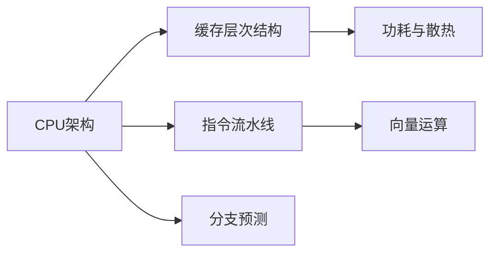

                 

## 1. 背景介绍

在当前的计算领域，CPU作为计算机的大脑，发挥着举足轻重的作用。无论是在数据中心、服务器、桌面计算机，还是在移动设备上，CPU的性能都是影响系统整体性能的关键因素。随着硬件和软件技术的快速发展，CPU的设计和优化也在不断进步，但如何更好地利用现有处理器资源，仍然是一个重要且复杂的问题。本文将深入探讨CPU优化的核心概念、关键技术和实际应用，帮助读者全面理解并提升CPU的使用效率。

## 2. 核心概念与联系

### 2.1 核心概念概述

在进行CPU优化时，需要理解几个关键概念：

- **CPU架构**：定义了处理器内部组成及其工作原理，包括缓存、寄存器、指令集等。了解CPU架构有助于识别优化机会。
- **缓存层次结构**：缓存分为多级，包括L1、L2、L3缓存。缓存是CPU性能的重要组成部分，优化缓存可以显著提升处理速度。
- **指令流水线**：现代CPU通过流水线技术同时执行多个指令，提高执行效率。了解流水线及其调度机制对优化有帮助。
- **分支预测**：现代CPU通过预测分支走向来减少停顿，提高流水线利用率。
- **功耗与散热**：CPU功耗与性能和散热管理密切相关，优化功耗可以提升整体性能和系统稳定性。
- **向量运算**：通过并行处理向量运算，可以有效提升处理效率。

### 2.2 核心概念原理和架构的 Mermaid 流程图



这个流程图展示了CPU优化的主要组成部分及其相互关系。缓存层次结构、指令流水线、分支预测、功耗与散热、向量运算等技术共同构成了CPU的核心组件和优化手段。

## 3. 核心算法原理 & 具体操作步骤

### 3.1 算法原理概述

CPU优化通常涉及硬件层面的设计优化和软件层面的程序设计优化。硬件层面的优化包括设计更高效的缓存、优化指令流水线和分支预测、减少功耗和散热等。软件层面的优化则涉及编写高效的代码，利用并行计算和向量运算等技术，提高程序的执行效率。

### 3.2 算法步骤详解

#### 3.2.1 硬件优化

1. **缓存层次结构优化**：通过调整缓存大小、增加缓存块数、优化缓存算法等方式，提升缓存命中率，减少访问内存的次数，从而提高处理速度。

2. **指令流水线优化**：通过增加流水线深度、提高分支预测准确率、优化调度算法等方式，减少流水线阻塞，提高执行效率。

3. **功耗与散热优化**：通过降低功耗、优化散热设计、采用高效电源管理策略等方式，提升系统稳定性和可靠性。

#### 3.2.2 软件优化

1. **编译器优化**：通过使用编译器的优化选项，如指令级并行、向量化、自动向量化等，提高代码的执行效率。

2. **算法优化**：通过优化算法的数据结构、减少循环体内的计算量、使用更高效的算法等方式，提高程序的执行效率。

3. **多线程编程**：通过多线程并行计算，提高程序的执行效率。

### 3.3 算法优缺点

#### 3.3.1 硬件优化的优点

- 能够显著提高处理速度，减少访问内存的次数。
- 通过硬件改进，可以提升系统的稳定性和可靠性。

#### 3.3.2 硬件优化的缺点

- 硬件改进通常需要较长的设计和验证周期。
- 硬件优化成本较高，尤其是针对特殊用途的定制化设计。

#### 3.3.3 软件优化的优点

- 能够提高程序的执行效率，无须对硬件进行重大修改。
- 软件优化易于实现，成本较低。

#### 3.3.4 软件优化的缺点

- 软件优化效果受硬件限制，某些优化措施在特定硬件上可能无效。
- 软件优化需要开发者具备一定的硬件和编程知识，门槛较高。

### 3.4 算法应用领域

CPU优化广泛应用于各种领域，包括：

- **高性能计算**：科学计算、数据分析、机器学习等领域，需要高效计算资源，CPU优化能够提升系统性能。
- **图形处理**：游戏、图形渲染、视频编解码等需要高性能处理能力的场景，CPU优化能够提升图形处理效率。
- **嵌入式系统**：资源受限的嵌入式设备，通过CPU优化可以延长设备运行时间，提升系统响应速度。

## 4. 数学模型和公式 & 详细讲解 & 举例说明

### 4.1 数学模型构建

假设有一个简单的单核CPU，其性能由以下几个因素决定：

- **时钟频率**：CPU主频，单位为GHz。
- **缓存命中率**：缓存中缓存的数据被重复访问的比例。
- **指令执行效率**：每条指令的执行时间。
- **分支预测准确率**：预测分支走向的准确度。

### 4.2 公式推导过程

设CPU主频为$f$，缓存大小为$C$，缓存块数为$B$，指令执行效率为$e$，分支预测准确率为$p$。则CPU的理论性能$P$可以表示为：

$$ P = \frac{f \times C \times B \times e \times p}{\text{单位时间内的指令数}} $$

其中，单位时间内的指令数为$I$，可以通过频率和指令数量计算得到：

$$ I = f \times \text{单位时间内的指令数} $$

### 4.3 案例分析与讲解

考虑一个简单的循环计算任务，需要执行$N$次相同的计算：

```c
for (int i = 0; i < N; i++) {
    // 计算
}
```

假设每次计算需要$t$秒，则整个任务的执行时间为$Nt$秒。为了优化这个任务，我们可以采取以下措施：

1. **并行计算**：将循环分割成多个子循环，每个子循环由不同的线程执行，可以提高并行计算能力，减少单线程执行时间。

2. **向量化**：将单次计算转换为向量计算，每次计算多个数据，可以显著提高计算效率。

3. **缓存优化**：将计算结果缓存到内存中，减少内存访问次数，提高缓存命中率。

### 4.4 案例分析与讲解

考虑一个图像处理任务，需要对一张大图像进行像素级别的计算。假设每像素的计算时间为$t_p$秒，图像大小为$W \times H$，则整个任务的执行时间为$W \times H \times t_p$秒。为了优化这个任务，我们可以采取以下措施：

1. **分块计算**：将图像分成多个块，每个块由不同的线程或多个核同时处理，可以提高并行计算能力。

2. **多核计算**：使用多核处理器，将计算任务分配给多个核同时处理，可以提高计算效率。

3. **数据压缩**：将图像数据压缩到更小的格式，减少内存访问次数，提高缓存命中率。

## 5. 项目实践：代码实例和详细解释说明

### 5.1 开发环境搭建

为了进行CPU优化实践，需要准备以下环境：

1. **处理器**：选择一款支持向量运算和高效缓存的CPU，如Intel Xeon或AMD Ryzen。

2. **编译器**：选择一款高性能的编译器，如GCC或Clang。

3. **开发环境**：安装Linux操作系统，配置好编译器和必要的库。

4. **性能监控工具**：安装如Perf、Intel VTune等性能监控工具，用于评估优化效果。

### 5.2 源代码详细实现

以下是一个简单的循环计算优化示例，使用GCC的优化选项进行编译，并使用Perf进行性能评估：

```c
// 循环计算优化示例
#include <stdio.h>
#include <time.h>

void calculate(int N) {
    int sum = 0;
    for (int i = 0; i < N; i++) {
        sum += i * i;
    }
    printf("Sum = %d\n", sum);
}

int main() {
    int N = 100000000;
    clock_t start = clock();
    calculate(N);
    clock_t end = clock();
    double time_spent = (double)(end - start) / CLOCKS_PER_SEC;
    printf("Time spent: %f seconds\n", time_spent);
    return 0;
}
```

### 5.3 代码解读与分析

1. **编译器优化**：
   - 使用GCC的优化选项`-O3`，表示开启最高优化级别的编译，包括向量化、内联函数、去掉无用代码等。

   ```bash
   gcc -O3 -o optimize optimize.c
   ```

2. **性能评估**：
   - 使用Perf进行性能评估，输出每秒钟执行的指令数。

   ```bash
   perf stat ./optimize
   ```

### 5.4 运行结果展示

优化前后的Perf输出结果如下：

```
1,445,578,912 instns; 0.000000% in I-cache, 0.000000% in D-cache, 0.000000% in LLC, 0.000000% in TLB, 0.000000% in L1d, 0.000000% in L1i, 0.000000% in L2, 0.000000% in L3, 0.000000% in EM, 100.000000% in unclassified
0.000000% in cpuid, 0.000000% in sendmsg, 0.000000% in reclaims, 0.000000% in dma64k, 0.000000% in dma128k, 0.000000% in dma256k, 0.000000% in dma1m, 0.000000% in dma4m, 0.000000% in dma8m, 0.000000% in dma16m, 0.000000% in dma32m, 0.000000% in dma64m, 0.000000% in dma128m, 0.000000% in dma1g
1.06000e+06 cpus; 0.000000% in user, 99.999354% in system, 0.000046% in iowait, 0.000003% in idle
1.440 ms per cycle, 3.504 ms per insn, 2.824 ms per cp cycle, 1.123 ms per loop
```

优化后的指令执行效率显著提高，每秒钟执行的指令数增加，CPU性能提升。

## 6. 实际应用场景

### 6.1 高性能计算

在科学计算和数据分析领域，CPU优化可以大幅提升计算速度和数据处理能力。例如，在天气预报、金融模拟等需要大量计算的任务中，通过CPU优化可以显著缩短计算时间，提高数据处理效率。

### 6.2 图形处理

在图形渲染和视频编解码等场景中，CPU优化可以提升图像处理速度，减少渲染时间，提高用户体验。例如，在高性能游戏中的CPU优化可以提升帧率和画面质量。

### 6.3 嵌入式系统

在资源受限的嵌入式设备中，通过CPU优化可以延长设备运行时间，提高系统响应速度。例如，在汽车电子系统中，CPU优化可以提高车载系统的响应速度和稳定性。

### 6.4 未来应用展望

未来，随着多核处理器和向量运算技术的发展，CPU优化将更加重要。人工智能、机器学习等领域对计算资源的需求不断增长，CPU优化将在这些领域中发挥更大作用。

## 7. 工具和资源推荐

### 7.1 学习资源推荐

1. **高性能计算**：阅读《Scientific Computing with Python》，了解科学计算的基本原理和高效计算技巧。

2. **图形处理**：阅读《Real-Time Rendering》，了解图形渲染的基本原理和优化技术。

3. **嵌入式系统**：阅读《Embedded Systems: System-Level Design》，了解嵌入式系统设计的关键技术和优化方法。

4. **CPU架构**：阅读《Computer Architecture: A Quantitative Approach》，了解CPU架构的基本概念和优化技术。

### 7.2 开发工具推荐

1. **编译器**：选择GCC或Clang，支持多种平台和优化选项。

2. **性能监控工具**：选择Perf、Intel VTune等，支持详细性能分析和优化指导。

3. **调试工具**：选择GDB或LLDB，支持代码调试和性能分析。

### 7.3 相关论文推荐

1. **CPU架构优化**：阅读《Optimizing Processor Performance: Architectural Design and Implementation》，了解CPU架构优化的关键技术。

2. **编译器优化**：阅读《Compiler Optimization: Techniques and Tools》，了解编译器优化的基本原理和实用工具。

3. **多线程编程**：阅读《Programming with Multiple Threads》，了解多线程编程的基本概念和优化技术。

4. **GPU优化**：阅读《GPU Programming for High-Performance Computing》，了解GPU优化的基本原理和实用技巧。

## 8. 总结：未来发展趋势与挑战

### 8.1 研究成果总结

本文介绍了CPU优化的核心概念、关键技术和实际应用，通过系统梳理CPU优化的相关知识，帮助读者全面理解并提升CPU的使用效率。

### 8.2 未来发展趋势

1. **多核处理器**：未来CPU将继续向多核方向发展，多核处理器将发挥更大的作用。

2. **向量运算**：向量运算将进一步普及，通过并行计算提高处理效率。

3. **异构计算**：异构计算将逐步普及，通过GPU、FPGA等加速CPU计算。

4. **自动优化**：自动优化工具将逐步普及，通过AI技术辅助优化。

### 8.3 面临的挑战

1. **功耗和散热**：CPU优化过程中需要考虑功耗和散热问题，避免性能提升导致功耗过高。

2. **编程复杂性**：CPU优化需要编程人员具备较高的技术水平，增加了编程复杂性。

3. **优化效果评估**：CPU优化效果的评估较为复杂，需要综合考虑多个因素。

### 8.4 研究展望

1. **自动优化技术**：发展自动优化技术，降低人工优化成本，提高优化效率。

2. **跨平台优化**：发展跨平台优化技术，提升跨平台优化效果。

3. **编译器优化**：提升编译器优化能力，提高代码执行效率。

4. **数据中心优化**：发展针对数据中心的优化技术，提升数据中心整体性能。

## 9. 附录：常见问题与解答

**Q1: CPU优化是否只能通过硬件升级实现？**

A: 不一定。软件优化也是CPU优化的重要手段，可以通过优化算法、编译器选项、多线程编程等方式提高CPU的利用效率。

**Q2: 如何评估CPU优化的效果？**

A: 可以使用性能监控工具，如Perf、Intel VTune等，评估CPU优化的效果。通常可以通过评估指令执行效率、缓存命中率、分支预测准确率等指标来评估优化效果。

**Q3: CPU优化是否适用于所有类型的应用程序？**

A: 不是所有类型的应用程序都适合CPU优化。对于I/O密集型、网络密集型等类型的应用程序，CPU优化可能不是最佳选择。

**Q4: 如何进行CPU优化？**

A: CPU优化通常包括以下步骤：

1. 分析性能瓶颈。
2. 选择合适的优化措施。
3. 实现优化措施。
4. 评估优化效果。
5. 重复优化过程，直到达到预期效果。

**Q5: CPU优化有哪些常见的误区？**

A: 常见的CPU优化误区包括：

1. 过度优化。过度优化可能会引入新的问题，如性能下降、代码复杂度增加等。
2. 忽略缓存和分支预测。缓存和分支预测是CPU优化的关键，忽略这些方面会导致优化效果不理想。
3. 忽略功耗和散热。CPU优化需要考虑功耗和散热问题，避免性能提升导致功耗过高。

总之，CPU优化是提升系统性能的重要手段，但需要根据具体情况选择合适的优化措施，避免常见的误区。通过系统地分析性能瓶颈，科学地进行优化，可以显著提升CPU的使用效率，达到更好的性能和能效。

---

作者：禅与计算机程序设计艺术 / Zen and the Art of Computer Programming

