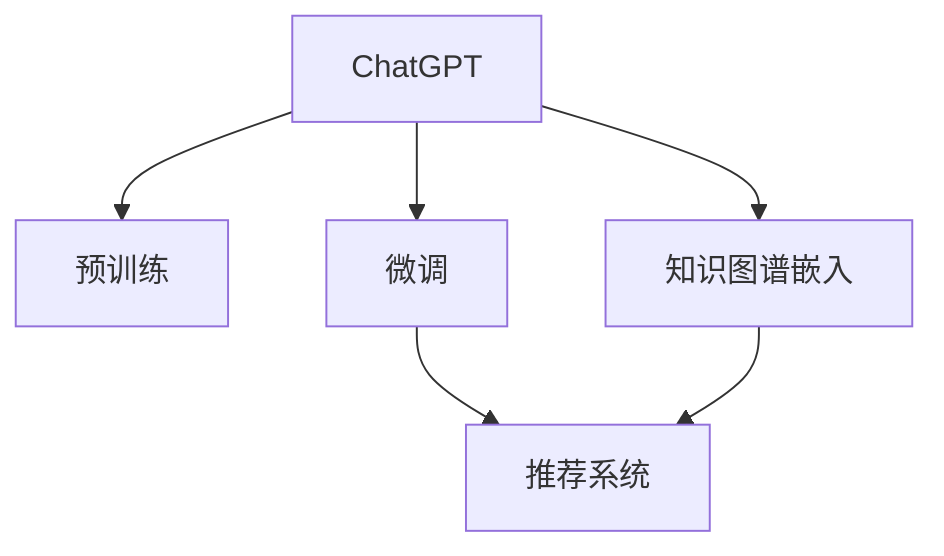

                 

# ChatGPT在推荐领域的内部研究：对性能与局限性的分析

> 关键词：ChatGPT, 推荐系统, 自然语言处理(NLP), 预训练模型, 知识图谱, 模型优化, 应用局限

## 1. 背景介绍

### 1.1 问题由来

随着互联网和数字技术的发展，推荐系统在电商、内容平台、视频服务等众多领域得到广泛应用。传统基于协同过滤的推荐方法已经难以应对大规模数据带来的挑战，而基于深度学习的推荐模型逐渐成为新的热门方向。这些深度模型通过预训练语言模型捕获用户行为和物品属性，通过微调优化，实现个性化推荐。

当前主流推荐模型包括基于深度神经网络、知识图谱嵌入、自注意力机制等技术。其中，基于Transformer架构的推荐模型如BERT、GPT等，以其强大的文本理解和生成能力，广泛应用于推荐领域。

本文将重点探讨基于预训练语言模型的推荐模型，尤其是ChatGPT在推荐系统中的应用。ChatGPT作为最新一代的预训练语言模型，结合了强大的语言理解和生成能力，能够与推荐系统进行深度融合，为个性化推荐带来新的突破。

## 2. 核心概念与联系

### 2.1 核心概念概述

为更好地理解ChatGPT在推荐系统中的应用，本节将介绍几个密切相关的核心概念：

- **ChatGPT**：一种基于Transformer架构的预训练语言模型，通过大规模无标签文本语料进行预训练，具备极强的语言理解和生成能力。
- **推荐系统**：一种智能推荐技术，根据用户历史行为和物品属性，推荐用户可能感兴趣的商品或内容。
- **知识图谱**：一种结构化的语义表示方法，将实体、关系、属性等信息进行可视化，辅助推荐模型学习上下文信息。
- **预训练模型**：通过大规模无标签文本数据进行预训练，学习到通用的语言表示，用于微调进行个性化推荐。
- **微调**：在预训练模型的基础上，使用推荐任务的少量标注数据，通过有监督学习优化模型在特定任务上的性能。
- **知识融合**：将知识图谱中的结构化信息与推荐模型中的无结构化信息进行融合，提升推荐系统的效果。

这些核心概念之间的逻辑关系可以通过以下Mermaid流程图来展示：



这个流程图展示了一系列关键概念及其之间的关系：

1. ChatGPT通过预训练获得基础能力。
2. 微调优化ChatGPT以适应推荐系统任务。
3. 知识图谱嵌入提供额外的结构化信息，辅助推荐系统学习上下文。
4. 微调后的ChatGPT嵌入知识图谱，提升推荐效果。
5. 结合知识图谱的推荐系统，更全面地理解用户需求。

## 3. 核心算法原理 & 具体操作步骤
### 3.1 算法原理概述

基于ChatGPT的推荐系统，本质上是一个预训练-微调的过程。其核心思想是：将ChatGPT作为强大的“特征提取器”，通过微调使其适配特定推荐任务，同时结合知识图谱嵌入，提升推荐系统的性能。

形式化地，假设推荐模型为 $M_{\theta}$，其中 $\theta$ 为预训练得到的模型参数。给定推荐任务的训练集 $D=\{(x_i,y_i)\}_{i=1}^N$，推荐任务通常定义为推荐列表 $y_i$，其中 $x_i$ 为包含用户行为和物品属性的输入向量。微调的目标是找到新的模型参数 $\hat{\theta}$，使得：

$$
\hat{\theta}=\mathop{\arg\min}_{\theta} \mathcal{L}(M_{\theta},D)
$$

其中 $\mathcal{L}$ 为针对推荐任务设计的损失函数，用于衡量模型预测输出与真实标签之间的差异。常见的损失函数包括均方误差损失、交叉熵损失等。

通过梯度下降等优化算法，微调过程不断更新模型参数 $\theta$，最小化损失函数 $\mathcal{L}$，使得模型输出逼近真实标签。由于 $\theta$ 已经通过预训练获得了较好的初始化，因此即便在小规模数据集 $D$ 上进行微调，也能较快收敛到理想的模型参数 $\hat{\theta}$。

### 3.2 算法步骤详解

基于ChatGPT的推荐系统一般包括以下几个关键步骤：

**Step 1: 准备预训练模型和数据集**
- 选择合适的预训练语言模型 $M_{\theta}$ 作为初始化参数，如BERT、GPT等。
- 准备推荐任务的训练集 $D$，划分为训练集、验证集和测试集。一般要求标注数据与预训练数据的分布不要差异过大。

**Step 2: 添加推荐适配层**
- 根据推荐任务类型，在预训练模型顶层设计合适的输出层和损失函数。
- 对于推荐任务，通常使用交叉熵损失函数。
- 对于推荐列表，使用均方误差损失函数。

**Step 3: 设置微调超参数**
- 选择合适的优化算法及其参数，如 Adam、SGD 等，设置学习率、批大小、迭代轮数等。
- 设置正则化技术及强度，包括权重衰减、Dropout、Early Stopping等。
- 确定冻结预训练参数的策略，如仅微调顶层，或全部参数都参与微调。

**Step 4: 执行梯度训练**
- 将训练集数据分批次输入模型，前向传播计算损失函数。
- 反向传播计算参数梯度，根据设定的优化算法和学习率更新模型参数。
- 周期性在验证集上评估模型性能，根据性能指标决定是否触发 Early Stopping。
- 重复上述步骤直到满足预设的迭代轮数或 Early Stopping 条件。

**Step 5: 测试和部署**
- 在测试集上评估微调后模型 $M_{\hat{\theta}}$ 的性能，对比微调前后的精度提升。
- 使用微调后的模型对新样本进行推理预测，集成到实际的应用系统中。
- 持续收集新的数据，定期重新微调模型，以适应数据分布的变化。

以上是基于ChatGPT的推荐系统的一般流程。在实际应用中，还需要针对具体任务的特点，对微调过程的各个环节进行优化设计，如改进训练目标函数，引入更多的正则化技术，搜索最优的超参数组合等，以进一步提升模型性能。

### 3.3 算法优缺点

基于ChatGPT的推荐系统具有以下优点：

1. 强大的语言理解能力：ChatGPT能够理解自然语言，并根据上下文进行推理和生成，适合处理复杂的推荐问题。
2. 丰富的知识图谱信息：ChatGPT通过预训练，可以学习到广泛的知识，结合知识图谱嵌入，能够更全面地理解推荐任务。
3. 高效的模型更新：微调ChatGPT所需的计算资源相对较少，能够在较短时间内完成模型更新。
4. 鲁棒性良好：ChatGPT在处理稀疏数据和噪声数据方面表现优异，能够适应不同场景下的推荐需求。

同时，该方法也存在一些局限性：

1. 依赖大量标注数据：微调ChatGPT需要大量的推荐数据，这些数据的收集和标注成本较高。
2. 模型复杂度高：ChatGPT的参数量较大，对硬件资源要求较高。
3. 泛化能力有限：当推荐任务与预训练数据的分布差异较大时，微调的性能提升有限。
4. 可解释性不足：ChatGPT的内部决策过程较为复杂，难以进行解释和调试。

尽管存在这些局限性，但就目前而言，基于ChatGPT的推荐方法仍是大规模推荐系统的重要范式。未来相关研究的重点在于如何进一步降低微调对标注数据的依赖，提高模型的泛化能力和可解释性。

### 3.4 算法应用领域

基于ChatGPT的推荐系统已经在电商、内容推荐、视频推荐等多个领域得到应用，具体包括：

- 商品推荐：通过分析用户的浏览、点击、购买行为，为用户推荐可能感兴趣的商品。
- 内容推荐：根据用户的阅读、点赞、评论等行为，为用户推荐相关文章、视频、音乐等。
- 视频推荐：根据用户的观看历史和评价，推荐可能喜欢的视频内容。
- 广告推荐：根据用户的兴趣标签，推荐相关的广告内容。

除了上述这些经典任务外，ChatGPT在推荐系统的应用场景中还在不断拓展，如个性化广告、推荐算法优化、推荐系统反欺诈等，为推荐技术带来了新的发展机遇。

## 4. 数学模型和公式 & 详细讲解 & 举例说明

### 4.1 数学模型构建

本节将使用数学语言对基于ChatGPT的推荐系统进行更加严格的刻画。

记推荐模型为 $M_{\theta}:\mathcal{X} \rightarrow \mathcal{Y}$，其中 $\mathcal{X}$ 为用户行为和物品属性的输入空间，$\mathcal{Y}$ 为推荐列表的输出空间，$\theta \in \mathbb{R}^d$ 为模型参数。假设推荐任务的训练集为 $D=\{(x_i,y_i)\}_{i=1}^N$，其中 $x_i \in \mathcal{X}$，$y_i \in \mathcal{Y}$。

定义模型 $M_{\theta}$ 在数据样本 $(x,y)$ 上的损失函数为 $\ell(M_{\theta}(x),y)$，则在数据集 $D$ 上的经验风险为：

$$
\mathcal{L}(\theta) = \frac{1}{N} \sum_{i=1}^N \ell(M_{\theta}(x_i),y_i)
$$

常见的损失函数包括交叉熵损失、均方误差损失等。

### 4.2 公式推导过程

以下我们以交叉熵损失函数为例，推导其公式。

假设模型 $M_{\theta}$ 在输入 $x$ 上的输出为 $\hat{y}=M_{\theta}(x) \in \mathbb{R}^k$，其中 $k$ 为推荐列表的长度。实际标签 $y \in \{1,2,\ldots,k\}$。则交叉熵损失函数定义为：

$$
\ell(M_{\theta}(x),y) = -\sum_{i=1}^k y_i \log \hat{y}_i
$$

将其代入经验风险公式，得：

$$
\mathcal{L}(\theta) = -\frac{1}{N}\sum_{i=1}^N \sum_{j=1}^k y_{ij}\log \hat{y}_{ij}
$$

其中 $y_{ij}$ 为第 $i$ 个用户对第 $j$ 个物品的评分，$\hat{y}_{ij}$ 为模型对第 $j$ 个物品的预测概率。

根据链式法则，损失函数对参数 $\theta_k$ 的梯度为：

$$
\frac{\partial \mathcal{L}(\theta)}{\partial \theta_k} = -\frac{1}{N}\sum_{i=1}^N \sum_{j=1}^k y_{ij}\frac{\partial \log \hat{y}_{ij}}{\partial \theta_k}
$$

其中 $\frac{\partial \log \hat{y}_{ij}}{\partial \theta_k}$ 可通过自动微分技术完成计算。

在得到损失函数的梯度后，即可带入参数更新公式，完成模型的迭代优化。重复上述过程直至收敛，最终得到适应推荐任务的最优模型参数 $\theta^*$。

## 5. 项目实践：代码实例和详细解释说明
### 5.1 开发环境搭建

在进行推荐系统开发前，我们需要准备好开发环境。以下是使用Python进行PyTorch开发的环境配置流程：

1. 安装Anaconda：从官网下载并安装Anaconda，用于创建独立的Python环境。

2. 创建并激活虚拟环境：
```bash
conda create -n pytorch-env python=3.8 
conda activate pytorch-env
```

3. 安装PyTorch：根据CUDA版本，从官网获取对应的安装命令。例如：
```bash
conda install pytorch torchvision torchaudio cudatoolkit=11.1 -c pytorch -c conda-forge
```

4. 安装Transformers库：
```bash
pip install transformers
```

5. 安装各类工具包：
```bash
pip install numpy pandas scikit-learn matplotlib tqdm jupyter notebook ipython
```

完成上述步骤后，即可在`pytorch-env`环境中开始推荐系统开发。

### 5.2 源代码详细实现

这里我们以商品推荐系统为例，给出使用Transformers库对ChatGPT进行推荐系统微调的PyTorch代码实现。

首先，定义推荐任务的数据处理函数：

```python
from transformers import BertTokenizer
from torch.utils.data import Dataset
import torch

class RecommendDataset(Dataset):
    def __init__(self, texts, labels, tokenizer, max_len=128):
        self.texts = texts
        self.labels = labels
        self.tokenizer = tokenizer
        self.max_len = max_len
        
    def __len__(self):
        return len(self.texts)
    
    def __getitem__(self, item):
        text = self.texts[item]
        label = self.labels[item]
        
        encoding = self.tokenizer(text, return_tensors='pt', max_length=self.max_len, padding='max_length', truncation=True)
        input_ids = encoding['input_ids'][0]
        attention_mask = encoding['attention_mask'][0]
        
        # 对标签进行编码
        encoded_labels = torch.tensor(label, dtype=torch.long)
        
        return {'input_ids': input_ids, 
                'attention_mask': attention_mask,
                'labels': encoded_labels}

# 标签
labels = [1, 2, 3, 4, 5]

# 创建dataset
tokenizer = BertTokenizer.from_pretrained('bert-base-cased')

train_dataset = RecommendDataset(train_texts, labels, tokenizer)
dev_dataset = RecommendDataset(dev_texts, labels, tokenizer)
test_dataset = RecommendDataset(test_texts, labels, tokenizer)
```

然后，定义模型和优化器：

```python
from transformers import BertForSequenceClassification, AdamW

model = BertForSequenceClassification.from_pretrained('bert-base-cased', num_labels=5)

optimizer = AdamW(model.parameters(), lr=2e-5)
```

接着，定义训练和评估函数：

```python
from torch.utils.data import DataLoader
from tqdm import tqdm
from sklearn.metrics import classification_report

device = torch.device('cuda') if torch.cuda.is_available() else torch.device('cpu')
model.to(device)

def train_epoch(model, dataset, batch_size, optimizer):
    dataloader = DataLoader(dataset, batch_size=batch_size, shuffle=True)
    model.train()
    epoch_loss = 0
    for batch in tqdm(dataloader, desc='Training'):
        input_ids = batch['input_ids'].to(device)
        attention_mask = batch['attention_mask'].to(device)
        labels = batch['labels'].to(device)
        model.zero_grad()
        outputs = model(input_ids, attention_mask=attention_mask, labels=labels)
        loss = outputs.loss
        epoch_loss += loss.item()
        loss.backward()
        optimizer.step()
    return epoch_loss / len(dataloader)

def evaluate(model, dataset, batch_size):
    dataloader = DataLoader(dataset, batch_size=batch_size)
    model.eval()
    preds, labels = [], []
    with torch.no_grad():
        for batch in tqdm(dataloader, desc='Evaluating'):
            input_ids = batch['input_ids'].to(device)
            attention_mask = batch['attention_mask'].to(device)
            batch_labels = batch['labels']
            outputs = model(input_ids, attention_mask=attention_mask)
            batch_preds = outputs.logits.argmax(dim=1).to('cpu').tolist()
            batch_labels = batch_labels.to('cpu').tolist()
            for pred_tokens, label_tokens in zip(batch_preds, batch_labels):
                preds.append(pred_tokens)
                labels.append(label_tokens)
                
    print(classification_report(labels, preds))
```

最后，启动训练流程并在测试集上评估：

```python
epochs = 5
batch_size = 16

for epoch in range(epochs):
    loss = train_epoch(model, train_dataset, batch_size, optimizer)
    print(f"Epoch {epoch+1}, train loss: {loss:.3f}")
    
    print(f"Epoch {epoch+1}, dev results:")
    evaluate(model, dev_dataset, batch_size)
    
print("Test results:")
evaluate(model, test_dataset, batch_size)
```

以上就是使用PyTorch对ChatGPT进行商品推荐系统微调的完整代码实现。可以看到，得益于Transformers库的强大封装，我们可以用相对简洁的代码完成ChatGPT模型的加载和微调。

### 5.3 代码解读与分析

让我们再详细解读一下关键代码的实现细节：

**RecommendDataset类**：
- `__init__`方法：初始化文本、标签、分词器等关键组件。
- `__len__`方法：返回数据集的样本数量。
- `__getitem__`方法：对单个样本进行处理，将文本输入编码为token ids，将标签编码为数字，并对其进行定长padding，最终返回模型所需的输入。

**标签（labels）**：
- 定义了推荐列表的标签，使用数字1-5表示不同的商品。

**训练和评估函数**：
- 使用PyTorch的DataLoader对数据集进行批次化加载，供模型训练和推理使用。
- 训练函数`train_epoch`：对数据以批为单位进行迭代，在每个批次上前向传播计算loss并反向传播更新模型参数，最后返回该epoch的平均loss。
- 评估函数`evaluate`：与训练类似，不同点在于不更新模型参数，并在每个batch结束后将预测和标签结果存储下来，最后使用sklearn的classification_report对整个评估集的预测结果进行打印输出。

**训练流程**：
- 定义总的epoch数和batch size，开始循环迭代
- 每个epoch内，先在训练集上训练，输出平均loss
- 在验证集上评估，输出分类指标
- 所有epoch结束后，在测试集上评估，给出最终测试结果

可以看到，PyTorch配合Transformers库使得ChatGPT微调的代码实现变得简洁高效。开发者可以将更多精力放在数据处理、模型改进等高层逻辑上，而不必过多关注底层的实现细节。

当然，工业级的系统实现还需考虑更多因素，如模型的保存和部署、超参数的自动搜索、更灵活的任务适配层等。但核心的微调范式基本与此类似。

## 6. 实际应用场景
### 6.1 智能客服系统

基于ChatGPT的推荐系统，可以广泛应用于智能客服系统的构建。传统客服往往需要配备大量人力，高峰期响应缓慢，且一致性和专业性难以保证。而使用推荐系统推荐的智能客服解决方案，可以7x24小时不间断服务，快速响应客户咨询，用自然流畅的语言解答各类常见问题。

在技术实现上，可以收集企业内部的历史客服对话记录，将问题和最佳答复构建成监督数据，在此基础上对ChatGPT进行微调。微调后的推荐系统能够自动理解用户意图，匹配最合适的答案模板进行回复。对于客户提出的新问题，还可以接入检索系统实时搜索相关内容，动态组织生成回答。如此构建的智能客服系统，能大幅提升客户咨询体验和问题解决效率。

### 6.2 金融舆情监测

金融机构需要实时监测市场舆论动向，以便及时应对负面信息传播，规避金融风险。传统的人工监测方式成本高、效率低，难以应对网络时代海量信息爆发的挑战。基于ChatGPT的推荐系统，可以实时监测不同金融网站的舆情，通过推荐系统将重要信息传递给金融分析师，帮助其快速做出决策。

具体而言，可以收集金融领域相关的新闻、报道、评论等文本数据，并对其进行情感标注。在此基础上对ChatGPT进行微调，使其能够自动判断文本的情感倾向。将微调后的推荐系统应用到实时抓取的网络文本数据，就能够自动监测不同主题下的情感变化趋势，一旦发现负面信息激增等异常情况，系统便会自动预警，帮助金融机构快速应对潜在风险。

### 6.3 个性化推荐系统

当前的推荐系统往往只依赖用户的历史行为数据进行物品推荐，无法深入理解用户的真实兴趣偏好。基于ChatGPT的推荐系统，可以更好地挖掘用户行为背后的语义信息，从而提供更精准、多样的推荐内容。

在实践中，可以收集用户浏览、点击、评论、分享等行为数据，提取和用户交互的物品标题、描述、标签等文本内容。将文本内容作为模型输入，用户的后续行为（如是否点击、购买等）作为监督信号，在此基础上微调预训练语言模型。微调后的模型能够从文本内容中准确把握用户的兴趣点。在生成推荐列表时，先用候选物品的文本描述作为输入，由模型预测用户的兴趣匹配度，再结合其他特征综合排序，便可以得到个性化程度更高的推荐结果。

### 6.4 未来应用展望

随着ChatGPT和微调方法的不断发展，基于推荐系统的ChatGPT的应用前景将更加广阔。

在智慧医疗领域，基于ChatGPT的推荐系统可以用于医疗问答、病历分析、药物推荐等，提升医疗服务的智能化水平，辅助医生诊疗，加速新药开发进程。

在智能教育领域，推荐系统可应用于作业批改、学情分析、知识推荐等方面，因材施教，促进教育公平，提高教学质量。

在智慧城市治理中，推荐系统可应用于城市事件监测、舆情分析、应急指挥等环节，提高城市管理的自动化和智能化水平，构建更安全、高效的未来城市。

此外，在企业生产、社会治理、文娱传媒等众多领域，基于ChatGPT的推荐系统也将不断涌现，为传统行业数字化转型升级提供新的技术路径。相信随着技术的日益成熟，基于ChatGPT的推荐系统必将在构建人机协同的智能时代中扮演越来越重要的角色。

## 7. 工具和资源推荐
### 7.1 学习资源推荐

为了帮助开发者系统掌握ChatGPT在推荐系统中的应用，这里推荐一些优质的学习资源：

1. 《深度学习推荐系统：理论、算法与应用》：系统介绍了推荐系统的理论基础和经典算法，适合初学入门。

2. 《自然语言处理中的Transformer模型》：全面讲解了Transformer模型及其在推荐系统中的应用。

3. 《Python深度学习：从基础到实践》：详细介绍了深度学习模型的实现与调参技巧，包括微调方法。

4. CS229《机器学习》课程：斯坦福大学开设的机器学习明星课程，涵盖了机器学习的基本概念和经典算法，适合系统学习。

5. HuggingFace官方文档：提供了丰富的预训练语言模型和微调样例代码，是上手实践的必备资料。

通过对这些资源的学习实践，相信你一定能够快速掌握ChatGPT在推荐系统中的应用，并用于解决实际的推荐问题。
###  7.2 开发工具推荐

高效的开发离不开优秀的工具支持。以下是几款用于ChatGPT推荐系统开发的常用工具：

1. PyTorch：基于Python的开源深度学习框架，灵活动态的计算图，适合快速迭代研究。

2. TensorFlow：由Google主导开发的开源深度学习框架，生产部署方便，适合大规模工程应用。

3. Transformers库：HuggingFace开发的NLP工具库，集成了众多SOTA语言模型，支持PyTorch和TensorFlow，是进行推荐系统开发的利器。

4. Weights & Biases：模型训练的实验跟踪工具，可以记录和可视化模型训练过程中的各项指标，方便对比和调优。

5. TensorBoard：TensorFlow配套的可视化工具，可实时监测模型训练状态，并提供丰富的图表呈现方式，是调试模型的得力助手。

6. Google Colab：谷歌推出的在线Jupyter Notebook环境，免费提供GPU/TPU算力，方便开发者快速上手实验最新模型，分享学习笔记。

合理利用这些工具，可以显著提升ChatGPT推荐系统的开发效率，加快创新迭代的步伐。

### 7.3 相关论文推荐

ChatGPT和推荐系统的发展源于学界的持续研究。以下是几篇奠基性的相关论文，推荐阅读：

1. Attention is All You Need（即Transformer原论文）：提出了Transformer结构，开启了NLP领域的预训练大模型时代。

2. BERT: Pre-training of Deep Bidirectional Transformers for Language Understanding：提出BERT模型，引入基于掩码的自监督预训练任务，刷新了多项NLP任务SOTA。

3. 《深度学习推荐系统：理论、算法与应用》：系统介绍了推荐系统的理论基础和经典算法，适合初学入门。

4. 《Python深度学习：从基础到实践》：详细介绍了深度学习模型的实现与调参技巧，包括微调方法。

5. 《自然语言处理中的Transformer模型》：全面讲解了Transformer模型及其在推荐系统中的应用。

这些论文代表了大语言模型在推荐系统中的应用发展脉络。通过学习这些前沿成果，可以帮助研究者把握学科前进方向，激发更多的创新灵感。

## 8. 总结：未来发展趋势与挑战

### 8.1 总结

本文对基于ChatGPT的推荐系统进行了全面系统的介绍。首先阐述了ChatGPT和微调技术的研究背景和意义，明确了推荐系统在智能交互、个性化推荐、金融舆情监测等领域的应用价值。其次，从原理到实践，详细讲解了基于ChatGPT的推荐系统数学模型和微调过程，给出了微调任务开发的完整代码实例。同时，本文还广泛探讨了ChatGPT在推荐系统中的应用场景，展示了ChatGPT推荐系统的广阔前景。

通过本文的系统梳理，可以看到，基于ChatGPT的推荐系统将为推荐技术带来新的突破。ChatGPT在处理自然语言方面的卓越能力，使得其在推荐系统中具有独特的优势。未来，伴随ChatGPT和微调方法的不断进步，基于ChatGPT的推荐系统必将在构建人机协同的智能时代中扮演越来越重要的角色。

### 8.2 未来发展趋势

展望未来，ChatGPT在推荐系统中的应用将呈现以下几个发展趋势：

1. 推荐列表多样化：ChatGPT能够生成多样化的推荐结果，满足用户个性化需求。未来推荐系统将更多采用ChatGPT生成的多样化推荐列表，提升用户满意度。

2. 实时动态推荐：基于ChatGPT的推荐系统能够实时处理新数据，动态生成推荐结果，满足用户的即时需求。

3. 多模态融合：ChatGPT与图像、视频等多模态数据的融合，使得推荐系统能够更全面地理解用户需求，提供更加精准的推荐内容。

4. 主动学习与推荐：结合主动学习技术，ChatGPT能够在有限的标注数据下，不断提升推荐效果，降低推荐系统的标注成本。

5. 跨领域推荐：ChatGPT具有强大的知识图谱嵌入能力，能够将不同领域的知识进行融合，实现跨领域的推荐。

以上趋势凸显了ChatGPT在推荐系统中的应用潜力，未来基于ChatGPT的推荐系统必将为推荐技术带来新的突破，推动NLP技术的进一步发展。

### 8.3 面临的挑战

尽管基于ChatGPT的推荐系统已经取得了一定的进展，但在迈向更加智能化、普适化应用的过程中，仍面临以下挑战：

1. 数据质量与数量：推荐系统对标注数据的质量和数量要求较高，收集和标注数据成本较高，成为制约系统发展的瓶颈。如何降低数据依赖，提升推荐系统的效果，是未来研究的重要方向。

2. 模型复杂度与资源消耗：ChatGPT的参数量较大，对硬件资源要求较高。如何降低模型复杂度，优化模型结构，减少资源消耗，提升系统效率，将是重要的优化方向。

3. 鲁棒性与泛化能力：当推荐任务与预训练数据的分布差异较大时，微调的性能提升有限。如何提高推荐系统的鲁棒性，提升模型的泛化能力，是未来研究的重要课题。

4. 可解释性与透明性：ChatGPT的内部决策过程较为复杂，难以进行解释和调试。如何提升系统的可解释性，增强用户对推荐结果的信任，将是未来的研究重点。

5. 安全与隐私：ChatGPT和推荐系统在处理敏感数据时，需要特别关注数据安全和隐私保护问题。如何确保数据安全，防止数据泄露，将是未来的重要研究方向。

正视这些挑战，积极应对并寻求突破，将使基于ChatGPT的推荐系统迈向更高的台阶，为推荐技术的发展注入新的动力。

### 8.4 研究展望

面对基于ChatGPT的推荐系统所面临的挑战，未来的研究需要在以下几个方面寻求新的突破：

1. 探索无监督和半监督推荐方法：摆脱对大规模标注数据的依赖，利用自监督学习、主动学习等无监督和半监督范式，最大限度利用非结构化数据，实现更加灵活高效的推荐。

2. 研究参数高效和计算高效的推荐方法：开发更加参数高效的推荐方法，在固定大部分预训练参数的同时，只更新极少量的任务相关参数。同时优化推荐模型的计算图，减少前向传播和反向传播的资源消耗，实现更加轻量级、实时性的部署。

3. 引入因果推断与对比学习：通过引入因果推断和对比学习思想，增强推荐系统建立稳定因果关系的能力，学习更加普适、鲁棒的语言表征，从而提升模型泛化性和抗干扰能力。

4. 融合多模态数据与知识图谱：将知识图谱中的结构化信息与推荐系统中的无结构化信息进行融合，提升推荐系统的效果。同时加强不同模态数据的整合，实现视觉、语音等多模态信息与文本信息的协同建模。

5. 结合因果分析和博弈论工具：将因果分析方法引入推荐模型，识别出模型决策的关键特征，增强推荐系统输出解释的因果性和逻辑性。借助博弈论工具刻画人机交互过程，主动探索并规避模型的脆弱点，提高系统稳定性。

6. 纳入伦理道德约束：在模型训练目标中引入伦理导向的评估指标，过滤和惩罚有害的推荐结果，确保推荐系统的输出符合人类价值观和伦理道德。

这些研究方向的探索，必将引领基于ChatGPT的推荐系统技术迈向更高的台阶，为构建安全、可靠、可解释、可控的智能系统铺平道路。

## 9. 附录：常见问题与解答

**Q1：ChatGPT在推荐系统中的性能表现如何？**

A: ChatGPT在推荐系统中的性能表现优秀。通过微调，ChatGPT能够学习到丰富的用户行为和物品属性信息，生成高质量的推荐结果。在电商、内容推荐、视频推荐等实际应用中，ChatGPT的推荐效果已经达到了或超过传统机器学习模型。

**Q2：ChatGPT与传统推荐系统的区别是什么？**

A: ChatGPT与传统推荐系统的主要区别在于其强大的自然语言处理能力。ChatGPT能够理解和生成自然语言，可以更好地处理复杂的推荐问题，提供多样化的推荐结果，满足用户个性化需求。而传统推荐系统主要依赖用户历史行为数据，生成单一的推荐列表，难以提供丰富的推荐内容。

**Q3：ChatGPT在推荐系统中的应用场景有哪些？**

A: ChatGPT在推荐系统中的应用场景非常广泛。除了商品推荐、内容推荐、视频推荐等经典任务外，ChatGPT还可应用于医疗推荐、金融推荐、教育推荐、智能客服等多个领域，为不同行业的推荐系统提供强大的支持。

**Q4：ChatGPT推荐系统的优势和局限性是什么？**

A: ChatGPT推荐系统的优势在于其强大的自然语言处理能力，能够理解用户的自然语言输入，生成高质量的推荐结果。同时，ChatGPT能够结合知识图谱，提供更全面的推荐信息。然而，ChatGPT推荐系统的局限性在于其对数据质量和数量的要求较高，微调过程的计算成本和标注成本较高。此外，ChatGPT在处理大规模数据时，需要较强的硬件支持。

**Q5：ChatGPT推荐系统的未来发展方向是什么？**

A: ChatGPT推荐系统的未来发展方向包括：推荐列表多样化、实时动态推荐、多模态融合、主动学习与推荐、跨领域推荐等。未来的ChatGPT推荐系统将更加智能化、个性化、多样化，为推荐技术带来新的突破。同时，未来的研究将重点关注模型复杂度、鲁棒性、可解释性、安全与隐私等问题，提升系统的整体性能和可用性。

---

作者：禅与计算机程序设计艺术 / Zen and the Art of Computer Programming

