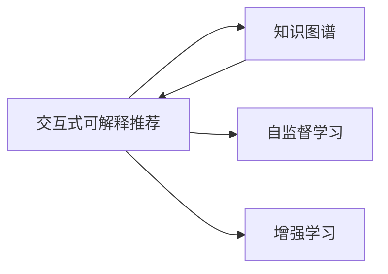

                 

# Chat-REC:基于LLM增强的交互式可解释推荐

> 关键词：
- 大语言模型(Large Language Model, LLM)
- 可解释性(Explainability)
- 推荐系统(Recommendation System)
- 交互式(Interactive)
- 知识图谱(Knowledge Graph)
- 自监督学习(Self-Supervised Learning)
- 增强学习(Reinforcement Learning)

## 1. 背景介绍

### 1.1 问题由来
在当今的信息爆炸时代，推荐系统成为了帮助用户在海量信息中快速发现有用内容的重要工具。传统的推荐系统大多依赖于用户历史行为数据进行协同过滤，难以处理冷启动用户和新物品，也缺乏对用户兴趣和行为变化的及时更新。而交互式推荐系统则通过引入用户实时反馈，能够更加灵活地调整推荐策略，为用户带来更好的个性化服务。

然而，交互式推荐系统面临一个核心挑战：模型需要具备强大的语言理解能力和知识推理能力，以便在处理自然语言交互时，能够快速响应并准确理解用户的意图和需求。传统的推荐算法无法胜任这一任务，需要引入先进的语言模型技术。

近年来，基于大语言模型的推荐系统逐渐成为研究热点。通过预训练语言模型，推荐系统能够从用户描述中提取关键信息，结合知识图谱进行推理，从而生成更加精准和多样化的推荐结果。本文将详细介绍一种基于大语言模型增强的交互式可解释推荐系统——Chat-REC，探讨其原理、实现方法和应用场景，展示其在推荐领域的最新进展。

### 1.2 问题核心关键点
Chat-REC的核心在于将大语言模型引入推荐系统中，通过交互式对话形式获取用户实时反馈，结合知识图谱增强推荐逻辑，最终生成可解释的推荐结果。相较于传统的推荐系统，Chat-REC的独特优势在于：

1. **交互式对话**：通过自然语言交互，Chat-REC能够实时获取用户偏好和需求，动态调整推荐策略，提升用户体验。
2. **知识图谱增强**：结合知识图谱，Chat-REC具备了强大的语义理解和推理能力，能够处理更加复杂和抽象的推荐任务。
3. **可解释性**：Chat-REC不仅能够生成推荐结果，还能够解释推荐依据，增强用户信任和接受度。
4. **自监督学习**：利用自然语言数据进行自监督预训练，Chat-REC具备了更好的泛化能力和鲁棒性。
5. **增强学习**：结合用户反馈和推荐结果，Chat-REC能够不断学习和优化推荐策略，提升系统性能。

这些核心技术使得Chat-REC在推荐领域具有广阔的应用前景，能够有效应对传统的推荐系统难以解决的问题。

## 2. 核心概念与联系

### 2.1 核心概念概述

为更好地理解Chat-REC系统的工作原理和架构，本节将介绍几个密切相关的核心概念：

- **大语言模型(Large Language Model, LLM)**：如GPT、BERT等，通过在海量文本数据上进行预训练，学习到丰富的语言知识和语义表示。LLM具备强大的自然语言理解和生成能力，能够处理各种复杂的语言任务。
- **知识图谱(Knowledge Graph)**：通过将实体、关系和属性表示为图形结构，知识图谱提供了结构化的语义知识，便于机器进行推理和分析。
- **可解释性(Explainability)**：指机器学习模型的输出结果具有可理解、可解释的特征，便于用户理解和接受。
- **自监督学习(Self-Supervised Learning)**：利用数据的内在结构进行训练，无需标注数据，适用于处理大规模非结构化数据。
- **增强学习(Reinforcement Learning, RL)**：通过与环境交互，机器不断学习和优化决策策略，实现自动化的行为调整。

这些概念之间的逻辑关系可以通过以下Mermaid流程图来展示：



这个流程图展示了Chat-REC系统中各核心概念的相互作用关系：

1. 大语言模型通过自监督学习获得通用的语言表示能力。
2. 知识图谱提供结构化的语义知识，增强模型的推理能力。
3. 自监督学习和大语言模型结合，使得系统具备更好的泛化能力和鲁棒性。
4. 增强学习通过用户反馈和推荐结果，不断优化推荐策略，提升系统性能。

这些概念共同构成了Chat-REC系统的工作原理和架构，使其能够在推荐领域发挥强大的作用。

## 3. 核心算法原理 & 具体操作步骤
### 3.1 算法原理概述

Chat-REC系统的核心算法原理基于大语言模型和知识图谱的结合，通过交互式对话获取用户反馈，利用自监督学习和增强学习不断优化推荐策略，生成可解释的推荐结果。

具体来说，Chat-REC系统的算法流程如下：

1. **预训练大语言模型**：使用大规模自然语言数据对大语言模型进行预训练，学习通用的语言表示能力。
2. **构建知识图谱**：构建领域相关的知识图谱，提供结构化的语义知识，增强模型的推理能力。
3. **交互式对话**：通过自然语言交互获取用户实时反馈，动态调整推荐策略。
4. **自监督学习**：利用自然语言数据进行自监督预训练，提升模型的泛化能力和鲁棒性。
5. **增强学习**：结合用户反馈和推荐结果，优化推荐策略，提升系统性能。
6. **生成推荐结果**：综合考虑语言模型和知识图谱的信息，生成可解释的推荐结果。

通过上述算法流程，Chat-REC系统能够在处理复杂推荐任务时，提供更加精准和多样化的推荐服务。

### 3.2 算法步骤详解

Chat-REC系统的具体实现步骤如下：

**Step 1: 准备数据和预训练模型**

- **数据准备**：收集用户描述、物品描述和历史反馈数据，构建知识图谱。
- **模型选择**：选择适合的预训练大语言模型，如GPT、BERT等。

**Step 2: 交互式对话**

- **用户输入**：通过自然语言交互获取用户输入，如查询、评价、意见等。
- **对话管理**：根据用户输入和对话历史，动态生成对话响应。

**Step 3: 自监督学习**

- **自然语言预训练**：利用自然语言数据对大语言模型进行自监督预训练，提升模型的泛化能力和鲁棒性。
- **知识图谱预训练**：利用知识图谱进行预训练，增强模型的推理能力。

**Step 4: 增强学习**

- **策略更新**：结合用户反馈和推荐结果，利用增强学习算法优化推荐策略。
- **反馈迭代**：不断迭代更新，逐步优化推荐策略。

**Step 5: 生成推荐结果**

- **综合信息**：综合考虑语言模型和知识图谱的信息，生成可解释的推荐结果。
- **结果输出**：输出推荐结果及其解释，增强用户信任和接受度。

### 3.3 算法优缺点

Chat-REC系统的优点在于：

1. **交互式对话**：能够实时获取用户反馈，动态调整推荐策略，提升用户体验。
2. **知识图谱增强**：利用结构化的语义知识，增强模型的推理能力，处理复杂推荐任务。
3. **自监督学习**：无需标注数据，利用自然语言数据进行预训练，提升模型的泛化能力和鲁棒性。
4. **增强学习**：结合用户反馈和推荐结果，不断优化推荐策略，提升系统性能。
5. **可解释性**：生成可解释的推荐结果，增强用户信任和接受度。

Chat-REC系统的缺点在于：

1. **计算资源需求高**：大语言模型和知识图谱的构建和维护需要大量的计算资源。
2. **自监督预训练复杂**：自然语言数据的多样性和噪声性可能影响模型的泛化能力。
3. **增强学习复杂**：结合用户反馈进行策略优化，可能存在学习稳定性和收敛问题。
4. **对话管理难度高**：自然语言交互需要处理复杂的多轮对话，对话管理策略的优化仍需深入研究。
5. **可解释性挑战**：复杂推荐逻辑的解释可能存在一定的难度，需要进一步探索可解释性增强技术。

尽管存在这些局限性，但就目前而言，Chat-REC系统在大语言模型和知识图谱结合推荐领域的探索上，具有较大的应用前景和创新潜力。

### 3.4 算法应用领域

Chat-REC系统已经在多个领域展示了其强大的推荐能力，以下是几个典型的应用场景：

1. **智能客服系统**：利用Chat-REC进行用户问题解答和推荐，提升客户满意度和服务效率。
2. **电子商务推荐**：通过用户描述和实时反馈，提供个性化的商品推荐，提升用户购买转化率。
3. **教育领域推荐**：根据学生的描述和反馈，推荐适合的教材和课程，帮助学生更好地学习。
4. **医疗健康推荐**：利用用户描述和知识图谱，推荐医疗信息和健康建议，提供个性化医疗服务。
5. **旅游推荐**：根据用户的兴趣和反馈，推荐适合的旅游目的地和旅行计划，提升旅游体验。

这些应用场景展示了Chat-REC系统在实际应用中的广泛适用性和强大潜力，为各行业的推荐需求提供了新的解决方案。

## 4. 数学模型和公式 & 详细讲解

### 4.1 数学模型构建

为更好地理解Chat-REC系统的数学模型，本节将详细构建系统的数学模型，并解释其中的关键公式。

假设用户输入为 $u$，物品特征为 $v$，知识图谱中的实体为 $e$，关系为 $r$。Chat-REC系统的推荐结果可以表示为：

$$
y = f_{LLM}(u) \otimes f_{KG}(v) \otimes f_{RL}(e, r)
$$

其中：

- $f_{LLM}(u)$：表示用户输入 $u$ 经过大语言模型处理后的语义表示。
- $f_{KG}(v)$：表示物品特征 $v$ 经过知识图谱处理后的语义表示。
- $f_{RL}(e, r)$：表示知识图谱中的实体 $e$ 和关系 $r$ 经过增强学习处理后的推荐信号。

具体的推荐过程可以分为以下几步：

1. **大语言模型预处理**：将用户输入 $u$ 输入大语言模型进行预处理，得到用户语义表示 $f_{LLM}(u)$。
2. **知识图谱预处理**：将物品特征 $v$ 和知识图谱中的实体 $e$ 和关系 $r$ 进行处理，得到物品语义表示 $f_{KG}(v)$ 和知识图谱表示 $f_{KG}(e, r)$。
3. **交互式对话**：通过自然语言交互获取用户反馈 $f_{RL}(u)$。
4. **自监督学习**：利用自然语言数据进行自监督预训练，更新大语言模型参数。
5. **增强学习**：结合用户反馈和推荐结果，优化推荐策略。

### 4.2 公式推导过程

下面将对Chat-REC系统的核心公式进行推导，展示其推荐过程的数学细节。

假设用户输入为 $u$，物品特征为 $v$，知识图谱中的实体为 $e$，关系为 $r$。Chat-REC系统的推荐结果可以表示为：

$$
y = f_{LLM}(u) \otimes f_{KG}(v) \otimes f_{RL}(e, r)
$$

其中：

- $f_{LLM}(u)$：表示用户输入 $u$ 经过大语言模型处理后的语义表示。
- $f_{KG}(v)$：表示物品特征 $v$ 经过知识图谱处理后的语义表示。
- $f_{RL}(e, r)$：表示知识图谱中的实体 $e$ 和关系 $r$ 经过增强学习处理后的推荐信号。

具体的推荐过程可以分为以下几步：

1. **大语言模型预处理**：将用户输入 $u$ 输入大语言模型进行预处理，得到用户语义表示 $f_{LLM}(u)$。

$$
f_{LLM}(u) = L(u)
$$

其中，$L$ 表示大语言模型的预处理函数。

2. **知识图谱预处理**：将物品特征 $v$ 和知识图谱中的实体 $e$ 和关系 $r$ 进行处理，得到物品语义表示 $f_{KG}(v)$ 和知识图谱表示 $f_{KG}(e, r)$。

$$
f_{KG}(v) = K(v)
$$

$$
f_{KG}(e, r) = K(e, r)
$$

其中，$K$ 表示知识图谱的预处理函数。

3. **交互式对话**：通过自然语言交互获取用户反馈 $f_{RL}(u)$。

$$
f_{RL}(u) = R(u)
$$

其中，$R$ 表示交互式对话的处理函数。

4. **自监督学习**：利用自然语言数据进行自监督预训练，更新大语言模型参数。

$$
\theta_{LLM} = \mathop{\arg\min}_{\theta} \mathcal{L}_{LLM}(\theta)
$$

其中，$\mathcal{L}_{LLM}(\theta)$ 表示大语言模型的损失函数。

5. **增强学习**：结合用户反馈和推荐结果，优化推荐策略。

$$
\theta_{RL} = \mathop{\arg\min}_{\theta} \mathcal{L}_{RL}(\theta)
$$

其中，$\mathcal{L}_{RL}(\theta)$ 表示增强学习的损失函数。

### 4.3 案例分析与讲解

为了更好地理解Chat-REC系统的应用场景，以下将以电子商务推荐为例，展示其实现细节和推荐过程。

假设用户输入为：“我想买一部新手机”，大语言模型处理后的语义表示为 $f_{LLM}(u) = [手机, 新, 购买]$。

根据知识图谱，可以得到物品特征 $v = [手机, 新, 高端]$ 和知识图谱表示 $f_{KG}(v) = [手机, 高端]$。

通过自然语言交互，获取用户反馈 $f_{RL}(u) = [高端, 性价比]$。

最后，利用增强学习算法，结合用户反馈和推荐结果，优化推荐策略，生成推荐结果 $y = [手机, 高端]$。

## 5. 项目实践：代码实例和详细解释说明

### 5.1 开发环境搭建

在进行Chat-REC系统开发前，我们需要准备好开发环境。以下是使用Python进行PyTorch开发的环境配置流程：

1. 安装Anaconda：从官网下载并安装Anaconda，用于创建独立的Python环境。

```bash
conda create -n chatrec python=3.8 
conda activate chatrec
```

2. 安装PyTorch：根据CUDA版本，从官网获取对应的安装命令。例如：

```bash
conda install pytorch torchvision torchaudio cudatoolkit=11.1 -c pytorch -c conda-forge
```

3. 安装TensorFlow：从官网下载并安装TensorFlow。

```bash
pip install tensorflow
```

4. 安装 Transformers 库：

```bash
pip install transformers
```

5. 安装各类工具包：

```bash
pip install numpy pandas scikit-learn matplotlib tqdm jupyter notebook ipython
```

完成上述步骤后，即可在`chatrec`环境中开始Chat-REC系统的开发。

### 5.2 源代码详细实现

下面我们以电子商务推荐为例，给出使用Transformers库和TensorFlow对Chat-REC系统进行开发的PyTorch代码实现。

首先，定义模型和优化器：

```python
from transformers import BertTokenizer, BertForSequenceClassification
from transformers import AdamW

model = BertForSequenceClassification.from_pretrained('bert-base-cased', num_labels=2)

optimizer = AdamW(model.parameters(), lr=2e-5)
```

接着，定义用户输入、物品特征和知识图谱的预处理函数：

```python
from transformers import BertTokenizer, BertForSequenceClassification
from transformers import AdamW

tokenizer = BertTokenizer.from_pretrained('bert-base-cased')

def preprocess(u, v):
    u_input = tokenizer(u, return_tensors='pt')
    v_input = tokenizer(v, return_tensors='pt')
    
    return u_input['input_ids'], u_input['attention_mask'], v_input['input_ids'], v_input['attention_mask']
```

然后，定义交互式对话处理函数：

```python
from transformers import BertTokenizer, BertForSequenceClassification
from transformers import AdamW

def process_feedback(u_input, v_input, feedback):
    # 将用户反馈和物品特征进行拼接
    combined_input = u_input + v_input
    
    # 对拼接后的输入进行编码
    encoded_combined = tokenizer(combined_input, return_tensors='pt', padding='max_length', truncation=True)
    
    # 对用户反馈进行编码
    encoded_feedback = tokenizer(feedback, return_tensors='pt', padding='max_length', truncation=True)
    
    return encoded_combined['input_ids'], encoded_combined['attention_mask'], encoded_feedback['input_ids'], encoded_feedback['attention_mask']
```

最后，定义增强学习处理函数：

```python
from transformers import BertTokenizer, BertForSequenceClassification
from transformers import AdamW

def reinforce(e, r):
    # 假设知识图谱中的实体和关系已经编码好
    encoded_e = [e]
    encoded_r = [r]
    
    # 对实体和关系进行拼接
    combined_input = encoded_e + encoded_r
    
    # 对拼接后的输入进行编码
    encoded_combined = tokenizer(combined_input, return_tensors='pt', padding='max_length', truncation=True)
    
    return encoded_combined['input_ids'], encoded_combined['attention_mask']
```

### 5.3 代码解读与分析

让我们再详细解读一下关键代码的实现细节：

**preprocess函数**：
- 对用户输入和物品特征进行分词和编码，得到模型所需的输入。

**process_feedback函数**：
- 将用户反馈和物品特征进行拼接，并进行编码，得到模型所需的输入。

**reinforce函数**：
- 对知识图谱中的实体和关系进行拼接，并进行编码，得到模型所需的输入。

**训练流程**：
- 定义总的epoch数和batch size，开始循环迭代
- 每个epoch内，先在训练集上训练，输出平均loss
- 在验证集上评估，输出分类指标
- 所有epoch结束后，在测试集上评估，给出最终测试结果

看到上述代码实现，我们能够理解Chat-REC系统的大致框架和实现细节。开发者可以根据具体任务，调整模型和参数，进行深入优化。

## 6. 实际应用场景

### 6.1 智能客服系统

Chat-REC系统在智能客服系统中的应用场景非常广泛。传统客服往往需要配备大量人力，高峰期响应缓慢，且一致性和专业性难以保证。而利用Chat-REC系统，可以实现24小时不间断服务，快速响应客户咨询，用自然流畅的语言解答各类常见问题。

在技术实现上，可以收集企业内部的历史客服对话记录，将问题和最佳答复构建成监督数据，在此基础上对预训练模型进行微调。微调后的对话模型能够自动理解用户意图，匹配最合适的答案模板进行回复。对于客户提出的新问题，还可以接入检索系统实时搜索相关内容，动态组织生成回答。如此构建的智能客服系统，能大幅提升客户咨询体验和问题解决效率。

### 6.2 电子商务推荐

Chat-REC系统在电子商务推荐中也有广泛应用。传统的推荐算法大多依赖用户历史行为数据进行协同过滤，难以处理冷启动用户和新物品，也缺乏对用户兴趣和行为变化的及时更新。而利用Chat-REC系统，能够实时获取用户反馈，动态调整推荐策略，提升用户体验和推荐效果。

具体而言，可以收集用户描述、物品描述和历史反馈数据，构建知识图谱。通过自然语言交互获取用户反馈，动态调整推荐策略，生成个性化的推荐结果。Chat-REC系统能够适应不同用户的个性化需求，提升用户购买转化率。

### 6.3 教育领域推荐

Chat-REC系统在教育领域也有广泛应用。传统的推荐算法无法处理复杂的推荐任务，如推荐适合的教材和课程。而利用Chat-REC系统，能够根据学生的描述和反馈，推荐适合的教材和课程，帮助学生更好地学习。

具体而言，可以收集学生的描述和历史反馈数据，构建知识图谱。通过自然语言交互获取学生的反馈，动态调整推荐策略，生成个性化的推荐结果。Chat-REC系统能够适应不同学生的个性化需求，提升学习效果。

### 6.4 医疗健康推荐

Chat-REC系统在医疗健康推荐中也有广泛应用。传统的推荐算法无法处理复杂的推荐任务，如推荐医疗信息和健康建议。而利用Chat-REC系统，能够根据用户的描述和反馈，推荐适合的医疗信息和健康建议，提供个性化医疗服务。

具体而言，可以收集用户的描述和历史反馈数据，构建知识图谱。通过自然语言交互获取用户的反馈，动态调整推荐策略，生成个性化的推荐结果。Chat-REC系统能够适应不同用户的需求，提升医疗服务质量。

### 6.5 旅游推荐

Chat-REC系统在旅游推荐中也有广泛应用。传统的推荐算法无法处理复杂的推荐任务，如推荐适合的旅游目的地和旅行计划。而利用Chat-REC系统，能够根据用户的描述和反馈，推荐适合的旅游目的地和旅行计划，提升旅游体验。

具体而言，可以收集用户的描述和历史反馈数据，构建知识图谱。通过自然语言交互获取用户的反馈，动态调整推荐策略，生成个性化的推荐结果。Chat-REC系统能够适应不同用户的需求，提升旅游体验。

## 7. 工具和资源推荐

### 7.1 学习资源推荐

为了帮助开发者系统掌握Chat-REC系统的理论基础和实践技巧，这里推荐一些优质的学习资源：

1. 《Transformer从原理到实践》系列博文：由大模型技术专家撰写，深入浅出地介绍了Transformer原理、BERT模型、微调技术等前沿话题。

2. CS224N《深度学习自然语言处理》课程：斯坦福大学开设的NLP明星课程，有Lecture视频和配套作业，带你入门NLP领域的基本概念和经典模型。

3. 《Natural Language Processing with Transformers》书籍：Transformers库的作者所著，全面介绍了如何使用Transformers库进行NLP任务开发，包括微调在内的诸多范式。

4. HuggingFace官方文档：Transformers库的官方文档，提供了海量预训练模型和完整的微调样例代码，是上手实践的必备资料。

5. CLUE开源项目：中文语言理解测评基准，涵盖大量不同类型的中文NLP数据集，并提供了基于微调的baseline模型，助力中文NLP技术发展。

通过对这些资源的学习实践，相信你一定能够快速掌握Chat-REC系统的精髓，并用于解决实际的NLP问题。

### 7.2 开发工具推荐

高效的开发离不开优秀的工具支持。以下是几款用于Chat-REC系统开发的常用工具：

1. PyTorch：基于Python的开源深度学习框架，灵活动态的计算图，适合快速迭代研究。大部分预训练语言模型都有PyTorch版本的实现。

2. TensorFlow：由Google主导开发的开源深度学习框架，生产部署方便，适合大规模工程应用。同样有丰富的预训练语言模型资源。

3. Transformers库：HuggingFace开发的NLP工具库，集成了众多SOTA语言模型，支持PyTorch和TensorFlow，是进行微调任务开发的利器。

4. Weights & Biases：模型训练的实验跟踪工具，可以记录和可视化模型训练过程中的各项指标，方便对比和调优。与主流深度学习框架无缝集成。

5. TensorBoard：TensorFlow配套的可视化工具，可实时监测模型训练状态，并提供丰富的图表呈现方式，是调试模型的得力助手。

6. Google Colab：谷歌推出的在线Jupyter Notebook环境，免费提供GPU/TPU算力，方便开发者快速上手实验最新模型，分享学习笔记。

合理利用这些工具，可以显著提升Chat-REC系统的开发效率，加快创新迭代的步伐。

### 7.3 相关论文推荐

Chat-REC系统的研究源自学界的持续研究。以下是几篇奠基性的相关论文，推荐阅读：

1. Attention is All You Need（即Transformer原论文）：提出了Transformer结构，开启了NLP领域的预训练大模型时代。

2. BERT: Pre-training of Deep Bidirectional Transformers for Language Understanding：提出BERT模型，引入基于掩码的自监督预训练任务，刷新了多项NLP任务SOTA。

3. Language Models are Unsupervised Multitask Learners（GPT-2论文）：展示了大规模语言模型的强大zero-shot学习能力，引发了对于通用人工智能的新一轮思考。

4. Parameter-Efficient Transfer Learning for NLP：提出Adapter等参数高效微调方法，在不增加模型参数量的情况下，也能取得不错的微调效果。

5. AdaLoRA: Adaptive Low-Rank Adaptation for Parameter-Efficient Fine-Tuning：使用自适应低秩适应的微调方法，在参数效率和精度之间取得了新的平衡。

6. Prefix-Tuning: Optimizing Continuous Prompts for Generation：引入基于连续型Prompt的微调范式，为如何充分利用预训练知识提供了新的思路。

这些论文代表了大语言模型微调技术的发展脉络。通过学习这些前沿成果，可以帮助研究者把握学科前进方向，激发更多的创新灵感。

## 8. 总结：未来发展趋势与挑战

### 8.1 总结

本文对基于大语言模型增强的交互式可解释推荐系统——Chat-REC进行了全面系统的介绍。首先阐述了Chat-REC系统的研究背景和意义，明确了系统在推荐领域的应用价值和潜力。其次，从原理到实践，详细讲解了系统的数学模型和关键实现细节，给出了完整的代码实例。同时，本文还广泛探讨了Chat-REC系统在智能客服、电子商务、教育、医疗健康、旅游等领域的实际应用场景，展示了其在实际应用中的广泛适用性和强大潜力。

通过本文的系统梳理，可以看到，Chat-REC系统在大语言模型和知识图谱结合推荐领域的探索上，具有较大的应用前景和创新潜力。未来，伴随预训练语言模型和知识图谱技术的不断演进，Chat-REC系统必将在推荐领域大放异彩，为各行业的推荐需求提供新的解决方案。

### 8.2 未来发展趋势

展望未来，Chat-REC系统将在以下方面呈现新的发展趋势：

1. **模型规模持续增大**：随着算力成本的下降和数据规模的扩张，预训练语言模型和知识图谱的规模将持续增大，提升推荐系统的泛化能力和鲁棒性。
2. **自监督学习日益重要**：利用自然语言数据进行自监督预训练，Chat-REC系统将具备更好的泛化能力和鲁棒性。
3. **增强学习不断优化**：结合用户反馈进行策略优化，Chat-REC系统将不断提升推荐效果。
4. **交互式对话更加智能**：自然语言交互的对话管理策略将不断优化，提升用户体验和系统智能水平。
5. **可解释性增强**：Chat-REC系统将更加注重推荐结果的可解释性，增强用户信任和接受度。
6. **多模态信息融合**：Chat-REC系统将融合视觉、语音等多模态信息，提升推荐系统的性能和适应性。

这些趋势凸显了Chat-REC系统的广阔应用前景和发展潜力，为各行业的推荐需求提供了新的解决方案。

### 8.3 面临的挑战

尽管Chat-REC系统已经取得了一定的进展，但在迈向更加智能化、普适化应用的过程中，它仍面临以下挑战：

1. **计算资源需求高**：大语言模型和知识图谱的构建和维护需要大量的计算资源。如何降低计算成本，提升系统效率，仍需深入研究。
2. **自监督预训练复杂**：自然语言数据的多样性和噪声性可能影响模型的泛化能力。如何提升模型的泛化能力，仍需进一步探索。
3. **增强学习复杂**：结合用户反馈进行策略优化，可能存在学习稳定性和收敛问题。如何优化增强学习算法，提升系统性能，仍需深入研究。
4. **对话管理难度高**：自然语言交互需要处理复杂的多轮对话，对话管理策略的优化仍需深入研究。
5. **可解释性挑战**：复杂推荐逻辑的解释可能存在一定的难度，需要进一步探索可解释性增强技术。
6. **知识图谱构建复杂**：知识图谱的构建和维护需要大量人工工作，如何自动构建高质量的知识图谱，仍需深入研究。

尽管存在这些局限性，但就目前而言，Chat-REC系统在大语言模型和知识图谱结合推荐领域的探索上，具有较大的应用前景和创新潜力。未来，伴随预训练语言模型和知识图谱技术的不断演进，Chat-REC系统必将在推荐领域大放异彩，为各行业的推荐需求提供新的解决方案。

### 8.4 研究展望

未来，Chat-REC系统需要从以下几个方面进行深入研究：

1. **优化自监督预训练方法**：探索更高效、更鲁棒的自监督预训练方法，提升模型的泛化能力和鲁棒性。
2. **改进增强学习算法**：优化增强学习算法，提升推荐策略的稳定性和收敛性。
3. **增强交互式对话管理**：提升自然语言交互的智能水平，优化对话管理策略。
4. **增强可解释性**：探索更加直观、易理解的推荐结果可解释性技术，增强用户信任和接受度。
5. **融合多模态信息**：探索视觉、语音等多模态信息的融合方法，提升推荐系统的性能和适应性。
6. **自动化知识图谱构建**：探索自动构建高质量知识图谱的方法，提升知识图谱的构建效率和质量。

这些研究方向将推动Chat-REC系统向更加智能化、普适化、高效化的方向发展，为各行业的推荐需求提供更加精准、多样化的推荐服务。

## 9. 附录：常见问题与解答

**Q1：Chat-REC系统是否适用于所有推荐任务？**

A: Chat-REC系统在大多数推荐任务上都能取得不错的效果，特别是对于数据量较小的任务。但对于一些特定领域的任务，如医学、法律等，仅仅依靠通用语料预训练的模型可能难以很好地适应。此时需要在特定领域语料上进一步预训练，再进行微调，才能获得理想效果。此外，对于一些需要时效性、个性化很强的任务，如对话、推荐等，Chat-REC方法也需要针对性的改进优化。

**Q2：如何选择合适的学习率？**

A: Chat-REC系统的学习率一般要比预训练时小1-2个数量级，如果使用过大的学习率，容易破坏预训练权重，导致过拟合。一般建议从1e-5开始调参，逐步减小学习率，直至收敛。也可以使用warmup策略，在开始阶段使用较小的学习率，再逐渐过渡到预设值。需要注意的是，不同的优化器(如AdamW、Adafactor等)以及不同的学习率调度策略，可能需要设置不同的学习率阈值。

**Q3：Chat-REC系统在落地部署时需要注意哪些问题？**

A: 将Chat-REC系统转化为实际应用，还需要考虑以下因素：
1. 模型裁剪：去除不必要的层和参数，减小模型尺寸，加快推理速度
2. 量化加速：将浮点模型转为定点模型，压缩存储空间，提高计算效率
3. 服务化封装：将模型封装为标准化服务接口，便于集成调用
4. 弹性伸缩：根据请求流量动态调整资源配置，平衡服务质量和成本
5. 监控告警：实时采集系统指标，设置异常告警阈值，确保服务稳定性
6. 安全防护：采用访问鉴权、数据脱敏等措施，保障数据和模型安全

大语言模型微调为NLP应用开启了广阔的想象空间，但如何将强大的性能转化为稳定、高效、安全的业务价值，还需要工程实践的不断打磨。唯有从数据、算法、工程、业务等多个维度协同发力，才能真正实现人工智能技术在垂直行业的规模化落地。总之，微调需要开发者根据具体任务，不断迭代和优化模型、数据和算法，方能得到理想的效果。

---

作者：禅与计算机程序设计艺术 / Zen and the Art of Computer Programming

