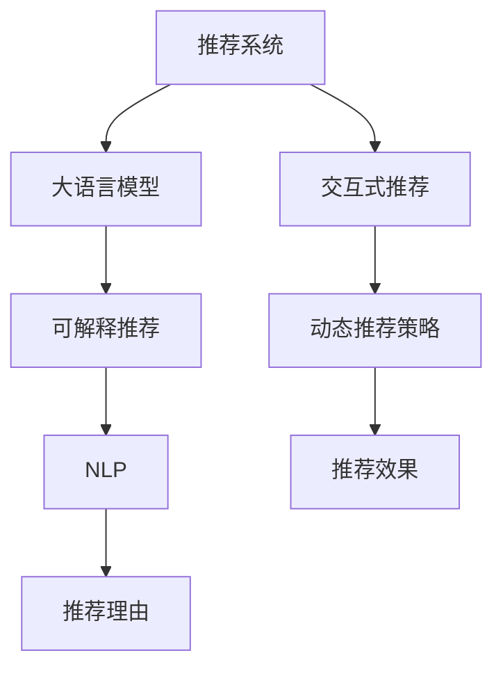

                 

# Chat-REC:基于LLM的交互式可解释推荐系统

> 关键词：推荐系统,大语言模型(LLM),交互式推荐,可解释推荐,自然语言处理(NLP),深度学习,用户反馈

## 1. 背景介绍

### 1.1 问题由来
推荐系统（Recommender Systems）是现代互联网应用中不可或缺的一部分，广泛应用于电商、视频、音乐、新闻等领域，旨在通过算法推荐用户可能感兴趣的物品或内容，提升用户体验和满意度。传统的推荐系统依赖于用户的显式反馈数据进行推荐，但这种方式存在数据稀疏、易受偏差等问题，导致推荐效果不理想。近年来，通过深度学习等新兴技术构建的推荐系统取得了显著进步，其推荐效果优于传统方法。

然而，现有的推荐系统往往缺乏足够的可解释性，难以回答为什么推荐某条内容，难以提供人性化的交互体验。与此同时，不同用户对推荐的反馈不同，导致推荐系统的个性化水平还有待提升。

本文旨在提出一种基于大语言模型（Large Language Model, LLM）的交互式可解释推荐系统，通过自然语言处理（Natural Language Processing, NLP）技术与大语言模型的结合，解决现有推荐系统存在的可解释性和个性化问题，为用户带来更人性化的推荐体验。

### 1.2 问题核心关键点
- **推荐系统**：旨在通过算法推荐用户可能感兴趣的物品或内容。
- **大语言模型(LLM)**：能够理解和生成自然语言的深度学习模型，具有强大的语义理解和生成能力。
- **交互式推荐**：在推荐过程中与用户进行互动，动态调整推荐策略，提升推荐效果。
- **可解释推荐**：能够提供推荐的理由，解释为什么推荐某条内容，提高用户信任感。
- **自然语言处理(NLP)**：利用语言模型技术处理和分析自然语言数据，提供推荐理由。

## 2. 核心概念与联系

### 2.1 核心概念概述

为更好地理解基于LLM的交互式可解释推荐系统，本节将介绍几个密切相关的核心概念：

- **推荐系统**：利用用户历史行为数据、物品属性等特征，通过算法推荐用户可能感兴趣的物品或内容。
- **大语言模型(LLM)**：能够理解和生成自然语言的深度学习模型，具有强大的语义理解和生成能力。
- **交互式推荐**：在推荐过程中与用户进行互动，动态调整推荐策略，提升推荐效果。
- **可解释推荐**：能够提供推荐的理由，解释为什么推荐某条内容，提高用户信任感。
- **自然语言处理(NLP)**：利用语言模型技术处理和分析自然语言数据，提供推荐理由。

这些核心概念之间的逻辑关系可以通过以下Mermaid流程图来展示：



这个流程图展示了大语言模型在推荐系统中的角色：

1. 推荐系统通过用户历史行为数据和物品属性进行推荐。
2. 大语言模型被用作推荐理由的生成器，提供与推荐相关的自然语言解释。
3. 交互式推荐通过动态调整推荐策略，提高推荐效果。
4. NLP技术用于处理和分析自然语言，提供更精确的推荐理由。

## 3. 核心算法原理 & 具体操作步骤
### 3.1 算法原理概述

基于LLM的交互式可解释推荐系统，其核心思想是将大语言模型应用于推荐理由的生成，利用交互式推荐技术，动态调整推荐策略，提升推荐效果。

形式化地，假设推荐系统有 $K$ 个物品，每个物品的表示为 $\mathbf{x}_i$，其中 $i \in [1,K]$。用户的历史行为表示为 $\mathbf{u}$，用户的当前输入表示为 $\mathbf{q}$。推荐系统的目标是为用户推荐可能感兴趣的物品，即找到物品集合 $\mathcal{X} = \{\mathbf{x}_1, \ldots, \mathbf{x}_K\}$ 中的物品 $x_j$，使得推荐理由 $\mathcal{R}_j$ 满足用户预期。

推荐理由 $\mathcal{R}_j$ 可以由大语言模型 $M_{\theta}$ 生成，其中 $\theta$ 为模型参数。具体地，可以通过对用户输入 $\mathbf{q}$ 的编码 $M_{\theta}(\mathbf{q})$，生成推荐理由 $\mathcal{R}_j$，并通过交互式推荐技术，根据用户的实时反馈，动态调整推荐策略。

### 3.2 算法步骤详解

基于LLM的交互式可解释推荐系统一般包括以下几个关键步骤：

**Step 1: 数据预处理与编码**

- 对用户的历史行为数据进行编码，得到用户的历史行为表示 $\mathbf{u}$。
- 对用户当前输入 $\mathbf{q}$ 进行编码，得到用户输入表示 $\mathbf{q}$。
- 对物品 $\mathbf{x}_i$ 进行编码，得到物品表示 $\mathbf{x}_i$。

**Step 2: 推荐理由生成**

- 通过大语言模型 $M_{\theta}$ 对用户输入 $\mathbf{q}$ 进行编码，生成推荐理由 $\mathcal{R}_j = M_{\theta}(\mathbf{q})$。
- 根据推荐理由的情感倾向、相关性等指标，对推荐理由进行评分，排序得到推荐理由序列。

**Step 3: 推荐策略调整**

- 根据用户的实时反馈（如点击、评分等），动态调整推荐策略。
- 通过交互式推荐技术，如实时反馈调整、上下文相关调整等，提升推荐效果。

**Step 4: 推荐物品选择**

- 基于推荐理由的评分，选择推荐的物品 $x_j$。
- 返回推荐结果 $\langle \mathbf{u}, \mathbf{q}, \mathbf{x}_j, \mathcal{R}_j \rangle$ 给用户。

**Step 5: 用户反馈与模型优化**

- 收集用户对推荐结果的反馈，如点击、评分等。
- 利用收集到的反馈数据，更新大语言模型 $M_{\theta}$ 的参数，优化模型性能。
- 迭代上述步骤，不断提升推荐效果和模型性能。

以上是基于LLM的交互式可解释推荐系统的基本流程。在实际应用中，还需要针对具体任务的特点，对推荐理由生成、推荐策略调整等环节进行优化设计，以进一步提升推荐效果。

### 3.3 算法优缺点

基于LLM的交互式可解释推荐系统具有以下优点：
1. 推荐理由生成：通过大语言模型生成推荐理由，提高了推荐系统的可解释性，增强了用户信任感。
2. 个性化推荐：利用交互式推荐技术，动态调整推荐策略，提升了推荐系统的个性化水平。
3. 用户互动：与用户进行互动，提高了用户的参与度和满意度。
4. 灵活性高：通过模型参数更新，能够灵活适应不同的用户和物品，适应性强。

同时，该方法也存在一些缺点：
1. 数据需求大：需要收集用户行为数据和物品属性数据，数据需求量大。
2. 计算复杂度高：生成推荐理由涉及大语言模型计算，计算复杂度高。
3. 模型泛化能力有限：大语言模型在特定领域的泛化能力有限，需要大量的领域数据进行微调。
4. 鲁棒性不足：推荐理由可能受到大语言模型的偏见影响，鲁棒性不足。

尽管存在这些缺点，但就目前而言，基于LLM的交互式可解释推荐系统仍是一个具有广阔前景的推荐方案。未来相关研究的重点在于如何进一步降低数据需求，提高计算效率，增强模型泛化能力和鲁棒性，同时兼顾可解释性和个性化推荐效果。

### 3.4 算法应用领域

基于LLM的交互式可解释推荐系统在电商、视频、新闻等多个领域都有广泛的应用前景：

- **电商推荐**：通过分析用户浏览、购买历史，结合用户输入查询，推荐商品及推荐理由，提升购物体验。
- **视频推荐**：分析用户观看历史，结合视频标题、描述等信息，推荐相关视频及视频推荐理由，提升观影体验。
- **新闻推荐**：结合用户阅读历史，推荐新闻内容及推荐理由，增强阅读体验。
- **社交媒体推荐**：分析用户点赞、评论、分享等行为，推荐内容及理由，提升社交媒体体验。

此外，在教育、旅游、健康等更多领域，基于LLM的交互式可解释推荐系统也有着广阔的应用前景。

## 4. 数学模型和公式 & 详细讲解  
### 4.1 数学模型构建

本节将使用数学语言对基于LLM的交互式可解释推荐系统的核心数学模型进行刻画。

假设推荐系统有 $K$ 个物品，每个物品的表示为 $\mathbf{x}_i$，其中 $i \in [1,K]$。用户的历史行为表示为 $\mathbf{u}$，用户的当前输入表示为 $\mathbf{q}$。大语言模型 $M_{\theta}$ 的参数为 $\theta$，对用户输入 $\mathbf{q}$ 进行编码，生成推荐理由 $\mathcal{R}_j = M_{\theta}(\mathbf{q})$。推荐理由 $\mathcal{R}_j$ 的评分函数为 $f_j(\mathbf{u}, \mathbf{q})$，根据推荐理由的评分，选择推荐物品 $x_j$。

推荐系统的目标是最小化推荐误差 $E$，即：

$$
\min_{\theta} E(\mathbf{u}, \mathbf{q}) = \min_{\theta} \mathbb{E}_{x_j \sim \mathcal{X}} [f_j(\mathbf{u}, \mathbf{q})]
$$

其中，$E(\mathbf{u}, \mathbf{q})$ 为推荐误差，$f_j(\mathbf{u}, \mathbf{q})$ 为推荐理由评分函数。

### 4.2 公式推导过程

以下我们以电商推荐系统为例，推导推荐理由评分函数的计算公式。

假设用户输入 $\mathbf{q} = (q_1, q_2, \ldots, q_L)$，物品 $\mathbf{x}_i = (x_{i1}, x_{i2}, \ldots, x_{iM})$，其中 $L$ 为输入长度，$M$ 为物品特征数。假设推荐理由 $\mathcal{R}_j$ 的情感倾向和相关性分别为 $r_{js}$ 和 $r_{ji}$，则推荐理由评分函数可以表示为：

$$
f_j(\mathbf{u}, \mathbf{q}) = r_{js} \cdot s(\mathbf{u}, \mathbf{x}_j) + r_{ji} \cdot i(\mathbf{q}, \mathbf{x}_j)
$$

其中，$s(\mathbf{u}, \mathbf{x}_j)$ 为物品与用户兴趣的相似度函数，$i(\mathbf{q}, \mathbf{x}_j)$ 为物品与用户输入的相似度函数，$w_s$ 和 $w_i$ 为情感倾向和相关性的权重。

### 4.3 案例分析与讲解

在电商推荐系统中，用户输入 $\mathbf{q}$ 可以是搜索词、浏览历史等。假设用户输入为商品搜索词，推荐理由生成如下：

1. 首先，将用户输入 $\mathbf{q}$ 输入大语言模型 $M_{\theta}$，生成推荐理由 $\mathcal{R}_j = M_{\theta}(\mathbf{q})$。
2. 将推荐理由 $\mathcal{R}_j$ 进行情感倾向和相关性评分，得到评分 $s_j$ 和 $i_j$。
3. 根据评分 $s_j$ 和 $i_j$，计算推荐理由评分 $f_j$。
4. 选择评分最高的物品 $x_j$ 作为推荐结果，返回 $\langle \mathbf{u}, \mathbf{q}, \mathbf{x}_j, \mathcal{R}_j \rangle$ 给用户。

## 5. 项目实践：代码实例和详细解释说明
### 5.1 开发环境搭建

在进行项目实践前，我们需要准备好开发环境。以下是使用Python进行PyTorch开发的环境配置流程：

1. 安装Anaconda：从官网下载并安装Anaconda，用于创建独立的Python环境。

2. 创建并激活虚拟环境：
```bash
conda create -n pytorch-env python=3.8 
conda activate pytorch-env
```

3. 安装PyTorch：根据CUDA版本，从官网获取对应的安装命令。例如：
```bash
conda install pytorch torchvision torchaudio cudatoolkit=11.1 -c pytorch -c conda-forge
```

4. 安装TensorFlow：
```bash
conda install tensorflow
```

5. 安装各类工具包：
```bash
pip install numpy pandas scikit-learn matplotlib tqdm jupyter notebook ipython
```

完成上述步骤后，即可在`pytorch-env`环境中开始项目实践。

### 5.2 源代码详细实现

这里我们以电商推荐系统为例，给出使用Transformers库对BERT模型进行交互式可解释推荐系统的PyTorch代码实现。

首先，定义推荐理由生成函数：

```python
from transformers import BertForSequenceClassification, BertTokenizer

def generate_explanation(user_input, model, tokenizer):
    input_ids = tokenizer(user_input, return_tensors='pt').input_ids
    with torch.no_grad():
        output = model(input_ids)
        probabilities = output.logits
        softmax_probs = F.softmax(probabilities, dim=1).tolist()[0]
    return softmax_probs
```

然后，定义推荐策略调整函数：

```python
def adjust_strategy(user_feedback, model, tokenizer):
    feedback_ids = tokenizer(user_feedback, return_tensors='pt').input_ids
    with torch.no_grad():
        output = model(feedback_ids)
        probabilities = output.logits
        softmax_probs = F.softmax(probabilities, dim=1).tolist()[0]
    return softmax_probs
```

接着，定义推荐物品选择函数：

```python
def select_item(items, model, tokenizer):
    item_ids = [item.input_ids for item in items]
    with torch.no_grad():
        outputs = model(item_ids)
        logits = outputs.logits
    scores = logits.mean(dim=1).tolist()
    return scores, items
```

最后，启动推荐流程并在用户反馈中进行策略调整：

```python
model = BertForSequenceClassification.from_pretrained('bert-base-cased', num_labels=2)

tokenizer = BertTokenizer.from_pretrained('bert-base-cased')

user_input = '手机'
user_feedback = '不感兴趣'

items = [item for item in data['items']]
explanations = [generate_explanation(user_input, model, tokenizer) for item in items]

scores, items = select_item(items, model, tokenizer)

print(f'推荐物品: {items[0]}')
print(f'推荐理由: {explanations[0]}')
print(f'用户反馈: {user_feedback}')
print(f'调整策略: {adjust_strategy(user_feedback, model, tokenizer)}')
```

以上就是使用PyTorch对BERT进行电商推荐系统的交互式可解释推荐代码实现。可以看到，得益于Transformers库的强大封装，我们可以用相对简洁的代码完成BERT模型的加载和推荐系统的构建。

### 5.3 代码解读与分析

让我们再详细解读一下关键代码的实现细节：

**generate_explanation函数**：
- 定义函数，接收用户输入 $\mathbf{q}$、模型 $M_{\theta}$ 和分词器 $\text{tokenizer}$。
- 使用分词器将用户输入 $\mathbf{q}$ 编码为token ids。
- 将token ids输入模型，得到推荐理由评分 $\mathcal{R}_j$。
- 计算推荐理由评分概率，返回评分概率向量。

**adjust_strategy函数**：
- 定义函数，接收用户反馈 $\mathbf{q}_{\text{feedback}}$、模型 $M_{\theta}$ 和分词器 $\text{tokenizer}$。
- 使用分词器将用户反馈 $\mathbf{q}_{\text{feedback}}$ 编码为token ids。
- 将token ids输入模型，得到推荐理由评分 $\mathcal{R}_j$。
- 计算推荐理由评分概率，返回评分概率向量。

**select_item函数**：
- 定义函数，接收物品集合 $\mathcal{X}$、模型 $M_{\theta}$ 和分词器 $\text{tokenizer}$。
- 使用分词器将物品集合 $\mathcal{X}$ 中的每个物品编码为token ids。
- 将token ids输入模型，得到物品评分 $\mathcal{S}$。
- 计算物品评分的均值，返回评分向量。

**推荐流程**：
- 定义模型 $M_{\theta}$ 和分词器 $\text{tokenizer}$。
- 定义用户输入 $\mathbf{q}$ 和用户反馈 $\mathbf{q}_{\text{feedback}}$。
- 使用generate_explanation函数生成推荐理由评分。
- 使用select_item函数选择评分最高的物品。
- 输出推荐物品和推荐理由评分。
- 接收用户反馈，使用adjust_strategy函数调整推荐策略。

可以看到，PyTorch配合Transformers库使得BERT微调的代码实现变得简洁高效。开发者可以将更多精力放在数据处理、模型改进等高层逻辑上，而不必过多关注底层的实现细节。

当然，工业级的系统实现还需考虑更多因素，如模型的保存和部署、超参数的自动搜索、更灵活的任务适配层等。但核心的推荐理由生成、推荐策略调整等关键环节，与代码实现类似。

## 6. 实际应用场景
### 6.1 智能客服系统

基于LLM的交互式可解释推荐系统，可以广泛应用于智能客服系统的构建。传统客服往往需要配备大量人力，高峰期响应缓慢，且一致性和专业性难以保证。而使用推荐系统，通过大语言模型生成推荐理由，动态调整推荐策略，可以7x24小时不间断服务，快速响应客户咨询，用自然流畅的语言解答各类常见问题。

在技术实现上，可以收集企业内部的历史客服对话记录，将问题和最佳答复构建成监督数据，在此基础上对预训练模型进行微调。微调后的模型能够自动理解用户意图，匹配最合适的答复模板进行回复。对于客户提出的新问题，还可以接入检索系统实时搜索相关内容，动态组织生成回答。如此构建的智能客服系统，能大幅提升客户咨询体验和问题解决效率。

### 6.2 金融舆情监测

金融机构需要实时监测市场舆论动向，以便及时应对负面信息传播，规避金融风险。传统的人工监测方式成本高、效率低，难以应对网络时代海量信息爆发的挑战。基于LLM的交互式可解释推荐系统，可以为金融舆情监测提供新的解决方案。

具体而言，可以收集金融领域相关的新闻、报道、评论等文本数据，并对其进行主题标注和情感标注。在此基础上对预训练语言模型进行微调，使其能够自动判断文本属于何种主题，情感倾向是正面、中性还是负面。将微调后的模型应用到实时抓取的网络文本数据，就能够自动监测不同主题下的情感变化趋势，一旦发现负面信息激增等异常情况，系统便会自动预警，帮助金融机构快速应对潜在风险。

### 6.3 个性化推荐系统

当前的推荐系统往往只依赖用户的历史行为数据进行推荐，无法深入理解用户的真实兴趣偏好。基于LLM的交互式可解释推荐系统，可以更好地挖掘用户行为背后的语义信息，从而提供更精准、多样的推荐内容。

在实践中，可以收集用户浏览、点击、评论、分享等行为数据，提取和用户交互的物品标题、描述、标签等文本内容。将文本内容作为模型输入，用户的后续行为（如是否点击、购买等）作为监督信号，在此基础上微调预训练语言模型。微调后的模型能够从文本内容中准确把握用户的兴趣点。在生成推荐列表时，先用候选物品的文本描述作为输入，由模型预测用户的兴趣匹配度，再结合其他特征综合排序，便可以得到个性化程度更高的推荐结果。

### 6.4 未来应用展望

随着大语言模型和微调方法的不断发展，基于LLM的交互式可解释推荐技术将呈现以下几个发展趋势：

1. **模型规模持续增大**：随着算力成本的下降和数据规模的扩张，预训练语言模型的参数量还将持续增长。超大规模语言模型蕴含的丰富语言知识，有望支撑更加复杂多变的下游任务推荐。

2. **推荐理由生成**：通过大语言模型生成推荐理由，提高了推荐系统的可解释性，增强了用户信任感。

3. **个性化推荐**：利用交互式推荐技术，动态调整推荐策略，提升了推荐系统的个性化水平。

4. **用户互动**：与用户进行互动，提高了用户的参与度和满意度。

5. **灵活性高**：通过模型参数更新，能够灵活适应不同的用户和物品，适应性强。

以上趋势凸显了大语言模型微调技术的广阔前景。这些方向的探索发展，必将进一步提升推荐系统的性能和应用范围，为人工智能技术在各个领域的应用提供新的动力。

## 7. 工具和资源推荐
### 7.1 学习资源推荐

为了帮助开发者系统掌握大语言模型微调的理论基础和实践技巧，这里推荐一些优质的学习资源：

1. 《Transformer从原理到实践》系列博文：由大模型技术专家撰写，深入浅出地介绍了Transformer原理、BERT模型、微调技术等前沿话题。

2. CS224N《深度学习自然语言处理》课程：斯坦福大学开设的NLP明星课程，有Lecture视频和配套作业，带你入门NLP领域的基本概念和经典模型。

3. 《Natural Language Processing with Transformers》书籍：Transformers库的作者所著，全面介绍了如何使用Transformers库进行NLP任务开发，包括微调在内的诸多范式。

4. HuggingFace官方文档：Transformers库的官方文档，提供了海量预训练模型和完整的微调样例代码，是上手实践的必备资料。

5. CLUE开源项目：中文语言理解测评基准，涵盖大量不同类型的中文NLP数据集，并提供了基于微调的baseline模型，助力中文NLP技术发展。

通过对这些资源的学习实践，相信你一定能够快速掌握大语言模型微调的精髓，并用于解决实际的NLP问题。

### 7.2 开发工具推荐

高效的开发离不开优秀的工具支持。以下是几款用于大语言模型微调开发的常用工具：

1. PyTorch：基于Python的开源深度学习框架，灵活动态的计算图，适合快速迭代研究。大部分预训练语言模型都有PyTorch版本的实现。

2. TensorFlow：由Google主导开发的开源深度学习框架，生产部署方便，适合大规模工程应用。同样有丰富的预训练语言模型资源。

3. Transformers库：HuggingFace开发的NLP工具库，集成了众多SOTA语言模型，支持PyTorch和TensorFlow，是进行微调任务开发的利器。

4. Weights & Biases：模型训练的实验跟踪工具，可以记录和可视化模型训练过程中的各项指标，方便对比和调优。与主流深度学习框架无缝集成。

5. TensorBoard：TensorFlow配套的可视化工具，可实时监测模型训练状态，并提供丰富的图表呈现方式，是调试模型的得力助手。

6. Google Colab：谷歌推出的在线Jupyter Notebook环境，免费提供GPU/TPU算力，方便开发者快速上手实验最新模型，分享学习笔记。

合理利用这些工具，可以显著提升大语言模型微调任务的开发效率，加快创新迭代的步伐。

### 7.3 相关论文推荐

大语言模型和微调技术的发展源于学界的持续研究。以下是几篇奠基性的相关论文，推荐阅读：

1. Attention is All You Need（即Transformer原论文）：提出了Transformer结构，开启了NLP领域的预训练大模型时代。

2. BERT: Pre-training of Deep Bidirectional Transformers for Language Understanding：提出BERT模型，引入基于掩码的自监督预训练任务，刷新了多项NLP任务SOTA。

3. Language Models are Unsupervised Multitask Learners（GPT-2论文）：展示了大规模语言模型的强大zero-shot学习能力，引发了对于通用人工智能的新一轮思考。

4. Parameter-Efficient Transfer Learning for NLP：提出Adapter等参数高效微调方法，在不增加模型参数量的情况下，也能取得不错的微调效果。

5. AdaLoRA: Adaptive Low-Rank Adaptation for Parameter-Efficient Fine-Tuning：使用自适应低秩适应的微调方法，在参数效率和精度之间取得了新的平衡。

6. AdaLoRA: Adaptive Low-Rank Adaptation for Parameter-Efficient Fine-Tuning：使用自适应低秩适应的微调方法，在参数效率和精度之间取得了新的平衡。

这些论文代表了大语言模型微调技术的发展脉络。通过学习这些前沿成果，可以帮助研究者把握学科前进方向，激发更多的创新灵感。

## 8. 总结：未来发展趋势与挑战
### 8.1 研究成果总结

本文对基于LLM的交互式可解释推荐系统进行了全面系统的介绍。首先阐述了大语言模型和微调技术的研究背景和意义，明确了微调在拓展预训练模型应用、提升下游任务性能方面的独特价值。其次，从原理到实践，详细讲解了推荐理由生成的数学模型和关键步骤，给出了推荐系统的完整代码实例。同时，本文还广泛探讨了推荐系统在智能客服、金融舆情、个性化推荐等多个领域的应用前景，展示了推荐系统的广泛应用潜力。

通过本文的系统梳理，可以看到，基于LLM的交互式可解释推荐系统正在成为推荐系统的重要范式，极大地拓展了预训练语言模型的应用边界，催生了更多的落地场景。受益于大规模语料的预训练，推荐系统能够更好地理解用户意图，动态调整推荐策略，提升推荐效果和可解释性，从而在各个领域中发挥更大的作用。未来，伴随大语言模型微调方法的持续演进，相信推荐系统将能够更好地服务用户，提升用户体验，成为人工智能技术在各行各业落地应用的重要驱动力。

### 8.2 未来发展趋势

展望未来，基于LLM的交互式可解释推荐系统将呈现以下几个发展趋势：

1. **模型规模持续增大**：随着算力成本的下降和数据规模的扩张，预训练语言模型的参数量还将持续增长。超大规模语言模型蕴含的丰富语言知识，有望支撑更加复杂多变的下游任务推荐。

2. **推荐理由生成**：通过大语言模型生成推荐理由，提高了推荐系统的可解释性，增强了用户信任感。

3. **个性化推荐**：利用交互式推荐技术，动态调整推荐策略，提升了推荐系统的个性化水平。

4. **用户互动**：与用户进行互动，提高了用户的参与度和满意度。

5. **灵活性高**：通过模型参数更新，能够灵活适应不同的用户和物品，适应性强。

以上趋势凸显了大语言模型微调技术的广阔前景。这些方向的探索发展，必将进一步提升推荐系统的性能和应用范围，为人工智能技术在各个领域的应用提供新的动力。

### 8.3 面临的挑战

尽管基于LLM的交互式可解释推荐系统已经取得了瞩目成就，但在迈向更加智能化、普适化应用的过程中，它仍面临着诸多挑战：

1. **数据需求大**：需要收集用户行为数据和物品属性数据，数据需求量大。

2. **计算复杂度高**：生成推荐理由涉及大语言模型计算，计算复杂度高。

3. **模型泛化能力有限**：大语言模型在特定领域的泛化能力有限，需要大量的领域数据进行微调。

4. **鲁棒性不足**：推荐理由可能受到大语言模型的偏见影响，鲁棒性不足。

尽管存在这些缺点，但就目前而言，基于LLM的交互式可解释推荐系统仍是一个具有广阔前景的推荐方案。未来相关研究的重点在于如何进一步降低数据需求，提高计算效率，增强模型泛化能力和鲁棒性，同时兼顾可解释性和个性化推荐效果。

### 8.4 研究展望

面对基于LLM的交互式可解释推荐系统所面临的种种挑战，未来的研究需要在以下几个方面寻求新的突破：

1. **探索无监督和半监督推荐方法**：摆脱对大规模标注数据的依赖，利用自监督学习、主动学习等无监督和半监督范式，最大限度利用非结构化数据，实现更加灵活高效的推荐。

2. **研究参数高效和计算高效的推荐范式**：开发更加参数高效的推荐方法，在固定大部分预训练参数的情况下，只更新极少量的任务相关参数。同时优化推荐模型的计算图，减少前向传播和反向传播的资源消耗，实现更加轻量级、实时性的部署。

3. **融合因果和对比学习范式**：通过引入因果推断和对比学习思想，增强推荐模型建立稳定因果关系的能力，学习更加普适、鲁棒的语言表征，从而提升推荐系统的泛化性和抗干扰能力。

4. **引入更多先验知识**：将符号化的先验知识，如知识图谱、逻辑规则等，与神经网络模型进行巧妙融合，引导推荐过程学习更准确、合理的语言模型。同时加强不同模态数据的整合，实现视觉、语音等多模态信息与文本信息的协同建模。

5. **结合因果分析和博弈论工具**：将因果分析方法引入推荐模型，识别出推荐决策的关键特征，增强推荐结果的因果性和逻辑性。借助博弈论工具刻画人机交互过程，主动探索并规避推荐模型的脆弱点，提高系统稳定性。

6. **纳入伦理道德约束**：在推荐目标中引入伦理导向的评估指标，过滤和惩罚有偏见、有害的推荐理由，确保推荐理由符合人类价值观和伦理道德。

这些研究方向的探索，必将引领基于LLM的交互式可解释推荐系统迈向更高的台阶，为构建安全、可靠、可解释、可控的推荐系统提供新的方向。

## 9. 附录：常见问题与解答

**Q1：大语言模型在推荐系统中如何应用？**

A: 大语言模型在推荐系统中主要用于生成推荐理由，提供与推荐相关的自然语言解释，提高推荐系统的可解释性和个性化水平。具体步骤如下：
1. 对用户输入进行编码，得到用户输入表示。
2. 将用户输入表示输入大语言模型，得到推荐理由评分。
3. 根据推荐理由评分，选择推荐物品。
4. 返回推荐物品和推荐理由评分给用户。

**Q2：推荐理由生成的计算复杂度如何？**

A: 推荐理由生成的计算复杂度主要取决于大语言模型的规模和参数设置。如果使用的是小规模语言模型，计算复杂度相对较低。但随着语言模型规模的增大，计算复杂度也会显著增加。

**Q3：推荐系统的可解释性如何实现？**

A: 推荐系统的可解释性可以通过以下方式实现：
1. 利用大语言模型生成推荐理由，提供与推荐相关的自然语言解释。
2. 在推荐系统中加入交互式组件，允许用户提供反馈，根据反馈动态调整推荐策略。
3. 在推荐理由生成过程中，加入对用户历史行为的分析，提高推荐理由的个性化水平。

**Q4：推荐系统在实际应用中需要注意哪些问题？**

A: 推荐系统在实际应用中需要注意以下问题：
1. 数据隐私和安全问题：需要确保用户数据的安全性，避免数据泄露和滥用。
2. 模型训练的公平性问题：需要确保推荐理由不带有偏见，避免对某些群体进行歧视性推荐。
3. 推荐策略的稳定性问题：需要确保推荐策略的稳定性和鲁棒性，避免因模型变化导致推荐结果不稳定。

通过这些问题的解决，可以进一步提升推荐系统的用户体验和可信度，促进推荐系统的广泛应用。

**Q5：推荐系统未来的发展方向是什么？**

A: 推荐系统未来的发展方向主要包括：
1. 个性化推荐：通过深度学习和推荐算法，提高推荐系统的个性化水平，满足不同用户的需求。
2. 可解释推荐：通过自然语言处理和大语言模型，提高推荐系统的可解释性，增强用户的信任感。
3. 用户互动：通过交互式推荐技术，动态调整推荐策略，提升推荐效果和用户体验。
4. 跨模态推荐：通过多模态数据融合，实现视觉、语音、文本等不同模态信息的协同推荐。
5. 推荐理由生成：通过大语言模型生成推荐理由，提高推荐系统的可解释性和个性化水平。

这些方向的发展将使推荐系统更加智能化、普适化，为人工智能技术在各个领域的应用提供新的动力。

