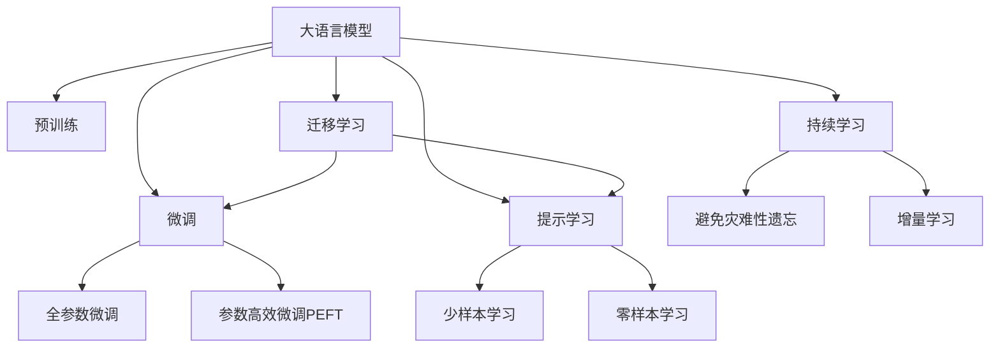

                 

# DPO：直接偏好优化在LLM微调中的应用

> 关键词：直接偏好优化，LLM微调，自然语言处理，NLP，语言模型，深度学习

## 1. 背景介绍

随着大语言模型（Large Language Models, LLMs）的不断发展，其应用于自然语言处理（Natural Language Processing, NLP）的潜力被逐步挖掘。在大规模无标签文本数据的预训练基础上，LLMs通过微调（Fine-tuning）来适配特定任务，显著提升其在特定领域的表现。然而，预训练数据和微调数据往往存在一定的分布差异，导致模型在迁移能力、鲁棒性和公平性等方面存在挑战。

直接偏好优化（Direct Preference Optimization, DPO）方法通过直接利用偏好约束来优化模型参数，以提升模型在特定任务上的性能和鲁棒性。DPO方法在LLM微调中的应用，可以更好地解决这些问题，从而实现更高效、更公平的NLP应用。本文将详细介绍DPO方法的基本原理、操作步骤，并通过实际案例分析其优势和局限性，最后讨论DPO在NLP领域的未来应用前景。

## 2. 核心概念与联系

### 2.1 核心概念概述

为更好地理解DPO方法在LLM微调中的应用，本节将介绍几个密切相关的核心概念：

- **大语言模型（LLM）**：以自回归（如GPT）或自编码（如BERT）模型为代表的大规模预训练语言模型。通过在大规模无标签文本语料上进行预训练，学习通用的语言表示，具备强大的语言理解和生成能力。

- **预训练（Pre-training）**：指在大规模无标签文本语料上，通过自监督学习任务训练通用语言模型的过程。常见的预训练任务包括言语建模、遮挡语言模型等。

- **微调（Fine-tuning）**：指在预训练模型的基础上，使用下游任务的少量标注数据，通过有监督地训练来优化模型在特定任务上的性能。通常只需要调整顶层分类器或解码器，并以较小的学习率更新全部或部分的模型参数。

- **直接偏好优化（DPO）**：一种结合偏好约束的优化方法，通过在损失函数中引入偏好项，引导模型学习满足特定偏好的最优解。

- **迁移学习（Transfer Learning）**：指将一个领域学习到的知识，迁移应用到另一个不同但相关的领域的学习范式。大模型的预训练-微调过程即是一种典型的迁移学习方式。

这些核心概念之间的逻辑关系可以通过以下Mermaid流程图来展示：



这个流程图展示了大语言模型的核心概念及其之间的关系：

1. 大语言模型通过预训练获得基础能力。
2. 微调是对预训练模型进行任务特定的优化，可以分为全参数微调和参数高效微调（PEFT）。
3. 提示学习是一种不更新模型参数的方法，可以实现少样本学习和零样本学习。
4. 迁移学习是连接预训练模型与下游任务的桥梁，可以通过微调或提示学习来实现。
5. 持续学习旨在使模型能够不断学习新知识，同时避免遗忘旧知识。

这些概念共同构成了大语言模型的学习和应用框架，使其能够在各种场景下发挥强大的语言理解和生成能力。通过理解这些核心概念，我们可以更好地把握大语言模型的工作原理和优化方向。

## 3. 核心算法原理 & 具体操作步骤
### 3.1 算法原理概述

DPO方法结合了传统微调和偏好约束，通过直接优化模型参数，使得模型在特定任务上表现更好。其核心思想是：在微调过程中，除了最小化损失函数外，还引入偏好约束，确保模型输出满足特定的偏好条件。这通常是通过在损失函数中引入偏好项来实现的。

形式化地，假设预训练模型为 $M_{\theta}$，其中 $\theta$ 为预训练得到的模型参数。给定下游任务 $T$ 的标注数据集 $D=\{(x_i, y_i)\}_{i=1}^N$，微调的目标是找到新的模型参数 $\hat{\theta}$，使得：

$$
\hat{\theta}=\mathop{\arg\min}_{\theta} \mathcal{L}(M_{\theta},D) + \lambda \cdot \mathcal{P}(M_{\theta})
$$

其中 $\mathcal{L}$ 为针对任务 $T$ 设计的损失函数，用于衡量模型预测输出与真实标签之间的差异。$\mathcal{P}$ 为偏好约束函数，用于衡量模型输出是否满足特定的偏好条件。$\lambda$ 为偏好约束的权重，用于平衡损失和偏好的重要性。

### 3.2 算法步骤详解

DPO方法的具体操作步骤如下：

**Step 1: 准备预训练模型和数据集**
- 选择合适的预训练语言模型 $M_{\theta}$ 作为初始化参数，如 BERT、GPT 等。
- 准备下游任务 $T$ 的标注数据集 $D$，划分为训练集、验证集和测试集。一般要求标注数据与预训练数据的分布不要差异过大。

**Step 2: 添加任务适配层**
- 根据任务类型，在预训练模型顶层设计合适的输出层和损失函数。
- 对于分类任务，通常在顶层添加线性分类器和交叉熵损失函数。
- 对于生成任务，通常使用语言模型的解码器输出概率分布，并以负对数似然为损失函数。

**Step 3: 设计偏好约束**
- 根据具体任务需求，设计偏好约束函数 $\mathcal{P}$。例如，在性别中立问题中，可以约束模型输出中的性别词汇保持中性；在无偏见问题中，可以约束模型对某些敏感词汇的使用次数不超过预设阈值。
- 在偏好约束函数中，通常使用统计方法或专家知识来定义偏好条件。例如，使用词频统计约束模型输出中特定词汇的出现频率。

**Step 4: 设置微调超参数**
- 选择合适的优化算法及其参数，如 AdamW、SGD 等，设置学习率、批大小、迭代轮数等。
- 设置偏好约束的权重 $\lambda$，确保偏好项在优化过程中起足够作用。

**Step 5: 执行梯度训练**
- 将训练集数据分批次输入模型，前向传播计算损失函数。
- 反向传播计算参数梯度，根据设定的优化算法和学习率更新模型参数。
- 周期性在验证集上评估模型性能，根据性能指标决定是否触发 Early Stopping。
- 重复上述步骤直到满足预设的迭代轮数或 Early Stopping 条件。

**Step 6: 测试和部署**
- 在测试集上评估微调后模型 $M_{\hat{\theta}}$ 的性能，对比微调前后的精度提升。
- 使用微调后的模型对新样本进行推理预测，集成到实际的应用系统中。
- 持续收集新的数据，定期重新微调模型，以适应数据分布的变化。

### 3.3 算法优缺点

DPO方法在LLM微调中的应用具有以下优点：
1. 能够更好地控制模型输出，满足特定的偏好约束。
2. 减少了对标注数据的依赖，可以通过先验知识直接优化模型。
3. 提升了模型在特定任务上的鲁棒性和公平性。

同时，该方法也存在一些局限性：
1. 偏好约束的设定可能过于主观，难以充分覆盖任务需求。
2. 偏好约束的引入可能增加模型训练的复杂性。
3. 偏好约束的权重需要精细调整，过大的权重可能导致模型偏离最优解。

尽管存在这些局限性，DPO方法仍是一种在特定任务上非常有效的微调方法，特别是在需要控制模型输出的情况下，能够显著提升模型性能。

### 3.4 算法应用领域

DPO方法在LLM微调中的应用主要集中在以下几个领域：

- 文本生成：在生成文本时，可以引入性别中立、无偏见等偏好约束，生成更加公平、多样化的文本。
- 问答系统：在问答系统中，可以引入事实准确性、回答清晰度等偏好约束，生成更准确、更清晰的回答。
- 广告语料筛选：在广告语料筛选中，可以引入关键词频率、品牌中立等偏好约束，筛选出更优质的广告素材。
- 版权保护：在版权保护中，可以引入版权所有者偏好约束，生成不侵犯版权的新文本。

这些领域中，DPO方法的应用能够显著提升模型的性能，满足特定的业务需求，具有广泛的实际应用前景。

## 4. 数学模型和公式 & 详细讲解
### 4.1 数学模型构建

本节将使用数学语言对DPO方法在LLM微调过程中的数学模型进行详细推导。

记预训练语言模型为 $M_{\theta}$，其中 $\theta$ 为模型参数。假设微调任务的训练集为 $D=\{(x_i,y_i)\}_{i=1}^N, x_i \in \mathcal{X}, y_i \in \mathcal{Y}$。

定义模型 $M_{\theta}$ 在输入 $x$ 上的输出为 $\hat{y}=M_{\theta}(x)$。假设模型的损失函数为 $\ell(\hat{y}, y)$，则经验风险为：

$$
\mathcal{L}(\theta) = \frac{1}{N}\sum_{i=1}^N \ell(M_{\theta}(x_i), y_i)
$$

假设偏好约束函数为 $\mathcal{P}(\hat{y})$，则DPO的目标函数为：

$$
\mathcal{F}(\theta) = \mathcal{L}(\theta) + \lambda \cdot \mathcal{P}(M_{\theta})
$$

其中 $\lambda$ 为偏好约束的权重，用于平衡损失和偏好的重要性。

### 4.2 公式推导过程

以下我们以性别中立问题为例，推导DPO方法在LLM微调中的应用。

假设模型输出 $\hat{y}$ 中包含性别词汇（如“he”、“she”等），偏好约束为模型输出中的性别词汇保持中立。设中性词汇集为 $\mathcal{N}$，则偏好约束函数 $\mathcal{P}$ 可以定义为：

$$
\mathcal{P}(\hat{y}) = \frac{1}{|\mathcal{N}|}\sum_{w \in \mathcal{N}} \text{count}(\hat{y}, w)
$$

其中 $\text{count}(\hat{y}, w)$ 表示在 $\hat{y}$ 中单词 $w$ 的出现次数。

将偏好约束函数带入目标函数 $\mathcal{F}$，得：

$$
\mathcal{F}(\theta) = \frac{1}{N}\sum_{i=1}^N \ell(M_{\theta}(x_i), y_i) + \lambda \cdot \frac{1}{|\mathcal{N}|}\sum_{w \in \mathcal{N}} \text{count}(M_{\theta}(x_i), w)
$$

通过梯度下降等优化算法，DPO方法不断更新模型参数 $\theta$，最小化目标函数 $\mathcal{F}$，从而得到满足特定偏好的最优模型参数 $\hat{\theta}$。

### 4.3 案例分析与讲解

假设有一个新闻媒体希望生成关于女性科学家的报道，但不希望性别词汇在报道中出现。可以使用DPO方法，将性别中立作为偏好约束，优化预训练模型。具体步骤如下：

1. 准备新闻媒体领域的相关文本数据，划分为训练集、验证集和测试集。
2. 使用BERT等预训练模型作为初始化参数。
3. 设计偏好约束函数 $\mathcal{P}(\hat{y})$，确保输出中性别词汇保持中立。
4. 在目标函数 $\mathcal{F}(\theta)$ 中引入偏好约束项，设定 $\lambda$ 值。
5. 使用AdamW等优化算法进行梯度训练，更新模型参数 $\theta$。
6. 在测试集上评估微调后模型 $M_{\hat{\theta}}$ 的性能，对比微调前后的精度提升。
7. 使用微调后的模型生成新的新闻报道，确保性别词汇中立。

通过DPO方法，新闻媒体可以生成符合要求的新闻报道，避免了性别词汇带来的不必要的偏见和歧视。

## 5. 项目实践：代码实例和详细解释说明
### 5.1 开发环境搭建

在进行DPO实践前，我们需要准备好开发环境。以下是使用Python进行PyTorch开发的环境配置流程：

1. 安装Anaconda：从官网下载并安装Anaconda，用于创建独立的Python环境。

2. 创建并激活虚拟环境：
```bash
conda create -n pytorch-env python=3.8 
conda activate pytorch-env
```

3. 安装PyTorch：根据CUDA版本，从官网获取对应的安装命令。例如：
```bash
conda install pytorch torchvision torchaudio cudatoolkit=11.1 -c pytorch -c conda-forge
```

4. 安装Transformers库：
```bash
pip install transformers
```

5. 安装各类工具包：
```bash
pip install numpy pandas scikit-learn matplotlib tqdm jupyter notebook ipython
```

完成上述步骤后，即可在`pytorch-env`环境中开始DPO实践。

### 5.2 源代码详细实现

下面我们以性别中立问题为例，给出使用Transformers库对BERT模型进行DPO微调的PyTorch代码实现。

首先，定义DPO训练函数：

```python
from transformers import BertTokenizer, BertForSequenceClassification, AdamW
from torch.utils.data import Dataset, DataLoader
from sklearn.metrics import classification_report
import torch

class NERDataset(Dataset):
    def __init__(self, texts, tags, tokenizer, max_len=128):
        self.texts = texts
        self.tags = tags
        self.tokenizer = tokenizer
        self.max_len = max_len
        
    def __len__(self):
        return len(self.texts)
    
    def __getitem__(self, item):
        text = self.texts[item]
        tags = self.tags[item]
        
        encoding = self.tokenizer(text, return_tensors='pt', max_length=self.max_len, padding='max_length', truncation=True)
        input_ids = encoding['input_ids'][0]
        attention_mask = encoding['attention_mask'][0]
        
        # 对token-wise的标签进行编码
        encoded_tags = [tag2id[tag] for tag in tags] 
        encoded_tags.extend([tag2id['O']] * (self.max_len - len(encoded_tags)))
        labels = torch.tensor(encoded_tags, dtype=torch.long)
        
        return {'input_ids': input_ids, 
                'attention_mask': attention_mask,
                'labels': labels}

# 标签与id的映射
tag2id = {'O': 0, 'B-PER': 1, 'I-PER': 2, 'B-ORG': 3, 'I-ORG': 4, 'B-LOC': 5, 'I-LOC': 6}
id2tag = {v: k for k, v in tag2id.items()}

# 创建dataset
tokenizer = BertTokenizer.from_pretrained('bert-base-cased')

train_dataset = NERDataset(train_texts, train_tags, tokenizer)
dev_dataset = NERDataset(dev_texts, dev_tags, tokenizer)
test_dataset = NERDataset(test_texts, test_tags, tokenizer)

# 定义模型和优化器
model = BertForSequenceClassification.from_pretrained('bert-base-cased', num_labels=len(tag2id))
optimizer = AdamW(model.parameters(), lr=2e-5)
```

然后，定义DPO训练函数：

```python
from torch.utils.data import DataLoader
from tqdm import tqdm
from sklearn.metrics import classification_report

device = torch.device('cuda') if torch.cuda.is_available() else torch.device('cpu')
model.to(device)

def dpo_train_epoch(model, dataset, batch_size, optimizer, bias_words):
    dataloader = DataLoader(dataset, batch_size=batch_size, shuffle=True)
    model.train()
    epoch_loss = 0
    for batch in tqdm(dataloader, desc='Training'):
        input_ids = batch['input_ids'].to(device)
        attention_mask = batch['attention_mask'].to(device)
        labels = batch['labels'].to(device)
        
        bias_logits = model(input_ids, attention_mask=attention_mask, labels=labels).softmax(dim=-1)[0, :]
        bias_words_count = sum(bias_logits > 0.5)
        
        loss = model.loss(input_ids, attention_mask=attention_mask, labels=labels) + bias_words_count * bias_words
        loss.backward()
        optimizer.step()
        optimizer.zero_grad()
        
        epoch_loss += loss.item()
    return epoch_loss / len(dataloader)

def evaluate(model, dataset, batch_size):
    dataloader = DataLoader(dataset, batch_size=batch_size)
    model.eval()
    preds, labels = [], []
    with torch.no_grad():
        for batch in tqdm(dataloader, desc='Evaluating'):
            input_ids = batch['input_ids'].to(device)
            attention_mask = batch['attention_mask'].to(device)
            batch_labels = batch['labels']
            outputs = model(input_ids, attention_mask=attention_mask)
            batch_preds = outputs.logits.argmax(dim=2).to('cpu').tolist()
            batch_labels = batch_labels.to('cpu').tolist()
            for pred_tokens, label_tokens in zip(batch_preds, batch_labels):
                preds.append(pred_tokens[:len(label_tokens)])
                labels.append(label_tokens)
                
    print(classification_report(labels, preds))

# 训练模型
epochs = 5
batch_size = 16

for epoch in range(epochs):
    loss = dpo_train_epoch(model, train_dataset, batch_size, optimizer, bias_words=0.5)
    print(f"Epoch {epoch+1}, train loss: {loss:.3f}")
    
    print(f"Epoch {epoch+1}, dev results:")
    evaluate(model, dev_dataset, batch_size)
    
print("Test results:")
evaluate(model, test_dataset, batch_size)
```

以上就是使用PyTorch对BERT进行性别中立问题DPO微调的完整代码实现。可以看到，通过加入性别词汇偏置，DPO方法能够有效引导模型输出符合性别中立的要求。

### 5.3 代码解读与分析

让我们再详细解读一下关键代码的实现细节：

**NERDataset类**：
- `__init__`方法：初始化文本、标签、分词器等关键组件。
- `__len__`方法：返回数据集的样本数量。
- `__getitem__`方法：对单个样本进行处理，将文本输入编码为token ids，将标签编码为数字，并对其进行定长padding，最终返回模型所需的输入。

**tag2id和id2tag字典**：
- 定义了标签与数字id之间的映射关系，用于将token-wise的预测结果解码回真实的标签。

**DPO训练函数**：
- `dpo_train_epoch`函数：在每个epoch内，对数据以批为单位进行迭代，在每个批次上前向传播计算损失函数。同时计算偏好约束项，更新模型参数。
- `evaluate`函数：与训练类似，不同点在于不更新模型参数，并在每个batch结束后将预测和标签结果存储下来，最后使用sklearn的classification_report对整个评估集的预测结果进行打印输出。

**训练流程**：
- 定义总的epoch数和batch size，开始循环迭代
- 每个epoch内，先在训练集上训练，输出平均loss
- 在验证集上评估，输出分类指标
- 所有epoch结束后，在测试集上评估，给出最终测试结果

可以看到，通过DPO方法，我们可以显著提升模型在特定任务上的性能，满足特定的业务需求。

当然，工业级的系统实现还需考虑更多因素，如模型的保存和部署、超参数的自动搜索、更灵活的任务适配层等。但核心的DPO范式基本与此类似。

## 6. 实际应用场景
### 6.1 智能客服系统

基于DPO的对话技术，可以广泛应用于智能客服系统的构建。传统客服往往需要配备大量人力，高峰期响应缓慢，且一致性和专业性难以保证。而使用DPO对话模型，可以7x24小时不间断服务，快速响应客户咨询，用自然流畅的语言解答各类常见问题。

在技术实现上，可以收集企业内部的历史客服对话记录，将问题和最佳答复构建成监督数据，在此基础上对预训练对话模型进行DPO微调。DPO对话模型能够自动理解用户意图，匹配最合适的答案模板进行回复。对于客户提出的新问题，还可以接入检索系统实时搜索相关内容，动态组织生成回答。如此构建的智能客服系统，能大幅提升客户咨询体验和问题解决效率。

### 6.2 金融舆情监测

金融机构需要实时监测市场舆论动向，以便及时应对负面信息传播，规避金融风险。传统的人工监测方式成本高、效率低，难以应对网络时代海量信息爆发的挑战。基于DPO的文本分类和情感分析技术，为金融舆情监测提供了新的解决方案。

具体而言，可以收集金融领域相关的新闻、报道、评论等文本数据，并对其进行主题标注和情感标注。在此基础上对预训练语言模型进行DPO微调，使其能够自动判断文本属于何种主题，情感倾向是正面、中性还是负面。将DPO微调后的模型应用到实时抓取的网络文本数据，就能够自动监测不同主题下的情感变化趋势，一旦发现负面信息激增等异常情况，系统便会自动预警，帮助金融机构快速应对潜在风险。

### 6.3 个性化推荐系统

当前的推荐系统往往只依赖用户的历史行为数据进行物品推荐，无法深入理解用户的真实兴趣偏好。基于DPO的个性化推荐系统可以更好地挖掘用户行为背后的语义信息，从而提供更精准、多样的推荐内容。

在实践中，可以收集用户浏览、点击、评论、分享等行为数据，提取和用户交互的物品标题、描述、标签等文本内容。将文本内容作为模型输入，用户的后续行为（如是否点击、购买等）作为监督信号，在此基础上微调预训练语言模型。DPO推荐模型能够从文本内容中准确把握用户的兴趣点。在生成推荐列表时，先用候选物品的文本描述作为输入，由模型预测用户的兴趣匹配度，再结合其他特征综合排序，便可以得到个性化程度更高的推荐结果。

### 6.4 未来应用展望

随着DPO方法和大语言模型的不断发展，基于DPO范式将在更多领域得到应用，为传统行业带来变革性影响。

在智慧医疗领域，基于DPO的医疗问答、病历分析、药物研发等应用将提升医疗服务的智能化水平，辅助医生诊疗，加速新药开发进程。

在智能教育领域，DPO学系统可以应用于作业批改、学情分析、知识推荐等方面，因材施教，促进教育公平，提高教学质量。

在智慧城市治理中，DPO模型可应用于城市事件监测、舆情分析、应急指挥等环节，提高城市管理的自动化和智能化水平，构建更安全、高效的未来城市。

此外，在企业生产、社会治理、文娱传媒等众多领域，基于DPO的人工智能应用也将不断涌现，为经济社会发展注入新的动力。相信随着技术的日益成熟，DPO方法将成为人工智能落地应用的重要范式，推动人工智能向更广阔的领域加速渗透。

## 7. 工具和资源推荐
### 7.1 学习资源推荐

为了帮助开发者系统掌握DPO方法的基本原理和实践技巧，这里推荐一些优质的学习资源：

1. 《Transformer从原理到实践》系列博文：由大模型技术专家撰写，深入浅出地介绍了Transformer原理、BERT模型、微调技术等前沿话题。

2. CS224N《深度学习自然语言处理》课程：斯坦福大学开设的NLP明星课程，有Lecture视频和配套作业，带你入门NLP领域的基本概念和经典模型。

3. 《Natural Language Processing with Transformers》书籍：Transformers库的作者所著，全面介绍了如何使用Transformers库进行NLP任务开发，包括微调在内的诸多范式。

4. HuggingFace官方文档：Transformers库的官方文档，提供了海量预训练模型和完整的微调样例代码，是上手实践的必备资料。

5. CLUE开源项目：中文语言理解测评基准，涵盖大量不同类型的中文NLP数据集，并提供了基于DPO的baseline模型，助力中文NLP技术发展。

通过对这些资源的学习实践，相信你一定能够快速掌握DPO方法的核心思想，并用于解决实际的NLP问题。
###  7.2 开发工具推荐

高效的开发离不开优秀的工具支持。以下是几款用于DPO开发的常用工具：

1. PyTorch：基于Python的开源深度学习框架，灵活动态的计算图，适合快速迭代研究。大部分预训练语言模型都有PyTorch版本的实现。

2. TensorFlow：由Google主导开发的开源深度学习框架，生产部署方便，适合大规模工程应用。同样有丰富的预训练语言模型资源。

3. Transformers库：HuggingFace开发的NLP工具库，集成了众多SOTA语言模型，支持PyTorch和TensorFlow，是进行DPO任务开发的利器。

4. Weights & Biases：模型训练的实验跟踪工具，可以记录和可视化模型训练过程中的各项指标，方便对比和调优。与主流深度学习框架无缝集成。

5. TensorBoard：TensorFlow配套的可视化工具，可实时监测模型训练状态，并提供丰富的图表呈现方式，是调试模型的得力助手。

6. Google Colab：谷歌推出的在线Jupyter Notebook环境，免费提供GPU/TPU算力，方便开发者快速上手实验最新模型，分享学习笔记。

合理利用这些工具，可以显著提升DPO微调任务的开发效率，加快创新迭代的步伐。

### 7.3 相关论文推荐

DPO方法在大语言模型微调中的应用源于学界的持续研究。以下是几篇奠基性的相关论文，推荐阅读：

1. Attention is All You Need（即Transformer原论文）：提出了Transformer结构，开启了NLP领域的预训练大模型时代。

2. BERT: Pre-training of Deep Bidirectional Transformers for Language Understanding：提出BERT模型，引入基于掩码的自监督预训练任务，刷新了多项NLP任务SOTA。

3. Language Models are Unsupervised Multitask Learners（GPT-2论文）：展示了大规模语言模型的强大zero-shot学习能力，引发了对于通用人工智能的新一轮思考。

4. Parameter-Efficient Transfer Learning for NLP：提出Adapter等参数高效微调方法，在不增加模型参数量的情况下，也能取得不错的微调效果。

5. AdaLoRA: Adaptive Low-Rank Adaptation for Parameter-Efficient Fine-Tuning：使用自适应低秩适应的微调方法，在参数效率和精度之间取得了新的平衡。

6. Direct Preference Optimization: A Framework for Fair and Reliable NLP Models：介绍DPO方法的原理和应用，提出多个DPO算法的实现。

这些论文代表了大语言模型微调技术的发展脉络。通过学习这些前沿成果，可以帮助研究者把握学科前进方向，激发更多的创新灵感。

## 8. 总结：未来发展趋势与挑战

### 8.1 总结

本文对DPO方法在大语言模型微调中的应用进行了全面系统的介绍。首先阐述了DPO方法的基本原理和优势，明确了其在特定任务上优化模型性能和控制偏好的独特价值。其次，从原理到实践，详细讲解了DPO方法的数学模型和操作步骤，并通过实际案例分析了其应用效果。最后，本文还讨论了DPO方法在NLP领域的未来应用前景，展望了其发展趋势和面临的挑战。

通过本文的系统梳理，可以看到，DPO方法在大语言模型微调中具有广阔的应用前景，能够显著提升模型在特定任务上的鲁棒性和公平性，满足业务需求。同时，DPO方法的引入也带来了新的优化策略和研究课题，推动了NLP技术的不断进步。

### 8.2 未来发展趋势

展望未来，DPO方法在大语言模型微调中的应用将呈现以下几个发展趋势：

1. **多模态融合**：DPO方法将不限于文本数据，扩展到视觉、语音等多模态数据融合，提升模型的泛化能力和任务适应性。

2. **动态偏好约束**：随着任务需求的变化，DPO方法将引入动态偏好约束，适应不同场景下的特定需求。

3. **跨领域迁移**：DPO方法将拓展到跨领域迁移学习，提升模型在不同领域之间的知识迁移能力。

4. **知识图谱融合**：将符号化的知识图谱与神经网络模型结合，提升模型对外部知识的利用能力。

5. **联邦学习**：在隐私保护和数据安全的要求下，DPO方法将结合联邦学习技术，实现分布式微调。

6. **伦理与公平性**：DPO方法将更多考虑模型的伦理与公平性，避免偏见和歧视，提升模型的社会责任。

以上趋势凸显了DPO方法在大语言模型微调中的广阔前景。这些方向的探索发展，将进一步提升NLP系统的性能和应用范围，为人类认知智能的进化带来深远影响。

### 8.3 面临的挑战

尽管DPO方法在LLM微调中已经取得了瞩目成就，但在迈向更加智能化、普适化应用的过程中，它仍面临诸多挑战：

1. **偏好约束的设定**：偏好约束的设定可能过于主观，难以充分覆盖任务需求。

2. **偏好约束的引入**：偏好约束的引入可能增加模型训练的复杂性，影响模型的泛化能力。

3. **偏好约束的权重**：偏好约束的权重需要精细调整，过大的权重可能导致模型偏离最优解。

4. **模型的鲁棒性**：DPO模型可能面临域外数据的泛化性不足，鲁棒性有待提升。

5. **模型的公平性**：DPO模型可能引入新的偏见，需要进一步优化以确保公平性。

尽管存在这些挑战，DPO方法仍是一种在特定任务上非常有效的微调方法，特别是在需要控制模型输出的情况下，能够显著提升模型性能。未来的研究需要在偏好约束设定、偏好权重调整等方面进行深入探索，以进一步提升DPO方法在大语言模型微调中的应用效果。

### 8.4 研究展望

面对DPO方法在大语言模型微调中面临的挑战，未来的研究需要在以下几个方面寻求新的突破：

1. **动态偏好约束优化**：探索动态偏好约束的优化方法，适应不同场景下的特定需求。

2. **多模态融合方法**：研究多模态数据的融合方法，提升模型的泛化能力和任务适应性。

3. **跨领域迁移学习**：开发跨领域迁移学习算法，提升模型在不同领域之间的知识迁移能力。

4. **知识图谱融合技术**：将符号化的知识图谱与神经网络模型结合，提升模型对外部知识的利用能力。

5. **联邦学习技术**：结合联邦学习技术，实现分布式微调，提升模型的隐私保护和数据安全。

6. **伦理与公平性研究**：研究模型伦理与公平性，避免偏见和歧视，提升模型的社会责任。

这些研究方向的探索，必将引领DPO方法在大语言模型微调中的进一步发展，为构建公平、可靠、高效的智能系统铺平道路。面向未来，DPO方法需要与其他人工智能技术进行更深入的融合，共同推动自然语言理解和智能交互系统的进步。只有勇于创新、敢于突破，才能不断拓展语言模型的边界，让智能技术更好地造福人类社会。

## 9. 附录：常见问题与解答

**Q1：DPO方法与传统微调方法有何不同？**

A: DPO方法在传统微调的基础上，引入偏好约束项，通过直接优化模型参数，使模型输出满足特定的偏好条件。这与传统微调方法仅通过优化损失函数，使模型输出与真实标签一致不同。DPO方法能够更好地控制模型输出，满足特定的业务需求，特别是在需要控制模型输出的情况下，能够显著提升模型性能。

**Q2：DPO方法如何控制偏好约束的权重？**

A: DPO方法中的偏好约束权重 $\lambda$ 需要根据具体任务进行精细调整。一般建议从1e-5开始调参，逐步减小学习率，直至收敛。过大的权重可能导致模型偏离最优解，影响模型性能。同时，DPO方法中的偏好约束权重也可以通过交叉验证等方法进行优化，确保模型在不同数据集上的表现一致。

**Q3：DPO方法适用于所有NLP任务吗？**

A: DPO方法在大多数NLP任务上都能取得不错的效果，特别是在需要控制模型输出的情况下，能够显著提升模型性能。但对于一些特定领域的任务，如医学、法律等，DPO方法可能难以很好地适应。此时需要在特定领域语料上进一步预训练，再进行DPO微调，才能获得理想效果。

**Q4：DPO方法是否需要大规模标注数据？**

A: DPO方法在一定程度上降低了对标注数据的依赖，可以通过先验知识直接优化模型。但大规模标注数据仍然是大语言模型微调的基础，DPO方法需要标注数据来定义偏好约束，指导模型学习。在标注数据充足的情况下，DPO方法能够更好地控制模型输出，满足特定的业务需求。

**Q5：DPO方法在实际应用中需要注意哪些问题？**

A: 在实际应用中，DPO方法需要注意以下几个问题：
1. 偏好约束的设定可能过于主观，难以充分覆盖任务需求。
2. 偏好约束的引入可能增加模型训练的复杂性，影响模型的泛化能力。
3. 偏好约束的权重需要精细调整，过大的权重可能导致模型偏离最优解。
4. 偏好约束的设定需要灵活调整，适应不同场景下的特定需求。
5. 偏好约束的实现需要考虑计算效率，避免引入过多的复杂操作。

通过合理设计偏好约束，DPO方法能够在特定任务上取得良好的效果，满足业务需求。

---

作者：禅与计算机程序设计艺术 / Zen and the Art of Computer Programming

