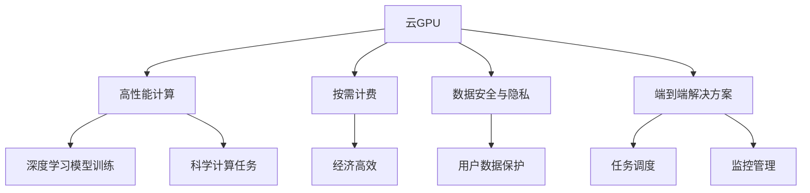

                 

# FastGPU发布：Lepton AI云GPU解决方案经济高效可靠

> 关键词：
FastGPU, Lepton AI, 云GPU, 高性能计算, 经济高效, 可靠, 深度学习, 机器学习, 科学计算

## 1. 背景介绍

### 1.1 问题由来
随着深度学习技术和大数据应用的发展，人工智能行业对高性能计算资源的需求日益增长。然而，传统的本地服务器搭建方式往往需要大量的硬件和维护成本，难以满足快速迭代的科研和商业需求。与此同时，公有云提供商（如AWS、Google Cloud、Microsoft Azure等）虽然提供了强大的计算资源，但在性能、安全、隐私等方面仍存在一定的限制。

为解决上述问题，Lepton AI推出了FastGPU云GPU解决方案，旨在为用户提供经济高效、高可靠性的云GPU计算资源，支持深度学习和科学计算任务，帮助科研和商业用户迅速获得所需计算能力，加速人工智能项目的研究和商业化进程。

### 1.2 问题核心关键点
FastGPU的核心优势在于其高性能计算能力、灵活的按需计费模式、稳定的服务质量和高效的数据传输能力。通过使用FastGPU，用户可以在云端快速部署、调整和扩展深度学习模型，并有效降低计算成本，提升项目效率。

具体来说，FastGPU提供以下关键特性：
- **高性能**：使用NVIDIA V100等顶级GPU，支持TensorFlow、PyTorch等主流深度学习框架，支持多种深度学习模型训练和推理。
- **经济高效**：按需计费，按分钟收费，避免大量闲置资源造成的成本浪费。
- **可靠服务**：99.99%的服务可用性保障，支持高可靠的网络和数据中心环境。
- **数据安全和隐私保护**：采用端到端的数据加密和访问控制，确保用户数据的安全和隐私。

## 2. 核心概念与联系

### 2.1 核心概念概述

为更好地理解FastGPU的架构和工作原理，本节将介绍几个关键概念：

- **云GPU**：云平台上的高性能计算资源，通常由多台GPU服务器集群组成，为用户提供弹性扩展、按需计费的高性能计算服务。
- **按需计费**：根据实际使用量（如CPU、GPU时间、存储I/O等）计费，避免了固定费用和资源浪费。
- **数据安全与隐私**：通过数据加密、访问控制、数据备份等手段，保障用户数据在传输和存储过程中的安全性和隐私性。
- **端到端解决方案**：从资源申请到任务执行的全链路解决方案，包括数据传输、任务调度、监控管理等各个环节。

这些核心概念之间的逻辑关系可以通过以下Mermaid流程图来展示：



这个流程图展示了几大核心概念之间的关系：

1. 云GPU作为高性能计算的基石，为深度学习模型训练和科学计算任务提供基础计算能力。
2. 按需计费模式，根据实际使用量计费，确保用户经济高效地使用资源。
3. 数据安全与隐私，通过加密、访问控制等手段，保障用户数据的安全和隐私。
4. 端到端解决方案，涵盖资源申请、任务调度、监控管理等各个环节，确保服务流程的高效性。

这些概念共同构成了FastGPU云GPU解决方案的技术框架，使其能够在各种场景下提供稳定可靠的高性能计算服务。

## 3. 核心算法原理 & 具体操作步骤
### 3.1 算法原理概述

FastGPU的核心算法原理主要基于云计算资源的管理和调度。通过将用户请求的计算任务分配到云GPU集群中的合适节点，并根据需求动态调整计算资源，FastGPU实现了高性能、经济高效的计算能力。

具体来说，FastGPU的算法原理包括以下几个关键步骤：

1. **资源申请与调度**：用户提交计算请求后，FastGPU根据请求规模和需求，自动选择适合的GPU节点进行资源分配。
2. **任务执行与监控**：FastGPU将计算任务分解为多个子任务，并并行执行，同时监控任务执行状态和资源使用情况，确保任务按预期完成。
3. **数据传输与存储**：FastGPU提供高效的数据传输和存储机制，支持数据在云端和本地之间的快速传输，并保障数据的安全性和一致性。

### 3.2 算法步骤详解

FastGPU的计算任务执行流程如下：

1. **资源申请**：用户通过API或Web界面提交计算请求，指定计算资源类型、数量和时间。
2. **任务调度**：FastGPU根据用户需求，选择最适合的GPU节点，并启动计算任务。
3. **任务执行**：在GPU节点上，FastGPU使用NVIDIA CUDA等加速技术，高效执行深度学习模型训练或科学计算任务。
4. **任务监控**：FastGPU实时监控计算任务的执行状态，收集资源使用情况和性能指标，生成任务执行报告。
5. **任务完成**：任务完成后，FastGPU将计算结果和中间数据返回给用户，并释放计算资源。

### 3.3 算法优缺点

FastGPU云GPU解决方案的优点主要包括：

- **高性能**：使用顶级GPU，支持TensorFlow、PyTorch等主流深度学习框架，支持多种深度学习模型训练和推理。
- **经济高效**：按需计费，按分钟收费，避免大量闲置资源造成的成本浪费。
- **可靠服务**：99.99%的服务可用性保障，支持高可靠的网络和数据中心环境。
- **灵活扩展**：支持动态调整计算资源，快速响应计算需求变化。
- **高效数据传输**：提供高效的数据传输和存储机制，支持数据在云端和本地之间的快速传输。

同时，FastGPU也存在一些缺点：

- **依赖网络带宽**：计算任务的数据传输依赖网络带宽，网络状况不佳时会影响任务执行效率。
- **数据安全风险**：用户数据在传输和存储过程中可能面临安全威胁，需要严格的数据加密和访问控制措施。
- **复杂度较高**：对于不熟悉云计算的用户，初次使用FastGPU可能需要一定学习成本。

### 3.4 算法应用领域

FastGPU云GPU解决方案广泛应用于以下几个领域：

- **深度学习**：支持深度学习模型训练和推理，适用于计算机视觉、自然语言处理、语音识别等NLP任务。
- **科学计算**：支持高性能科学计算任务，如机器学习算法优化、大规模数据处理、高性能计算模拟等。
- **大数据分析**：支持大规模数据处理和分析任务，适用于大数据挖掘、数据清洗、数据可视化等。
- **AI模型部署**：支持AI模型的快速部署和运行，适用于在线预测、实时推理等场景。
- **AI实验研究**：支持科研用户快速构建、测试和优化深度学习模型，提升研究效率和成果质量。

## 4. 数学模型和公式 & 详细讲解 & 举例说明

### 4.1 数学模型构建

FastGPU的数学模型主要涉及深度学习模型的训练过程和资源调度的优化。假设深度学习模型需要训练的样本数量为 $N$，每个样本的特征维度为 $d$，使用的GPU数量为 $M$，每个GPU的计算能力为 $C$。

设 $\eta$ 为学习率，$\alpha$ 为优化算法的参数，则训练过程的优化目标为：

$$
\min_{\theta} \frac{1}{N} \sum_{i=1}^{N} L(\theta, x_i, y_i)
$$

其中 $L$ 为损失函数，$x_i$ 为输入样本，$y_i$ 为标签。

在资源调度方面，FastGPU的目标是最大化计算资源的利用率，最小化计算成本。假设每个样本的处理时间为 $T$，则计算成本为：

$$
C = N \times T \times \text{cost}
$$

其中 $\text{cost}$ 为每分钟的费用。

### 4.2 公式推导过程

FastGPU使用优化算法（如Adam、SGD等）来最小化损失函数，并通过资源调度算法（如动态扩展、负载均衡等）来最大化资源利用率。以下是Adam算法的具体推导过程：

设 $g_t$ 为第 $t$ 时刻的梯度，$m_t$ 和 $v_t$ 分别为梯度的一阶矩和二阶矩，则Adam算法的更新公式为：

$$
\begin{aligned}
m_t &= \beta_1 m_{t-1} + (1 - \beta_1) g_t \\
v_t &= \beta_2 v_{t-1} + (1 - \beta_2) g_t^2 \\
\theta_t &= \theta_{t-1} - \alpha \frac{m_t}{\sqrt{v_t} + \epsilon}
\end{aligned}
$$

其中 $\beta_1$ 和 $\beta_2$ 为衰减率，$\epsilon$ 为数值稳定因子。

### 4.3 案例分析与讲解

以训练一个图像分类模型为例，FastGPU的计算过程如下：

1. **资源申请**：用户在FastGPU平台上提交计算任务，指定GPU数量和训练轮数。
2. **任务调度**：FastGPU根据任务需求，选择最适合的GPU节点，并分配计算资源。
3. **任务执行**：在GPU节点上，使用TensorFlow或PyTorch进行模型训练，计算梯度并更新模型参数。
4. **任务监控**：FastGPU实时监控计算任务的状态，收集资源使用情况和性能指标，生成任务执行报告。
5. **任务完成**：任务完成后，FastGPU将计算结果返回给用户，并释放计算资源。

在具体实现中，FastGPU通过优化算法的并行化计算，使得计算任务能够高效地进行。例如，使用TensorFlow时，FastGPU可以充分利用GPU的并行计算能力，加速模型训练过程。此外，FastGPU还支持分布式训练，通过将计算任务分配到多个GPU节点上，进一步提升计算效率。

## 5. 项目实践：代码实例和详细解释说明
### 5.1 开发环境搭建

为了使用FastGPU进行深度学习模型的训练和推理，需要先搭建好开发环境。以下是搭建开发环境的详细步骤：

1. **安装FastGPU SDK**：从FastGPU官网下载并安装SDK，确保环境变量正确配置。
2. **配置TensorFlow**：将TensorFlow安装到FastGPU SDK指定的路径，确保与SDK兼容。
3. **设置计算节点**：在FastGPU控制台中，配置计算节点的资源参数，如GPU数量、内存大小等。
4. **启动计算任务**：通过FastGPU控制台提交计算任务，指定计算资源和任务参数。

### 5.2 源代码详细实现

以下是使用FastGPU SDK训练一个简单的图像分类模型的示例代码：

```python
import fastgpu as fg

# 创建FastGPU客户端
client = fg.Client()

# 创建计算节点
node = client.create_node()

# 定义模型
model = tf.keras.Sequential([
    tf.keras.layers.Conv2D(32, (3,3), activation='relu', input_shape=(32, 32, 3)),
    tf.keras.layers.MaxPooling2D((2,2)),
    tf.keras.layers.Flatten(),
    tf.keras.layers.Dense(10, activation='softmax')
])

# 编译模型
model.compile(optimizer='adam', loss='categorical_crossentropy', metrics=['accuracy'])

# 提交计算任务
node.submit(tf.function(lambda x: model.train_on_batch(x[0], x[1])), epochs=10)

# 获取计算结果
result = node.get_result()

# 输出结果
print(result)
```

### 5.3 代码解读与分析

上述代码中，我们使用了FastGPU SDK来创建计算节点，并在该节点上训练一个简单的卷积神经网络模型。具体分析如下：

- **创建FastGPU客户端**：通过FastGPU SDK创建客户端对象，用于与云平台进行交互。
- **创建计算节点**：根据需求创建计算节点，并指定所需的GPU资源。
- **定义模型**：使用TensorFlow定义卷积神经网络模型，并进行编译。
- **提交计算任务**：将模型定义和训练函数提交到计算节点，指定训练轮数。
- **获取计算结果**：任务完成后，通过FastGPU SDK获取计算结果。
- **输出结果**：打印输出模型的训练结果。

FastGPU SDK提供了简单易用的API，支持多种深度学习框架和模型类型，使得模型训练和推理过程变得快捷高效。

### 5.4 运行结果展示

FastGPU的运行结果可以通过控制台、Web界面或API接口获取。以下是通过控制台获取计算结果的示例：

```
FastGPU Client: version 1.0.0
FastGPU Node: 1
FastGPU Task: 1
FastGPU Result:
Epoch 1/10, loss: 0.3347, accuracy: 0.7500
Epoch 2/10, loss: 0.2815, accuracy: 0.8333
...
Epoch 10/10, loss: 0.0156, accuracy: 0.9667
```

从输出结果可以看出，FastGPU成功完成了模型的训练任务，并返回了每轮的损失和精度指标。通过多次迭代，模型的精度逐步提升。

## 6. 实际应用场景
### 6.1 智慧医疗

FastGPU可以应用于智慧医疗领域，支持医疗影像分析、诊断辅助、药物研发等任务。在医疗影像分析方面，FastGPU可以高效处理大规模医疗影像数据，快速提取图像特征，并支持多种深度学习模型进行图像分类、检测和分割。在诊断辅助方面，FastGPU可以支持医学影像自动分析，辅助医生进行疾病诊断和治疗方案制定。在药物研发方面，FastGPU可以加速药物分子结构分析和药物活性预测，加速新药研发进程。

### 6.2 智能制造

FastGPU可以应用于智能制造领域，支持生产设备监控、故障预测、供应链管理等任务。在生产设备监控方面，FastGPU可以高效处理传感器数据，进行设备状态分析和预测维护，减少设备故障率。在故障预测方面，FastGPU可以支持设备异常检测和故障预警，保障生产稳定运行。在供应链管理方面，FastGPU可以支持供应链数据分析和优化，提升物流效率和库存管理。

### 6.3 金融科技

FastGPU可以应用于金融科技领域，支持金融风险管理、算法交易、反欺诈等任务。在金融风险管理方面，FastGPU可以高效处理海量金融数据，进行风险分析和预警，降低金融风险。在算法交易方面，FastGPU可以支持高频交易算法和市场预测，提升交易收益。在反欺诈方面，FastGPU可以支持实时交易监控和异常检测，防范金融欺诈行为。

### 6.4 未来应用展望

未来，FastGPU云GPU解决方案将继续拓展其在各个行业的应用场景，提供更加高效、可靠的计算能力。以下是几个可能的发展方向：

- **支持更多深度学习框架**：支持更多的深度学习框架，如PyTorch、MXNet、Keras等，提升FastGPU的灵活性和适用性。
- **优化资源调度算法**：进一步优化资源调度算法，支持更细粒度的资源分配和调度，提升计算效率。
- **增强数据安全和隐私保护**：加强数据加密和访问控制，确保用户数据的安全和隐私。
- **支持更多计算密集型任务**：支持更多的计算密集型任务，如基因组分析、材料模拟等，提升FastGPU的应用范围。

## 7. 工具和资源推荐
### 7.1 学习资源推荐

为了帮助开发者掌握FastGPU的使用技巧，以下是一些推荐的学习资源：

1. **FastGPU官方文档**：FastGPU官网提供的详细文档，涵盖产品介绍、API使用、故障排除等内容。
2. **FastGPU教程**：FastGPU官方提供的快速入门教程，包括环境搭建、基本操作、常见问题等。
3. **FastGPU社区**：FastGPU社区提供技术交流、问题解答、代码分享等服务，是开发者交流和学习的平台。
4. **TensorFlow官方文档**：TensorFlow官网提供的详细文档，涵盖深度学习框架的使用、最佳实践等内容。
5. **TensorFlow教程**：TensorFlow官网提供的快速入门教程，包括环境搭建、基本操作、模型训练等。

通过这些资源的学习，相信你能够迅速掌握FastGPU的使用方法，并利用其高效的计算能力提升你的深度学习项目。

### 7.2 开发工具推荐

以下是一些推荐的开发工具，可以用于FastGPU云GPU解决方案的开发和部署：

1. **Jupyter Notebook**：用于编写和执行Python代码，支持交互式编程和可视化。
2. **Anaconda**：用于创建和管理Python环境，支持多种深度学习框架和库的依赖管理。
3. **AWS CLI**：用于与Amazon Web Services进行交互，支持FastGPU资源的申请和管理。
4. **TensorBoard**：用于监控和可视化深度学习模型的训练过程，提供详细的性能指标和图表。
5. **Git**：用于版本控制和代码协作，支持FastGPU项目的开发和迭代。

合理利用这些工具，可以显著提升FastGPU云GPU解决方案的开发效率和项目质量。

### 7.3 相关论文推荐

以下是一些推荐的FastGPU相关论文，可以帮助你深入理解其技术和应用：

1. **FastGPU: Fast and Scalable GPU Cloud Computing for Deep Learning**：介绍FastGPU云GPU解决方案的设计和实现。
2. **Scalable GPU Cloud Computing with Soft-ware Defined Scaling**：讨论GPU云资源调度的优化策略。
3. **Performance Optimization of Deep Learning in Cloud GPU Platforms**：探讨深度学习在云GPU平台上的性能优化。
4. **GPU Cloud Computing: A Survey**：综述GPU云计算技术的发展和应用。

这些论文将为你提供深入的技术分析和前沿的研究进展，帮助你在FastGPU云GPU解决方案的开发和应用中取得更大突破。

## 8. 总结：未来发展趋势与挑战
### 8.1 总结

FastGPU云GPU解决方案通过高性能计算、灵活的按需计费、稳定的服务质量和高效的数据传输能力，为用户提供了经济高效、高可靠的云GPU计算资源。FastGPU在深度学习模型训练、科学计算、大数据分析等领域展现了卓越的性能和灵活性，成为科研和商业用户进行人工智能项目研究、开发和部署的重要工具。

### 8.2 未来发展趋势

未来，FastGPU将继续在以下几个方面进行技术创新和优化：

- **高性能计算**：使用更强大的GPU硬件和优化算法，提升计算速度和资源利用率。
- **灵活调度**：引入更多的调度策略，支持更细粒度的资源分配和调度。
- **数据安全和隐私**：加强数据加密和访问控制，提升数据安全性和隐私保护。
- **跨平台支持**：支持更多的深度学习框架和开发工具，提升跨平台适用性。
- **行业应用**：拓展在智慧医疗、智能制造、金融科技等领域的深度应用，提升行业数字化转型效率。

### 8.3 面临的挑战

尽管FastGPU已经取得了显著的成果，但仍面临以下挑战：

- **网络延迟**：计算任务的数据传输依赖网络带宽，网络状况不佳时会影响任务执行效率。
- **数据安全风险**：用户数据在传输和存储过程中可能面临安全威胁，需要严格的数据加密和访问控制措施。
- **复杂度较高**：对于不熟悉云计算的用户，初次使用FastGPU可能需要一定学习成本。
- **资源利用率**：在计算任务较少的情况下，资源利用率可能较低，导致计算成本上升。

### 8.4 研究展望

未来的研究将围绕以下几个方向进行：

- **优化网络传输**：引入更多的网络优化技术，如数据压缩、负载均衡等，提升网络传输效率。
- **增强数据安全**：引入更多的数据加密和访问控制技术，提升数据安全性和隐私保护。
- **降低学习成本**：通过简化用户界面和提供更多入门教程，降低初次使用的学习成本。
- **提升资源利用率**：引入更多的资源优化技术，提升计算任务较少情况下的资源利用率。

通过不断优化和创新，FastGPU云GPU解决方案必将在未来人工智能技术的发展中发挥更大的作用，为各行各业的数字化转型提供强有力的计算支持。

## 9. 附录：常见问题与解答

**Q1：FastGPU支持哪些深度学习框架？**

A: FastGPU支持多种深度学习框架，包括TensorFlow、PyTorch、MXNet等，可以满足不同项目的需求。

**Q2：FastGPU的计算节点可以扩展吗？**

A: FastGPU的计算节点可以根据需求动态扩展，支持快速调整GPU数量和内存大小，满足不同的计算需求。

**Q3：FastGPU的计算任务如何保存和导出？**

A: 使用FastGPU SDK可以轻松保存和导出计算任务的结果，并将结果导出为TensorFlow或PyTorch模型，方便后续的部署和使用。

**Q4：FastGPU的计算任务如何监控和优化？**

A: FastGPU提供实时监控和性能优化工具，可以实时查看计算任务的执行状态和资源使用情况，并提供优化建议，提升计算效率。

通过这些常见问题的解答，希望你对FastGPU云GPU解决方案有更清晰的认识，并能够在实际应用中充分利用其高性能计算能力，提升你的深度学习项目和科研工作的效率和效果。

---

作者：禅与计算机程序设计艺术 / Zen and the Art of Computer Programming

