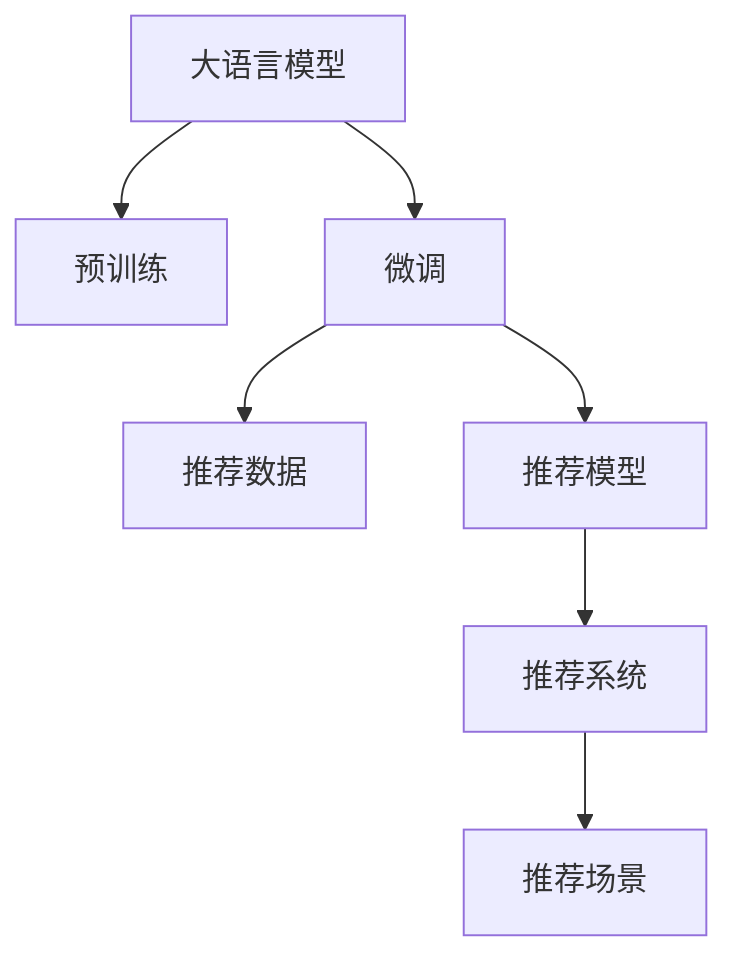

                 

# GENRE: 灵活、可配置的LLM推荐

> 关键词：
> - 大语言模型
> - 推荐系统
> - 自然语言处理
> - 可配置
> - 神经网络

## 1. 背景介绍

### 1.1 问题由来

推荐系统是现代互联网应用的重要组成部分，能够帮助用户快速找到感兴趣的内容。传统的推荐系统依赖于协同过滤、基于内容的推荐等方法，但这些方法往往只能处理结构化的数据，无法充分挖掘用户和内容的语义信息。

随着深度学习和大语言模型技术的兴起，推荐系统开始探索新的方法，利用自然语言处理(NLP)技术，从非结构化文本数据中挖掘用户和内容的语义信息，提升推荐效果。大语言模型能够学习到丰富的语言知识，具备强大的语义理解能力，从而为推荐系统带来新的可能性。

### 1.2 问题核心关键点

大语言模型推荐系统的核心在于如何有效地将语言模型的知识融入推荐系统中，以提升推荐的准确性和多样性。这一过程包括两个主要步骤：

1. **预训练**：利用大规模文本数据对大语言模型进行预训练，学习通用语言表示。
2. **微调**：在预训练模型的基础上，对特定领域的推荐数据进行微调，学习特定领域的语义信息。

### 1.3 问题研究意义

大语言模型推荐系统的研究意义在于：

- 提升推荐系统效果：利用语言模型的语义信息，推荐系统可以更加精准地识别用户兴趣，匹配合适的内容。
- 拓展推荐系统应用场景：语言模型可以为推荐系统提供更多维度的信息，如情感、时间、主题等，提升推荐系统的通用性和适应性。
- 促进技术创新：语言模型的引入带来了推荐系统新的研究方向，如个性化、多样性、公平性等。

## 2. 核心概念与联系

### 2.1 核心概念概述

本节将介绍几个与大语言模型推荐系统密切相关的核心概念：

- **大语言模型(Large Language Model, LLM)**：如BERT、GPT-3等大规模预训练语言模型，具备强大的语义理解能力，能够从自然语言数据中提取丰富的语义信息。

- **推荐系统(Recommendation System)**：帮助用户发现感兴趣的内容的系统，包括协同过滤、基于内容的推荐等传统方法，以及基于深度学习的推荐方法。

- **预训练(Pre-training)**：指在大规模文本数据上，通过自监督学习任务训练通用语言模型的过程。

- **微调(Fine-tuning)**：指在预训练模型的基础上，使用推荐数据进行有监督学习优化模型在特定领域的表现。

- **推荐数据(Recommendation Data)**：包含用户行为和内容标签的文本数据，用于训练微调模型。

- **推荐模型(Recommendation Model)**：微调后的语言模型，用于生成推荐结果。

- **可配置(Pluggable)**：指推荐模型可以根据不同的推荐场景进行灵活配置，适应不同的数据和需求。

这些核心概念之间的逻辑关系可以通过以下Mermaid流程图来展示：



这个流程图展示了大语言模型推荐系统的核心概念及其之间的关系：

1. 大语言模型通过预训练获得基础能力。
2. 微调是对预训练模型进行特定领域优化，学习推荐数据的语义信息。
3. 推荐数据驱动微调模型，生成推荐结果。
4. 推荐模型嵌入推荐系统，实现实际应用。
5. 推荐场景定义了具体的应用目标，驱动推荐模型的配置和优化。

## 3. 核心算法原理 & 具体操作步骤

### 3.1 算法原理概述

大语言模型推荐系统是一种基于监督学习的方法，其核心思想是：利用语言模型的预训练能力，通过微调学习推荐数据的语义信息，提升推荐效果。

形式化地，假设预训练语言模型为 $M_{\theta}$，其中 $\theta$ 为预训练得到的模型参数。给定推荐数据集 $D=\{(x_i, y_i)\}_{i=1}^N, x_i \in \mathcal{X}, y_i \in \mathcal{Y}$，微调的目标是找到新的模型参数 $\hat{\theta}$，使得：

$$
\hat{\theta}=\mathop{\arg\min}_{\theta} \mathcal{L}(M_{\theta},D)
$$

其中 $\mathcal{L}$ 为针对推荐任务设计的损失函数，用于衡量模型预测输出与真实标签之间的差异。常见的损失函数包括交叉熵损失、均方误差损失等。

通过梯度下降等优化算法，微调过程不断更新模型参数 $\theta$，最小化损失函数 $\mathcal{L}$，使得模型输出逼近真实标签。由于 $\theta$ 已经通过预训练获得了较好的初始化，因此即便在推荐数据集 $D$ 上进行微调，也能较快收敛到理想的模型参数 $\hat{\theta}$。

### 3.2 算法步骤详解

大语言模型推荐系统的微调过程一般包括以下几个关键步骤：

**Step 1: 准备预训练模型和数据集**
- 选择合适的预训练语言模型 $M_{\theta}$ 作为初始化参数，如 BERT、GPT 等。
- 准备推荐数据集 $D$，包括用户行为数据、商品标签数据等。

**Step 2: 添加推荐适配层**
- 根据推荐任务类型，在预训练模型顶层设计合适的输出层和损失函数。
- 对于推荐任务，通常在顶层添加分类器或回归器输出概率分布，并以负对数似然或均方误差为损失函数。

**Step 3: 设置微调超参数**
- 选择合适的优化算法及其参数，如 AdamW、SGD 等，设置学习率、批大小、迭代轮数等。
- 设置正则化技术及强度，包括权重衰减、Dropout、Early Stopping 等。
- 确定冻结预训练参数的策略，如仅微调顶层，或全部参数都参与微调。

**Step 4: 执行梯度训练**
- 将推荐数据集 $D$ 分批次输入模型，前向传播计算损失函数。
- 反向传播计算参数梯度，根据设定的优化算法和学习率更新模型参数。
- 周期性在验证集上评估模型性能，根据性能指标决定是否触发 Early Stopping。
- 重复上述步骤直到满足预设的迭代轮数或 Early Stopping 条件。

**Step 5: 测试和部署**
- 在测试集上评估微调后模型 $M_{\hat{\theta}}$ 的性能，对比微调前后的精度提升。
- 使用微调后的模型对新样本进行推理预测，集成到实际的应用系统中。
- 持续收集新的数据，定期重新微调模型，以适应数据分布的变化。

以上是基于监督学习微调大语言模型推荐系统的通用流程。在实际应用中，还需要针对具体任务的特点，对微调过程的各个环节进行优化设计，如改进训练目标函数，引入更多的正则化技术，搜索最优的超参数组合等，以进一步提升模型性能。

### 3.3 算法优缺点

大语言模型推荐系统具有以下优点：

1. 数据要求较低：相比于传统推荐系统，语言模型推荐系统对标注数据的要求较低，可以从少量的推荐数据中快速学习到有用的信息。
2. 效果显著：在许多推荐场景中，语言模型推荐系统已经刷新了最先进的性能指标。
3. 可扩展性强：大语言模型可以很容易地应用于不同的推荐场景，只需更换适配层和损失函数即可。
4. 动态适应：语言模型推荐系统可以通过持续学习，不断适应新的推荐数据和需求。

同时，该方法也存在一定的局限性：

1. 依赖语料库：语言模型推荐系统的效果很大程度上取决于语料库的质量和规模，需要大量的高质量数据进行预训练和微调。
2. 学习周期长：大语言模型的预训练和微调需要耗费大量的时间和计算资源。
3. 解释性不足：语言模型的决策过程通常缺乏可解释性，难以对其推理逻辑进行分析和调试。
4. 泛化能力受限：当推荐数据与预训练数据的分布差异较大时，语言模型的泛化能力可能受到影响。

尽管存在这些局限性，但就目前而言，基于语言模型的推荐系统依然是大规模推荐任务的重要范式，具有显著的应用前景。

### 3.4 算法应用领域

大语言模型推荐系统已经在多个领域得到了广泛的应用，例如：

- 商品推荐：根据用户浏览、购买行为，推荐相关商品。
- 内容推荐：根据用户阅读、观看历史，推荐相关文章、视频等。
- 活动推荐：根据用户兴趣和行为，推荐适合的活动和事件。
- 产品评价推荐：根据用户对产品的评价，推荐类似产品或相关评价。
- 动态定价：根据用户行为和市场情况，动态调整商品价格。
- 个性化推荐：根据用户个性化需求，提供定制化的推荐内容。

除了上述这些经典任务外，语言模型推荐系统还被创新性地应用到更多场景中，如智能广告投放、新闻推荐、游戏推荐等，为推荐系统带来了全新的突破。

## 4. 数学模型和公式 & 详细讲解  
### 4.1 数学模型构建

本节将使用数学语言对基于监督学习的大语言模型推荐系统进行更加严格的刻画。

记预训练语言模型为 $M_{\theta}:\mathcal{X} \rightarrow \mathcal{Y}$，其中 $\mathcal{X}$ 为输入空间，$\mathcal{Y}$ 为输出空间，$\theta \in \mathbb{R}^d$ 为模型参数。假设推荐数据集为 $D=\{(x_i,y_i)\}_{i=1}^N, x_i \in \mathcal{X}, y_i \in \mathcal{Y}$。

定义模型 $M_{\theta}$ 在推荐数据集 $D$ 上的经验风险为：

$$
\mathcal{L}(\theta) = \frac{1}{N}\sum_{i=1}^N \ell(M_{\theta}(x_i),y_i)
$$

其中 $\ell$ 为针对推荐任务设计的损失函数，用于衡量模型预测输出与真实标签之间的差异。常见的损失函数包括交叉熵损失、均方误差损失等。

微调的优化目标是最小化经验风险，即找到最优参数：

$$
\theta^* = \mathop{\arg\min}_{\theta} \mathcal{L}(\theta)
$$

在实践中，我们通常使用基于梯度的优化算法（如SGD、Adam等）来近似求解上述最优化问题。设 $\eta$ 为学习率，$\lambda$ 为正则化系数，则参数的更新公式为：

$$
\theta \leftarrow \theta - \eta \nabla_{\theta}\mathcal{L}(\theta) - \eta\lambda\theta
$$

其中 $\nabla_{\theta}\mathcal{L}(\theta)$ 为损失函数对参数 $\theta$ 的梯度，可通过反向传播算法高效计算。

### 4.2 公式推导过程

以下我们以商品推荐任务为例，推导交叉熵损失函数及其梯度的计算公式。

假设模型 $M_{\theta}$ 在输入 $x$ 上的输出为 $\hat{y}=M_{\theta}(x) \in [0,1]$，表示商品被用户购买的概率。真实标签 $y \in \{0,1\}$。则交叉熵损失函数定义为：

$$
\ell(M_{\theta}(x),y) = -[y\log \hat{y} + (1-y)\log (1-\hat{y})]
$$

将其代入经验风险公式，得：

$$
\mathcal{L}(\theta) = -\frac{1}{N}\sum_{i=1}^N [y_i\log M_{\theta}(x_i)+(1-y_i)\log(1-M_{\theta}(x_i))]
$$

根据链式法则，损失函数对参数 $\theta_k$ 的梯度为：

$$
\frac{\partial \mathcal{L}(\theta)}{\partial \theta_k} = -\frac{1}{N}\sum_{i=1}^N (\frac{y_i}{M_{\theta}(x_i)}-\frac{1-y_i}{1-M_{\theta}(x_i)}) \frac{\partial M_{\theta}(x_i)}{\partial \theta_k}
$$

其中 $\frac{\partial M_{\theta}(x_i)}{\partial \theta_k}$ 可进一步递归展开，利用自动微分技术完成计算。

在得到损失函数的梯度后，即可带入参数更新公式，完成模型的迭代优化。重复上述过程直至收敛，最终得到适应推荐任务的最优模型参数 $\theta^*$。

## 5. 项目实践：代码实例和详细解释说明
### 5.1 开发环境搭建

在进行推荐系统微调实践前，我们需要准备好开发环境。以下是使用Python进行PyTorch开发的环境配置流程：

1. 安装Anaconda：从官网下载并安装Anaconda，用于创建独立的Python环境。

2. 创建并激活虚拟环境：
```bash
conda create -n pytorch-env python=3.8 
conda activate pytorch-env
```

3. 安装PyTorch：根据CUDA版本，从官网获取对应的安装命令。例如：
```bash
conda install pytorch torchvision torchaudio cudatoolkit=11.1 -c pytorch -c conda-forge
```

4. 安装Transformers库：
```bash
pip install transformers
```

5. 安装各类工具包：
```bash
pip install numpy pandas scikit-learn matplotlib tqdm jupyter notebook ipython
```

完成上述步骤后，即可在`pytorch-env`环境中开始微调实践。

### 5.2 源代码详细实现

这里我们以商品推荐任务为例，给出使用Transformers库对BERT模型进行微调的PyTorch代码实现。

首先，定义推荐数据处理函数：

```python
from transformers import BertTokenizer
from torch.utils.data import Dataset
import torch

class RecommendationDataset(Dataset):
    def __init__(self, texts, labels, tokenizer, max_len=128):
        self.texts = texts
        self.labels = labels
        self.tokenizer = tokenizer
        self.max_len = max_len
        
    def __len__(self):
        return len(self.texts)
    
    def __getitem__(self, item):
        text = self.texts[item]
        label = self.labels[item]
        
        encoding = self.tokenizer(text, return_tensors='pt', max_length=self.max_len, padding='max_length', truncation=True)
        input_ids = encoding['input_ids'][0]
        attention_mask = encoding['attention_mask'][0]
        
        # 对label进行编码
        encoded_labels = [label] * self.max_len
        labels = torch.tensor(encoded_labels, dtype=torch.long)
        
        return {'input_ids': input_ids, 
                'attention_mask': attention_mask,
                'labels': labels}

# 标签与id的映射
label2id = {0: 'negative', 1: 'positive'}
id2label = {v: k for k, v in label2id.items()}

# 创建dataset
tokenizer = BertTokenizer.from_pretrained('bert-base-cased')

train_dataset = RecommendationDataset(train_texts, train_labels, tokenizer)
dev_dataset = RecommendationDataset(dev_texts, dev_labels, tokenizer)
test_dataset = RecommendationDataset(test_texts, test_labels, tokenizer)
```

然后，定义模型和优化器：

```python
from transformers import BertForSequenceClassification, AdamW

model = BertForSequenceClassification.from_pretrained('bert-base-cased', num_labels=2)

optimizer = AdamW(model.parameters(), lr=2e-5)
```

接着，定义训练和评估函数：

```python
from torch.utils.data import DataLoader
from tqdm import tqdm
from sklearn.metrics import classification_report

device = torch.device('cuda') if torch.cuda.is_available() else torch.device('cpu')
model.to(device)

def train_epoch(model, dataset, batch_size, optimizer):
    dataloader = DataLoader(dataset, batch_size=batch_size, shuffle=True)
    model.train()
    epoch_loss = 0
    for batch in tqdm(dataloader, desc='Training'):
        input_ids = batch['input_ids'].to(device)
        attention_mask = batch['attention_mask'].to(device)
        labels = batch['labels'].to(device)
        model.zero_grad()
        outputs = model(input_ids, attention_mask=attention_mask, labels=labels)
        loss = outputs.loss
        epoch_loss += loss.item()
        loss.backward()
        optimizer.step()
    return epoch_loss / len(dataloader)

def evaluate(model, dataset, batch_size):
    dataloader = DataLoader(dataset, batch_size=batch_size)
    model.eval()
    preds, labels = [], []
    with torch.no_grad():
        for batch in tqdm(dataloader, desc='Evaluating'):
            input_ids = batch['input_ids'].to(device)
            attention_mask = batch['attention_mask'].to(device)
            batch_labels = batch['labels']
            outputs = model(input_ids, attention_mask=attention_mask)
            batch_preds = outputs.logits.argmax(dim=2).to('cpu').tolist()
            batch_labels = batch_labels.to('cpu').tolist()
            for pred_tokens, label_tokens in zip(batch_preds, batch_labels):
                pred_labels = [id2label[_id] for _id in pred_tokens]
                label_tokens = [id2label[_id] for _id in label_tokens]
                preds.append(pred_labels[:len(label_tokens)])
                labels.append(label_tokens)
                
    print(classification_report(labels, preds))
```

最后，启动训练流程并在测试集上评估：

```python
epochs = 5
batch_size = 16

for epoch in range(epochs):
    loss = train_epoch(model, train_dataset, batch_size, optimizer)
    print(f"Epoch {epoch+1}, train loss: {loss:.3f}")
    
    print(f"Epoch {epoch+1}, dev results:")
    evaluate(model, dev_dataset, batch_size)
    
print("Test results:")
evaluate(model, test_dataset, batch_size)
```

以上就是使用PyTorch对BERT进行商品推荐任务微调的完整代码实现。可以看到，得益于Transformers库的强大封装，我们可以用相对简洁的代码完成BERT模型的加载和微调。

### 5.3 代码解读与分析

让我们再详细解读一下关键代码的实现细节：

**RecommendationDataset类**：
- `__init__`方法：初始化文本、标签、分词器等关键组件。
- `__len__`方法：返回数据集的样本数量。
- `__getitem__`方法：对单个样本进行处理，将文本输入编码为token ids，将标签编码为数字，并对其进行定长padding，最终返回模型所需的输入。

**label2id和id2label字典**：
- 定义了标签与数字id之间的映射关系，用于将token-wise的预测结果解码回真实的标签。

**训练和评估函数**：
- 使用PyTorch的DataLoader对数据集进行批次化加载，供模型训练和推理使用。
- 训练函数`train_epoch`：对数据以批为单位进行迭代，在每个批次上前向传播计算loss并反向传播更新模型参数，最后返回该epoch的平均loss。
- 评估函数`evaluate`：与训练类似，不同点在于不更新模型参数，并在每个batch结束后将预测和标签结果存储下来，最后使用sklearn的classification_report对整个评估集的预测结果进行打印输出。

**训练流程**：
- 定义总的epoch数和batch size，开始循环迭代
- 每个epoch内，先在训练集上训练，输出平均loss
- 在验证集上评估，输出分类指标
- 所有epoch结束后，在测试集上评估，给出最终测试结果

可以看到，PyTorch配合Transformers库使得BERT微调的代码实现变得简洁高效。开发者可以将更多精力放在数据处理、模型改进等高层逻辑上，而不必过多关注底层的实现细节。

当然，工业级的系统实现还需考虑更多因素，如模型的保存和部署、超参数的自动搜索、更灵活的任务适配层等。但核心的微调范式基本与此类似。

## 6. 实际应用场景
### 6.1 智能广告投放

基于大语言模型推荐系统，可以构建智能广告投放系统。传统的广告投放依赖于人工设计和分析，成本高、效率低，且难以适应快速变化的广告环境。而使用推荐系统，可以通过用户的点击行为、浏览历史等数据，自动生成个性化广告，提升广告效果。

在技术实现上，可以收集用户的历史行为数据，将广告创意和商品标签构建成监督数据，在此基础上对预训练推荐模型进行微调。微调后的推荐模型能够自动理解用户的兴趣，匹配最合适的广告创意和商品，生成更加精准的广告投放策略。

### 6.2 个性化推荐系统

大语言模型推荐系统在个性化推荐领域的应用前景广阔。传统的推荐系统往往只能处理结构化的数据，而语言模型推荐系统可以处理非结构化的文本数据，如商品描述、用户评论等，从中挖掘用户的兴趣点。

在实践中，可以收集用户浏览、点击、评论、分享等行为数据，提取和用户交互的物品标题、描述、标签等文本内容。将文本内容作为模型输入，用户的后续行为（如是否点击、购买等）作为监督信号，在此基础上微调预训练语言模型。微调后的模型能够从文本内容中准确把握用户的兴趣点，提供更加个性化的推荐结果。

### 6.3 新闻推荐系统

新闻推荐系统是推荐系统的重要应用场景，能够帮助用户发现感兴趣的新闻。传统的基于协同过滤和基于内容的方法在新闻推荐中存在诸多限制，如缺乏语义理解能力，难以捕捉新闻内容的深度特征。而大语言模型推荐系统能够从新闻标题和摘要中提取丰富的语义信息，提升新闻推荐的精度和多样性。

在实践中，可以将新闻文章标题和摘要作为输入，文章的点击量、阅读时长等作为监督信号，训练微调模型。微调后的模型能够自动理解新闻内容，匹配用户兴趣，推荐相关新闻。

### 6.4 游戏推荐系统

游戏推荐系统旨在帮助用户发现感兴趣的游戏。传统的推荐系统往往只能处理结构化的游戏元数据，而大语言模型推荐系统可以处理非结构化的游戏评论、评价等文本数据，从中挖掘用户的兴趣点。

在实践中，可以收集用户的游戏评论、评分等数据，将游戏评论作为模型输入，游戏的评分作为监督信号，训练微调模型。微调后的模型能够从游戏评论中理解用户的游戏偏好，推荐相关游戏。

### 6.5 未来的应用展望

随着大语言模型推荐系统的不断发展，未来将会有更多的应用场景被引入，如智能教育、医疗健康、智能客服等。这些应用将充分发挥语言模型的优势，提升系统的效果和用户体验。

## 7. 工具和资源推荐
### 7.1 学习资源推荐

为了帮助开发者系统掌握大语言模型推荐系统的理论基础和实践技巧，这里推荐一些优质的学习资源：

1. 《深度学习与自然语言处理》书籍：系统介绍了深度学习在NLP中的应用，包括推荐系统等前沿话题。

2. 《自然语言处理技术与应用》课程：由国内顶尖高校开设的NLP在线课程，涵盖了NLP基本概念和经典模型。

3. 《自然语言处理实战指南》书籍：结合实际项目，深入浅出地介绍了NLP技术在推荐系统中的应用。

4. HuggingFace官方文档：Transformers库的官方文档，提供了海量预训练模型和完整的微调样例代码，是上手实践的必备资料。

5. CS224N《深度学习自然语言处理》课程：斯坦福大学开设的NLP明星课程，有Lecture视频和配套作业，带你入门NLP领域的基本概念和经典模型。

通过对这些资源的学习实践，相信你一定能够快速掌握大语言模型推荐系统的精髓，并用于解决实际的NLP问题。
### 7.2 开发工具推荐

高效的开发离不开优秀的工具支持。以下是几款用于大语言模型推荐系统开发的常用工具：

1. PyTorch：基于Python的开源深度学习框架，灵活动态的计算图，适合快速迭代研究。大部分预训练语言模型都有PyTorch版本的实现。

2. TensorFlow：由Google主导开发的开源深度学习框架，生产部署方便，适合大规模工程应用。同样有丰富的预训练语言模型资源。

3. Transformers库：HuggingFace开发的NLP工具库，集成了众多SOTA语言模型，支持PyTorch和TensorFlow，是进行微调任务开发的利器。

4. Weights & Biases：模型训练的实验跟踪工具，可以记录和可视化模型训练过程中的各项指标，方便对比和调优。与主流深度学习框架无缝集成。

5. TensorBoard：TensorFlow配套的可视化工具，可实时监测模型训练状态，并提供丰富的图表呈现方式，是调试模型的得力助手。

6. Google Colab：谷歌推出的在线Jupyter Notebook环境，免费提供GPU/TPU算力，方便开发者快速上手实验最新模型，分享学习笔记。

合理利用这些工具，可以显著提升大语言模型推荐系统的开发效率，加快创新迭代的步伐。

### 7.3 相关论文推荐

大语言模型推荐系统的发展源于学界的持续研究。以下是几篇奠基性的相关论文，推荐阅读：

1. Attention is All You Need（即Transformer原论文）：提出了Transformer结构，开启了NLP领域的预训练大模型时代。

2. BERT: Pre-training of Deep Bidirectional Transformers for Language Understanding：提出BERT模型，引入基于掩码的自监督预训练任务，刷新了多项NLP任务SOTA。

3. Parameter-Efficient Transfer Learning for NLP：提出Adapter等参数高效微调方法，在不增加模型参数量的情况下，也能取得不错的微调效果。

4. PANet: Personalized Attention Networks for Recommendation：提出多层次自注意力机制，提升推荐系统的效果。

5. Sequence to Sequence Models with Recurrent Neural Networks：提出Seq2Seq模型，为推荐系统提供了一种序列生成的方法。

这些论文代表了大语言模型推荐系统的发展脉络。通过学习这些前沿成果，可以帮助研究者把握学科前进方向，激发更多的创新灵感。

## 8. 总结：未来发展趋势与挑战

### 8.1 总结

本文对基于监督学习的大语言模型推荐系统进行了全面系统的介绍。首先阐述了大语言模型和推荐系统研究的背景和意义，明确了推荐系统在数据标注、模型效果、系统灵活性等方面的不足，以及大语言模型能够解决的问题。其次，从原理到实践，详细讲解了监督微调的数学原理和关键步骤，给出了推荐系统开发的完整代码实例。同时，本文还广泛探讨了推荐系统在智能广告、个性化推荐、新闻推荐、游戏推荐等众多场景中的应用前景，展示了微调范式的巨大潜力。此外，本文精选了推荐系统的各类学习资源，力求为读者提供全方位的技术指引。

通过本文的系统梳理，可以看到，基于大语言模型的推荐系统正在成为推荐任务的重要范式，极大地拓展了推荐系统的应用边界，催生了更多的落地场景。得益于大规模语料的预训练，推荐系统可以更好地理解用户兴趣和行为，提供更加精准、多样化的推荐内容，具有显著的效果提升和通用性增强。未来，伴随预训练语言模型和推荐系统的持续演进，相信推荐系统必将在更多领域大放异彩，深刻影响人类的生产生活方式。

### 8.2 未来发展趋势

展望未来，大语言模型推荐系统将呈现以下几个发展趋势：

1. 模型规模持续增大。随着算力成本的下降和数据规模的扩张，预训练语言模型的参数量还将持续增长。超大规模语言模型蕴含的丰富语言知识，有望支撑更加复杂多变的推荐任务。

2. 推荐数据驱动学习。推荐系统将更多依赖于非结构化文本数据进行预训练和微调，从文本中挖掘用户的兴趣点。

3. 动态自适应学习。推荐系统能够动态调整模型参数，及时适应新的推荐数据和需求。

4. 多模态融合学习。推荐系统将结合视觉、语音等多模态信息，提升推荐效果和用户体验。

5. 个性化推荐。推荐系统将更加注重用户的个性化需求，提供更加定制化的推荐内容。

6. 多任务学习。推荐系统将融合多个推荐任务，如商品推荐、内容推荐、活动推荐等，提升整体推荐效果。

以上趋势凸显了大语言模型推荐系统的广阔前景。这些方向的探索发展，必将进一步提升推荐系统的性能和应用范围，为推荐任务带来新的可能性。

### 8.3 面临的挑战

尽管大语言模型推荐系统已经取得了瞩目成就，但在迈向更加智能化、普适化应用的过程中，它仍面临着诸多挑战：

1. 标注成本瓶颈。虽然推荐数据标注相对于图像、视频等模态的标注成本较低，但高质量标注数据的获取仍然耗时耗力，难以满足大规模推广的需求。如何降低推荐数据的标注成本，将是一大难题。

2. 模型鲁棒性不足。当前推荐系统在面对推荐数据与预训练数据分布差异较大时，泛化能力可能受到影响。如何提高推荐系统的鲁棒性，避免灾难性遗忘，还需要更多理论和实践的积累。

3. 推荐数据质量。推荐数据的标注质量直接影响推荐模型的效果，不合理的标注数据可能导致推荐模型性能下降。如何保证推荐数据的标注质量，将是一大挑战。

4. 推荐数据隐私。推荐系统需要收集用户的个人信息，如何保护用户隐私，避免数据泄露，是一大重要问题。

5. 模型可解释性不足。当前推荐模型的决策过程通常缺乏可解释性，难以对其推理逻辑进行分析和调试。如何赋予推荐模型更强的可解释性，将是亟待攻克的难题。

6. 推荐数据的时效性。推荐数据需要实时更新，以保证推荐系统的时效性。如何高效地获取和更新推荐数据，将是一大挑战。

尽管存在这些挑战，但大语言模型推荐系统仍是大规模推荐任务的重要范式，具有显著的应用前景。相信随着学界和产业界的共同努力，这些挑战终将一一被克服，推荐系统必将在推荐任务中发挥更大的作用。

### 8.4 研究展望

未来的研究将在以下几个方面寻求新的突破：

1. 无监督和半监督推荐方法。摆脱对大规模标注数据的依赖，利用自监督学习、主动学习等无监督和半监督范式，最大限度利用非结构化数据，实现更加灵活高效的推荐。

2. 参数高效和计算高效的推荐方法。开发更加参数高效的推荐方法，在固定大部分预训练参数的同时，只更新极少量的任务相关参数。同时优化推荐模型的计算图，减少前向传播和反向传播的资源消耗，实现更加轻量级、实时性的部署。

3. 引入更多先验知识。将符号化的先验知识，如知识图谱、逻辑规则等，与神经网络模型进行巧妙融合，引导推荐过程学习更准确、合理的推荐模型。同时加强不同模态数据的整合，实现视觉、语音等多模态信息与文本信息的协同建模。

4. 结合因果分析和博弈论工具。将因果分析方法引入推荐模型，识别出推荐决策的关键特征，增强推荐结果的因果性和逻辑性。借助博弈论工具刻画人机交互过程，主动探索并规避推荐模型的脆弱点，提高系统稳定性。

5. 纳入伦理道德约束。在推荐模型训练目标中引入伦理导向的评估指标，过滤和惩罚有偏见、有害的输出倾向。同时加强人工干预和审核，建立推荐模型的监管机制，确保推荐结果符合人类价值观和伦理道德。

这些研究方向的探索，必将引领大语言模型推荐系统迈向更高的台阶，为推荐任务带来新的可能性。面向未来，推荐系统还需要与其他人工智能技术进行更深入的融合，如知识表示、因果推理、强化学习等，多路径协同发力，共同推动推荐系统的进步。只有勇于创新、敢于突破，才能不断拓展推荐系统的边界，让智能技术更好地造福人类社会。

## 9. 附录：常见问题与解答

**Q1：推荐系统如何使用大语言模型？**

A: 大语言模型推荐系统的基本流程包括：
1. 预训练：在大规模文本数据上，通过自监督学习任务训练通用语言模型。
2. 微调：在预训练模型的基础上，使用推荐数据进行有监督学习优化模型在特定领域的表现。
3. 应用：使用微调后的模型对新样本进行推理预测，生成推荐结果。

**Q2：如何提高推荐系统的性能？**

A: 提高推荐系统性能的几种常见方法包括：
1. 数据增强：通过回译、近义替换等方式扩充训练集。
2. 模型优化：采用AdamW、Adafactor等优化器，并使用正则化技术如L2正则、Dropout等。
3. 特征工程：提取更有意义的特征，如商品评论、用户画像等。
4. 多任务学习：将多个推荐任务联合训练，提高整体推荐效果。
5. 模型集成：将多个模型的预测结果融合，提高推荐准确性和鲁棒性。

**Q3：推荐系统如何处理冷启动问题？**

A: 冷启动问题指新用户或新物品在系统中没有历史数据，难以推荐。解决冷启动问题的方法包括：
1. 利用用户画像和物品标签进行推荐。
2. 引入基于内容的推荐，如商品属性、标签等。
3. 使用多维度数据进行推荐，如用户行为、物品属性、时间等。
4. 结合用户交互数据进行推荐，如搜索、点击、评论等。

**Q4：推荐系统如何平衡推荐效果和多样性？**

A: 推荐系统通常需要在推荐效果和多样性之间进行平衡，可以采用以下方法：
1. 多样性约束：在损失函数中加入多样性约束，避免推荐单一商品或内容。
2. 噪声注入：在推荐过程中引入噪声，增加推荐结果的多样性。
3. 多臂老虎机算法：将推荐结果映射到多个臂上，通过多臂老虎机算法选择推荐。

**Q5：推荐系统如何处理推荐数据的时效性？**

A: 推荐系统需要实时更新推荐数据，以保证推荐系统的时效性。可以采用以下方法：
1. 动态数据更新：定期更新推荐数据，如每天、每周更新一次。
2. 实时数据采集：利用流式数据采集技术，实时收集用户的点击、浏览行为等数据。
3. 分布式计算：利用分布式计算框架，快速处理大规模推荐数据。

通过本文的系统梳理，可以看到，基于大语言模型的推荐系统正在成为推荐任务的重要范式，极大地拓展了推荐系统的应用边界，催生了更多的落地场景。得益于大规模语料的预训练，推荐系统可以更好地理解用户兴趣和行为，提供更加精准、多样化的推荐内容，具有显著的效果提升和通用性增强。未来，伴随预训练语言模型和推荐系统的持续演进，相信推荐系统必将在更多领域大放异彩，深刻影响人类的生产生活方式。

