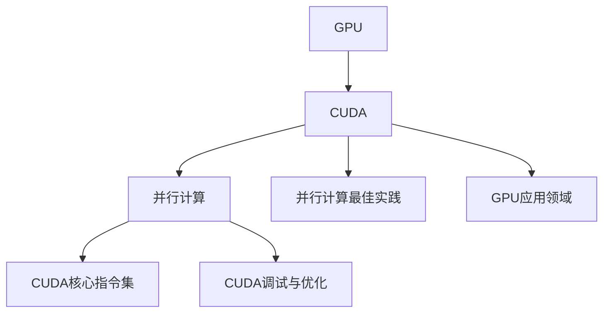

                 

# GPU编程：CUDA基础与实践

> 关键词：GPU编程, CUDA, 并行计算, CUDA核心指令集, CUDA调试, CUDA最佳实践, GPU加速, 高性能计算

## 1. 背景介绍

### 1.1 问题由来

在现代计算领域，尤其是高性能计算和数据密集型应用中，GPU（图形处理器）因其强大的并行计算能力，逐渐成为不可或缺的重要组成部分。与传统的CPU（中央处理器）相比，GPU的并行处理能力使得其能够在多任务和高并行度场景中大放异彩。特别是随着人工智能和深度学习技术的兴起，GPU在训练深度神经网络、加速复杂算法、推动科学计算等方面的应用越来越广泛。

随着NVIDIA推出的CUDA（Compute Unified Device Architecture）编程模型和工具链的不断成熟，GPU编程已经成为许多工程师和研究人员必备的开发技能。CUDA作为一种高级编程语言，旨在简化并行计算程序开发，并在GPU硬件上实现高效的并行计算。

### 1.2 问题核心关键点

- GPU加速编程：利用GPU并行处理能力提升计算效率，加速应用开发。
- CUDA核心指令集：CUDA提供的一系列并行编程指令和工具，支持高效的GPU编程。
- CUDA调试与优化：借助GPU调试工具，快速定位和解决程序性能问题，提高程序效率。
- 并行计算最佳实践：掌握并行计算的编程原则和技巧，最大化利用GPU资源，实现高性能计算。
- GPU应用领域：涵盖科学计算、深度学习、图形渲染、高通量计算等多个应用领域。

理解并掌握GPU编程与CUDA的核心原理和编程技巧，对于开发高性能、可扩展的应用程序至关重要。本文章将从基础概念出发，通过结构化的逻辑和详细的案例分析，深入浅出地介绍CUDA编程的原理、实现方法和最佳实践。

## 2. 核心概念与联系

### 2.1 核心概念概述

- **GPU**：图形处理器，能够并行处理大量数据，适合高并行度计算任务。
- **CUDA**：由NVIDIA开发的并行计算平台和编程模型，可在NVIDIA GPU上高效运行。
- **并行计算**：利用多线程并行处理任务，实现高效计算。
- **CUDA核心指令集**：CUDA提供的并行计算指令，如线程、块、共享内存、原子操作等。
- **CUDA调试与优化**：利用CUDA提供的调试工具（如NVSidewinder）和性能分析工具（如nvprof），对程序进行性能分析和优化。

这些概念之间的关系可以通过以下Mermaid流程图来展示：



这个流程图展示了GPU编程中各个关键概念的联系。GPU作为硬件基础，通过CUDA平台提供并行计算能力，利用CUDA核心指令集进行并行编程，通过调试与优化工具确保程序性能，最佳实践指导高效实现，最终应用于多个领域。

## 3. 核心算法原理 & 具体操作步骤

### 3.1 算法原理概述

CUDA编程的原理基于并行计算模型，将大任务拆分为多个小任务，由GPU的多个线程同时处理，从而实现高效计算。CUDA提供了一组优化的API和指令集，使得程序员能够方便地进行并行编程，并充分利用GPU的硬件特性。

CUDA编程模型包含以下核心概念：

- **线程（Thread）**：CUDA中的线程是GPU并行计算的基本单位，每个线程可以独立执行一个计算任务。
- **块（Block）**：一组线程组成的并行执行单元，通常每个线程块的大小为256。
- **共享内存（Shared Memory）**：线程块之间共享的内存区域，用于线程间的数据传递。
- **全局内存（Global Memory）**：线程块之间共享的全局内存空间，用于存储大规模数据。
- **常量内存（Constant Memory）**：GPU中专门用于存储常量的高速内存，用于传递不变参数。
- **原子操作（Atomic Operations）**：确保多个线程对共享内存的访问是原子的，防止数据竞争和线程同步问题。

### 3.2 算法步骤详解

CUDA编程的基本步骤如下：

1. **环境搭建**：安装NVIDIA CUDA工具链，配置环境变量，确保CUDA库路径设置正确。

2. **编写CUDA程序**：使用C++编写并行计算代码，结合CUDA API进行并行编程。

3. **编译CUDA程序**：使用`nvcc`编译器编译CUDA程序，生成可执行文件。

4. **调试与优化**：利用NVSidewinder、nvprof等工具对程序进行调试和性能分析，优化代码。

5. **测试与部署**：在目标GPU上测试程序，确保其稳定运行，并进行生产环境部署。

6. **性能监控与维护**：持续监控程序性能，根据实际需求进行调整和优化。

### 3.3 算法优缺点

#### 优点：

- **高并行度**：CUDA充分利用GPU的并行处理能力，可以高效处理大量数据。
- **灵活性**：CUDA提供了丰富的API和指令集，适用于多种并行计算任务。
- **优化能力强**：CUDA支持高效的内存管理、线程调度和并行优化，适合深度学习和科学计算等高性能计算需求。

#### 缺点：

- **开发难度高**：并行编程复杂，需要程序员掌握并行计算的原理和技巧。
- **性能依赖GPU架构**：不同GPU架构对CUDA的支持程度不同，需要针对特定硬件进行优化。
- **调试复杂**：并行程序的调试和性能分析相对困难，容易出现线程同步和数据竞争问题。

### 3.4 算法应用领域

CUDA编程适用于多种高性能计算和数据密集型应用，包括但不限于：

- **深度学习**：用于加速神经网络模型的训练和推理。
- **科学计算**：如流体力学模拟、气候模型、物理计算等。
- **图形渲染**：游戏开发、虚拟现实等领域的图形渲染。
- **大数据处理**：数据挖掘、机器学习、自然语言处理等大数据处理任务。
- **高通量计算**：生物信息学、基因组学等高通量计算应用。

这些应用领域对计算资源的高需求，使得CUDA编程成为提升应用性能和计算效率的关键技术。

## 4. 数学模型和公式 & 详细讲解 & 举例说明

### 4.1 数学模型构建

CUDA编程的数学模型主要围绕并行计算和向量运算展开。CUDA的核心计算模型包括线程、块、共享内存、全局内存等概念，这些概念可以用数学模型来表示。

以矩阵乘法为例，其计算模型可以用以下公式表示：

$$
C = A \times B
$$

其中，$A$和$B$是两个矩阵，$C$是它们相乘的结果。在CUDA编程中，矩阵$A$和$B$可以分别存储在共享内存和全局内存中，由多个线程同时访问和计算。

### 4.2 公式推导过程

在CUDA中，矩阵乘法的并行计算公式可以表示为：

$$
C_{i,j} = \sum_k A_{i,k} \times B_{k,j}
$$

其中，$C_{i,j}$是结果矩阵$C$的元素，$A_{i,k}$和$B_{k,j}$分别是矩阵$A$和$B$的元素。

推导过程如下：

1. 定义线程块大小$N$，每个线程负责计算矩阵$A$和$B$的某一行或某一列。
2. 每个线程将矩阵$A$和$B$的对应元素相乘，累加结果并存储到共享内存中。
3. 每个线程块内的线程将共享内存中的结果复制到结果矩阵$C$的对应元素中。

通过这种方式，矩阵乘法被并行计算，显著提升计算效率。

### 4.3 案例分析与讲解

#### 案例：矩阵乘法的CUDA实现

以下是一个简单的CUDA代码示例，用于实现矩阵乘法：

```c++
__global__ void matrix_multiply(float *A, float *B, float *C, int M, int N, int P) {
    int i = blockIdx.x * blockDim.x + threadIdx.x;
    int j = blockIdx.y * blockDim.y + threadIdx.y;
    float c = 0;
    for (int k = 0; k < P; k++) {
        c += A[i + k * M] * B[k + j * P];
    }
    C[i + j * M] = c;
}

int main() {
    float *A = new float[M * P];
    float *B = new float[P * N];
    float *C = new float[M * N];
    matrix_multiply<<<gridDim, blockDim>>> (A, B, C, M, N, P);
    // 此处省略对C的计算和释放内存的代码
}
```

- `__global__`：CUDA内核函数的声明。
- `matrix_multiply`：矩阵乘法的CUDA函数，接收矩阵$A$、$B$和$C$的指针，以及矩阵大小$M$、$N$、$P$。
- `blockIdx.x`和`blockIdx.y`：获取线程块在全局数组中的位置。
- `blockDim.x`和`blockDim.y`：定义每个线程块的大小。
- `threadIdx.x`和`threadIdx.y`：获取线程在块中的位置。
- `<<<gridDim, blockDim>>>`：并行计算的配置，其中`gridDim`和`blockDim`分别表示线程块数和每个线程块的大小。

通过分析上述代码，可以看到CUDA的并行计算模型是如何应用于矩阵乘法的。程序将矩阵$A$和$B$的计算分给多个线程块和线程，每个线程独立计算某个元素，最终将结果存储到全局内存中的$C$矩阵中。

## 5. 项目实践：代码实例和详细解释说明

### 5.1 开发环境搭建

CUDA编程的开发环境搭建需要以下步骤：

1. **安装NVIDIA CUDA SDK**：从NVIDIA官网下载安装包，按照官方指南进行安装。
2. **配置环境变量**：将CUDA库路径和CUDA编译器路径添加到系统环境变量中。
3. **安装必要的开发工具**：如Visual Studio、Clang等，确保支持CUDA编译。
4. **测试CUDA安装**：使用`nvcc`编译器测试，确保能够正确编译和链接CUDA程序。

### 5.2 源代码详细实现

以下是一个简单的CUDA程序示例，用于计算斐波那契数列：

```c++
__global__ void fibonacci(float *fib, int n) {
    int tid = blockIdx.x * blockDim.x + threadIdx.x;
    if (tid < n) {
        fib[tid] = fib[tid - 1] + fib[tid - 2];
    }
}

int main() {
    int n = 100;
    float *fib = new float[n];
    fibonacci<<<1, 1>>>(fib, n);
    // 此处省略对fib的计算和释放内存的代码
}
```

- `fibonacci`：计算斐波那契数列的CUDA函数，接收结果数组和数组大小。
- `blockIdx.x`和`blockDim.x`：获取线程块和每个线程块的大小。
- `threadIdx.x`：获取线程在块中的位置。
- `<<<1, 1>>>`：并行计算的配置，表示每个线程块只计算一个线程的任务。

通过分析上述代码，可以看到CUDA的并行计算模型是如何应用于斐波那契数列的计算。程序将斐波那契数列的计算分给多个线程块和线程，每个线程独立计算某个元素，最终将结果存储到全局内存中的结果数组中。

### 5.3 代码解读与分析

#### 代码解读

- `__global__`：声明一个CUDA内核函数。
- `fibonacci`：CUDA内核函数，接收结果数组和数组大小。
- `blockIdx.x`和`blockDim.x`：获取线程块和每个线程块的大小。
- `threadIdx.x`：获取线程在块中的位置。
- `<<<1, 1>>>`：并行计算的配置，表示每个线程块只计算一个线程的任务。

#### 代码分析

- **并行计算配置**：通过配置线程块数和每个线程块的大小，可以将计算任务并行化，利用GPU的并行处理能力。
- **线程同步**：使用线程索引和条件判断，确保线程按照正确的顺序执行，避免数据竞争和同步问题。
- **内存管理**：利用全局内存和共享内存，管理计算过程中需要使用的数据，优化内存访问。

### 5.4 运行结果展示

#### 运行结果

通过上述代码，可以在GPU上计算斐波那契数列，并得到正确的结果。程序运行速度较CPU版本有显著提升，体现了GPU并行计算的优势。

## 6. 实际应用场景

### 6.1 智能图像识别

CUDA编程在智能图像识别领域有广泛应用，如深度学习中的卷积神经网络（CNN）训练和推理。通过并行计算，CUDA可以加速卷积操作，大幅提升图像识别的计算效率。

### 6.2 科学模拟

科学模拟如天气预报、物理模拟等，需要处理大量数据，并行计算需求高。CUDA提供了高效的并行计算模型和优化工具，可以显著加速科学模拟的计算速度。

### 6.3 人工智能训练

深度学习模型的训练和推理通常需要大量的计算资源，CUDA编程可以加速矩阵运算和梯度计算，使得深度学习模型训练效率显著提升。

### 6.4 未来应用展望

未来，CUDA编程将在更多高性能计算和数据密集型应用中发挥重要作用，推动科学计算、工程计算和数据挖掘等领域的不断进步。同时，CUDA编程技术也将与AI、机器学习等前沿技术深度融合，共同推动新一代计算技术的创新和发展。

## 7. 工具和资源推荐

### 7.1 学习资源推荐

- **NVIDIA CUDA官方文档**：完整的CUDA编程指南和API参考，是学习CUDA编程的重要资源。
- **《CUDA并行计算编程》书籍**：详细介绍了CUDA编程模型和API，适合初学者和进阶者。
- **Coursera《GPU加速编程》课程**：由斯坦福大学和NVIDIA合作开设，讲解GPU编程的基础知识和实践技巧。
- **CUDA API参考手册**：NVIDIA提供的详细API文档，帮助程序员快速找到所需函数和参数。

### 7.2 开发工具推荐

- **Visual Studio**：支持CUDA编程的集成开发环境，提供高效的调试和编译功能。
- **Clang**：支持CUDA编程的编译器，与Visual Studio兼容。
- **NVSidewinder**：NVIDIA提供的GPU调试工具，支持CUDA程序性能分析和调试。
- **nvprof**：NVIDIA提供的性能分析工具，用于监控和分析CUDA程序的性能。

### 7.3 相关论文推荐

- **《CUDA Programming》**：详细介绍了CUDA编程模型的基本概念和编程技巧。
- **《Accelerating Deep Learning with CUDA》**：介绍了如何使用CUDA加速深度学习模型的训练和推理。
- **《Scalable CUDA Programming》**：讲解了如何高效利用CUDA进行并行计算，优化程序性能。

## 8. 总结：未来发展趋势与挑战

### 8.1 总结

CUDA编程技术为GPU加速提供了强大的支持，极大地提升了计算效率和程序性能。掌握CUDA编程的基础和高级技巧，能够显著加速高性能计算和数据密集型应用的发展。本文章通过系统介绍CUDA编程的原理、步骤和应用，帮助读者深入理解并行计算和GPU加速技术，提升编程能力和实际应用水平。

### 8.2 未来发展趋势

未来，CUDA编程将继续推动高性能计算和人工智能技术的快速发展，以下几个趋势值得关注：

1. **更多新兴硬件支持**：随着新硬件的不断推出，CUDA编程将迎来新的挑战和机遇。如基于AI的专用硬件，如TPU、GPU等，将为CUDA编程带来新的应用场景和优化策略。
2. **深度学习优化**：深度学习模型的并行计算需求不断增加，CUDA编程将在模型训练和推理方面发挥更大作用。
3. **科学计算和工程计算**：CUDA编程将在更多的科学计算和工程计算任务中发挥作用，推动计算密集型应用的创新和发展。
4. **软件生态系统**：CUDA编程技术将与其他编程语言和工具结合，形成更加完整和强大的软件生态系统。
5. **跨平台支持**：CUDA编程将逐渐支持更多的操作系统和硬件平台，提升其应用范围和普及度。

### 8.3 面临的挑战

尽管CUDA编程技术在GPU加速方面具有显著优势，但面对不断变化的技术需求和硬件环境，CUDA编程仍面临诸多挑战：

1. **硬件兼容性**：不同GPU硬件架构对CUDA的支持程度不同，需要进行针对性的优化。
2. **编程复杂性**：并行编程的复杂性增加了开发难度，需要程序员具备较高的编程技能和经验。
3. **调试和优化**：并行程序的调试和优化相对困难，容易出现线程同步和数据竞争问题。
4. **性能瓶颈**：GPU计算性能受限于GPU内存带宽和架构特性，需要针对具体任务进行优化。
5. **应用场景限制**：CUDA编程的性能优势在某些场景下可能并不明显，需要合理评估其适用性。

### 8.4 研究展望

未来的研究需要在以下几个方面进行深入探索：

1. **跨平台优化**：研究如何在不同的操作系统和硬件平台上优化CUDA程序，提升其跨平台兼容性。
2. **异构计算**：探索如何将CUDA编程与其他编程语言和工具结合，实现异构计算和混合编程。
3. **并行算法优化**：研究高效的并行计算算法，提升CUDA程序性能和可扩展性。
4. **深度学习优化**：针对深度学习模型的特定需求，研究更高效的数据结构和优化算法。
5. **软硬件协同**：研究如何实现软件与硬件的深度协同，最大化利用GPU资源，提升计算效率。

通过不断探索和创新，CUDA编程技术将进一步推动高性能计算和数据密集型应用的进展，为科学计算、工程计算、人工智能等领域带来新的突破。

## 9. 附录：常见问题与解答

### 问题1：CUDA编程的优点是什么？

答：CUDA编程的优点包括：

1. **高并行度**：CUDA充分利用GPU的并行处理能力，可以高效处理大量数据。
2. **灵活性**：CUDA提供了丰富的API和指令集，适用于多种并行计算任务。
3. **优化能力强**：CUDA支持高效的内存管理、线程调度和并行优化，适合深度学习和科学计算等高性能计算需求。

### 问题2：如何优化CUDA程序的性能？

答：优化CUDA程序性能可以从以下几个方面入手：

1. **线程粒度优化**：选择合适的线程粒度，避免线程过小或过大。
2. **内存管理优化**：合理利用共享内存和全局内存，减少数据传输和内存访问。
3. **并行计算优化**：采用高效的并行计算算法，减少同步和数据竞争。
4. **编译器优化**：使用编译器提供的优化选项，如-O3、-O2等，提高编译效率。
5. **硬件加速优化**：针对不同GPU架构，优化程序以利用硬件特性，提升计算速度。

### 问题3：CUDA编程的缺点是什么？

答：CUDA编程的缺点包括：

1. **开发难度高**：并行编程复杂，需要程序员掌握并行计算的原理和技巧。
2. **性能依赖GPU架构**：不同GPU架构对CUDA的支持程度不同，需要针对特定硬件进行优化。
3. **调试复杂**：并行程序的调试和性能分析相对困难，容易出现线程同步和数据竞争问题。

### 问题4：CUDA编程适用于哪些应用场景？

答：CUDA编程适用于以下应用场景：

1. **深度学习**：用于加速神经网络模型的训练和推理。
2. **科学计算**：如流体力学模拟、气候模型、物理计算等。
3. **图形渲染**：游戏开发、虚拟现实等领域的图形渲染。
4. **大数据处理**：数据挖掘、机器学习、自然语言处理等大数据处理任务。
5. **高通量计算**：生物信息学、基因组学等高通量计算应用。

### 问题5：CUDA编程和OpenCL有什么区别？

答：CUDA和OpenCL都是用于并行计算的编程模型，其主要区别包括：

1. **硬件支持**：CUDA由NVIDIA开发，主要支持NVIDIA GPU；OpenCL由Khronos Group开发，支持多种硬件平台，包括CPU、GPU、FPGA等。
2. **编程模型**：CUDA提供更细粒度的控制，支持更多的硬件特性；OpenCL提供更通用的编程模型，适合多平台应用。
3. **开发工具**：CUDA提供NVSidewinder、nvprof等工具，支持CUDA程序的调试和性能分析；OpenCL提供CLS、CLTK等工具，支持OpenCL程序的开发和调试。

通过深入理解CUDA编程的基础原理和实践技巧，可以更高效地利用GPU资源，加速高性能计算和数据密集型应用的发展。希望本文章能够帮助读者全面掌握CUDA编程的核心知识和应用方法，提升编程能力和实际应用水平。

