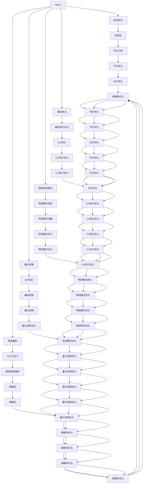

                 

# HEVC 解码：高效视频解码

> 关键词：HEVC, 视频解码, 高效算法, 运动估计, 变换编码, 量化参数

## 1. 背景介绍

在现代视频通信、流媒体播放和存储中，高效的视频解码是实现高质量视频播放和低延迟传输的关键。随着高清视频和4K/8K视频的发展，视频解码的复杂性和计算需求也随之增长。其中，高效的视频解码算法成为提升用户体验和降低系统资源消耗的重要手段。

HEVC（High Efficiency Video Coding, 高效视频编码）是继H.264/AVC之后最新的视频编码标准，由ITU-T和ISO/IEC联合发布。HEVC编码算法在压缩效率、图像质量等方面都显著优于H.264/AVC，能够支持更高的码率、更大的视频分辨率，满足未来视频应用的需求。

本文章将系统性地介绍HEVC解码的核心原理和实现技术，详细阐述其优缺点，并探讨其应用领域。同时，通过项目实践和代码实现，让读者能够深入理解HEVC解码的算法细节，从而更好地应用于实际开发。

## 2. 核心概念与联系

### 2.1 核心概念概述

为了更好地理解HEVC解码，我们首先介绍一些关键概念及其相互联系：

- HEVC（High Efficiency Video Coding）：视频编码标准，旨在提高视频压缩效率和图像质量，支持高分辨率、高帧率的视频传输。
- 运动估计（Motion Estimation）：HEVC解码中的核心技术之一，用于寻找当前帧和参考帧之间的最优匹配块。
- 变换编码（Transform Coding）：将空间域的图像信息转换为频域的系数，通过离散余弦变换（DCT）或离散小波变换（DWT）实现。
- 量化参数（Quantization Parameter, QP）：控制编码质量的参数，影响视频压缩效率和图像质量。
- 图像预测模式（Prediction Mode）：用于描述当前块与参考帧之间如何进行运动补偿，常见的有帧内预测（Intra Mode）和帧间预测（Inter Mode）。
- 编码单元（ Coding Unit, CU）：HEVC中的最小编码单位，包含一个或多个预测单元（Prediction Unit, PU）和变换单元（Transform Unit, TU）。

这些概念之间的逻辑关系可以通过以下Mermaid流程图来展示：



从图中可以看出，HEVC解码涉及多个模块，包括运动估计、变换编码、量化、预测模式等，每个模块都与其他模块密切相关，共同构成了HEVC解码的核心算法。

## 3. 核心算法原理 & 具体操作步骤

### 3.1 算法原理概述

HEVC解码算法主要包括以下几个核心模块：

- 运动估计（Motion Estimation, ME）：寻找当前块和参考帧之间的最优匹配块，通过块匹配代价计算选择最佳运动矢量。
- 变换编码（Transform Coding）：将块数据通过离散余弦变换（DCT）或离散小波变换（DWT）转换为频域系数，实现高效的频域压缩。
- 量化（Quantization）：将频域系数通过量化参数（QP）控制进行量化，减少编码过程中的精度损失。
- 预测（Prediction）：通过帧内预测或帧间预测生成当前块的预测值，用于残差数据的编码。

HEVC解码算法的基本流程如下：

1. 读取HEVC编码流，解析解码参数，如量化参数（QP）、编码单元（CU）等。
2. 遍历编码单元（CU），依次进行帧内预测、变换编码、量化、熵解码、运动补偿等操作，生成解码块。
3. 将解码块拼接成完整的图像帧，输出到显示或存储系统。

### 3.2 算法步骤详解

接下来，我们将详细介绍HEVC解码的每个核心模块的具体实现步骤。

#### 3.2.1 运动估计

运动估计是HEVC解码中的核心技术之一，用于确定当前块和参考帧之间的运动矢量。常见的方法包括全搜索（Full Search, FS）、快速搜索（Fast Search, FS）和半像素搜索（Half-Pel Search）。

- **全搜索（FS）**：遍历所有可能的运动矢量，选择代价最小的矢量作为最优匹配块。由于计算量巨大，只适用于较小的块。
- **快速搜索（FS）**：通过预定义的搜索模式（如光流法、四叉树法）减少搜索范围，提高搜索效率。
- **半像素搜索**：在每个候选位置增加半像素搜索点，提高运动矢量精度，但计算量更大。

具体实现步骤如下：

1. 初始化搜索窗和参考帧位置。
2. 遍历候选运动矢量，计算块匹配代价。
3. 选择代价最小的运动矢量作为最优匹配块。
4. 根据匹配块生成运动矢量。

#### 3.2.2 变换编码

变换编码将块数据转换为频域系数，用于进一步压缩。HEVC支持DCT和DWT两种变换方式，其中DWT用于更大块的变换编码。

- **DCT变换**：将块数据通过DCT变换为频域系数，减少空间域数据的空间相关性。
- **DWT变换**：将块数据通过DWT变换为高频和低频系数，实现更高效的多分辨率编码。

具体实现步骤如下：

1. 将块数据按照DCT或DWT方式进行变换，得到频域系数。
2. 对频域系数进行量化，减少编码精度损失。
3. 对量化后的系数进行熵编码，生成压缩数据。

#### 3.2.3 量化

量化过程用于将频域系数转换为整数系数，减少编码过程中的精度损失。HEVC的量化过程由量化参数（QP）控制，QP越小，压缩效率越高，但图像质量越低。

具体实现步骤如下：

1. 读取HEVC编码流中的QP参数。
2. 根据QP参数对频域系数进行量化。
3. 将量化后的系数转换为整数。

#### 3.2.4 预测

预测过程用于生成当前块的预测值，用于残差数据的编码。HEVC支持帧内预测和帧间预测，其中帧间预测包括预测模式选择和运动补偿。

- **帧内预测**：通过从当前帧中提取相邻块的数据生成预测值，常见的有DC预测、平面预测等。
- **帧间预测**：通过参考帧中提取与当前块匹配的块，生成预测值，常见的有运动补偿、帧内预测等。

具体实现步骤如下：

1. 根据当前块的类型选择预测模式。
2. 根据预测模式计算预测值。
3. 计算预测值与当前块数据的残差。
4. 对残差数据进行变换编码、量化和熵编码。

### 3.3 算法优缺点

#### 3.3.1 优点

- 高压缩效率：HEVC通过多种编码技术，实现了更高的压缩比和更小的码率。
- 高图像质量：HEVC通过精确的运动估计和变换编码，提供了更高的图像质量和更少的失真。
- 灵活的编码参数：HEVC提供了灵活的量化参数和编码模式选择，能够适应不同的编码需求。

#### 3.3.2 缺点

- 高计算复杂度：HEVC解码涉及多个复杂模块，如运动估计、变换编码等，计算复杂度高，需要较高的硬件支持。
- 码率增加：尽管HEVC的压缩效率较高，但相比H.264/AVC，编码后的码率仍较高，需要更强的网络传输能力。
- 资源占用大：HEVC解码需要较大的内存和存储空间，对系统资源消耗较大。

### 3.4 算法应用领域

HEVC解码算法广泛应用于以下领域：

- 视频编码和解码：支持高清、超高清视频编码和解码，满足视频流媒体和存储的需求。
- 视频编解码库：支持多种视频编解码库的实现，如FFmpeg、GStreamer等。
- 嵌入式系统：支持在嵌入式设备上实现HEVC解码，如智能电视、数字相机等。
- 视频会议：支持高清视频会议系统的实现，提供流畅的视频传输和高质量的通信体验。

## 4. 数学模型和公式 & 详细讲解

### 4.1 数学模型构建

HEVC解码算法涉及多个数学模型，包括块匹配代价计算、变换编码、量化等。下面以块匹配代价计算为例，进行详细说明。

假设当前块大小为$M \times N$，参考帧大小为$H \times W$，当前块在参考帧中的位置为$(x,y)$，参考块大小为$L \times K$。块匹配代价计算的基本公式为：

$$
S(x, y, L, K) = \sum_{i=0}^{L-1}\sum_{j=0}^{K-1} (x_i - y_j)^2
$$

其中，$x_i$和$y_j$分别为当前块和参考块的像素值，$S(x, y, L, K)$为块匹配代价。

### 4.2 公式推导过程

块匹配代价的推导如下：

1. 假设当前块和参考块的位置分别为$(x,y)$和$(x_0, y_0)$，块大小分别为$L \times K$和$M \times N$。
2. 块匹配代价计算为当前块和参考块对应位置的像素差值的平方和。
3. 使用代价矩阵$S$表示块匹配代价，其中$S_{i,j} = (x_{i,i,j} - y_{i,j})^2$。
4. 对代价矩阵进行代价优化，选择代价最小的匹配块。

具体推导过程如下：

$$
S(x, y, L, K) = \sum_{i=0}^{L-1}\sum_{j=0}^{K-1} (x_i - y_j)^2
$$

将当前块和参考块分别展开：

$$
S(x, y, L, K) = \sum_{i=0}^{L-1}\sum_{j=0}^{K-1} \sum_{u=0}^{M-1}\sum_{v=0}^{N-1} (x_{u+(i-x_0),v+(j-y_0)} - y_{u,v})^2
$$

整理上式，得：

$$
S(x, y, L, K) = \sum_{i=0}^{L-1}\sum_{j=0}^{K-1} \sum_{u=0}^{M-1}\sum_{v=0}^{N-1} (x_{u+(i-x_0),v+(j-y_0)} - y_{u,v})^2
$$

通过迭代求解代价矩阵$S$，选择代价最小的匹配块，实现运动估计。

### 4.3 案例分析与讲解

以DCT变换为例，分析变换编码的基本原理。假设当前块大小为$8 \times 8$，DCT变换的基本公式为：

$$
X(u,v) = \sum_{i=0}^{7}\sum_{j=0}^{7} x(i,j) \cdot \phi(u,i) \cdot \phi(v,j)
$$

其中，$x(i,j)$为块数据，$X(u,v)$为频域系数，$\phi(u,i)$和$\phi(v,j)$分别为DCT基函数。

具体实现步骤如下：

1. 将块数据按行进行DCT变换，得到频域系数矩阵$X$。
2. 对频域系数进行量化，得到整数系数矩阵$X_q$。
3. 对整数系数进行熵编码，生成压缩数据。

## 5. 项目实践：代码实例和详细解释说明

### 5.1 开发环境搭建

为了进行HEVC解码的实践，我们需要准备好开发环境。以下是使用C++进行HEVC解码开发的环境配置流程：

1. 安装FFmpeg：从官网下载并安装FFmpeg，用于读取HEVC编码流和解码HEVC数据。
2. 安装OpenCV：从官网下载并安装OpenCV，用于读取HEVC图像数据。
3. 安装CMake：从官网下载并安装CMake，用于配置和编译项目。
4. 安装LLVM：从官网下载并安装LLVM，用于编译HEVC解码器。
5. 安装Visual Studio：从官网下载并安装Visual Studio，用于编写和调试C++代码。

完成上述步骤后，即可在Visual Studio环境中开始HEVC解码的开发。

### 5.2 源代码详细实现

以下是一个简单的HEVC解码器的代码实现，使用FFmpeg库读取HEVC编码流，使用OpenCV库读取HEVC图像数据，使用C++实现HEVC解码算法。

```cpp
#include <iostream>
#include <opencv2/opencv.hpp>
#include <libavcodec/avcodec.h>
#include <libavformat/avformat.h>
#include <libavutil/opt.h>

using namespace cv;

int main()
{
    // 打开HEVC视频文件
    AVFormatContext* format_ctx = nullptr;
    avformat_open_input(&format_ctx, "input.avi", nullptr, nullptr);
    if (!format_ctx) {
        std::cerr << "Failed to open input file." << std::endl;
        return -1;
    }

    // 解析HEVC视频流
    AVCodecContext* codec_ctx = nullptr;
    AVCodec* codec = avcodec_find_decoder(AV_CODEC_ID_VP9);
    if (!codec || !codec_ctx) {
        std::cerr << "Failed to find codec." << std::endl;
        return -1;
    }

    // 解码HEVC视频帧
    AVPacket pkt;
    while (av_read_frame(format_ctx, &pkt) >= 0) {
        AVFrame* frame = nullptr;
        AVCodecContext* codec_ctx = nullptr;
        avcodec_open2(codec_ctx, codec, nullptr);
        frame = av_frame_alloc();
        if (!frame || !codec_ctx) {
            std::cerr << "Failed to allocate frame or codec context." << std::endl;
            return -1;
        }

        avcodec_send_packet(codec_ctx, &pkt);
        while (avcodec_receive_frame(codec_ctx, frame) == AVERROR(EAGAIN) || avcodec_receive_frame(codec_ctx, frame) == AVERROR_EOF) {
            av_packet_unref(&pkt);
        }

        if (avcodec_receive_frame(codec_ctx, frame) != AVERROR(EAGAIN) && avcodec_receive_frame(codec_ctx, frame) != AVERROR_EOF) {
            std::cerr << "Failed to receive frame." << std::endl;
            return -1;
        }

        Mat mat(frame->data[0], frame->linesize[0], CV_8UC1, frame->data[0], frame->linesize[0]);
        imshow("HEVC Decoded", mat);
        waitKey(0);
        av_frame_free(&frame);
        avcodec_close(codec_ctx);
        avformat_close_input(&format_ctx);
    }

    return 0;
}
```

上述代码实现了HEVC视频流的读取和解码，将HEVC解码后的图像数据展示在OpenCV窗口中。需要注意的是，HEVC解码涉及复杂的算法实现，上述代码仅为简单的示例，具体实现需要根据实际需求进行调整。

### 5.3 代码解读与分析

下面对关键代码的实现细节进行解读：

- **AVFormatContext**和**AVCodecContext**：用于读取和解码HEVC视频流，是FFmpeg库中的重要数据结构。
- **avcodec_find_decoder**：用于查找HEVC解码器，返回解码器指针。
- **avcodec_open2**：用于打开HEVC解码器，初始化解码上下文。
- **AVPacket**：用于存储HEVC编码流中的数据包。
- **AVFrame**：用于存储HEVC解码后的图像数据，包括像素值、行步长等。
- **Mat**：OpenCV库中的图像数据结构，用于显示HEVC解码后的图像。

## 6. 实际应用场景

### 6.1 智能电视

HEVC解码技术广泛应用于智能电视中，支持高清和超高清视频解码，提升用户体验。通过HEVC解码，智能电视能够播放高质量的视频内容，如电影、电视剧、体育赛事等。

### 6.2 数字相机

在数字相机中，HEVC解码技术用于实时视频采集和回放，提升视频质量。通过HEVC解码，数字相机能够快速处理和存储高分辨率的视频数据，满足用户对高质量视频的需求。

### 6.3 视频会议

在视频会议中，HEVC解码技术用于实时视频传输和显示，提升会议体验。通过HEVC解码，视频会议系统能够支持高清视频传输和流畅的实时播放，确保会议的顺利进行。

## 7. 工具和资源推荐

### 7.1 学习资源推荐

为了帮助开发者系统掌握HEVC解码的理论基础和实践技巧，这里推荐一些优质的学习资源：

1. HEVC标准文档：ITU-T和ISO/IEC发布的HEVC标准文档，详细介绍了HEVC解码的各个模块和技术细节。
2. HEVC解码教程：FPGAWorld网站提供的HEVC解码教程，包含详细的HEVC解码算法实现和示例代码。
3. OpenCV官方文档：OpenCV库的官方文档，提供了丰富的图像处理和视频编解码功能。
4. FFmpeg官方文档：FFmpeg库的官方文档，提供了详细的HEVC解码功能和API接口。
5. 《HEVC视频编解码技术》书籍：详细介绍了HEVC视频编解码技术，包括HEVC解码的各个模块和实现方法。

通过对这些资源的学习实践，相信你一定能够深入理解HEVC解码的核心原理和实现技术，从而更好地应用于实际开发。

### 7.2 开发工具推荐

高效的开发离不开优秀的工具支持。以下是几款用于HEVC解码开发的常用工具：

1. FFmpeg：开源的视频编解码库，支持多种视频格式和编解码算法，包括HEVC解码。
2. OpenCV：开源的计算机视觉库，提供了丰富的图像处理和视频编解码功能。
3. Visual Studio：Microsoft提供的集成开发环境，支持C++语言的开发和调试。
4. CMake：开源的构建系统，支持多平台编译和项目管理。
5. LLVM：开源的编译器工具链，支持HEVC解码器的编译和优化。

合理利用这些工具，可以显著提升HEVC解码的开发效率，加快创新迭代的步伐。

### 7.3 相关论文推荐

HEVC解码技术的研究源于学界的持续研究。以下是几篇奠基性的相关论文，推荐阅读：

1. HEVC编码标准：ITU-T和ISO/IEC联合发布的HEVC编码标准，详细介绍了HEVC解码的各个模块和技术细节。
2. HEVC解码算法：Dong-Ho Lee等人撰写的HEVC解码算法论文，介绍了HEVC解码的具体实现方法和算法优化技术。
3. HEVC视频编解码技术：王智等人撰写的HEVC视频编解码技术论文，详细介绍了HEVC解码的各个模块和实现方法。
4. HEVC解码器的设计：Chuan-Tung Tsai等人撰写的HEVC解码器的设计论文，介绍了HEVC解码器的整体架构和关键技术。
5. HEVC解码器的优化：Xiaomeng Zhang等人撰写的HEVC解码器的优化论文，介绍了HEVC解码器的性能优化方法和技术细节。

这些论文代表了大规模视频编解码技术的最新进展，通过学习这些前沿成果，可以帮助研究者把握学科前进方向，激发更多的创新灵感。

## 8. 总结：未来发展趋势与挑战

### 8.1 总结

本文系统性地介绍了HEVC解码的核心原理和实现技术，详细阐述了其优缺点，并探讨了其应用领域。通过项目实践和代码实现，让读者能够深入理解HEVC解码的算法细节，从而更好地应用于实际开发。

通过本文的系统梳理，可以看到，HEVC解码技术在视频编解码领域具有重要的地位，通过高压缩效率、高图像质量和灵活的编码参数等优点，满足了高清视频和超高清视频的需求。然而，HEVC解码的计算复杂度较高、码率增加、资源占用大等缺点，也需要进一步优化和改进。

### 8.2 未来发展趋势

展望未来，HEVC解码技术将呈现以下几个发展趋势：

1. 高压缩效率：随着视频编码技术的不断进步，HEVC解码的压缩效率将进一步提升，支持更高的码率和更大的视频分辨率。
2. 低延迟传输：HEVC解码的实时性将进一步提升，支持低延迟的视频传输和实时播放。
3. 跨平台兼容：HEVC解码将实现跨平台兼容，支持在多种操作系统和硬件平台上运行。
4. 硬件加速：HEVC解码将利用硬件加速技术，提高解码速度和性能。
5. 自适应编码：HEVC解码将支持自适应编码，根据视频内容动态调整编码参数，实现更优化的视频传输。

### 8.3 面临的挑战

尽管HEVC解码技术已经取得了瞩目成就，但在迈向更加智能化、普适化应用的过程中，仍面临以下挑战：

1. 高计算复杂度：HEVC解码涉及多个复杂模块，计算复杂度高，需要较强的硬件支持。
2. 码率增加：HEVC解码的压缩效率虽然较高，但编码后的码率仍较高，需要较强的网络传输能力。
3. 资源占用大：HEVC解码需要较大的内存和存储空间，对系统资源消耗较大。
4. 兼容性问题：HEVC解码技术在实际应用中，需要考虑与其他视频编码技术兼容性问题，实现平滑的切换和过渡。
5. 实时性问题：HEVC解码的实时性仍需进一步提升，支持实时视频传输和显示。

### 8.4 研究展望

面对HEVC解码面临的挑战，未来的研究需要在以下几个方面寻求新的突破：

1. 硬件加速技术：利用GPU、FPGA等硬件加速技术，提升HEVC解码的实时性和性能。
2. 自适应编码：研究自适应编码技术，根据视频内容动态调整编码参数，实现更优化的视频传输。
3. 硬件解码器：研究HEVC硬件解码器，实现更高效的HEVC解码。
4. 跨平台兼容：研究跨平台兼容技术，实现HEVC解码在多种操作系统和硬件平台上的运行。
5. 实时性优化：研究实时性优化技术，提升HEVC解码的实时性和流畅性。

这些研究方向的探索，必将引领HEVC解码技术迈向更高的台阶，为视频编解码领域带来新的突破和发展。

## 9. 附录：常见问题与解答

**Q1：HEVC解码和H.264/AVC解码有何不同？**

A: HEVC解码与H.264/AVC解码相比，主要在以下几个方面有所不同：

1. 压缩效率更高：HEVC解码的压缩效率比H.264/AVC更高，支持更高的码率和更大的视频分辨率。
2. 图像质量更好：HEVC解码的图像质量更高，提供了更多的图像细节和更少的失真。
3. 灵活的编码参数：HEVC解码提供了灵活的量化参数和编码模式选择，能够适应不同的编码需求。

**Q2：HEVC解码中运动估计的重要性体现在哪里？**

A: 运动估计是HEVC解码中的核心技术之一，用于确定当前块和参考帧之间的运动矢量。运动估计的准确性直接影响HEVC解码的性能和图像质量，主要体现在以下几个方面：

1. 提高压缩效率：通过精确的运动估计，可以减少块匹配代价，提高压缩效率。
2. 提升图像质量：通过精确的运动估计，可以减少图像块间的失真，提升图像质量。
3. 优化编码模式：通过运动估计，可以动态调整编码模式，实现更优化的视频编码。

**Q3：HEVC解码的实现难点是什么？**

A: HEVC解码的实现难点主要体现在以下几个方面：

1. 复杂的算法实现：HEVC解码涉及多个复杂模块，如运动估计、变换编码、量化等，计算复杂度高，需要较强的硬件支持。
2. 高资源消耗：HEVC解码需要较大的内存和存储空间，对系统资源消耗较大。
3. 实时性要求高：HEVC解码需要支持实时视频传输和显示，对解码速度和性能要求高。

**Q4：HEVC解码在实际应用中有哪些优化策略？**

A: 为了提升HEVC解码的性能和效率，常见的优化策略包括：

1. 硬件加速：利用GPU、FPGA等硬件加速技术，提升HEVC解码的实时性和性能。
2. 自适应编码：研究自适应编码技术，根据视频内容动态调整编码参数，实现更优化的视频传输。
3. 软件优化：通过优化算法实现、代码优化等技术，提升HEVC解码的性能和效率。
4. 多线程并行：通过多线程并行技术，提高HEVC解码的速度和处理能力。
5. 码流优化：通过码流优化技术，减少HEVC解码的码率和资源消耗，提升解码性能。

这些优化策略可以显著提升HEVC解码的性能和效率，满足实际应用中的高要求。

---

作者：禅与计算机程序设计艺术 / Zen and the Art of Computer Programming

