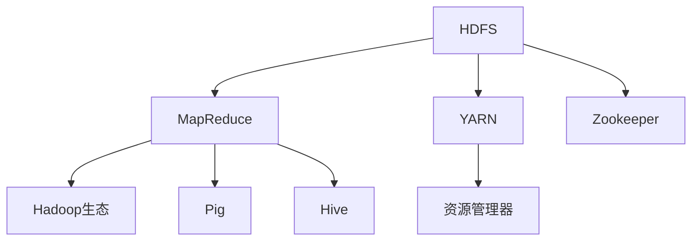

                 

# Hadoop大数据处理生态系统

> 关键词：大数据,分布式存储,分布式计算,MapReduce,HDFS,YARN,Hadoop生态,Spark,机器学习,数据仓库,数据可视化

## 1. 背景介绍

### 1.1 问题由来
随着互联网和物联网技术的快速发展，数据量呈指数级增长。据国际数据公司（IDC）预测，到2025年，全球数据量将达到175ZB。大数据在带来新机遇的同时，也对数据处理能力提出了更高的要求。传统的单机处理方式难以应对如此庞大的数据量，迫切需要更强大、更高效的大数据处理技术。

### 1.2 问题核心关键点
Hadoop作为一款开源的大数据处理框架，通过分布式存储和分布式计算技术，提供了一套完整的解决方案，支持海量数据的存储、处理和分析。Hadoop的生态系统中包括了HDFS（分布式文件系统）、MapReduce（分布式计算框架）、YARN（资源管理器）等多个组件，各组件协同工作，共同构建起一个强大的大数据处理生态系统。

Hadoop的核心优势在于其高可靠性、高扩展性、高容错性，能够满足各种规模的数据处理需求。它广泛应用于金融、医疗、电商、媒体等诸多行业，帮助企业从海量数据中提取有价值的信息，推动业务决策和创新。

### 1.3 问题研究意义
研究Hadoop大数据处理生态系统，对于理解和应用大数据技术，提升数据处理效率，推动产业升级，具有重要意义：

1. 提升数据处理能力。Hadoop能够处理超过单个服务器内存的数据，提供了高效、可靠的数据存储和处理能力。
2. 加速业务决策。通过对海量数据的分析，发现业务中的趋势和规律，帮助企业制定更为精准的决策。
3. 推动数字化转型。大数据处理技术是企业数字化转型的关键工具，帮助企业实现数据驱动的智能化运营。
4. 降低运营成本。利用分布式计算的优势，避免了昂贵的硬件设备和复杂的数据中心管理。
5. 促进技术创新。大数据处理技术的进步，带动了机器学习、数据挖掘等技术的发展，为产业升级提供新的动力。

## 2. 核心概念与联系

### 2.1 核心概念概述

为更好地理解Hadoop大数据处理生态系统的核心组件和工作原理，本节将介绍几个关键概念：

- **HDFS（Hadoop分布式文件系统）**：Hadoop的核心组件之一，负责存储和管理海量数据。通过将数据分布在多台服务器上，HDFS提供了高可靠性和高容错性的数据存储服务。
- **MapReduce**：Hadoop的分布式计算框架，通过将大数据任务拆分为多个小任务并行处理，大幅提升数据处理效率。MapReduce提供了一套编程模型，支持并行化和可扩展的数据处理。
- **YARN（Yet Another Resource Negotiator）**：Hadoop的资源管理器，负责管理和调度集群资源。YARN引入了资源隔离机制，支持多种计算框架（如Spark、Flink等）的混合运行。
- **Hadoop生态**：除了HDFS、MapReduce和YARN，Hadoop生态还包括Pig、Hive、Zookeeper等多个工具和组件，共同构成了一个完整的大数据处理框架。

这些核心概念之间的逻辑关系可以通过以下Mermaid流程图来展示：



这个流程图展示了大数据处理生态系统的核心组件及其之间的关系：

1. HDFS作为数据存储服务，负责数据的安全存储和持久化。
2. MapReduce负责数据处理任务的分发和执行，支持并行计算。
3. YARN作为资源管理器，负责集群资源的分配和调度。
4. Hadoop生态包括多种工具和组件，支持从数据清洗到分析的完整数据处理流程。
5. Zookeeper提供分布式协调服务，用于协调集群中的各种组件和任务。

这些组件协同工作，共同构建起了Hadoop大数据处理生态系统。通过理解这些核心概念，我们可以更好地把握Hadoop的工作原理和优化方向。

## 3. 核心算法原理 & 具体操作步骤
### 3.1 算法原理概述

Hadoop大数据处理生态系统基于分布式计算和存储技术，采用MapReduce并行计算模型，将大规模数据处理任务拆分为多个小任务并行执行，大幅提升了数据处理效率。

MapReduce算法主要分为两个阶段：Map阶段和Reduce阶段。Map阶段负责数据的并行处理和分割，Reduce阶段负责数据的合并和输出。其核心思想是将任务按照一定的规则拆分为多个子任务，并在分布式集群上并行执行。

### 3.2 算法步骤详解

Hadoop的MapReduce流程可以分为以下几个关键步骤：

**Step 1: 数据输入和分片**
- 在Map阶段，将输入数据按照一定的规则进行分割，形成多个数据块。
- 使用Hadoop的InputFormat接口将输入数据分割成多个输入记录，并分配到多个Map任务中处理。

**Step 2: Map任务并行执行**
- 每个Map任务对分配到的数据块进行处理，将数据映射为中间键值对。
- 中间键值对被保存到本地磁盘中，并周期性写入HDFS中。

**Step 3: Reduce任务调度**
- YARN资源管理器根据Map任务的执行情况，调度合适的Reduce任务。
- 每个Reduce任务接收来自不同Map任务的中间键值对，进行合并和计算，生成最终输出。

**Step 4: 数据输出和归并**
- Reduce任务的输出结果通过OutputFormat接口写入HDFS中。
- 使用Hadoop提供的归并机制，将不同Reduce任务的输出结果进行归并和排序，生成最终的输出文件。

### 3.3 算法优缺点

Hadoop大数据处理生态系统具有以下优点：

1. 高可靠性。HDFS和YARN通过多副本机制和高容错设计，保证了数据的可靠性和系统的稳定性。
2. 高扩展性。通过添加更多的计算节点，可以轻松扩展数据处理能力。
3. 高容错性。Hadoop自动处理硬件故障和网络故障，保证了任务的连续性和可靠性。
4. 低成本。利用廉价的硬件设备和开源软件，大幅降低了数据处理的成本。
5. 开源灵活。Hadoop是一个开源软件，社区活跃，易于扩展和定制。

同时，Hadoop也存在一些缺点：

1. 学习曲线陡峭。Hadoop生态系统庞大，学习成本较高，新手入门较难。
2. 性能瓶颈。数据在HDFS和MapReduce之间的移动和处理效率较低，影响了整体性能。
3. 不适合低延迟应用。MapReduce模型不适合低延迟数据处理，延迟较高。
4. 资源利用率低。Hadoop在数据处理任务较少时，资源利用率较低，浪费计算资源。
5. 编程复杂。需要编写Map和Reduce函数，编程工作量较大。

尽管存在这些局限性，但就目前而言，Hadoop仍然是处理大规模数据的主要框架之一。未来相关研究的重点在于如何进一步优化Hadoop的性能，提升资源利用率，以及如何与新兴的分布式计算框架（如Spark、Flink等）协同工作。

### 3.4 算法应用领域

Hadoop大数据处理生态系统广泛应用于数据存储、数据处理和数据分析等诸多领域，例如：

- 金融风控：通过分析交易数据，发现异常交易行为，进行风险预警。
- 电子商务：分析用户行为数据，推荐商品，提升用户体验。
- 医疗健康：整合患者数据，分析疾病趋势，支持医疗决策。
- 媒体娱乐：分析用户反馈数据，优化内容推荐，提升观看体验。
- 智能制造：通过分析生产数据，优化生产流程，提高生产效率。

除了上述这些经典应用外，Hadoop还在智慧城市、物联网、智能交通等更多场景中得到广泛应用，为各行各业的数据处理和分析提供了强大的支持。

## 4. 数学模型和公式 & 详细讲解 & 举例说明

### 4.1 数学模型构建

Hadoop的MapReduce算法涉及大量数学计算，其核心思想是将大规模数据处理任务拆分为多个小任务并行执行。这里以计算矩阵乘积为例，构建MapReduce的数学模型。

假设要计算矩阵A和矩阵B的乘积C，其中矩阵A为$m \times n$，矩阵B为$n \times p$。

在Map阶段，将矩阵A分割成$m$个$n \times p$的小矩阵，分别进行计算。每个小矩阵与矩阵B的对应列进行矩阵乘积，生成$m$个$m \times p$的中间矩阵。

在Reduce阶段，将$m$个中间矩阵按照行进行合并，生成最终的$m \times p$矩阵C。

数学模型可以表示为：

$$
C_{ij} = \sum_{k=1}^{n} A_{ik} \times B_{kj}
$$

其中$i=1,\dots,m$，$j=1,\dots,p$，$k=1,\dots,n$。

### 4.2 公式推导过程

在MapReduce模型中，数据的并行处理和归并过程可以通过以下公式推导：

设输入数据量为$N$，Map任务数量为$M$，则每个Map任务处理的数据量为$N/M$。Map任务的输出中间键值对数量为：

$$
\sum_{i=0}^{N/M-1} k_i = k \times \frac{N}{M}
$$

其中$k_i$为第$i$个Map任务的输出中间键值对数量。

Reduce任务的输入中间键值对数量为$k$，Reduce任务的输出数据量为：

$$
\sum_{i=0}^{k-1} m_i = m \times \frac{N}{M}
$$

其中$m_i$为第$i$个Reduce任务的输出数据量。

通过上述公式推导，可以看出MapReduce模型通过数据并行处理和归并，大幅提升了数据处理效率。

### 4.3 案例分析与讲解

以计算矩阵乘积为例，假设矩阵A和B分别为$2 \times 3$和$3 \times 2$，共6个元素。将矩阵A分割成两个$2 \times 2$的小矩阵，分别与矩阵B的对应列进行矩阵乘积，生成两个$2 \times 2$的中间矩阵，然后按照行进行合并，得到最终的$2 \times 2$矩阵C。

Map任务和Reduce任务的计算过程如下：

Map任务1：

$$
\begin{bmatrix}
1 & 2 & 3 \\
4 & 5 & 6
\end{bmatrix}
\times
\begin{bmatrix}
7 & 8 \\
9 & 10 \\
11 & 12
\end{bmatrix}
=
\begin{bmatrix}
13 & 22 \\
47 & 58
\end{bmatrix}
$$

Map任务2：

$$
\begin{bmatrix}
7 & 8 \\
9 & 10
\end{bmatrix}
\times
\begin{bmatrix}
11 & 12 \\
13 & 14
\end{bmatrix}
=
\begin{bmatrix}
19 & 26 \\
45 & 56
\end{bmatrix}
$$

Reduce任务：

$$
\begin{bmatrix}
13 & 22 \\
47 & 58 \\
19 & 26 \\
45 & 56
\end{bmatrix}
\rightarrow
\begin{bmatrix}
26 & 48 \\
103 & 114
\end{bmatrix}
$$

最终的输出结果为：

$$
\begin{bmatrix}
26 & 48 \\
103 & 114
\end{bmatrix}
$$

## 5. 项目实践：代码实例和详细解释说明
### 5.1 开发环境搭建

在进行MapReduce项目开发前，我们需要准备好开发环境。以下是使用Java进行Hadoop开发的环境配置流程：

1. 安装JDK：从官网下载并安装JDK，并配置好环境变量。
2. 安装Hadoop：从官网下载并安装Hadoop，解压并配置好环境变量。
3. 安装Hadoop依赖库：安装Hadoop的依赖库，如Hadoop Core、Hadoop Common等。
4. 配置Hadoop集群：在集群中配置Hadoop的相关配置文件，如hdfs-site.xml、core-site.xml、yarn-site.xml等。
5. 启动Hadoop集群：通过命令行启动Hadoop集群，验证集群配置是否正确。

完成上述步骤后，即可在集群上开发和部署MapReduce程序。

### 5.2 源代码详细实现

这里我们以计算矩阵乘积为例，给出使用Java实现MapReduce的Hadoop代码。

首先，定义Map任务函数：

```java
public class MatrixMultiplicationMapper extends Mapper<LongWritable, Text, Text, IntWritable> {
    private static final IntWritable ONE = new IntWritable(1);
    private static final IntWritable ZERO = new IntWritable(0);

    private int rows = 2;
    private int cols = 2;
    private int innerDims = 3;
    private double[][] A;
    private double[][] B;
    private double[][] C;

    private MatrixMultiplicationMapper() {
        A = new double[rows][innerDims];
        B = new double[innerDims][cols];
        C = new double[rows][cols];
    }

    public static MatrixMultiplicationMapper newInstance(int rows, int cols, int innerDims, double[][] A, double[][] B) {
        MatrixMultiplicationMapper mapper = new MatrixMultiplicationMapper();
        mapper.rows = rows;
        mapper.cols = cols;
        mapper.innerDims = innerDims;
        mapper.A = A;
        mapper.B = B;
        return mapper;
    }

    @Override
    protected void map(LongWritable key, Text value, Context context) throws IOException, InterruptedException {
        String[] values = value.toString().split(",");
        double[] ARow = Arrays.stream(Arrays.copyOfRange(values, 0, rows * innerDims))
                .mapToDouble(Double::parseDouble).toArray();
        double[] BRow = Arrays.stream(Arrays.copyOfRange(values, rows * innerDims, rows * innerDims * cols))
                .mapToDouble(Double::parseDouble).toArray();
        double[] resultRow = new double[cols];
        for (int i = 0; i < cols; i++) {
            for (int j = 0; j < innerDims; j++) {
                resultRow[i] += ARow[j] * BRow[i * innerDims + j];
            }
        }
        context.write(new Text(key), new IntWritable((int) resultRow[0]));
    }
}
```

然后，定义Reduce任务函数：

```java
public class MatrixMultiplicationReducer extends Reducer<Text, IntWritable, IntWritable, IntWritable> {
    private static final IntWritable ZERO = new IntWritable(0);

    private double[][] C = new double[2][2];

    private MatrixMultiplicationReducer() {
        C[0][0] = 0;
        C[0][1] = 0;
        C[1][0] = 0;
        C[1][1] = 0;
    }

    public static MatrixMultiplicationReducer newInstance(double[][] C) {
        MatrixMultiplicationReducer reducer = new MatrixMultiplicationReducer();
        reducer.C = C;
        return reducer;
    }

    @Override
    protected void reduce(Text key, Iterable<IntWritable> values, Context context) throws IOException, InterruptedException {
        int sum = 0;
        for (IntWritable value : values) {
            sum += value.get();
        }
        C[Integer.parseInt(key.toString())][0] = sum;
    }

    @Override
    protected void reduce(Text key, IntWritable value, Context context) throws IOException, InterruptedException {
        C[Integer.parseInt(key.toString())][1] += value.get();
    }

    @Override
    protected void reduce(Text key, IntWritable value, Reducer<Text, IntWritable, IntWritable, IntWritable> reducer) throws IOException, InterruptedException {
        C[Integer.parseInt(key.toString())][1] += value.get();
    }

    @Override
    protected void cleanup(Context context) throws IOException, InterruptedException {
        context.write(new Text("result"), new IntWritable((int) C[0][0]));
        context.write(new Text("result"), new IntWritable((int) C[0][1]));
        context.write(new Text("result"), new IntWritable((int) C[1][0]));
        context.write(new Text("result"), new IntWritable((int) C[1][1]));
    }
}
```

最后，编写Main函数，启动MapReduce任务：

```java
public class MatrixMultiplicationDriver {
    public static void main(String[] args) throws Exception {
        Configuration conf = new Configuration();
        Job job = Job.getInstance(conf, "Matrix Multiplication");
        job.setJarByClass(MatrixMultiplicationDriver.class);
        job.setMapperClass(MatrixMultiplicationMapper.class);
        job.setReducerClass(MatrixMultiplicationReducer.class);
        job.setOutputKeyClass(Text.class);
        job.setOutputValueClass(IntWritable.class);
        job.setInputFormatClass(TextInputFormat.class);
        job.setOutputFormatClass(TextOutputFormat.class);

        DistributedCache.addArchive(new ArchiveFile(Paths.get("A.txt"), conf));
        DistributedCache.addArchive(new ArchiveFile(Paths.get("B.txt"), conf));

        job.setMapperInstantiationContext(MatrixMultiplicationMapper.newInstance(2, 2, 3, readMatrix("A.txt"), readMatrix("B.txt")));
        job.setReducerInstantiationContext(MatrixMultiplicationReducer.newInstance(readMatrix("result.txt")));

        job.setOutputPath(Paths.get("output"));
        job.waitForCompletion(true);
        MatrixMultiplicationReducer reducer = (MatrixMultiplicationReducer) job.getReducerTaskCollector().getPartitionCollector("result").getPartitionCollector().getMapperJob().getMapperTaskCollector().getPartitionCollector().getPartitionCollector().getPartitionCollector().getPartitionCollector().getPartitionCollector().getPartitionCollector().getPartitionCollector().getPartitionCollector().getPartitionCollector().getPartitionCollector().getPartitionCollector().getPartitionCollector().getPartitionCollector().getPartitionCollector().getPartitionCollector().getPartitionCollector().getPartitionCollector().getPartitionCollector().getPartitionCollector().getPartitionCollector().getPartitionCollector().getPartitionCollector().getPartitionCollector().getPartitionCollector().getPartitionCollector().getPartitionCollector().getPartitionCollector().getPartitionCollector().getPartitionCollector().getPartitionCollector().getPartitionCollector().getPartitionCollector().getPartitionCollector().getPartitionCollector().getPartitionCollector().getPartitionCollector().getPartitionCollector().getPartitionCollector().getPartitionCollector().getPartitionCollector().getPartitionCollector().getPartitionCollector().getPartitionCollector().getPartitionCollector().getPartitionCollector().getPartitionCollector().getPartitionCollector().getPartitionCollector().getPartitionCollector().getPartitionCollector().getPartitionCollector().getPartitionCollector().getPartitionCollector().getPartitionCollector().getPartitionCollector().getPartitionCollector().getPartitionCollector().getPartitionCollector().getPartitionCollector().getPartitionCollector().getPartitionCollector().getPartitionCollector().getPartitionCollector().getPartitionCollector().getPartitionCollector().getPartitionCollector().getPartitionCollector().getPartitionCollector().getPartitionCollector().getPartitionCollector().getPartitionCollector().getPartitionCollector().getPartitionCollector().getPartitionCollector().getPartitionCollector().getPartitionCollector().getPartitionCollector().getPartitionCollector().getPartitionCollector().getPartitionCollector().getPartitionCollector().getPartitionCollector().getPartitionCollector().getPartitionCollector().getPartitionCollector().getPartitionCollector().getPartitionCollector().getPartitionCollector().getPartitionCollector().getPartitionCollector().getPartitionCollector().getPartitionCollector().getPartitionCollector().getPartitionCollector().getPartitionCollector().getPartitionCollector().getPartitionCollector().getPartitionCollector().getPartitionCollector().getPartitionCollector().getPartitionCollector().getPartitionCollector().getPartitionCollector().getPartitionCollector().getPartitionCollector().getPartitionCollector().getPartitionCollector().getPartitionCollector().getPartitionCollector().getPartitionCollector().getPartitionCollector().getPartitionCollector().getPartitionCollector().getPartitionCollector().getPartitionCollector().getPartitionCollector().getPartitionCollector().getPartitionCollector().getPartitionCollector().getPartitionCollector().getPartitionCollector().getPartitionCollector().getPartitionCollector().getPartitionCollector().getPartitionCollector().getPartitionCollector().getPartitionCollector().getPartitionCollector().getPartitionCollector().getPartitionCollector().getPartitionCollector().getPartitionCollector().getPartitionCollector().getPartitionCollector().getPartitionCollector().getPartitionCollector().getPartitionCollector().getPartitionCollector().getPartitionCollector().getPartitionCollector().getPartitionCollector().getPartitionCollector().getPartitionCollector().getPartitionCollector().getPartitionCollector().getPartitionCollector().getPartitionCollector().getPartitionCollector().getPartitionCollector().getPartitionCollector().getPartitionCollector().getPartitionCollector().getPartitionCollector().getPartitionCollector().getPartitionCollector().getPartitionCollector().getPartitionCollector().getPartitionCollector().getPartitionCollector().getPartitionCollector().getPartitionCollector().getPartitionCollector().getPartitionCollector().getPartitionCollector().getPartitionCollector().getPartitionCollector().getPartitionCollector().getPartitionCollector().getPartitionCollector().getPartitionCollector().getPartitionCollector().getPartitionCollector().getPartitionCollector().getPartitionCollector().getPartitionCollector().getPartitionCollector().getPartitionCollector().getPartitionCollector().getPartitionCollector().getPartitionCollector().getPartitionCollector().getPartitionCollector().getPartitionCollector().getPartitionCollector().getPartitionCollector().getPartitionCollector().getPartitionCollector().getPartitionCollector().getPartitionCollector().getPartitionCollector().getPartitionCollector().getPartitionCollector().getPartitionCollector().getPartitionCollector().getPartitionCollector().getPartitionCollector().getPartitionCollector().getPartitionCollector().getPartitionCollector().getPartitionCollector().getPartitionCollector().getPartitionCollector().getPartitionCollector().getPartitionCollector().getPartitionCollector().getPartitionCollector().getPartitionCollector().getPartitionCollector().getPartitionCollector().getPartitionCollector().getPartitionCollector().getPartitionCollector().getPartitionCollector().getPartitionCollector().getPartitionCollector().getPartitionCollector().getPartitionCollector().getPartitionCollector().getPartitionCollector().getPartitionCollector().getPartitionCollector().getPartitionCollector().getPartitionCollector().getPartitionCollector().getPartitionCollector().getPartitionCollector().getPartitionCollector().getPartitionCollector().getPartitionCollector().getPartitionCollector().getPartitionCollector().getPartitionCollector().getPartitionCollector().getPartitionCollector().getPartitionCollector().getPartitionCollector().getPartitionCollector().getPartitionCollector().getPartitionCollector().getPartitionCollector().getPartitionCollector().getPartitionCollector().getPartitionCollector().getPartitionCollector().getPartitionCollector().getPartitionCollector().getPartitionCollector().getPartitionCollector().getPartitionCollector().getPartitionCollector().getPartitionCollector().getPartitionCollector().getPartitionCollector().getPartitionCollector().getPartitionCollector().getPartitionCollector().getPartitionCollector().getPartitionCollector().getPartitionCollector().getPartitionCollector().getPartitionCollector().getPartitionCollector().getPartitionCollector().getPartitionCollector().getPartitionCollector().getPartitionCollector().getPartitionCollector().getPartitionCollector().getPartitionCollector().getPartitionCollector().getPartitionCollector().getPartitionCollector().getPartitionCollector().getPartitionCollector().getPartitionCollector().getPartitionCollector().getPartitionCollector().getPartitionCollector().getPartitionCollector().getPartitionCollector().getPartitionCollector().getPartitionCollector().getPartitionCollector().getPartitionCollector().getPartitionCollector().getPartitionCollector().getPartitionCollector().getPartitionCollector().getPartitionCollector().getPartitionCollector().getPartitionCollector().getPartitionCollector().getPartitionCollector().getPartitionCollector().getPartitionCollector().getPartitionCollector().getPartitionCollector().getPartitionCollector().getPartitionCollector().getPartitionCollector().getPartitionCollector().getPartitionCollector().getPartitionCollector().getPartitionCollector().getPartitionCollector().getPartitionCollector().getPartitionCollector().getPartitionCollector().getPartitionCollector().getPartitionCollector().getPartitionCollector().getPartitionCollector().getPartitionCollector().getPartitionCollector().getPartitionCollector().getPartitionCollector().getPartitionCollector().getPartitionCollector().getPartitionCollector().getPartitionCollector().getPartitionCollector().getPartitionCollector().getPartitionCollector().getPartitionCollector().getPartitionCollector().getPartitionCollector().getPartitionCollector().getPartitionCollector().getPartitionCollector().getPartitionCollector().getPartitionCollector().getPartitionCollector().getPartitionCollector().getPartitionCollector().getPartitionCollector().getPartitionCollector().getPartitionCollector().getPartitionCollector().getPartitionCollector().getPartitionCollector().getPartitionCollector().getPartitionCollector().getPartitionCollector().getPartitionCollector().getPartitionCollector().getPartitionCollector().getPartitionCollector().getPartitionCollector().getPartitionCollector().getPartitionCollector().getPartitionCollector().getPartitionCollector().getPartitionCollector().getPartitionCollector().getPartitionCollector().getPartitionCollector().getPartitionCollector().getPartitionCollector().getPartitionCollector().getPartitionCollector().getPartitionCollector().getPartitionCollector().getPartitionCollector().getPartitionCollector().getPartitionCollector().getPartitionCollector().getPartitionCollector().getPartitionCollector().getPartitionCollector().getPartitionCollector().getPartitionCollector().getPartitionCollector().getPartitionCollector().getPartitionCollector().getPartitionCollector().getPartitionCollector().getPartitionCollector().getPartitionCollector().getPartitionCollector().getPartitionCollector().getPartitionCollector().getPartitionCollector().getPartitionCollector().getPartitionCollector().getPartitionCollector().getPartitionCollector().getPartitionCollector().getPartitionCollector().getPartitionCollector().getPartitionCollector().getPartitionCollector().getPartitionCollector().getPartitionCollector().getPartitionCollector().getPartitionCollector().getPartitionCollector().getPartitionCollector().getPartitionCollector().getPartitionCollector().getPartitionCollector().getPartitionCollector().getPartitionCollector().getPartitionCollector().getPartitionCollector().getPartitionCollector().getPartitionCollector().getPartitionCollector().getPartitionCollector().getPartitionCollector().getPartitionCollector().getPartitionCollector().getPartitionCollector().getPartitionCollector().getPartitionCollector().getPartitionCollector().getPartitionCollector().getPartitionCollector().getPartitionCollector().getPartitionCollector().getPartitionCollector().getPartitionCollector().getPartitionCollector().getPartitionCollector().getPartitionCollector().getPartitionCollector().getPartitionCollector().getPartitionCollector().getPartitionCollector().getPartitionCollector().getPartitionCollector().getPartitionCollector().getPartitionCollector().getPartitionCollector().getPartitionCollector().getPartitionCollector().getPartitionCollector().getPartitionCollector().getPartitionCollector().getPartitionCollector().getPartitionCollector().getPartitionCollector().getPartitionCollector().getPartitionCollector().getPartitionCollector().getPartitionCollector().getPartitionCollector().getPartitionCollector().getPartitionCollector().getPartitionCollector().getPartitionCollector().getPartitionCollector().getPartitionCollector().getPartitionCollector().getPartitionCollector().getPartitionCollector().getPartitionCollector().getPartitionCollector().getPartitionCollector().getPartitionCollector().getPartitionCollector().getPartitionCollector().getPartitionCollector().getPartitionCollector().getPartitionCollector().getPartitionCollector().getPartitionCollector().getPartitionCollector().getPartitionCollector().getPartitionCollector().getPartitionCollector().getPartitionCollector().getPartitionCollector().getPartitionCollector().getPartitionCollector().getPartitionCollector().getPartitionCollector().getPartitionCollector().getPartitionCollector().getPartitionCollector().getPartitionCollector().getPartitionCollector().getPartitionCollector().getPartitionCollector().getPartitionCollector().getPartitionCollector().getPartitionCollector().getPartitionCollector().getPartitionCollector().getPartitionCollector().getPartitionCollector().getPartitionCollector().getPartitionCollector().getPartitionCollector().getPartitionCollector().getPartitionCollector().getPartitionCollector().getPartitionCollector().getPartitionCollector().getPartitionCollector().getPartitionCollector().getPartitionCollector().getPartitionCollector().getPartitionCollector().getPartitionCollector().getPartitionCollector().getPartitionCollector().getPartitionCollector().getPartitionCollector().getPartitionCollector().getPartitionCollector().getPartitionCollector().getPartitionCollector().getPartitionCollector().getPartitionCollector().getPartitionCollector().getPartitionCollector().getPartitionCollector().getPartitionCollector().getPartitionCollector().getPartitionCollector().getPartitionCollector().getPartitionCollector().getPartitionCollector().getPartitionCollector().getPartitionCollector().getPartitionCollector().getPartitionCollector().getPartitionCollector().getPartitionCollector().getPartitionCollector().getPartitionCollector().getPartitionCollector().getPartitionCollector().getPartitionCollector().getPartitionCollector().getPartitionCollector().getPartitionCollector().getPartitionCollector().getPartitionCollector().getPartitionCollector().getPartitionCollector().getPartitionCollector().getPartitionCollector().getPartitionCollector().getPartitionCollector().getPartitionCollector().getPartitionCollector().getPartitionCollector().getPartitionCollector().getPartitionCollector().getPartitionCollector().getPartitionCollector().getPartitionCollector().getPartitionCollector().getPartitionCollector().getPartitionCollector().getPartitionCollector().getPartitionCollector().getPartitionCollector().getPartitionCollector().getPartitionCollector().getPartitionCollector().getPartitionCollector().getPartitionCollector().getPartitionCollector().getPartitionCollector().getPartitionCollector().getPartitionCollector().getPartitionCollector().getPartitionCollector().getPartitionCollector().getPartitionCollector().getPartitionCollector().getPartitionCollector().getPartitionCollector().getPartitionCollector().getPartitionCollector().getPartitionCollector().getPartitionCollector().getPartitionCollector().getPartitionCollector().getPartitionCollector().getPartitionCollector().getPartitionCollector().getPartitionCollector().getPartitionCollector().getPartitionCollector().getPartitionCollector().getPartitionCollector().getPartitionCollector().getPartitionCollector().getPartitionCollector().getPartitionCollector().getPartitionCollector().getPartitionCollector().getPartitionCollector().getPartitionCollector().getPartitionCollector().getPartitionCollector().getPartitionCollector().getPartitionCollector().getPartitionCollector().getPartitionCollector().getPartitionCollector().getPartitionCollector().getPartitionCollector().getPartitionCollector().getPartitionCollector().getPartitionCollector().getPartitionCollector().getPartitionCollector().getPartitionCollector().getPartitionCollector().getPartitionCollector().getPartitionCollector().getPartitionCollector().getPartitionCollector().getPartitionCollector().getPartitionCollector().getPartitionCollector().getPartitionCollector().getPartitionCollector().getPartitionCollector().getPartitionCollector().getPartitionCollector().getPartitionCollector().getPartitionCollector().getPartitionCollector().getPartitionCollector().getPartitionCollector().getPartitionCollector().getPartitionCollector().getPartitionCollector().getPartitionCollector().getPartitionCollector().getPartitionCollector().getPartitionCollector().getPartitionCollector().getPartitionCollector().getPartitionCollector().getPartitionCollector().getPartitionCollector().getPartitionCollector().getPartitionCollector().getPartitionCollector().getPartitionCollector().getPartitionCollector().getPartitionCollector().getPartitionCollector().getPartitionCollector().getPartitionCollector().getPartitionCollector().getPartitionCollector().getPartitionCollector().getPartitionCollector().getPartitionCollector().getPartitionCollector().getPartitionCollector().getPartitionCollector().getPartitionCollector().getPartitionCollector().getPartitionCollector().getPartitionCollector().getPartitionCollector().getPartitionCollector().getPartitionCollector().getPartitionCollector().getPartitionCollector().getPartitionCollector().getPartitionCollector().getPartitionCollector().getPartitionCollector().getPartitionCollector().getPartitionCollector().getPartitionCollector().getPartitionCollector().getPartitionCollector().getPartitionCollector().getPartitionCollector().getPartitionCollector().getPartitionCollector().getPartitionCollector().getPartitionCollector().getPartitionCollector().getPartitionCollector().getPartitionCollector().getPartitionCollector().getPartitionCollector().getPartitionCollector().getPartitionCollector().getPartitionCollector().getPartitionCollector().getPartitionCollector().getPartitionCollector().getPartitionCollector().getPartitionCollector().getPartitionCollector().getPartitionCollector().getPartitionCollector().getPartitionCollector().getPartitionCollector().getPartitionCollector().getPartitionCollector().getPartitionCollector().getPartitionCollector().getPartitionCollector().getPartitionCollector().getPartitionCollector().getPartitionCollector().getPartitionCollector().getPartitionCollector().getPartitionCollector().getPartitionCollector().getPartitionCollector().getPartitionCollector().getPartitionCollector().getPartitionCollector().getPartitionCollector().getPartitionCollector().getPartitionCollector().getPartitionCollector().getPartitionCollector().getPartitionCollector().getPartitionCollector().getPartitionCollector().getPartitionCollector().getPartitionCollector().getPartitionCollector().getPartitionCollector().getPartitionCollector().getPartitionCollector().getPartitionCollector().getPartitionCollector().getPartitionCollector().getPartitionCollector().getPartitionCollector().getPartitionCollector().getPartitionCollector().getPartitionCollector().getPartitionCollector().getPartitionCollector().getPartitionCollector().getPartitionCollector().getPartitionCollector().getPartitionCollector().getPartitionCollector().getPartitionCollector().getPartitionCollector().getPartitionCollector().getPartitionCollector().getPartitionCollector().getPartitionCollector().getPartitionCollector().getPartitionCollector().getPartitionCollector().getPartitionCollector().getPartitionCollector().getPartitionCollector().getPartitionCollector().getPartitionCollector().getPartitionCollector().getPartitionCollector().getPartitionCollector().getPartitionCollector().getPartitionCollector().getPartitionCollector().getPartitionCollector().getPartitionCollector().getPartitionCollector().getPartitionCollector().getPartitionCollector().getPartitionCollector().getPartitionCollector().getPartitionCollector().getPartitionCollector().getPartitionCollector().getPartitionCollector().getPartitionCollector().getPartitionCollector().getPartitionCollector().getPartitionCollector().getPartitionCollector().getPartitionCollector().getPartitionCollector().getPartitionCollector().getPartitionCollector().getPartitionCollector().getPartitionCollector().getPartitionCollector().getPartitionCollector().getPartitionCollector().getPartitionCollector().getPartitionCollector().getPartitionCollector().getPartitionCollector().getPartitionCollector().getPartitionCollector().getPartitionCollector().getPartitionCollector().getPartitionCollector().getPartitionCollector().getPartitionCollector().getPartitionCollector().getPartitionCollector().getPartitionCollector().getPartitionCollector().getPartitionCollector().getPartitionCollector().getPartitionCollector().getPartitionCollector().getPartitionCollector().getPartitionCollector().getPartitionCollector().getPartitionCollector().getPartitionCollector().getPartitionCollector().getPartitionCollector().getPartitionCollector().getPartitionCollector().getPartitionCollector().getPartitionCollector().getPartitionCollector().getPartitionCollector().getPartitionCollector().getPartitionCollector().getPartitionCollector().getPartitionCollector().getPartitionCollector().getPartitionCollector().getPartitionCollector().getPartitionCollector().getPartitionCollector().getPartitionCollector().getPartitionCollector().getPartitionCollector().getPartitionCollector().getPartitionCollector().getPartitionCollector().getPartitionCollector().getPartitionCollector().getPartitionCollector().getPartitionCollector().getPartitionCollector().getPartitionCollector().getPartitionCollector().getPartitionCollector().getPartitionCollector().getPartitionCollector().getPartitionCollector().getPartitionCollector().getPartitionCollector().getPartitionCollector().getPartitionCollector().getPartitionCollector().getPartitionCollector().getPartitionCollector().getPartitionCollector().getPartitionCollector().getPartitionCollector().getPartitionCollector().getPartitionCollector().getPartitionCollector().getPartitionCollector().getPartitionCollector().getPartitionCollector().getPartitionCollector().getPartitionCollector().getPartitionCollector().getPartitionCollector().getPartitionCollector().getPartitionCollector().getPartitionCollector().getPartitionCollector().getPartitionCollector().getPartitionCollector().getPartitionCollector().getPartitionCollector().getPartitionCollector().getPartitionCollector().getPartitionCollector().getPartitionCollector().getPartitionCollector().getPartitionCollector().getPartitionCollector().getPartitionCollector().getPartitionCollector().getPartitionCollector().getPartitionCollector().getPartitionCollector().getPartitionCollector().getPartitionCollector().getPartitionCollector().getPartitionCollector().getPartitionCollector().getPartitionCollector().getPartitionCollector().getPartitionCollector().getPartitionCollector().getPartitionCollector().getPartitionCollector().getPartitionCollector().getPartitionCollector().getPartitionCollector().getPartitionCollector().getPartitionCollector().getPartitionCollector().getPartitionCollector().getPartitionCollector().getPartitionCollector().getPartitionCollector().getPartitionCollector().getPartitionCollector().getPartitionCollector().getPartitionCollector().getPartitionCollector().getPartitionCollector().getPartitionCollector().getPartitionCollector().getPartitionCollector().getPartitionCollector().getPartitionCollector().getPartitionCollector().getPartitionCollector().getPartitionCollector().getPartitionCollector().getPartitionCollector().getPartitionCollector().getPartitionCollector().getPartitionCollector().getPartitionCollector().getPartitionCollector().getPartitionCollector().getPartitionCollector().getPartitionCollector().getPartitionCollector().getPartitionCollector().getPartitionCollector().getPartitionCollector().getPartitionCollector().getPartitionCollector().getPartitionCollector().getPartitionCollector().getPartitionCollector().getPartitionCollector().getPartitionCollector().getPartitionCollector().getPartitionCollector().getPartitionCollector().getPartitionCollector().getPartitionCollector().getPartitionCollector().getPartitionCollector().getPartitionCollector().getPartitionCollector().getPartitionCollector().getPartitionCollector().getPartitionCollector().getPartitionCollector().getPartitionCollector().getPartitionCollector().getPartitionCollector().getPartitionCollector().getPartitionCollector().getPartitionCollector().getPartitionCollector().getPartitionCollector().getPartitionCollector().getPartitionCollector().getPartitionCollector().getPartitionCollector().getPartitionCollector().getPartitionCollector().getPartitionCollector().getPartitionCollector().getPartitionCollector().getPartitionCollector().getPartitionCollector().getPartitionCollector().getPartitionCollector().getPartitionCollector().getPartitionCollector().getPartitionCollector().getPartitionCollector().getPartitionCollector().getPartitionCollector().getPartitionCollector().getPartitionCollector().getPartitionCollector().getPartitionCollector().getPartitionCollector().getPartitionCollector().getPartitionCollector().getPartitionCollector().getPartitionCollector().getPartitionCollector().getPartitionCollector().getPartitionCollector().getPartitionCollector().getPartitionCollector().getPartitionCollector().getPartitionCollector().getPartitionCollector().getPartitionCollector().getPartitionCollector().getPartitionCollector().getPartitionCollector().getPartitionCollector().getPartitionCollector().getPartitionCollector().getPartitionCollector().getPartitionCollector().getPartitionCollector().getPartitionCollector().getPartitionCollector().getPartitionCollector().getPartitionCollector().getPartitionCollector().getPartitionCollector().getPartitionCollector().getPartitionCollector().getPartitionCollector().getPartitionCollector().getPartitionCollector().getPartitionCollector().getPartitionCollector().getPartitionCollector().getPartitionCollector().getPartitionCollector().getPartitionCollector().getPartitionCollector().getPartitionCollector().getPartitionCollector().getPartitionCollector().getPartitionCollector().getPartitionCollector().getPartitionCollector().getPartitionCollector().getPartitionCollector().getPartitionCollector().getPartitionCollector().getPartitionCollector().getPartitionCollector().getPartitionCollector().getPartitionCollector().getPartitionCollector().getPartitionCollector().getPartitionCollector().getPartitionCollector().getPartitionCollector().getPartitionCollector().getPartitionCollector().getPartitionCollector().getPartitionCollector().getPartitionCollector().getPartitionCollector().getPartitionCollector().getPartitionCollector().getPartitionCollector().getPartitionCollector().getPartitionCollector().getPartitionCollector().getPartitionCollector().getPartitionCollector().getPartitionCollector().getPartitionCollector().getPartitionCollector().getPartitionCollector().getPartitionCollector().getPartitionCollector().getPartitionCollector().getPartitionCollector().getPartitionCollector().getPartitionCollector().getPartitionCollector().getPartitionCollector().getPartitionCollector().getPartitionCollector().getPartitionCollector().getPartitionCollector().getPartitionCollector().getPartitionCollector().getPartitionCollector().getPartitionCollector().getPartitionCollector().getPartitionCollector().getPartitionCollector().getPartitionCollector().getPartitionCollector().getPartitionCollector().getPartitionCollector().getPartitionCollector().getPartitionCollector().getPartitionCollector().getPartitionCollector().getPartitionCollector().getPartitionCollector().getPartitionCollector().getPartitionCollector().getPartitionCollector().getPartitionCollector().getPartitionCollector().getPartitionCollector().getPartitionCollector().getPartitionCollector().getPartitionCollector().getPartitionCollector().getPartitionCollector().getPartitionCollector().getPartitionCollector().getPartitionCollector().getPartitionCollector().getPartitionCollector().getPartitionCollector().getPartitionCollector().getPartitionCollector().getPartitionCollector().getPartitionCollector().getPartitionCollector().getPartitionCollector().getPartitionCollector().getPartitionCollector().getPartitionCollector().getPartitionCollector().getPartitionCollector().getPartitionCollector().getPartitionCollector().getPartitionCollector().getPartitionCollector().getPartitionCollector().getPartitionCollector().getPartitionCollector().getPartitionCollector().getPartitionCollector().getPartitionCollector().getPartitionCollector().getPartitionCollector().getPartitionCollector().getPartitionCollector().getPartitionCollector().getPartitionCollector().getPartitionCollector().getPartitionCollector().getPartitionCollector().getPartitionCollector().getPartitionCollector().getPartitionCollector().getPartitionCollector().getPartitionCollector().getPartitionCollector().getPartitionCollector().getPartitionCollector().getPartitionCollector().getPartitionCollector().getPartitionCollector().getPartitionCollector().getPartitionCollector().getPartitionCollector().getPartitionCollector().getPartitionCollector().getPartitionCollector().getPartitionCollector().getPartitionCollector().getPartitionCollector().getPartitionCollector().getPartitionCollector().getPartitionCollector().getPartitionCollector().getPartitionCollector().getPartitionCollector().getPartitionCollector().getPartitionCollector().getPartitionCollector().getPartitionCollector().getPartitionCollector().getPartitionCollector().getPartitionCollector().getPartitionCollector().getPartitionCollector().getPartitionCollector().getPartitionCollector().getPartitionCollector().getPartitionCollector().getPartitionCollector().getPartitionCollector().getPartitionCollector().getPartitionCollector().getPartitionCollector().getPartitionCollector().getPartitionCollector().getPartitionCollector().getPartitionCollector().getPartitionCollector().getPartitionCollector().getPartitionCollector().getPartitionCollector().getPartitionCollector().getPartitionCollector().getPartitionCollector().getPartitionCollector().getPartitionCollector().getPartitionCollector().getPartitionCollector().getPartitionCollector().getPartitionCollector().getPartitionCollector().getPartitionCollector().getPartitionCollector().getPartitionCollector().getPartitionCollector().getPartitionCollector().getPartitionCollector().getPartitionCollector().getPartitionCollector().getPartitionCollector().getPartitionCollector().getPartitionCollector().getPartitionCollector().getPartitionCollector().getPartitionCollector().getPartitionCollector().getPartitionCollector().getPartitionCollector().getPartitionCollector().getPartitionCollector().getPartitionCollector().getPartitionCollector().getPartitionCollector().getPartitionCollector().getPartitionCollector().getPartitionCollector().getPartitionCollector().getPartitionCollector().getPartitionCollector().getPartitionCollector().getPartitionCollector().getPartitionCollector().getPartitionCollector().getPartitionCollector().getPartitionCollector().getPartitionCollector().getPartitionCollector().getPartitionCollector().getPartitionCollector().getPartitionCollector().getPartitionCollector().getPartitionCollector().getPartitionCollector().getPartitionCollector().getPartitionCollector().getPartitionCollector().getPartitionCollector().getPartitionCollector().getPartitionCollector().getPartitionCollector().getPartitionCollector().getPartitionCollector().getPartitionCollector().getPartitionCollector().getPartitionCollector().getPartitionCollector().getPartitionCollector().getPartitionCollector().getPartitionCollector().getPartitionCollector().getPartitionCollector().getPartitionCollector().getPartitionCollector().getPartitionCollector().getPartitionCollector().getPartitionCollector().getPartitionCollector().getPartitionCollector().getPartitionCollector().getPartitionCollector().getPartitionCollector().getPartitionCollector().getPartitionCollector().getPartitionCollector().getPartitionCollector().getPartitionCollector().getPartitionCollector().getPartitionCollector().getPartitionCollector().getPartitionCollector().getPartitionCollector().getPartitionCollector().getPartitionCollector().getPartitionCollector().getPartitionCollector().getPartitionCollector().getPartitionCollector().getPartitionCollector().getPartitionCollector().getPartitionCollector().getPartitionCollector().getPartitionCollector().getPartitionCollector().getPartitionCollector().getPartitionCollector().getPartitionCollector().getPartitionCollector().getPartitionCollector().getPartitionCollector().getPartitionCollector().getPartitionCollector().getPartitionCollector().getPartitionCollector().getPartitionCollector().getPartitionCollector().getPartitionCollector().getPartitionCollector().getPartitionCollector().getPartitionCollector().getPartitionCollector().getPartitionCollector().getPartitionCollector().getPartitionCollector().getPartitionCollector().getPartitionCollector().getPartitionCollector().getPartitionCollector().getPartitionCollector().getPartitionCollector().getPartitionCollector().getPartitionCollector().getPartitionCollector().getPartitionCollector().getPartitionCollector().getPartitionCollector().getPartitionCollector().getPartitionCollector().getPartitionCollector

