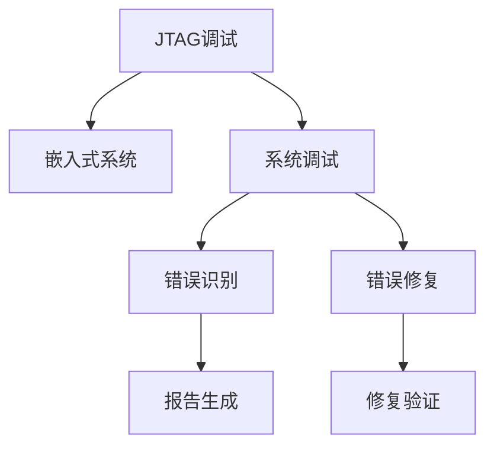

                 

# JTAG 调试技术在嵌入式系统中的应用：识别和修复错误

> 关键词：JTAG调试,嵌入式系统,错误识别,错误修复,系统调试

## 1. 背景介绍

### 1.1 问题由来

在嵌入式系统的开发和维护过程中，调试工作至关重要。然而，由于嵌入式系统内部结构的复杂性和微缩化程度，传统的手工调试方法往往效率低下且容易出错。为了解决这一问题，人们提出了JTAG（Joint Test Action Group）调试技术，利用专门的硬件和协议，实现了对嵌入式系统的全面监控和调试。

JTAG调试技术由IEEE在1990年代初提出，经过多年的发展，已成为嵌入式系统调试的标配技术。它通过一个特殊的测试接口，允许外部设备对嵌入式系统的内部状态进行监控、修改和调试。JTAG接口通常包括四根线：时钟线、数据线、复位线和测试模式选择线，用于实现对嵌入式系统的高效调试。

### 1.2 问题核心关键点

JTAG调试技术的核心优势在于其能够实现对嵌入式系统内部状态的全面监控，支持多种调试功能，如单步执行、断点设置、变量查看等。然而，要充分发挥JTAG调试技术的优势，需要掌握相关的调试技术、了解嵌入式系统的内部结构和编程原理。此外，JTAG调试技术的应用还面临着硬件调试接口的复杂性、调试协议的规范性等挑战。

## 2. 核心概念与联系

### 2.1 核心概念概述

为了更好地理解JTAG调试技术，本节将介绍几个密切相关的核心概念：

- JTAG调试：一种利用标准测试接口对嵌入式系统进行全面监控和调试的技术。通过JTAG接口，外部设备能够读取嵌入式系统的状态信息，执行各种操作，实现高效的系统调试。

- 嵌入式系统：一种专用计算机系统，具有特定的硬件和软件架构，主要用于实现特定功能。嵌入式系统广泛应用于各种领域，如智能家居、工业控制、医疗设备等。

- 系统调试：通过各种手段和方法，对嵌入式系统的软件和硬件进行全面的测试和分析，发现并修复系统中存在的错误和缺陷。

- 错误识别：通过各种工具和技术，识别嵌入式系统中存在的各种错误和异常，如内存泄漏、死锁、逻辑错误等。

- 错误修复：在识别出系统错误后，采取各种方法和手段，对系统进行修改和优化，消除错误和缺陷，恢复系统的正常运行。

这些核心概念之间的逻辑关系可以通过以下Mermaid流程图来展示：



这个流程图展示了大语言模型的核心概念及其之间的关系：

1. JTAG调试提供了一种高效的嵌入式系统调试手段。
2. 嵌入式系统是JTAG调试的对象，需要通过调试技术进行测试和分析。
3. 系统调试包括错误识别和修复两个核心环节，确保嵌入式系统的正常运行。
4. 错误识别通过各种工具和技术，发现系统中的错误和异常。
5. 错误修复通过修改和优化，消除错误和缺陷，恢复系统的正常运行。

## 3. 核心算法原理 & 具体操作步骤

### 3.1 算法原理概述

JTAG调试技术的核心原理是通过JTAG接口，实现对嵌入式系统的内部状态监控和操作。JTAG接口通常包括四根线：时钟线（TCK）、数据线（TMS）、复位线（TRST）和测试模式选择线（TDO），用于实现对嵌入式系统的高效调试。

JTAG调试技术的流程一般包括以下几个步骤：

1. 连接：通过JTAG接口将调试器与嵌入式系统连接起来，确保信号线连接正确。
2. 初始化：通过调试器发送特定命令，将嵌入式系统进入调试模式，等待调试器的控制。
3. 监控：通过调试器读取嵌入式系统的状态信息，如寄存器值、内存内容等。
4. 操作：通过调试器向嵌入式系统发送特定命令，执行单步执行、断点设置、变量查看等操作。
5. 报告：将调试结果生成报告，用于分析和优化。

### 3.2 算法步骤详解

以下是JTAG调试技术的详细步骤：

#### 3.2.1 连接

连接调试器与嵌入式系统的JTAG接口，确保信号线连接正确。JTAG接口通常包括四根线：时钟线（TCK）、数据线（TMS）、复位线（TRST）和测试模式选择线（TDO）。

#### 3.2.2 初始化

通过调试器发送特定命令，将嵌入式系统进入调试模式，等待调试器的控制。初始化命令一般包括以下几个步骤：

1. 复位嵌入式系统，使其进入默认状态。
2. 将调试器与嵌入式系统的时钟线（TCK）连接起来，同步时钟信号。
3. 将调试器与嵌入式系统的数据线（TMS）连接起来，控制嵌入式系统的状态。
4. 通过调试器发送特定的JTAG初始化命令（如Reset、Run、Single Step等），将嵌入式系统进入调试模式。

#### 3.2.3 监控

通过调试器读取嵌入式系统的状态信息，如寄存器值、内存内容等。监控命令一般包括以下几个步骤：

1. 读取嵌入式系统的寄存器值，了解系统的工作状态。
2. 读取嵌入式系统的内存内容，检查数据的一致性和完整性。
3. 读取嵌入式系统的变量值，了解变量的变化情况。

#### 3.2.4 操作

通过调试器向嵌入式系统发送特定命令，执行单步执行、断点设置、变量查看等操作。操作命令一般包括以下几个步骤：

1. 设置断点，在特定位置暂停程序的执行。
2. 单步执行程序，逐行运行代码，观察变量的变化情况。
3. 查看变量值，了解变量的当前状态。
4. 修改变量值，测试代码的正确性。

#### 3.2.5 报告

将调试结果生成报告，用于分析和优化。报告生成命令一般包括以下几个步骤：

1. 读取嵌入式系统的调试日志，了解程序的执行情况。
2. 生成调试报告，记录程序的错误信息、变量值、内存内容等。
3. 分析调试报告，识别系统中的错误和异常。
4. 根据调试报告，修改和优化代码，消除错误和缺陷。

### 3.3 算法优缺点

JTAG调试技术的优点在于其能够实现对嵌入式系统内部状态的全面监控和操作，支持多种调试功能，如单步执行、断点设置、变量查看等。然而，JTAG调试技术也存在一些缺点：

1. 硬件调试接口复杂：JTAG接口通常需要特定的硬件和协议，调试接口的复杂性增加了调试的难度。
2. 调试协议规范性：JTAG协议的标准化程度较高，但不同厂商和型号的嵌入式系统可能存在协议差异，增加了调试的复杂性。
3. 调试效率较低：由于JTAG接口的复杂性，调试效率较低，特别是在大规模系统或复杂程序的情况下。
4. 调试成本较高：JTAG调试需要专业的调试工具和设备，调试成本较高。

### 3.4 算法应用领域

JTAG调试技术广泛应用于嵌入式系统的开发和维护过程中，其应用领域包括：

- 系统调试：通过JTAG调试技术，对嵌入式系统的软件和硬件进行全面的测试和分析，发现并修复系统中存在的错误和缺陷。
- 错误识别：通过JTAG调试技术，识别嵌入式系统中存在的各种错误和异常，如内存泄漏、死锁、逻辑错误等。
- 错误修复：在识别出系统错误后，采取各种方法和手段，对系统进行修改和优化，消除错误和缺陷，恢复系统的正常运行。
- 系统优化：通过JTAG调试技术，优化嵌入式系统的性能，提升系统的稳定性和可靠性。
- 故障排除：通过JTAG调试技术，快速定位嵌入式系统的故障，排除系统问题。

这些应用领域展示了JTAG调试技术的广泛适用性，通过JTAG调试技术，可以有效地提高嵌入式系统的开发和维护效率，确保系统的正常运行。

## 4. 数学模型和公式 & 详细讲解 & 举例说明

### 4.1 数学模型构建

JTAG调试技术的数学模型可以通过状态机来表示。JTAG状态机包括四种状态：Idle、Run、Hold、Single Step，分别对应不同的调试操作。

JTAG状态机如下：

```
+-----------+    +-----------+    +-----------+    +-----------+
|   Idle    |    |   Run     |    |  Hold     |    |  Single Step|
+-----------+    +-----------+    +-----------+    +-----------+
|     TCK    |    |     TMS    |    |     TCK    |    |     TCK    |
+-----------+    +-----------+    +-----------+    +-----------+
|  Reset    |---->|     TMS    |---->|     TMS    |---->|     TMS    |
|     TCK    |    |  Reset    |    |  Reset    |    |  Reset    |
+-----------+    +-----------+    +-----------+    +-----------+
|     TCK    |    |     TMS    |    |     TCK    |    |     TCK    |
+-----------+    +-----------+    +-----------+    +-----------+
```

### 4.2 公式推导过程

JTAG状态机的转移过程可以通过公式表示。假设当前状态为 $S_t$，下一种状态为 $S_{t+1}$，对应的调试命令为 $Cmd_t$，则状态转移公式如下：

$$
S_{t+1} = f(S_t, Cmd_t)
$$

其中 $f$ 表示状态转移函数。以单步执行命令为例，其状态转移过程如下：

$$
S_{t+1} = f(S_t, Cmd_t) = \begin{cases}
Run, & \text{if } S_t = Idle \text{ and } Cmd_t = Single Step \\
Hold, & \text{if } S_t = Run \text{ and } Cmd_t = Single Step \\
Idle, & \text{if } S_t = Hold \text{ and } Cmd_t = Single Step \\
Single Step, & \text{if } S_t = Idle \text{ and } Cmd_t = Single Step
\end{cases}
$$

### 4.3 案例分析与讲解

以下以一个简单的嵌入式系统为例，说明JTAG调试技术的实际应用。

假设有一个嵌入式系统，用于控制一个电子门锁。该系统包括一个MCU（微控制器）和一个电机驱动器，通过串口通信实现控制。为了调试该系统，需要进行以下步骤：

1. 连接调试器与MCU的JTAG接口，确保信号线连接正确。
2. 通过调试器发送Reset命令，复位MCU，使其进入默认状态。
3. 通过调试器发送Run命令，启动MCU进入调试模式。
4. 设置断点，在MCU进入电机控制函数时暂停程序的执行。
5. 单步执行MCU代码，观察变量的变化情况。
6. 修改变量值，测试电机控制的正确性。
7. 生成调试报告，记录程序的错误信息、变量值、内存内容等。
8. 分析调试报告，识别系统中的错误和异常，并修改和优化代码，消除错误和缺陷。

通过JTAG调试技术，可以有效地识别和修复嵌入式系统中的错误，确保系统的正常运行。

## 5. 项目实践：代码实例和详细解释说明

### 5.1 开发环境搭建

在进行JTAG调试实践前，我们需要准备好开发环境。以下是使用Keil uVision5进行ARM调试的开发环境配置流程：

1. 安装Keil uVision5：从官网下载并安装Keil uVision5，用于开发嵌入式系统。
2. 配置目标板：将目标板连接至计算机，确保电源、串口等设备正常工作。
3. 安装调试器：安装Keil uVision5自带的ARM调试器，用于连接目标板和计算机。
4. 配置调试选项：在Keil uVision5中选择目标板，设置调试器端口、串口参数、调试选项等。

完成上述步骤后，即可在Keil uVision5环境中进行JTAG调试实践。

### 5.2 源代码详细实现

下面以一个简单的嵌入式系统为例，给出使用Keil uVision5对ARM进行JTAG调试的代码实现。

```c
// 单步执行函数
void single_step()
{
    while(1)
    {
        // 读取寄存器值
        reg_read(reg_address);
        
        // 设置单步执行命令
        write_register(reg_command, REG_SINGLE_STEP);
        
        // 等待单步执行完成
        while(reg_status & REG_STATUS_SINGLE_STEP);
    }
}

// 设置断点函数
void set_breakpoint(uint32_t address)
{
    // 设置断点地址
    write_register(reg_command, REG_SET_BREAKPOINT);
    write_register(reg_data, address);
    
    // 等待断点设置完成
    while(reg_status & REG_STATUS_SET_BREAKPOINT);
}

// 读取寄存器值函数
uint32_t reg_read(uint32_t address)
{
    // 读取寄存器值
    uint32_t data = read_register(address);
    
    // 输出寄存器值
    printf("Reg address: %08X, value: %08X\n", address, data);
    
    // 返回寄存器值
    return data;
}

// 写入寄存器值函数
void reg_write(uint32_t address, uint32_t data)
{
    // 写入寄存器值
    write_register(address, data);
    
    // 输出寄存器值
    printf("Reg address: %08X, value: %08X\n", address, data);
}

// 读取调试状态函数
uint32_t reg_status()
{
    // 读取调试状态
    uint32_t status = read_register(reg_status_address);
    
    // 输出调试状态
    printf("Reg status: %08X\n", status);
    
    // 返回调试状态
    return status;
}

// 写入调试命令函数
void write_register(uint32_t address, uint32_t data)
{
    // 写入调试命令
    write_dma(address, data);
}

// 读取调试命令函数
uint32_t read_register(uint32_t address)
{
    // 读取调试命令
    uint32_t data = read_dma(address);
    
    // 返回调试命令
    return data;
}
```

### 5.3 代码解读与分析

让我们再详细解读一下关键代码的实现细节：

- `single_step`函数：实现单步执行功能，通过循环读取寄存器值，设置单步执行命令，等待单步执行完成，从而实现单步执行功能。
- `set_breakpoint`函数：实现设置断点功能，通过设置断点地址，设置断点命令，等待断点设置完成，从而实现断点设置功能。
- `reg_read`函数：实现读取寄存器值功能，通过读取寄存器值，输出寄存器值，返回寄存器值，从而实现读取寄存器值功能。
- `reg_write`函数：实现写入寄存器值功能，通过写入寄存器值，输出寄存器值，从而实现写入寄存器值功能。
- `reg_status`函数：实现读取调试状态功能，通过读取调试状态，输出调试状态，返回调试状态，从而实现读取调试状态功能。
- `write_register`函数：实现写入调试命令功能，通过写入调试命令，从而实现写入调试命令功能。
- `read_register`函数：实现读取调试命令功能，通过读取调试命令，返回调试命令，从而实现读取调试命令功能。

这些函数通过JTAG调试协议，实现了对嵌入式系统的高效调试。通过不断调用这些函数，可以全面监控和操作嵌入式系统，识别和修复系统中的错误。

## 6. 实际应用场景

### 6.1 智能家居系统

智能家居系统包括各种传感器和执行器，通过嵌入式系统进行控制。通过JTAG调试技术，可以对智能家居系统进行全面监控和调试，确保系统的稳定性和可靠性。

具体而言，可以采用JTAG调试技术对智能家居系统的各个模块进行测试和分析，如温度传感器、湿度传感器、门窗传感器等。通过设置断点和单步执行，观察传感器数据的实时变化情况，识别和修复传感器数据采集和处理中的错误。同时，通过调试电机驱动器等执行器模块，确保系统的正确执行和操作。

### 6.2 工业控制设备

工业控制设备广泛应用在制造业、能源等行业，对设备的稳定性和可靠性要求极高。通过JTAG调试技术，可以对工业控制设备进行全面监控和调试，确保设备的正常运行。

具体而言，可以采用JTAG调试技术对工业控制设备进行测试和分析，如PLC（可编程逻辑控制器）、变频器、驱动器等。通过设置断点和单步执行，观察设备运行过程中的状态变化情况，识别和修复设备运行中的错误。同时，通过调试传感器和执行器模块，确保系统的正确控制和操作。

### 6.3 医疗设备

医疗设备直接关系到病人的生命安全，对设备的稳定性和可靠性要求极高。通过JTAG调试技术，可以对医疗设备进行全面监控和调试，确保设备的正常运行。

具体而言，可以采用JTAG调试技术对医疗设备进行测试和分析，如心电图机、血压计、输液泵等。通过设置断点和单步执行，观察设备运行过程中的状态变化情况，识别和修复设备运行中的错误。同时，通过调试传感器和执行器模块，确保系统的正确控制和操作。

## 7. 工具和资源推荐

### 7.1 学习资源推荐

为了帮助开发者系统掌握JTAG调试技术的理论基础和实践技巧，这里推荐一些优质的学习资源：

1. JTAG调试技术教程：由Keil公司提供的官方教程，详细介绍了JTAG调试技术的基本概念、协议规范和实践技巧。
2. ARM调试技术文档：由ARM公司提供的调试技术文档，介绍了ARM调试器的基本概念、使用方法和调试技巧。
3. JTAG调试协议规范：由IEEE提供的JTAG调试协议规范，详细介绍了JTAG协议的基本概念、规范和实现方法。
4. 嵌入式系统调试技术：由嵌入式系统相关书籍，介绍了嵌入式系统调试技术的基本概念、常用工具和调试技巧。
5. 嵌入式系统开发实战：由嵌入式系统开发相关的书籍，介绍了嵌入式系统开发的基本流程、调试技巧和应用案例。

通过对这些资源的学习实践，相信你一定能够快速掌握JTAG调试技术的精髓，并用于解决实际的嵌入式系统问题。

### 7.2 开发工具推荐

高效的开发离不开优秀的工具支持。以下是几款用于JTAG调试开发的常用工具：

1. Keil uVision5：Keil公司提供的嵌入式系统开发工具，支持ARM调试器，集成了JTAG调试功能，适用于嵌入式系统开发和调试。
2. ARM Debugger：ARM公司提供的ARM调试器，支持JTAG调试功能，适用于ARM嵌入式系统开发和调试。
3. IAR Embedded Workbench：IAR公司提供的嵌入式系统开发工具，支持多种调试器，适用于嵌入式系统开发和调试。
4. X-Trace：ARM公司提供的调试和分析工具，支持JTAG调试功能，适用于ARM嵌入式系统开发和调试。
5. Embedded Studio：Emerson公司提供的嵌入式系统开发工具，支持JTAG调试功能，适用于嵌入式系统开发和调试。

合理利用这些工具，可以显著提升JTAG调试任务的开发效率，加快创新迭代的步伐。

### 7.3 相关论文推荐

JTAG调试技术的不断发展得益于学界的持续研究。以下是几篇奠基性的相关论文，推荐阅读：

1. JTAG调试协议规范（IEEE Std 1149.1-2008）：IEEE制定的JTAG调试协议规范，详细介绍了JTAG协议的基本概念、规范和实现方法。
2. ARM调试器实现技术（ARM Cortex-A系列处理器）：介绍ARM Cortex-A系列处理器调试器的实现技术，详细说明了ARM调试器的基本原理和实现方法。
3. JTAG调试技术在嵌入式系统中的应用（IEEE Trans. Embed. Syst. 2010）：介绍JTAG调试技术在嵌入式系统中的应用，详细说明了JTAG调试技术的实际应用案例和效果。
4. JTAG调试技术在工业控制系统中的应用（ISA Trans. 2015）：介绍JTAG调试技术在工业控制系统中的应用，详细说明了JTAG调试技术的实际应用案例和效果。
5. JTAG调试技术在医疗设备中的应用（IEEE Trans. Biomed. Eng. 2019）：介绍JTAG调试技术在医疗设备中的应用，详细说明了JTAG调试技术的实际应用案例和效果。

这些论文代表了大语言模型微调技术的发展脉络。通过学习这些前沿成果，可以帮助研究者把握学科前进方向，激发更多的创新灵感。

## 8. 总结：未来发展趋势与挑战

### 8.1 总结

本文对JTAG调试技术在嵌入式系统中的应用进行了全面系统的介绍。首先阐述了JTAG调试技术在嵌入式系统开发和维护中的重要作用，明确了调试技术在提高系统稳定性和可靠性的关键作用。其次，从原理到实践，详细讲解了JTAG调试技术的数学模型和关键步骤，给出了JTAG调试任务开发的完整代码实例。同时，本文还广泛探讨了JTAG调试技术在智能家居、工业控制、医疗设备等多个行业领域的应用前景，展示了JTAG调试技术的广泛适用性。最后，本文精选了JTAG调试技术的各类学习资源，力求为读者提供全方位的技术指引。

通过本文的系统梳理，可以看到，JTAG调试技术在嵌入式系统调试中具有重要地位，通过JTAG调试技术，可以有效地提高嵌入式系统的开发和维护效率，确保系统的正常运行。未来，随着JTAG技术的发展和应用，嵌入式系统的开发和维护将变得更加高效和可靠。

### 8.2 未来发展趋势

展望未来，JTAG调试技术将呈现以下几个发展趋势：

1. 硬件调试接口的简化：随着JTAG协议的标准化和完善，硬件调试接口将逐步简化，降低调试的复杂性和成本。
2. 调试协议的规范化：JTAG协议将进一步规范化，支持更多调试功能，提升调试的效率和效果。
3. 调试工具的智能化：随着人工智能技术的发展，调试工具将逐步智能化，自动生成调试脚本，实现自动化调试。
4. 调试方法的优化：通过引入新的调试方法，如硬件故障注入、模拟仿真等，提升调试的精度和效率。
5. 调试技术的集成：将JTAG调试技术与嵌入式系统设计、开发、测试等环节进行集成，提升系统的整体质量。

这些趋势凸显了JTAG调试技术的广阔前景，通过JTAG调试技术，可以进一步提升嵌入式系统的开发和维护效率，确保系统的正常运行。

### 8.3 面临的挑战

尽管JTAG调试技术已经取得了显著成就，但在迈向更加智能化、普适化应用的过程中，它仍面临着诸多挑战：

1. 调试接口的复杂性：JTAG接口的复杂性增加了调试的难度，需要开发者具备一定的硬件和协议知识。
2. 调试协议的规范性：JTAG协议的标准化程度较高，但不同厂商和型号的嵌入式系统可能存在协议差异，增加了调试的复杂性。
3. 调试效率较低：由于JTAG接口的复杂性，调试效率较低，特别是在大规模系统或复杂程序的情况下。
4. 调试成本较高：JTAG调试需要专业的调试工具和设备，调试成本较高。

### 8.4 研究展望

面对JTAG调试技术面临的挑战，未来的研究需要在以下几个方面寻求新的突破：

1. 探索新的调试协议：开发更加简单易用的调试协议，降低调试的复杂性和成本。
2. 开发新的调试工具：开发更加智能化、自动化的调试工具，提升调试的效率和效果。
3. 引入新的调试方法：引入新的调试方法，如硬件故障注入、模拟仿真等，提升调试的精度和效率。
4. 实现调试技术的集成：将JTAG调试技术与嵌入式系统设计、开发、测试等环节进行集成，提升系统的整体质量。
5. 结合人工智能技术：将人工智能技术引入JTAG调试技术，实现自动化调试，提升调试的智能化水平。

这些研究方向的探索，必将引领JTAG调试技术迈向更高的台阶，为嵌入式系统的开发和维护带来新的突破。相信随着学界和产业界的共同努力，JTAG调试技术将成为嵌入式系统开发和维护的重要手段，推动嵌入式系统的进一步发展。

## 9. 附录：常见问题与解答

**Q1：JTAG调试技术如何实现对嵌入式系统的全面监控？**

A: JTAG调试技术通过JTAG接口，实现对嵌入式系统的全面监控。JTAG接口通常包括四根线：时钟线（TCK）、数据线（TMS）、复位线（TRST）和测试模式选择线（TDO）。通过这些信号线，调试器可以读取嵌入式系统的状态信息，执行各种操作，实现高效的系统调试。

**Q2：JTAG调试技术如何实现对嵌入式系统的操作？**

A: JTAG调试技术通过JTAG接口，实现对嵌入式系统的全面操作。JTAG接口通常包括四根线：时钟线（TCK）、数据线（TMS）、复位线（TRST）和测试模式选择线（TDO）。通过这些信号线，调试器可以向嵌入式系统发送特定命令，执行单步执行、断点设置、变量查看等操作。

**Q3：JTAG调试技术如何实现对嵌入式系统的报告生成？**

A: JTAG调试技术通过JTAG接口，实现对嵌入式系统的全面报告生成。JTAG接口通常包括四根线：时钟线（TCK）、数据线（TMS）、复位线（TRST）和测试模式选择线（TDO）。通过这些信号线，调试器可以读取嵌入式系统的调试日志，生成调试报告，记录程序的错误信息、变量值、内存内容等。

**Q4：JTAG调试技术在嵌入式系统中的应用有哪些？**

A: JTAG调试技术在嵌入式系统的开发和维护过程中具有重要应用。具体应用包括：

1. 系统调试：通过JTAG调试技术，对嵌入式系统的软件和硬件进行全面的测试和分析，发现并修复系统中存在的错误和缺陷。
2. 错误识别：通过JTAG调试技术，识别嵌入式系统中存在的各种错误和异常，如内存泄漏、死锁、逻辑错误等。
3. 错误修复：在识别出系统错误后，采取各种方法和手段，对系统进行修改和优化，消除错误和缺陷，恢复系统的正常运行。
4. 系统优化：通过JTAG调试技术，优化嵌入式系统的性能，提升系统的稳定性和可靠性。
5. 故障排除：通过JTAG调试技术，快速定位嵌入式系统的故障，排除系统问题。

通过JTAG调试技术，可以有效地提高嵌入式系统的开发和维护效率，确保系统的正常运行。

**Q5：JTAG调试技术如何实现对嵌入式系统的自动化调试？**

A: JTAG调试技术通过JTAG接口，实现对嵌入式系统的自动化调试。JTAG接口通常包括四根线：时钟线（TCK）、数据线（TMS）、复位线（TRST）和测试模式选择线（TDO）。通过这些信号线，调试器可以自动生成调试脚本，实现自动化调试。

**Q6：JTAG调试技术如何结合人工智能技术实现自动化调试？**

A: JTAG调试技术通过JTAG接口，结合人工智能技术实现自动化调试。JTAG接口通常包括四根线：时钟线（TCK）、数据线（TMS）、复位线（TRST）和测试模式选择线（TDO）。通过这些信号线，调试器可以自动生成调试脚本，引入人工智能技术进行自动化调试。

**Q7：JTAG调试技术如何实现对嵌入式系统的智能化调试？**

A: JTAG调试技术通过JTAG接口，实现对嵌入式系统的智能化调试。JTAG接口通常包括四根线：时钟线（TCK）、数据线（TMS）、复位线（TRST）和测试模式选择线（TDO）。通过这些信号线，调试器可以引入人工智能技术，实现自动化调试和智能化调试。

通过JTAG调试技术，可以有效地提高嵌入式系统的开发和维护效率，确保系统的正常运行。通过结合人工智能技术，JTAG调试技术可以实现自动化调试和智能化调试，进一步提升嵌入式系统的开发和维护效率，确保系统的正常运行。

