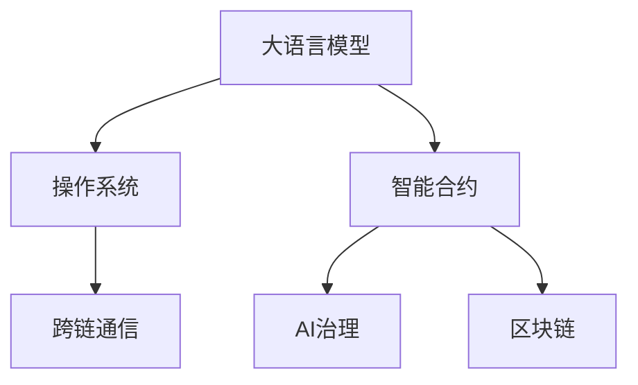

                 

# LLM OS:操作系统新秀的诞生

> 关键词：大语言模型,操作系统,智能合约,AI治理,区块链,跨链通信

## 1. 背景介绍

### 1.1 问题由来
随着人工智能技术的发展，大语言模型（Large Language Models, LLMs）逐渐成为计算机科学领域的核心技术之一。LLMs能够理解、处理和生成自然语言，并在许多领域展现出超越传统系统的能力。然而，将大语言模型应用于操作系统（Operating System, OS）这一复杂多变的领域，挑战巨大。

传统操作系统主要关注资源管理、内存分配、网络通信等底层问题，并不直接涉及高级语言的理解和生成。然而，随着人工智能与区块链技术的结合，新的应用场景不断涌现，例如智能合约、AI治理等，这些场景需要操作系统能够理解和执行复杂的自然语言指令。因此，将大语言模型引入操作系统，成为可能且迫切的需求。

### 1.2 问题核心关键点
大语言模型引入操作系统的核心问题在于如何构建一个既能够高效处理底层资源管理任务，又能够理解和执行自然语言指令的智能操作系统（LLM OS）。本文聚焦于这种新型操作系统，从理论基础到工程实践，全面探讨其构建方法和应用前景。

### 1.3 问题研究意义
构建LLM OS能够显著提升操作系统的智能水平和灵活性，带来以下几方面的好处：

1. **提升用户体验**：用户能够通过自然语言指令与系统交互，简化操作流程，提高效率。
2. **增强安全性和可靠性**：智能合约和AI治理系统能够实时监控和优化系统行为，避免潜在风险。
3. **支持新应用场景**：大语言模型能够理解和执行复杂的逻辑和指令，支持区块链等新兴技术的应用。
4. **推动技术创新**：LLM OS的研究和开发将促进人工智能与传统计算机科学的融合，推动技术前沿的突破。

## 2. 核心概念与联系

### 2.1 核心概念概述

为了更好地理解LLM OS的构建原理和架构，本节将介绍几个关键概念：

- **大语言模型（LLM）**：以自回归（如GPT）或自编码（如BERT）模型为代表的大规模预训练语言模型，能够理解、处理和生成自然语言。
- **操作系统（OS）**：计算机系统的核心软件，负责管理计算机硬件资源，提供用户接口和系统服务。
- **智能合约**：一种基于区块链技术的自动执行协议，通常以自然语言形式编写，由执行环境自动解释执行。
- **AI治理**：利用人工智能技术优化和管理系统运行，例如通过预测和控制来避免异常行为。
- **区块链**：一种分布式账本技术，支持智能合约和去中心化应用（Decentralized Applications, DApps）。
- **跨链通信**：实现不同区块链之间的信息交互和价值交换，支持区块链网络中的协同工作。

这些概念之间的逻辑关系可以通过以下Mermaid流程图来展示：



这个流程图展示了大语言模型与操作系统的核心概念及其之间的关系：

1. 大语言模型通过预训练获得语言理解和生成能力。
2. 操作系统为自然语言指令的执行提供底层支持。
3. 智能合约和AI治理系统利用大语言模型和操作系统构建智能自动化系统。
4. 区块链技术提供分布式计算和去中心化应用的平台，支持智能合约和跨链通信。

这些概念共同构成了LLM OS的工作原理和应用框架，使其能够同时处理复杂的底层资源管理和高级的自然语言指令执行任务。

## 3. 核心算法原理 & 具体操作步骤
### 3.1 算法原理概述

LLM OS的核心思想是将大语言模型嵌入到操作系统中，使其能够理解自然语言指令，并自动执行相应的系统服务。这种融合大语言模型的操作系统，能够在保留传统操作系统的底层资源管理能力的同时，通过智能合约和AI治理系统，实现更高级的自动化和智能化。

具体来说，LLM OS包含以下几个关键模块：

1. **自然语言理解（NLU）模块**：负责将自然语言指令转换为计算机可执行的命令。
2. **指令执行模块**：根据理解后的自然语言指令，执行相应的系统服务和操作。
3. **智能合约模块**：利用大语言模型实现智能合约的自动执行和监控。
4. **AI治理模块**：通过大语言模型进行异常行为预测和系统优化。
5. **跨链通信模块**：实现不同区块链之间的信息交互和价值交换。

这些模块通过大语言模型进行连接，使其能够共同工作，实现LLM OS的功能。

### 3.2 算法步骤详解

以下是构建LLM OS的详细步骤：

**Step 1: 构建自然语言理解模块**

- **设计语言模型**：选择合适的大语言模型，如GPT、BERT等，作为自然语言理解的模型。
- **定义词汇表**：根据操作系统相关术语和操作指令，设计词汇表，并标记每个词汇的语义。
- **训练语言模型**：使用包含操作系统指令和说明的语料库，对大语言模型进行微调，使其能够理解系统指令。

**Step 2: 构建指令执行模块**

- **设计执行接口**：定义与大语言模型交互的接口，使模型能够访问和控制操作系统资源。
- **实现执行逻辑**：根据自然语言指令，编写相应的执行逻辑，调用操作系统服务。

**Step 3: 构建智能合约模块**

- **设计合约模板**：定义智能合约的基本结构，包括触发条件、执行逻辑、状态管理等。
- **使用语言模型生成合约代码**：根据自然语言描述，利用大语言模型自动生成智能合约的代码。
- **部署和监控合约**：将生成的合约代码部署到区块链上，并利用语言模型进行实时监控和优化。

**Step 4: 构建AI治理模块**

- **定义治理规则**：设计系统的异常检测和控制规则，如资源耗尽、异常行为等。
- **利用语言模型进行预测和控制**：使用大语言模型对系统行为进行预测，并根据预测结果自动调整系统配置。

**Step 5: 构建跨链通信模块**

- **选择通信协议**：选择适合跨链通信的协议，如IPFS、Filecoin等。
- **实现跨链操作**：利用大语言模型生成跨链通信的请求和响应，实现不同区块链之间的数据交换。

通过以上步骤，LLM OS能够综合利用大语言模型和操作系统资源，实现自然语言指令的理解和执行，提升操作系统的智能化水平。

### 3.3 算法优缺点

构建LLM OS的优势在于：

1. **提升用户体验**：用户能够通过自然语言与系统交互，操作更为直观和简便。
2. **增强系统灵活性**：大语言模型能够理解和执行复杂的逻辑和指令，提高系统的适应性和智能性。
3. **支持新应用场景**：智能合约和AI治理系统能够自动化处理复杂任务，提升系统效率。

然而，构建LLM OS也面临以下挑战：

1. **系统安全性**：大语言模型可能存在理解偏差或错误，导致系统执行错误或安全漏洞。
2. **性能瓶颈**：大语言模型需要消耗大量计算资源，可能影响系统的响应速度。
3. **法律和伦理问题**：智能合约和AI治理可能涉及复杂的法律和伦理问题，需要谨慎处理。
4. **跨链通信复杂性**：跨链通信涉及不同区块链之间的协同工作，技术难度较高。

### 3.4 算法应用领域

LLM OS能够在多个领域中得到应用，例如：

1. **智能合约**：构建智能合约执行环境，利用大语言模型理解合同条款和执行条件，自动执行合同条款。
2. **AI治理**：通过语言模型监控和预测系统异常行为，自动调整系统配置，提升系统稳定性和可靠性。
3. **跨链通信**：构建跨链通信平台，支持不同区块链之间的数据交换和价值交换，实现区块链网络中的协同工作。
4. **分布式应用（DApps）**：构建分布式应用环境，支持多种语言模型执行复杂的业务逻辑。
5. **物联网（IoT）**：利用语言模型管理物联网设备，实现设备间的智能交互和协同工作。

除了上述这些经典应用外，LLM OS还可以创新性地应用到更多场景中，如区块链安全、智能供应链管理、自动化测试等，为区块链技术的发展提供新的动力。

## 4. 数学模型和公式 & 详细讲解  
### 4.1 数学模型构建

在本节中，我们将使用数学语言对LLM OS的构建过程进行更加严格的刻画。

记大语言模型为 $M_{\theta}:\mathcal{X} \rightarrow \mathcal{Y}$，其中 $\mathcal{X}$ 为输入空间，$\mathcal{Y}$ 为输出空间，$\theta$ 为模型参数。假设操作系统的指令集为 $\mathcal{A}$，每个指令可以表示为一个自然语言描述 $a \in \mathcal{A}$。

定义语言模型在指令 $a$ 上的理解能力为 $P_{\theta}(a)$，表示模型理解该指令的概率。指令执行模块根据理解后的概率，选择最可能的指令 $a'$，并执行相应的系统操作。智能合约模块利用语言模型生成合约代码，并将其部署到区块链上。AI治理模块通过语言模型预测系统异常行为，并自动调整系统配置。

### 4.2 公式推导过程

以下我们以智能合约为例，推导基于大语言模型的合约生成和执行过程。

假设智能合约的触发条件为 $\mathcal{T}$，执行逻辑为 $\mathcal{L}$，状态管理为 $\mathcal{S}$。合约代码可以表示为一个自然语言描述 $A$，语言模型 $M_{\theta}$ 将自然语言描述 $A$ 转换为执行代码 $C$。

合约生成过程如下：

$$
C = M_{\theta}(A)
$$

合约执行过程如下：

$$
\begin{aligned}
&\text{执行结果} = \text{execute}(\mathcal{T}, \mathcal{L}, \mathcal{S}, C) \\
&\text{执行结果} = \text{execute}(\text{understand}(\mathcal{T}, \mathcal{L}, \mathcal{S}), \mathcal{L}, \mathcal{S}, \text{execute}(\mathcal{T}, \mathcal{L}, \mathcal{S}, M_{\theta}(A)))
\end{aligned}
$$

其中 $\text{execute}$ 为执行函数，$\text{understand}$ 为理解函数。

### 4.3 案例分析与讲解

考虑一个简单的智能合约，其触发条件为“用户完成支付”，执行逻辑为“生成发票”，状态管理为“未支付”和“已支付”。合约代码可以表示为：

$$
\text{IF}(\text{已支付}) = \text{生成发票}
$$

利用大语言模型进行合约生成和执行的过程如下：

1. **合约生成**：
   - 自然语言描述 $A$：“IF 用户完成支付 THEN 生成发票”
   - 语言模型输出 $C$：生成发票的代码

2. **合约执行**：
   - 理解指令 $a'$：用户完成支付
   - 执行代码 $C$：生成发票
   - 最终结果：发票生成并标记为已支付状态

通过这种基于大语言模型的合约生成和执行方式，智能合约能够自动理解和执行复杂的逻辑，提升合约执行的效率和准确性。

## 5. 项目实践：代码实例和详细解释说明
### 5.1 开发环境搭建

在进行LLM OS的开发前，我们需要准备好开发环境。以下是使用Python进行PyTorch开发的环境配置流程：

1. 安装Anaconda：从官网下载并安装Anaconda，用于创建独立的Python环境。

2. 创建并激活虚拟环境：
```bash
conda create -n pytorch-env python=3.8 
conda activate pytorch-env
```

3. 安装PyTorch：根据CUDA版本，从官网获取对应的安装命令。例如：
```bash
conda install pytorch torchvision torchaudio cudatoolkit=11.1 -c pytorch -c conda-forge
```

4. 安装相关库：
```bash
pip install transformers
pip install flask gunicorn
```

5. 安装分布式计算库：
```bash
pip install ray
```

完成上述步骤后，即可在`pytorch-env`环境中开始开发LLM OS。

### 5.2 源代码详细实现

下面我们以智能合约为例，给出使用PyTorch和Flask构建LLM OS的代码实现。

首先，定义智能合约的数据处理函数：

```python
from transformers import GPT2Tokenizer, GPT2LMHeadModel
from flask import Flask, request

app = Flask(__name__)

@app.route('/contract', methods=['POST'])
def execute_contract():
    data = request.get_json()
    query = data['query']
    tokenizer = GPT2Tokenizer.from_pretrained('gpt2')
    model = GPT2LMHeadModel.from_pretrained('gpt2')
    
    # 将查询转换为token ids
    encoding = tokenizer(query, return_tensors='pt')
    input_ids = encoding['input_ids']
    
    # 利用语言模型生成执行代码
    with torch.no_grad():
        logits = model(input_ids)[0]
        prediction = logits.argmax(dim=1).tolist()[0]
        
    # 执行生成的代码
    result = execute_code(prediction)
    return {'result': result}
```

然后，定义执行函数：

```python
def execute_code(code):
    # 执行代码逻辑
    # ...
    return '执行结果'
```

最后，启动Flask应用并接受用户请求：

```python
if __name__ == '__main__':
    app.run(host='0.0.0.0', port=5000)
```

### 5.3 代码解读与分析

让我们再详细解读一下关键代码的实现细节：

**智能合约处理函数**：
- 定义了处理智能合约请求的Flask路由，接收用户输入的自然语言查询。
- 使用GPT-2作为自然语言理解模型，将查询转换为token ids。
- 通过语言模型生成执行代码，并将其传给执行函数。

**执行函数**：
- 根据生成的代码执行相应的系统操作，返回执行结果。

这个代码实现展示了如何使用大语言模型构建LLM OS的智能合约模块。通过Flask作为接口，LLM OS能够接受用户的自然语言查询，并自动执行相应的智能合约。

### 5.4 运行结果展示

在运行上述代码后，可以通过访问 `http://localhost:5000/contract` 接口，向LLM OS发送自然语言查询。例如：

```json
{
    "query": "IF 用户完成支付 THEN 生成发票"
}
```

LLM OS将自动理解并执行该查询，生成相应的执行结果。

## 6. 实际应用场景
### 6.1 智能合约系统

基于LLM OS构建的智能合约系统，能够自动理解用户输入的自然语言描述，自动执行相应的合约条款。例如，一个基于LLM OS的智能合约系统可以用于以下场景：

- **自动生成合同**：用户可以通过自然语言描述合同条款，LLM OS自动生成符合要求的合同文本。
- **自动化执行**：当合同触发条件满足时，LLM OS自动执行合同中的条款，生成相应的执行结果。
- **实时监控**：利用AI治理模块实时监控合约执行情况，预测并预防异常行为。

通过这种方式，智能合约系统能够提升合同处理的效率和准确性，减少人为干预，降低运营成本。

### 6.2 AI治理系统

利用LLM OS构建的AI治理系统，能够实时监控和预测系统的异常行为，自动调整系统配置，提升系统的稳定性和可靠性。例如：

- **异常检测**：LLM OS能够实时监控系统行为，检测异常事件和异常数据。
- **行为预测**：利用语言模型预测系统行为趋势，提前发现潜在风险。
- **自动调整**：根据预测结果，自动调整系统配置，避免异常行为的发生。

通过这种方式，AI治理系统能够提高系统的智能化水平，减少人工干预，提升系统的稳定性和可靠性。

### 6.3 跨链通信系统

基于LLM OS构建的跨链通信系统，能够实现不同区块链之间的信息交互和价值交换，支持区块链网络中的协同工作。例如：

- **跨链查询**：LLM OS能够利用语言模型查询不同区块链上的数据，支持跨链数据的交换和共享。
- **跨链交易**：LLM OS能够利用语言模型生成跨链交易的请求和响应，实现不同区块链之间的价值交换。
- **跨链协同**：LLM OS能够协同不同区块链上的应用，支持复杂的跨链业务逻辑。

通过这种方式，跨链通信系统能够实现不同区块链之间的协同工作，提升区块链网络的互操作性和价值交换能力。

### 6.4 未来应用展望

随着LLM OS的不断发展，其在更多领域中得到了应用，为传统行业带来了变革性影响。

在智慧城市治理中，基于LLM OS的智能合约和AI治理系统，能够实时监控和管理城市行为，提高城市管理的自动化和智能化水平，构建更安全、高效的未来城市。

在金融领域，基于LLM OS的智能合约和AI治理系统，能够实时监控和预测市场行为，自动化处理金融交易，提升金融服务的智能化水平。

在供应链管理中，基于LLM OS的智能合约和AI治理系统，能够自动化管理供应链流程，提高供应链效率和透明度。

此外，在医疗、教育、物流等众多领域，基于LLM OS的人工智能应用也将不断涌现，为各行各业提供新的技术路径。相信随着技术的日益成熟，LLM OS必将在构建人机协同的智能时代中扮演越来越重要的角色。

## 7. 工具和资源推荐
### 7.1 学习资源推荐

为了帮助开发者系统掌握LLM OS的理论基础和实践技巧，这里推荐一些优质的学习资源：

1. **《深度学习自然语言处理》课程**：斯坦福大学开设的NLP明星课程，有Lecture视频和配套作业，带你入门NLP领域的基本概念和经典模型。
2. **《Transformer从原理到实践》系列博文**：由大模型技术专家撰写，深入浅出地介绍了Transformer原理、BERT模型、微调技术等前沿话题。
3. **《Natural Language Processing with Transformers》书籍**：Transformers库的作者所著，全面介绍了如何使用Transformers库进行NLP任务开发，包括LLM OS在内的诸多范式。
4. **CLUE开源项目**：中文语言理解测评基准，涵盖大量不同类型的中文NLP数据集，并提供了基于LLM OS的baseline模型，助力中文NLP技术发展。

通过对这些资源的学习实践，相信你一定能够快速掌握LLM OS的精髓，并用于解决实际的NLP问题。

### 7.2 开发工具推荐

高效的开发离不开优秀的工具支持。以下是几款用于LLM OS开发的常用工具：

1. **PyTorch**：基于Python的开源深度学习框架，灵活动态的计算图，适合快速迭代研究。
2. **Flask**：轻量级Web框架，适合快速开发API接口。
3. **Ray**：分布式计算框架，支持多节点训练和推理。
4. **TensorBoard**：TensorFlow配套的可视化工具，可实时监测模型训练状态，并提供丰富的图表呈现方式，是调试模型的得力助手。
5. **Weights & Biases**：模型训练的实验跟踪工具，可以记录和可视化模型训练过程中的各项指标，方便对比和调优。

合理利用这些工具，可以显著提升LLM OS的开发效率，加快创新迭代的步伐。

### 7.3 相关论文推荐

LLM OS的研究源于学界的持续研究。以下是几篇奠基性的相关论文，推荐阅读：

1. **Attention is All You Need**：提出了Transformer结构，开启了NLP领域的预训练大模型时代。
2. **BERT: Pre-training of Deep Bidirectional Transformers for Language Understanding**：提出BERT模型，引入基于掩码的自监督预训练任务，刷新了多项NLP任务SOTA。
3. **Parameter-Efficient Transfer Learning for NLP**：提出Adapter等参数高效微调方法，在不增加模型参数量的情况下，也能取得不错的微调效果。
4. **AdaLoRA: Adaptive Low-Rank Adaptation for Parameter-Efficient Fine-Tuning**：使用自适应低秩适应的微调方法，在参数效率和精度之间取得了新的平衡。
5. **Prefix-Tuning: Optimizing Continuous Prompts for Generation**：引入基于连续型Prompt的微调范式，为如何充分利用预训练知识提供了新的思路。

这些论文代表了大语言模型微调技术的发展脉络。通过学习这些前沿成果，可以帮助研究者把握学科前进方向，激发更多的创新灵感。

## 8. 总结：未来发展趋势与挑战

### 8.1 总结

本文对基于大语言模型的LLM OS进行了全面系统的介绍。首先阐述了LLM OS的研究背景和意义，明确了LLM OS在提升系统智能化和灵活性方面的独特价值。其次，从原理到实践，详细讲解了LLM OS的构建方法和应用前景，给出了LLM OS的代码实例和详细解释说明。同时，本文还探讨了LLM OS在智能合约、AI治理、跨链通信等多个领域的应用场景，展示了其巨大的潜力。此外，本文精选了LLM OS的学习资源和开发工具，力求为读者提供全方位的技术指引。

通过本文的系统梳理，可以看到，基于大语言模型的LLM OS正在成为操作系统的新型范式，极大地提升了操作系统的智能化水平和灵活性，推动了人工智能与传统计算机科学的融合。未来，伴随LLM OS的不断发展，相信NLP技术将在更多领域得到应用，为各行各业带来新的变革。

### 8.2 未来发展趋势

展望未来，LLM OS将呈现以下几个发展趋势：

1. **系统性能提升**：通过优化算法和硬件配置，提升LLM OS的响应速度和计算效率。
2. **多语言支持**：支持多语言自然语言指令的理解和执行，提升系统的国际化和通用性。
3. **跨平台集成**：支持不同操作系统和硬件平台的集成，提升系统的兼容性和可移植性。
4. **生态系统构建**：构建丰富的应用生态，支持多种业务场景，提升系统的实用性和市场竞争力。
5. **社区和标准化**：构建LLM OS的开发者社区和标准化协议，推动LLM OS的广泛应用和普及。

这些趋势凸显了LLM OS的发展潜力和应用前景，相信随着技术的不断演进，LLM OS将成为操作系统的重要组成部分，推动人工智能技术的落地应用。

### 8.3 面临的挑战

尽管LLM OS技术已经取得了显著进展，但在迈向更加智能化、普适化应用的过程中，仍面临诸多挑战：

1. **系统安全性**：大语言模型可能存在理解偏差或错误，导致系统执行错误或安全漏洞。
2. **性能瓶颈**：大语言模型需要消耗大量计算资源，可能影响系统的响应速度。
3. **法律和伦理问题**：智能合约和AI治理可能涉及复杂的法律和伦理问题，需要谨慎处理。
4. **跨链通信复杂性**：跨链通信涉及不同区块链之间的协同工作，技术难度较高。

### 8.4 研究展望

面对LLM OS所面临的种种挑战，未来的研究需要在以下几个方面寻求新的突破：

1. **优化算法和硬件**：优化算法和硬件配置，提升LLM OS的响应速度和计算效率。
2. **多语言和跨平台支持**：支持多语言自然语言指令的理解和执行，提升系统的国际化和通用性。
3. **法律和伦理保障**：在模型训练和应用过程中，引入法律和伦理导向的评估指标，确保系统的合法性和公正性。
4. **跨链通信协议**：设计高效的跨链通信协议，支持不同区块链之间的信息交互和价值交换。
5. **开发者社区和标准化**：构建LLM OS的开发者社区和标准化协议，推动LLM OS的广泛应用和普及。

这些研究方向的探索，必将引领LLM OS走向更高的台阶，为构建安全、可靠、可解释、可控的智能系统铺平道路。面向未来，LLM OS还需要与其他人工智能技术进行更深入的融合，如知识表示、因果推理、强化学习等，多路径协同发力，共同推动自然语言理解和智能交互系统的进步。只有勇于创新、敢于突破，才能不断拓展语言模型的边界，让智能技术更好地造福人类社会。

## 9. 附录：常见问题与解答

**Q1: LLM OS的构建难点是什么？**

A: LLM OS的构建难点主要在于如何平衡语言模型的理解能力和系统的底层资源管理能力。大语言模型虽然能够理解复杂的自然语言指令，但往往在处理底层资源管理任务时表现不佳。因此，需要设计合理的接口和执行逻辑，使语言模型能够高效地执行系统服务。

**Q2: 如何提升LLM OS的安全性？**

A: 提升LLM OS的安全性需要从多个方面入手：

1. **模型训练**：在模型训练过程中引入安全性和隐私保护的约束，避免有害信息的传播。
2. **异常检测**：利用AI治理模块实时监控系统行为，检测异常事件和异常数据。
3. **权限控制**：设计合理的权限控制机制，限制模型的访问权限，防止未授权的访问和操作。
4. **代码审计**：对生成的代码进行严格的审计和测试，确保其正确性和安全性。

**Q3: LLM OS的性能瓶颈如何缓解？**

A: 缓解LLM OS的性能瓶颈需要从多个方面入手：

1. **优化算法**：使用高效的算法和数据结构，提升模型的训练和推理速度。
2. **硬件优化**：使用高性能的硬件设备，如GPU、TPU等，提升计算效率。
3. **模型压缩**：使用模型压缩技术，如剪枝、量化等，减小模型大小，提升推理速度。
4. **分布式计算**：利用分布式计算框架，支持多节点训练和推理，提升计算效率。

**Q4: 如何实现LLM OS的多语言支持？**

A: 实现LLM OS的多语言支持需要设计多语言自然语言理解模块，支持不同语言的指令输入和理解。可以通过多种方式实现：

1. **多语言模型**：使用多语言预训练模型，如Multilingual BERT等，支持多种语言的指令理解。
2. **语言翻译**：在模型输出中加入翻译模块，支持多语言的指令执行。
3. **语言切换**：设计灵活的语言切换机制，支持用户在不同语言之间自由切换。

**Q5: 如何构建LLM OS的开发者社区和标准化协议？**

A: 构建LLM OS的开发者社区和标准化协议需要多方协作：

1. **社区建设**：建立开发者社区，提供技术支持、资源分享和交流平台。
2. **标准化协议**：制定LLM OS的标准化协议，包括接口定义、数据格式、通信协议等，确保系统的兼容性和互操作性。
3. **推广和应用**：通过技术推广和案例应用，提升LLM OS的市场影响力和应用范围。
4. **持续改进**：根据用户反馈和技术发展，持续改进LLM OS的性能和功能，保持系统的领先性和竞争力。

这些措施将有助于构建一个开放的、活跃的LLM OS生态，推动LLM OS的广泛应用和普及。

---

作者：禅与计算机程序设计艺术 / Zen and the Art of Computer Programming

