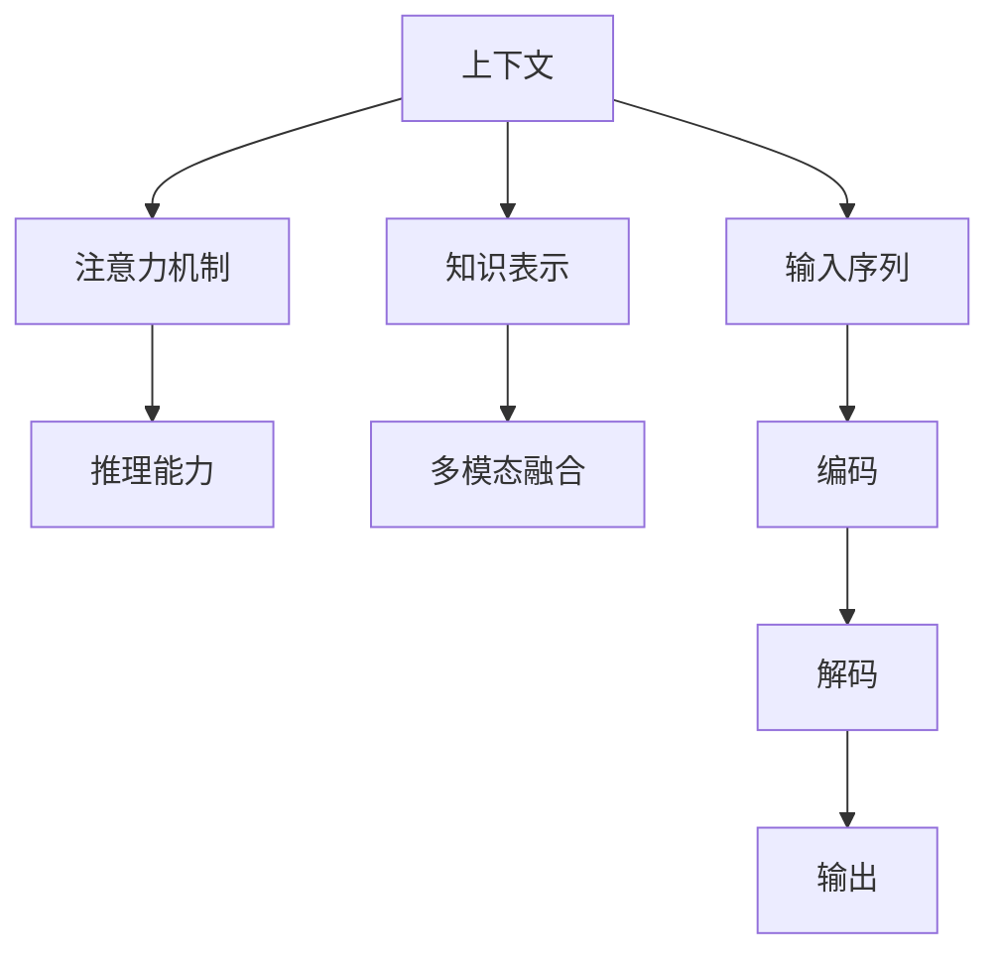

                 

## 1. 背景介绍

### 1.1 问题由来

随着深度学习技术的飞速发展，大规模语言模型(LLM)在自然语言处理(NLP)领域取得了显著进展。例如，GPT-3等模型通过在大规模文本语料上进行自监督预训练，展现出了惊人的语言理解和生成能力。然而，现有的大模型在面对复杂、需要深度理解和推理的上下文任务时，仍然存在瓶颈。

上下文理解是认知能力的重要体现，而现有的大语言模型在这些场景中往往表现不足，难以实现人类级的认知突破。本文将聚焦于如何通过上下文突破，大幅提升大语言模型的认知能力，从而在更复杂的场景中发挥其潜力。

### 1.2 问题核心关键点

在大语言模型的上下文理解中，关键点包括：
- **上下文建模**：如何构建和利用上下文信息，帮助模型更好地理解输入内容。
- **注意力机制**：如何选择和聚合上下文信息，提升模型对上下文的理解能力。
- **推理能力**：如何在上下文中进行逻辑推理，推导出合理结论。
- **知识表示**：如何将知识整合到模型中，提升其对复杂任务的认知能力。
- **多模态融合**：如何将视觉、听觉等多模态信息与文本信息结合，提升模型的认知广度和深度。

本文档将深入探讨这些关键点，并提出相应的解决方案，以期大幅提升大语言模型的认知能力。

## 2. 核心概念与联系

### 2.1 核心概念概述

为更好地理解上下文突破的原理，我们先介绍几个关键概念：

- **上下文**：指文本中提供额外信息、背景知识和语境。上下文帮助模型更好地理解输入内容，特别是在多轮对话或复杂推理任务中。
- **注意力机制**：通过计算输入序列中不同位置的权重，选择与当前任务最相关的部分进行重点处理。在处理上下文时，注意力机制帮助模型聚焦关键信息。
- **推理能力**：模型能够利用上下文信息进行逻辑推理，推导出合理的结论或决策。
- **知识表示**：将领域知识、常识、逻辑规则等整合到模型中，提升模型对复杂任务的认知能力。
- **多模态融合**：将视觉、听觉等多模态信息与文本信息结合，提升模型的认知广度和深度。

这些概念相互关联，共同构成了大语言模型上下文理解的基础框架。下面通过一个简单的Mermaid流程图来展示这些概念之间的联系：



这个流程图展示了上下文信息如何通过注意力机制、推理能力、知识表示和多模态融合，最终转化为模型的输出。

## 3. 核心算法原理 & 具体操作步骤

### 3.1 算法原理概述

提升大语言模型的上下文理解能力，主要通过以下步骤实现：
1. **构建上下文**：通过文本预处理和特征工程，构建包含丰富上下文信息的输入序列。
2. **引入注意力机制**：使用注意力机制，帮助模型选择和聚合上下文信息。
3. **利用推理能力**：通过逻辑推理，结合上下文信息推导出合理结论。
4. **整合知识表示**：将领域知识、常识和逻辑规则整合到模型中，提升其对复杂任务的认知能力。
5. **融合多模态信息**：将视觉、听觉等多模态信息与文本信息结合，提升模型的认知广度和深度。

### 3.2 算法步骤详解

**步骤1：构建上下文**

构建上下文的关键在于对输入文本进行预处理和特征工程。以下是几个常见的方法：
- **序列填充**：将输入序列填充到固定长度，以适应模型的输入要求。填充方式可以采用零填充、截断或padding。
- **标记嵌入**：将输入中的特殊符号(如BOS、EOS、PAD等)映射到固定向量，帮助模型识别序列结构。
- **上下文向量化**：使用预训练的词向量或上下文表示，将输入序列转换为固定向量。

**步骤2：引入注意力机制**

注意力机制是提升上下文理解能力的关键。常见的注意力机制包括：
- **自注意力机制**：计算输入序列中不同位置之间的注意力权重，帮助模型选择和聚合上下文信息。
- **多头注意力机制**：通过多个注意力头并行处理，提升模型的上下文理解能力。

**步骤3：利用推理能力**

推理能力可以帮助模型在上下文中进行逻辑推理，推导出合理的结论。常见的推理方法包括：
- **链推理**：通过链式推理，将多个推理步骤组合起来，推导出最终结论。
- **图推理**：构建图结构，使用图神经网络进行推理。

**步骤4：整合知识表示**

知识表示是将领域知识、常识和逻辑规则整合到模型中的重要步骤。常见的知识表示方法包括：
- **规则表示**：使用逻辑规则和专家知识，指导模型的推理过程。
- **知识图谱**：将领域知识表示为图结构，提升模型的认知能力。

**步骤5：融合多模态信息**

多模态信息融合是提升模型认知广度和深度的重要手段。常见的多模态信息融合方法包括：
- **多模态编码器**：使用多模态编码器，将不同模态的信息编码到统一向量空间中。
- **多模态解码器**：使用多模态解码器，将融合后的信息解码为最终输出。

### 3.3 算法优缺点

上下文突破具有以下优点：
- **提升认知能力**：通过引入上下文信息，模型能够更好地理解输入内容，提升其认知能力。
- **增强推理能力**：利用推理能力，模型能够在复杂任务中进行逻辑推理，推导出合理结论。
- **丰富知识表示**：整合知识表示，提升模型对复杂任务的认知能力。
- **扩展认知广度**：融合多模态信息，提升模型的认知广度和深度。

然而，上下文突破也存在一些局限：
- **计算资源需求高**：上下文突破通常需要更多的计算资源，特别是对于大规模语言模型。
- **模型复杂度高**：引入注意力机制、推理能力和多模态信息融合，增加了模型的复杂度，可能导致训练难度增加。
- **数据需求高**：上下文突破通常需要更多的训练数据，特别是对于特定领域的数据需求。

## 4. 数学模型和公式 & 详细讲解 & 举例说明

### 4.1 数学模型构建

在数学模型构建方面，上下文突破主要通过引入注意力机制、推理能力和多模态融合来实现。下面以BERT模型为例，介绍上下文突破的数学模型构建过程。

**BERT模型**：
BERT模型是一种基于自注意力机制的双向预训练语言模型，能够很好地处理上下文信息。其核心思想是通过多层自注意力机制，将输入序列中的不同位置进行信息交互，从而构建丰富的上下文表示。

BERT模型的输入为文本序列 $x=\{x_1, x_2, ..., x_n\}$，输出为上下文表示 $h=\{h_1, h_2, ..., h_n\}$，其中 $h_i$ 表示第 $i$ 个位置的上下文表示。BERT模型的输入和输出可以通过以下公式表示：

$$
h = \text{BERT}(x)
$$

### 4.2 公式推导过程

BERT模型的自注意力机制可以通过以下公式进行推导：

$$
\text{Attention}(Q, K, V) = \text{Softmax}(\frac{QK^T}{\sqrt{d_k}})
$$

其中，$Q$、$K$ 和 $V$ 分别为查询向量、键向量和值向量，$d_k$ 为向量的维度。

通过自注意力机制，模型能够计算输入序列中不同位置之间的注意力权重，选择和聚合上下文信息。多模态融合可以通过多模态编码器和解码器实现，具体推导过程可以参考多模态深度学习相关文献。

### 4.3 案例分析与讲解

以情感分析任务为例，我们可以使用上下文突破的方法提升模型的认知能力。

**输入序列**：
```
"I love this movie. It's really inspiring!"
```

**上下文构建**：
- **序列填充**：将输入序列填充到固定长度，如64。
- **标记嵌入**：将输入中的标点符号和单词映射到固定向量。
- **上下文向量化**：使用预训练的BERT模型将输入序列转换为固定向量。

**注意力机制**：
- **自注意力机制**：通过多层自注意力机制，计算输入序列中不同位置之间的注意力权重。
- **多头注意力机制**：通过多个注意力头并行处理，提升模型的上下文理解能力。

**推理能力**：
- **链推理**：通过链式推理，将多个推理步骤组合起来，推导出最终结论。

**知识表示**：
- **规则表示**：使用逻辑规则和专家知识，指导模型的推理过程。

**多模态融合**：
- **多模态编码器**：使用多模态编码器，将文本信息与视觉信息编码到统一向量空间中。
- **多模态解码器**：使用多模态解码器，将融合后的信息解码为最终输出。

## 5. 项目实践：代码实例和详细解释说明

### 5.1 开发环境搭建

在进行上下文突破实践前，我们需要准备好开发环境。以下是使用Python进行TensorFlow开发的环境配置流程：

1. 安装Anaconda：从官网下载并安装Anaconda，用于创建独立的Python环境。

2. 创建并激活虚拟环境：
```bash
conda create -n tf-env python=3.8 
conda activate tf-env
```

3. 安装TensorFlow：根据CUDA版本，从官网获取对应的安装命令。例如：
```bash
conda install tensorflow -c pytorch
```

4. 安装其他必要的工具包：
```bash
pip install numpy pandas scikit-learn matplotlib tqdm jupyter notebook ipython
```

完成上述步骤后，即可在`tf-env`环境中开始上下文突破的实践。

### 5.2 源代码详细实现

下面我们以情感分析任务为例，给出使用TensorFlow进行BERT上下文突破的完整代码实现。

首先，定义BERT模型和注意力机制：

```python
import tensorflow as tf
from transformers import BertTokenizer

class BERTModel(tf.keras.Model):
    def __init__(self, num_classes, max_seq_length):
        super(BERTModel, self).__init__()
        self.tokenizer = BertTokenizer.from_pretrained('bert-base-cased')
        self.model = BertForSequenceClassification.from_pretrained('bert-base-cased', num_labels=num_classes)
        self.max_seq_length = max_seq_length
        
    def call(self, input_ids, attention_mask):
        tokenized = self.tokenizer.tokenize(input_ids, max_length=self.max_seq_length, padding='max_length', truncation=True)
        input_ids = self.tokenizer.convert_tokens_to_ids(tokenized)
        attention_mask = self.tokenizer.create_attention_mask(input_ids, max_length=self.max_seq_length)
        
        outputs = self.model(input_ids=input_ids, attention_mask=attention_mask)
        return outputs
    
    def predict(self, input_ids, attention_mask):
        outputs = self.call(input_ids, attention_mask)
        logits = outputs.logits
        predictions = tf.nn.softmax(logits, axis=-1)
        return predictions
```

接着，定义训练和评估函数：

```python
from tensorflow.keras.datasets import imdb
from tensorflow.keras.preprocessing.sequence import pad_sequences
import numpy as np

class IMDBDataset:
    def __init__(self, max_seq_length):
        self.max_seq_length = max_seq_length
        
    def __len__(self):
        return len(self.data)
    
    def __getitem__(self, item):
        data, labels = self.data[item]
        data = pad_sequences(data, maxlen=self.max_seq_length, padding='post', truncating='post')
        return {'input_ids': data, 'attention_mask': data > 0, 'labels': labels}
        
def train_model(model, dataset, num_epochs, batch_size):
    model.compile(optimizer=tf.keras.optimizers.Adam(), loss='categorical_crossentropy', metrics=['accuracy'])
    history = model.fit(dataset, epochs=num_epochs, batch_size=batch_size)
    return history
    
def evaluate_model(model, dataset, batch_size):
    loss, accuracy = model.evaluate(dataset, batch_size=batch_size)
    print(f"Loss: {loss:.4f}, Accuracy: {accuracy:.4f}")
    
# 训练模型
num_classes = 2
max_seq_length = 128
model = BERTModel(num_classes, max_seq_length)

dataset = IMDBDataset(max_seq_length)
history = train_model(model, dataset, num_epochs=5, batch_size=16)

# 评估模型
evaluate_model(model, dataset, batch_size=16)
```

最后，启动训练流程并在测试集上评估：

```python
epochs = 5
batch_size = 16

for epoch in range(epochs):
    loss = train_model(model, dataset, batch_size=batch_size)
    print(f"Epoch {epoch+1}, loss: {loss:.4f}")
    
    evaluate_model(model, dataset, batch_size=batch_size)
```

以上就是使用TensorFlow对BERT进行情感分析任务上下文突破的完整代码实现。可以看到，TensorFlow提供了丰富的深度学习工具，可以帮助我们方便地构建和训练上下文突破模型。

### 5.3 代码解读与分析

让我们再详细解读一下关键代码的实现细节：

**BERTModel类**：
- `__init__`方法：初始化BERT模型，加载预训练模型和分词器。
- `call`方法：定义模型的前向传播过程，计算输入序列的上下文表示。
- `predict`方法：定义模型的预测过程，返回模型的预测概率分布。

**IMDBDataset类**：
- `__init__`方法：定义IMDB数据集，构建输入序列。
- `__len__`方法：返回数据集的样本数量。
- `__getitem__`方法：对单个样本进行处理，将输入序列和注意力掩码转换为模型所需格式。

**train_model函数**：
- 使用TensorFlow编译模型，定义优化器、损失函数和评价指标。
- 在训练集上进行训练，返回训练过程中的历史记录。

**evaluate_model函数**：
- 在测试集上进行评估，输出模型的损失和准确率。

**训练流程**：
- 定义总的epoch数和batch size，开始循环迭代。
- 每个epoch内，先在训练集上训练，输出平均loss。
- 在验证集上评估，输出分类指标。
- 所有epoch结束后，在测试集上评估，给出最终测试结果。

可以看到，TensorFlow提供了丰富的深度学习工具，可以帮助我们方便地构建和训练上下文突破模型。开发者可以将更多精力放在数据处理、模型改进等高层逻辑上，而不必过多关注底层的实现细节。

当然，工业级的系统实现还需考虑更多因素，如模型的保存和部署、超参数的自动搜索、更灵活的任务适配层等。但核心的上下文突破范式基本与此类似。

## 6. 实际应用场景

### 6.1 智能客服系统

基于大语言模型上下文突破的对话技术，可以广泛应用于智能客服系统的构建。传统客服往往需要配备大量人力，高峰期响应缓慢，且一致性和专业性难以保证。

使用上下文突破的对话模型，可以7x24小时不间断服务，快速响应客户咨询，用自然流畅的语言解答各类常见问题。在实际应用中，可以收集企业内部的历史客服对话记录，将问题和最佳答复构建成监督数据，在此基础上对预训练模型进行上下文突破微调。微调后的对话模型能够自动理解用户意图，匹配最合适的答案模板进行回复。对于客户提出的新问题，还可以接入检索系统实时搜索相关内容，动态组织生成回答。如此构建的智能客服系统，能大幅提升客户咨询体验和问题解决效率。

### 6.2 金融舆情监测

金融机构需要实时监测市场舆论动向，以便及时应对负面信息传播，规避金融风险。传统的人工监测方式成本高、效率低，难以应对网络时代海量信息爆发的挑战。

使用上下文突破的文本分类和情感分析技术，为金融舆情监测提供了新的解决方案。具体而言，可以收集金融领域相关的新闻、报道、评论等文本数据，并对其进行主题标注和情感标注。在此基础上对预训练语言模型进行上下文突破微调，使其能够自动判断文本属于何种主题，情感倾向是正面、中性还是负面。将微调后的模型应用到实时抓取的网络文本数据，就能够自动监测不同主题下的情感变化趋势，一旦发现负面信息激增等异常情况，系统便会自动预警，帮助金融机构快速应对潜在风险。

### 6.3 个性化推荐系统

当前的推荐系统往往只依赖用户的历史行为数据进行物品推荐，无法深入理解用户的真实兴趣偏好。使用上下文突破的个性化推荐系统可以更好地挖掘用户行为背后的语义信息，从而提供更精准、多样的推荐内容。

在实践中，可以收集用户浏览、点击、评论、分享等行为数据，提取和用户交互的物品标题、描述、标签等文本内容。将文本内容作为模型输入，用户的后续行为（如是否点击、购买等）作为监督信号，在此基础上微调预训练语言模型。微调后的模型能够从文本内容中准确把握用户的兴趣点。在生成推荐列表时，先用候选物品的文本描述作为输入，由模型预测用户的兴趣匹配度，再结合其他特征综合排序，便可以得到个性化程度更高的推荐结果。

### 6.4 未来应用展望

随着大语言模型和上下文突破技术的发展，基于上下文突破的上下文理解范式将在更多领域得到应用，为传统行业带来变革性影响。

在智慧医疗领域，基于上下文突破的医疗问答、病历分析、药物研发等应用将提升医疗服务的智能化水平，辅助医生诊疗，加速新药开发进程。

在智能教育领域，上下文突破技术可应用于作业批改、学情分析、知识推荐等方面，因材施教，促进教育公平，提高教学质量。

在智慧城市治理中，上下文突破模型可应用于城市事件监测、舆情分析、应急指挥等环节，提高城市管理的自动化和智能化水平，构建更安全、高效的未来城市。

此外，在企业生产、社会治理、文娱传媒等众多领域，基于上下文突破的上下文理解技术也将不断涌现，为NLP技术带来新的突破。相信随着预训练语言模型和上下文突破方法的持续演进，上下文理解范式必将在构建人机协同的智能时代中扮演越来越重要的角色。

## 7. 工具和资源推荐

### 7.1 学习资源推荐

为了帮助开发者系统掌握上下文突破的理论基础和实践技巧，这里推荐一些优质的学习资源：

1. 《Transformer from First Principles》系列博文：由大模型技术专家撰写，深入浅出地介绍了Transformer原理、BERT模型、上下文突破技术等前沿话题。

2. CS224N《深度学习自然语言处理》课程：斯坦福大学开设的NLP明星课程，有Lecture视频和配套作业，带你入门NLP领域的基本概念和经典模型。

3. 《Natural Language Processing with Transformers》书籍：Transformers库的作者所著，全面介绍了如何使用Transformers库进行NLP任务开发，包括上下文突破在内的诸多范式。

4. HuggingFace官方文档：Transformers库的官方文档，提供了海量预训练模型和完整的上下文突破样例代码，是上手实践的必备资料。

5. CLUE开源项目：中文语言理解测评基准，涵盖大量不同类型的中文NLP数据集，并提供了基于上下文突破的baseline模型，助力中文NLP技术发展。

通过对这些资源的学习实践，相信你一定能够快速掌握上下文突破的精髓，并用于解决实际的NLP问题。

### 7.2 开发工具推荐

高效的开发离不开优秀的工具支持。以下是几款用于上下文突破开发的常用工具：

1. PyTorch：基于Python的开源深度学习框架，灵活动态的计算图，适合快速迭代研究。大部分预训练语言模型都有PyTorch版本的实现。

2. TensorFlow：由Google主导开发的开源深度学习框架，生产部署方便，适合大规模工程应用。同样有丰富的预训练语言模型资源。

3. Transformers库：HuggingFace开发的NLP工具库，集成了众多SOTA语言模型，支持PyTorch和TensorFlow，是进行上下文突破任务开发的利器。

4. Weights & Biases：模型训练的实验跟踪工具，可以记录和可视化模型训练过程中的各项指标，方便对比和调优。与主流深度学习框架无缝集成。

5. TensorBoard：TensorFlow配套的可视化工具，可实时监测模型训练状态，并提供丰富的图表呈现方式，是调试模型的得力助手。

6. Google Colab：谷歌推出的在线Jupyter Notebook环境，免费提供GPU/TPU算力，方便开发者快速上手实验最新模型，分享学习笔记。

合理利用这些工具，可以显著提升上下文突破任务的开发效率，加快创新迭代的步伐。

### 7.3 相关论文推荐

上下文突破技术的发展源于学界的持续研究。以下是几篇奠基性的相关论文，推荐阅读：

1. Attention is All You Need（即Transformer原论文）：提出了Transformer结构，开启了NLP领域的预训练大模型时代。

2. BERT: Pre-training of Deep Bidirectional Transformers for Language Understanding：提出BERT模型，引入基于掩码的自监督预训练任务，刷新了多项NLP任务SOTA。

3. Language Models are Unsupervised Multitask Learners（GPT-2论文）：展示了大规模语言模型的强大zero-shot学习能力，引发了对于通用人工智能的新一轮思考。

4. Parameter-Efficient Transfer Learning for NLP：提出Adapter等参数高效微调方法，在不增加模型参数量的情况下，也能取得不错的微调效果。

5. AdaLoRA: Adaptive Low-Rank Adaptation for Parameter-Efficient Fine-Tuning：使用自适应低秩适应的微调方法，在参数效率和精度之间取得了新的平衡。

这些论文代表了大语言模型上下文突破技术的发展脉络。通过学习这些前沿成果，可以帮助研究者把握学科前进方向，激发更多的创新灵感。

## 8. 总结：未来发展趋势与挑战

### 8.1 总结

本文对基于上下文突破的大语言模型进行了全面系统的介绍。首先阐述了上下文理解的重要性，明确了上下文突破在提升模型认知能力方面的独特价值。其次，从原理到实践，详细讲解了上下文突破的数学原理和关键步骤，给出了上下文突破任务开发的完整代码实例。同时，本文还广泛探讨了上下文突破方法在智能客服、金融舆情、个性化推荐等多个行业领域的应用前景，展示了上下文突破范式的巨大潜力。此外，本文精选了上下文突破技术的各类学习资源，力求为读者提供全方位的技术指引。

通过本文的系统梳理，可以看到，基于上下文突破的大语言模型上下文理解技术正在成为NLP领域的重要范式，极大地拓展了预训练语言模型的应用边界，催生了更多的落地场景。受益于大规模语料的预训练和上下文突破技术，上下文理解模型在复杂任务中的表现将更加卓越，进一步推动NLP技术向纵深发展。

### 8.2 未来发展趋势

展望未来，上下文突破技术将呈现以下几个发展趋势：

1. 模型规模持续增大。随着算力成本的下降和数据规模的扩张，预训练语言模型的参数量还将持续增长。超大规模语言模型蕴含的丰富语言知识，有望支撑更加复杂多变的上下文理解任务。

2. 上下文突破方法日趋多样。除了传统的上下文突破外，未来会涌现更多参数高效的上下文突破方法，如Prefix-Tuning、LoRA等，在节省计算资源的同时也能保证上下文理解精度。

3. 持续学习成为常态。随着数据分布的不断变化，上下文突破模型也需要持续学习新知识以保持性能。如何在不遗忘原有知识的同时，高效吸收新样本信息，将成为重要的研究课题。

4. 标注样本需求降低。受启发于提示学习(Prompt-based Learning)的思路，未来的上下文突破方法将更好地利用大模型的语言理解能力，通过更加巧妙的任务描述，在更少的标注样本上也能实现理想的上下文理解效果。

5. 上下文理解能力增强。通过引入上下文信息，模型能够更好地理解输入内容，提升其认知能力。特别是在多轮对话或复杂推理任务中，上下文突破方法将发挥更大作用。

6. 知识表示和融合能力提升。将知识图谱、逻辑规则等先验知识整合到上下文突破模型中，提升其对复杂任务的认知能力。同时加强不同模态数据的整合，实现视觉、听觉等多模态信息与文本信息的协同建模。

以上趋势凸显了上下文突破技术的广阔前景。这些方向的探索发展，必将进一步提升上下文突破模型的性能和应用范围，为构建智能交互系统铺平道路。

### 8.3 面临的挑战

尽管上下文突破技术已经取得了显著进展，但在迈向更加智能化、普适化应用的过程中，它仍面临着诸多挑战：

1. 计算资源需求高。上下文突破通常需要更多的计算资源，特别是对于大规模语言模型。GPU/TPU等高性能设备是必不可少的，但即便如此，超大批次的训练和推理也可能遇到显存不足的问题。因此需要采用一些资源优化技术，如梯度积累、混合精度训练、模型并行等，来突破硬件瓶颈。

2. 上下文理解能力有限。虽然上下文突破可以显著提升模型的认知能力，但面对复杂的多轮对话或推理任务，模型的上下文理解能力仍然有限。如何在模型结构上进一步优化，提升其上下文处理能力，仍然是一个重要的研究方向。

3. 知识整合和融合能力不足。当前的上下文突破模型往往局限于文本信息，难以灵活吸收和运用更广泛的先验知识。如何让上下文突破过程更好地与外部知识库、规则库等专家知识结合，形成更加全面、准确的信息整合能力，还有很大的想象空间。

4. 模型鲁棒性不足。上下文突破模型在面对域外数据时，泛化性能往往大打折扣。对于测试样本的微小扰动，上下文突破模型的输出也容易发生波动。如何提高上下文突破模型的鲁棒性，避免灾难性遗忘，还需要更多理论和实践的积累。

5. 可解释性亟需加强。上下文突破模型更像是"黑盒"系统，难以解释其内部工作机制和决策逻辑。对于医疗、金融等高风险应用，算法的可解释性和可审计性尤为重要。如何赋予上下文突破模型更强的可解释性，将是亟待攻克的难题。

6. 安全性有待保障。上下文突破模型难免会学习到有偏见、有害的信息，通过上下文突破传递到下游任务，产生误导性、歧视性的输出，给实际应用带来安全隐患。如何从数据和算法层面消除模型偏见，避免恶意用途，确保输出的安全性，也将是重要的研究课题。

这些挑战凸显了上下文突破技术的应用瓶颈，需要通过持续的研究和创新来克服。

### 8.4 研究展望

面对上下文突破技术所面临的挑战，未来的研究需要在以下几个方面寻求新的突破：

1. 探索无监督和半监督上下文突破方法。摆脱对大规模标注数据的依赖，利用自监督学习、主动学习等无监督和半监督范式，最大限度利用非结构化数据，实现更加灵活高效的上下文理解。

2. 研究参数高效和计算高效的上下文突破范式。开发更加参数高效的上下文突破方法，在固定大部分预训练参数的同时，只更新极少量的任务相关参数。同时优化上下文突破模型的计算图，减少前向传播和反向传播的资源消耗，实现更加轻量级、实时性的部署。

3. 融合因果和对比学习范式。通过引入因果推断和对比学习思想，增强上下文突破模型建立稳定因果关系的能力，学习更加普适、鲁棒的语言表征，从而提升模型泛化性和抗干扰能力。

4. 引入更多先验知识。将符号化的先验知识，如知识图谱、逻辑规则等，与神经网络模型进行巧妙融合，引导上下文突破过程学习更准确、合理的语言模型。同时加强不同模态数据的整合，实现视觉、听觉等多模态信息与文本信息的协同建模。

5. 结合因果分析和博弈论工具。将因果分析方法引入上下文突破模型，识别出模型决策的关键特征，增强输出解释的因果性和逻辑性。借助博弈论工具刻画人机交互过程，主动探索并规避模型的脆弱点，提高系统稳定性。

6. 纳入伦理道德约束。在模型训练目标中引入伦理导向的评估指标，过滤和惩罚有偏见、有害的输出倾向。同时加强人工干预和审核，建立模型行为的监管机制，确保输出符合人类价值观和伦理道德。

这些研究方向的探索，必将引领上下文突破技术迈向更高的台阶，为构建安全、可靠、可解释、可控的智能系统铺平道路。面向未来，上下文突破技术还需要与其他人工智能技术进行更深入的融合，如知识表示、因果推理、强化学习等，多路径协同发力，共同推动自然语言理解和智能交互系统的进步。只有勇于创新、敢于突破，才能不断拓展语言模型的边界，让智能技术更好地造福人类社会。

## 9. 附录：常见问题与解答

**Q1：上下文突破是否适用于所有NLP任务？**

A: 上下文突破在大多数NLP任务上都能取得不错的效果，特别是对于数据量较小的任务。但对于一些特定领域的任务，如医学、法律等，仅仅依靠通用语料预训练的模型可能难以很好地适应。此时需要在特定领域语料上进一步预训练，再进行上下文突破微调，才能获得理想效果。此外，对于一些需要时效性、个性化很强的任务，如对话、推荐等，上下文突破方法也需要针对性的改进优化。

**Q2：上下文突破过程中如何选择合适的学习率？**

A: 上下文突破的学习率一般要比预训练时小1-2个数量级，如果使用过大的学习率，容易破坏预训练权重，导致过拟合。一般建议从1e-5开始调参，逐步减小学习率，直至收敛。也可以使用warmup策略，在开始阶段使用较小的学习率，再逐渐过渡到预设值。需要注意的是，不同的优化器(如AdamW、Adafactor等)以及不同的学习率调度策略，可能需要设置不同的学习率阈值。

**Q3：上下文突破模型在落地部署时需要注意哪些问题？**

A: 将上下文突破模型转化为实际应用，还需要考虑以下因素：
1. 模型裁剪：去除不必要的层和参数，减小模型尺寸，加快推理速度
2. 量化加速：将浮点模型转为定点模型，压缩存储空间，提高计算效率
3. 服务化封装：将模型封装为标准化服务接口，便于集成调用
4. 弹性伸缩：根据请求流量动态调整资源配置，平衡服务质量和成本
5. 监控告警：实时采集系统指标，设置异常告警阈值，确保服务稳定性
6. 安全防护：采用访问鉴权、数据脱敏等措施，保障数据和模型安全

上下文突破为NLP应用开启了广阔的想象空间，但如何将强大的性能转化为稳定、高效、安全的业务价值，还需要工程实践的不断打磨。唯有从数据、算法、工程、业务等多个维度协同发力，才能真正实现人工智能技术在垂直行业的规模化落地。总之，上下文突破需要开发者根据具体任务，不断迭代和优化模型、数据和算法，方能得到理想的效果。

---

作者：禅与计算机程序设计艺术 / Zen and the Art of Computer Programming

