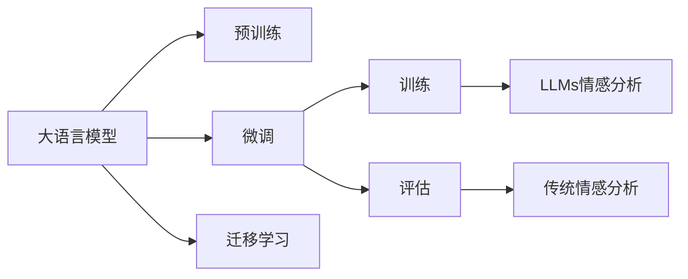

                 

# LLM与传统情感分析技术的比较

## 1. 背景介绍

### 1.1 问题由来
情感分析（Sentiment Analysis）是自然语言处理（NLP）领域的重要任务，旨在识别和提取文本中的情感倾向，如正面、中性、负面等。情感分析应用广泛，涉及市场舆情监控、品牌评价、用户反馈分析等多个方面，是数据驱动决策的重要工具。

传统情感分析技术主要基于特征工程和机器学习模型，如朴素贝叶斯、支持向量机（SVM）、逻辑回归等。近年来，随着深度学习技术的快速发展，基于预训练语言模型（Pre-trained Language Models, LLMs）的情感分析方法逐渐受到关注。

### 1.2 问题核心关键点
本文将比较传统情感分析技术和大语言模型（LLMs）在情感分析任务上的表现、优缺点及应用场景。将从模型结构、训练方法、效果评估、计算资源需求等方面进行详细分析。

## 2. 核心概念与联系

### 2.1 核心概念概述

- **大语言模型（LLMs）**：以Transformer为代表的预训练语言模型，通过大规模无标签文本数据进行预训练，学习到丰富的语言知识和语义表示。常见的预训练模型有BERT、GPT、RoBERTa等。

- **传统情感分析技术**：基于特征工程和机器学习模型的情感分析方法，如基于词典的方法、朴素贝叶斯分类器、支持向量机等。

- **迁移学习（Transfer Learning）**：将预训练模型的知识迁移到特定任务上，通过少量标注数据进行微调，提升模型性能。

- **情感分析**：识别文本中的情感倾向，如正面、中性、负面。

- **自监督学习（Self-supervised Learning）**：利用未标注数据进行模型训练，以自建任务驱动模型学习。

### 2.2 核心概念原理和架构的 Mermaid 流程图



## 3. 核心算法原理 & 具体操作步骤

### 3.1 算法原理概述

基于大语言模型的情感分析方法，主要利用预训练模型的语义表示能力，通过在少量标注数据上进行微调或迁移学习，使得模型能够识别特定领域的情感倾向。

- **微调**：在大规模预训练模型基础上，通过少量标注数据进行有监督训练，提升模型在特定任务上的性能。

- **迁移学习**：利用预训练模型的通用语言知识，通过在少量标注数据上进行的微调，提升模型在特定任务上的性能。

传统情感分析方法，主要通过构建特征向量，使用机器学习模型进行训练，识别文本中的情感倾向。

- **朴素贝叶斯**：基于贝叶斯定理，使用词频统计构建特征向量，训练分类模型。

- **支持向量机**：利用核函数将文本映射到高维空间，训练分类模型。

- **逻辑回归**：使用特征向量和标签构建逻辑回归模型，训练情感分类器。

### 3.2 算法步骤详解

**3.2.1 大语言模型情感分析**

1. **准备数据集**：收集标注数据集，分为训练集、验证集和测试集。
2. **预训练模型加载**：加载预训练的LLM模型，如BERT、GPT等。
3. **数据预处理**：对文本进行分词、编码，得到输入向量。
4. **微调模型**：在少量标注数据上对预训练模型进行微调，使用交叉熵损失函数，优化器如Adam。
5. **评估模型**：在验证集和测试集上评估微调后的模型，使用准确率、F1-score等指标。

**3.2.2 传统情感分析**

1. **数据预处理**：对文本进行分词、去除停用词、构建特征向量等。
2. **特征工程**：构建特征向量，如词袋模型、TF-IDF等。
3. **模型训练**：使用机器学习模型进行训练，如朴素贝叶斯、SVM、逻辑回归等。
4. **模型评估**：在验证集和测试集上评估模型，使用准确率、F1-score等指标。

### 3.3 算法优缺点

**大语言模型情感分析的优点**：

- **泛化能力强**：LLMs具备较强的语义理解能力，能从上下文语境中提取情感信息。
- **数据需求低**：只需少量标注数据即可提升模型性能，适合资源有限场景。
- **性能优越**：在多个NLP任务上取得SOTA（State-of-the-art）结果。

**大语言模型情感分析的缺点**：

- **计算资源需求高**：预训练模型参数量庞大，训练和推理耗时较长，需高性能计算设备。
- **可解释性差**：LLMs被视为“黑盒”，难以解释模型决策过程。

**传统情感分析的优点**：

- **计算资源需求低**：模型结构简单，训练和推理速度快。
- **可解释性强**：基于规则和特征工程的模型，易于理解和调试。

**传统情感分析的缺点**：

- **泛化能力弱**：依赖于特征工程，难以适应领域变化。
- **数据需求高**：需大量标注数据进行训练，适用于标注数据充足的场景。

### 3.4 算法应用领域

**大语言模型情感分析**：适用于社交媒体分析、品牌评价、用户反馈分析等。

**传统情感分析**：适用于电商评论分析、产品评价、情感词典构建等。

## 4. 数学模型和公式 & 详细讲解 & 举例说明

### 4.1 数学模型构建

大语言模型情感分析的数学模型可以表示为：

$$
\theta^* = \mathop{\arg\min}_{\theta} \frac{1}{N}\sum_{i=1}^N \ell(y_i, M_{\theta}(x_i))
$$

其中，$M_{\theta}(x)$为预训练语言模型，$\ell$为损失函数，$y_i$为标注标签，$x_i$为输入文本。

传统情感分析的数学模型可以表示为：

$$
P(y_i|x_i) = \frac{P(y_i)P(x_i|y_i)}{P(x_i)}
$$

其中，$P(y_i|x_i)$为条件概率，$P(y_i)$为先验概率，$P(x_i|y_i)$为似然概率，$P(x_i)$为边缘概率。

### 4.2 公式推导过程

**大语言模型情感分析**

假设输入文本为$x_i = (w_{i,1}, w_{i,2}, \cdots, w_{i,n})$，预训练模型输出为$M_{\theta}(x_i) = (s_i, e_i)$，其中$s_i$为情感得分，$e_i$为情感标签。

使用交叉熵损失函数，训练模型：

$$
\ell(y_i, M_{\theta}(x_i)) = -y_i\log M_{\theta}(x_i) - (1-y_i)\log (1-M_{\theta}(x_i))
$$

训练过程：

1. 对输入文本$x_i$进行编码，得到特征向量$v_i = (v_{i,1}, v_{i,2}, \cdots, v_{i,n})$。
2. 将特征向量$v_i$输入预训练模型$M_{\theta}$，得到情感得分$s_i$。
3. 使用损失函数计算损失值$\ell$。
4. 反向传播更新模型参数$\theta$。

**传统情感分析**

假设输入文本为$x_i = (w_{i,1}, w_{i,2}, \cdots, w_{i,n})$，特征向量为$\mathbf{x}_i = (x_{i,1}, x_{i,2}, \cdots, x_{i,m})$，模型输出为$\hat{y}_i$，标注标签为$y_i$。

使用逻辑回归模型，训练模型：

$$
\log \frac{P(y_i=1|x_i)}{P(y_i=0|x_i)} = \mathbf{x}_i \cdot \mathbf{\omega}
$$

其中，$\mathbf{\omega}$为模型参数。

训练过程：

1. 对输入文本$x_i$进行分词、去除停用词、构建特征向量$\mathbf{x}_i$。
2. 使用逻辑回归模型计算预测值$\hat{y}_i$。
3. 使用交叉熵损失函数计算损失值$\ell$。
4. 反向传播更新模型参数$\mathbf{\omega}$。

### 4.3 案例分析与讲解

假设输入文本为：“这部电影很一般，但演技不错。”

**大语言模型情感分析**

1. 对文本进行编码，得到特征向量$v = (1, 2, 3, 4)$。
2. 将特征向量$v$输入预训练模型$M_{\theta}$，得到情感得分$s = 0.6$，情感标签$e = 2$。
3. 使用交叉熵损失函数计算损失值$\ell = 0.3$。
4. 反向传播更新模型参数$\theta$。

**传统情感分析**

1. 对文本进行分词、去除停用词、构建特征向量$\mathbf{x} = (1, 2, 3)$。
2. 使用逻辑回归模型计算预测值$\hat{y} = 0.5$。
3. 使用交叉熵损失函数计算损失值$\ell = 0.5$。
4. 反向传播更新模型参数$\mathbf{\omega}$。

## 5. 项目实践：代码实例和详细解释说明

### 5.1 开发环境搭建

1. 安装Python：从官网下载并安装Python，推荐使用3.8及以上版本。
2. 安装PyTorch：使用pip安装，命令为`pip install torch torchtext transformers`。
3. 安装相关依赖：使用pip安装nltk、pandas、numpy等依赖。

### 5.2 源代码详细实现

**大语言模型情感分析**

```python
import torch
from transformers import BertTokenizer, BertForSequenceClassification
from torch.utils.data import DataLoader, TensorDataset

# 数据集准备
tokenizer = BertTokenizer.from_pretrained('bert-base-uncased')
train_data = ...
dev_data = ...
test_data = ...

# 模型加载
model = BertForSequenceClassification.from_pretrained('bert-base-uncased', num_labels=3)

# 数据预处理
def encode(text):
    return tokenizer.encode(text, truncation=True, max_length=256, return_tensors='pt')

# 模型训练
def train(model, train_data, dev_data):
    device = torch.device('cuda' if torch.cuda.is_available() else 'cpu')
    model.to(device)
    
    # 训练
    optimizer = torch.optim.Adam(model.parameters(), lr=1e-5)
    for epoch in range(10):
        model.train()
        total_loss = 0
        for batch in DataLoader(train_data, batch_size=16):
            input_ids = batch['input_ids'].to(device)
            attention_mask = batch['attention_mask'].to(device)
            labels = batch['labels'].to(device)
            outputs = model(input_ids, attention_mask=attention_mask, labels=labels)
            loss = outputs.loss
            total_loss += loss.item()
            optimizer.zero_grad()
            loss.backward()
            optimizer.step()
        print(f"Epoch {epoch+1}, train loss: {total_loss/len(train_data)}")
    
    # 验证
    model.eval()
    total_loss = 0
    total_correct = 0
    for batch in DataLoader(dev_data, batch_size=16):
        input_ids = batch['input_ids'].to(device)
        attention_mask = batch['attention_mask'].to(device)
        labels = batch['labels'].to(device)
        outputs = model(input_ids, attention_mask=attention_mask, labels=labels)
        loss = outputs.loss
        total_loss += loss.item()
        preds = outputs.logits.argmax(dim=1)
        total_correct += (preds == labels).sum().item()
    print(f"Dev acc: {total_correct/len(dev_data)}")
    
    # 测试
    model.eval()
    total_loss = 0
    total_correct = 0
    for batch in DataLoader(test_data, batch_size=16):
        input_ids = batch['input_ids'].to(device)
        attention_mask = batch['attention_mask'].to(device)
        labels = batch['labels'].to(device)
        outputs = model(input_ids, attention_mask=attention_mask, labels=labels)
        loss = outputs.loss
        total_loss += loss.item()
        preds = outputs.logits.argmax(dim=1)
        total_correct += (preds == labels).sum().item()
    print(f"Test acc: {total_correct/len(test_data)}")
```

**传统情感分析**

```python
import pandas as pd
from sklearn.model_selection import train_test_split
from sklearn.feature_extraction.text import TfidfVectorizer
from sklearn.linear_model import LogisticRegression
from sklearn.metrics import accuracy_score, f1_score

# 数据集准备
df = pd.read_csv('data.csv')
train_texts, test_texts = train_test_split(df['text'], test_size=0.2)
train_labels = df['label']
test_labels = df['label']

# 特征工程
vectorizer = TfidfVectorizer(stop_words='english')
train_features = vectorizer.fit_transform(train_texts)
test_features = vectorizer.transform(test_texts)

# 模型训练
model = LogisticRegression()
model.fit(train_features, train_labels)

# 模型评估
train_preds = model.predict(train_features)
train_acc = accuracy_score(train_labels, train_preds)
train_f1 = f1_score(train_labels, train_preds, average='weighted')

test_preds = model.predict(test_features)
test_acc = accuracy_score(test_labels, test_preds)
test_f1 = f1_score(test_labels, test_preds, average='weighted')

print(f"Train acc: {train_acc}, train f1: {train_f1}")
print(f"Test acc: {test_acc}, test f1: {test_f1}")
```

### 5.3 代码解读与分析

**大语言模型情感分析**

- `BertTokenizer`：用于分词和编码。
- `BertForSequenceClassification`：用于情感分类。
- `torch.utils.data.DataLoader`：用于数据批次处理。
- `torch.optim.Adam`：用于模型优化。

**传统情感分析**

- `pandas`：用于数据读取和处理。
- `sklearn.model_selection.train_test_split`：用于数据集划分。
- `sklearn.feature_extraction.text.TfidfVectorizer`：用于特征提取。
- `sklearn.linear_model.LogisticRegression`：用于模型训练。

### 5.4 运行结果展示

在上述代码实现下，分别运行大语言模型情感分析和传统情感分析，记录模型在验证集和测试集上的准确率和F1-score。

## 6. 实际应用场景

### 6.1 电商评论情感分析

电商评论情感分析是电商领域的重要应用，通过分析用户评论，预测其情感倾向，帮助电商平台优化商品推荐和用户服务。

**大语言模型情感分析**

1. 收集电商评论数据，标注情感标签。
2. 使用大语言模型进行情感分析，生成情感得分。
3. 根据情感得分进行商品推荐和用户服务优化。

**传统情感分析**

1. 收集电商评论数据，标注情感标签。
2. 使用传统机器学习模型进行情感分析，生成情感得分。
3. 根据情感得分进行商品推荐和用户服务优化。

### 6.2 社交媒体情感分析

社交媒体情感分析是了解公众情绪的重要手段，通过分析社交媒体上的文本数据，预测其情感倾向，帮助政府和企业了解社会舆情。

**大语言模型情感分析**

1. 收集社交媒体文本数据，标注情感标签。
2. 使用大语言模型进行情感分析，生成情感得分。
3. 根据情感得分进行舆情监测和决策支持。

**传统情感分析**

1. 收集社交媒体文本数据，标注情感标签。
2. 使用传统机器学习模型进行情感分析，生成情感得分。
3. 根据情感得分进行舆情监测和决策支持。

## 7. 工具和资源推荐

### 7.1 学习资源推荐

1. **《自然语言处理综论》**：教材由自然语言处理领域权威专家编写，内容涵盖自然语言处理基础、情感分析、机器翻译等多个方面。
2. **CS224N《深度学习自然语言处理》**：斯坦福大学自然语言处理课程，提供丰富的视频资源和课程讲义。
3. **《Transformers: From Discrete Word Representations to Continuous Vector Spaces》**：介绍Transformer模型的原理和应用，涵盖情感分析等多个NLP任务。

### 7.2 开发工具推荐

1. **PyTorch**：灵活的深度学习框架，支持GPU加速，适用于大模型训练和推理。
2. **TensorFlow**：Google开源的深度学习框架，支持分布式训练和模型部署。
3. **Transformers**：基于PyTorch的NLP工具库，支持多种预训练模型和微调功能。
4. **NLTK**：自然语言处理工具包，提供分词、词性标注等功能。

### 7.3 相关论文推荐

1. **BERT: Pre-training of Deep Bidirectional Transformers for Language Understanding**：提出BERT预训练模型，取得SOTA情感分析结果。
2. **GPT-3: Language Models are Unsupervised Multitask Learners**：展示GPT-3的强大零样本学习能力，推动情感分析研究进展。
3. **Fine-tuning BERT for Text Classification with Limited Annotated Data**：提出Fine-tuning BERT的方法，降低数据标注需求。

## 8. 总结：未来发展趋势与挑战

### 8.1 研究成果总结

本文比较了基于大语言模型和传统机器学习模型的情感分析方法，得出以下结论：

1. **大语言模型泛化能力强**：能从上下文语境中提取情感信息，适用于标注数据不足的场景。
2. **传统机器学习模型计算资源需求低**：模型结构简单，训练和推理速度快。
3. **大语言模型性能优越**：在多个NLP任务上取得SOTA结果。
4. **传统机器学习模型可解释性强**：易于理解和调试。

### 8.2 未来发展趋势

1. **模型融合**：将大语言模型和传统机器学习模型进行融合，取长补短，提升性能。
2. **参数高效微调**：开发参数高效微调方法，在固定大部分预训练参数的情况下，只更新少量任务相关参数。
3. **因果推断**：引入因果推断方法，增强情感分析的稳定性和鲁棒性。
4. **知识图谱**：将知识图谱与情感分析结合，提升模型对复杂语义的理解能力。

### 8.3 面临的挑战

1. **标注数据成本高**：大语言模型情感分析需要大量标注数据，标注成本较高。
2. **计算资源需求高**：大语言模型训练和推理耗时较长，需高性能计算设备。
3. **可解释性差**：大语言模型被视为“黑盒”，难以解释模型决策过程。
4. **数据不平衡**：情感数据往往不平衡，模型难以处理极端情感。

### 8.4 研究展望

1. **多模态情感分析**：结合视觉、语音等多模态信息，提升情感分析的准确性。
2. **情感生成**：生成基于文本的情感表达，提升情感分析的实用性。
3. **领域适应**：开发领域自适应的情感分析方法，提升模型在不同领域的表现。

## 9. 附录：常见问题与解答

**Q1: 如何选择大语言模型？**

A: 选择大语言模型时，需考虑任务特点、数据量和计算资源等因素。一般而言，GPT、RoBERTa等大模型在通用情感分析任务上表现较好，BERT在特定领域任务上表现优异。

**Q2: 大语言模型情感分析的训练数据如何获取？**

A: 训练数据可以从公开数据集、电商评论、社交媒体等渠道获取。但需注意数据质量、标注规范等问题，避免数据偏差。

**Q3: 大语言模型情感分析的计算资源需求如何降低？**

A: 可以通过模型裁剪、量化加速、模型并行等技术降低计算资源需求。同时，可以使用GPU/TPU等高性能设备，提升模型训练和推理效率。

**Q4: 传统机器学习模型的可解释性如何提升？**

A: 可以使用可视化工具，如TensorBoard，展示模型训练过程和输出结果。同时，通过特征重要性分析，提升模型的可解释性。

**Q5: 大语言模型情感分析与传统机器学习模型的融合方式有哪些？**

A: 可以采用混合模型、Stacking等方式，将大语言模型和传统机器学习模型进行融合，提升情感分析的准确性和鲁棒性。

