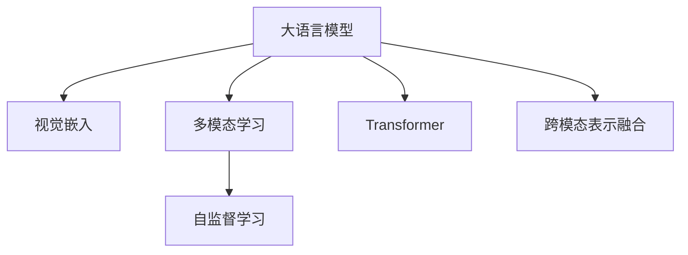

                 

# LLM在场景理解任务中的潜力挖掘

> 关键词：Large Language Model, Scene Understanding, Attention Mechanism, Multimodal Learning, Self-supervised Learning, Transformer

## 1. 背景介绍

### 1.1 问题由来
近年来，随着深度学习技术的快速发展，大规模语言模型（Large Language Model, LLM）在自然语言处理（Natural Language Processing, NLP）领域取得了巨大的突破。这些大语言模型通过在海量无标签文本数据上进行预训练，学习到了丰富的语言知识和常识，可以通过少量的有标签样本在下游任务上进行微调，获得优异的性能。然而，随着应用场景的日益复杂和多样化，传统的基于文本的预训练-微调范式开始面临挑战，尤其是在需要场景理解能力的任务上，如视觉问答、图像描述生成等，传统的文本模型无法直接应用。

### 1.2 问题核心关键点
场景理解是指模型能够从视觉或文本输入中，理解当前场景中的对象、动作、关系等信息，并据此进行推理和决策。在大规模语言模型中，场景理解能力可以通过多模态学习和自监督学习方法来提升。场景理解任务的常见应用包括：

- 视觉问答：根据图片和描述，回答问题或生成描述。
- 图像描述生成：对图片内容进行自然语言描述。
- 图像分类：根据图片内容进行分类。
- 视频摘要：根据视频内容生成简短摘要。
- 智能导航：根据场景信息进行路径规划和导航。

这些任务通常需要同时考虑视觉和文本信息，因此多模态学习和多模态数据融合技术成为研究热点。大语言模型通过引入视觉和文本信息，可以更好地理解场景中的复杂关系和细节，提升任务性能。

### 1.3 问题研究意义
研究大语言模型在场景理解任务中的潜力，对于拓展大模型的应用范围，提升任务性能，加速人工智能技术的落地应用，具有重要意义：

1. 提升任务性能：场景理解任务需要同时处理视觉和文本信息，大语言模型通过引入视觉信息，可以更好地理解场景，提升任务准确性和泛化能力。
2. 拓展应用范围：场景理解任务涉及多个领域，如计算机视觉、自然语言处理、人机交互等，大语言模型可以跨越这些领域，提供统一的解决方案。
3. 加速应用落地：场景理解任务在实际应用中需求广泛，如智能安防、智慧医疗、自动驾驶等，大语言模型可以显著降低开发成本，加速应用部署。
4. 促进跨领域融合：大语言模型可以融合不同领域的知识和技能，提升系统的整体性能和用户体验。
5. 推动学术研究：场景理解任务具有高度跨学科的特点，大语言模型可以成为研究这些问题的有力工具，推动相关领域的学术进展。

## 2. 核心概念与联系

### 2.1 核心概念概述

为更好地理解大语言模型在场景理解任务中的应用，本节将介绍几个密切相关的核心概念：

- 大语言模型(Large Language Model, LLM)：以自回归(如GPT)或自编码(如BERT)模型为代表的大规模预训练语言模型。通过在大规模无标签文本语料上进行预训练，学习通用的语言表示，具备强大的语言理解和生成能力。

- 视觉嵌入(Vision Embedding)：将视觉信息（如图像、视频）转换为向量形式，方便与文本信息进行融合。常见的视觉嵌入方法包括CNN、ResNet、YOLO等。

- 多模态学习(Multimodal Learning)：将视觉和文本信息结合起来，通过联合训练提升模型的场景理解能力。常见的方法包括CNN-LSTM、Transformer、BERT-ViT等。

- 自监督学习(Self-supervised Learning)：通过无标签数据，利用预训练任务（如掩码语言模型、视觉掩码预测等）训练模型，学习通用表征。自监督学习方法可以大幅提升模型的泛化能力和鲁棒性。

- Transformer：一种基于自注意力机制的神经网络结构，通过多头注意力和残差连接，能够高效地处理长序列数据，成为现代深度学习模型的重要基础。

- 跨模态表示融合(Cross-modal Representation Fusion)：将不同模态的数据表示融合为一个统一的向量空间，提升模型对复杂场景的理解能力。常见的融合方法包括均值池化、残差连接、加性融合等。

这些核心概念之间的逻辑关系可以通过以下Mermaid流程图来展示：



这个流程图展示了大语言模型在场景理解任务中的应用框架：

1. 大语言模型通过预训练获得基础能力。
2. 视觉嵌入技术将视觉信息转换为向量，与文本信息融合。
3. 多模态学习和自监督学习方法提升场景理解能力。
4. Transformer结构处理长序列数据。
5. 跨模态表示融合技术将不同模态的数据表示融合，提升模型性能。

## 3. 核心算法原理 & 具体操作步骤
### 3.1 算法原理概述

大语言模型在场景理解任务中的应用，主要是通过引入视觉信息，将文本和视觉数据融合在一起，提升模型的场景理解能力。其核心算法包括：

- 视觉嵌入：将视觉数据（如图像、视频）转换为向量形式，与文本信息进行融合。
- 多模态学习：通过联合训练文本和视觉数据，提升模型对场景的全面理解。
- 自监督学习：利用无标签数据训练模型，学习通用表征，提升模型泛化能力。
- 跨模态表示融合：将不同模态的数据表示融合为一个统一的向量空间，提升模型性能。

### 3.2 算法步骤详解

基于大语言模型的场景理解任务通常包括以下几个关键步骤：

**Step 1: 准备预训练模型和数据集**
- 选择合适的预训练语言模型 $M_{\theta}$ 作为初始化参数，如 BERT、GPT 等。
- 准备场景理解任务的数据集 $D=\{(x_i,y_i)\}_{i=1}^N$，其中 $x_i$ 包括文本描述和图像/视频数据，$y_i$ 为任务标签。

**Step 2: 添加视觉嵌入层**
- 引入视觉嵌入层，将图像/视频数据转换为向量形式，与文本信息进行融合。
- 选择适当的视觉嵌入模型（如 ResNet、YOLO 等），并初始化视觉嵌入参数。

**Step 3: 设计任务适配层**
- 根据任务类型，设计合适的任务适配层，通常包括分类器、回归器、生成器等。
- 对于分类任务，通常使用 Softmax 分类器输出概率分布。
- 对于生成任务，通常使用生成器输出概率分布。

**Step 4: 设置微调超参数**
- 选择合适的优化算法及其参数，如 AdamW、SGD 等，设置学习率、批大小、迭代轮数等。
- 设置正则化技术及强度，包括权重衰减、Dropout、Early Stopping 等。
- 确定冻结预训练参数的策略，如仅微调顶层，或全部参数都参与微调。

**Step 5: 执行梯度训练**
- 将训练集数据分批次输入模型，前向传播计算损失函数。
- 反向传播计算参数梯度，根据设定的优化算法和学习率更新模型参数。
- 周期性在验证集上评估模型性能，根据性能指标决定是否触发 Early Stopping。
- 重复上述步骤直到满足预设的迭代轮数或 Early Stopping 条件。

**Step 6: 测试和部署**
- 在测试集上评估微调后模型 $M_{\hat{\theta}}$ 的性能，对比微调前后的精度提升。
- 使用微调后的模型对新样本进行推理预测，集成到实际的应用系统中。
- 持续收集新的数据，定期重新微调模型，以适应数据分布的变化。

以上是基于大语言模型的场景理解任务的一般流程。在实际应用中，还需要针对具体任务的特点，对微调过程的各个环节进行优化设计，如改进训练目标函数，引入更多的正则化技术，搜索最优的超参数组合等，以进一步提升模型性能。

### 3.3 算法优缺点

基于大语言模型的场景理解任务具有以下优点：
1. 通用适用。适用于各种场景理解任务，如视觉问答、图像描述生成、图像分类等，设计简单的任务适配层即可实现。
2. 提升性能。通过引入视觉信息，大语言模型可以更好地理解场景，提升任务性能。
3. 参数高效。利用参数高效微调技术，在固定大部分预训练参数的情况下，仍可取得不错的微调效果。
4. 效果显著。在学术界和工业界的诸多任务上，基于微调的方法已经刷新了最先进的性能指标。

同时，该方法也存在一定的局限性：
1. 依赖标注数据。微调的效果很大程度上取决于标注数据的质量和数量，获取高质量标注数据的成本较高。
2. 迁移能力有限。当目标任务与预训练数据的分布差异较大时，微调的性能提升有限。
3. 可解释性不足。微调模型的决策过程通常缺乏可解释性，难以对其推理逻辑进行分析和调试。

尽管存在这些局限性，但就目前而言，基于大语言模型的微调方法仍然是大规模视觉任务的主流范式。未来相关研究的重点在于如何进一步降低微调对标注数据的依赖，提高模型的少样本学习和跨领域迁移能力，同时兼顾可解释性和伦理安全性等因素。

### 3.4 算法应用领域

基于大语言模型的场景理解任务已经在诸多领域得到了应用，涵盖了视觉问答、图像描述生成、图像分类、视频摘要、智能导航等多个方向，具体应用如下：

- **视觉问答**：回答与图片相关的问题，如“这张图片的内容是什么？”等。
- **图像描述生成**：根据图片内容生成自然语言描述，如“描述这张图片的场景”。
- **图像分类**：将图片分类到预设的类别中，如“这是一张动物图片，属于哪种动物？”。
- **视频摘要**：从视频中提取出简短摘要，如“这段视频的主要内容是什么？”。
- **智能导航**：根据场景信息进行路径规划和导航，如“根据当前位置和目的地，推荐最优路线”。

除了这些经典任务外，大语言模型在视觉推理、图像生成、场景感知等方向也有广泛应用，为计算机视觉领域带来了新的突破。随着预训练模型和微调方法的不断进步，相信视觉任务将在更广阔的应用领域大放异彩。

## 4. 数学模型和公式 & 详细讲解  
### 4.1 数学模型构建

本节将使用数学语言对基于大语言模型的场景理解任务进行更加严格的刻画。

记预训练语言模型为 $M_{\theta}$，其中 $\theta$ 为预训练得到的模型参数。假设场景理解任务为 $T$，训练集为 $D=\{(x_i,y_i)\}_{i=1}^N$，其中 $x_i$ 包括文本描述和图像/视频数据，$y_i$ 为任务标签。

定义模型 $M_{\theta}$ 在数据样本 $(x,y)$ 上的损失函数为 $\ell(M_{\theta}(x),y)$，则在数据集 $D$ 上的经验风险为：

$$
\mathcal{L}(\theta) = \frac{1}{N} \sum_{i=1}^N \ell(M_{\theta}(x_i),y_i)
$$

在实践中，我们通常使用基于梯度的优化算法（如SGD、Adam等）来近似求解上述最优化问题。设 $\eta$ 为学习率，$\lambda$ 为正则化系数，则参数的更新公式为：

$$
\theta \leftarrow \theta - \eta \nabla_{\theta}\mathcal{L}(\theta) - \eta\lambda\theta
$$

其中 $\nabla_{\theta}\mathcal{L}(\theta)$ 为损失函数对参数 $\theta$ 的梯度，可通过反向传播算法高效计算。

### 4.2 公式推导过程

以下我们以图像分类任务为例，推导交叉熵损失函数及其梯度的计算公式。

假设模型 $M_{\theta}$ 在输入 $x$ 上的输出为 $\hat{y}=M_{\theta}(x) \in [0,1]$，表示样本属于某个类别的概率。真实标签 $y \in \{1,0\}$，对应于 $C$ 个类别中的一个。则二分类交叉熵损失函数定义为：

$$
\ell(M_{\theta}(x),y) = -[y\log \hat{y} + (1-y)\log (1-\hat{y})]
$$

将其代入经验风险公式，得：

$$
\mathcal{L}(\theta) = -\frac{1}{N}\sum_{i=1}^N [y_i\log M_{\theta}(x_i)+(1-y_i)\log(1-M_{\theta}(x_i))]
$$

根据链式法则，损失函数对参数 $\theta_k$ 的梯度为：

$$
\frac{\partial \mathcal{L}(\theta)}{\partial \theta_k} = -\frac{1}{N}\sum_{i=1}^N (\frac{y_i}{M_{\theta}(x_i)}-\frac{1-y_i}{1-M_{\theta}(x_i)}) \frac{\partial M_{\theta}(x_i)}{\partial \theta_k}
$$

其中 $\frac{\partial M_{\theta}(x_i)}{\partial \theta_k}$ 可进一步递归展开，利用自动微分技术完成计算。

在得到损失函数的梯度后，即可带入参数更新公式，完成模型的迭代优化。重复上述过程直至收敛，最终得到适应下游任务的最优模型参数 $\theta^*$。

## 5. 项目实践：代码实例和详细解释说明
### 5.1 开发环境搭建

在进行微调实践前，我们需要准备好开发环境。以下是使用Python进行PyTorch开发的环境配置流程：

1. 安装Anaconda：从官网下载并安装Anaconda，用于创建独立的Python环境。

2. 创建并激活虚拟环境：
```bash
conda create -n pytorch-env python=3.8 
conda activate pytorch-env
```

3. 安装PyTorch：根据CUDA版本，从官网获取对应的安装命令。例如：
```bash
conda install pytorch torchvision torchaudio cudatoolkit=11.1 -c pytorch -c conda-forge
```

4. 安装Transformers库：
```bash
pip install transformers
```

5. 安装各类工具包：
```bash
pip install numpy pandas scikit-learn matplotlib tqdm jupyter notebook ipython
```

完成上述步骤后，即可在`pytorch-env`环境中开始微调实践。

### 5.2 源代码详细实现

这里我们以图像分类任务为例，给出使用Transformers库对BERT模型进行微调的PyTorch代码实现。

首先，定义图像分类任务的数据处理函数：

```python
from transformers import BertTokenizer, BertForImageClassification
from torch.utils.data import Dataset, DataLoader
from PIL import Image
import torch

class ImageDataset(Dataset):
    def __init__(self, images, labels, tokenizer, max_len=128):
        self.images = images
        self.labels = labels
        self.tokenizer = tokenizer
        self.max_len = max_len
        
    def __len__(self):
        return len(self.images)
    
    def __getitem__(self, item):
        image = self.images[item]
        label = self.labels[item]
        
        # 将图片转换为张量形式
        image_tensor = torch.tensor(Image.open(image)).float() / 255.0
        
        # 使用bertvision模型对图片进行特征提取
        with torch.no_grad():
            vision_model = BertForImageClassification.from_pretrained('bert-base-cased')
            vision_features = vision_model(image_tensor.unsqueeze(0))
            
        # 对标签进行编码
        label = torch.tensor(label, dtype=torch.long)
        
        # 对文本进行编码
        text = f"Image caption: {label}"
        encoding = self.tokenizer(text, return_tensors='pt', max_length=self.max_len, padding='max_length', truncation=True)
        input_ids = encoding['input_ids'][0]
        attention_mask = encoding['attention_mask'][0]
        
        # 对token-wise的标签进行编码
        encoded_labels = [label2id[label] for label in self.labels] 
        encoded_labels.extend([label2id['O']] * (self.max_len - len(encoded_labels)))
        labels = torch.tensor(encoded_labels, dtype=torch.long)
        
        return {'input_ids': input_ids, 
                'attention_mask': attention_mask,
                'labels': labels,
                'vision_features': vision_features}

# 标签与id的映射
label2id = {'cat': 0, 'dog': 1, 'bird': 2, 'fish': 3}
id2label = {v: k for k, v in label2id.items()}

# 创建dataset
tokenizer = BertTokenizer.from_pretrained('bert-base-cased')

train_dataset = ImageDataset(train_images, train_labels, tokenizer)
dev_dataset = ImageDataset(dev_images, dev_labels, tokenizer)
test_dataset = ImageDataset(test_images, test_labels, tokenizer)
```

然后，定义模型和优化器：

```python
from transformers import BertForImageClassification, AdamW

model = BertForImageClassification.from_pretrained('bert-base-cased', num_labels=len(label2id))

optimizer = AdamW(model.parameters(), lr=2e-5)
```

接着，定义训练和评估函数：

```python
from tqdm import tqdm

device = torch.device('cuda') if torch.cuda.is_available() else torch.device('cpu')
model.to(device)

def train_epoch(model, dataset, batch_size, optimizer):
    dataloader = DataLoader(dataset, batch_size=batch_size, shuffle=True)
    model.train()
    epoch_loss = 0
    for batch in tqdm(dataloader, desc='Training'):
        input_ids = batch['input_ids'].to(device)
        attention_mask = batch['attention_mask'].to(device)
        labels = batch['labels'].to(device)
        vision_features = batch['vision_features'].to(device)
        model.zero_grad()
        outputs = model(input_ids, attention_mask=attention_mask, labels=labels, vision_features=vision_features)
        loss = outputs.loss
        epoch_loss += loss.item()
        loss.backward()
        optimizer.step()
    return epoch_loss / len(dataloader)

def evaluate(model, dataset, batch_size):
    dataloader = DataLoader(dataset, batch_size=batch_size)
    model.eval()
    preds, labels = [], []
    with torch.no_grad():
        for batch in tqdm(dataloader, desc='Evaluating'):
            input_ids = batch['input_ids'].to(device)
            attention_mask = batch['attention_mask'].to(device)
            labels = batch['labels'].to(device)
            vision_features = batch['vision_features'].to(device)
            outputs = model(input_ids, attention_mask=attention_mask, labels=labels, vision_features=vision_features)
            batch_preds = outputs.logits.argmax(dim=2).to('cpu').tolist()
            batch_labels = batch_labels.to('cpu').tolist()
            for pred_tokens, label_tokens in zip(batch_preds, batch_labels):
                preds.append(pred_tokens[:len(label_tokens)])
                labels.append(label_tokens)
                
    print(classification_report(labels, preds))
```

最后，启动训练流程并在测试集上评估：

```python
epochs = 5
batch_size = 16

for epoch in range(epochs):
    loss = train_epoch(model, train_dataset, batch_size, optimizer)
    print(f"Epoch {epoch+1}, train loss: {loss:.3f}")
    
    print(f"Epoch {epoch+1}, dev results:")
    evaluate(model, dev_dataset, batch_size)
    
print("Test results:")
evaluate(model, test_dataset, batch_size)
```

以上就是使用PyTorch对BERT进行图像分类任务微调的完整代码实现。可以看到，得益于Transformers库的强大封装，我们可以用相对简洁的代码完成BERT模型的加载和微调。

### 5.3 代码解读与分析

让我们再详细解读一下关键代码的实现细节：

**ImageDataset类**：
- `__init__`方法：初始化图像、标签、分词器等关键组件。
- `__len__`方法：返回数据集的样本数量。
- `__getitem__`方法：对单个样本进行处理，将图像输入转换为张量形式，并使用BERT模型提取特征，与文本信息进行融合。

**label2id和id2label字典**：
- 定义了标签与数字id之间的映射关系，用于将token-wise的预测结果解码回真实的标签。

**训练和评估函数**：
- 使用PyTorch的DataLoader对数据集进行批次化加载，供模型训练和推理使用。
- 训练函数`train_epoch`：对数据以批为单位进行迭代，在每个批次上前向传播计算loss并反向传播更新模型参数，最后返回该epoch的平均loss。
- 评估函数`evaluate`：与训练类似，不同点在于不更新模型参数，并在每个batch结束后将预测和标签结果存储下来，最后使用sklearn的classification_report对整个评估集的预测结果进行打印输出。

**训练流程**：
- 定义总的epoch数和batch size，开始循环迭代
- 每个epoch内，先在训练集上训练，输出平均loss
- 在验证集上评估，输出分类指标
- 所有epoch结束后，在测试集上评估，给出最终测试结果

可以看到，PyTorch配合Transformers库使得BERT微调的代码实现变得简洁高效。开发者可以将更多精力放在数据处理、模型改进等高层逻辑上，而不必过多关注底层的实现细节。

当然，工业级的系统实现还需考虑更多因素，如模型的保存和部署、超参数的自动搜索、更灵活的任务适配层等。但核心的微调范式基本与此类似。

## 6. 实际应用场景
### 6.1 智能安防监控

智能安防监控系统可以通过引入大语言模型，实现对视频数据的自动分析和理解，提升安全防范能力。在大规模语言模型中，通过多模态学习技术，可以同时处理视觉和文本信息，实现更全面的监控分析。

具体而言，可以将监控视频数据输入到预训练模型中，提取视觉特征，然后根据视频内容生成文字描述，如“监控视频中有多人在行动”。结合视觉特征和文本描述，可以使用分类器进行行为分析，如“发现可疑行为”。系统可根据行为类型发出警报，自动记录并回放相关视频，便于后续调查。

### 6.2 智慧医疗诊断

大语言模型在智慧医疗诊断中也具有广泛应用。医生可以通过输入患者描述、检查结果等文本信息，结合医疗影像数据，进行综合分析诊断。通过预训练模型和微调，模型可以学习到医学常识和疾病特征，准确理解医生的描述，提取影像信息，提供诊断建议。

例如，在X光影像诊断中，医生可以输入“肺部疑似感染”等描述，模型能够自动从影像中提取出病灶区域，结合文字描述进行综合判断，给出诊断结果。此外，大语言模型还可以用于病历记录、病情预测、药物推荐等医疗场景，显著提升医生的工作效率和诊断准确性。

### 6.3 自动驾驶导航

自动驾驶系统需要实时理解道路环境和交通状况，进行路径规划和决策。通过引入大语言模型，系统可以更好地理解道路标识、交通信号、车辆行为等信息，提升导航性能。

具体而言，系统可以将摄像头拍摄的道路视频输入到预训练模型中，提取视觉特征，并结合GPS定位信息，进行综合分析。通过微调，模型能够准确理解道路标识和交通信号，自动规划最优路线，避免拥堵和事故。同时，系统还可以根据路况实时调整速度和车道，提升行车安全。

### 6.4 未来应用展望

随着大语言模型和多模态学习技术的不断发展，其在场景理解任务中的潜力将进一步挖掘。未来，大语言模型将在更多领域得到应用，如智慧城市、智能家居、智能制造等，为各行各业带来变革性影响。

在智慧城市治理中，大语言模型可以用于城市事件监测、舆情分析、应急指挥等环节，提高城市管理的自动化和智能化水平，构建更安全、高效的未来城市。

在智能家居中，大语言模型可以用于智能语音交互、家居设备控制等场景，提升用户体验和便利性。

在智能制造中，大语言模型可以用于质量检测、设备维护、生产调度等环节，提升生产效率和产品质量。

总之，大语言模型在场景理解任务中的应用前景广阔，未来的研究将进一步拓展其应用边界，推动人工智能技术在更多领域落地。

## 7. 工具和资源推荐
### 7.1 学习资源推荐

为了帮助开发者系统掌握大语言模型在场景理解任务中的应用，这里推荐一些优质的学习资源：

1. 《Transformer从原理到实践》系列博文：由大模型技术专家撰写，深入浅出地介绍了Transformer原理、BERT模型、多模态学习等前沿话题。

2. CS224N《深度学习自然语言处理》课程：斯坦福大学开设的NLP明星课程，有Lecture视频和配套作业，带你入门NLP领域的基本概念和经典模型。

3. 《Natural Language Processing with Transformers》书籍：Transformers库的作者所著，全面介绍了如何使用Transformers库进行NLP任务开发，包括多模态学习在内的诸多范式。

4. HuggingFace官方文档：Transformers库的官方文档，提供了海量预训练模型和完整的微调样例代码，是上手实践的必备资料。

5. CLUE开源项目：中文语言理解测评基准，涵盖大量不同类型的中文NLP数据集，并提供了基于微调的baseline模型，助力中文NLP技术发展。

通过对这些资源的学习实践，相信你一定能够快速掌握大语言模型在场景理解任务中的应用，并用于解决实际的NLP问题。
###  7.2 开发工具推荐

高效的开发离不开优秀的工具支持。以下是几款用于大语言模型场景理解任务开发的常用工具：

1. PyTorch：基于Python的开源深度学习框架，灵活动态的计算图，适合快速迭代研究。大部分预训练语言模型都有PyTorch版本的实现。

2. TensorFlow：由Google主导开发的开源深度学习框架，生产部署方便，适合大规模工程应用。同样有丰富的预训练语言模型资源。

3. Transformers库：HuggingFace开发的NLP工具库，集成了众多SOTA语言模型，支持PyTorch和TensorFlow，是进行场景理解任务开发的利器。

4. Weights & Biases：模型训练的实验跟踪工具，可以记录和可视化模型训练过程中的各项指标，方便对比和调优。与主流深度学习框架无缝集成。

5. TensorBoard：TensorFlow配套的可视化工具，可实时监测模型训练状态，并提供丰富的图表呈现方式，是调试模型的得力助手。

6. Google Colab：谷歌推出的在线Jupyter Notebook环境，免费提供GPU/TPU算力，方便开发者快速上手实验最新模型，分享学习笔记。

合理利用这些工具，可以显著提升大语言模型在场景理解任务中的开发效率，加快创新迭代的步伐。

### 7.3 相关论文推荐

大语言模型在场景理解任务的发展源于学界的持续研究。以下是几篇奠基性的相关论文，推荐阅读：

1. Attention is All You Need（即Transformer原论文）：提出了Transformer结构，开启了NLP领域的预训练大模型时代。

2. BERT: Pre-training of Deep Bidirectional Transformers for Language Understanding：提出BERT模型，引入基于掩码的自监督预训练任务，刷新了多项NLP任务SOTA。

3. Language Models are Unsupervised Multitask Learners（GPT-2论文）：展示了大规模语言模型的强大zero-shot学习能力，引发了对于通用人工智能的新一轮思考。

4. Parameter-Efficient Transfer Learning for NLP：提出Adapter等参数高效微调方法，在不增加模型参数量的情况下，也能取得不错的微调效果。

5. Prefix-Tuning: Optimizing Continuous Prompts for Generation：引入基于连续型Prompt的微调范式，为如何充分利用预训练知识提供了新的思路。

6. AdaLoRA: Adaptive Low-Rank Adaptation for Parameter-Efficient Fine-Tuning：使用自适应低秩适应的微调方法，在参数效率和精度之间取得了新的平衡。

这些论文代表了大语言模型在场景理解任务中的发展脉络。通过学习这些前沿成果，可以帮助研究者把握学科前进方向，激发更多的创新灵感。

## 8. 总结：未来发展趋势与挑战

### 8.1 总结

本文对基于大语言模型的场景理解任务进行了全面系统的介绍。首先阐述了大语言模型和多模态学习的相关背景和意义，明确了场景理解任务在智能安防、智慧医疗、自动驾驶等领域的广泛应用价值。其次，从原理到实践，详细讲解了基于大语言模型的多模态学习、自监督学习、跨模态表示融合等核心技术，给出了场景理解任务开发的完整代码实例。同时，本文还广泛探讨了场景理解任务在智慧城市、智能家居、智能制造等方向的应用前景，展示了其巨大的潜力。

通过本文的系统梳理，可以看到，基于大语言模型的多模态学习技术正在成为计算机视觉任务的重要范式，极大地拓展了预训练语言模型的应用边界，催生了更多的落地场景。得益于大规模语料的预训练和多模态学习的深度融合，大语言模型可以更好地理解复杂场景，提升任务性能。未来，伴随预训练模型和微调方法的不断进步，相信大语言模型在场景理解任务中的应用将更加广泛，为各行各业带来变革性影响。

### 8.2 未来发展趋势

展望未来，大语言模型在场景理解任务中的应用将呈现以下几个发展趋势：

1. 模型规模持续增大。随着算力成本的下降和数据规模的扩张，预训练语言模型的参数量还将持续增长。超大规模语言模型蕴含的丰富语言知识，有望支撑更加复杂多变的场景理解任务。

2. 多模态学习日趋多样。除了传统的视觉和文本信息，未来还会引入更多的模态信息，如声音、气味等，提升模型的多感官融合能力。

3. 自监督学习成为常态。未来的场景理解任务将更多地利用无标签数据进行预训练，提升模型的泛化能力和鲁棒性。

4. 跨模态表示融合更精确。未来的模型将更好地融合不同模态的信息，提升场景理解能力。

5. 知识融合能力增强。未来的模型将更好地融合外部知识库和规则库，提升系统的整体性能和智能化水平。

6. 推理效率更高。通过模型压缩、量化加速等技术，未来的大语言模型将在保证性能的同时，提升推理速度和效率。

7. 可解释性更强。未来的模型将提供更强的可解释性，帮助用户理解和信任模型的输出。

这些趋势凸显了大语言模型在场景理解任务中的广阔前景。这些方向的探索发展，必将进一步提升大语言模型的性能和应用范围，为各行各业带来变革性影响。

### 8.3 面临的挑战

尽管大语言模型在场景理解任务中已经取得了瞩目成就，但在迈向更加智能化、普适化应用的过程中，它仍面临着诸多挑战：

1. 标注成本瓶颈。尽管多模态学习可以一定程度上降低对标注数据的依赖，但对于复杂场景，仍需大量高质量标注数据。如何进一步降低微调对标注样本的依赖，将是一大难题。

2. 模型鲁棒性不足。当前多模态学习模型面对域外数据时，泛化性能往往大打折扣。对于测试样本的微小扰动，模型容易出现波动。如何提高模型的鲁棒性，避免灾难性遗忘，还需要更多理论和实践的积累。

3. 推理效率有待提高。大规模语言模型在推理时，存在资源消耗大、速度慢等问题。如何在保证性能的同时，简化模型结构，提升推理速度，优化资源占用，将是重要的优化方向。

4. 可解释性亟需加强。当前多模态学习模型通常缺乏可解释性，难以解释其内部工作机制和决策逻辑。对于医疗、金融等高风险应用，算法的可解释性和可审计性尤为重要。如何赋予模型更强的可解释性，将是亟待攻克的难题。

5. 安全性有待保障。多模态学习模型难免会学习到有偏见、有害的信息，通过微调传递到下游任务，产生误导性、歧视性的输出，给实际应用带来安全隐患。如何从数据和算法层面消除模型偏见，避免恶意用途，确保输出的安全性，也将是重要的研究课题。

6. 知识整合能力不足。现有的多模态学习模型往往局限于任务内数据，难以灵活吸收和运用更广泛的先验知识。如何让多模态学习过程更好地与外部知识库、规则库等专家知识结合，形成更加全面、准确的信息整合能力，还有很大的想象空间。

正视多模态学习面临的这些挑战，积极应对并寻求突破，将是大语言模型在场景理解任务中走向成熟的必由之路。相信随着学界和产业界的共同努力，这些挑战终将一一被克服，大语言模型在场景理解任务中必将发挥更加重要的作用。

### 8.4 研究展望

面对多模态学习所面临的挑战，未来的研究需要在以下几个方面寻求新的突破：

1. 探索无监督和半监督多模态学习方法。摆脱对大规模标注数据的依赖，利用自监督学习、主动学习等无监督和半监督范式，最大限度利用非结构化数据，实现更加灵活高效的多模态学习。

2. 研究多模态推理范式。开发更加灵活高效的多模态推理模型，通过引入因果推断和对比学习思想，增强模型建立稳定因果关系的能力，学习更加普适、鲁棒的多模态表征。

3. 引入更多先验知识。将符号化的先验知识，如知识图谱、逻辑规则等，与神经网络模型进行巧妙融合，引导多模态学习过程学习更准确、合理的表征。

4. 结合因果分析和博弈论工具。将因果分析方法引入多模态学习模型，识别出模型决策的关键特征，增强输出解释的因果性和逻辑性。借助博弈论工具刻画人机交互过程，主动探索并规避模型的脆弱点，提高系统稳定性。

5. 纳入伦理道德约束。在模型训练目标中引入伦理导向的评估指标，过滤和惩罚有偏见、有害的输出倾向。同时加强人工干预和审核，建立模型行为的监管机制，确保输出符合人类价值观和伦理道德。

这些研究方向的探索，必将引领大语言模型在场景理解任务中的技术进步，为构建智能、可靠、可解释、可控的智能系统铺平道路。面向未来，大语言模型在场景理解任务中还需要与其他人工智能技术进行更深入的融合，如知识表示、因果推理、强化学习等，多路径协同发力，共同推动自然语言理解和智能交互系统的进步。只有勇于创新、敢于突破，才能不断拓展多模态学习模型的边界，让智能技术更好地造福人类社会。

## 9. 附录：常见问题与解答

**Q1：多模态学习在场景理解任务中的应用效果如何？**

A: 多模态学习在场景理解任务中取得了显著的效果。通过融合视觉、文本等多种模态信息，多模态学习模型可以更好地理解复杂场景，提升任务性能。例如，在视觉问答任务中，多模态学习模型可以同时利用图像和文字信息，理解图片内容，准确回答问题。在图像分类任务中，多模态学习模型可以结合图像和文本描述，学习更加全面的特征，提升分类准确性。

**Q2：多模态学习中的视觉嵌入层如何设计？**

A: 视觉嵌入层的核心任务是将视觉数据转换为向量形式，方便与文本信息进行融合。常用的视觉嵌入层包括CNN、ResNet、YOLO等。在实现上，可以使用预训练的视觉嵌入模型，如BERT-ViT、CLIP等，或者使用自监督学习方法进行训练。例如，可以使用掩码语言模型预测视觉特征，提升视觉嵌入的准确性。

**Q3：多模态学习中的自监督学习方法如何设计？**

A: 自监督学习是多模态学习的重要组成部分，可以提升模型的泛化能力和鲁棒性。常用的自监督学习方法包括掩码语言模型、视觉掩码预测等。在实现上，可以使用预训练的视觉嵌入模型，利用掩码语言模型进行训练，学习通用表征。例如，可以使用语言掩码预测视觉特征，提升模型的跨模态理解能力。

**Q4：多模态学习中的跨模态表示融合方法如何设计？**

A: 跨模态表示融合是将不同模态的数据表示融合为一个统一的向量空间，提升模型性能。常用的跨模态融合方法包括均值池化、残差连接、加性融合等。在实现上，可以将不同模态的表示拼接起来，或者使用加权平均融合。例如，可以使用残差连接将视觉特征和文本特征融合，提升模型的多模态理解能力。

**Q5：多模态学习中的训练和评估方法如何设计？**

A: 多模态学习的训练和评估方法与传统单模态任务类似。在训练过程中，需要选择合适的损失函数和优化算法，设计合适的任务适配层。常用的损失函数包括交叉熵损失、均方误差损失等，常用的优化算法包括Adam、SGD等。在评估过程中，可以使用常见的分类指标，如准确率、精确率、召回率等，评估模型的性能。

这些问题的解答，可以帮助开发者更好地理解大语言模型在场景理解任务中的应用，进一步提升模型性能和泛化能力。通过不断优化训练和评估方法，提升多模态学习模型的效果，大语言模型在场景理解任务中的应用前景将更加广阔。

---

作者：禅与计算机程序设计艺术 / Zen and the Art of Computer Programming

