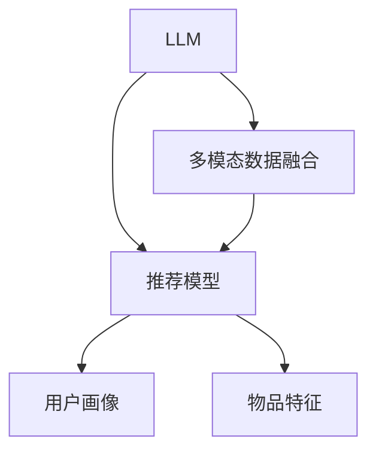

                 

# LLM在推荐系统中的多模态融合应用

## 1. 背景介绍

### 1.1 问题由来
在推荐系统领域，如何利用用户的行为数据、物品的特征信息等多维度数据，实现精准、个性化的推荐，一直是技术研究的核心问题。传统推荐系统多聚焦于用户-物品的交互历史，而忽视了文本、图像、语音等非结构化数据的价值。近年来，大语言模型（LLM）通过预训练-微调技术，在自然语言处理（NLP）领域取得了令人瞩目的成就。其不仅具备强大的语言理解和生成能力，还能够融合多模态数据，从而为推荐系统带来了新的可能。

### 1.2 问题核心关键点
LLM在推荐系统中的多模态融合应用，主要聚焦于如何有效利用文本、图像、语音等多模态数据，结合用户行为数据和物品特征，实现更精准的推荐预测。关键点包括：

1. **数据融合策略**：如何从不同模态的数据中提取有用信息，并整合到推荐模型中。
2. **多模态表示学习**：如何设计模型，将多模态数据转化为统一的表示形式。
3. **多任务学习**：如何将不同任务的训练目标融合到同一个模型中，以提升整体性能。
4. **模型鲁棒性**：如何增强模型对噪声和异常数据的抗干扰能力。
5. **可解释性**：如何解释模型预测的决策依据，增强推荐系统的透明度。

## 2. 核心概念与联系

### 2.1 核心概念概述

为了更好地理解LLM在推荐系统中的多模态融合应用，本节将介绍几个密切相关的核心概念：

1. **大语言模型（Large Language Model, LLM）**：以自回归（如GPT）或自编码（如BERT）模型为代表的大规模预训练语言模型。通过在大规模无标签文本语料上进行预训练，学习通用的语言表示，具备强大的语言理解和生成能力。

2. **多模态数据融合（Multi-modal Data Fusion）**：将不同模态的数据（如文本、图像、语音等）整合到一个统一的表示空间，以提高推荐系统预测的准确性和泛化能力。

3. **多任务学习（Multi-task Learning）**：同时优化多个任务，如用户画像构建、物品描述生成、推荐评分预测等，以提升模型的整体性能。

4. **推荐系统（Recommendation System）**：利用用户的历史行为数据和物品特征，推荐用户可能感兴趣的商品、服务或内容。

5. **推荐模型**：用于处理推荐系统中的推荐预测任务，包括协同过滤、基于内容的推荐、混合推荐等。

6. **用户画像（User Profile）**：通过用户的历史行为数据、社交网络、兴趣标签等信息构建，用于个性化推荐。

7. **物品特征（Item Feature）**：描述物品的属性和特征，如标题、描述、价格、标签等，用于推荐系统的训练和预测。

这些核心概念之间的逻辑关系可以通过以下Mermaid流程图来展示：



这个流程图展示了大语言模型在推荐系统中的核心概念及其之间的关系：

1. 大语言模型通过预训练获得基础能力。
2. 多模态数据融合将不同模态的数据整合到统一的表示空间。
3. 推荐模型利用整合后的多模态数据进行推荐预测。
4. 用户画像和物品特征是推荐系统中的重要组件，用于个性化推荐和物品表示。

## 3. 核心算法原理 & 具体操作步骤
### 3.1 算法原理概述

基于LLM的推荐系统，主要通过预训练-微调的方式，利用语言模型学习用户和物品的多模态表示，进行推荐预测。其核心思想是：将预训练的LLM作为“特征提取器”，通过下游任务（如推荐评分预测）进行微调，从而获得适合推荐系统的高效表示。

形式化地，假设预训练模型为 $M_{\theta}$，其中 $\theta$ 为预训练得到的模型参数。给定推荐任务 $T$ 的标注数据集 $D=\{(x_i,y_i)\}_{i=1}^N$，推荐模型的优化目标是最小化损失函数：

$$
\mathcal{L}(\theta) = \frac{1}{N}\sum_{i=1}^N \ell(M_{\theta}(x_i),y_i)
$$

其中 $\ell$ 为推荐评分预测任务的损失函数，用于衡量模型预测评分与真实评分之间的差异。常见的损失函数包括均方误差损失、绝对误差损失、排序损失等。

通过梯度下降等优化算法，微调过程不断更新模型参数 $\theta$，最小化损失函数 $\mathcal{L}$，使得模型输出逼近真实评分。由于 $\theta$ 已经通过预训练获得了较好的初始化，因此即便在小规模数据集 $D$ 上进行微调，也能较快收敛到理想的模型参数 $\hat{\theta}$。

### 3.2 算法步骤详解

基于LLM的推荐系统微调过程一般包括以下几个关键步骤：

**Step 1: 准备预训练模型和数据集**
- 选择合适的预训练语言模型 $M_{\theta}$ 作为初始化参数，如 BERT、GPT 等。
- 准备推荐任务 $T$ 的标注数据集 $D$，划分为训练集、验证集和测试集。一般要求标注数据与预训练数据的分布不要差异过大。

**Step 2: 设计多模态数据融合策略**
- 选择合适的多模态数据，如用户历史行为数据、物品特征数据、物品图片数据等。
- 使用预训练的LLM模型，将文本数据转化为向量表示。
- 对其他模态数据进行预处理，如图片数据通过CNN模型提取特征向量，语音数据通过TTS模型转化为文本。
- 将不同模态的向量表示进行拼接或加权融合，得到多模态融合表示。

**Step 3: 添加推荐任务适配层**
- 根据推荐任务类型，在多模态融合表示上设计合适的推荐评分预测模型。
- 对于评分预测任务，通常在顶层添加线性回归器或分类器，并使用均方误差或交叉熵损失函数。
- 对于排序任务，通常使用排序损失函数，如Pairwise Loss、Listwise Loss等。

**Step 4: 设置微调超参数**
- 选择合适的优化算法及其参数，如 Adam、SGD 等，设置学习率、批大小、迭代轮数等。
- 设置正则化技术及强度，包括权重衰减、Dropout、Early Stopping 等。
- 确定冻结预训练参数的策略，如仅微调顶层，或全部参数都参与微调。

**Step 5: 执行梯度训练**
- 将训练集数据分批次输入模型，前向传播计算损失函数。
- 反向传播计算参数梯度，根据设定的优化算法和学习率更新模型参数。
- 周期性在验证集上评估模型性能，根据性能指标决定是否触发 Early Stopping。
- 重复上述步骤直到满足预设的迭代轮数或 Early Stopping 条件。

**Step 6: 测试和部署**
- 在测试集上评估微调后模型 $M_{\hat{\theta}}$ 的性能，对比微调前后的精度提升。
- 使用微调后的模型对新样本进行推理预测，集成到实际的应用系统中。
- 持续收集新的数据，定期重新微调模型，以适应数据分布的变化。

以上是基于LLM的推荐系统微调的一般流程。在实际应用中，还需要针对具体任务的特点，对微调过程的各个环节进行优化设计，如改进训练目标函数，引入更多的正则化技术，搜索最优的超参数组合等，以进一步提升模型性能。

### 3.3 算法优缺点

基于LLM的推荐系统具有以下优点：

1. **高效性**：LLM作为“特征提取器”，通过预训练学习通用的语言表示，可以高效地提取多模态数据的特征。
2. **灵活性**：LLM能够适应不同类型的多模态数据，结合用户行为和物品特征，实现个性化的推荐。
3. **泛化能力强**：LLM在大规模无标签数据上预训练，具有较强的泛化能力，能够在多模态数据融合中获得更好的性能。
4. **可解释性**：LLM的输出可以解释为自然语言，便于对推荐结果进行解释和分析。

但该方法也存在一定的局限性：

1. **数据需求高**：需要大量的多模态数据和标注数据进行预训练和微调，获取数据成本较高。
2. **计算复杂**：LLM模型参数量巨大，计算资源需求高，训练和推理效率较低。
3. **泛化性能有限**：当多模态数据与预训练数据的分布差异较大时，微调的性能提升有限。
4. **模型风险**：LLM的输出可能存在偏见、有害信息等，需要通过预训练和微调去除。

尽管存在这些局限性，但就目前而言，基于LLM的推荐系统仍是大数据、多模态推荐的重要方向。未来相关研究的重点在于如何进一步降低数据需求，提高模型的计算效率和泛化性能，同时兼顾可解释性和伦理安全性等因素。

### 3.4 算法应用领域

基于LLM的推荐系统已经在电商、社交、视频等多个领域得到了广泛的应用，覆盖了从推荐商品到推荐内容，从个性化到社会推荐等多个场景。以下是几个典型的应用实例：

1. **电商推荐**：利用用户行为数据、商品描述、用户画像等多模态数据，对用户进行个性化推荐，提升用户购买转化率。
2. **社交推荐**：结合用户社交网络、好友推荐、兴趣标签等信息，对用户进行个性化推荐，增强社交互动。
3. **视频推荐**：对用户观看历史、评分数据、视频描述等进行多模态融合，生成用户兴趣视频序列，提升观看体验。
4. **新闻推荐**：利用用户浏览历史、阅读习惯、新闻标题等多模态数据，推荐个性化新闻内容，提升用户粘性。

除了上述这些经典应用外，LLM在推荐系统的应用还在不断拓展，如可控推荐、广告推荐等，为推荐系统的创新发展提供了新的可能。

## 4. 数学模型和公式 & 详细讲解  
### 4.1 数学模型构建

本节将使用数学语言对基于LLM的推荐系统微调过程进行更加严格的刻画。

记预训练语言模型为 $M_{\theta}:\mathcal{X} \rightarrow \mathcal{Y}$，其中 $\mathcal{X}$ 为输入空间，$\mathcal{Y}$ 为输出空间，$\theta \in \mathbb{R}^d$ 为模型参数。假设推荐任务 $T$ 的标注数据集为 $D=\{(x_i,y_i)\}_{i=1}^N$，其中 $x_i$ 为输入向量，$y_i$ 为推荐评分。

定义模型 $M_{\theta}$ 在输入 $x$ 上的输出为 $f(x)$，推荐评分预测任务损失函数为 $\ell(f(x),y)$。则在数据集 $D$ 上的经验风险为：

$$
\mathcal{L}(\theta) = \frac{1}{N}\sum_{i=1}^N \ell(M_{\theta}(x_i),y_i)
$$

其中 $\ell$ 为推荐评分预测任务的损失函数，如均方误差损失：

$$
\ell(f(x),y) = (f(x)-y)^2
$$

通过梯度下降等优化算法，微调过程不断更新模型参数 $\theta$，最小化损失函数 $\mathcal{L}$，使得模型输出逼近真实评分。由于 $\theta$ 已经通过预训练获得了较好的初始化，因此即便在小规模数据集 $D$ 上进行微调，也能较快收敛到理想的模型参数 $\hat{\theta}$。

### 4.2 公式推导过程

以下我们以电商推荐为例，推导均方误差损失函数及其梯度的计算公式。

假设模型 $M_{\theta}$ 在输入 $x$ 上的输出为 $\hat{y}=M_{\theta}(x) \in [0,1]$，表示物品被用户购买的概率。真实评分 $y \in [0,1]$。则均方误差损失函数定义为：

$$
\ell(M_{\theta}(x),y) = (\hat{y}-y)^2
$$

将其代入经验风险公式，得：

$$
\mathcal{L}(\theta) = \frac{1}{N}\sum_{i=1}^N (\hat{y}-y)^2
$$

根据链式法则，损失函数对参数 $\theta_k$ 的梯度为：

$$
\frac{\partial \mathcal{L}(\theta)}{\partial \theta_k} = -2\frac{1}{N}\sum_{i=1}^N \frac{\partial \hat{y}}{\partial \theta_k} (y-\hat{y})
$$

其中 $\frac{\partial \hat{y}}{\partial \theta_k}$ 可进一步递归展开，利用自动微分技术完成计算。

在得到损失函数的梯度后，即可带入参数更新公式，完成模型的迭代优化。重复上述过程直至收敛，最终得到适应推荐任务的最优模型参数 $\theta^*$。

## 5. 项目实践：代码实例和详细解释说明
### 5.1 开发环境搭建

在进行推荐系统微调实践前，我们需要准备好开发环境。以下是使用Python进行PyTorch开发的环境配置流程：

1. 安装Anaconda：从官网下载并安装Anaconda，用于创建独立的Python环境。

2. 创建并激活虚拟环境：
```bash
conda create -n pytorch-env python=3.8 
conda activate pytorch-env
```

3. 安装PyTorch：根据CUDA版本，从官网获取对应的安装命令。例如：
```bash
conda install pytorch torchvision torchaudio cudatoolkit=11.1 -c pytorch -c conda-forge
```

4. 安装相关库：
```bash
pip install pandas numpy scikit-learn torchtext transformers
```

5. 安装Transformers库：
```bash
pip install transformers
```

完成上述步骤后，即可在`pytorch-env`环境中开始微调实践。

### 5.2 源代码详细实现

这里以电商推荐为例，展示使用Transformers库对BERT模型进行电商推荐微调的PyTorch代码实现。

首先，定义推荐任务的数据处理函数：

```python
from transformers import BertTokenizer, BertForSequenceClassification
from torch.utils.data import Dataset, DataLoader
import torch
from sklearn.metrics import mean_squared_error, mean_absolute_error

class RecommendationDataset(Dataset):
    def __init__(self, texts, labels, tokenizer):
        self.texts = texts
        self.labels = labels
        self.tokenizer = tokenizer
        self.max_len = 128
        
    def __len__(self):
        return len(self.texts)
    
    def __getitem__(self, item):
        text = self.texts[item]
        label = self.labels[item]
        
        encoding = self.tokenizer(text, return_tensors='pt', max_length=self.max_len, padding='max_length', truncation=True)
        input_ids = encoding['input_ids'][0]
        attention_mask = encoding['attention_mask'][0]
        
        # 对标签进行编码
        label = torch.tensor(label, dtype=torch.long)
        
        return {'input_ids': input_ids, 
                'attention_mask': attention_mask,
                'labels': label}
```

然后，定义模型和优化器：

```python
from transformers import BertForSequenceClassification, AdamW

model = BertForSequenceClassification.from_pretrained('bert-base-cased', num_labels=2)

optimizer = AdamW(model.parameters(), lr=2e-5)
```

接着，定义训练和评估函数：

```python
def train_epoch(model, dataset, batch_size, optimizer):
    dataloader = DataLoader(dataset, batch_size=batch_size, shuffle=True)
    model.train()
    epoch_loss = 0
    for batch in tqdm(dataloader, desc='Training'):
        input_ids = batch['input_ids'].to(device)
        attention_mask = batch['attention_mask'].to(device)
        labels = batch['labels'].to(device)
        model.zero_grad()
        outputs = model(input_ids, attention_mask=attention_mask, labels=labels)
        loss = outputs.loss
        epoch_loss += loss.item()
        loss.backward()
        optimizer.step()
    return epoch_loss / len(dataloader)

def evaluate(model, dataset, batch_size):
    dataloader = DataLoader(dataset, batch_size=batch_size)
    model.eval()
    preds, labels = [], []
    with torch.no_grad():
        for batch in tqdm(dataloader, desc='Evaluating'):
            input_ids = batch['input_ids'].to(device)
            attention_mask = batch['attention_mask'].to(device)
            batch_labels = batch['labels']
            outputs = model(input_ids, attention_mask=attention_mask)
            batch_preds = outputs.logits.argmax(dim=1).to('cpu').tolist()
            batch_labels = batch_labels.to('cpu').tolist()
            for pred, label in zip(batch_preds, batch_labels):
                preds.append(pred)
                labels.append(label)
                
    return mean_squared_error(labels, preds)

```

最后，启动训练流程并在测试集上评估：

```python
epochs = 5
batch_size = 16

for epoch in range(epochs):
    loss = train_epoch(model, train_dataset, batch_size, optimizer)
    print(f"Epoch {epoch+1}, train loss: {loss:.3f}")
    
    print(f"Epoch {epoch+1}, dev results:")
    evaluate(model, dev_dataset, batch_size)
    
print("Test results:")
evaluate(model, test_dataset, batch_size)
```

以上就是使用PyTorch对BERT进行电商推荐任务微调的完整代码实现。可以看到，得益于Transformers库的强大封装，我们可以用相对简洁的代码完成BERT模型的加载和微调。

### 5.3 代码解读与分析

让我们再详细解读一下关键代码的实现细节：

**RecommendationDataset类**：
- `__init__`方法：初始化文本、标签、分词器等关键组件。
- `__len__`方法：返回数据集的样本数量。
- `__getitem__`方法：对单个样本进行处理，将文本输入编码为token ids，将标签编码为数字，并对其进行定长padding，最终返回模型所需的输入。

**均方误差损失函数**：
- 使用均方误差损失，衡量模型预测评分与真实评分之间的差异。

**训练和评估函数**：
- 使用PyTorch的DataLoader对数据集进行批次化加载，供模型训练和推理使用。
- 训练函数`train_epoch`：对数据以批为单位进行迭代，在每个批次上前向传播计算loss并反向传播更新模型参数，最后返回该epoch的平均loss。
- 评估函数`evaluate`：与训练类似，不同点在于不更新模型参数，并在每个batch结束后将预测和标签结果存储下来，最后使用sklearn的mean_squared_error函数计算均方误差。

**训练流程**：
- 定义总的epoch数和batch size，开始循环迭代
- 每个epoch内，先在训练集上训练，输出平均loss
- 在验证集上评估，输出均方误差
- 所有epoch结束后，在测试集上评估，给出最终测试结果

可以看到，PyTorch配合Transformers库使得BERT微调的代码实现变得简洁高效。开发者可以将更多精力放在数据处理、模型改进等高层逻辑上，而不必过多关注底层的实现细节。

当然，工业级的系统实现还需考虑更多因素，如模型的保存和部署、超参数的自动搜索、更灵活的任务适配层等。但核心的微调范式基本与此类似。

## 6. 实际应用场景
### 6.1 智能推荐系统

基于大语言模型的推荐系统，可以广泛应用于智能推荐系统的构建。传统推荐系统往往只聚焦于用户-物品的交互历史，而忽视了文本、图像、语音等非结构化数据的价值。而使用微调后的语言模型，可以7x24小时不间断服务，快速响应推荐请求，用自然流畅的语言推荐商品。

在技术实现上，可以收集电商平台上的用户行为数据、物品特征数据、物品图片数据等，将文本数据作为输入，通过微调后的BERT模型提取多模态特征，生成推荐评分预测，完成个性化推荐。对于新用户或新物品，可以进一步利用LLM进行冷启动推荐。

### 6.2 社交网络推荐

社交网络推荐系统利用用户的社交关系、好友推荐、兴趣标签等信息，对用户进行个性化推荐，增强社交互动。利用微调后的LLM模型，可以自动分析用户的社交网络，提取文本特征，进行兴趣匹配和好友推荐，提高推荐准确性。

具体而言，可以收集用户的社交网络数据、好友推荐记录、兴趣标签等信息，将文本数据作为输入，通过微调后的LLM模型提取用户画像，生成推荐评分预测，完成个性化推荐。

### 6.3 视频推荐

视频推荐系统利用用户的观看历史、评分数据、视频描述等，生成个性化视频推荐序列，提升观看体验。利用微调后的LLM模型，可以自动分析视频描述，提取文本特征，结合用户观看历史，生成推荐评分预测，完成个性化推荐。

具体而言，可以收集用户的观看历史数据、视频描述、评分数据等信息，将视频描述作为输入，通过微调后的BERT模型提取多模态特征，生成推荐评分预测，完成个性化推荐。

### 6.4 未来应用展望

随着大语言模型和微调方法的不断发展，基于微调范式将在更多领域得到应用，为传统行业带来变革性影响。

在智慧医疗领域，基于微调的推荐系统可以对患者进行个性化医疗推荐，提升医疗服务的智能化水平，辅助医生诊疗，加速新药开发进程。

在智能教育领域，微调技术可应用于作业批改、学情分析、知识推荐等方面，因材施教，促进教育公平，提高教学质量。

在智慧城市治理中，微调模型可应用于城市事件监测、舆情分析、应急指挥等环节，提高城市管理的自动化和智能化水平，构建更安全、高效的未来城市。

此外，在企业生产、社会治理、文娱传媒等众多领域，基于大模型微调的人工智能应用也将不断涌现，为经济社会发展注入新的动力。相信随着技术的日益成熟，微调方法将成为人工智能落地应用的重要范式，推动人工智能技术在垂直行业的规模化落地。

## 7. 工具和资源推荐
### 7.1 学习资源推荐

为了帮助开发者系统掌握大语言模型在推荐系统中的多模态融合应用，这里推荐一些优质的学习资源：

1. 《Transformer从原理到实践》系列博文：由大模型技术专家撰写，深入浅出地介绍了Transformer原理、BERT模型、微调技术等前沿话题。

2. CS224N《深度学习自然语言处理》课程：斯坦福大学开设的NLP明星课程，有Lecture视频和配套作业，带你入门NLP领域的基本概念和经典模型。

3. 《Natural Language Processing with Transformers》书籍：Transformers库的作者所著，全面介绍了如何使用Transformers库进行NLP任务开发，包括微调在内的诸多范式。

4. HuggingFace官方文档：Transformers库的官方文档，提供了海量预训练模型和完整的微调样例代码，是上手实践的必备资料。

5. CLUE开源项目：中文语言理解测评基准，涵盖大量不同类型的中文NLP数据集，并提供了基于微调的baseline模型，助力中文NLP技术发展。

通过对这些资源的学习实践，相信你一定能够快速掌握大语言模型在推荐系统中的多模态融合应用，并用于解决实际的推荐问题。
###  7.2 开发工具推荐

高效的开发离不开优秀的工具支持。以下是几款用于大语言模型推荐系统微调开发的常用工具：

1. PyTorch：基于Python的开源深度学习框架，灵活动态的计算图，适合快速迭代研究。大部分预训练语言模型都有PyTorch版本的实现。

2. TensorFlow：由Google主导开发的开源深度学习框架，生产部署方便，适合大规模工程应用。同样有丰富的预训练语言模型资源。

3. Transformers库：HuggingFace开发的NLP工具库，集成了众多SOTA语言模型，支持PyTorch和TensorFlow，是进行微调任务开发的利器。

4. Weights & Biases：模型训练的实验跟踪工具，可以记录和可视化模型训练过程中的各项指标，方便对比和调优。与主流深度学习框架无缝集成。

5. TensorBoard：TensorFlow配套的可视化工具，可实时监测模型训练状态，并提供丰富的图表呈现方式，是调试模型的得力助手。

6. Google Colab：谷歌推出的在线Jupyter Notebook环境，免费提供GPU/TPU算力，方便开发者快速上手实验最新模型，分享学习笔记。

合理利用这些工具，可以显著提升大语言模型在推荐系统中的多模态融合应用开发效率，加快创新迭代的步伐。

### 7.3 相关论文推荐

大语言模型和推荐系统的发展源于学界的持续研究。以下是几篇奠基性的相关论文，推荐阅读：

1. Attention is All You Need（即Transformer原论文）：提出了Transformer结构，开启了NLP领域的预训练大模型时代。

2. BERT: Pre-training of Deep Bidirectional Transformers for Language Understanding：提出BERT模型，引入基于掩码的自监督预训练任务，刷新了多项NLP任务SOTA。

3. Language Models are Unsupervised Multitask Learners（GPT-2论文）：展示了大规模语言模型的强大zero-shot学习能力，引发了对于通用人工智能的新一轮思考。

4. Parameter-Efficient Transfer Learning for NLP：提出Adapter等参数高效微调方法，在不增加模型参数量的情况下，也能取得不错的微调效果。

5. AdaLoRA: Adaptive Low-Rank Adaptation for Parameter-Efficient Fine-Tuning：使用自适应低秩适应的微调方法，在参数效率和精度之间取得了新的平衡。

6. Dataset Transformers for Simultaneous Transfer Learning of Multitask Multiple Domains：提出Dataset Transformers，在单一的监督信号下同时优化多个任务和多个领域，提升了模型泛化能力。

这些论文代表了大语言模型在推荐系统中的多模态融合应用的发展脉络。通过学习这些前沿成果，可以帮助研究者把握学科前进方向，激发更多的创新灵感。

## 8. 总结：未来发展趋势与挑战

### 8.1 总结

本文对基于大语言模型在推荐系统中的多模态融合应用进行了全面系统的介绍。首先阐述了推荐系统和大语言模型的研究背景和意义，明确了LLM在多模态融合应用中的独特价值。其次，从原理到实践，详细讲解了LLM在推荐系统中的多模态融合应用的数学原理和关键步骤，给出了推荐系统微调的完整代码实例。同时，本文还广泛探讨了LLM在电商、社交、视频等多个领域的应用前景，展示了LLM在推荐系统中的多模态融合应用的巨大潜力。此外，本文精选了LLM推荐系统微调的技术资源，力求为读者提供全方位的技术指引。

通过本文的系统梳理，可以看到，基于LLM的推荐系统通过预训练-微调的方式，有效融合了多模态数据，提升了推荐模型的预测精度和泛化能力。未来，伴随预训练语言模型和微调方法的持续演进，基于LLM的推荐系统必将在更多领域得到应用，为推荐系统的创新发展提供新的可能。

### 8.2 未来发展趋势

展望未来，大语言模型在推荐系统中的多模态融合应用将呈现以下几个发展趋势：

1. **模型规模持续增大**：随着算力成本的下降和数据规模的扩张，预训练语言模型的参数量还将持续增长。超大规模语言模型蕴含的丰富语言知识，有望支撑更加复杂多变的推荐任务微调。

2. **多模态融合策略日趋多样化**：除了传统的文本-文本融合外，未来会涌现更多多模态融合策略，如文本-图像、文本-语音、图像-语音等，在融合不同模态数据时取得更好的效果。

3. **多任务学习深入发展**：将不同任务的训练目标融合到同一个模型中，如用户画像构建、物品描述生成、推荐评分预测等，以提升模型的整体性能。

4. **持续学习成为常态**：随着数据分布的不断变化，推荐系统也需要持续学习新知识以保持性能。如何在不遗忘原有知识的同时，高效吸收新样本信息，将成为重要的研究课题。

5. **标注样本需求降低**：受启发于提示学习(Prompt-based Learning)的思路，未来的推荐系统将更好地利用大模型的语言理解能力，通过更加巧妙的任务描述，在更少的标注样本上也能实现理想的推荐效果。

6. **多模态表示学习不断优化**：将不同模态的数据转化为统一的表示形式，提高模型对非结构化数据的理解和处理能力。

以上趋势凸显了大语言模型在推荐系统中的多模态融合应用的广阔前景。这些方向的探索发展，必将进一步提升推荐系统的性能和应用范围，为人工智能技术在垂直行业的规模化落地提供新的动力。

### 8.3 面临的挑战

尽管大语言模型在推荐系统中的多模态融合应用取得了显著成效，但在迈向更加智能化、普适化应用的过程中，仍面临诸多挑战：

1. **数据需求高**：需要大量的多模态数据和标注数据进行预训练和微调，获取数据成本较高。
2. **计算复杂**：LLM模型参数量巨大，计算资源需求高，训练和推理效率较低。
3. **泛化性能有限**：当多模态数据与预训练数据的分布差异较大时，微调的性能提升有限。
4. **模型风险**：LLM的输出可能存在偏见、有害信息等，需要通过预训练和微调去除。
5. **推荐鲁棒性不足**：当前推荐系统面对噪声和异常数据的抗干扰能力较弱，推荐结果可能不稳定。

尽管存在这些局限性，但就目前而言，基于大语言模型的推荐系统仍是大数据、多模态推荐的重要方向。未来相关研究的重点在于如何进一步降低数据需求，提高模型的计算效率和泛化性能，同时兼顾可解释性和伦理安全性等因素。

### 8.4 未来突破

面对大语言模型在推荐系统中的多模态融合应用所面临的种种挑战，未来的研究需要在以下几个方面寻求新的突破：

1. **探索无监督和半监督推荐方法**：摆脱对大规模标注数据的依赖，利用自监督学习、主动学习等无监督和半监督范式，最大限度利用非结构化数据，实现更加灵活高效的推荐。

2. **研究参数高效和计算高效的推荐方法**：开发更加参数高效的推荐方法，在固定大部分预训练参数的同时，只更新极少量的推荐相关参数。同时优化推荐模型的计算图，减少前向传播和反向传播的资源消耗，实现更加轻量级、实时性的部署。

3. **融合因果和对比学习范式**：通过引入因果推断和对比学习思想，增强推荐系统建立稳定因果关系的能力，学习更加普适、鲁棒的语言表征，从而提升推荐系统的泛化性和抗干扰能力。

4. **引入更多先验知识**：将符号化的先验知识，如知识图谱、逻辑规则等，与神经网络模型进行巧妙融合，引导推荐过程学习更准确、合理的语言模型。同时加强不同模态数据的整合，实现视觉、语音等多模态信息与文本信息的协同建模。

5. **结合因果分析和博弈论工具**：将因果分析方法引入推荐模型，识别出推荐决策的关键特征，增强推荐结果的因果性和逻辑性。借助博弈论工具刻画用户和物品的交互过程，主动探索并规避推荐模型的脆弱点，提高推荐系统的稳定性。

6. **纳入伦理道德约束**：在推荐模型训练目标中引入伦理导向的评估指标，过滤和惩罚有偏见、有害的推荐结果，确保推荐系统的公平性和安全性。

这些研究方向的探索，必将引领大语言模型在推荐系统中的多模态融合应用走向更高的台阶，为推荐系统的创新发展提供新的可能。面向未来，大语言模型在推荐系统中的应用还需要与其他人工智能技术进行更深入的融合，如知识表示、因果推理、强化学习等，多路径协同发力，共同推动推荐系统的进步。只有勇于创新、敢于突破，才能不断拓展语言模型的边界，让智能技术更好地造福人类社会。

## 9. 附录：常见问题与解答

**Q1：大语言模型在推荐系统中的应用与传统推荐系统有何区别？**

A: 大语言模型在推荐系统中的应用与传统推荐系统的主要区别在于数据融合策略和模型表示学习方式。

1. **数据融合策略**：传统推荐系统主要依赖于用户-物品的交互历史数据，而大语言模型可以融合多模态数据，如文本、图像、语音等，提升推荐模型的泛化能力和预测精度。

2. **模型表示学习**：传统推荐系统多聚焦于向量表示学习，而大语言模型通过预训练-微调的方式，利用大规模无标签数据学习通用的语言表示，能够更好地捕捉语言语义和用户兴趣。

**Q2：大语言模型在推荐系统中如何进行多模态数据融合？**

A: 大语言模型在推荐系统中进行多模态数据融合的主要步骤如下：

1. **数据预处理**：对不同模态的数据进行预处理，如文本数据通过BERT模型进行编码，图像数据通过CNN模型提取特征向量，语音数据通过TTS模型转化为文本。

2. **多模态特征拼接**：将不同模态的特征向量进行拼接或加权融合，得到多模态融合表示。常用的方法包括拼接、平均池化、加权融合等。

3. **多模态融合表示学习**：将多模态融合表示作为输入，使用微调后的BERT模型进行学习，生成推荐评分预测。

4. **模型训练和评估**：利用推荐任务的数据集进行模型训练和评估，调整模型参数，优化推荐评分预测。

**Q3：在多模态推荐系统中，如何设计合适的多模态融合策略？**

A: 在多模态推荐系统中，设计合适的多模态融合策略需要考虑以下几个方面：

1. **融合方式**：选择适当的融合方式，如拼接、平均池化、加权融合等，以提升多模态数据的融合效果。

2. **特征选择**：根据任务需求，选择重要的特征进行融合，如文本特征、图像特征、语音特征等，减少冗余信息的影响。

3. **数据预处理**：对不同模态的数据进行标准化、归一化等预处理，确保不同模态数据的一致性和可比性。

4. **融合模型选择**：选择合适的融合模型，如MLP、RNN、Attention等，以优化多模态数据的融合过程。

5. **融合参数调优**：通过实验和调参，优化融合模型的参数，提升融合效果。

**Q4：在多模态推荐系统中，如何增强模型的鲁棒性和可解释性？**

A: 在多模态推荐系统中，增强模型的鲁棒性和可解释性是提升推荐系统性能的关键。

1. **鲁棒性增强**：通过引入正则化技术，如L2正则、Dropout等，避免过拟合，提高模型的泛化能力。

2. **可解释性提升**：通过引入可解释性模型，如LIME、SHAP等，生成推荐结果的解释信息，提升模型的透明度和可信度。

3. **对抗训练**：引入对抗样本，提高模型对噪声和异常数据的鲁棒性，提升模型的稳健性。

4. **因果分析**：通过引入因果推断方法，识别推荐决策的关键特征，增强推荐结果的因果性和逻辑性。

5. **多任务学习**：将不同的推荐任务融合到一个模型中，如用户画像构建、物品描述生成、推荐评分预测等，提升模型的整体性能。

这些方法结合使用，可以显著增强多模态推荐系统的鲁棒性和可解释性，提升推荐系统的性能和用户体验。

---

作者：禅与计算机程序设计艺术 / Zen and the Art of Computer Programming

