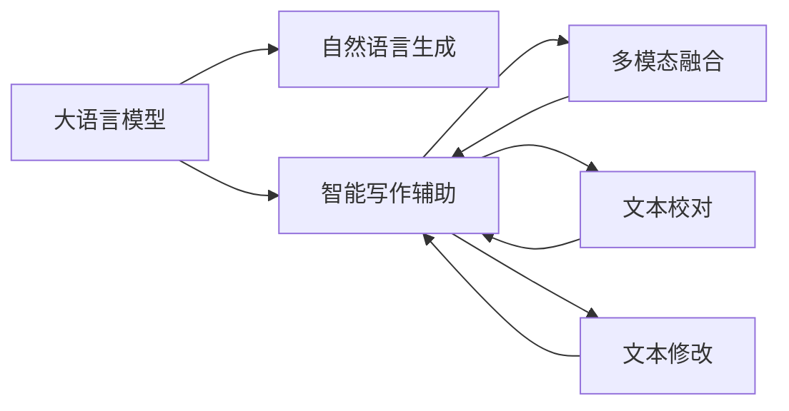
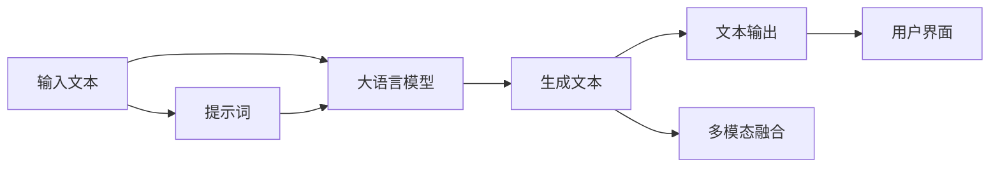

                 

# LLM在智能写作辅助中的应用

> 关键词：语言模型,自然语言生成,智能写作,写作辅助,自然语言处理(NLP)

## 1. 背景介绍

### 1.1 问题由来

随着数字化时代的到来，智能写作辅助逐渐成为了提高生产力、提升内容质量和效率的重要手段。在新闻媒体、学术研究、企业报告、技术博客等多个领域，对内容创作的需求不断增加，专业写作人员面临着内容生产效率低下、创意枯竭等问题。

近年来，大语言模型(Large Language Model, LLM)如OpenAI的GPT-3、Google的BERT等，通过在大规模无标签文本数据上进行自监督预训练，学习到丰富的语言知识和常识，能够生成高质量的自然语言文本。大语言模型的这一特性为智能写作辅助提供了解决方案，使其成为内容创作中不可或缺的工具。

### 1.2 问题核心关键点

智能写作辅助的核心在于利用大语言模型进行自然语言生成，通过提供文本输入、输出格式、风格偏好等指令，生成符合用户需求的文本内容。主要的技术挑战包括：

1. 高质量文本生成：确保生成的文本连贯、通顺、无语法错误，并尽可能地满足用户的个性化需求。
2. 语义理解与推理：理解文本上下文，推理出合适的内容，确保生成的文本内容逻辑一致、情感一致。
3. 多模态融合：结合图片、视频、音频等多模态数据，提升内容的丰富性和表现力。
4. 快速响应与迭代：实时接收用户输入，快速生成文本，支持持续迭代优化。
5. 安全性与合规性：确保生成的内容不含敏感信息、不侵犯版权，遵守相关法律法规。

### 1.3 问题研究意义

智能写作辅助技术的发展，对于提高内容创作的效率和质量、降低人力成本、提升信息传播的广度和深度具有重要意义。在大模型基础上进行微调，可以实现快速的、高质量的内容生成，极大地推动了新闻业、教育、出版等多个领域的发展。

同时，智能写作辅助技术还具备一定的经济价值。以新闻媒体为例，利用智能写作辅助工具，可以在短时间内生成大量高质量的报道，减少人力投入，提高新闻生产效率，降低运营成本。

## 2. 核心概念与联系

### 2.1 核心概念概述

在智能写作辅助中，大语言模型是核心组件，负责生成符合用户要求的文本内容。以下是几个密切相关的核心概念：

- **大语言模型**：指通过自监督预训练学习到大量语言知识的深度神经网络模型，如GPT系列、BERT等。能够根据输入生成自然语言文本。
- **自然语言生成**：指利用语言模型将语言知识转化为具体文本内容的过程，是智能写作辅助的核心技术。
- **智能写作辅助**：指利用大语言模型技术，提供自动生成、修改、编辑、校对等写作辅助服务，提升内容创作效率和质量。
- **多模态融合**：指将文本与图片、视频、音频等不同模态的信息进行融合，增强内容的表现力和互动性。

这些核心概念之间的联系可以表示如下Mermaid流程图：



### 2.2 核心概念原理和架构的 Mermaid 流程图



以上流程图展示了智能写作辅助的架构：用户输入文本或提示词，大语言模型接收输入生成文本，将文本输出显示给用户。同时，大语言模型还可以结合多模态信息，生成更加丰富和互动的文本内容。

## 3. 核心算法原理 & 具体操作步骤

### 3.1 算法原理概述

智能写作辅助的算法核心是基于自然语言生成（NLG）的大语言模型，结合任务适配层，进行个性化微调。其主要原理如下：

1. **预训练模型加载**：使用预训练的大语言模型，如GPT-3或BERT，作为初始化参数。
2. **任务适配**：根据具体写作任务需求，设计相应的任务适配层，如分类、生成、序列预测等。
3. **个性化微调**：在预训练模型基础上，通过小规模有标签数据集进行微调，学习特定任务的相关知识。
4. **多模态融合**：将文本与图片、视频等不同模态的信息进行融合，提升内容的丰富性和表现力。
5. **持续优化**：利用用户反馈，持续优化模型参数，提升文本质量。

### 3.2 算法步骤详解

智能写作辅助的算法步骤包括：

1. **数据预处理**：清洗、分词、编码等文本数据预处理步骤，将文本转换为模型可以处理的格式。
2. **模型初始化**：加载预训练的大语言模型，作为初始化参数。
3. **任务适配层设计**：根据具体任务需求，设计相应的任务适配层，如分类、生成、序列预测等。
4. **微调**：使用小规模有标签数据集进行微调，优化任务适配层和模型参数。
5. **多模态融合**：将文本与图片、视频等不同模态的信息进行融合，提升内容的丰富性和表现力。
6. **文本输出**：将生成的文本输出显示给用户，提供写作辅助服务。

### 3.3 算法优缺点

智能写作辅助的算法具有以下优点：

1. **高效性**：利用大语言模型的预训练知识，可以在较短的时间内生成高质量的文本内容。
2. **灵活性**：通过任务适配层，可以支持多种类型的写作任务，如新闻报道、技术文档、论文写作等。
3. **多模态融合**：结合图片、视频、音频等多模态信息，生成更加丰富和互动的文本内容。
4. **持续优化**：利用用户反馈，持续优化模型参数，提升文本质量。

同时，该算法也存在一些缺点：

1. **数据依赖**：生成高质量文本内容依赖于小规模有标签数据集的训练，数据质量和数量对生成效果影响较大。
2. **模型复杂度**：大语言模型参数量较大，需要较大的计算资源和内存空间。
3. **安全性**：生成的文本可能包含敏感信息、侵犯版权等问题，需注意文本生成过程中的合规性。

### 3.4 算法应用领域

智能写作辅助的算法已广泛应用于多个领域，包括：

- **新闻报道**：利用智能写作辅助，快速生成新闻报道，提高新闻生产效率，降低人力成本。
- **学术论文写作**：提供学术写作辅助，自动生成文献综述、研究方法、结论等，提升写作效率和质量。
- **企业报告**：生成企业报告、市场分析等文本内容，支持商业决策。
- **技术博客**：提供技术写作辅助，自动生成技术文档、教程等，提升技术传播效果。
- **教育培训**：生成教学材料、练习题等，提升教育效果。
- **创意写作**：辅助创意写作，生成故事、诗歌等，激发创作灵感。

## 4. 数学模型和公式 & 详细讲解 & 举例说明

### 4.1 数学模型构建

在智能写作辅助中，基于大语言模型的自然语言生成（NLG）模型可以表示为：

$$
\hat{y} = M_{\theta}(x)
$$

其中，$x$ 为输入文本，$y$ 为生成的文本，$\theta$ 为模型参数。

### 4.2 公式推导过程

自然语言生成模型的核心是注意力机制（Attention）和自回归模型（Auto-Regressive Model）。以GPT-3为例，其生成过程可以表示为：

1. **编码器**：将输入文本$x$通过编码器转化为向量表示$z$。
2. **解码器**：利用解码器自回归生成文本序列$\hat{y} = (y_1, y_2, \dots, y_n)$，其中$y_i$表示第$i$个位置的输出，$\hat{y}$表示整个文本序列。

### 4.3 案例分析与讲解

假设我们要生成一篇关于“人工智能发展历程”的文本，首先输入如下提示词：

```
人工智能的发展历程可以追溯到上个世纪中叶。最初，人工智能研究主要集中在逻辑推理和知识表示方面。1950年代，图灵机理论的提出标志着人工智能成为一门科学。1960年代，专家系统开始兴起。1980年代，神经网络和机器学习成为热门研究方向。现代人工智能的发展以深度学习和自然语言处理为主，广泛应用于多个领域。
```

将提示词输入大语言模型，模型将生成如下文本：

```
人工智能的发展历程可以追溯到上个世纪中叶。最初，人工智能研究主要集中在逻辑推理和知识表示方面。1950年代，图灵机理论的提出标志着人工智能成为一门科学。1960年代，专家系统开始兴起。1980年代，神经网络和机器学习成为热门研究方向。现代人工智能的发展以深度学习和自然语言处理为主，广泛应用于多个领域。例如，在医疗领域，人工智能被用于疾病诊断、药物研发等。在金融领域，人工智能被用于风险评估、投资分析等。在教育领域，人工智能被用于个性化学习、智能辅导等。在自动驾驶领域，人工智能被用于感知、决策等。未来，人工智能的发展将更加广泛和深入，为人类社会的各个方面带来深刻的变革。
```

可以看到，模型能够根据输入提示词生成连贯、通顺的文本内容。

## 5. 项目实践：代码实例和详细解释说明

### 5.1 开发环境搭建

在实践中，我们需要准备一个开发环境，以确保代码的正常运行。以下是使用Python进行PyTorch开发的环境配置流程：

1. 安装Anaconda：从官网下载并安装Anaconda，用于创建独立的Python环境。
2. 创建并激活虚拟环境：
```bash
conda create -n pytorch-env python=3.8 
conda activate pytorch-env
```
3. 安装PyTorch：根据CUDA版本，从官网获取对应的安装命令。例如：
```bash
conda install pytorch torchvision torchaudio cudatoolkit=11.1 -c pytorch -c conda-forge
```
4. 安装Transformers库：
```bash
pip install transformers
```
5. 安装各类工具包：
```bash
pip install numpy pandas scikit-learn matplotlib tqdm jupyter notebook ipython
```

完成上述步骤后，即可在`pytorch-env`环境中开始微调实践。

### 5.2 源代码详细实现

以下是使用Transformers库对GPT-3进行智能写作辅助的PyTorch代码实现。

首先，定义智能写作辅助的模型类：

```python
from transformers import GPT3LMHeadModel, GPT3Tokenizer
import torch
from torch.utils.data import Dataset, DataLoader

class WritingAssistantModel:
    def __init__(self, model_name):
        self.tokenizer = GPT3Tokenizer.from_pretrained(model_name)
        self.model = GPT3LMHeadModel.from_pretrained(model_name)
        self.model.eval()

    def generate_text(self, prompt, max_length=512):
        inputs = self.tokenizer(prompt, max_length=max_length, return_tensors='pt')
        output = self.model.generate(inputs['input_ids'], num_return_sequences=1, max_length=max_length)
        return self.tokenizer.decode(output[0], skip_special_tokens=True)

    def encode_prompt(self, prompt):
        return self.tokenizer(prompt, return_tensors='pt', max_length=512, truncation=True)['input_ids']
```

然后，定义数据集和数据加载器：

```python
class WritingAssistantDataset(Dataset):
    def __init__(self, data, tokenizer):
        self.data = data
        self.tokenizer = tokenizer

    def __len__(self):
        return len(self.data)

    def __getitem__(self, idx):
        return self.tokenizer(self.data[idx], return_tensors='pt', max_length=512, truncation=True)

# 示例数据集
data = ['人工智能的发展历程可以追溯到上个世纪中叶。最初，人工智能研究主要集中在逻辑推理和知识表示方面。1950年代，图灵机理论的提出标志着人工智能成为一门科学。1960年代，专家系统开始兴起。1980年代，神经网络和机器学习成为热门研究方向。现代人工智能的发展以深度学习和自然语言处理为主，广泛应用于多个领域。']

tokenizer = GPT3Tokenizer.from_pretrained('gpt3')
dataset = WritingAssistantDataset(data, tokenizer)
dataloader = DataLoader(dataset, batch_size=1, shuffle=False)
```

最后，启动模型生成文本的流程：

```python
model = WritingAssistantModel('gpt3')
prompt = '人工智能的发展历程可以追溯到上个世纪中叶。最初，人工智能研究主要集中在逻辑推理和知识表示方面。1950年代，图灵机理论的提出标志着人工智能成为一门科学。1960年代，专家系统开始兴起。1980年代，神经网络和机器学习成为热门研究方向。现代人工智能的发展以深度学习和自然语言处理为主，广泛应用于多个领域。'

# 生成文本
generated_text = model.generate_text(prompt)
print(generated_text)
```

以上就是使用PyTorch对GPT-3进行智能写作辅助的完整代码实现。可以看到，利用Transformers库，我们可以方便地使用预训练模型进行文本生成。

### 5.3 代码解读与分析

让我们再详细解读一下关键代码的实现细节：

**WritingAssistantModel类**：
- `__init__`方法：初始化模型和分词器。
- `generate_text`方法：将提示词输入模型，生成指定长度的文本内容。
- `encode_prompt`方法：将提示词编码成模型可以处理的格式。

**WritingAssistantDataset类**：
- `__init__`方法：初始化数据集和分词器。
- `__len__`方法：返回数据集长度。
- `__getitem__`方法：对单个样本进行处理，将文本分词并编码。

**运行示例**：
- 定义智能写作辅助模型，并加载GPT-3模型。
- 设置提示词，调用`generate_text`方法生成文本。
- 输出生成的文本内容。

可以看到，代码实现了基本的智能写作辅助功能。当然，在实际应用中，还需要进行更多的优化和改进，如添加多模态融合、文本校对等功能，以提升生成文本的质量和效果。

## 6. 实际应用场景

### 6.1 智能写作辅助在新闻报道中的应用

在新闻报道中，智能写作辅助可以大幅提高报道生成效率，降低人力成本。例如，新闻机构可以自动生成简单的新闻摘要、标题、导语等，甚至自动生成整篇新闻报道。

具体而言，可以利用智能写作辅助工具，自动提取新闻事件的关键信息，生成新闻标题和导语，再结合记者现场采集的信息，生成完整的新闻报道。在紧急情况下，该技术可以显著减少记者撰写新闻的时间，提高新闻发布速度，满足用户对时效性的要求。

### 6.2 智能写作辅助在学术论文写作中的应用

学术论文的写作和发表过程繁琐、耗时，尤其对于初入学术领域的新手而言，撰写高质量的论文难度较大。智能写作辅助工具可以提供写作助手，帮助研究人员生成文献综述、研究方法、结论等，提升写作效率和质量。

例如，研究人员可以利用智能写作辅助工具，自动生成论文的引言部分，涵盖相关领域的研究背景、问题陈述等，快速生成完整的论文框架。此外，工具还可以根据学术论文的写作规范和格式要求，提供文本校对和格式化建议，确保论文的质量和规范性。

### 6.3 智能写作辅助在企业报告中的应用

企业报告的生成和发布是企业信息传播的重要手段。传统的企业报告撰写过程繁琐、耗时，且质量难以保证。智能写作辅助工具可以自动生成企业报告、市场分析、财务报告等文本内容，提升报告生成效率和质量。

例如，企业可以利用智能写作辅助工具，自动生成年度报告、季度报告等，涵盖公司的财务数据、业务分析、市场前景等内容。此外，工具还可以根据报告的内容和格式要求，提供文本校对和格式化建议，确保报告的质量和规范性。

### 6.4 智能写作辅助在技术博客中的应用

技术博客是传播新技术、分享经验的重要途径。传统的技术博客撰写过程耗时、耗力，且难以保证内容的质量和原创性。智能写作辅助工具可以自动生成技术文章、教程、案例分析等内容，提升博客撰写效率和质量。

例如，技术博主可以利用智能写作辅助工具，自动生成技术文章的开篇介绍、核心内容、结论等，生成完整的技术文章。此外，工具还可以根据文章的内容和格式要求，提供文本校对和格式化建议，确保文章的质量和规范性。

## 7. 工具和资源推荐

### 7.1 学习资源推荐

为了帮助开发者系统掌握智能写作辅助的技术基础和实践技巧，这里推荐一些优质的学习资源：

1. 《自然语言处理入门》系列博文：由大模型技术专家撰写，深入浅出地介绍了自然语言处理的基本概念和经典模型。
2. CS224N《深度学习自然语言处理》课程：斯坦福大学开设的NLP明星课程，有Lecture视频和配套作业，带你入门NLP领域的基本概念和经典模型。
3. 《Natural Language Processing with Transformers》书籍：Transformers库的作者所著，全面介绍了如何使用Transformers库进行NLP任务开发，包括智能写作辅助在内的诸多范式。
4. HuggingFace官方文档：Transformers库的官方文档，提供了海量预训练模型和完整的智能写作辅助样例代码，是上手实践的必备资料。
5. CLUE开源项目：中文语言理解测评基准，涵盖大量不同类型的中文NLP数据集，并提供了基于智能写作辅助的baseline模型，助力中文NLP技术发展。

通过对这些资源的学习实践，相信你一定能够快速掌握智能写作辅助的精髓，并用于解决实际的NLP问题。

### 7.2 开发工具推荐

高效的开发离不开优秀的工具支持。以下是几款用于智能写作辅助开发的常用工具：

1. PyTorch：基于Python的开源深度学习框架，灵活动态的计算图，适合快速迭代研究。大部分预训练语言模型都有PyTorch版本的实现。
2. TensorFlow：由Google主导开发的开源深度学习框架，生产部署方便，适合大规模工程应用。同样有丰富的预训练语言模型资源。
3. Transformers库：HuggingFace开发的NLP工具库，集成了众多SOTA语言模型，支持PyTorch和TensorFlow，是进行智能写作辅助开发的利器。
4. Weights & Biases：模型训练的实验跟踪工具，可以记录和可视化模型训练过程中的各项指标，方便对比和调优。与主流深度学习框架无缝集成。
5. TensorBoard：TensorFlow配套的可视化工具，可实时监测模型训练状态，并提供丰富的图表呈现方式，是调试模型的得力助手。
6. Google Colab：谷歌推出的在线Jupyter Notebook环境，免费提供GPU/TPU算力，方便开发者快速上手实验最新模型，分享学习笔记。

合理利用这些工具，可以显著提升智能写作辅助的开发效率，加快创新迭代的步伐。

### 7.3 相关论文推荐

智能写作辅助技术的发展源于学界的持续研究。以下是几篇奠基性的相关论文，推荐阅读：

1. Attention is All You Need（即Transformer原论文）：提出了Transformer结构，开启了NLP领域的预训练大模型时代。
2. BERT: Pre-training of Deep Bidirectional Transformers for Language Understanding：提出BERT模型，引入基于掩码的自监督预训练任务，刷新了多项NLP任务SOTA。
3. Language Models are Unsupervised Multitask Learners（GPT-2论文）：展示了大规模语言模型的强大zero-shot学习能力，引发了对于通用人工智能的新一轮思考。
4. Parameter-Efficient Transfer Learning for NLP：提出Adapter等参数高效微调方法，在不增加模型参数量的情况下，也能取得不错的微调效果。
5. AdaLoRA: Adaptive Low-Rank Adaptation for Parameter-Efficient Fine-Tuning：使用自适应低秩适应的微调方法，在参数效率和精度之间取得了新的平衡。
6. Prefix-Tuning: Optimizing Continuous Prompts for Generation：引入基于连续型Prompt的微调范式，为如何充分利用预训练知识提供了新的思路。

这些论文代表了大语言模型智能写作辅助的发展脉络。通过学习这些前沿成果，可以帮助研究者把握学科前进方向，激发更多的创新灵感。

## 8. 总结：未来发展趋势与挑战

### 8.1 总结

本文对基于大语言模型的智能写作辅助技术进行了全面系统的介绍。首先阐述了智能写作辅助的技术背景和研究意义，明确了其在大规模预训练语言模型基础上的重要地位。其次，从原理到实践，详细讲解了智能写作辅助的数学原理和关键步骤，给出了智能写作辅助任务开发的完整代码实例。同时，本文还广泛探讨了智能写作辅助在新闻报道、学术论文写作、企业报告、技术博客等多个领域的应用前景，展示了其广阔的应用潜力。此外，本文精选了智能写作辅助技术的各类学习资源，力求为读者提供全方位的技术指引。

通过本文的系统梳理，可以看到，基于大语言模型的智能写作辅助技术正在成为NLP领域的重要范式，极大地拓展了预训练语言模型的应用边界，催生了更多的落地场景。受益于大规模语料的预训练，智能写作辅助技术在内容创作、信息传播、教育培训等方面展现了强大的潜力，有望带来深远的影响。

### 8.2 未来发展趋势

展望未来，智能写作辅助技术将呈现以下几个发展趋势：

1. **高质量生成**：利用更加先进的大语言模型和微调技术，生成高质量、连贯、通顺的文本内容。
2. **多模态融合**：将文本与图片、视频、音频等多模态信息进行融合，提升内容的丰富性和表现力。
3. **个性化定制**：根据用户需求和偏好，生成个性化文本内容，提升用户体验。
4. **实时响应**：实现实时生成文本，支持多轮对话交互，提升智能写作辅助的互动性和时效性。
5. **跨领域应用**：拓展到更多领域，如法律、医疗、金融等，提升跨领域内容的生成能力。
6. **语义推理**：引入语义推理技术，提升文本生成的逻辑一致性和情感一致性。
7. **用户反馈机制**：利用用户反馈，持续优化模型参数，提升生成文本的质量。

这些趋势将进一步推动智能写作辅助技术的发展，使其在内容创作、信息传播、教育培训等方面发挥更大的作用。

### 8.3 面临的挑战

尽管智能写作辅助技术已经取得了一定的进展，但在实现高质量、高效、智能的内容生成方面，仍然面临诸多挑战：

1. **数据质量与多样性**：智能写作辅助依赖于高质、多样化的数据集进行训练，数据质量对生成效果有重要影响。
2. **模型复杂度与计算资源**：大语言模型参数量大，需要高性能计算资源和内存空间，限制了其应用场景。
3. **生成内容的合理性**：生成的文本内容需要符合逻辑、情感一致，避免生成不合理、不连贯的内容。
4. **安全性与隐私保护**：生成的文本内容可能包含敏感信息、侵犯版权等问题，需注意文本生成的安全性。
5. **用户反馈机制的设计**：如何设计有效的用户反馈机制，帮助模型持续优化，提升生成文本的质量。

这些挑战需要开发者和研究者共同努力，不断优化模型、改进算法，才能真正实现智能写作辅助技术的落地应用。

### 8.4 研究展望

未来的研究需要在以下几个方面寻求新的突破：

1. **数据增强与数据筛选**：利用数据增强技术，扩充训练集，提升生成文本的质量和多样性。
2. **多模态融合技术**：结合图片、视频、音频等多模态信息，提升内容的丰富性和表现力。
3. **生成内容的逻辑一致性**：引入语义推理技术，提升文本生成的逻辑一致性和情感一致性。
4. **个性化生成技术**：根据用户需求和偏好，生成个性化文本内容，提升用户体验。
5. **模型压缩与优化**：优化模型结构，减少参数量，提升推理速度和效率。
6. **用户反馈机制的设计**：设计有效的用户反馈机制，帮助模型持续优化，提升生成文本的质量。
7. **安全性和隐私保护**：在文本生成过程中，确保安全性，保护用户隐私。

这些研究方向的探索，必将引领智能写作辅助技术迈向更高的台阶，为内容创作、信息传播、教育培训等领域带来深远的影响。相信随着技术的不断进步，智能写作辅助技术将进一步提高内容创作的效率和质量，促进信息传播的广度和深度，为社会经济发展注入新的动力。

## 9. 附录：常见问题与解答

**Q1：智能写作辅助是否可以替代人类撰写文本？**

A: 智能写作辅助技术可以大大提升文本生成的效率和质量，但不能完全替代人类撰写。人类在内容创作过程中，不仅需要语言知识，还需要独特的创造力、情感表达、逻辑推理等能力。智能写作辅助可以辅助人类完成一些基础性、重复性的工作，但对于深度思考、创新思维、情感表达等复杂任务，仍需依赖人类作者的参与。

**Q2：如何提高智能写作辅助生成的文本质量？**

A: 提高文本质量的关键在于数据质量、模型训练和算法设计。
1. 数据质量：选择高质量、多样化的数据集进行训练，避免数据偏差。
2. 模型训练：选择合适的预训练模型，设计合适的任务适配层，进行充分的微调。
3. 算法设计：引入多模态融合、语义推理等技术，提升文本生成的逻辑一致性和情感一致性。

**Q3：智能写作辅助是否可以生成原创性文本？**

A: 智能写作辅助可以生成具有一定原创性的文本内容，但难以完全摆脱已有文本的影响。生成文本的原创性取决于训练数据和模型架构的设计。一些先进的模型和算法可以在一定程度上提高文本的原创性，但生成内容仍需结合人工干预和编辑，确保文本的准确性和可靠性。

**Q4：智能写作辅助是否可以用于敏感领域的文本生成？**

A: 智能写作辅助在敏感领域的应用需要格外谨慎。例如，在医疗、法律等敏感领域，生成的文本内容需要符合相关法规和伦理标准，避免侵犯隐私和版权等问题。此外，生成的文本内容需要进行严格的审核和监管，确保文本内容的合规性和安全性。

**Q5：智能写作辅助是否需要依赖标注数据进行训练？**

A: 智能写作辅助可以通过无监督预训练和自监督学习技术，利用大规模无标签数据进行训练，无需标注数据。然而，对于一些特定的任务，如文本分类、序列标注等，仍需要少量标注数据进行微调，以提升生成文本的准确性和质量。

---

作者：禅与计算机程序设计艺术 / Zen and the Art of Computer Programming

