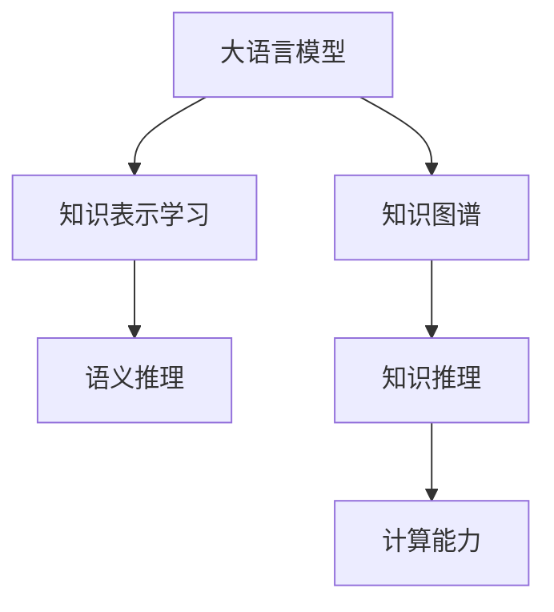

                 

## 1. 背景介绍

### 1.1 问题由来
近年来，自然语言处理（NLP）和知识表示学习（KRL）领域的研究取得了显著进展。知识图谱等形式化的知识表示技术，为数据驱动的AI系统提供了结构化的背景知识，极大地提升了NLP系统的性能和泛化能力。然而，现有的知识表示学习方法大多依赖人工构建，繁琐耗时，难以覆盖知识库中广泛的领域。

大语言模型（LLM）的诞生，为知识表示学习带来了全新的范式。预训练的大语言模型，具备强大的语言生成能力，能够自动学习到丰富的知识表示，从语义、逻辑、常识等方面进行知识挖掘。LLM的知识表示能力不仅限于单词和句子的表面形式，还可以深入理解句子背后的语义和上下文关系，进行更复杂的推理和计算。

### 1.2 问题核心关键点
本文将探讨大语言模型在知识表示学习中的潜力，特别是LLM如何进行语义推理和计算，以及如何通过微调优化其知识表示能力。我们将详细分析LLM在知识表示学习中的核心概念、算法原理和操作步骤，并提供实际案例和代码实现，以期为相关领域的研究和实践提供深入的指导。

## 2. 核心概念与联系

### 2.1 核心概念概述

为更好地理解LLM在知识表示学习中的应用，本节将介绍几个密切相关的核心概念：

- 大语言模型（Large Language Model, LLM）：以自回归（如GPT）或自编码（如BERT）模型为代表的大规模预训练语言模型。通过在大规模无标签文本语料上进行预训练，学习通用的语言表示，具备强大的语言理解和生成能力。

- 知识表示学习（Knowledge Representation Learning, KRL）：指将知识库中的事实、规则、概念等形式化的知识表示成机器可理解的形式，供AI系统进行推理和计算的过程。

- 知识图谱（Knowledge Graph, KG）：一种基于图结构的知识表示形式，通过节点和边的关系，对知识进行结构化表示。常见的知识图谱有Freebase、WikiData等。

- 语义推理（Semantic Reasoning）：指基于语义理解进行推理计算的过程，如实体关系推理、数理逻辑推理等。

- 计算能力（Computational Power）：指模型在执行复杂计算和推理时的性能表现，包括计算速度、精度、鲁棒性等。

这些核心概念之间的逻辑关系可以通过以下Mermaid流程图来展示：



这个流程图展示了大语言模型的核心概念及其之间的关系：

1. 大语言模型通过预训练获得基础能力。
2. 知识表示学习将预训练模型的表示进行结构化，形成知识图谱。
3. 语义推理和计算能力在知识图谱的基础上进行推理计算。
4. 计算能力是知识推理和推理计算的核心支撑。

## 3. 核心算法原理 & 具体操作步骤
### 3.1 算法原理概述

大语言模型在知识表示学习中的核心算法原理，主要体现在语义推理和计算能力的应用上。其核心思想是：将预训练的大语言模型作为知识表示的生成器，利用其强大的语言理解能力，对知识图谱中的实体和关系进行语义推理，并生成相应的知识表示。

形式化地，假设知识图谱为 $G=(E,R)$，其中 $E$ 为实体集合，$R$ 为关系集合。定义语言模型为 $M_{\theta}:\mathcal{X} \rightarrow \mathcal{Y}$，其中 $\mathcal{X}$ 为输入空间，$\mathcal{Y}$ 为输出空间，$\theta \in \mathbb{R}^d$ 为模型参数。则知识表示学习的过程可以表示为：

$$
\mathcal{K} = \{ M_{\theta}(x) \mid x \in \mathcal{X} \}
$$

其中，$\mathcal{K}$ 为通过语言模型 $M_{\theta}$ 生成的知识表示集合。

### 3.2 算法步骤详解

大语言模型在知识表示学习中的算法步骤包括以下几个关键环节：

**Step 1: 准备知识图谱和预训练模型**
- 收集或构建知识图谱 $G=(E,R)$，其中 $E$ 为实体集合，$R$ 为关系集合。
- 选择合适的预训练语言模型 $M_{\theta}$ 作为初始化参数，如 BERT、GPT 等。

**Step 2: 设计知识推理任务**
- 根据知识图谱的实体和关系，设计若干知识推理任务，如实体关系推理、数理逻辑推理等。
- 将知识图谱中的推理问题形式化为自然语言描述，作为任务输入。

**Step 3: 微调知识表示生成器**
- 使用微调技术对预训练语言模型 $M_{\theta}$ 进行训练，使其在特定推理任务上表现更好。
- 选择适当的损失函数和优化算法，如交叉熵损失、Adam等。

**Step 4: 生成知识表示**
- 使用微调后的语言模型 $M_{\theta}$，对知识图谱 $G$ 中的推理问题进行推理计算。
- 根据任务定义，输出推理结果，即生成的知识表示。

**Step 5: 评估和优化**
- 对生成的知识表示进行评估，验证其在知识图谱中的应用效果。
- 根据评估结果，不断优化语言模型的微调策略和推理算法，提升知识表示的准确性和鲁棒性。

### 3.3 算法优缺点

大语言模型在知识表示学习中的应用具有以下优点：
1. 强大的语言理解能力。LLM能够自动学习到丰富的语言知识，进行复杂的语义推理和计算。
2. 无需人工构建知识表示。通过预训练和微调，LLM能够从无标签语料中学习到知识表示，减轻了知识图谱构建的繁琐工作。
3. 适应性强。LLM的知识表示能力不受知识图谱结构的限制，能够自动处理知识图谱中的各种复杂关系。
4. 鲁棒性好。LLM通过大量的无标签语料进行预训练，具备较强的泛化能力，对知识图谱中的噪声和缺失信息也有一定的鲁棒性。

同时，该方法也存在一定的局限性：
1. 推理能力受限制。当前LLM的推理能力尚未达到人类水平，难以处理过于复杂的语义推理问题。
2. 推理效率较低。知识推理的计算量较大，LLM的推理速度可能较慢。
3. 知识图谱依赖。LLM的知识表示能力依赖于知识图谱的结构和质量，知识图谱构建的难度较大。
4. 模型偏见。LLM的预训练数据中可能包含偏见和有害信息，影响其知识表示的公平性和安全性。

尽管存在这些局限性，但LLM在知识表示学习中的应用已经展现出巨大潜力，为构建智能AI系统提供了重要的技术支撑。

### 3.4 算法应用领域

大语言模型在知识表示学习中的应用，已经在多个领域得到了广泛的应用，例如：

- 自然语言问答系统：利用知识图谱中的事实和关系，通过语义推理生成答案。
- 智能推荐系统：将知识图谱中的实体和关系，融入推荐算法中，提升推荐效果。
- 智能客服：将知识图谱中的常见问题-答案对，自动生成智能回复。
- 金融风险评估：将知识图谱中的企业信息和关系，用于金融风险分析。
- 医学诊断：将知识图谱中的疾病信息和治疗方法，用于医学诊断和治疗方案生成。

除了上述这些经典应用外，LLM在知识表示学习中的应用还在不断拓展，如智能合约、环境保护等，为各行业提供了新的技术思路。

## 4. 数学模型和公式 & 详细讲解  
### 4.1 数学模型构建

在本节中，我们将使用数学语言对大语言模型在知识表示学习中的原理进行更加严格的刻画。

定义知识图谱 $G=(E,R)$，其中 $E$ 为实体集合，$R$ 为关系集合。设语言模型为 $M_{\theta}:\mathcal{X} \rightarrow \mathcal{Y}$，其中 $\mathcal{X}$ 为输入空间，$\mathcal{Y}$ 为输出空间，$\theta \in \mathbb{R}^d$ 为模型参数。假设知识推理任务为 $T=\{(t_i,x_i)\}_{i=1}^N$，其中 $t_i$ 为自然语言描述的任务，$x_i$ 为任务输入。

定义知识推理任务的损失函数为 $\ell(T,M_{\theta})$，则知识表示学习的目标为最小化该损失函数，即：

$$
\mathop{\arg\min}_{\theta} \ell(T,M_{\theta})
$$

其中 $\ell(T,M_{\theta})$ 为任务 $T$ 在模型 $M_{\theta}$ 上的损失函数。

### 4.2 公式推导过程

以下我们以实体关系推理为例，推导知识表示学习的损失函数及其梯度的计算公式。

假设知识推理任务为实体关系推理，给定知识图谱 $G=(E,R)$ 中的一个实体对 $(e_i,e_j)$，以及一个推理关系 $r$，任务描述为“判断实体 $e_i$ 和 $e_j$ 之间是否存在关系 $r$”。设实体 $e_i$ 和 $e_j$ 的描述分别为 $x_i$ 和 $x_j$，推理关系 $r$ 的描述为 $t$。则实体关系推理任务可以表示为自然语言描述 $t=\{t_i,x_i,x_j\}$。

根据语言模型 $M_{\theta}$，对任务 $t$ 进行推理，生成知识表示 $k$。任务损失函数定义为：

$$
\ell(t,M_{\theta}) = -\log \frac{P(k|t)}{P(k)}
$$

其中 $P(k|t)$ 为推理生成知识表示 $k$ 的条件概率，$P(k)$ 为独立生成知识表示 $k$ 的概率。

根据链式法则，知识表示学习的梯度公式为：

$$
\frac{\partial \ell(T,M_{\theta})}{\partial \theta} = -\sum_{i=1}^N \frac{\partial \ell(t_i,M_{\theta})}{\partial \theta}
$$

其中 $\frac{\partial \ell(t_i,M_{\theta})}{\partial \theta}$ 为任务 $t_i$ 在模型 $M_{\theta}$ 上的梯度。

## 5. 项目实践：代码实例和详细解释说明
### 5.1 开发环境搭建

在进行知识表示学习实践前，我们需要准备好开发环境。以下是使用Python进行PyTorch开发的环境配置流程：

1. 安装Anaconda：从官网下载并安装Anaconda，用于创建独立的Python环境。

2. 创建并激活虚拟环境：
```bash
conda create -n pytorch-env python=3.8 
conda activate pytorch-env
```

3. 安装PyTorch：根据CUDA版本，从官网获取对应的安装命令。例如：
```bash
conda install pytorch torchvision torchaudio cudatoolkit=11.1 -c pytorch -c conda-forge
```

4. 安装Transformer库：
```bash
pip install transformers
```

5. 安装各类工具包：
```bash
pip install numpy pandas scikit-learn matplotlib tqdm jupyter notebook ipython
```

完成上述步骤后，即可在`pytorch-env`环境中开始知识表示学习的实践。

### 5.2 源代码详细实现

下面我们以实体关系推理任务为例，给出使用Transformers库对BERT模型进行知识表示学习的PyTorch代码实现。

首先，定义实体关系推理任务的数据处理函数：

```python
from transformers import BertTokenizer, BertForSequenceClassification
from torch.utils.data import Dataset
import torch

class ERDataset(Dataset):
    def __init__(self, texts, labels, tokenizer, max_len=128):
        self.texts = texts
        self.labels = labels
        self.tokenizer = tokenizer
        self.max_len = max_len
        
    def __len__(self):
        return len(self.texts)
    
    def __getitem__(self, item):
        text = self.texts[item]
        label = self.labels[item]
        
        encoding = self.tokenizer(text, return_tensors='pt', max_length=self.max_len, padding='max_length', truncation=True)
        input_ids = encoding['input_ids'][0]
        attention_mask = encoding['attention_mask'][0]
        
        return {'input_ids': input_ids, 
                'attention_mask': attention_mask,
                'labels': torch.tensor(label, dtype=torch.long)}
```

然后，定义模型和优化器：

```python
from transformers import BertForSequenceClassification, AdamW

model = BertForSequenceClassification.from_pretrained('bert-base-cased', num_labels=1)

optimizer = AdamW(model.parameters(), lr=2e-5)
```

接着，定义训练和评估函数：

```python
from torch.utils.data import DataLoader
from tqdm import tqdm
from sklearn.metrics import accuracy_score

device = torch.device('cuda') if torch.cuda.is_available() else torch.device('cpu')
model.to(device)

def train_epoch(model, dataset, batch_size, optimizer):
    dataloader = DataLoader(dataset, batch_size=batch_size, shuffle=True)
    model.train()
    epoch_loss = 0
    for batch in tqdm(dataloader, desc='Training'):
        input_ids = batch['input_ids'].to(device)
        attention_mask = batch['attention_mask'].to(device)
        labels = batch['labels'].to(device)
        model.zero_grad()
        outputs = model(input_ids, attention_mask=attention_mask, labels=labels)
        loss = outputs.loss
        epoch_loss += loss.item()
        loss.backward()
        optimizer.step()
    return epoch_loss / len(dataloader)

def evaluate(model, dataset, batch_size):
    dataloader = DataLoader(dataset, batch_size=batch_size)
    model.eval()
    preds, labels = [], []
    with torch.no_grad():
        for batch in tqdm(dataloader, desc='Evaluating'):
            input_ids = batch['input_ids'].to(device)
            attention_mask = batch['attention_mask'].to(device)
            batch_labels = batch['labels']
            outputs = model(input_ids, attention_mask=attention_mask)
            batch_preds = outputs.logits.argmax(dim=1).to('cpu').tolist()
            batch_labels = batch_labels.to('cpu').tolist()
            for pred, label in zip(batch_preds, batch_labels):
                preds.append(pred.item())
                labels.append(label.item())
                
    print('Accuracy: {:.2f}%'.format(accuracy_score(labels, preds)))
```

最后，启动训练流程并在测试集上评估：

```python
epochs = 5
batch_size = 16

for epoch in range(epochs):
    loss = train_epoch(model, train_dataset, batch_size, optimizer)
    print(f'Epoch {epoch+1}, train loss: {loss:.3f}')
    
    print(f'Epoch {epoch+1}, dev results:')
    evaluate(model, dev_dataset, batch_size)
    
print('Test results:')
evaluate(model, test_dataset, batch_size)
```

以上就是使用PyTorch对BERT进行实体关系推理任务知识表示学习的完整代码实现。可以看到，得益于Transformers库的强大封装，我们可以用相对简洁的代码完成BERT模型的加载和微调。

### 5.3 代码解读与分析

让我们再详细解读一下关键代码的实现细节：

**ERDataset类**：
- `__init__`方法：初始化文本、标签、分词器等关键组件。
- `__len__`方法：返回数据集的样本数量。
- `__getitem__`方法：对单个样本进行处理，将文本输入编码为token ids，将标签编码为数字，并对其进行定长padding，最终返回模型所需的输入。

**训练和评估函数**：
- 使用PyTorch的DataLoader对数据集进行批次化加载，供模型训练和推理使用。
- 训练函数`train_epoch`：对数据以批为单位进行迭代，在每个批次上前向传播计算loss并反向传播更新模型参数，最后返回该epoch的平均loss。
- 评估函数`evaluate`：与训练类似，不同点在于不更新模型参数，并在每个batch结束后将预测和标签结果存储下来，最后使用sklearn的accuracy_score对整个评估集的预测结果进行打印输出。

**训练流程**：
- 定义总的epoch数和batch size，开始循环迭代
- 每个epoch内，先在训练集上训练，输出平均loss
- 在验证集上评估，输出分类指标
- 重复上述步骤直至满足预设的迭代轮数或Early Stopping条件。

可以看到，PyTorch配合Transformers库使得BERT知识表示学习的代码实现变得简洁高效。开发者可以将更多精力放在数据处理、模型改进等高层逻辑上，而不必过多关注底层的实现细节。

当然，工业级的系统实现还需考虑更多因素，如模型的保存和部署、超参数的自动搜索、更灵活的任务适配层等。但核心的知识表示学习过程基本与此类似。

## 6. 实际应用场景
### 6.1 智能推荐系统

基于大语言模型的知识表示学习技术，可以广泛应用于智能推荐系统的构建。传统推荐系统往往依赖用户的历史行为数据进行物品推荐，难以把握用户的潜在兴趣和需求。而通过知识图谱的融合，推荐系统可以更全面地理解用户的兴趣和偏好，提供更个性化、多样化的推荐内容。

在实践中，可以构建领域知识图谱，将用户和物品描述转化为语义表示，然后利用BERT等语言模型进行推理计算，生成知识表示。在推荐列表生成时，先用物品的语义表示作为输入，由模型预测用户对物品的兴趣匹配度，再结合其他特征综合排序，便可以得到更加精准的推荐结果。

### 6.2 智能客服系统

基于知识图谱的智能客服系统，可以极大地提升客户咨询体验和问题解决效率。传统客服往往需要配备大量人力，高峰期响应缓慢，且一致性和专业性难以保证。而通过知识图谱的融合，智能客服系统可以理解并回答客户提出的各种问题，提供智能化的服务。

在实践中，可以将知识图谱中的常见问题-答案对转化为自然语言描述，利用BERT等语言模型进行推理计算，生成知识表示。对于客户提出的新问题，还可以接入检索系统实时搜索相关内容，动态组织生成回答。如此构建的智能客服系统，能大幅提升客户咨询体验和问题解决效率。

### 6.3 金融风险评估

金融机构需要实时监测市场舆论动向，以便及时应对负面信息传播，规避金融风险。传统的人工监测方式成本高、效率低，难以应对网络时代海量信息爆发的挑战。基于知识图谱的智能推荐系统，可以在实时抓取的网络文本数据上，通过BERT等语言模型进行推理计算，生成知识表示，从而实现对金融舆情的自动监测和预警。

具体而言，可以收集金融领域相关的新闻、报道、评论等文本数据，构建领域知识图谱，并利用BERT等语言模型进行推理计算，生成知识表示。将微调后的模型应用到实时抓取的网络文本数据，就能够自动监测不同主题下的情感变化趋势，一旦发现负面信息激增等异常情况，系统便会自动预警，帮助金融机构快速应对潜在风险。

### 6.4 未来应用展望

随着大语言模型和知识表示学习技术的不断发展，基于知识图谱的智能系统将进一步拓展其应用领域，带来新的突破：

1. 知识图谱质量提升。随着知识图谱构建技术的进步，其质量和完整性将不断提升，为基于知识图谱的智能系统提供更加坚实的知识基础。

2. 多模态知识表示。未来的知识表示学习将不仅仅局限于文本数据，将融合视觉、语音等多模态信息，构建更加全面、立体的知识图谱，提升智能系统的表现力。

3. 领域知识图谱的普及。随着知识图谱构建工具和技术的普及，各领域机构将更容易构建和使用知识图谱，加速知识图谱的应用落地。

4. 知识推理能力增强。未来的语言模型将具备更强的推理能力，能够处理更复杂的语义关系和推理计算，提高智能系统的智能水平。

5. 多领域知识图谱的协同。未来的知识表示学习将突破单一领域限制，形成多领域知识图谱的协同，提升知识表示的普适性和实用性。

6. 知识图谱的动态更新。未来的知识图谱将具备动态更新能力，能够根据实时数据进行迭代更新，保持知识的时效性和适应性。

7. 知识表示学习的自动化。随着自动化学习方法的进展，未来的知识表示学习将更少依赖人工干预，实现自动化的知识挖掘和更新。

这些趋势将进一步拓展大语言模型在知识表示学习中的应用，为构建智能AI系统提供更加坚实的技术支撑。

## 7. 工具和资源推荐
### 7.1 学习资源推荐

为了帮助开发者系统掌握大语言模型在知识表示学习中的应用，这里推荐一些优质的学习资源：

1. 《Deep Learning for NLP》书籍：Oriol Vinyals等著，全面介绍了NLP领域的基础知识和经典模型，包括知识表示学习的相关章节。

2. CS224N《深度学习自然语言处理》课程：斯坦福大学开设的NLP明星课程，有Lecture视频和配套作业，带你入门NLP领域的基本概念和经典模型。

3. 《Knowledge Graphs: Data Engineering for Semantic Technologies》书籍：Tomás Antonio Casado等著，深入介绍了知识图谱的构建、查询和应用，是知识表示学习的经典之作。

4. 《Reasoning About Knowledge》书籍：Leif S. Lehmann等著，探讨了基于知识图谱的语义推理和计算，是知识表示学习的深度探讨。

5. Weights & Biases：模型训练的实验跟踪工具，可以记录和可视化模型训练过程中的各项指标，方便对比和调优。与主流深度学习框架无缝集成。

6. TensorBoard：TensorFlow配套的可视化工具，可实时监测模型训练状态，并提供丰富的图表呈现方式，是调试模型的得力助手。

通过对这些资源的学习实践，相信你一定能够快速掌握大语言模型在知识表示学习中的精髓，并用于解决实际的NLP问题。
###  7.2 开发工具推荐

高效的开发离不开优秀的工具支持。以下是几款用于知识表示学习开发的常用工具：

1. PyTorch：基于Python的开源深度学习框架，灵活动态的计算图，适合快速迭代研究。大部分预训练语言模型都有PyTorch版本的实现。

2. TensorFlow：由Google主导开发的开源深度学习框架，生产部署方便，适合大规模工程应用。同样有丰富的预训练语言模型资源。

3. Transformers库：HuggingFace开发的NLP工具库，集成了众多SOTA语言模型，支持PyTorch和TensorFlow，是进行知识表示学习开发的利器。

4. Weights & Biases：模型训练的实验跟踪工具，可以记录和可视化模型训练过程中的各项指标，方便对比和调优。与主流深度学习框架无缝集成。

5. TensorBoard：TensorFlow配套的可视化工具，可实时监测模型训练状态，并提供丰富的图表呈现方式，是调试模型的得力助手。

6. Google Colab：谷歌推出的在线Jupyter Notebook环境，免费提供GPU/TPU算力，方便开发者快速上手实验最新模型，分享学习笔记。

合理利用这些工具，可以显著提升知识表示学习的开发效率，加快创新迭代的步伐。

### 7.3 相关论文推荐

大语言模型和知识表示学习领域的研究已经取得了丰硕成果。以下是几篇奠基性的相关论文，推荐阅读：

1. Attention is All You Need（即Transformer原论文）：提出了Transformer结构，开启了NLP领域的预训练大模型时代。

2. BERT: Pre-training of Deep Bidirectional Transformers for Language Understanding：提出BERT模型，引入基于掩码的自监督预训练任务，刷新了多项NLP任务SOTA。

3. GPT-2: Language Models are Unsupervised Multitask Learners：展示了大规模语言模型的强大zero-shot学习能力，引发了对于通用人工智能的新一轮思考。

4. Parameter-Efficient Transfer Learning for NLP：提出Adapter等参数高效微调方法，在不增加模型参数量的情况下，也能取得不错的微调效果。

5. Parameter-Efficient Language Model: Pretraining, Regularization, and Transfer Learning with a Masked Language Model：提出PLM模型，进一步优化了参数高效微调技术，提升了模型的泛化能力。

6. Universal Language Model Fine-tuning for Knowledge Graph Embedding：提出ULMFiT模型，将预训练语言模型用于知识图谱的表示学习，取得了显著效果。

这些论文代表了大语言模型和知识表示学习的发展脉络。通过学习这些前沿成果，可以帮助研究者把握学科前进方向，激发更多的创新灵感。

## 8. 总结：未来发展趋势与挑战

### 8.1 总结

本文对大语言模型在知识表示学习中的应用进行了全面系统的介绍。首先阐述了大语言模型和知识表示学习的背景和意义，明确了知识表示学习在大模型框架下的重要价值。其次，从原理到实践，详细讲解了大语言模型在知识推理和计算中的应用过程，提供了实际案例和代码实现，以期为相关领域的研究和实践提供深入的指导。

通过本文的系统梳理，可以看到，大语言模型在知识表示学习中的应用已经展现出巨大潜力，为构建智能AI系统提供了重要的技术支撑。通过知识的深度融合，大语言模型在推理计算、知识表示、智能交互等方面展现了强大的能力，为各领域的应用提供了新的思路和方法。

### 8.2 未来发展趋势

展望未来，大语言模型在知识表示学习中的应用将呈现以下几个发展趋势：

1. 知识图谱规模扩大。随着知识图谱构建技术的进步，其规模将不断扩大，涵盖更多领域的知识和关系，为知识推理提供更加全面的背景知识。

2. 知识推理能力增强。未来的语言模型将具备更强的推理能力，能够处理更复杂的语义关系和推理计算，提高知识表示的准确性和鲁棒性。

3. 知识图谱与大模型的融合。大语言模型和知识图谱的深度融合，将使得知识表示更加全面和智能，推动AI系统的智能化发展。

4. 知识表示学习的自动化。随着自动化学习方法的进展，未来的知识表示学习将更少依赖人工干预，实现自动化的知识挖掘和更新。

5. 跨模态知识表示。未来的知识表示学习将融合视觉、语音等多模态信息，构建更加全面、立体的知识图谱，提升智能系统的表现力。

6. 领域知识图谱的普及。随着知识图谱构建工具和技术的普及，各领域机构将更容易构建和使用知识图谱，加速知识图谱的应用落地。

7. 知识推理与自然语言处理融合。未来的知识推理将更加依赖自然语言处理技术，通过语言模型的语义理解能力，实现更高效的知识推理和计算。

这些趋势凸显了大语言模型在知识表示学习中的广阔前景，为构建智能AI系统提供了更加坚实的技术支撑。

### 8.3 面临的挑战

尽管大语言模型在知识表示学习中的应用已经展现出巨大潜力，但在迈向更加智能化、普适化应用的过程中，它仍面临着诸多挑战：

1. 知识图谱构建的复杂性。知识图谱的构建需要大量的专家知识和人工标注，成本较高，且质量难以保证。如何高效、自动地构建高质量的知识图谱，是一个重要的研究方向。

2. 推理计算的复杂度。大语言模型在知识图谱上的推理计算复杂度较高，难以处理过于复杂的语义关系和推理问题。如何提高推理计算的效率和精度，是一个重要的研究课题。

3. 知识图谱的更新频率。知识图谱需要频繁更新，以适应现实世界的变化。然而，大规模知识图谱的更新工作非常繁琐，且容易出错。如何实现知识图谱的自动更新和验证，是一个重要的研究方向。

4. 知识表示的泛化能力。知识表示学习往往依赖于特定的领域和任务，难以泛化到其他领域和任务。如何提升知识表示的泛化能力，是一个重要的研究课题。

5. 知识推理的鲁棒性。知识图谱中的数据往往存在噪声和缺失，如何提高知识推理的鲁棒性，避免推理过程中出现错误，是一个重要的研究课题。

6. 知识表示的安全性。知识图谱中的数据可能包含敏感信息，如何保障知识表示的安全性，避免数据泄露和滥用，是一个重要的研究课题。

这些挑战需要研究者从数据、算法、系统等多个层面进行深入探索，才能真正实现知识表示学习的落地应用。相信随着技术的不断进步，这些挑战终将一一被克服，大语言模型在知识表示学习中的应用将更加广泛和深入。

### 8.4 研究展望

面向未来，大语言模型在知识表示学习中的研究方向可以归纳为以下几个方面：

1. 知识图谱的自动构建。通过自动化学习方法和知识抽取技术，实现知识图谱的自动构建和更新，提升知识图谱的规模和质量。

2. 知识表示的深度融合。将大语言模型的语义理解能力与知识图谱的规则和事实进行深度融合，提升知识表示的全面性和智能性。

3. 知识推理的自动化。引入自动化学习方法和机器学习技术，实现知识推理的自动化，提升推理计算的效率和精度。

4. 知识推理与自然语言处理的融合。将知识图谱中的推理问题转化为自然语言描述，利用大语言模型的语义理解能力，实现更高效的知识推理和计算。

5. 知识表示的泛化能力。通过跨领域知识图谱的协同和多模态知识融合，提升知识表示的泛化能力，实现知识的跨领域应用。

6. 知识推理的鲁棒性。引入对抗学习、正则化等方法，提高知识推理的鲁棒性，避免推理过程中的错误和偏差。

7. 知识表示的安全性。引入数据隐私保护和安全技术，保障知识表示的安全性，避免数据泄露和滥用。

8. 知识图谱的应用落地。将知识图谱与智能推荐系统、智能客服、金融风险评估等实际应用结合，推动知识表示学习的落地应用。

这些研究方向将为知识表示学习的发展提供新的思路和方法，进一步拓展大语言模型的应用边界，推动知识表示学习的落地应用。

## 9. 附录：常见问题与解答

**Q1：知识图谱构建的复杂性如何缓解？**

A: 知识图谱的构建可以采用自动化的方法，如知识抽取、自动分类、实体链接等，减少人工干预。同时，可以使用半监督学习、主动学习等技术，利用少量标注数据提升构建质量。

**Q2：推理计算的复杂度如何降低？**

A: 推理计算的复杂度可以通过优化推理算法、引入多层次推理、分布式计算等方法降低。同时，可以采用剪枝、稀疏化等技术，减少计算量。

**Q3：知识图谱的更新频率如何提高？**

A: 知识图谱的更新可以通过自动化方法实现，如周期性更新、增量更新等。同时，可以引入增量学习、在线学习等技术，提高更新频率和准确性。

**Q4：知识表示的泛化能力如何提升？**

A: 知识表示的泛化能力可以通过跨领域知识图谱的协同、多模态知识融合等方法提升。同时，可以引入迁移学习、预训练等技术，增强模型的泛化能力。

**Q5：知识推理的鲁棒性如何提高？**

A: 知识推理的鲁棒性可以通过引入对抗学习、正则化等方法提高。同时，可以采用鲁棒性测试、异常检测等技术，提升推理计算的鲁棒性。

**Q6：知识表示的安全性如何保障？**

A: 知识表示的安全性可以通过数据脱敏、加密等技术保障。同时，可以引入隐私保护算法、安全协议等，确保知识表示的安全性。

这些方法通过结合自动学习、半监督学习、对抗学习等技术，可以有效缓解知识图谱构建、推理计算、更新频率、泛化能力、鲁棒性、安全性等方面的挑战，推动知识表示学习技术的进一步发展。

---

作者：禅与计算机程序设计艺术 / Zen and the Art of Computer Programming

