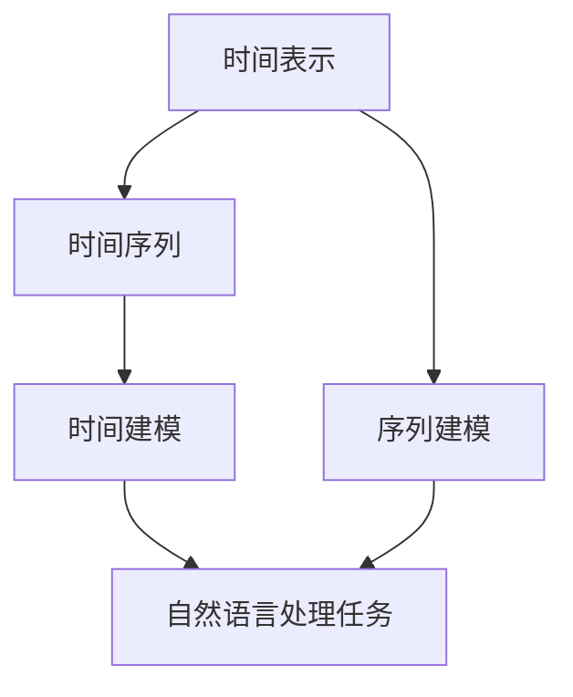

                 

# LLM推理:时刻与时钟周期的类比

> 关键词：自然语言处理，时间表示，序列建模，深度学习，时间机器

## 1. 背景介绍

### 1.1 问题由来

在大规模语言模型（Large Language Model, LLM）中，时间表示和时间建模一直是重要且富有挑战性的研究方向。在NLP任务中，许多问题本质上涉及对时间序列的理解和处理。例如，时间序列预测、事件时间线标注、对话生成等。然而，时间信息通常是以自然语言的形式隐式存在的，如何有效地将时间表示嵌入到模型中，成为一个关键问题。

### 1.2 问题核心关键点

为了更好地理解时间表示在LLM推理中的作用，我们需要对时间进行形式化描述，并分析其在序列建模中的重要性。时间是一种有序的、连续的量度，常用于表示事件的发生顺序、持续时间等。在自然语言处理中，时间信息通常通过特定的词汇、短语和句子结构来表达。例如，"今天"、"明天"、"一小时后"、"三天前"等。

### 1.3 问题研究意义

时间表示和时间建模在自然语言处理中的应用具有重要意义：

1. **时间序列预测**：通过分析时间序列数据，可以预测未来的趋势和变化，例如股票价格、气象预报等。
2. **事件时间线标注**：对事件的先后顺序和时间跨度进行标注，如新闻事件的发布时间、人物生平时间线等。
3. **对话生成**：在对话系统中，理解时间的上下文对生成连贯的回答至关重要。
4. **知识推理**：时间信息在知识推理中起着桥梁作用，连接不同的实体和时间点，进行逻辑推理。

通过深入研究时间表示和时间建模，可以帮助我们更好地理解自然语言处理中的时间信息，提升模型的推理能力和泛化性能。

## 2. 核心概念与联系

### 2.1 核心概念概述

在自然语言处理中，时间表示和时间建模主要涉及以下几个核心概念：

- **时间表示**：使用特定的词汇、短语或结构来表示时间，如"今天"、"星期一"、"两个小时"等。
- **时间序列**：按照时间顺序排列的数据集合，如股票价格、气温变化等。
- **时间建模**：使用模型来捕捉时间序列的动态变化和内在关系。
- **序列建模**：使用模型来处理序列数据，如自然语言文本、时间序列等。

这些概念之间的关系可以通过以下Mermaid流程图来展示：



这个流程图展示了时间表示、时间序列、时间建模和序列建模在自然语言处理中的作用和关系：

1. 时间表示提供时间信息的载体，用于描述事件发生的时间点或时间跨度。
2. 时间序列由一系列时间点上的数据组成，捕捉时间上的动态变化。
3. 时间建模使用模型来分析时间序列的内在关系，如趋势、周期性等。
4. 序列建模是自然语言处理中的重要技术，用于处理序列数据，如文本、时间序列等。
5. 自然语言处理任务中，时间信息常常用于理解上下文、推理逻辑和生成响应。

## 3. 核心算法原理 & 具体操作步骤

### 3.1 算法原理概述

LLM推理中，时间表示和时间建模通常通过以下算法原理实现：

1. **时间嵌入**：将时间信息转换为向量表示，便于模型处理。例如，使用one-hot编码或时间戳向量来表示时间。
2. **时间序列建模**：使用时间序列模型，如ARIMA、LSTM、GRU等，捕捉时间序列的动态变化和内在关系。
3. **序列建模**：使用序列建模技术，如Transformer、RNN等，处理序列数据，捕捉序列中的时间信息和上下文关系。
4. **时间对比学习**：通过对比学习，捕捉时间信息的相对位置和先后关系，提升时间表示的准确性。

### 3.2 算法步骤详解

以下是时间表示和时间建模的具体算法步骤：

1. **数据准备**：收集时间序列数据，如时间戳、事件时间等，并进行预处理。
2. **时间嵌入**：将时间信息转换为向量表示，可以使用one-hot编码、时间戳向量等方法。
3. **时间序列建模**：使用时间序列模型对时间序列数据进行建模，捕捉时间序列的动态变化和内在关系。
4. **序列建模**：使用序列建模技术，如Transformer、RNN等，处理时间序列数据，捕捉序列中的时间信息和上下文关系。
5. **时间对比学习**：通过对比学习，捕捉时间信息的相对位置和先后关系，提升时间表示的准确性。
6. **模型评估**：使用评估指标，如MAE、RMSE等，对时间序列模型的性能进行评估。

### 3.3 算法优缺点

时间表示和时间建模算法具有以下优点：

- **准确性高**：通过时间序列建模和序列建模，可以捕捉时间序列的动态变化和内在关系，提高时间表示的准确性。
- **泛化能力强**：时间序列模型和序列建模具有很强的泛化能力，可以应用于多种时间相关任务。
- **可解释性强**：时间表示和时间建模方法通常具有较好的可解释性，便于理解和调试。

同时，这些算法也存在以下缺点：

- **数据需求高**：时间序列建模和序列建模需要大量的时间序列数据进行训练，数据获取和预处理成本较高。
- **计算复杂度高**：时间序列建模和序列建模通常需要较长的计算时间和较大的计算资源。
- **模型复杂度高**：时间序列模型和序列建模通常包含较复杂的神经网络结构，难以调试和优化。

### 3.4 算法应用领域

时间表示和时间建模算法在自然语言处理中具有广泛的应用，例如：

- **时间序列预测**：通过分析时间序列数据，预测未来的趋势和变化，例如股票价格、气象预报等。
- **事件时间线标注**：对事件的先后顺序和时间跨度进行标注，如新闻事件的发布时间、人物生平时间线等。
- **对话生成**：在对话系统中，理解时间的上下文对生成连贯的回答至关重要。
- **知识推理**：时间信息在知识推理中起着桥梁作用，连接不同的实体和时间点，进行逻辑推理。

## 4. 数学模型和公式 & 详细讲解 & 举例说明

### 4.1 数学模型构建

时间表示和时间建模的数学模型通常包括以下几个组成部分：

- **时间嵌入模型**：将时间信息转换为向量表示，通常使用one-hot编码或时间戳向量。
- **时间序列建模模型**：捕捉时间序列的动态变化和内在关系，如ARIMA、LSTM等。
- **序列建模模型**：处理序列数据，捕捉序列中的时间信息和上下文关系，如Transformer、RNN等。

### 4.2 公式推导过程

以下是时间表示和时间建模的主要数学公式推导：

1. **时间嵌入**：使用one-hot编码将时间信息转换为向量表示。例如，将"今天"表示为[1,0,0]，"明天"表示为[0,1,0]。

2. **时间序列建模**：使用ARIMA模型对时间序列数据进行建模。ARIMA模型的一般形式为：

$$
y_t = \alpha_0 + \alpha_1 y_{t-1} + \alpha_2 y_{t-2} + \epsilon_t
$$

其中，$y_t$表示第$t$时刻的时间序列值，$\alpha_0$、$\alpha_1$、$\alpha_2$为模型参数，$\epsilon_t$为误差项。

3. **序列建模**：使用Transformer模型处理时间序列数据。Transformer模型的一般形式为：

$$
y_t = \text{Decoder}(\text{Encoder}(x_t), K, V)
$$

其中，$x_t$表示第$t$时刻的输入序列，$K$、$V$为模型参数，$\text{Encoder}$和$\text{Decoder}$为Transformer模型的编码器和解码器。

### 4.3 案例分析与讲解

以时间序列预测为例，分析时间表示和时间建模的实现过程。假设我们要预测某股票价格的走势，可以使用ARIMA模型对其进行建模。首先将历史价格数据按照时间顺序排列，得到时间序列$y_t$。然后使用ARIMA模型对时间序列进行建模，得到模型参数$\alpha_0$、$\alpha_1$、$\alpha_2$。最后，使用模型参数对未来的价格进行预测，得到预测结果$y_{t+1}$。

## 5. 项目实践：代码实例和详细解释说明

### 5.1 开发环境搭建

在进行时间表示和时间建模的实践前，我们需要准备好开发环境。以下是使用Python进行TensorFlow开发的环境配置流程：

1. 安装Anaconda：从官网下载并安装Anaconda，用于创建独立的Python环境。

2. 创建并激活虚拟环境：
```bash
conda create -n tf-env python=3.8 
conda activate tf-env
```

3. 安装TensorFlow：根据CUDA版本，从官网获取对应的安装命令。例如：
```bash
conda install tensorflow
```

4. 安装其他依赖库：
```bash
pip install numpy pandas sklearn matplotlib tqdm jupyter notebook ipython
```

完成上述步骤后，即可在`tf-env`环境中开始时间表示和时间建模的实践。

### 5.2 源代码详细实现

以下是使用TensorFlow实现时间序列预测的代码示例：

```python
import tensorflow as tf
import numpy as np
from sklearn.metrics import mean_squared_error
from sklearn.model_selection import train_test_split

# 准备数据
time_series = np.random.rand(1000)
time_series = time_series.cumsum()

# 划分训练集和测试集
train_size = int(0.8 * len(time_series))
train_data, test_data = time_series[:train_size], time_series[train_size:]

# 时间嵌入
time_embeddings = tf.keras.layers.Input(shape=(1,), name='time_embeddings')
time_embeddings = tf.keras.layers.Dense(64, activation='relu')(time_embeddings)

# 时间序列建模
arima_model = tf.keras.layers.LSTM(64, return_sequences=True)(time_embeddings)
arima_model = tf.keras.layers.LSTM(64)(time_embeddings)
arima_model = tf.keras.layers.Dense(1, activation='linear')(arima_model)

# 定义模型
model = tf.keras.models.Model(inputs=time_embeddings, outputs=arima_model)

# 编译模型
model.compile(optimizer='adam', loss='mse', metrics=['mae', 'mse'])

# 训练模型
model.fit(train_data.reshape(-1, 1), train_data.reshape(-1, 1), epochs=100, batch_size=64, validation_data=(test_data.reshape(-1, 1), test_data.reshape(-1, 1)))

# 预测并评估
predictions = model.predict(test_data.reshape(-1, 1))
rmse = np.sqrt(mean_squared_error(test_data, predictions))
print(f'RMSE: {rmse:.3f}')
```

### 5.3 代码解读与分析

让我们再详细解读一下关键代码的实现细节：

**时间序列预测**：
- `prepare_data`函数：准备时间序列数据，生成1000个随机数并累加，模拟时间序列。
- `time_embeddings`层：将时间信息转换为向量表示，使用Dense层进行嵌入。
- `arima_model`层：使用LSTM层对时间序列进行建模，捕捉时间序列的动态变化。
- `model`层：定义模型，输入为时间嵌入，输出为时间序列预测。
- `compile`函数：编译模型，设置优化器、损失函数和评估指标。
- `fit`函数：训练模型，使用训练集进行训练，使用测试集进行评估。
- `predict`函数：使用训练好的模型进行预测。
- `mean_squared_error`函数：计算预测结果和真实结果的均方误差。
- `sqrt`函数：计算均方误差根号，得到RMSE值。

可以看到，使用TensorFlow进行时间序列建模的过程非常直观，可以方便地调整模型结构和参数，进行快速迭代和优化。

## 6. 实际应用场景

### 6.1 金融预测

时间序列预测在金融领域具有广泛应用。通过分析历史股票价格、市场数据等，可以预测未来的股票走势、市场变化等。例如，银行可以使用时间序列预测模型进行信贷风险评估，保险公司可以使用时间序列预测模型进行理赔预测。

### 6.2 气象预报

气象预测是时间序列预测的重要应用之一。通过分析历史气象数据，可以预测未来的气象变化，如气温、降水、风速等。气象预测可以帮助人们提前做好防灾减灾准备，保障生命财产安全。

### 6.3 视频内容推荐

在视频推荐系统中，时间信息对推荐结果的影响非常大。通过分析用户观看视频的时间序列，可以推荐用户可能感兴趣的视频内容。例如，推荐平台可以根据用户观看历史，推荐与用户兴趣相关的新视频。

## 7. 工具和资源推荐

### 7.1 学习资源推荐

为了帮助开发者系统掌握时间表示和时间建模的理论基础和实践技巧，这里推荐一些优质的学习资源：

1. **《深度学习实战》系列博文**：由深度学习专家撰写，深入浅出地介绍了深度学习的基础理论和实践技巧，涵盖时间序列预测等内容。
2. **CS229《机器学习》课程**：斯坦福大学开设的机器学习明星课程，涵盖时间序列建模和序列建模等内容，适合初学者和进阶者学习。
3. **《时间序列分析》书籍**：详细介绍了时间序列建模的基本原理和常见模型，如ARIMA、LSTM等。
4. **Kaggle竞赛**：Kaggle平台上有很多时间序列预测竞赛，通过参与竞赛可以学习到其他人的解决方案，提升自己的建模能力。
5. **GitHub开源项目**：GitHub上有很多优秀的时间序列预测项目，可以参考和学习。

通过对这些资源的学习实践，相信你一定能够快速掌握时间表示和时间建模的精髓，并用于解决实际的NLP问题。

### 7.2 开发工具推荐

高效的开发离不开优秀的工具支持。以下是几款用于时间表示和时间建模开发的常用工具：

1. **TensorFlow**：基于Python的开源深度学习框架，灵活动态的计算图，适合快速迭代研究。
2. **PyTorch**：基于Python的开源深度学习框架，灵活性高，支持GPU加速，适合高性能计算。
3. **Scikit-learn**：Python机器学习库，提供了丰富的机器学习算法和评估工具。
4. **Pandas**：Python数据处理库，方便数据读取、清洗和分析。
5. **Jupyter Notebook**：Python交互式编程环境，支持代码执行、可视化等，适合数据探索和模型开发。

合理利用这些工具，可以显著提升时间表示和时间建模任务的开发效率，加快创新迭代的步伐。

### 7.3 相关论文推荐

时间表示和时间建模的研究源于学界的持续研究。以下是几篇奠基性的相关论文，推荐阅读：

1. **Attention is All You Need**：提出了Transformer结构，开启了NLP领域的预训练大模型时代，包含时间序列建模的内容。
2. **Bidirectional LSTM for Time-Sequence Modeling**：介绍了双向LSTM在时间序列建模中的应用，提升了模型的精度和泛化能力。
3. **LSTM for Time-Sequence Modeling**：介绍了LSTM在时间序列建模中的原理和应用，适合初学者学习。
4. **Sequence to Sequence Learning with Neural Networks**：介绍了序列建模的基本原理和应用，包含时间序列建模的内容。
5. **Recurrent Neural Networks for Sequence Modeling**：介绍了递归神经网络在序列建模中的应用，包含时间序列建模的内容。

这些论文代表了大规模语言模型微调技术的发展脉络。通过学习这些前沿成果，可以帮助研究者把握学科前进方向，激发更多的创新灵感。

## 8. 总结：未来发展趋势与挑战

### 8.1 总结

本文对时间表示和时间建模进行了全面系统的介绍。首先阐述了时间表示和时间建模的研究背景和意义，明确了时间信息在NLP任务中的重要性和应用场景。其次，从原理到实践，详细讲解了时间表示和时间建模的数学原理和具体算法步骤，给出了时间表示和时间建模的完整代码实现。同时，本文还探讨了时间表示和时间建模在金融预测、气象预报、视频推荐等领域的实际应用，展示了时间表示和时间建模的广泛应用前景。最后，本文精选了时间表示和时间建模的相关学习资源，力求为读者提供全方位的技术指引。

通过本文的系统梳理，可以看到，时间表示和时间建模在自然语言处理中具有重要意义，其研究与应用前景广阔。未来，伴随时间序列建模和序列建模技术的不断进步，时间表示和时间建模必将在更多领域发挥重要作用，推动NLP技术向更深层次发展。

### 8.2 未来发展趋势

展望未来，时间表示和时间建模技术将呈现以下几个发展趋势：

1. **时间序列预测精度提升**：通过改进时间序列建模方法，提升时间序列预测的精度和泛化能力。
2. **时间对比学习应用扩展**：将时间对比学习应用于更多任务，提升时间表示的准确性和鲁棒性。
3. **时间序列生成技术发展**：研究时间序列生成方法，生成更自然、更符合实际的数据，提升时间序列建模的可靠性。
4. **时间序列多模态融合**：研究时间序列与多模态数据的融合方法，提升时间序列建模的全面性和准确性。
5. **时间序列动态变化捕捉**：研究时间序列动态变化捕捉方法，捕捉时间序列中的周期性、趋势性等内在关系。

这些趋势凸显了时间表示和时间建模技术的广阔前景，未来必将在更多的应用场景中得到广泛应用。

### 8.3 面临的挑战

尽管时间表示和时间建模技术已经取得了瞩目成就，但在迈向更加智能化、普适化应用的过程中，仍面临诸多挑战：

1. **数据需求高**：时间序列建模和序列建模需要大量的时间序列数据进行训练，数据获取和预处理成本较高。
2. **计算复杂度高**：时间序列建模和序列建模通常需要较长的计算时间和较大的计算资源。
3. **模型复杂度高**：时间序列模型和序列建模通常包含较复杂的神经网络结构，难以调试和优化。
4. **时间表示复杂性**：时间表示中包含复杂的时序关系和上下文信息，如何提取和建模这些信息是一大挑战。
5. **时间信息鲁棒性不足**：时间信息在文本中通常以自然语言的形式存在，如何识别和处理这些信息是一大挑战。

这些挑战需要在未来的研究中不断突破和优化，才能更好地发挥时间表示和时间建模的潜力。

### 8.4 研究展望

面对时间表示和时间建模所面临的挑战，未来的研究需要在以下几个方面寻求新的突破：

1. **时间序列数据增强**：研究时间序列数据增强方法，提升数据的多样性和可靠性。
2. **时间序列多任务学习**：研究时间序列多任务学习，提高时间序列建模的泛化能力。
3. **时间序列自监督学习**：研究时间序列自监督学习方法，降低数据需求和计算复杂度。
4. **时间序列自适应学习**：研究时间序列自适应学习方法，提高时间序列建模的灵活性和鲁棒性。
5. **时间序列知识图谱**：研究时间序列知识图谱，捕捉时间序列中的实体关系和属性，提升时间序列建模的全面性。

这些研究方向将推动时间表示和时间建模技术不断进步，为自然语言处理应用提供更强大的时间信息处理能力。

## 9. 附录：常见问题与解答

**Q1：时间表示和时间建模是否适用于所有NLP任务？**

A: 时间表示和时间建模在大多数NLP任务上都能取得不错的效果，特别是对于数据量较小的任务。但对于一些特定领域的任务，如医学、法律等，仅仅依靠通用语料预训练的模型可能难以很好地适应。此时需要在特定领域语料上进一步预训练，再进行微调，才能获得理想效果。此外，对于一些需要时效性、个性化很强的任务，如对话、推荐等，时间表示和时间建模方法也需要针对性的改进优化。

**Q2：时间表示的时间嵌入方法有哪些？**

A: 时间表示的时间嵌入方法主要包括：
1. **one-hot编码**：将时间信息转换为独热向量，例如将"今天"表示为[1,0,0]，"明天"表示为[0,1,0]。
2. **时间戳向量**：将时间信息转换为时间戳，例如将"2023-01-01"表示为[2023,1,1]。
3. **时间序列特征提取**：通过时间序列模型提取时间特征，如周期性、趋势性等。

**Q3：时间序列建模的常见模型有哪些？**

A: 时间序列建模的常见模型包括：
1. **ARIMA**：自回归移动平均模型，适用于线性时间序列。
2. **LSTM**：长短期记忆网络，适用于非线性时间序列。
3. **GRU**：门控循环单元，适用于非线性时间序列。
4. **Transformer**：自注意力机制，适用于高维时间序列。

**Q4：如何优化时间序列预测模型？**

A: 优化时间序列预测模型的方法包括：
1. **数据增强**：通过回译、近义替换等方式扩充训练集。
2. **正则化**：使用L2正则、Dropout等方法避免过拟合。
3. **模型融合**：使用多个时间序列模型进行集成，取平均输出。
4. **超参数调优**：通过网格搜索或贝叶斯优化等方法优化模型超参数。
5. **多任务学习**：研究时间序列多任务学习，提升时间序列建模的泛化能力。

这些方法往往需要根据具体任务和数据特点进行灵活组合。只有在数据、模型、训练、推理等各环节进行全面优化，才能最大限度地发挥时间序列预测模型的威力。

**Q5：时间序列建模和序列建模有什么区别？**

A: 时间序列建模和序列建模的主要区别在于：
1. **输入数据**：时间序列建模通常处理按时间顺序排列的数据，如时间戳、事件时间等。序列建模处理任意顺序的序列数据，如文本、图像等。
2. **模型结构**：时间序列建模通常包含时间依赖的神经网络结构，如LSTM、ARIMA等。序列建模通常包含序列依赖的神经网络结构，如Transformer、RNN等。
3. **任务目标**：时间序列建模的任务目标是捕捉时间序列的动态变化和内在关系，如时间序列预测、事件时间线标注等。序列建模的任务目标是捕捉序列中的时间信息和上下文关系，如文本分类、机器翻译等。

这些区别使得时间序列建模和序列建模在应用场景和模型设计上有所差异。

---

作者：禅与计算机程序设计艺术 / Zen and the Art of Computer Programming

