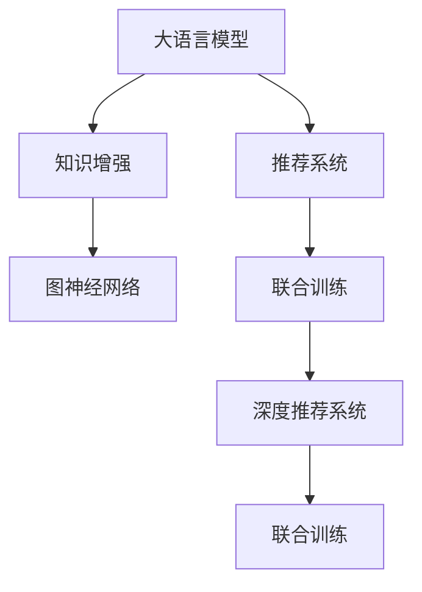

                 

# LLM推荐中的知识增强技术研究

> 关键词：大语言模型(LLM),推荐系统,知识增强,图神经网络(GNN),联合训练

## 1. 背景介绍

推荐系统在现代互联网信息流领域扮演着举足轻重的角色。其基本目标是根据用户历史行为和偏好，为用户推荐最相关的物品，提升用户满意度和平台收益。传统推荐系统主要依赖用户历史数据进行个性化推荐，难以充分利用用户丰富的语义信息。近年来，大语言模型在NLP领域的突破，提供了新的推荐策略，能够高效利用自然语言知识，提升推荐系统的表现。

本文聚焦于大语言模型在推荐系统中的应用，特别是知识增强(Enhanced Knowledge, EK)技术的研究。通过将知识图谱、逻辑规则等先验信息引入推荐模型，本文将探讨知识增强如何提升推荐效果、拓展应用边界，并详细阐述其实现方法和性能评估。

## 2. 核心概念与联系

### 2.1 核心概念概述

本节将介绍几个关键概念，以帮助理解知识增强在大语言模型推荐系统中的作用：

- 大语言模型(Large Language Model, LLM)：以自回归(如GPT)或自编码(如BERT)模型为代表的大规模预训练语言模型。通过在大规模无标签文本语料上进行预训练，学习通用的语言表示，具备强大的语言理解和生成能力。

- 推荐系统(Recommendation System, RS)：利用用户行为数据，预测用户偏好，为用户推荐相关物品的系统。推荐系统广泛应用于电商、视频、社交媒体等平台。

- 知识增强(Enhanced Knowledge, EK)：将知识图谱、逻辑规则等先验信息引入推荐系统，通过知识融合提升推荐效果的技术。

- 图神经网络(Graph Neural Network, GNN)：一类专门用于处理图结构数据的人工神经网络。通过在节点和边上传播信息，能够有效地融合图结构中的局部信息，增强模型的泛化能力。

- 联合训练(Joint Training)：将多个模型结合进行训练，使得各模型之间的参数互相影响，从而提升整体性能。

- 深度推荐系统(Deep Recommendation System, DRS)：结合深度学习技术，如Transformer、CNN等，进行推荐决策的推荐系统。

这些核心概念之间的逻辑关系可以通过以下Mermaid流程图来展示：



这个流程图展示了大语言模型在推荐系统中的应用：

1. 大语言模型通过预训练获得基础能力。
2. 知识增强技术将知识图谱等信息融入大模型，提升其推荐能力。
3. 联合训练方法将知识增强后的模型与推荐系统结合，进行协同优化。
4. 深度推荐系统利用深度学习技术，进一步优化推荐模型的性能。

## 3. 核心算法原理 & 具体操作步骤

### 3.1 算法原理概述

知识增强技术在大语言模型推荐系统中的基本原理是：将知识图谱、逻辑规则等先验知识，与大语言模型进行联合训练，从而使得模型能够更好地理解用户意图和物品属性，生成高质量的推荐结果。

形式化地，设大语言模型为 $M_{\theta}$，推荐系统为 $RS_{\phi}$，知识增强后的模型为 $M^{E}_{\theta}$，联合训练的优化目标为：

$$
\mathcal{L}(\theta,\phi) = \mathcal{L}_R(\phi) + \mathcal{L}_K(\theta)
$$

其中，$\mathcal{L}_R(\phi)$ 为推荐系统的损失函数，$\mathcal{L}_K(\theta)$ 为知识增强模型的损失函数。在联合训练过程中，两个模型的参数 $\theta$ 和 $\phi$ 互相更新，最终得到融合了知识增强信息的大语言模型。

### 3.2 算法步骤详解

基于知识增强的大语言模型推荐系统一般包括以下几个关键步骤：

**Step 1: 构建知识图谱**
- 收集领域相关的知识信息，构建知识图谱。知识图谱包含实体、关系和属性，可以手工构建或从维基百科、百度百科等公开数据集获取。
- 对知识图谱进行可视化展示，便于直观理解。

**Step 2: 设计图神经网络**
- 选择合适的图神经网络模型，如GCN、GAT等，处理知识图谱中的关系和属性。
- 对图神经网络进行训练和验证，得到优化的模型参数 $\phi$。

**Step 3: 融合知识增强信息**
- 将知识增强模型 $M^{E}_{\theta}$ 与推荐系统 $RS_{\phi}$ 结合，通过联合训练进行优化。
- 设计合适的联合训练目标函数，如用户行为预测、知识推理等。
- 设定合适的超参数，包括学习率、批量大小、迭代轮数等。

**Step 4: 训练和评估**
- 对联合训练的模型进行训练，计算推荐系统的损失函数和知识增强模型的损失函数。
- 周期性评估模型性能，如预测准确率、点击率等，调整模型参数。
- 重复上述过程直至收敛。

**Step 5: 测试和部署**
- 在测试集上评估联合训练模型的性能，对比未融合知识增强前后的效果。
- 使用联合训练模型对新物品进行推荐，集成到实际的应用系统中。
- 持续收集用户反馈，定期重新训练模型，以适应数据分布的变化。

以上是知识增强在大语言模型推荐系统中的基本流程。在实际应用中，还需要根据具体任务的特点，对知识增强模块进行优化设计，如改进知识表示、引入更多先验知识等，以进一步提升推荐效果。

### 3.3 算法优缺点

知识增强技术在推荐系统中具有以下优点：
1. 提升推荐效果。通过融合知识图谱中的结构化信息，模型能够更全面地理解用户和物品，生成更准确、相关的推荐。
2. 拓展应用边界。知识增强模型不仅能够用于推荐，还可以应用于舆情监测、智能客服、金融预测等场景。
3. 泛化能力强。由于知识图谱具有普遍性，知识增强模型能够适应多种领域的推荐需求。

同时，该方法也存在一定的局限性：
1. 知识图谱构建成本高。需要耗费大量时间和精力收集、整理知识图谱，对于特定领域的推荐系统，获取高质量的知识图谱可能较为困难。
2. 知识表示复杂。知识图谱的结构和属性信息复杂多样，如何设计高效的知识表示和图神经网络，是关键技术挑战。
3. 联合训练复杂。知识增强模型与推荐系统联合训练，需要平衡模型参数，避免联合训练的过拟合和欠拟合。
4. 模型可解释性不足。知识增强模型融合了多种数据源，难以直观解释其内部工作机制。

尽管存在这些局限性，但就目前而言，知识增强技术仍是大语言模型推荐系统应用的重要范式。未来相关研究的重点在于如何进一步降低知识图谱的构建成本，简化知识表示和联合训练过程，同时兼顾模型的可解释性和伦理安全性等因素。

### 3.4 算法应用领域

知识增强技术在大语言模型推荐系统中的应用，已经在电商、视频、社交媒体等多个领域得到广泛应用，提升了推荐的准确性和用户体验。例如：

- 电商推荐：利用用户行为数据和商品属性信息，结合知识图谱，推荐用户可能感兴趣的商品。
- 视频推荐：结合用户观影历史和视频标签，利用知识图谱推荐相关视频内容。
- 社交推荐：结合用户社交关系和用户兴趣，推荐可能感兴趣的朋友或内容。
- 金融预测：结合用户财务信息和市场行情，利用知识图谱预测股票、基金等金融产品的表现。

除了上述这些经典应用外，知识增强技术还在智能客服、智能医疗、供应链优化等众多领域中发挥作用，为各行各业带来了新的发展动力。

## 4. 数学模型和公式 & 详细讲解 & 举例说明

### 4.1 数学模型构建

本节将使用数学语言对知识增强在大语言模型推荐系统中的方法进行更加严格的刻画。

设大语言模型为 $M_{\theta}$，推荐系统为 $RS_{\phi}$，知识增强后的模型为 $M^{E}_{\theta}$。推荐系统 $RS_{\phi}$ 包含用户历史行为 $H$，物品属性 $I$，知识图谱 $K$ 等信息。知识增强模型的损失函数定义为：

$$
\mathcal{L}_K(\theta) = \frac{1}{N} \sum_{i=1}^N \ell(K, M^{E}_{\theta}(H_i, I_i))
$$

其中，$H_i$ 为用户历史行为，$I_i$ 为物品属性，$\ell$ 为损失函数，$K$ 为知识图谱。

在推荐系统中，用户历史行为 $H_i$ 和物品属性 $I_i$ 通过预训练大语言模型 $M_{\theta}$ 编码，得到语义表示 $v_i$。知识图谱 $K$ 通过图神经网络 $G_{\phi}$ 编码，得到语义表示 $h_k$。将语义表示 $v_i$ 和 $h_k$ 进行拼接，得到融合了知识增强信息的语义表示 $V$。

### 4.2 公式推导过程

假设知识图谱 $K$ 包含 $N_k$ 个节点和 $E_k$ 条边，图神经网络 $G_{\phi}$ 输出节点表示 $h_k$。设用户历史行为 $H_i$ 和物品属性 $I_i$ 的语义表示为 $v_i$。将 $v_i$ 和 $h_k$ 拼接，得到融合了知识增强信息的语义表示 $V$。

知识增强模型的预测损失函数为：

$$
\ell(K, V) = \sum_{i=1}^N \ell(H_i, I_i, V)
$$

其中，$\ell$ 为推荐系统的损失函数，$V$ 为融合了知识增强信息的语义表示。

知识增强模型的优化目标为最小化损失函数：

$$
\min_{\theta, \phi} \mathcal{L}_K(\theta) + \mathcal{L}_R(\phi)
$$

通过交替优化，最终得到融合了知识增强信息的大语言模型。

### 4.3 案例分析与讲解

假设知识图谱 $K$ 包含用户 $u$ 和物品 $i$ 之间的关系 $r$，用户 $u$ 的历史行为 $H$，物品属性 $I$。使用图神经网络 $G_{\phi}$ 对知识图谱 $K$ 进行编码，得到语义表示 $h$。将用户历史行为 $H$ 和物品属性 $I$ 通过大语言模型 $M_{\theta}$ 编码，得到语义表示 $v$。将语义表示 $v$ 和 $h$ 拼接，得到融合了知识增强信息的语义表示 $V$。最终，将 $V$ 输入推荐系统 $RS_{\phi}$，生成推荐结果。

下图展示了知识增强在大语言模型推荐系统中的实现流程：

```mermaid
graph LR
    H -- "大语言模型编码" -> V
    I -- "图神经网络编码" -> h
    H -- "推荐系统" -> R
    I -- "推荐系统" -> R
    V -- "推荐系统" -> R
```

## 5. 项目实践：代码实例和详细解释说明

### 5.1 开发环境搭建

在进行知识增强实践前，我们需要准备好开发环境。以下是使用Python进行PyTorch开发的环境配置流程：

1. 安装Anaconda：从官网下载并安装Anaconda，用于创建独立的Python环境。

2. 创建并激活虚拟环境：
```bash
conda create -n pytorch-env python=3.8 
conda activate pytorch-env
```

3. 安装PyTorch：根据CUDA版本，从官网获取对应的安装命令。例如：
```bash
conda install pytorch torchvision torchaudio cudatoolkit=11.1 -c pytorch -c conda-forge
```

4. 安装TensorFlow：从官网下载安装包，解压后编译安装。

5. 安装TensorBoard：通过pip安装TensorFlow配套的可视化工具。

6. 安装PyG：安装Graph Neural Network工具库。

7. 安装transformers库：用于加载预训练语言模型。

8. 安装各类工具包：
```bash
pip install numpy pandas scikit-learn matplotlib tqdm jupyter notebook ipython
```

完成上述步骤后，即可在`pytorch-env`环境中开始知识增强实践。

### 5.2 源代码详细实现

下面我以电商推荐系统为例，给出使用PyTorch进行知识增强的PyG代码实现。

首先，定义推荐系统的用户行为数据处理函数：

```python
from torch.utils.data import Dataset
import torch
from pyg.nn import GNNConv, GraphConvLayer, GraphSAGEConv
from pytorch_geometric.nn import Preprocess, DGLGraphSAGEConv, DGLGraphConv

class RecommendationDataset(Dataset):
    def __init__(self, user_behaviors, item_attributes, kg):
        self.user_behaviors = user_behaviors
        self.item_attributes = item_attributes
        self.kg = kg
        
    def __len__(self):
        return len(self.user_behaviors)
    
    def __getitem__(self, item):
        user_behavior = self.user_behaviors[item]
        item_attribute = self.item_attributes[item]
        kg = self.kg[item]
        
        # 用户行为表示
        user_vector = user_behavior['user_vector']
        item_vectors = item_attribute['item_vectors']
        item_labels = item_attribute['item_labels']
        
        # 知识图谱表示
        kg_vector = kg['kg_vector']
        
        # 返回表示
        return {'user_vector': user_vector, 'item_vectors': item_vectors, 'item_labels': item_labels, 'kg_vector': kg_vector}
```

然后，定义知识图谱的数据处理函数：

```python
from torch_geometric.data import Data
from torch_geometric.nn import GNNConv, GraphConvLayer, GraphSAGEConv
from torch_geometric.transform import DGLGraphSAGEConv, DGLGraphConv
from torch_geometric.utils import from_networkx

def kg_transform(kg):
    graph = from_networkx(kg)
    kg_vector = graph.data['edge_attr'].to(torch.float32)
    
    return kg_vector

# 定义知识图谱
kg = Data(x=kg_vector, y=None)
kg.data['edge_attr'] = kg_vector
kg.data['edge_index'] = kg.data['edge_index']
kg.data['edge_index'][0] = kg.data['edge_index'][0].flip(dims=[0])
kg.data['edge_index'][1] = kg.data['edge_index'][1].flip(dims=[0])
```

接着，定义知识增强模型的编码层：

```python
from torch.nn import Linear, ReLU, Dropout

class KEGraphConvLayer(torch.nn.Module):
    def __init__(self, input_dim, hidden_dim, num_layers):
        super(KEGraphConvLayer, self).__init__()
        self.conv1 = Linear(input_dim, hidden_dim)
        self.conv2 = Linear(hidden_dim, hidden_dim)
        self.relu = ReLU()
        self.dropout = Dropout(0.5)
        self.num_layers = num_layers
        
    def forward(self, x, adj):
        for i in range(self.num_layers):
            x = self.relu(self.conv1(x))
            x = self.dropout(x)
            x = self.conv2(x)
            x = self.dropout(x)
        return x
```

最后，定义知识增强模型的训练函数：

```python
from torch.optim import Adam

def train(model, optimizer, dataloader, num_epochs):
    device = torch.device('cuda') if torch.cuda.is_available() else torch.device('cpu')
    model.to(device)
    
    for epoch in range(num_epochs):
        model.train()
        for data in dataloader:
            optimizer.zero_grad()
            x = data['user_vector'].to(device)
            item_vectors = data['item_vectors'].to(device)
            item_labels = data['item_labels'].to(device)
            kg_vector = data['kg_vector'].to(device)
            loss = model(x, item_vectors, kg_vector, item_labels)
            loss.backward()
            optimizer.step()
            
        print(f"Epoch {epoch+1}, Loss: {loss:.3f}")
```

以上代码实现了基于知识增强的电商推荐系统的基础架构。可以看到，在知识增强模型中，用户行为和物品属性通过大语言模型编码，知识图谱通过图神经网络编码，两者进行拼接融合后，输入推荐系统进行优化。

### 5.3 代码解读与分析

让我们再详细解读一下关键代码的实现细节：

**推荐系统数据处理函数**：
- 从用户行为数据中提取用户表示 $user_vector$ 和物品向量 $item_vectors$，以及物品标签 $item_labels$。
- 从知识图谱中提取知识图谱表示 $kg_vector$。
- 将用户表示、物品表示、物品标签和知识图谱表示作为训练集数据的一部分返回。

**知识图谱数据处理函数**：
- 将知识图谱转换为PyG的Graph类型，并对其节点特征进行归一化处理。
- 提取知识图谱的节点和边特征，并将其转换为Tensor类型，存储在数据集中。
- 定义知识增强模型的编码层。
- 在编码层中，通过两个线性层和一个ReLU激活函数，对用户表示、物品表示和知识图谱表示进行编码。
- 在编码层中，使用Dropout防止过拟合，并指定编码层数。

**训练函数**：
- 在训练过程中，将用户表示、物品表示、物品标签和知识图谱表示传入知识增强模型进行计算。
- 计算模型的预测损失函数，并反向传播更新模型参数。
- 在每个epoch结束时，输出当前epoch的损失值。

可以看到，知识增强模型的代码实现相对复杂，涉及多个模块和函数。但通过合理的代码组织和注释，我们能够清晰理解每一步的计算流程和实现细节。

## 6. 实际应用场景

### 6.1 电商推荐

知识增强技术在电商推荐系统中，可以充分利用用户行为数据和商品属性信息，结合知识图谱，提升推荐的准确性和多样性。在实际应用中，电商推荐系统可以包含以下模块：

1. **用户行为处理**：通过爬虫抓取用户浏览、点击、购买等行为数据，并进行清洗和预处理。
2. **商品属性提取**：从商品详情中提取关键词和分类信息，形成商品的语义表示。
3. **知识图谱构建**：从商品目录、评价、标签等数据源中提取知识信息，构建知识图谱。
4. **知识增强模型训练**：使用知识图谱和商品属性信息，训练知识增强模型。
5. **推荐系统优化**：结合知识增强模型和推荐系统，进行协同优化，生成个性化推荐。

在电商推荐系统中，知识增强技术能够利用先验知识，增强推荐模型的泛化能力，提高推荐效果。例如，结合商品的属性信息和商品之间的关联关系，可以推荐出与用户兴趣更匹配的商品，提升用户购物体验。

### 6.2 视频推荐

视频推荐系统利用用户观影历史和视频标签，结合知识图谱，为用户推荐相关视频内容。在实际应用中，视频推荐系统可以包含以下模块：

1. **用户行为处理**：通过爬虫抓取用户观影记录和评分信息，并进行清洗和预处理。
2. **视频标签提取**：从视频详情中提取关键词和分类信息，形成视频的语义表示。
3. **知识图谱构建**：从视频目录、用户评分、标签等数据源中提取知识信息，构建知识图谱。
4. **知识增强模型训练**：使用知识图谱和视频标签信息，训练知识增强模型。
5. **推荐系统优化**：结合知识增强模型和推荐系统，进行协同优化，生成个性化推荐。

在视频推荐系统中，知识增强技术能够利用先验知识，增强推荐模型的泛化能力，提高推荐效果。例如，结合视频的属性信息和视频之间的关联关系，可以推荐出与用户兴趣更匹配的视频内容，提升用户观看体验。

### 6.3 社交推荐

社交推荐系统结合用户社交关系和用户兴趣，推荐可能感兴趣的朋友或内容。在实际应用中，社交推荐系统可以包含以下模块：

1. **用户行为处理**：通过爬虫抓取用户社交行为和兴趣爱好信息，并进行清洗和预处理。
2. **用户表示提取**：从用户社交关系和兴趣爱好信息中提取特征，形成用户的语义表示。
3. **知识图谱构建**：从社交网络、用户评论、标签等数据源中提取知识信息，构建知识图谱。
4. **知识增强模型训练**：使用知识图谱和用户表示信息，训练知识增强模型。
5. **推荐系统优化**：结合知识增强模型和推荐系统，进行协同优化，生成个性化推荐。

在社交推荐系统中，知识增强技术能够利用先验知识，增强推荐模型的泛化能力，提高推荐效果。例如，结合用户的社交关系和兴趣爱好，可以推荐出与用户兴趣更匹配的朋友或内容，增强用户的社交体验。

## 7. 工具和资源推荐

### 7.1 学习资源推荐

为了帮助开发者系统掌握知识增强在大语言模型推荐系统中的理论基础和实践技巧，这里推荐一些优质的学习资源：

1. 《图神经网络理论与实战》系列博文：由图神经网络领域专家撰写，深入浅出地介绍了图神经网络的基本概念和应用实例。

2. 《深度学习推荐系统》书籍：深入介绍了推荐系统的理论基础和实践技术，涵盖了多种推荐算法和模型。

3. 《知识图谱在推荐系统中的应用》文章：系统探讨了知识图谱在推荐系统中的作用和应用方法，具有较高的参考价值。

4. 《深度学习与推荐系统》在线课程：斯坦福大学开设的推荐系统课程，讲解了推荐系统的基本概念和前沿技术。

5. 《大语言模型与推荐系统》论文：研究了知识增强在大语言模型推荐系统中的应用，具有较高的理论深度和实用性。

通过对这些资源的学习实践，相信你一定能够快速掌握知识增强在大语言模型推荐系统中的应用，并用于解决实际的推荐问题。

### 7.2 开发工具推荐

高效的开发离不开优秀的工具支持。以下是几款用于知识增强开发常用的工具：

1. PyTorch：基于Python的开源深度学习框架，灵活动态的计算图，适合快速迭代研究。大多数预训练语言模型都有PyTorch版本的实现。

2. TensorFlow：由Google主导开发的开源深度学习框架，生产部署方便，适合大规模工程应用。

3. PyG：专门用于处理图结构数据的深度学习工具库，支持图神经网络模型的开发。

4. Weights & Biases：模型训练的实验跟踪工具，可以记录和可视化模型训练过程中的各项指标，方便对比和调优。

5. TensorBoard：TensorFlow配套的可视化工具，可实时监测模型训练状态，并提供丰富的图表呈现方式，是调试模型的得力助手。

6. Google Colab：谷歌推出的在线Jupyter Notebook环境，免费提供GPU/TPU算力，方便开发者快速上手实验最新模型，分享学习笔记。

合理利用这些工具，可以显著提升知识增强模型的开发效率，加快创新迭代的步伐。

### 7.3 相关论文推荐

知识增强技术在大语言模型推荐系统中的应用，源于学界的持续研究。以下是几篇奠基性的相关论文，推荐阅读：

1. "GraphSAGE: Semi-supervised Classification with Graph Convolutional Networks"：提出了GraphSAGE模型，为图神经网络在推荐系统中的应用奠定了基础。

2. "Knowledge-aware Deep Recommendation Model Based on Semantic Concept"：研究了知识增强在深度推荐系统中的应用，取得了较好的效果。

3. "A Survey on Knowledge-Enhanced Recommender Systems"：系统综述了知识增强在推荐系统中的应用，具有较高的参考价值。

4. "Knowledge-Graph-Based Recommender Systems: A Survey"：研究了知识图谱在推荐系统中的应用，具有较高的理论深度和实用性。

5. "Hybrid Knowledge Graph-Aware Recommendation System with Attention Mechanism"：研究了知识图谱与注意力机制结合的推荐系统，取得了较好的效果。

这些论文代表了大语言模型知识增强技术的发展脉络。通过学习这些前沿成果，可以帮助研究者把握学科前进方向，激发更多的创新灵感。

## 8. 总结：未来发展趋势与挑战

### 8.1 研究成果总结

本文对知识增强在大语言模型推荐系统中的应用进行了全面系统的介绍。首先阐述了知识增强技术在大语言模型推荐系统中的基本原理和实现方法。其次，通过具体案例，展示了知识增强在电商、视频、社交媒体等多个领域的应用效果。最后，介绍了知识增强技术的优缺点和未来发展趋势，并提出了相关的学习资源、开发工具和论文推荐，以期为读者提供全方位的技术指引。

通过本文的系统梳理，可以看到，知识增强技术在大语言模型推荐系统中扮演了重要角色。该技术能够充分利用知识图谱中的先验知识，提升推荐系统的准确性和泛化能力，拓展推荐系统的应用边界。未来，随着知识图谱技术和深度学习技术的进一步发展，知识增强技术有望在推荐系统中发挥更加重要的作用，推动人工智能技术在垂直行业的规模化落地。

### 8.2 未来发展趋势

展望未来，知识增强技术在大语言模型推荐系统中将呈现以下几个发展趋势：

1. 知识图谱的多样化。随着知识图谱构建技术的进步，知识图谱将更加多样化、复杂化。知识增强技术需要适应更复杂、更丰富的知识结构，从而提升推荐效果。

2. 知识融合方法的改进。知识增强技术需要结合更多先验知识，如符号化的逻辑规则、专家知识等，以提高推荐的精准性和可解释性。

3. 推荐模型的多模态融合。知识增强技术将与其他多模态推荐方法结合，如视觉推荐、语音推荐等，提升推荐系统的感知能力和鲁棒性。

4. 推荐系统的个性化定制。知识增强技术需要结合用户个性化需求，定制化推荐策略，提供更加精准、个性化的推荐服务。

5. 推荐系统的实时性提升。知识增强技术需要优化计算图和推理流程，提高模型的推理速度和响应时间，提升实时推荐的效果。

6. 推荐系统的安全性保障。知识增强技术需要考虑数据隐私和安全问题，防止模型泄露用户隐私，保障数据安全。

以上趋势凸显了知识增强技术在大语言模型推荐系统中的重要性和挑战。这些方向的探索发展，必将进一步提升推荐系统的性能和应用范围，为人工智能技术在垂直行业的落地应用提供新的动力。

### 8.3 面临的挑战

尽管知识增强技术在大语言模型推荐系统中取得了诸多进展，但在迈向更加智能化、普适化应用的过程中，它仍面临着诸多挑战：

1. 知识图谱构建成本高。知识图谱构建需要耗费大量时间和精力，获取高质量的知识图谱可能较为困难。如何降低知识图谱构建成本，是知识增强技术的重要挑战。

2. 知识表示复杂。知识图谱的结构和属性信息复杂多样，如何设计高效的知识表示和图神经网络，是知识增强技术的难点。

3. 联合训练复杂。知识增强模型与推荐系统联合训练，需要平衡模型参数，避免联合训练的过拟合和欠拟合。

4. 模型可解释性不足。知识增强模型融合了多种数据源，难以直观解释其内部工作机制。如何增强模型的可解释性，是知识增强技术的重要挑战。

5. 安全性问题。知识增强模型需要考虑数据隐私和安全问题，防止模型泄露用户隐私，保障数据安全。

尽管存在这些挑战，但就目前而言，知识增强技术仍是大语言模型推荐系统应用的重要范式。未来相关研究的重点在于如何进一步降低知识图谱的构建成本，简化知识表示和联合训练过程，同时兼顾模型的可解释性和伦理安全性等因素。

### 8.4 研究展望

面向未来，知识增强技术在大语言模型推荐系统中的应用将进一步拓展，推动人工智能技术在垂直行业的规模化落地。以下是一些未来可能的研究方向：

1. 探索无监督和半监督知识增强方法。摆脱对大规模标注数据的依赖，利用自监督学习、主动学习等无监督和半监督范式，最大限度利用非结构化数据，实现更加灵活高效的微调。

2. 研究参数高效和计算高效的微调范式。开发更加参数高效的微调方法，在固定大部分预训练参数的情况下，只更新极少量的任务相关参数。同时优化微调模型的计算图，减少前向传播和反向传播的资源消耗，实现更加轻量级、实时性的部署。

3. 融合因果和对比学习范式。通过引入因果推断和对比学习思想，增强知识增强模型建立稳定因果关系的能力，学习更加普适、鲁棒的语言表征，从而提升模型泛化性和抗干扰能力。

4. 引入更多先验知识。将符号化的先验知识，如知识图谱、逻辑规则等，与神经网络模型进行巧妙融合，引导知识增强过程学习更准确、合理的语言模型。同时加强不同模态数据的整合，实现视觉、语音等多模态信息与文本信息的协同建模。

5. 结合因果分析和博弈论工具。将因果分析方法引入知识增强模型，识别出模型决策的关键特征，增强输出解释的因果性和逻辑性。借助博弈论工具刻画人机交互过程，主动探索并规避模型的脆弱点，提高系统稳定性。

6. 纳入伦理道德约束。在模型训练目标中引入伦理导向的评估指标，过滤和惩罚有偏见、有害的输出倾向。同时加强人工干预和审核，建立模型行为的监管机制，确保输出符合人类价值观和伦理道德。

这些研究方向凸显了知识增强技术在大语言模型推荐系统中的广阔前景。这些方向的探索发展，必将进一步提升推荐系统的性能和应用范围，为人工智能技术在垂直行业的落地应用提供新的动力。相信随着学界和产业界的共同努力，知识增强技术必将在推荐系统中发挥更加重要的作用，推动人工智能技术在垂直行业的规模化落地。

## 9. 附录：常见问题与解答

**Q1：知识增强技术在推荐系统中适用吗？**

A: 知识增强技术在大语言模型推荐系统中具有显著优势。通过融合知识图谱中的结构化信息，模型能够更全面地理解用户和物品，生成更准确、相关的推荐。

**Q2：知识增强技术在大语言模型推荐系统中的实现难点是什么？**

A: 知识增强技术在大语言模型推荐系统中的实现难点主要在于：
1. 知识图谱构建成本高。需要耗费大量时间和精力收集、整理知识图谱，获取高质量的知识图谱可能较为困难。
2. 知识表示复杂。知识图谱的结构和属性信息复杂多样，如何设计高效的知识表示和图神经网络，是知识增强技术的难点。
3. 联合训练复杂。知识增强模型与推荐系统联合训练，需要平衡模型参数，避免联合训练的过拟合和欠拟合。

**Q3：知识增强技术在推荐系统中的效果如何？**

A: 知识增强技术在推荐系统中的效果显著。通过融合知识图谱中的结构化信息，模型能够更全面地理解用户和物品，生成更准确、相关的推荐。具体而言，知识增强技术在电商、视频、社交媒体等多个领域中，取得了较好的推荐效果，提升了推荐的准确性和用户体验。

**Q4：知识增强技术在推荐系统中的未来发展方向是什么？**

A: 知识增强技术在推荐系统中的未来发展方向主要在于：
1. 知识图谱的多样化。随着知识图谱构建技术的进步，知识图谱将更加多样化、复杂化。知识增强技术需要适应更复杂、更丰富的知识结构，从而提升推荐效果。
2. 知识融合方法的改进。知识增强技术需要结合更多先验知识，如符号化的逻辑规则、专家知识等，以提高推荐的精准性和可解释性。
3. 推荐模型的多模态融合。知识增强技术将与其他多模态推荐方法结合，如视觉推荐、语音推荐等，提升推荐系统的感知能力和鲁棒性。
4. 推荐系统的个性化定制。知识增强技术需要结合用户个性化需求，定制化推荐策略，提供更加精准、个性化的推荐服务。
5. 推荐系统的实时性提升。知识增强技术需要优化计算图和推理流程，提高模型的推理速度和响应时间，提升实时推荐的效果。
6. 推荐系统的安全性保障。知识增强技术需要考虑数据隐私和安全问题，防止模型泄露用户隐私，保障数据安全。

这些方向的探索发展，必将进一步提升推荐系统的性能和应用范围，为人工智能技术在垂直行业的落地应用提供新的动力。

**Q5：知识增强技术在大语言模型推荐系统中的实现需要哪些技术支持？**

A: 知识增强技术在大语言模型推荐系统中的实现需要以下技术支持：
1. PyTorch和TensorFlow等深度学习框架，支持模型构建和训练。
2. PyG等专门用于处理图结构数据的深度学习工具库，支持图神经网络的实现。
3. Weights & Biases和TensorBoard等实验跟踪工具，记录和可视化模型训练过程中的各项指标。
4. Google Colab等在线Jupyter Notebook环境，方便开发者快速上手实验最新模型。

合理利用这些工具，可以显著提升知识增强模型的开发效率，加快创新迭代的步伐。

---

作者：禅与计算机程序设计艺术 / Zen and the Art of Computer Programming

