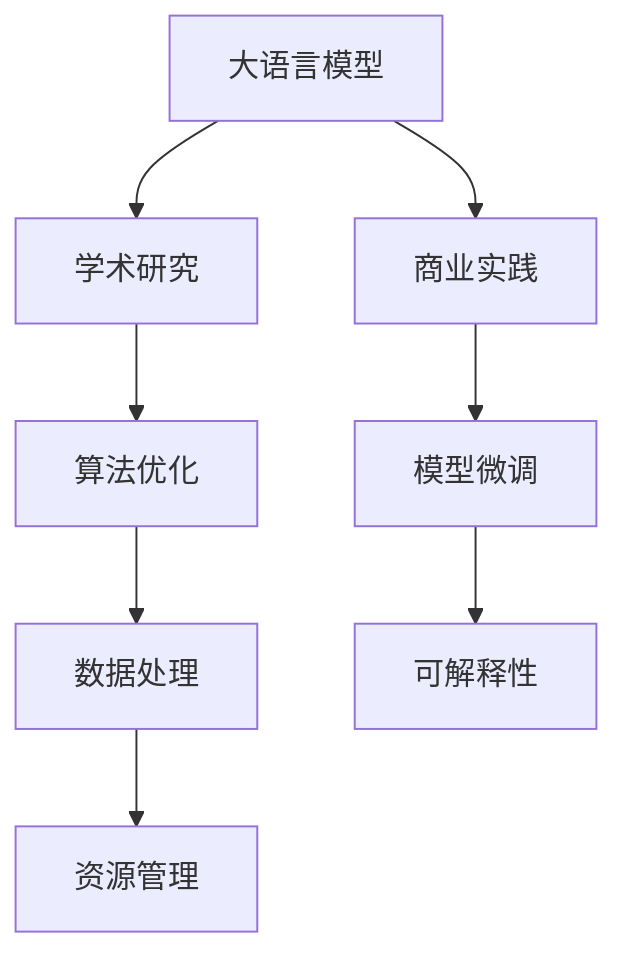

                 

# LLM的跨界应用：从学术研究到商业实践

> 关键词：
- 大语言模型(LLM)
- 跨界应用
- 学术研究
- 商业实践
- 可解释性
- 性能优化
- 资源管理
- 数据处理

## 1. 背景介绍

### 1.1 问题由来

随着深度学习和大数据技术的发展，大语言模型(LLM)如BERT、GPT等取得了显著进展，极大地提升了自然语言处理(NLP)领域的自动化水平。这些模型不仅在学术界取得了丰硕成果，也逐步在商业实践中落地，展示了其在不同场景下的强大潜力。然而，学术研究与商业实践之间仍存在较大鸿沟，需要深化对LLM的理解，拓展其应用范围，同时提升其在实际场景中的应用效果。

### 1.2 问题核心关键点

LLM的跨界应用关键在于：

- **学术研究的深度与广度**：学术研究能够探索LLM的理论极限，提供算法创新和模型优化，为商业实践提供理论指导。
- **商业实践的实用性和可扩展性**：商业实践能够推动LLM的实际应用，提升模型性能，拓展应用场景，促进产业升级。

学术研究和商业实践之间的深度融合，能够最大程度地发挥LLM的潜力，推动其从实验室走向实际应用。

### 1.3 问题研究意义

研究LLM的跨界应用，对于促进学术界与工业界的协同创新，推动NLP技术的产业化进程，具有重要意义：

- 加速技术转化：将学术研究的成果快速转化为商业应用，加速NLP技术的产业化进程。
- 提升应用效果：学术研究的深度优化与商业实践的灵活应用相结合，提升LLM在实际场景中的应用效果。
- 促进产业升级：LLM技术的商业应用能够带来新的市场需求，推动相关产业的发展和升级。
- 推动技术创新：跨界应用过程中涌现的新问题和新需求，能够激发新的研究热点和创新突破。

本文将从学术研究和商业实践两个角度，全面系统地探讨LLM的跨界应用，提供丰富的学习资源、工具和实践指导，帮助读者更好地理解和应用LLM技术。

## 2. 核心概念与联系

### 2.1 核心概念概述

为更好地理解LLM的跨界应用，本节将介绍几个密切相关的核心概念：

- **大语言模型(LLM)**：以Transformer模型为代表的大规模预训练语言模型，能够处理自然语言的大规模文本数据，具备强大的语言理解与生成能力。

- **学术研究**：研究者通过算法创新、模型优化等手段，推动LLM技术的理论发展。

- **商业实践**：企业将LLM应用于实际业务中，通过模型微调、集成开发等手段，提升NLP系统的性能和实用性。

- **可解释性**：LLM模型的决策过程应具备可解释性，便于用户理解、信任和使用。

- **性能优化**：通过算法优化、模型剪枝、资源管理等手段，提升LLM模型在实际场景中的性能和效率。

- **资源管理**：有效管理计算资源、内存资源和存储资源，确保LLM模型的高效运行。

- **数据处理**：对输入数据进行预处理、标注、增强等操作，提高数据质量，优化模型训练效果。

这些概念之间的逻辑关系可以通过以下Mermaid流程图来展示：



这个流程图展示了大语言模型的核心概念及其之间的关系：

1. 大语言模型通过学术研究获得基础能力。
2. 学术研究通过算法和模型优化，提升模型性能。
3. 商业实践通过模型微调，提升模型在实际场景中的应用效果。
4. 数据处理提高模型训练效果。
5. 资源管理保障模型的高效运行。
6. 可解释性提升用户信任和模型理解。

这些概念共同构成了LLM的跨界应用框架，使其能够在学术研究与商业实践之间自由穿梭，最大程度地发挥其潜力。

## 3. 核心算法原理 & 具体操作步骤

### 3.1 算法原理概述

LLM的跨界应用，本质上是一个从学术研究到商业实践的迁移学习过程。其核心思想是：

1. 将学术研究中优化的LLM模型应用到商业实践中，通过微调（Fine-Tuning）等方式，提升模型在特定任务上的性能。
2. 利用学术研究的算法和模型优化，提升商业实践中模型的训练效果和推理性能。
3. 通过数据处理和资源管理等手段，优化模型在实际场景中的应用效果。

### 3.2 算法步骤详解

基于学术研究与商业实践的LLM跨界应用一般包括以下几个关键步骤：

**Step 1: 学术研究与算法优化**

- 选择适合特定任务的预训练语言模型，如BERT、GPT等。
- 通过学术研究中的算法创新和模型优化，提升模型在学术场景下的性能。
- 对模型进行微调，获得更适用于商业场景的模型。

**Step 2: 商业实践与模型微调**

- 收集商业场景中的标注数据，划分为训练集、验证集和测试集。
- 在商业实践中，使用预训练模型作为初始化参数，通过有监督的微调优化模型性能。
- 根据实际需求，调整模型的结构和参数，优化模型在商业场景中的推理性能。

**Step 3: 数据处理与资源管理**

- 对输入数据进行预处理，如分词、编码等，提高数据质量。
- 通过数据增强、正则化等手段，提升模型的泛化能力。
- 管理计算资源、内存资源和存储资源，确保模型的高效运行。

**Step 4: 性能优化与可解释性**

- 通过参数剪枝、模型压缩等手段，提升模型的推理性能。
- 通过可解释性模型，提升用户对模型输出的理解和信任。

**Step 5: 部署与评估**

- 将微调后的模型部署到实际应用系统中。
- 在商业场景中进行评估，对比微调前后的效果，验证模型的实用性和可靠性。

以上是LLM跨界应用的一般流程。在实际应用中，还需要针对具体任务和场景，对各环节进行优化设计，以进一步提升模型性能和应用效果。

### 3.3 算法优缺点

LLM的跨界应用具有以下优点：

1. **综合利用学术与商业资源**：学术研究提供理论指导，商业实践提供实际需求，二者互补，提升LLM的性能和应用效果。
2. **高效迭代优化**：通过学术研究和商业实践的迭代，模型能够不断优化，逐步逼近实际需求。
3. **应用场景多样化**：LLM能够在各种NLP任务中发挥作用，提升其商业应用的范围和深度。
4. **提升用户信任**：可解释性模型有助于用户理解模型的决策过程，提升用户信任和满意度。

同时，该方法也存在一定的局限性：

1. **学术研究与商业实践的鸿沟**：学术研究与商业实践在目标和评估指标上可能存在差异，需要协调一致。
2. **模型复杂度增加**：LLM的跨界应用可能增加模型的复杂度，带来计算和存储上的挑战。
3. **数据隐私问题**：商业实践中的数据隐私保护和合规性问题需要特别关注。
4. **模型训练成本高**：学术研究的深度优化需要大量计算资源，商业实践中的数据标注和模型微调也需投入人力和物力。
5. **模型可解释性不足**：学术研究中的模型优化可能牺牲可解释性，需要在二者之间找到平衡。

尽管存在这些局限性，但就目前而言，LLM的跨界应用仍是推动NLP技术发展的重要方向。未来相关研究的重点在于如何进一步弥合学术研究与商业实践的鸿沟，提高模型的可解释性和适应性，同时兼顾隐私和效率等实际需求。

### 3.4 算法应用领域

LLM的跨界应用广泛涉及多个领域，包括但不限于：

- **自然语言理解**：如问答系统、文本分类、命名实体识别等。通过学术研究的算法创新，提升模型的理解能力和推理能力。
- **自然语言生成**：如机器翻译、文本摘要、对话系统等。通过商业实践中的模型微调和数据处理，提升模型的生成质量和用户体验。
- **跨领域迁移学习**：通过学术研究中的知识迁移，提升模型在不同领域之间的迁移能力。
- **数据增强与文本生成**：通过学术研究中的数据增强技术，提升模型的泛化能力和生成效果。
- **多模态融合**：将文本、图像、语音等多模态数据进行融合，提升模型的感知能力和应用效果。

除了上述这些经典任务外，LLM的跨界应用还在不断拓展，为NLP技术带来了新的突破。

## 4. 数学模型和公式 & 详细讲解 & 举例说明

### 4.1 数学模型构建

本节将使用数学语言对LLM的跨界应用过程进行更加严格的刻画。

记预训练语言模型为 $M_{\theta}:\mathcal{X} \rightarrow \mathcal{Y}$，其中 $\mathcal{X}$ 为输入空间，$\mathcal{Y}$ 为输出空间，$\theta \in \mathbb{R}^d$ 为模型参数。假设商业场景中的训练集为 $D=\{(x_i,y_i)\}_{i=1}^N, x_i \in \mathcal{X}, y_i \in \mathcal{Y}$。

定义模型 $M_{\theta}$ 在数据样本 $(x,y)$ 上的损失函数为 $\ell(M_{\theta}(x),y)$，则在数据集 $D$ 上的经验风险为：

$$
\mathcal{L}(\theta) = \frac{1}{N} \sum_{i=1}^N \ell(M_{\theta}(x_i),y_i)
$$

微调的优化目标是最小化经验风险，即找到最优参数：

$$
\theta^* = \mathop{\arg\min}_{\theta} \mathcal{L}(\theta)
$$

在实践中，我们通常使用基于梯度的优化算法（如SGD、Adam等）来近似求解上述最优化问题。设 $\eta$ 为学习率，$\lambda$ 为正则化系数，则参数的更新公式为：

$$
\theta \leftarrow \theta - \eta \nabla_{\theta}\mathcal{L}(\theta) - \eta\lambda\theta
$$

其中 $\nabla_{\theta}\mathcal{L}(\theta)$ 为损失函数对参数 $\theta$ 的梯度，可通过反向传播算法高效计算。

### 4.2 公式推导过程

以下我们以二分类任务为例，推导交叉熵损失函数及其梯度的计算公式。

假设模型 $M_{\theta}$ 在输入 $x$ 上的输出为 $\hat{y}=M_{\theta}(x) \in [0,1]$，表示样本属于正类的概率。真实标签 $y \in \{0,1\}$。则二分类交叉熵损失函数定义为：

$$
\ell(M_{\theta}(x),y) = -[y\log \hat{y} + (1-y)\log (1-\hat{y})]
$$

将其代入经验风险公式，得：

$$
\mathcal{L}(\theta) = -\frac{1}{N}\sum_{i=1}^N [y_i\log M_{\theta}(x_i)+(1-y_i)\log(1-M_{\theta}(x_i))]
$$

根据链式法则，损失函数对参数 $\theta_k$ 的梯度为：

$$
\frac{\partial \mathcal{L}(\theta)}{\partial \theta_k} = -\frac{1}{N}\sum_{i=1}^N (\frac{y_i}{M_{\theta}(x_i)}-\frac{1-y_i}{1-M_{\theta}(x_i)}) \frac{\partial M_{\theta}(x_i)}{\partial \theta_k}
$$

其中 $\frac{\partial M_{\theta}(x_i)}{\partial \theta_k}$ 可进一步递归展开，利用自动微分技术完成计算。

在得到损失函数的梯度后，即可带入参数更新公式，完成模型的迭代优化。重复上述过程直至收敛，最终得到适应商业场景的最优模型参数 $\theta^*$。

## 5. 项目实践：代码实例和详细解释说明

### 5.1 开发环境搭建

在进行跨界应用实践前，我们需要准备好开发环境。以下是使用Python进行PyTorch开发的环境配置流程：

1. 安装Anaconda：从官网下载并安装Anaconda，用于创建独立的Python环境。

2. 创建并激活虚拟环境：
```bash
conda create -n pytorch-env python=3.8 
conda activate pytorch-env
```

3. 安装PyTorch：根据CUDA版本，从官网获取对应的安装命令。例如：
```bash
conda install pytorch torchvision torchaudio cudatoolkit=11.1 -c pytorch -c conda-forge
```

4. 安装Transformers库：
```bash
pip install transformers
```

5. 安装各类工具包：
```bash
pip install numpy pandas scikit-learn matplotlib tqdm jupyter notebook ipython
```

完成上述步骤后，即可在`pytorch-env`环境中开始跨界应用实践。

### 5.2 源代码详细实现

这里我们以问答系统任务为例，给出使用Transformers库对BERT模型进行跨界应用的PyTorch代码实现。

首先，定义问答系统的数据处理函数：

```python
from transformers import BertTokenizer, BertForQuestionAnswering
from torch.utils.data import Dataset
import torch

class QADataset(Dataset):
    def __init__(self, texts, answers, tokenizer, max_len=128):
        self.texts = texts
        self.answers = answers
        self.tokenizer = tokenizer
        self.max_len = max_len
        
    def __len__(self):
        return len(self.texts)
    
    def __getitem__(self, item):
        text = self.texts[item]
        answer = self.answers[item]
        
        encoding = self.tokenizer(text, return_tensors='pt', max_length=self.max_len, padding='max_length', truncation=True)
        input_ids = encoding['input_ids'][0]
        attention_mask = encoding['attention_mask'][0]
        
        # 将答案编码成token ids
        answer_ids = [tokenizer.vocab[answer]] + [tokenizer.vocab['<PAD>']] * (self.max_len - 2)
        
        return {'input_ids': input_ids, 
                'attention_mask': attention_mask,
                'labels': torch.tensor(answer_ids, dtype=torch.long)}
```

然后，定义模型和优化器：

```python
from transformers import BertForQuestionAnswering, AdamW

model = BertForQuestionAnswering.from_pretrained('bert-base-cased')

optimizer = AdamW(model.parameters(), lr=2e-5)
```

接着，定义训练和评估函数：

```python
from torch.utils.data import DataLoader
from tqdm import tqdm
from sklearn.metrics import accuracy_score

device = torch.device('cuda') if torch.cuda.is_available() else torch.device('cpu')
model.to(device)

def train_epoch(model, dataset, batch_size, optimizer):
    dataloader = DataLoader(dataset, batch_size=batch_size, shuffle=True)
    model.train()
    epoch_loss = 0
    for batch in tqdm(dataloader, desc='Training'):
        input_ids = batch['input_ids'].to(device)
        attention_mask = batch['attention_mask'].to(device)
        labels = batch['labels'].to(device)
        model.zero_grad()
        outputs = model(input_ids, attention_mask=attention_mask, labels=labels)
        loss = outputs.loss
        epoch_loss += loss.item()
        loss.backward()
        optimizer.step()
    return epoch_loss / len(dataloader)

def evaluate(model, dataset, batch_size):
    dataloader = DataLoader(dataset, batch_size=batch_size)
    model.eval()
    preds, labels = [], []
    with torch.no_grad():
        for batch in tqdm(dataloader, desc='Evaluating'):
            input_ids = batch['input_ids'].to(device)
            attention_mask = batch['attention_mask'].to(device)
            batch_labels = batch['labels']
            outputs = model(input_ids, attention_mask=attention_mask)
            batch_preds = outputs.logits.argmax(dim=2).to('cpu').tolist()
            batch_labels = batch_labels.to('cpu').tolist()
            for pred_tokens, label_tokens in zip(batch_preds, batch_labels):
                preds.append(pred_tokens[:len(label_tokens)])
                labels.append(label_tokens)
                
    print(accuracy_score(labels, preds))
```

最后，启动训练流程并在测试集上评估：

```python
epochs = 5
batch_size = 16

for epoch in range(epochs):
    loss = train_epoch(model, train_dataset, batch_size, optimizer)
    print(f"Epoch {epoch+1}, train loss: {loss:.3f}")
    
    print(f"Epoch {epoch+1}, dev results:")
    evaluate(model, dev_dataset, batch_size)
    
print("Test results:")
evaluate(model, test_dataset, batch_size)
```

以上就是使用PyTorch对BERT进行问答系统任务跨界应用的完整代码实现。可以看到，得益于Transformers库的强大封装，我们可以用相对简洁的代码完成BERT模型的加载和跨界应用。

### 5.3 代码解读与分析

让我们再详细解读一下关键代码的实现细节：

**QADataset类**：
- `__init__`方法：初始化文本、答案、分词器等关键组件。
- `__len__`方法：返回数据集的样本数量。
- `__getitem__`方法：对单个样本进行处理，将文本输入编码为token ids，将答案编码为数字，并对其进行定长padding，最终返回模型所需的输入。

**模型和优化器**：
- 使用PyTorch的BertForQuestionAnswering模型进行问答系统的跨界应用。
- 定义AdamW优化器，设置合适的学习率。

**训练和评估函数**：
- 使用PyTorch的DataLoader对数据集进行批次化加载，供模型训练和推理使用。
- 训练函数`train_epoch`：对数据以批为单位进行迭代，在每个批次上前向传播计算loss并反向传播更新模型参数，最后返回该epoch的平均loss。
- 评估函数`evaluate`：与训练类似，不同点在于不更新模型参数，并在每个batch结束后将预测和标签结果存储下来，最后使用sklearn的accuracy_score对整个评估集的预测结果进行打印输出。

**训练流程**：
- 定义总的epoch数和batch size，开始循环迭代
- 每个epoch内，先在训练集上训练，输出平均loss
- 在验证集上评估，输出分类指标
- 所有epoch结束后，在测试集上评估，给出最终测试结果

可以看到，PyTorch配合Transformers库使得BERT跨界应用的代码实现变得简洁高效。开发者可以将更多精力放在数据处理、模型改进等高层逻辑上，而不必过多关注底层的实现细节。

当然，工业级的系统实现还需考虑更多因素，如模型的保存和部署、超参数的自动搜索、更灵活的任务适配层等。但核心的跨界应用范式基本与此类似。

## 6. 实际应用场景

### 6.1 智能客服系统

基于大语言模型的跨界应用，可以广泛应用于智能客服系统的构建。传统客服往往需要配备大量人力，高峰期响应缓慢，且一致性和专业性难以保证。而使用跨界应用后的对话模型，可以7x24小时不间断服务，快速响应客户咨询，用自然流畅的语言解答各类常见问题。

在技术实现上，可以收集企业内部的历史客服对话记录，将问题和最佳答复构建成监督数据，在此基础上对预训练对话模型进行跨界应用。跨界应用后的对话模型能够自动理解用户意图，匹配最合适的答案模板进行回复。对于客户提出的新问题，还可以接入检索系统实时搜索相关内容，动态组织生成回答。如此构建的智能客服系统，能大幅提升客户咨询体验和问题解决效率。

### 6.2 金融舆情监测

金融机构需要实时监测市场舆论动向，以便及时应对负面信息传播，规避金融风险。传统的人工监测方式成本高、效率低，难以应对网络时代海量信息爆发的挑战。基于大语言模型跨界应用的文本分类和情感分析技术，为金融舆情监测提供了新的解决方案。

具体而言，可以收集金融领域相关的新闻、报道、评论等文本数据，并对其进行主题标注和情感标注。在此基础上对预训练语言模型进行跨界应用，使其能够自动判断文本属于何种主题，情感倾向是正面、中性还是负面。将跨界应用后的模型应用到实时抓取的网络文本数据，就能够自动监测不同主题下的情感变化趋势，一旦发现负面信息激增等异常情况，系统便会自动预警，帮助金融机构快速应对潜在风险。

### 6.3 个性化推荐系统

当前的推荐系统往往只依赖用户的历史行为数据进行物品推荐，无法深入理解用户的真实兴趣偏好。基于大语言模型跨界应用的个性化推荐系统可以更好地挖掘用户行为背后的语义信息，从而提供更精准、多样的推荐内容。

在实践中，可以收集用户浏览、点击、评论、分享等行为数据，提取和用户交互的物品标题、描述、标签等文本内容。将文本内容作为模型输入，用户的后续行为（如是否点击、购买等）作为监督信号，在此基础上跨界应用预训练语言模型。跨界应用后的模型能够从文本内容中准确把握用户的兴趣点。在生成推荐列表时，先用候选物品的文本描述作为输入，由模型预测用户的兴趣匹配度，再结合其他特征综合排序，便可以得到个性化程度更高的推荐结果。

### 6.4 未来应用展望

随着大语言模型跨界方法的不断发展，跨界应用将在更多领域得到应用，为传统行业带来变革性影响。

在智慧医疗领域，基于跨界应用的医疗问答、病历分析、药物研发等应用将提升医疗服务的智能化水平，辅助医生诊疗，加速新药开发进程。

在智能教育领域，跨界技术可应用于作业批改、学情分析、知识推荐等方面，因材施教，促进教育公平，提高教学质量。

在智慧城市治理中，跨界模型可应用于城市事件监测、舆情分析、应急指挥等环节，提高城市管理的自动化和智能化水平，构建更安全、高效的未来城市。

此外，在企业生产、社会治理、文娱传媒等众多领域，基于大语言模型跨界的人工智能应用也将不断涌现，为经济社会发展注入新的动力。相信随着技术的日益成熟，跨界方法将成为人工智能落地应用的重要范式，推动人工智能技术在垂直行业的规模化落地。

## 7. 工具和资源推荐
### 7.1 学习资源推荐

为了帮助开发者系统掌握大语言模型跨界理论基础和实践技巧，这里推荐一些优质的学习资源：

1. 《Transformer从原理到实践》系列博文：由大模型技术专家撰写，深入浅出地介绍了Transformer原理、BERT模型、跨界技术等前沿话题。

2. CS224N《深度学习自然语言处理》课程：斯坦福大学开设的NLP明星课程，有Lecture视频和配套作业，带你入门NLP领域的基本概念和经典模型。

3. 《Natural Language Processing with Transformers》书籍：Transformers库的作者所著，全面介绍了如何使用Transformers库进行NLP任务开发，包括跨界在内的诸多范式。

4. HuggingFace官方文档：Transformers库的官方文档，提供了海量预训练模型和完整的跨界样例代码，是上手实践的必备资料。

5. CLUE开源项目：中文语言理解测评基准，涵盖大量不同类型的中文NLP数据集，并提供了基于跨界应用的baseline模型，助力中文NLP技术发展。

通过对这些资源的学习实践，相信你一定能够快速掌握大语言模型跨界应用的精髓，并用于解决实际的NLP问题。
###  7.2 开发工具推荐

高效的开发离不开优秀的工具支持。以下是几款用于大语言模型跨界开发的常用工具：

1. PyTorch：基于Python的开源深度学习框架，灵活动态的计算图，适合快速迭代研究。大部分预训练语言模型都有PyTorch版本的实现。

2. TensorFlow：由Google主导开发的开源深度学习框架，生产部署方便，适合大规模工程应用。同样有丰富的预训练语言模型资源。

3. Transformers库：HuggingFace开发的NLP工具库，集成了众多SOTA语言模型，支持PyTorch和TensorFlow，是进行跨界任务开发的利器。

4. Weights & Biases：模型训练的实验跟踪工具，可以记录和可视化模型训练过程中的各项指标，方便对比和调优。与主流深度学习框架无缝集成。

5. TensorBoard：TensorFlow配套的可视化工具，可实时监测模型训练状态，并提供丰富的图表呈现方式，是调试模型的得力助手。

6. Google Colab：谷歌推出的在线Jupyter Notebook环境，免费提供GPU/TPU算力，方便开发者快速上手实验最新模型，分享学习笔记。

合理利用这些工具，可以显著提升大语言模型跨界应用的开发效率，加快创新迭代的步伐。

### 7.3 相关论文推荐

大语言模型跨界技术的发展源于学界的持续研究。以下是几篇奠基性的相关论文，推荐阅读：

1. Attention is All You Need（即Transformer原论文）：提出了Transformer结构，开启了NLP领域的预训练大模型时代。

2. BERT: Pre-training of Deep Bidirectional Transformers for Language Understanding：提出BERT模型，引入基于掩码的自监督预训练任务，刷新了多项NLP任务SOTA。

3. Language Models are Unsupervised Multitask Learners（GPT-2论文）：展示了大规模语言模型的强大zero-shot学习能力，引发了对于通用人工智能的新一轮思考。

4. Parameter-Efficient Transfer Learning for NLP：提出Adapter等参数高效微调方法，在不增加模型参数量的情况下，也能取得不错的跨界效果。

5. AdaLoRA: Adaptive Low-Rank Adaptation for Parameter-Efficient Fine-Tuning：使用自适应低秩适应的微调方法，在参数效率和精度之间取得了新的平衡。

6. Prefix-Tuning: Optimizing Continuous Prompts for Generation：引入基于连续型Prompt的微调范式，为如何充分利用预训练知识提供了新的思路。

这些论文代表了大语言模型跨界技术的发展脉络。通过学习这些前沿成果，可以帮助研究者把握学科前进方向，激发更多的创新灵感。

## 8. 总结：未来发展趋势与挑战

### 8.1 总结

本文对大语言模型跨界应用从学术研究到商业实践进行了全面系统的介绍。首先阐述了大语言模型跨界应用的背景和意义，明确了跨界应用在拓展预训练模型应用、提升下游任务性能方面的独特价值。其次，从原理到实践，详细讲解了跨界应用的数学原理和关键步骤，给出了跨界任务开发的完整代码实例。同时，本文还广泛探讨了跨界应用在智能客服、金融舆情、个性化推荐等多个行业领域的应用前景，展示了跨界范式的巨大潜力。此外，本文精选了跨界技术的各类学习资源，力求为读者提供全方位的技术指引。

通过本文的系统梳理，可以看到，大语言模型跨界应用能够有效促进学术研究与商业实践的融合，加速NLP技术的产业化进程。大语言模型的跨界应用不仅提升了模型的性能和实用性，还拓展了其在实际场景中的应用范围，为传统行业带来了新的创新和变革。

### 8.2 未来发展趋势

展望未来，大语言模型跨界应用将呈现以下几个发展趋势：

1. **模型的可解释性和鲁棒性**：学术研究将更加注重模型的可解释性，提升用户对模型输出的理解和信任。商业实践也将引入更多鲁棒性增强技术，提高模型在复杂环境下的稳定性和可靠性。

2. **参数高效和计算高效的跨界方法**：未来会涌现更多参数高效和计算高效的跨界方法，在保证性能的同时，减小模型的资源需求，提升模型的实时性和可扩展性。

3. **多模态跨界应用**：将文本、图像、语音等多模态数据进行融合，提升模型的感知能力和应用效果。多模态信息的融合，将显著提升大语言模型在现实世界中的理解和建模能力。

4. **跨领域和跨任务的跨界迁移**：通过跨界技术，模型能够在不同领域和任务之间进行迁移，实现知识的泛化和复用，提高模型的实用性和灵活性。

5. **数据增强和知识图谱的融合**：通过数据增强技术和知识图谱的融合，提升模型的泛化能力和知识整合能力，推动跨界应用在更多领域的应用。

6. **持续学习与实时更新**：跨界模型需要具备持续学习的能力，能够根据新数据不断更新模型，提升模型在实际场景中的应用效果。

以上趋势凸显了大语言模型跨界应用的广阔前景。这些方向的探索发展，必将进一步提升NLP系统的性能和应用效果，为人类认知智能的进化带来深远影响。

### 8.3 面临的挑战

尽管大语言模型跨界应用取得了显著成就，但在迈向更加智能化、普适化应用的过程中，它仍面临诸多挑战：

1. **学术研究与商业实践的鸿沟**：学术研究与商业实践在目标和评估指标上可能存在差异，需要协调一致。如何平衡学术深度与商业实用性的需求，是跨界应用中的重要挑战。

2. **模型复杂度增加**：跨界应用可能增加模型的复杂度，带来计算和存储上的挑战。如何优化模型结构，减小资源消耗，提升推理性能，是未来的重要研究方向。

3. **数据隐私问题**：商业实践中的数据隐私保护和合规性问题需要特别关注。如何在数据隐私和模型性能之间找到平衡，是跨界应用中的关键问题。

4. **模型可解释性不足**：学术研究中的模型优化可能牺牲可解释性，需要在二者之间找到平衡。如何提升模型的可解释性，增加用户信任，是跨界应用中的重要挑战。

5. **模型鲁棒性不足**：跨界模型在面对域外数据时，泛化性能往往大打折扣。如何提高跨界模型的鲁棒性，避免灾难性遗忘，还需要更多理论和实践的积累。

6. **计算资源限制**：跨界应用的深度优化需要大量计算资源，商业实践中的数据标注和模型微调也需投入人力和物力。如何高效利用计算资源，降低成本，是跨界应用中的重要问题。

尽管存在这些挑战，但就目前而言，大语言模型跨界应用仍是推动NLP技术发展的重要方向。未来相关研究的重点在于如何进一步弥合学术研究与商业实践的鸿沟，提高模型的可解释性和适应性，同时兼顾隐私和效率等实际需求。

### 8.4 研究展望

面对大语言模型跨界应用所面临的种种挑战，未来的研究需要在以下几个方面寻求新的突破：

1. **探索无监督和半监督跨界方法**：摆脱对大规模标注数据的依赖，利用自监督学习、主动学习等无监督和半监督范式，最大限度利用非结构化数据，实现更加灵活高效的跨界。

2. **研究参数高效和计算高效的跨界范式**：开发更加参数高效和计算高效的跨界方法，在保证性能的同时，减小模型的资源需求，提升模型的实时性和可扩展性。

3. **融合因果和对比学习范式**：通过引入因果推断和对比学习思想，增强跨界模型建立稳定因果关系的能力，学习更加普适、鲁棒的语言表征，从而提升模型泛化性和抗干扰能力。

4. **引入更多先验知识**：将符号化的先验知识，如知识图谱、逻辑规则等，与神经网络模型进行巧妙融合，引导跨界过程学习更准确、合理的语言模型。同时加强不同模态数据的整合，实现视觉、语音等多模态信息与文本信息的协同建模。

5. **结合因果分析和博弈论工具**：将因果分析方法引入跨界模型，识别出模型决策的关键特征，增强输出解释的因果性和逻辑性。借助博弈论工具刻画人机交互过程，主动探索并规避模型的脆弱点，提高系统稳定性。

6. **纳入伦理道德约束**：在模型训练目标中引入伦理导向的评估指标，过滤和惩罚有偏见、有害的输出倾向。同时加强人工干预和审核，建立模型行为的监管机制，确保输出符合人类价值观和伦理道德。

这些研究方向的探索，必将引领大语言模型跨界应用技术的迈向更高的台阶，为构建安全、可靠、可解释、可控的智能系统铺平道路。面向未来，大语言模型跨界应用技术还需要与其他人工智能技术进行更深入的融合，如知识表示、因果推理、强化学习等，多路径协同发力，共同推动自然语言理解和智能交互系统的进步。只有勇于创新、敢于突破，才能不断拓展语言模型的边界，让智能技术更好地造福人类社会。

## 9. 附录：常见问题与解答

**Q1：大语言模型跨界应用是否适用于所有NLP任务？**

A: 大语言模型跨界应用在大多数NLP任务上都能取得不错的效果，特别是对于数据量较小的任务。但对于一些特定领域的任务，如医学、法律等，仅仅依靠通用语料预训练的模型可能难以很好地适应。此时需要在特定领域语料上进一步预训练，再进行跨界应用，才能获得理想效果。此外，对于一些需要时效性、个性化很强的任务，如对话、推荐等，跨界方法也需要针对性的改进优化。

**Q2：跨界过程中如何选择合适的学习率？**

A: 跨界学习率一般要比预训练时小1-2个数量级，如果使用过大的学习率，容易破坏预训练权重，导致过拟合。一般建议从1e-5开始调参，逐步减小学习率，直至收敛。也可以使用warmup策略，在开始阶段使用较小的学习率，再逐渐过渡到预设值。需要注意的是，不同的优化器(如AdamW、Adafactor等)以及不同的学习率调度策略，可能需要设置不同的学习率阈值。

**Q3：跨界应用中如何缓解过拟合问题？**

A: 过拟合是跨界面临的主要挑战，尤其是在标注数据不足的情况下。常见的缓解策略包括：
1. 数据增强：通过回译、近义替换等方式扩充训练集
2. 正则化：使用L2正则、Dropout、Early Stopping等避免过拟合
3. 对抗训练：引入对抗样本，提高模型鲁棒性
4. 参数高效跨界：只调整少量参数(如Adapter、Prefix等)，减小过拟合风险
5. 多模型集成：训练多个跨界模型，取平均输出，抑制过拟合

这些策略往往需要根据具体任务和数据特点进行灵活组合。只有在数据、模型、训练、推理等各环节进行全面优化，才能最大限度地发挥大语言模型跨界应用的威力。

**Q4：跨界模型在落地部署时需要注意哪些问题？**

A: 将跨界模型转化为实际应用，还需要考虑以下因素：
1. 模型裁剪：去除不必要的层和参数，减小模型尺寸，加快推理速度
2. 量化加速：将浮点模型转为定点模型，压缩存储空间，提高计算效率
3. 服务化封装：将模型封装为标准化服务接口，便于集成调用
4. 弹性伸缩：根据请求流量动态调整资源配置，平衡服务质量和成本
5. 监控告警：实时采集系统指标，设置异常告警阈值，确保服务稳定性
6. 安全防护：采用访问鉴权、数据脱敏等措施，保障数据和模型安全

大语言模型跨界为NLP应用开启了广阔的想象空间，但如何将强大的性能转化为稳定、高效、安全的业务价值，还需要工程实践的不断打磨。唯有从数据、算法、工程、业务等多个维度协同发力，才能真正实现人工智能技术在垂直行业的规模化落地。总之，跨界需要开发者根据具体任务，不断迭代和优化模型、数据和算法，方能得到理想的效果。

---

作者：禅与计算机程序设计艺术 / Zen and the Art of Computer Programming

