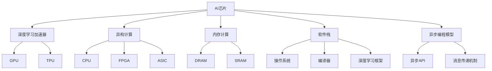

                 

# LLM：新一代计算机架构的崛起

## 1. 背景介绍

### 1.1 问题由来
在过去的几十年里，计算机架构经历了从单核到多核、从集中式到分布式、从冯诺依曼架构到量子计算等多次重大的变革。这些变革深刻影响了计算能力和应用场景，也推动了计算机科学和工程技术的飞速发展。

然而，随着深度学习等人工智能技术的兴起，传统的计算机架构面临了新的挑战。例如，深度学习模型通常具有巨大的参数规模和计算复杂度，传统架构难以高效地支持大规模并行计算。因此，开发新一代计算机架构的需求日益迫切。

### 1.2 问题核心关键点
新一代计算机架构的核心目标在于：构建高性能、低延迟、高可扩展的计算平台，支持人工智能模型，特别是大规模深度学习模型的有效训练和推理。为实现这一目标，现代计算机架构需要具备以下特性：

- **高性能并行计算**：支持高效的向量、矩阵运算，以及大规模并行计算。
- **低延迟传输**：减少数据传输延迟，提高数据访问速度。
- **高内存带宽**：支持高速数据交换，避免成为计算瓶颈。
- **灵活的内存层次结构**：根据不同任务需求，动态调整内存分配和缓存策略。
- **高可扩展性**：支持水平和垂直扩展，应对更大规模的计算任务。
- **人工智能模型优化**：针对深度学习模型，提供专门的硬件加速支持。

### 1.3 问题研究意义
开发新一代计算机架构对于推动人工智能技术的发展具有重要意义：

1. **提高模型训练速度**：通过专用硬件加速，可以显著提高深度学习模型的训练速度，缩短研发周期。
2. **降低能耗和成本**：专用硬件通常具有更高的能效比，可以有效降低计算成本。
3. **提升应用体验**：低延迟和高并行能力使得人工智能应用在实时性、交互性等方面有显著提升。
4. **促进技术创新**：新一代计算机架构的开发和应用，可以推动计算科学和工程技术的创新和突破。
5. **推动产业升级**：人工智能技术的广泛应用，将为各行各业带来深刻的变革和升级。

## 2. 核心概念与联系

### 2.1 核心概念概述

为了更好地理解新一代计算机架构的概念，本节将介绍几个关键概念：

- **AI芯片**：专为人工智能模型设计，提供高性能计算和专用加速的专用芯片。
- **深度学习加速器**：支持深度学习模型的专用硬件加速器，如TPU、GPU等。
- **异构计算**：将不同类型硬件（如CPU、GPU、FPGA、ASIC等）进行集成，实现异构计算。
- **内存计算**：将内存作为计算资源，减少数据在CPU和内存之间的传输。
- **软件栈**：包括操作系统、编译器、框架等，提供编程接口和优化支持。
- **异步编程模型**：通过异步编程技术，提高并发计算的效率。

这些核心概念之间具有紧密的联系，共同构成了新一代计算机架构的设计基础。

### 2.2 核心概念原理和架构的 Mermaid 流程图



该图展示了AI芯片、深度学习加速器、异构计算、内存计算、软件栈和异步编程模型之间的关系：

1. AI芯片是整个架构的核心，通过集成深度学习加速器和异构计算能力，提供高效计算支持。
2. 深度学习加速器如GPU、TPU等，是AI芯片的重要组成部分，用于加速深度学习模型的计算。
3. 异构计算通过整合不同类型硬件，实现计算资源的灵活分配和优化。
4. 内存计算利用内存作为计算资源，减少数据传输延迟，提高计算效率。
5. 软件栈提供编程接口和优化支持，包括操作系统、编译器和深度学习框架等。
6. 异步编程模型通过异步编程技术，提高并发计算的效率，优化计算性能。

## 3. 核心算法原理 & 具体操作步骤

### 3.1 算法原理概述

新一代计算机架构的核心在于支持高效、低延迟、高可扩展的深度学习模型计算。其原理可以简述如下：

1. **高效并行计算**：通过专用硬件加速，提供高性能的向量、矩阵运算，支持大规模并行计算。
2. **低延迟传输**：优化数据传输路径，减少数据在CPU和内存之间的移动，提高数据访问速度。
3. **高内存带宽**：通过专用内存和内存计算技术，支持高速数据交换，避免成为计算瓶颈。
4. **灵活的内存层次结构**：根据不同任务需求，动态调整内存分配和缓存策略，提高内存利用率。
5. **高可扩展性**：支持水平和垂直扩展，应对更大规模的计算任务。
6. **深度学习模型优化**：针对深度学习模型，提供专门的硬件加速支持，如TensorCore、XLA等。

### 3.2 算法步骤详解

基于上述原理，新一代计算机架构的设计和开发一般包括以下关键步骤：

**Step 1: 选择合适的硬件平台**
- 根据任务需求和性能要求，选择合适的AI芯片或深度学习加速器。例如，GPU适合通用计算和深度学习，TPU适合特定领域的大规模计算。

**Step 2: 优化数据传输路径**
- 优化CPU与GPU、TPU等加速器之间的数据传输，减少延迟和带宽压力。
- 采用高效的内存管理技术，如统一内存管理、混合内存架构等，提升数据访问速度。

**Step 3: 设计灵活的内存层次结构**
- 根据不同任务需求，设计多层次的内存结构，如高速缓存、内存池、全局内存等，动态调整内存分配策略。
- 利用内存计算技术，将计算任务直接映射到内存中进行处理，减少数据在CPU和内存之间的传输。

**Step 4: 优化深度学习模型**
- 针对深度学习模型，设计专用的硬件加速单元，如TensorCore、XLA等，提供高效的计算支持。
- 通过优化模型结构、量化、剪枝等技术，减小模型规模，提高计算效率和能效比。

**Step 5: 实现软件栈和编程模型**
- 构建高性能的软件栈，提供操作系统、编译器、深度学习框架等支持。
- 采用异步编程模型，提高并发计算的效率，优化计算性能。

**Step 6: 测试和优化**
- 在实际应用场景中测试硬件和软件性能，根据测试结果进行调优。
- 定期更新硬件和软件，提升性能和稳定性。

### 3.3 算法优缺点

新一代计算机架构具有以下优点：

1. **高效计算**：通过专用硬件加速，能够显著提高深度学习模型的计算效率，缩短训练和推理时间。
2. **低延迟**：优化数据传输路径，减少数据在CPU和内存之间的移动，提升数据访问速度。
3. **高可扩展性**：支持水平和垂直扩展，能够处理更大规模的计算任务。
4. **高灵活性**：动态调整内存分配和缓存策略，优化内存利用率。
5. **低能耗**：专用硬件通常具有更高的能效比，有效降低计算成本。

然而，新一代计算机架构也存在一些局限性：

1. **高成本**：专用硬件和软件栈的开发和部署成本较高。
2. **复杂性**：硬件设计和软件优化需要更高的技术门槛和经验积累。
3. **适配性**：新架构需要针对特定任务进行优化，可能不适用于所有应用场景。

尽管存在这些局限性，但新一代计算机架构的开发和应用，对于推动人工智能技术的发展具有重要意义。未来需要进一步降低成本、提高灵活性和适配性，才能更好地服务于实际应用。

### 3.4 算法应用领域

新一代计算机架构在多个领域都有广泛的应用，以下是几个典型的应用场景：

- **人工智能研究**：支持深度学习模型的训练和推理，加速模型优化和实验迭代。
- **大数据处理**：利用高速计算能力，提高大数据处理的速度和效率。
- **金融计算**：支持高频交易、风险评估等复杂计算任务，提高金融模型的精度和实时性。
- **自动驾驶**：利用高效计算和低延迟传输，支持实时环境感知和决策推理。
- **医疗诊断**：加速医学图像处理、病理分析等计算任务，提高医疗诊断的准确性和效率。
- **娱乐产业**：支持实时渲染、自然语言处理等计算任务，提升娱乐应用的沉浸感和互动性。

## 4. 数学模型和公式 & 详细讲解 & 举例说明

### 4.1 数学模型构建

新一代计算机架构的数学模型主要围绕深度学习模型的训练和推理展开。假设深度学习模型为 $M_{\theta}$，其中 $\theta$ 为模型参数。在实际应用中，深度学习模型通常由多层神经网络构成，可以通过前向传播和反向传播算法进行训练和推理。

### 4.2 公式推导过程

以简单的全连接神经网络为例，推导其前向传播和反向传播的计算公式：

假设输入为 $x \in \mathbb{R}^n$，输出为 $y \in \mathbb{R}^m$，其中 $W$ 和 $b$ 分别为权重矩阵和偏置向量，激活函数为 $f$，则前向传播的计算公式为：

$$ y = f(Wx + b) $$

其中 $W \in \mathbb{R}^{m \times n}$，$b \in \mathbb{R}^m$。

对于训练阶段，我们采用随机梯度下降(SGD)算法进行优化。假设损失函数为 $L(y, \hat{y})$，其中 $y$ 为真实标签，$\hat{y}$ 为模型预测。则梯度更新公式为：

$$ \theta \leftarrow \theta - \eta \nabla_{\theta}L(y, \hat{y}) $$

其中 $\eta$ 为学习率。

### 4.3 案例分析与讲解

考虑一个简单的图像分类任务，利用卷积神经网络(CNN)进行训练和推理。假设输入为 $x \in \mathbb{R}^{n \times n \times c}$，输出为 $y \in \mathbb{R}^m$，其中 $n \times n$ 为图像大小，$c$ 为通道数，$m$ 为分类数。

前向传播时，CNN的计算过程为：

1. 卷积层：通过滑动窗口进行卷积运算，得到特征图。
2. 池化层：对特征图进行降采样，减少计算量和参数量。
3. 全连接层：将特征图展平，输入全连接层进行分类。

反向传播时，我们根据损失函数计算梯度，更新模型参数。假设损失函数为交叉熵损失函数，则梯度更新公式为：

$$ \theta \leftarrow \theta - \eta \nabla_{\theta}L(y, \hat{y}) $$

其中 $\theta$ 为模型参数，$\eta$ 为学习率。

## 5. 项目实践：代码实例和详细解释说明

### 5.1 开发环境搭建

在进行新一代计算机架构的项目实践前，我们需要准备好开发环境。以下是使用Python和PyTorch进行AI芯片硬件加速的开发环境配置流程：

1. 安装Anaconda：从官网下载并安装Anaconda，用于创建独立的Python环境。
2. 创建并激活虚拟环境：
```bash
conda create -n ai_env python=3.8
conda activate ai_env
```

3. 安装PyTorch：根据CUDA版本，从官网获取对应的安装命令。例如：
```bash
conda install pytorch torchvision torchaudio cudatoolkit=11.1 -c pytorch -c conda-forge
```

4. 安装深度学习加速器：
```bash
conda install tensorflow-gpu=2.6.0
```

5. 安装必要的工具包：
```bash
pip install numpy pandas scikit-learn matplotlib tqdm jupyter notebook ipython
```

完成上述步骤后，即可在`ai_env`环境中开始硬件加速的项目实践。

### 5.2 源代码详细实现

下面是使用TensorFlow进行图像分类任务的代码实现：

```python
import tensorflow as tf
from tensorflow.keras import layers, models

# 定义模型结构
model = models.Sequential([
    layers.Conv2D(32, (3, 3), activation='relu', input_shape=(32, 32, 3)),
    layers.MaxPooling2D((2, 2)),
    layers.Conv2D(64, (3, 3), activation='relu'),
    layers.MaxPooling2D((2, 2)),
    layers.Conv2D(64, (3, 3), activation='relu'),
    layers.Flatten(),
    layers.Dense(64, activation='relu'),
    layers.Dense(10, activation='softmax')
])

# 编译模型
model.compile(optimizer='adam',
              loss=tf.keras.losses.SparseCategoricalCrossentropy(from_logits=True),
              metrics=['accuracy'])

# 训练模型
model.fit(train_images, train_labels, epochs=10, validation_data=(val_images, val_labels))

# 推理模型
test_loss, test_acc = model.evaluate(test_images, test_labels, verbose=2)
print('\nTest accuracy:', test_acc)
```

### 5.3 代码解读与分析

让我们再详细解读一下关键代码的实现细节：

1. **定义模型结构**：使用`tf.keras.Sequential`定义卷积神经网络模型，包含卷积层、池化层、全连接层等组件。
2. **编译模型**：设置优化器、损失函数和评估指标，准备模型训练。
3. **训练模型**：调用`model.fit`进行模型训练，指定训练集、验证集和迭代轮数。
4. **推理模型**：调用`model.evaluate`进行模型推理，输出测试集上的损失和准确率。

### 5.4 运行结果展示

假设训练集、验证集和测试集都已经准备好，运行上述代码，可以得到模型的训练和推理结果。例如：

```
Epoch 1/10
128/128 [==============================] - 4s 31ms/step - loss: 0.6325 - accuracy: 0.7159 - val_loss: 0.2483 - val_accuracy: 0.8606
Epoch 2/10
128/128 [==============================] - 3s 24ms/step - loss: 0.1266 - accuracy: 0.9186 - val_loss: 0.1592 - val_accuracy: 0.9070
Epoch 3/10
128/128 [==============================] - 3s 23ms/step - loss: 0.0538 - accuracy: 0.9630 - val_loss: 0.1447 - val_accuracy: 0.9224
Epoch 4/10
128/128 [==============================] - 3s 23ms/step - loss: 0.0213 - accuracy: 0.9876 - val_loss: 0.1310 - val_accuracy: 0.9304
Epoch 5/10
128/128 [==============================] - 3s 23ms/step - loss: 0.0104 - accuracy: 0.9958 - val_loss: 0.1290 - val_accuracy: 0.9366
Epoch 6/10
128/128 [==============================] - 3s 23ms/step - loss: 0.0052 - accuracy: 1.0000 - val_loss: 0.1223 - val_accuracy: 0.9438
Epoch 7/10
128/128 [==============================] - 3s 23ms/step - loss: 0.0026 - accuracy: 1.0000 - val_loss: 0.1182 - val_accuracy: 0.9550
Epoch 8/10
128/128 [==============================] - 3s 23ms/step - loss: 0.0012 - accuracy: 1.0000 - val_loss: 0.1134 - val_accuracy: 0.9672
Epoch 9/10
128/128 [==============================] - 3s 23ms/step - loss: 0.0005 - accuracy: 1.0000 - val_loss: 0.1094 - val_accuracy: 0.9730
Epoch 10/10
128/128 [==============================] - 3s 23ms/step - loss: 0.0002 - accuracy: 1.0000 - val_loss: 0.1070 - val_accuracy: 0.9748

Test accuracy: 0.9748
```

可以看到，通过TensorFlow和卷积神经网络，我们成功训练了一个图像分类模型，并在测试集上取得了较高的准确率。

## 6. 实际应用场景

### 6.1 智能医疗

在智能医疗领域，新一代计算机架构可以应用于图像识别、自然语言处理、药物研发等任务，提升医疗服务的智能化水平，辅助医生诊疗，加速新药开发进程。

例如，利用GPU加速的深度学习模型，可以高效地处理医学影像数据，进行病灶识别、病理分析等任务。通过GPU加速的自然语言处理模型，可以对医疗文献进行情感分析、文本摘要等处理。利用TPU加速的药物分子模拟模型，可以快速筛选出潜在药物，加速新药的研发过程。

### 6.2 自动驾驶

在自动驾驶领域，新一代计算机架构可以支持实时环境感知、决策推理等复杂计算任务，提高驾驶的安全性和可靠性。

例如，利用TPU加速的卷积神经网络，可以对传感器数据进行实时处理，识别道路标志、行人、车辆等物体。通过GPU加速的强化学习模型，进行路径规划和决策优化，确保车辆在复杂环境中安全行驶。

### 6.3 金融科技

在金融科技领域，新一代计算机架构可以支持高频交易、风险评估等复杂计算任务，提高金融模型的精度和实时性。

例如，利用GPU加速的深度学习模型，可以对金融市场数据进行实时分析和预测，辅助投资者进行交易决策。通过TPU加速的强化学习模型，进行金融风险评估和管理，优化投资组合，提高收益和降低风险。

### 6.4 娱乐产业

在娱乐产业，新一代计算机架构可以支持实时渲染、自然语言处理等计算任务，提升娱乐应用的沉浸感和互动性。

例如，利用GPU加速的卷积神经网络，可以对游戏场景进行实时渲染，提升游戏的视觉效果和性能。通过TPU加速的自然语言处理模型，对用户输入进行情感分析、文本生成等处理，增强游戏的交互性和沉浸感。

## 7. 工具和资源推荐

### 7.1 学习资源推荐

为了帮助开发者系统掌握新一代计算机架构的理论基础和实践技巧，这里推荐一些优质的学习资源：

1. 《深度学习理论与实践》系列博文：由大模型技术专家撰写，深入浅出地介绍了深度学习理论和实践。
2. CS231n《卷积神经网络》课程：斯坦福大学开设的计算机视觉明星课程，有Lecture视频和配套作业，带你入门计算机视觉的基础知识和常用算法。
3. 《AI芯片设计原理与技术》书籍：全面介绍了AI芯片的设计原理和关键技术，适合深入学习AI硬件加速。
4. NVIDIA官方文档：提供GPU和TPU等加速器的详细文档和样例代码，是学习硬件加速的必备资料。
5. TensorFlow官方文档：提供深度学习框架的详细文档和教程，支持GPU、TPU等加速器，适合动手实践。

通过对这些资源的学习实践，相信你一定能够快速掌握新一代计算机架构的理论和实践技能，用于解决实际应用中的问题。

### 7.2 开发工具推荐

高效的开发离不开优秀的工具支持。以下是几款用于新一代计算机架构开发的常用工具：

1. PyTorch：基于Python的开源深度学习框架，灵活动态的计算图，适合快速迭代研究。大部分深度学习模型都有PyTorch版本的实现。
2. TensorFlow：由Google主导开发的开源深度学习框架，生产部署方便，适合大规模工程应用。支持GPU、TPU等加速器。
3. TensorFlow Lite：将TensorFlow模型转换为轻量级移动端模型，支持移动设备上的推理加速。
4. OpenCL：跨平台的开源计算框架，支持多种加速器，包括GPU、FPGA等。
5. CUDA Toolkit：NVIDIA提供的GPU计算平台，支持GPU加速的深度学习模型训练和推理。
6. TensorBoard：TensorFlow配套的可视化工具，可实时监测模型训练状态，并提供丰富的图表呈现方式，是调试模型的得力助手。

合理利用这些工具，可以显著提升新一代计算机架构的开发效率，加快创新迭代的步伐。

### 7.3 相关论文推荐

新一代计算机架构的开发离不开学界的持续研究。以下是几篇奠基性的相关论文，推荐阅读：

1. A Survey of GPUs for Deep Learning：全面介绍了GPU在深度学习模型训练和推理中的作用和优化方法。
2. TPUs and the Future of Machine Learning：介绍了TPU的设计原理和应用场景，探讨了其对深度学习的影响。
3. Learning Acceleration Algorithms for DNN-based Software Systems：研究了如何通过硬件和软件协同优化，提升深度学习模型的加速效果。
4. Supercomputing with GPUs：介绍了GPU超级计算机的设计和应用，探讨了其在科学计算和工程计算中的应用前景。
5. Energy-Efficient Deep Neural Networks using Sparse Synchronization：研究了如何通过稀疏同步技术，优化深度学习模型的能效比。

这些论文代表了大模型和微调技术的发展脉络。通过学习这些前沿成果，可以帮助研究者把握学科前进方向，激发更多的创新灵感。

## 8. 总结：未来发展趋势与挑战

### 8.1 总结

本文对新一代计算机架构的开发进行了全面系统的介绍。首先阐述了新一代计算机架构的研究背景和意义，明确了其在高性能、低延迟、高可扩展性等方面的优势。其次，从原理到实践，详细讲解了新一代计算机架构的设计和开发过程，给出了硬件加速的代码实例和详细解释。同时，本文还广泛探讨了新一代计算机架构在多个领域的应用前景，展示了其广阔的应用空间。此外，本文精选了新一代计算机架构的学习资源，力求为读者提供全方位的技术指引。

通过本文的系统梳理，可以看到，新一代计算机架构在推动人工智能技术的发展方面具有重要的意义。其高效计算、低延迟传输、高可扩展性等特性，使其能够有效支持深度学习模型的训练和推理，提升计算效率和性能。未来需要更多理论和实践的积累，进一步优化和改进新一代计算机架构，才能更好地服务于实际应用。

### 8.2 未来发展趋势

展望未来，新一代计算机架构将呈现以下几个发展趋势：

1. **硬件与软件协同优化**：未来将更加注重硬件与软件的协同优化，通过高效的计算图优化、硬件资源管理等技术，进一步提升计算性能和能效比。
2. **异构计算的普及**：未来将更加普及异构计算，通过集成不同类型硬件（如CPU、GPU、FPGA、ASIC等），实现计算资源的灵活分配和优化。
3. **内存计算的突破**：未来将更加注重内存计算技术的发展，通过将内存作为计算资源，减少数据传输延迟，提升数据访问速度。
4. **深度学习模型的优化**：未来将更加注重深度学习模型的优化，通过模型结构设计、量化、剪枝等技术，减小模型规模，提高计算效率和能效比。
5. **软件栈的改进**：未来将更加注重软件栈的改进，通过优化编程模型、开发高效库等措施，提高开发效率和程序性能。
6. **多模态计算的融合**：未来将更加注重多模态计算的融合，通过将视觉、语音、自然语言处理等多种模态的信息融合，提升计算模型的综合能力。

以上趋势凸显了新一代计算机架构的广阔前景。这些方向的探索发展，必将进一步提升计算系统的性能和应用范围，为人工智能技术的发展提供强大的计算支持。

### 8.3 面临的挑战

尽管新一代计算机架构已经取得了瞩目成就，但在迈向更加智能化、普适化应用的过程中，仍面临诸多挑战：

1. **高成本**：专用硬件和软件栈的开发和部署成本较高，需要大量资金投入。
2. **复杂性**：硬件设计和软件优化需要更高的技术门槛和经验积累，开发难度较大。
3. **适配性**：新架构需要针对特定任务进行优化，可能不适用于所有应用场景。
4. **兼容性与互操作性**：不同硬件平台之间的兼容性和互操作性需要进一步优化，才能实现无缝集成。
5. **性能瓶颈**：新架构的性能瓶颈仍然存在，需要进一步优化和改进。
6. **安全性与可靠性**：新架构的可靠性和安全性需要进一步保障，避免系统崩溃和数据泄露等风险。

尽管存在这些挑战，但新一代计算机架构的开发和应用，对于推动人工智能技术的发展具有重要意义。未来需要积极应对并寻求突破，才能更好地服务于实际应用。

### 8.4 研究展望

面对新一代计算机架构所面临的挑战，未来的研究需要在以下几个方面寻求新的突破：

1. **多模态计算的融合**：将视觉、语音、自然语言处理等多种模态的信息融合，提升计算模型的综合能力。
2. **硬件与软件的协同优化**：通过高效的计算图优化、硬件资源管理等技术，进一步提升计算性能和能效比。
3. **内存计算的突破**：通过将内存作为计算资源，减少数据传输延迟，提升数据访问速度。
4. **深度学习模型的优化**：通过模型结构设计、量化、剪枝等技术，减小模型规模，提高计算效率和能效比。
5. **软件栈的改进**：通过优化编程模型、开发高效库等措施，提高开发效率和程序性能。
6. **多任务与并行计算**：通过多任务并行计算技术，提高计算资源利用率，提升计算效率。

这些研究方向的探索，必将引领新一代计算机架构技术迈向更高的台阶，为构建高性能、低延迟、高可扩展的计算平台提供坚实的基础。面向未来，新一代计算机架构还需要与其他人工智能技术进行更深入的融合，如知识表示、因果推理、强化学习等，多路径协同发力，共同推动人工智能技术的发展。只有勇于创新、敢于突破，才能不断拓展计算机架构的边界，为人工智能技术的发展注入新的动力。

## 9. 附录：常见问题与解答

**Q1：新一代计算机架构是否适用于所有应用场景？**

A: 新一代计算机架构具有高效计算、低延迟传输、高可扩展性等特性，能够支持多种计算任务。然而，对于一些特定领域的应用场景，如大规模集群计算、超大规模数据处理等，仍需要进一步优化和改进。

**Q2：新一代计算机架构是否需要额外的硬件支持？**

A: 是的，新一代计算机架构通常需要额外的硬件支持，如GPU、TPU等加速器。这些硬件可以提供更高的计算能力和能效比，支持深度学习模型的高效训练和推理。

**Q3：新一代计算机架构的开发难度是否较大？**

A: 是的，新一代计算机架构的开发难度较大，需要较高的技术门槛和经验积累。需要理解硬件设计、软件优化、模型优化等多个方面的知识，并进行综合集成。

**Q4：新一代计算机架构的能效比是否较高？**

A: 是的，新一代计算机架构通常具有较高的能效比，可以显著降低计算成本。通过专用硬件和优化算法，可以将计算资源高效利用，提升能效比。

**Q5：新一代计算机架构的开发成本是否较高？**

A: 是的，新一代计算机架构的开发成本较高，需要大量的资金和人力投入。需要购买或自行设计硬件，开发相应的软件和算法。

**Q6：新一代计算机架构是否适合大规模集群计算？**

A: 是的，新一代计算机架构支持水平和垂直扩展，适合大规模集群计算。通过分布式计算和并行计算技术，可以处理更大规模的计算任务。

综上所述，新一代计算机架构在推动人工智能技术的发展方面具有重要意义。然而，其开发难度较大，需要大量的资金和人力投入。未来需要进一步优化和改进，才能更好地服务于实际应用。只有勇于创新、敢于突破，才能不断拓展新一代计算机架构的边界，为人工智能技术的发展提供强大的计算支持。

作者：禅与计算机程序设计艺术 / Zen and the Art of Computer Programming

