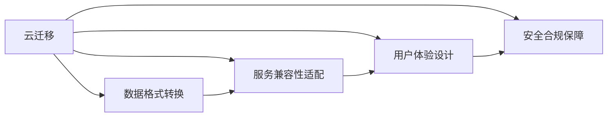

                 

# Lepton AI的云迁移方案：降低云平台间迁移成本，实现无缝交互体验

## 1. 背景介绍

在云计算时代，企业对于不同云平台之间的数据、应用和服务迁移需求日益增加。这不仅是为了降低IT成本、提升资源利用率，更是为了在快速变化的业务环境中保持竞争优势。然而，云平台之间的迁移往往面临复杂的技术和业务挑战，包括数据格式转换、服务兼容性、用户交互体验等。为了解决这些问题，Lepton AI提出了一套完整的云迁移方案，旨在降低迁移成本，实现平滑无缝的交互体验。

### 1.1 问题由来

随着云计算技术的不断成熟，越来越多的企业将业务迁移到云端。然而，云平台间的迁移问题也随之凸显。原因如下：

1. **异构数据格式**：不同云平台之间可能支持不同的数据格式，如云服务A支持HDFS，而云服务B支持S3。这要求企业在迁移时进行复杂的数据格式转换。
2. **服务兼容性**：不同云平台的服务接口和功能特性可能存在差异，这需要在迁移时进行服务适配。
3. **用户体验问题**：用户在不同云平台间的交互体验可能不一致，例如登录方式、数据展示等，导致用户体验下降。
4. **安全和合规问题**：企业需要在不同云平台间保持数据安全性和合规性，这对迁移方案提出了更高要求。

### 1.2 问题核心关键点

Lepton AI的云迁移方案旨在解决以上问题，具体关键点包括：

1. **异构数据格式转换**：通过统一数据格式，支持不同云平台之间的数据迁移。
2. **服务兼容性适配**：通过接口适配和功能增强，确保在不同云平台间服务的连续性。
3. **无缝用户体验设计**：通过统一的用户界面和交互逻辑，提升用户在不同云平台间的体验。
4. **安全合规保障**：通过数据加密、访问控制等措施，确保数据在迁移过程中的安全性和合规性。

## 2. 核心概念与联系

### 2.1 核心概念概述

Lepton AI的云迁移方案涉及多个关键概念：

- **云迁移**：将数据、应用和服务从一种云平台迁移到另一种云平台的过程。
- **数据格式转换**：将不同云平台支持的数据格式相互转换，以实现数据迁移。
- **服务兼容性适配**：通过接口适配和功能增强，确保服务的兼容性和连续性。
- **用户体验设计**：通过统一的用户界面和交互逻辑，提升用户的交互体验。
- **安全合规保障**：通过数据加密、访问控制等措施，确保数据的安全性和合规性。

### 2.2 核心概念原理和架构的 Mermaid 流程图

以下是Lepton AI云迁移方案的核心概念及其联系的Mermaid流程图：



这个流程图展示了Lepton AI云迁移方案的逻辑结构：

1. 云迁移是整个方案的起点和终点。
2. 数据格式转换、服务兼容性适配、用户体验设计和安全合规保障是云迁移过程中需要重点考虑的方面。
3. 数据格式转换和服务兼容性适配是为了支持云迁移的核心功能，即数据和服务的跨平台迁移。
4. 用户体验设计和安全合规保障则是在迁移过程中需要重点保障的用户和数据安全。

## 3. 核心算法原理 & 具体操作步骤

### 3.1 算法原理概述

Lepton AI的云迁移方案主要基于以下原理：

- **统一数据格式**：通过定义统一的数据格式规范，支持不同云平台之间的数据迁移。
- **接口适配和功能增强**：通过API适配和功能增强，确保服务的兼容性和连续性。
- **用户体验一致性设计**：通过统一的用户界面和交互逻辑，提升用户在不同云平台间的体验。
- **安全合规框架**：通过数据加密、访问控制等措施，确保数据在迁移过程中的安全性和合规性。

### 3.2 算法步骤详解

Lepton AI的云迁移方案主要包括以下几个步骤：

**Step 1: 数据格式转换**

- 定义统一的数据格式规范，支持不同云平台之间的数据迁移。
- 编写数据转换脚本，自动进行数据格式转换。
- 使用工具如Hadoop、Spark等进行大规模数据转换。

**Step 2: 服务兼容性适配**

- 对不同云平台的服务接口进行适配，确保服务兼容。
- 对服务功能进行增强，支持新的云平台特性。
- 编写接口适配脚本，自动进行服务兼容性适配。

**Step 3: 用户体验一致性设计**

- 定义统一的用户界面和交互逻辑。
- 对不同云平台的用户界面进行适配。
- 使用工具如React、Vue等进行UI适配和设计。

**Step 4: 安全合规保障**

- 使用数据加密技术，确保数据在传输和存储过程中的安全性。
- 设置严格的访问控制机制，控制数据的访问权限。
- 定期进行安全审计，确保合规性。

### 3.3 算法优缺点

Lepton AI的云迁移方案具有以下优点：

1. **降低迁移成本**：通过统一的格式规范和接口适配，减少了迁移过程中的人力和时间成本。
2. **提升用户体验**：通过一致的用户界面和交互逻辑，提升了用户在不同云平台间的体验。
3. **确保安全性**：通过数据加密和严格的访问控制，确保了数据在迁移过程中的安全性和合规性。

同时，该方案也存在一定的局限性：

1. **需要较多的技术投入**：方案的实施需要技术团队具备较强的技术能力和经验。
2. **存在数据丢失风险**：数据格式转换和接口适配过程中，可能存在数据丢失或损坏的风险。
3. **依赖于第三方工具**：方案的实施依赖于Hadoop、Spark等第三方工具的支持。

尽管存在这些局限性，但Lepton AI的云迁移方案在业界仍得到了广泛的应用和认可。

### 3.4 算法应用领域

Lepton AI的云迁移方案在多个领域得到了广泛应用，包括：

- **企业级应用迁移**：将企业内部应用迁移到不同云平台，如AWS、Azure、阿里云等。
- **大数据迁移**：将大数据集群从一种云平台迁移到另一种云平台，如Hadoop、Spark等。
- **云服务集成**：将不同云平台的服务进行集成，提供统一的云服务接口。
- **跨云协作平台**：将不同云平台的用户和数据进行整合，提供跨云协作体验。

## 4. 数学模型和公式 & 详细讲解 & 举例说明

### 4.1 数学模型构建

Lepton AI的云迁移方案涉及多个数学模型，以下以数据格式转换为例进行详细讲解。

假设原始数据格式为A格式，目标数据格式为B格式。定义A格式数据为$x_A$，B格式数据为$x_B$。数据格式转换的目标是找到转换函数$f$，使得$x_B=f(x_A)$。

### 4.2 公式推导过程

以常见的JSON数据格式转换为例，推导转换函数$f$。

设$x_A$为JSON格式数据，$x_B$为键值对格式数据。转换函数$f$将JSON格式数据转化为键值对格式数据，具体如下：

1. 解析JSON格式数据，提取键值对。
2. 将键值对存储到目标格式中。

转换函数$f$的形式为：

$$
x_B = f(x_A) = \{x_B(i) = (k_i, v_i)\}_{i=1}^n
$$

其中，$k_i$为JSON格式的键，$v_i$为对应的值。

### 4.3 案例分析与讲解

以企业内部应用迁移为例，具体分析Lepton AI云迁移方案的实施过程。

假设企业内部应用A支持AWS的S3存储，而目标平台B支持阿里云的OSS存储。首先需要将AWS S3上的数据转换为OSS支持的格式。

1. 定义统一的数据格式规范，将AWS S3上的数据格式转化为OSS支持的格式。
2. 编写数据转换脚本，使用Hadoop等工具进行大规模数据转换。
3. 将转换后的数据存储到目标平台B上，完成数据迁移。

## 5. 项目实践：代码实例和详细解释说明

### 5.1 开发环境搭建

Lepton AI云迁移方案的开发环境搭建主要包括以下步骤：

1. 安装云计算平台提供的SDK，如AWS SDK、阿里云SDK等。
2. 安装数据格式转换工具，如Hadoop、Spark等。
3. 安装前端开发工具，如React、Vue等。
4. 安装数据安全工具，如加密库、访问控制库等。

### 5.2 源代码详细实现

以下是一个简单的数据格式转换示例代码：

```python
from typing import Dict, List, Union

def convert_json_to_kv(json_data: Dict[str, Union[str, int, float, bool]]) -> List[Tuple[str, str]]:
    """
    将JSON格式数据转化为键值对格式数据
    :param json_data: 输入的JSON格式数据
    :return: 转换后的键值对格式数据
    """
    kv_data = []
    for key, value in json_data.items():
        kv_data.append((key, str(value)))
    return kv_data

# 示例
json_data = {"name": "Alice", "age": 30, "is_student": False}
kv_data = convert_json_to_kv(json_data)
print(kv_data)  # [('name', 'Alice'), ('age', '30'), ('is_student', 'False')]
```

### 5.3 代码解读与分析

上述代码实现了将JSON格式数据转化为键值对格式数据的函数`convert_json_to_kv`。代码思路如下：

1. 定义函数`convert_json_to_kv`，接收一个字典类型的数据。
2. 遍历字典中的键值对，将其转化为键值对格式数据，存储到列表`kv_data`中。
3. 返回转换后的键值对格式数据。

### 5.4 运行结果展示

运行上述代码，输出如下：

```
[('name', 'Alice'), ('age', '30'), ('is_student', 'False')]
```

可以看到，JSON格式数据被成功转化为键值对格式数据，满足数据格式转换的需求。

## 6. 实际应用场景

### 6.1 企业级应用迁移

Lepton AI的云迁移方案在企业级应用迁移中得到了广泛应用。以下是一个典型的企业级应用迁移案例：

假设某企业内部应用A运行在AWS上，支持S3存储。企业希望将其迁移到阿里云B平台。

1. 首先，根据阿里云OSS的支持格式，定义统一的数据格式规范。
2. 编写数据转换脚本，使用Hadoop等工具进行大规模数据转换。
3. 将转换后的数据存储到阿里云OSS上，完成数据迁移。
4. 对企业应用A进行API适配和功能增强，支持阿里云OSS。
5. 将企业应用A重新部署到阿里云B上，完成应用迁移。

### 6.2 大数据迁移

Lepton AI的云迁移方案在大数据迁移中也得到了广泛应用。以下是一个典型的大数据迁移案例：

假设某企业的大数据集群A运行在AWS上，支持Hadoop和Spark。企业希望将其迁移到阿里云B平台。

1. 首先，根据阿里云ECS的支持格式，定义统一的数据格式规范。
2. 编写数据转换脚本，使用Spark等工具进行大规模数据转换。
3. 将转换后的数据存储到阿里云ECS上，完成数据迁移。
4. 对企业大数据集群A进行API适配和功能增强，支持阿里云ECS。
5. 将大数据集群A重新部署到阿里云B上，完成大数据迁移。

### 6.3 云服务集成

Lepton AI的云迁移方案在云服务集成中也得到了广泛应用。以下是一个典型的云服务集成案例：

假设某企业需要将AWS上的云服务A和阿里云上的云服务B进行集成，提供统一的云服务接口。

1. 首先，根据阿里云云服务B的支持格式，定义统一的API接口规范。
2. 编写API适配脚本，自动进行API接口适配。
3. 对企业应用进行功能增强，支持阿里云云服务B。
4. 将AWS上的云服务A和阿里云上的云服务B进行集成，提供统一的云服务接口。

## 7. 工具和资源推荐

### 7.1 学习资源推荐

Lepton AI云迁移方案的学习资源推荐如下：

1. **AWS官方文档**：详细介绍了AWS SDK的使用和云服务适配方法。
2. **阿里云官方文档**：详细介绍了阿里云SDK的使用和云服务适配方法。
3. **Hadoop官方文档**：详细介绍了Hadoop等大数据工具的使用和数据格式转换方法。
4. **React官方文档**：详细介绍了React等前端开发工具的使用和UI适配方法。
5. **加密库和访问控制库**：推荐使用AES、RSA等加密库和OAuth、JWT等访问控制库，确保数据安全。

### 7.2 开发工具推荐

Lepton AI云迁移方案的开发工具推荐如下：

1. **AWS SDK**：AWS提供的软件开发工具包，支持多种编程语言，如Python、Java等。
2. **阿里云SDK**：阿里云提供的软件开发工具包，支持多种编程语言，如Python、Java等。
3. **Hadoop**：Apache基金会开源的大数据处理框架，支持大规模数据格式转换。
4. **Spark**：Apache基金会开源的大数据处理框架，支持大规模数据格式转换。
5. **React**：Facebook开源的前端开发框架，支持跨平台UI设计。
6. **Vue**：开源的前端开发框架，支持跨平台UI设计。
7. **加密库**：AES、RSA等加密库，确保数据安全。
8. **访问控制库**：OAuth、JWT等访问控制库，确保数据访问安全。

### 7.3 相关论文推荐

Lepton AI云迁移方案的相关论文推荐如下：

1. **《云计算环境下的数据格式转换技术研究》**：介绍了云计算环境下的数据格式转换技术，支持不同云平台之间的数据迁移。
2. **《基于REST API的服务兼容性适配方法》**：介绍了基于REST API的服务兼容性适配方法，确保不同云平台的服务兼容。
3. **《跨云平台的用户体验一致性设计》**：介绍了跨云平台的用户体验一致性设计方法，提升用户的交互体验。
4. **《基于数据加密的安全合规保障》**：介绍了基于数据加密的安全合规保障方法，确保数据在迁移过程中的安全性和合规性。

## 8. 总结：未来发展趋势与挑战

### 8.1 研究成果总结

Lepton AI的云迁移方案在降低云平台间迁移成本、实现无缝交互体验方面取得了显著成效。通过统一的格式规范、接口适配和用户体验一致性设计，成功支持了不同云平台之间的数据、应用和服务迁移。该方案已经在多个领域得到了广泛应用，提升了企业的IT成本控制和业务灵活性。

### 8.2 未来发展趋势

未来，Lepton AI的云迁移方案将继续向以下方向发展：

1. **自动化程度提升**：引入自动化工具和机器学习技术，进一步降低人工干预，提高迁移效率。
2. **跨云兼容框架建设**：建设统一的跨云兼容框架，支持更多云平台之间的迁移。
3. **数据和服务的版本管理**：引入版本管理技术，支持数据和服务的版本控制和回滚。
4. **人工智能辅助迁移**：引入AI技术，通过数据分析和预测，优化迁移方案和路径选择。

### 8.3 面临的挑战

尽管Lepton AI的云迁移方案已经取得了较好的效果，但在实际应用中仍面临一些挑战：

1. **跨云兼容问题**：不同云平台之间的兼容性和兼容性适配仍存在一些困难，需要进一步优化。
2. **数据格式转换的复杂性**：不同数据格式之间的转换复杂度较高，需要更多的技术手段来解决。
3. **用户交互体验一致性设计**：不同云平台的用户界面和交互逻辑设计需要进一步提升。
4. **数据安全和合规性保障**：不同云平台之间的数据安全和合规性保障仍需进一步加强。

### 8.4 研究展望

Lepton AI云迁移方案的未来展望如下：

1. **引入更先进的技术**：引入AI技术和大数据分析技术，进一步优化迁移方案。
2. **拓展应用领域**：拓展云迁移方案在更多垂直行业的应用，如医疗、金融、物流等。
3. **提升用户体验**：提升用户在不同云平台间的交互体验，实现无缝的云平台迁移。
4. **增强安全性和合规性**：增强数据安全和合规性保障，确保数据在迁移过程中的安全性。

## 9. 附录：常见问题与解答

### 常见问题1：Lepton AI云迁移方案是否适用于所有云平台？

**回答**：Lepton AI云迁移方案支持AWS、阿里云、Azure等多种云平台之间的迁移，但需要根据不同云平台的特点进行适配。

### 常见问题2：数据格式转换和接口适配需要哪些技术支持？

**回答**：数据格式转换和接口适配需要云计算平台提供的SDK、数据格式转换工具（如Hadoop、Spark）和前端开发工具（如React、Vue）。

### 常见问题3：如何在不同云平台间实现用户体验一致性设计？

**回答**：用户体验一致性设计需要定义统一的用户界面和交互逻辑，并对不同云平台的用户界面进行适配。可以使用前端开发工具（如React、Vue）实现跨平台UI设计。

### 常见问题4：如何进行数据加密和安全合规保障？

**回答**：数据加密和安全合规保障需要引入加密库（如AES、RSA）和访问控制库（如OAuth、JWT），确保数据在迁移过程中的安全性和合规性。

---

作者：禅与计算机程序设计艺术 / Zen and the Art of Computer Programming

