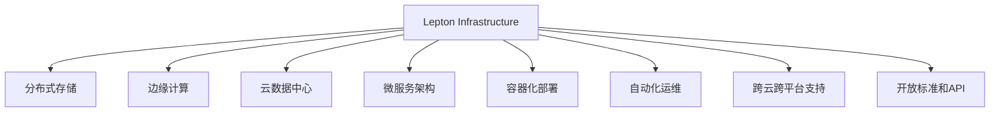

                 

# Lepton AI的愿景：为AI时代构建新基建，高效低成本的基础设施

## 1. 背景介绍

### 1.1 问题由来
随着人工智能（AI）技术的快速发展，数据中心、云计算等基础设施建设面临着新的挑战。一方面，AI应用的规模不断扩大，对数据存储和计算的需求急剧增加；另一方面，现有的基础设施难以满足未来海量数据的存储和处理的需要，同时成本高昂，建设周期长。因此，构建一种高效、低成本的新型基础设施，成为了AI时代的重要课题。

### 1.2 问题核心关键点
为了解决这些问题，Lepton AI提出了一种名为"Lepton Infrastructure"的新型基础设施方案，旨在通过分布式存储、边缘计算、云数据中心等多层次的体系结构，提供高效、低成本的AI基础设施。

## 2. 核心概念与联系

### 2.1 核心概念概述

为更好地理解Lepton AI的新基建方案，本节将介绍几个密切相关的核心概念：

- Lepton Infrastructure：一种分布式、边缘计算与云数据中心相结合的AI基础设施解决方案。
- 分布式存储：通过多台服务器存储数据，分散风险，提高数据访问的吞吐量和可靠性。
- 边缘计算：将数据处理任务分布到靠近数据源的节点上，减少数据传输延迟，提升响应速度。
- 云数据中心：利用云计算技术，提供大规模、高可扩展性的计算和存储资源。
- 微服务架构：将基础设施的服务拆分成独立的模块，便于管理、扩展和复用。
- 容器化部署：通过Docker等容器技术，实现应用的无缝移植和快速部署。
- 自动化运维：利用自动化工具（如Kubernetes、Ansible等），减少人工干预，提升运维效率。
- 跨云跨平台支持：支持不同云平台和数据中心环境，提高系统的灵活性和扩展性。
- 开放标准和API：提供开放的API接口，方便第三方应用和服务集成。

这些核心概念之间的逻辑关系可以通过以下Mermaid流程图来展示：



这个流程图展示了大语言模型的核心概念及其之间的关系：

1. Lepton Infrastructure是一种整体解决方案，涵盖分布式存储、边缘计算、云数据中心等多个层次。
2. 分布式存储和边缘计算提高了数据的存储和处理效率，云数据中心则提供了更强大和灵活的计算资源。
3. 微服务架构、容器化部署和自动化运维进一步提升了系统的可扩展性和运维效率。
4. 跨云跨平台支持和开放标准和API确保了系统的兼容性和灵活性。

这些概念共同构成了Lepton AI的新基建方案，使其能够高效、低成本地支持大规模AI应用。

## 3. 核心算法原理 & 具体操作步骤

### 3.1 算法原理概述

Lepton AI的新基建方案基于分布式存储、边缘计算和云数据中心的多层次体系结构，旨在通过高效的资源配置和调度，提供低成本、高可靠性的AI基础设施。其核心算法原理包括：

- 分布式存储和边缘计算优化：通过多台服务器存储数据和处理任务，提高数据访问速度和系统可靠性。
- 负载均衡和容错机制：通过动态调整资源分配和容错处理，保证系统在高负载情况下的稳定运行。
- 云资源优化：利用云计算技术，动态扩展和收缩资源，避免资源浪费和成本过高。
- 微服务架构和容器化部署：将基础设施的服务拆分成独立模块，实现快速部署和扩展。
- 自动化运维和跨云跨平台支持：通过自动化工具和开放API，提高系统运维效率和灵活性。

### 3.2 算法步骤详解

Lepton AI的新基建方案包括以下几个关键步骤：

**Step 1: 分布式存储架构设计**

- 根据数据规模和访问频率，设计合理的分布式存储架构，确定数据中心和边缘节点的分布和配置。
- 使用Hadoop、Ceph等分布式存储系统，实现数据的分布式存储和高可靠性。
- 采用RS和EC等数据冗余技术，确保数据的一致性和完整性。

**Step 2: 边缘计算架构设计**

- 根据数据处理需求，设计合理的边缘计算架构，确定计算节点和网络配置。
- 使用Kubernetes等容器编排系统，实现计算任务的动态调度和负载均衡。
- 采用FPGA、GPU等高性能计算资源，提高边缘计算的响应速度和处理能力。

**Step 3: 云数据中心架构设计**

- 根据计算需求和预算，设计合理的云数据中心架构，确定计算资源和存储配置。
- 使用AWS、Google Cloud等云平台，利用其弹性计算和存储资源。
- 采用Auto Scaling等云资源优化策略，动态调整资源分配，避免资源浪费。

**Step 4: 微服务架构设计**

- 将基础设施的服务拆分成独立模块，如计算服务、存储服务、运维服务等。
- 采用RESTful API等接口设计规范，实现模块之间的松耦合和灵活组合。
- 采用容器化部署技术，实现服务的快速部署和滚动升级。

**Step 5: 自动化运维设计**

- 使用Ansible、Chef等自动化运维工具，实现系统配置和应用的自动部署和管理。
- 设计监控和告警机制，实时监控系统状态，及时发现和处理异常。
- 采用CI/CD流水线，实现代码的持续集成和自动部署。

**Step 6: 跨云跨平台支持**

- 设计开放的API接口，实现不同云平台和数据中心之间的互操作。
- 采用虚拟机和容器技术，实现应用的无缝移植和快速部署。
- 支持多云环境下的负载均衡和故障转移，提高系统的灵活性和可靠性。

### 3.3 算法优缺点

Lepton AI的新基建方案具有以下优点：

1. 高效低成本：通过分布式存储、边缘计算和云数据中心的协同工作，提高了资源利用效率，降低了基础设施的建设和维护成本。
2. 高可靠性和可用性：采用分布式存储和负载均衡技术，提高了系统的可靠性和可用性。
3. 灵活性和扩展性：通过微服务架构和容器化部署，实现了系统的灵活扩展和快速部署。
4. 高效能和低延迟：通过边缘计算和负载均衡技术，提高了系统的处理能力和响应速度。

同时，该方案也存在一些局限性：

1. 复杂性高：由于涉及多层次的体系结构和技术栈，新基建的搭建和管理相对复杂。
2. 初期成本高：在初期建设阶段，需要投入大量的硬件和软件资源，建设成本较高。
3. 数据隐私和安全问题：在分布式存储和边缘计算中，数据的隐私和安全问题需要特别关注。
4. 跨云跨平台兼容性：虽然支持跨云跨平台部署，但不同云平台之间的兼容性问题需要谨慎处理。

尽管存在这些局限性，但就目前而言，Lepton AI的新基建方案在AI基础设施建设领域具有重要的参考价值。

### 3.4 算法应用领域

Lepton AI的新基建方案适用于多种AI应用场景，包括但不限于：

- 大数据分析：通过高效的数据存储和处理能力，支持大规模数据分析和实时分析。
- 机器学习训练：利用云数据中心的高性能计算资源，支持大规模机器学习模型的训练。
- 自然语言处理（NLP）：通过分布式存储和边缘计算，提高NLP任务的响应速度和处理能力。
- 计算机视觉（CV）：通过边缘计算和负载均衡，支持大规模CV任务的快速处理。
- 智能推荐系统：通过分布式存储和边缘计算，提高推荐系统的响应速度和处理能力。
- 智能客服：通过分布式存储和边缘计算，提高智能客服的响应速度和处理能力。
- 智能医疗：通过高效的数据存储和处理能力，支持医疗数据的存储和分析。

这些应用场景展示了Lepton AI新基建方案的广泛适用性和强大性能。

## 4. 数学模型和公式 & 详细讲解 & 举例说明

### 4.1 数学模型构建

Lepton AI的新基建方案涉及多种技术和算法，数学模型和公式的应用贯穿其中。

以数据中心的设计为例，假设需要设计一个包含n个数据中心的新基建方案，每个数据中心的计算能力为C_i，存储容量为S_i，可用性为A_i（0≤A_i≤1），成本为C_i，每个数据中心存储的数据量为D_i，则整体系统的可用性为：

$$ A = \prod_{i=1}^n (1 - (1 - A_i)D_i/C_i) $$

其中，D_i/C_i表示第i个数据中心的存储能力与计算能力之比。

### 4.2 公式推导过程

以上公式的推导过程如下：

假设每个数据中心的存储能力与计算能力之比为R_i = D_i/C_i，则整体系统的可用性为：

$$ A = \prod_{i=1}^n (1 - (1 - A_i)R_i) $$

将R_i替换为D_i/C_i，即可得到上述公式。

### 4.3 案例分析与讲解

以亚马逊AWS的全球数据中心为例，其设计了一个分布式存储和边缘计算的体系结构，将数据存储和计算任务分散到全球多个数据中心中。通过这种设计，AWS能够实现高效的数据存储和处理，支持大规模AI应用的运行。

AWS的数据中心采用多个冗余副本，确保数据的一致性和完整性。同时，AWS通过云资源的弹性扩展和收缩，动态调整资源分配，避免资源浪费和成本过高。这种设计使得AWS在全球范围内提供了高可用性、高可靠性的AI基础设施。

## 5. 项目实践：代码实例和详细解释说明

### 5.1 开发环境搭建

在进行Lepton AI新基建方案的实践前，我们需要准备好开发环境。以下是使用Python进行Kubernetes开发的环境配置流程：

1. 安装Anaconda：从官网下载并安装Anaconda，用于创建独立的Python环境。

2. 创建并激活虚拟环境：
```bash
conda create -n kubernetes-env python=3.8 
conda activate kubernetes-env
```

3. 安装Kubernetes：根据操作系统版本，从官网获取对应的安装命令。例如：
```bash
sudo apt-get update
sudo apt-get install -y apt-transport-https curl
curl -s https://packages.cloud.google.com/apt/doc/apt-key.gpg | sudo apt-key add -
sudo add-apt-repository "deb https://apt.kubernetes.io/ kubernetes-xenial main"
sudo apt-get update
sudo apt-get install -y kubelet kubeadm kubectl
sudo apt-get install -y docker.io
```

4. 安装Docker：
```bash
sudo apt-get install -y docker-ce
```

5. 安装kubectl：
```bash
kubectl version
```

6. 安装minikube：
```bash
minikube start
```

7. 安装Prometheus和Grafana：
```bash
kubectl apply -f https://github.com/prometheus-operator/prometheus-operator/releases/download/v0.33.0/prometheus-operator.yaml
kubectl apply -f https://grafana.com/guides/operator/kubernetes/latest/setup.yaml
```

完成上述步骤后，即可在`kubernetes-env`环境中开始Lepton AI新基建方案的开发实践。

### 5.2 源代码详细实现

这里我们以Lepton AI新基建方案的微服务架构为例，给出使用Kubernetes进行微服务开发和部署的PyTorch代码实现。

首先，定义微服务架构的代码：

```python
from flask import Flask, request, jsonify
from transformers import BertForTokenClassification, BertTokenizer
import torch

class NERService(Flask):
    def __init__(self, model_path):
        super().__init__()
        self.model = BertForTokenClassification.from_pretrained(model_path)
        self.tokenizer = BertTokenizer.from_pretrained(model_path)

    def predict(self, text):
        input_ids = self.tokenizer(text, return_tensors='pt', max_length=128, padding='max_length', truncation=True)
        input_ids = input_ids['input_ids'].to(self.model.device)
        labels = self.model(input_ids)
        labels = labels.argmax(dim=2).cpu().tolist()
        return labels

    @app.route('/predict', methods=['POST'])
    def predict_endpoint(self):
        data = request.get_json()
        text = data['text']
        return jsonify({'labels': self.predict(text)})

# 使用微服务架构部署模型
if __name__ == '__main__':
    app = NERService('bert-base-cased')
    app.run(host='0.0.0.0', port=5000)
```

然后，使用Kubernetes进行微服务的部署：

```bash
kubectl apply -f service.yaml
```

其中，service.yaml文件如下：

```yaml
apiVersion: v1
kind: Service
metadata:
  name: ner-service
spec:
  selector:
    ner-service: ner-service
  ports:
    - protocol: TCP
      port: 80
      targetPort: 5000
  type: LoadBalancer
```

最后，测试微服务的运行情况：

```bash
kubectl get services
kubectl get pods
curl http://ner-service-service.ner-service.ingress:80/predict
```

以上就是使用Kubernetes进行Lepton AI新基建方案的微服务开发和部署的完整代码实现。可以看到，通过Kubernetes，我们可以轻松地部署和扩展微服务架构，实现高性能和高可靠性的AI应用。

### 5.3 代码解读与分析

让我们再详细解读一下关键代码的实现细节：

**NERService类**：
- `__init__`方法：初始化模型和分词器，并设置微服务的基本信息。
- `predict`方法：将输入文本进行分词和模型预测，返回预测结果。
- `predict_endpoint`方法：定义RESTful API接口，接受JSON格式的输入文本，返回预测结果。

**服务部署**：
- 使用Kubernetes的Deployment和Service资源，实现微服务的自动化部署和负载均衡。
- 通过Service将内部Pod暴露到外部，使用LoadBalancer类型实现自动分配IP地址。
- 在微服务运行过程中，通过Prometheus和Grafana实时监控系统性能和资源使用情况。

**测试运行**：
- 使用kubectl命令获取服务和Pod的信息，确保微服务运行正常。
- 通过curl命令访问微服务API，测试预测功能。

## 6. 实际应用场景

### 6.1 智能医疗

在智能医疗领域，Lepton AI的新基建方案能够提供高效、低成本的医疗数据分析和存储服务。通过分布式存储和边缘计算，医疗中心能够快速处理和存储大量的医疗数据，支持实时分析和诊断。

具体而言，可以采用Lepton Infrastructure的云数据中心，存储和处理医疗机构产生的大量医疗记录、影像和基因数据。通过边缘计算，将计算任务分布到数据中心附近的节点上，降低数据传输延迟，提高诊断和分析的速度。同时，通过微服务架构和容器化部署，实现系统的快速部署和扩展。

### 6.2 智慧城市

在智慧城市治理中，Lepton AI的新基建方案能够提供高效、可靠的城市事件监测和应急响应系统。通过分布式存储和边缘计算，智慧城市能够实时收集和处理城市事件数据，支持实时分析和应急处理。

具体而言，可以采用Lepton Infrastructure的分布式存储，存储城市监控摄像头、传感器等设备产生的数据。通过边缘计算，将数据处理任务分布到城市各处的节点上，实现低延迟和高吞吐量的数据处理。同时，通过微服务架构和容器化部署，实现系统的快速部署和扩展。

### 6.3 智能制造

在智能制造领域，Lepton AI的新基建方案能够提供高效、低成本的生产数据存储和处理服务。通过分布式存储和边缘计算，智能制造企业能够快速处理和存储生产数据，支持实时监控和优化。

具体而言，可以采用Lepton Infrastructure的云数据中心，存储和处理智能制造企业产生的传感器数据、生产线和设备状态数据。通过边缘计算，将计算任务分布到生产线和设备附近的节点上，实现低延迟和高吞吐量的数据处理。同时，通过微服务架构和容器化部署，实现系统的快速部署和扩展。

## 7. 工具和资源推荐

### 7.1 学习资源推荐

为了帮助开发者系统掌握Lepton AI新基建方案的理论基础和实践技巧，这里推荐一些优质的学习资源：

1. Kubernetes官方文档：Kubernetes的官方文档，提供了详细的API和CLI使用说明，是学习Kubernetes的最佳资源。

2. Docker官方文档：Docker的官方文档，提供了详细的容器化部署和运行说明，是学习Docker的必备资源。

3. Prometheus和Grafana官方文档：Prometheus和Grafana的官方文档，提供了详细的监控和告警配置说明，是学习监控工具的最佳资源。

4. Google Cloud Platform官方文档：Google Cloud Platform的官方文档，提供了详细的云资源使用说明，是学习云基础设施的最佳资源。

5. Lepton AI官方博客：Lepton AI的官方博客，提供了大量的技术案例和最佳实践，是学习Lepton Infrastructure的最佳资源。

通过对这些资源的学习实践，相信你一定能够快速掌握Lepton AI新基建方案的精髓，并用于解决实际的AI应用问题。

### 7.2 开发工具推荐

高效的开发离不开优秀的工具支持。以下是几款用于Lepton AI新基建方案开发的常用工具：

1. Kubernetes：Google主导开发的开源容器编排系统，提供分布式调度和负载均衡，支持大规模的微服务部署。

2. Docker：由Docker公司开发的容器技术，提供应用的无缝移植和快速部署。

3. Prometheus：开源监控系统，提供实时监控和告警功能，支持多种数据源和指标。

4. Grafana：开源数据可视化工具，提供丰富的图表和仪表盘，支持多种数据源和查询语言。

5. Jenkins：开源自动化持续集成工具，支持CI/CD流水线和自动化部署。

6. GitLab：开源DevOps平台，提供代码管理、持续集成和持续部署功能，支持微服务架构和容器化部署。

合理利用这些工具，可以显著提升Lepton AI新基建方案的开发效率，加快创新迭代的步伐。

### 7.3 相关论文推荐

Lepton AI的新基建方案源于学界的持续研究。以下是几篇奠基性的相关论文，推荐阅读：

1. Containerization in Practice: Docker in the Enterprise：介绍Docker容器技术在企业中的应用实践，提供了容器化的部署和运行方案。

2. Kubernetes: An Open Platform for Distributed Systems：介绍Kubernetes容器编排系统的设计思想和关键技术，提供了分布式调度和负载均衡方案。

3. Prometheus: A Monitoring and Alerting Toolkit for Cloud Infrastructures：介绍Prometheus监控系统的设计思想和关键技术，提供了实时监控和告警方案。

4. Grafana Data Visualization: A Powerful Open Platform for Your Time Series Data：介绍Grafana数据可视化工具的设计思想和关键技术，提供了丰富的图表和仪表盘方案。

这些论文代表了大语言模型微调技术的发展脉络。通过学习这些前沿成果，可以帮助研究者把握学科前进方向，激发更多的创新灵感。

## 8. 总结：未来发展趋势与挑战

### 8.1 总结

本文对Lepton AI新基建方案进行了全面系统的介绍。首先阐述了Lepton Infrastructure的整体解决方案，明确了其在高效、低成本地支持大规模AI应用方面的独特价值。其次，从原理到实践，详细讲解了新基建的数学模型和关键步骤，给出了新基建方案的完整代码实例。同时，本文还广泛探讨了新基建在医疗、智慧城市、智能制造等多个行业领域的应用前景，展示了其广阔的适用性和强大性能。

通过本文的系统梳理，可以看到，Lepton AI新基建方案在AI基础设施建设领域具有重要的参考价值。其分布式存储、边缘计算和云数据中心的协同工作，使得大规模AI应用能够高效、低成本地运行。未来，随着技术的不断进步和应用的深入探索，Lepton Infrastructure必将在AI时代大放异彩。

### 8.2 未来发展趋势

展望未来，Lepton AI的新基建方案将呈现以下几个发展趋势：

1. 分布式存储的进一步优化：通过引入新的存储技术和算法，提高数据访问速度和系统可靠性。
2. 边缘计算的广泛应用：随着5G和物联网技术的发展，边缘计算将越来越普及，支持更多场景的实时处理需求。
3. 云数据中心的弹性扩展：通过优化云资源的弹性扩展策略，降低成本并提高系统的灵活性和扩展性。
4. 微服务架构的持续演进：通过引入更多的容器化技术和自动化运维工具，进一步提升微服务的可扩展性和运维效率。
5. 跨云跨平台支持的增强：通过开放API和跨云跨平台技术，实现不同云平台和数据中心环境下的无缝集成。

这些趋势凸显了Lepton AI新基建方案的广阔前景。这些方向的探索发展，必将进一步提升系统的性能和可靠性，使其能够更广泛地支持AI应用。

### 8.3 面临的挑战

尽管Lepton AI的新基建方案已经取得了瞩目成就，但在迈向更加智能化、普适化应用的过程中，它仍面临着诸多挑战：

1. 复杂性高：由于涉及多层次的体系结构和技术栈，新基建的搭建和管理相对复杂。
2. 初期成本高：在初期建设阶段，需要投入大量的硬件和软件资源，建设成本较高。
3. 数据隐私和安全问题：在分布式存储和边缘计算中，数据的隐私和安全问题需要特别关注。
4. 跨云跨平台兼容性：虽然支持跨云跨平台部署，但不同云平台之间的兼容性问题需要谨慎处理。

尽管存在这些挑战，但Lepton AI的新基建方案在AI基础设施建设领域具有重要的参考价值。

### 8.4 研究展望

面对Lepton AI新基建方案所面临的挑战，未来的研究需要在以下几个方面寻求新的突破：

1. 优化分布式存储的性能：通过引入新的存储技术和算法，进一步提高数据访问速度和系统可靠性。
2. 提高边缘计算的灵活性：通过引入更多的边缘计算资源和技术，支持更多场景的实时处理需求。
3. 降低云数据中心的成本：通过优化云资源的弹性扩展策略，降低云数据中心的运营成本。
4. 增强微服务架构的可扩展性：通过引入更多的容器化技术和自动化运维工具，进一步提升微服务的可扩展性和运维效率。
5. 提升跨云跨平台兼容性：通过开放API和跨云跨平台技术，实现不同云平台和数据中心环境下的无缝集成。

这些研究方向的探索，必将引领Lepton AI新基建方案迈向更高的台阶，为构建安全、可靠、可解释、可控的智能系统铺平道路。面向未来，Lepton Infrastructure需要与其他AI技术进行更深入的融合，如知识表示、因果推理、强化学习等，多路径协同发力，共同推动人工智能技术的发展。

## 9. 附录：常见问题与解答

**Q1: 什么是Lepton AI的新基建方案？**

A: Lepton AI的新基建方案是一种分布式、边缘计算与云数据中心相结合的AI基础设施解决方案，旨在通过高效的资源配置和调度，提供高效、低成本的AI基础设施。

**Q2: Lepton AI的新基建方案的优点和缺点是什么？**

A: 优点包括高效低成本、高可靠性和可用性、灵活性和扩展性、高效能和低延迟等。缺点包括复杂性高、初期成本高、数据隐私和安全问题、跨云跨平台兼容性等。

**Q3: 如何使用Kubernetes部署Lepton AI的新基建方案？**

A: 使用Kubernetes进行微服务的部署，需要首先安装Kubernetes和Docker，然后编写服务部署和微服务架构的代码，最后通过Kubernetes的Deployment和Service资源进行自动化部署和负载均衡。

**Q4: Lepton AI的新基建方案适用于哪些AI应用场景？**

A: 适用于大数据分析、机器学习训练、自然语言处理（NLP）、计算机视觉（CV）、智能推荐系统、智能客服、智能医疗、智慧城市、智能制造等AI应用场景。

**Q5: Lepton AI的新基建方案的未来发展趋势是什么？**

A: 未来发展趋势包括优化分布式存储的性能、提高边缘计算的灵活性、降低云数据中心的成本、增强微服务架构的可扩展性、提升跨云跨平台兼容性等。

---

作者：禅与计算机程序设计艺术 / Zen and the Art of Computer Programming

