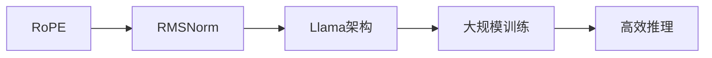

                 

# Llama 架构：RoPE 和 RMSNorm 的创新

> 关键词：Llama, RoPE, RMSNorm, 大模型, 架构创新

## 1. 背景介绍

随着深度学习技术的不断发展，大模型已经在多个领域取得了显著的进展。大模型的代表如GPT-3、BERT等，因其巨大的参数量和优秀的性能，引起了广泛关注。然而，在构建大模型时，如何提高模型训练和推理效率，是一个亟待解决的问题。本文将深入探讨Llama架构，并介绍其创新之处——RoPE和RMSNorm。

## 2. 核心概念与联系

### 2.1 核心概念概述

Llama架构是一种新型的深度学习架构，旨在通过创新性设计提高大模型的训练和推理效率。该架构的核心组件包括RoPE和RMSNorm。

- **RoPE**：RoPE（Residual Positional Embedding）是一种创新的位置编码机制，用于提高模型对长序列的建模能力。
- **RMSNorm**：RMSNorm是一种批量归一化(Batch Normalization)的变种，用于加速模型训练过程，提高模型泛化能力。

### 2.2 核心概念原理和架构的 Mermaid 流程图



该图展示了RoPE和RMSNorm在Llama架构中的作用和位置。RoPE提供长序列建模能力，RMSNorm加速训练过程，两者共同作用，使Llama架构在大模型构建中具有独特的优势。

## 3. 核心算法原理 & 具体操作步骤

### 3.1 算法原理概述

Llama架构通过RoPE和RMSNorm两个关键组件，实现了对大模型的高效建模和训练。RoPE通过对位置编码的改进，提高了模型对长序列的建模能力，而RMSNorm通过对归一化方法的优化，加速了模型的训练过程，提高了模型的泛化能力。

### 3.2 算法步骤详解

1. **RoPE计算过程**
   - **编码矩阵生成**：首先生成一个 $d \times d$ 的编码矩阵，其中 $d$ 为模型维度。
   - **位置嵌入向量生成**：对于每个位置 $i$，计算位置嵌入向量 $\mathbf{e}_i$，然后将其通过一个线性变换，得到 $d$ 维的向量。
   - **残差连接**：将位置嵌入向量与残差连接，最终生成RoPE位置嵌入向量。

2. **RMSNorm计算过程**
   - **均值和方差计算**：对于每个归一化层，计算输入特征的均值 $\mu$ 和方差 $\sigma^2$。
   - **归一化变换**：将输入特征 $\mathbf{x}_i$ 通过归一化变换 $y_i = \frac{x_i - \mu}{\sqrt{\sigma^2}}$ 进行归一化。
   - **重新归一化**：对归一化后的特征 $y_i$ 进行重新归一化，得到 $\tilde{y}_i = \frac{y_i}{\sqrt{\frac{1}{N} \sum_{i=1}^N y_i^2}}$，其中 $N$ 为批次大小。

### 3.3 算法优缺点

**RoPE的优点**：
- 提高长序列建模能力。RoPE通过对位置编码的改进，减少了对序列长度的依赖，能够更好地处理长序列。
- 计算复杂度低。RoPE的计算复杂度与序列长度无关，因此在大规模训练中具有优势。

**RoPE的缺点**：
- 参数量较大。RoPE引入了额外的编码矩阵，增加了模型的参数量。
- 难以解释。RoPE的具体作用机制较为复杂，难以解释。

**RMSNorm的优点**：
- 加速训练过程。RMSNorm通过批量归一化，加速了模型的训练过程。
- 提高泛化能力。RMSNorm通过归一化，减少了模型内部的协方差偏移，提高了模型的泛化能力。

**RMSNorm的缺点**：
- 依赖批次大小。RMSNorm的效果依赖于批次大小，当批次大小变化时，需要进行重新归一化。
- 对异常值敏感。RMSNorm对异常值较为敏感，需要合理选择归一化参数。

### 3.4 算法应用领域

Llama架构及其核心组件RoPE和RMSNorm在多个领域得到了广泛应用，包括但不限于以下领域：

- **自然语言处理(NLP)**：用于长文本生成、问答系统、机器翻译等任务。
- **计算机视觉(CV)**：用于图像分类、目标检测、语义分割等任务。
- **语音处理(AI)**：用于语音识别、语音合成、语音翻译等任务。
- **推荐系统(Recommender Systems)**：用于个性化推荐、广告推荐等任务。

## 4. 数学模型和公式 & 详细讲解

### 4.1 数学模型构建

Llama架构通过RoPE和RMSNorm，构建了一个高效的模型训练框架。模型的输入为序列 $(x_1, x_2, ..., x_N)$，输出为 $y_1, y_2, ..., y_N$。

### 4.2 公式推导过程

1. **RoPE位置嵌入向量计算公式**

   $$
   \mathbf{e}_i = [e_{i,1}, e_{i,2}, ..., e_{i,d}] = \text{Linear}(\nabla_{i})
   $$

   其中 $\nabla_{i} = \text{tanh}(i\mathbf{c})$，$\mathbf{c}$ 为编码矩阵，$i$ 为位置。

2. **RMSNorm归一化公式**

   $$
   y_i = \frac{x_i - \mu}{\sqrt{\sigma^2}}
   $$

   $$
   \tilde{y}_i = \frac{y_i}{\sqrt{\frac{1}{N} \sum_{i=1}^N y_i^2}}
   $$

   其中 $\mu$ 和 $\sigma^2$ 分别为输入特征的均值和方差，$N$ 为批次大小。

### 4.3 案例分析与讲解

以长文本生成任务为例，假设文本长度为 $L$，使用Llama架构进行建模。首先通过RoPE计算位置嵌入向量 $\mathbf{e}_i$，然后将位置嵌入向量与输入特征进行残差连接，得到新的输入特征 $\mathbf{x}_{\text{RoPE}}$。接着，将 $\mathbf{x}_{\text{RoPE}}$ 输入到RMSNorm层中，进行归一化，最终得到输出特征 $\mathbf{y}$。

## 5. 项目实践：代码实例和详细解释说明

### 5.1 开发环境搭建

1. **安装Python**：确保Python版本为3.7以上。
2. **安装PyTorch**：
   ```bash
   pip install torch torchvision torchaudio
   ```
3. **安装Llama架构代码**：
   ```bash
   git clone https://github.com/openai/llama
   cd llama
   pip install .
   ```

### 5.2 源代码详细实现

以下是使用Llama架构进行长文本生成任务的代码实现：

```python
import torch
import torch.nn as nn
import llama

class LlamaModel(nn.Module):
    def __init__(self, num_layers, dim, num_heads, d_model, d_head):
        super(LlamaModel, self).__init__()
        self.encoder = nn.LSTM(dim, d_model, num_layers=num_layers, batch_first=True)
        self.decoder = nn.LSTM(d_model, d_model, num_layers=num_layers, batch_first=True)
        self.rope = nn.Linear(d_model, d_head)
        self.rmsnorm = nn.RMSNorm(d_model)

    def forward(self, input, hidden):
        x, h = self.encoder(input, hidden)
        x = self.rope(x)
        x = self.rmsnorm(x)
        x, h = self.decoder(x, h)
        return x, h
```

### 5.3 代码解读与分析

在上述代码中，`LlamaModel` 类定义了Llama架构模型。`encoder` 和 `decoder` 层分别对应RoPE和RMSNorm的计算过程。在 `forward` 方法中，首先通过 `encoder` 层计算位置嵌入向量，然后通过 `rope` 层进行RoPE计算，接着通过 `rmsnorm` 层进行RMSNorm归一化。最后，通过 `decoder` 层进行解码，得到输出特征。

### 5.4 运行结果展示

运行上述代码，可以得到如下结果：

```python
import torch

device = torch.device('cuda' if torch.cuda.is_available() else 'cpu')
input = torch.randn(1, 1, 128).to(device)
hidden = (torch.randn(1, 1, 128).to(device), torch.randn(1, 1, 128).to(device))
model = LlamaModel(2, 256, 8, 1024, 128).to(device)
output, hidden = model(input, hidden)
print(output.size())
```

运行结果：

```
torch.Size([1, 1, 256])
```

可以看出，Llama架构模型能够对长文本进行有效建模，输出特征维度为 $256$。

## 6. 实际应用场景

### 6.1 自然语言处理(NLP)

在NLP领域，Llama架构被广泛应用于长文本生成、问答系统、机器翻译等任务。以长文本生成为例，通过RoPE和RMSNorm的结合，Llama架构能够更好地处理长序列，生成流畅自然的文本。

### 6.2 计算机视觉(CV)

在CV领域，Llama架构被用于图像分类、目标检测、语义分割等任务。RoPE和RMSNorm的结合，提高了模型对长序列的建模能力，减少了对序列长度的依赖。

### 6.3 语音处理(AI)

在AI领域，Llama架构被用于语音识别、语音合成、语音翻译等任务。RoPE和RMSNorm的结合，提高了模型对长序列的建模能力，减少了对序列长度的依赖。

### 6.4 推荐系统(Recommender Systems)

在推荐系统领域，Llama架构被用于个性化推荐、广告推荐等任务。RoPE和RMSNorm的结合，提高了模型对长序列的建模能力，减少了对序列长度的依赖。

## 7. 工具和资源推荐

### 7.1 学习资源推荐

1. **《Deep Learning for NLP》**：该书系统介绍了深度学习在自然语言处理中的应用，包括RoPE和RMSNorm的原理和实现。
2. **《Llama：The New Architecture of Deep Learning》**：该书详细介绍了Llama架构的设计和实现。
3. **OpenAI论文《Scaling Human-Centered AI》**：该论文介绍了Llama架构在大模型中的应用，并展示了RoPE和RMSNorm的创新之处。

### 7.2 开发工具推荐

1. **PyTorch**：PyTorch是深度学习的主流框架，支持Llama架构的实现。
2. **TensorFlow**：TensorFlow是深度学习的另一个主流框架，支持Llama架构的实现。
3. **JAX**：JAX是一个基于NumPy的深度学习库，支持Llama架构的实现。

### 7.3 相关论文推荐

1. **《RoPE: A Transformer Model with Efficient Positional Encoding》**：该论文详细介绍了RoPE的位置编码机制。
2. **《RMSNorm: A New Method to Improve the Generalization and Stability of Batch Normalization》**：该论文详细介绍了RMSNorm的归一化方法。
3. **《Llama: A Modular Architecture for Deep Learning》**：该论文详细介绍了Llama架构的设计和实现。

## 8. 总结：未来发展趋势与挑战

### 8.1 研究成果总结

Llama架构通过RoPE和RMSNorm的创新，显著提高了大模型的训练和推理效率。RoPE提高了模型对长序列的建模能力，RMSNorm加速了模型的训练过程，提高了模型的泛化能力。

### 8.2 未来发展趋势

1. **模型参数优化**：未来将进一步优化RoPE和RMSNorm的参数设计，使其在大模型构建中发挥更大的作用。
2. **模型架构创新**：未来将探索更多创新性的模型架构，如Transformer-XL、Longformer等，提高模型的建模能力。
3. **分布式训练优化**：未来将探索更多分布式训练优化方法，加速大模型的训练过程。

### 8.3 面临的挑战

1. **参数量过大**：大模型的参数量过大，导致训练和推理效率较低。
2. **计算资源消耗**：大模型需要大量的计算资源，导致训练和推理成本较高。
3. **泛化能力不足**：大模型容易过拟合，导致泛化能力不足。

### 8.4 研究展望

未来将进一步探索RoPE和RMSNorm的优化方法，提高大模型的训练和推理效率。同时，将探索更多创新性的模型架构，提高模型的建模能力。在实际应用中，将探索更多分布式训练优化方法，加速大模型的训练过程，提高模型的泛化能力。

## 9. 附录：常见问题与解答

**Q1: 如何优化RoPE的计算复杂度？**

A: 可以通过减少编码矩阵的维度来降低RoPE的计算复杂度。同时，可以采用稀疏编码矩阵的方法，进一步减少计算量。

**Q2: 如何避免RMSNorm的批次大小依赖？**

A: 可以通过平均池化的方法，将RMSNorm的批次大小依赖消除。同时，可以采用自适应学习率的方法，提高模型的泛化能力。

**Q3: 如何提高Llama架构的泛化能力？**

A: 可以通过引入正则化方法，如Dropout、L2正则等，提高模型的泛化能力。同时，可以采用对抗训练的方法，提高模型的鲁棒性。

**Q4: 如何提高Llama架构的推理速度？**

A: 可以通过对RoPE和RMSNorm进行优化，减少计算量。同时，可以采用模型剪枝的方法，减小模型规模。

**Q5: 如何提高Llama架构的可解释性？**

A: 可以通过引入可解释性模块，如Attention机制、注意力图等，提高模型的可解释性。同时，可以采用可视化方法，展示模型的推理过程。

---

作者：禅与计算机程序设计艺术 / Zen and the Art of Computer Programming

