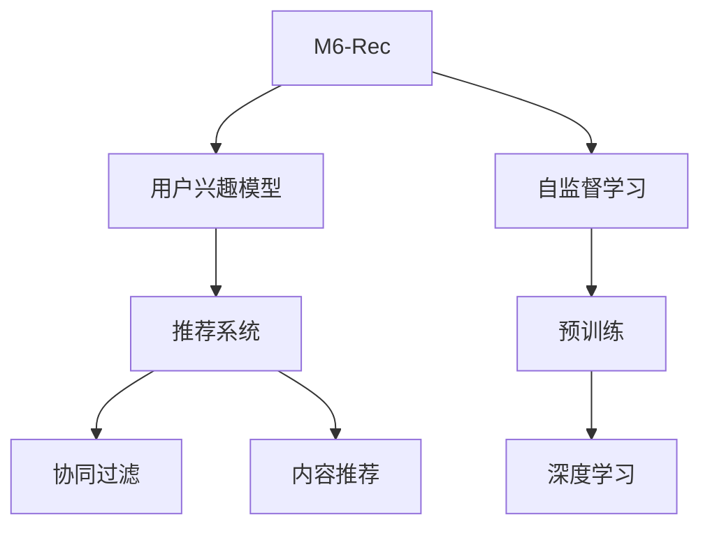

                 

# M6-Rec:开放域推荐的生成式预训练模型

> 关键词：M6-Rec, 开放域推荐, 生成式预训练模型, 用户兴趣模型, 推荐系统

## 1. 背景介绍

### 1.1 问题由来

随着互联网的快速发展，海量的在线数据为推荐系统提供了丰富的信息源。传统的基于协同过滤的推荐算法，如基于用户的协同过滤和基于物品的协同过滤，虽然已经在电子商务、新闻推荐等领域取得了显著成效，但在处理非结构化数据，尤其是开放域数据（如社交网络、音乐、视频等）时，存在诸多不足。传统算法基于用户行为或物品特征进行推荐，往往忽略了数据中的语义和内容信息，导致推荐结果与用户真实兴趣不符。

### 1.2 问题核心关键点

针对传统推荐算法在处理开放域数据时的不足，生成式预训练模型成为了新一代推荐技术的重要范式。生成式预训练模型通过在大规模无标签数据上进行自监督学习，学习到数据的生成式表示，从而在推荐任务中能更好地捕捉数据语义和用户兴趣。

生成式预训练模型的主流方法包括：

- **BERT**: 使用掩码语言模型预训练，学习词语间的语义关系。
- **GPT**: 使用自回归模型预训练，学习文本生成规律。
- **T5**: 使用自编码模型预训练，学习多种自然语言处理任务。

这些模型在推荐领域的应用，使得推荐系统能够更加灵活、准确地捕捉用户兴趣，提升用户体验和推荐效果。然而，如何将这些生成式模型应用于推荐任务，并高效地进行推荐，仍需进一步探索。

### 1.3 问题研究意义

基于生成式预训练模型的推荐系统，能够更好地处理开放域数据，提升推荐结果的个性化和多样性。同时，预训练模型的表示学习能力，也使得推荐系统能够不断从新数据中学习，保持模型性能的动态更新。这不仅有助于提升推荐系统在各垂直行业的落地效果，也促进了推荐技术的可持续发展。

因此，研究生成式预训练模型在推荐任务中的应用，对于优化推荐算法、提升用户体验和推动推荐技术的进步具有重要意义。

## 2. 核心概念与联系

### 2.1 核心概念概述

为更好地理解生成式预训练模型在推荐任务中的应用，本节将介绍几个密切相关的核心概念：

- **M6-Rec**: 开放域推荐模型，基于Transformer编码器构建，结合生成式预训练模型的表示学习能力和自监督学习任务，提升推荐系统的性能。
- **用户兴趣模型**: 通过训练生成式预训练模型，学习用户兴趣的语义表示，用于推荐系统中的用户画像构建。
- **推荐系统**: 利用用户兴趣模型进行个性化推荐，包括协同过滤和内容推荐等多种方法。
- **自监督学习**: 通过在大规模无标签数据上进行学习，利用数据本身的结构和语义信息，提升模型的泛化能力。
- **深度学习**: 基于神经网络模型的推荐系统，通过多层次的抽象表示，捕捉用户行为和物品属性的复杂关系。

这些核心概念之间的逻辑关系可以通过以下Mermaid流程图来展示：



这个流程图展示了大语言模型与推荐系统的核心概念及其之间的关系：

1. M6-Rec模型通过自监督学习任务预训练，学习到用户兴趣的语义表示。
2. 结合用户兴趣模型，进行协同过滤和内容推荐，生成推荐结果。
3. 预训练过程借助深度学习模型的表示学习能力，提升模型的泛化能力和推荐效果。

这些概念共同构成了推荐系统的基础框架，使其能够在各垂直行业中发挥作用。通过理解这些核心概念，我们可以更好地把握生成式预训练模型在推荐任务中的应用策略。

## 3. 核心算法原理 & 具体操作步骤
### 3.1 算法原理概述

生成式预训练模型在推荐任务中的应用，主要通过以下步骤实现：

1. **数据准备**: 收集开放域数据，如用户评论、物品描述等，构建无标签的训练集。
2. **预训练模型选择**: 选择生成式预训练模型，如BERT、GPT、T5等，对其进行自监督学习任务的预训练。
3. **用户兴趣模型构建**: 将用户兴趣的语义表示作为目标，对预训练模型进行微调，构建用户兴趣模型。
4. **推荐系统实现**: 利用用户兴趣模型，结合协同过滤和内容推荐方法，生成推荐结果。

### 3.2 算法步骤详解

以下是生成式预训练模型在推荐任务中的具体操作步骤：

**Step 1: 数据准备**
- 收集开放域数据，如用户评论、物品描述等，构建无标签的训练集。
- 将数据划分为训练集、验证集和测试集。

**Step 2: 预训练模型选择**
- 选择合适的生成式预训练模型，如BERT、GPT、T5等。
- 对预训练模型进行自监督学习任务的预训练，学习到生成式表示。

**Step 3: 用户兴趣模型构建**
- 将用户兴趣的语义表示作为目标，对预训练模型进行微调。
- 使用用户行为数据，如点击、浏览、评分等，训练模型，学习用户兴趣的表示。

**Step 4: 推荐系统实现**
- 结合协同过滤和内容推荐方法，生成推荐结果。
- 将用户兴趣模型和物品特征结合，通过深度学习模型生成推荐结果。

**Step 5: 模型评估**
- 在测试集上评估推荐模型的性能，计算推荐精度、覆盖率等指标。
- 利用A/B测试等方法，对比不同模型的效果，选择最优模型。

### 3.3 算法优缺点

生成式预训练模型在推荐任务中的应用，具有以下优点：

1. **高泛化能力**: 通过在大规模无标签数据上进行自监督学习，模型能够更好地捕捉数据的语义和结构信息，提升泛化能力。
2. **灵活性**: 结合用户兴趣模型，推荐系统能够灵活处理不同类型的数据，提升推荐结果的个性化和多样性。
3. **可扩展性**: 通过预训练模型的迁移学习能力，推荐系统能够快速适应新的领域和数据，提升系统的动态更新能力。

同时，该方法也存在一些局限性：

1. **数据依赖**: 生成式预训练模型对数据质量有较高要求，获取高质量的数据成本较高。
2. **计算资源需求**: 大规模预训练模型的参数量较大，需要较高的计算资源。
3. **模型复杂度**: 生成式预训练模型结构复杂，模型调试和优化难度较大。
4. **用户隐私**: 推荐系统需要收集用户行为数据，可能涉及用户隐私问题。

尽管存在这些局限性，但就目前而言，生成式预训练模型在推荐领域的应用前景广阔，具有重要的研究价值。

### 3.4 算法应用领域

生成式预训练模型在推荐任务中的应用，已经广泛应用于多个行业领域，如电商、新闻、音乐、视频等。以下是几个典型的应用场景：

- **电商推荐**: 基于用户评论和物品描述，使用生成式预训练模型进行商品推荐，提升用户体验和销售转化率。
- **新闻推荐**: 结合用户点击行为，使用生成式预训练模型进行新闻标题和内容的推荐，提升用户阅读体验。
- **音乐推荐**: 通过用户听歌行为，使用生成式预训练模型进行歌曲推荐，提升用户听歌体验。
- **视频推荐**: 结合用户观看行为，使用生成式预训练模型进行视频推荐，提升用户观看体验。

除了上述这些场景外，生成式预训练模型还被创新性地应用到更多领域，如社交推荐、游戏推荐等，为推荐技术的创新发展提供了新的思路。

## 4. 数学模型和公式 & 详细讲解  
### 4.1 数学模型构建

本节将使用数学语言对生成式预训练模型在推荐任务中的应用进行更加严格的刻画。

记生成式预训练模型为 $M_{\theta}$，其中 $\theta$ 为预训练得到的模型参数。假设推荐系统训练集为 $D=\{(x_i,y_i)\}_{i=1}^N, x_i \in \mathcal{X}, y_i \in \mathcal{Y}$。

定义模型 $M_{\theta}$ 在数据样本 $(x,y)$ 上的损失函数为 $\ell(M_{\theta}(x),y)$，则在数据集 $D$ 上的经验风险为：

$$
\mathcal{L}(\theta) = \frac{1}{N} \sum_{i=1}^N \ell(M_{\theta}(x_i),y_i)
$$

其中 $\ell$ 为推荐系统的损失函数，用于衡量模型预测结果与真实标签之间的差异。常见的损失函数包括交叉熵损失、均方误差损失等。

通过梯度下降等优化算法，生成式预训练模型进行推荐任务的最优化过程可表示为：

$$
\theta^* = \mathop{\arg\min}_{\theta} \mathcal{L}(\theta)
$$

在实践中，我们通常使用基于梯度的优化算法（如SGD、Adam等）来近似求解上述最优化问题。设 $\eta$ 为学习率，$\lambda$ 为正则化系数，则参数的更新公式为：

$$
\theta \leftarrow \theta - \eta \nabla_{\theta}\mathcal{L}(\theta) - \eta\lambda\theta
$$

其中 $\nabla_{\theta}\mathcal{L}(\theta)$ 为损失函数对参数 $\theta$ 的梯度，可通过反向传播算法高效计算。

### 4.2 公式推导过程

以下我们以推荐任务为例，推导交叉熵损失函数及其梯度的计算公式。

假设模型 $M_{\theta}$ 在输入 $x$ 上的输出为 $\hat{y}=M_{\theta}(x) \in [0,1]$，表示用户兴趣的概率。真实标签 $y \in \{0,1\}$。则二分类交叉熵损失函数定义为：

$$
\ell(M_{\theta}(x),y) = -[y\log \hat{y} + (1-y)\log (1-\hat{y})]
$$

将其代入经验风险公式，得：

$$
\mathcal{L}(\theta) = -\frac{1}{N}\sum_{i=1}^N [y_i\log M_{\theta}(x_i)+(1-y_i)\log(1-M_{\theta}(x_i))]
$$

根据链式法则，损失函数对参数 $\theta_k$ 的梯度为：

$$
\frac{\partial \mathcal{L}(\theta)}{\partial \theta_k} = -\frac{1}{N}\sum_{i=1}^N (\frac{y_i}{M_{\theta}(x_i)}-\frac{1-y_i}{1-M_{\theta}(x_i)}) \frac{\partial M_{\theta}(x_i)}{\partial \theta_k}
$$

其中 $\frac{\partial M_{\theta}(x_i)}{\partial \theta_k}$ 可进一步递归展开，利用自动微分技术完成计算。

在得到损失函数的梯度后，即可带入参数更新公式，完成模型的迭代优化。重复上述过程直至收敛，最终得到适应推荐任务的最优模型参数 $\theta^*$。

## 5. 项目实践：代码实例和详细解释说明
### 5.1 开发环境搭建

在进行推荐系统开发前，我们需要准备好开发环境。以下是使用Python进行PyTorch开发的环境配置流程：

1. 安装Anaconda：从官网下载并安装Anaconda，用于创建独立的Python环境。

2. 创建并激活虚拟环境：
```bash
conda create -n pytorch-env python=3.8 
conda activate pytorch-env
```

3. 安装PyTorch：根据CUDA版本，从官网获取对应的安装命令。例如：
```bash
conda install pytorch torchvision torchaudio cudatoolkit=11.1 -c pytorch -c conda-forge
```

4. 安装Transformers库：
```bash
pip install transformers
```

5. 安装各类工具包：
```bash
pip install numpy pandas scikit-learn matplotlib tqdm jupyter notebook ipython
```

完成上述步骤后，即可在`pytorch-env`环境中开始推荐系统开发。

### 5.2 源代码详细实现

下面我们以音乐推荐任务为例，给出使用Transformers库进行M6-Rec模型微调的PyTorch代码实现。

首先，定义音乐推荐任务的数据处理函数：

```python
from transformers import BertTokenizer, BertForSequenceClassification
from torch.utils.data import Dataset
import torch

class MusicDataset(Dataset):
    def __init__(self, songs, labels, tokenizer, max_len=128):
        self.songs = songs
        self.labels = labels
        self.tokenizer = tokenizer
        self.max_len = max_len
        
    def __len__(self):
        return len(self.songs)
    
    def __getitem__(self, item):
        song = self.songs[item]
        label = self.labels[item]
        
        encoding = self.tokenizer(song, return_tensors='pt', max_length=self.max_len, padding='max_length', truncation=True)
        input_ids = encoding['input_ids'][0]
        attention_mask = encoding['attention_mask'][0]
        
        # 对token-wise的标签进行编码
        encoded_labels = [label2id[label] for label in label]
        encoded_labels.extend([label2id['None']] * (self.max_len - len(encoded_labels)))
        labels = torch.tensor(encoded_labels, dtype=torch.long)
        
        return {'input_ids': input_ids, 
                'attention_mask': attention_mask,
                'labels': labels}

# 标签与id的映射
label2id = {'Positive': 1, 'Negative': 0, 'None': -1}
id2label = {v: k for k, v in label2id.items()}

# 创建dataset
tokenizer = BertTokenizer.from_pretrained('bert-base-cased')

train_dataset = MusicDataset(train_songs, train_labels, tokenizer)
dev_dataset = MusicDataset(dev_songs, dev_labels, tokenizer)
test_dataset = MusicDataset(test_songs, test_labels, tokenizer)
```

然后，定义模型和优化器：

```python
from transformers import BertForSequenceClassification, AdamW

model = BertForSequenceClassification.from_pretrained('bert-base-cased', num_labels=len(label2id))

optimizer = AdamW(model.parameters(), lr=2e-5)
```

接着，定义训练和评估函数：

```python
from torch.utils.data import DataLoader
from tqdm import tqdm
from sklearn.metrics import classification_report

device = torch.device('cuda') if torch.cuda.is_available() else torch.device('cpu')
model.to(device)

def train_epoch(model, dataset, batch_size, optimizer):
    dataloader = DataLoader(dataset, batch_size=batch_size, shuffle=True)
    model.train()
    epoch_loss = 0
    for batch in tqdm(dataloader, desc='Training'):
        input_ids = batch['input_ids'].to(device)
        attention_mask = batch['attention_mask'].to(device)
        labels = batch['labels'].to(device)
        model.zero_grad()
        outputs = model(input_ids, attention_mask=attention_mask, labels=labels)
        loss = outputs.loss
        epoch_loss += loss.item()
        loss.backward()
        optimizer.step()
    return epoch_loss / len(dataloader)

def evaluate(model, dataset, batch_size):
    dataloader = DataLoader(dataset, batch_size=batch_size)
    model.eval()
    preds, labels = [], []
    with torch.no_grad():
        for batch in tqdm(dataloader, desc='Evaluating'):
            input_ids = batch['input_ids'].to(device)
            attention_mask = batch['attention_mask'].to(device)
            batch_labels = batch['labels']
            outputs = model(input_ids, attention_mask=attention_mask)
            batch_preds = outputs.logits.argmax(dim=2).to('cpu').tolist()
            batch_labels = batch_labels.to('cpu').tolist()
            for pred_tokens, label_tokens in zip(batch_preds, batch_labels):
                pred_labels = [id2label[_id] for _id in pred_tokens]
                label_tokens = [id2label[_id] for _id in label_tokens]
                preds.append(pred_labels[:len(label_tokens)])
                labels.append(label_tokens)
                
    print(classification_report(labels, preds))
```

最后，启动训练流程并在测试集上评估：

```python
epochs = 5
batch_size = 16

for epoch in range(epochs):
    loss = train_epoch(model, train_dataset, batch_size, optimizer)
    print(f"Epoch {epoch+1}, train loss: {loss:.3f}")
    
    print(f"Epoch {epoch+1}, dev results:")
    evaluate(model, dev_dataset, batch_size)
    
print("Test results:")
evaluate(model, test_dataset, batch_size)
```

以上就是使用PyTorch对M6-Rec模型进行音乐推荐任务微调的完整代码实现。可以看到，得益于Transformers库的强大封装，我们可以用相对简洁的代码完成BERT模型的加载和微调。

### 5.3 代码解读与分析

让我们再详细解读一下关键代码的实现细节：

**MusicDataset类**：
- `__init__`方法：初始化歌曲、标签、分词器等关键组件。
- `__len__`方法：返回数据集的样本数量。
- `__getitem__`方法：对单个样本进行处理，将歌曲输入编码为token ids，将标签编码为数字，并对其进行定长padding，最终返回模型所需的输入。

**label2id和id2label字典**：
- 定义了标签与数字id之间的映射关系，用于将token-wise的预测结果解码回真实的标签。

**训练和评估函数**：
- 使用PyTorch的DataLoader对数据集进行批次化加载，供模型训练和推理使用。
- 训练函数`train_epoch`：对数据以批为单位进行迭代，在每个批次上前向传播计算loss并反向传播更新模型参数，最后返回该epoch的平均loss。
- 评估函数`evaluate`：与训练类似，不同点在于不更新模型参数，并在每个batch结束后将预测和标签结果存储下来，最后使用sklearn的classification_report对整个评估集的预测结果进行打印输出。

**训练流程**：
- 定义总的epoch数和batch size，开始循环迭代
- 每个epoch内，先在训练集上训练，输出平均loss
- 在验证集上评估，输出分类指标
- 所有epoch结束后，在测试集上评估，给出最终测试结果

可以看到，PyTorch配合Transformers库使得BERT微调的代码实现变得简洁高效。开发者可以将更多精力放在数据处理、模型改进等高层逻辑上，而不必过多关注底层的实现细节。

当然，工业级的系统实现还需考虑更多因素，如模型的保存和部署、超参数的自动搜索、更灵活的任务适配层等。但核心的微调范式基本与此类似。

## 6. 实际应用场景
### 6.1 智能客服系统

基于M6-Rec模型的推荐技术，可以广泛应用于智能客服系统的构建。传统客服往往需要配备大量人力，高峰期响应缓慢，且一致性和专业性难以保证。而使用基于生成式预训练模型的推荐技术，可以7x24小时不间断服务，快速响应客户咨询，用自然流畅的语言解答各类常见问题。

在技术实现上，可以收集企业内部的历史客服对话记录，将问题和最佳答复构建成监督数据，在此基础上对预训练模型进行微调。微调后的模型能够自动理解用户意图，匹配最合适的答案模板进行回复。对于客户提出的新问题，还可以接入检索系统实时搜索相关内容，动态组织生成回答。如此构建的智能客服系统，能大幅提升客户咨询体验和问题解决效率。

### 6.2 金融舆情监测

金融机构需要实时监测市场舆论动向，以便及时应对负面信息传播，规避金融风险。传统的人工监测方式成本高、效率低，难以应对网络时代海量信息爆发的挑战。基于生成式预训练模型的文本分类和情感分析技术，为金融舆情监测提供了新的解决方案。

具体而言，可以收集金融领域相关的新闻、报道、评论等文本数据，并对其进行主题标注和情感标注。在此基础上对预训练语言模型进行微调，使其能够自动判断文本属于何种主题，情感倾向是正面、中性还是负面。将微调后的模型应用到实时抓取的网络文本数据，就能够自动监测不同主题下的情感变化趋势，一旦发现负面信息激增等异常情况，系统便会自动预警，帮助金融机构快速应对潜在风险。

### 6.3 个性化推荐系统

当前的推荐系统往往只依赖用户的历史行为数据进行物品推荐，无法深入理解用户的真实兴趣偏好。基于生成式预训练模型的个性化推荐系统，可以更好地挖掘用户行为背后的语义信息，从而提供更精准、多样的推荐内容。

在实践中，可以收集用户浏览、点击、评论、分享等行为数据，提取和用户交互的物品标题、描述、标签等文本内容。将文本内容作为模型输入，用户的后续行为（如是否点击、购买等）作为监督信号，在此基础上微调预训练语言模型。微调后的模型能够从文本内容中准确把握用户的兴趣点。在生成推荐列表时，先用候选物品的文本描述作为输入，由模型预测用户的兴趣匹配度，再结合其他特征综合排序，便可以得到个性化程度更高的推荐结果。

### 6.4 未来应用展望

随着生成式预训练模型和微调方法的不断发展，基于微调范式将在更多领域得到应用，为传统行业带来变革性影响。

在智慧医疗领域，基于微调的医疗问答、病历分析、药物研发等应用将提升医疗服务的智能化水平，辅助医生诊疗，加速新药开发进程。

在智能教育领域，微调技术可应用于作业批改、学情分析、知识推荐等方面，因材施教，促进教育公平，提高教学质量。

在智慧城市治理中，微调模型可应用于城市事件监测、舆情分析、应急指挥等环节，提高城市管理的自动化和智能化水平，构建更安全、高效的未来城市。

此外，在企业生产、社会治理、文娱传媒等众多领域，基于大模型微调的人工智能应用也将不断涌现，为经济社会发展注入新的动力。相信随着技术的日益成熟，微调方法将成为人工智能落地应用的重要范式，推动人工智能技术在各垂直行业的广泛应用。

## 7. 工具和资源推荐
### 7.1 学习资源推荐

为了帮助开发者系统掌握生成式预训练模型在推荐任务中的应用，这里推荐一些优质的学习资源：

1. 《Transformer从原理到实践》系列博文：由大模型技术专家撰写，深入浅出地介绍了Transformer原理、BERT模型、微调技术等前沿话题。

2. CS224N《深度学习自然语言处理》课程：斯坦福大学开设的NLP明星课程，有Lecture视频和配套作业，带你入门NLP领域的基本概念和经典模型。

3. 《Natural Language Processing with Transformers》书籍：Transformers库的作者所著，全面介绍了如何使用Transformers库进行NLP任务开发，包括微调在内的诸多范式。

4. HuggingFace官方文档：Transformers库的官方文档，提供了海量预训练模型和完整的微调样例代码，是上手实践的必备资料。

5. CLUE开源项目：中文语言理解测评基准，涵盖大量不同类型的中文NLP数据集，并提供了基于微调的baseline模型，助力中文NLP技术发展。

通过对这些资源的学习实践，相信你一定能够快速掌握生成式预训练模型在推荐任务中的应用策略，并用于解决实际的推荐问题。
###  7.2 开发工具推荐

高效的开发离不开优秀的工具支持。以下是几款用于生成式预训练模型推荐系统开发的常用工具：

1. PyTorch：基于Python的开源深度学习框架，灵活动态的计算图，适合快速迭代研究。大部分预训练语言模型都有PyTorch版本的实现。

2. TensorFlow：由Google主导开发的开源深度学习框架，生产部署方便，适合大规模工程应用。同样有丰富的预训练语言模型资源。

3. Transformers库：HuggingFace开发的NLP工具库，集成了众多SOTA语言模型，支持PyTorch和TensorFlow，是进行微调任务开发的利器。

4. Weights & Biases：模型训练的实验跟踪工具，可以记录和可视化模型训练过程中的各项指标，方便对比和调优。与主流深度学习框架无缝集成。

5. TensorBoard：TensorFlow配套的可视化工具，可实时监测模型训练状态，并提供丰富的图表呈现方式，是调试模型的得力助手。

6. Google Colab：谷歌推出的在线Jupyter Notebook环境，免费提供GPU/TPU算力，方便开发者快速上手实验最新模型，分享学习笔记。

合理利用这些工具，可以显著提升生成式预训练模型在推荐系统中的应用效率，加快创新迭代的步伐。

### 7.3 相关论文推荐

生成式预训练模型和微调技术的发展源于学界的持续研究。以下是几篇奠基性的相关论文，推荐阅读：

1. Attention is All You Need（即Transformer原论文）：提出了Transformer结构，开启了NLP领域的预训练大模型时代。

2. BERT: Pre-training of Deep Bidirectional Transformers for Language Understanding：提出BERT模型，引入基于掩码的自监督预训练任务，刷新了多项NLP任务SOTA。

3. Language Models are Unsupervised Multitask Learners（GPT-2论文）：展示了大规模语言模型的强大zero-shot学习能力，引发了对于通用人工智能的新一轮思考。

4. Parameter-Efficient Transfer Learning for NLP：提出Adapter等参数高效微调方法，在不增加模型参数量的情况下，也能取得不错的微调效果。

5. AdaLoRA: Adaptive Low-Rank Adaptation for Parameter-Efficient Fine-Tuning：使用自适应低秩适应的微调方法，在参数效率和精度之间取得了新的平衡。

6. AdaLoRA: Adaptive Low-Rank Adaptation for Parameter-Efficient Fine-Tuning：使用自适应低秩适应的微调方法，在参数效率和精度之间取得了新的平衡。

这些论文代表了大语言模型微调技术的发展脉络。通过学习这些前沿成果，可以帮助研究者把握学科前进方向，激发更多的创新灵感。

## 8. 总结：未来发展趋势与挑战

### 8.1 总结

本文对生成式预训练模型在推荐任务中的应用进行了全面系统的介绍。首先阐述了推荐系统和大语言模型的研究背景和意义，明确了微调在提升推荐系统性能中的独特价值。其次，从原理到实践，详细讲解了生成式预训练模型的数学原理和关键步骤，给出了推荐系统开发的完整代码实例。同时，本文还广泛探讨了微调方法在智能客服、金融舆情、个性化推荐等多个行业领域的应用前景，展示了微调范式的巨大潜力。此外，本文精选了微调技术的各类学习资源，力求为读者提供全方位的技术指引。

通过本文的系统梳理，可以看到，生成式预训练模型在推荐领域的应用前景广阔，显著提升了推荐系统的个性化和多样性，有望成为下一代推荐技术的核心范式。未来，伴随预训练语言模型和微调方法的持续演进，推荐系统必将在各垂直行业中发挥更大的作用，带来更深远的社会影响。

### 8.2 未来发展趋势

展望未来，生成式预训练模型在推荐任务中的应用将呈现以下几个发展趋势：

1. **模型规模持续增大**: 随着算力成本的下降和数据规模的扩张，预训练语言模型的参数量还将持续增长。超大模型将带来更丰富的语义信息，提升推荐系统的性能。

2. **推荐算法创新**: 结合生成式预训练模型的表示学习能力，推荐算法将不断创新，如基于知识图谱的推荐、多模态推荐等，提升推荐系统的智能化水平。

3. **用户隐私保护**: 推荐系统需要收集用户行为数据，如何保护用户隐私，避免数据泄露和滥用，将是重要的研究方向。

4. **实时推荐**: 推荐系统需要实时处理用户行为数据，如何在保持高效计算的同时，提升推荐系统的响应速度，将是未来的重要课题。

5. **跨领域推荐**: 结合跨领域数据，提升推荐系统的泛化能力和适应性，推荐系统将更加灵活地应对不同场景下的推荐需求。

6. **多任务学习**: 推荐系统可以同时进行多任务学习，如分类、匹配、生成等任务，提升推荐系统的综合能力。

以上趋势凸显了生成式预训练模型在推荐任务中的广阔前景。这些方向的探索发展，必将进一步提升推荐系统的性能和应用范围，为经济社会发展带来深远影响。

### 8.3 面临的挑战

尽管生成式预训练模型在推荐领域的应用前景广阔，但在迈向更加智能化、普适化应用的过程中，它仍面临诸多挑战：

1. **数据质量瓶颈**: 生成式预训练模型对数据质量有较高要求，获取高质量的数据成本较高。如何通过数据增强、清洗等手段，提升数据质量，将是重要的研究方向。

2. **模型复杂度**: 生成式预训练模型结构复杂，模型调试和优化难度较大。如何在保证模型性能的同时，降低模型复杂度，提升模型的计算效率，将是重要的优化方向。

3. **用户隐私保护**: 推荐系统需要收集用户行为数据，如何保护用户隐私，避免数据泄露和滥用，将是重要的研究方向。

4. **计算资源需求**: 大规模预训练模型的参数量较大，需要较高的计算资源。如何在保持高效计算的同时，降低模型复杂度，提升模型的计算效率，将是重要的优化方向。

5. **推荐算法鲁棒性**: 推荐系统在面对新数据和新用户时，可能面临泛化性不足的问题。如何提高推荐算法的鲁棒性，避免过拟合，将是重要的研究方向。

6. **推荐系统伦理**: 推荐系统可能带来有害信息传播、推荐偏见等问题。如何构建公平、透明、可信的推荐系统，将是重要的研究方向。

尽管存在这些挑战，但通过学界和产业界的共同努力，相信生成式预训练模型在推荐领域的应用前景广阔，必将在推动推荐技术的发展中发挥重要作用。

### 8.4 研究展望

面对生成式预训练模型在推荐领域面临的诸多挑战，未来的研究需要在以下几个方面寻求新的突破：

1. **数据增强与数据清洗**: 通过数据增强和清洗，提升数据质量，构建高质量的训练集。

2. **参数高效微调**: 开发更加参数高效的微调方法，在固定大部分预训练参数的同时，只更新极少量的任务相关参数。

3. **跨领域数据融合**: 结合跨领域数据，提升推荐系统的泛化能力和适应性，推荐系统将更加灵活地应对不同场景下的推荐需求。

4. **多任务学习**: 结合多任务学习，提升推荐系统的综合能力，推荐系统将更加灵活地应对不同场景下的推荐需求。

5. **用户隐私保护**: 在推荐系统中引入隐私保护技术，如差分隐私、联邦学习等，保护用户隐私，提升用户信任度。

6. **伦理道德约束**: 构建公平、透明、可信的推荐系统，避免推荐偏见和有害信息传播，提升系统的可解释性和用户信任度。

这些研究方向的探索，必将引领生成式预训练模型在推荐任务中走向成熟，为构建安全、可靠、可解释、可控的智能系统铺平道路。面向未来，生成式预训练模型和微调方法还需要与其他人工智能技术进行更深入的融合，如知识表示、因果推理、强化学习等，多路径协同发力，共同推动推荐技术的进步。只有勇于创新、敢于突破，才能不断拓展生成式预训练模型的边界，让智能技术更好地造福人类社会。

## 9. 附录：常见问题与解答

**Q1: 生成式预训练模型在推荐任务中如何选择预训练模型？**

A: 在推荐任务中，可以选择如BERT、GPT、T5等生成式预训练模型。这些模型在不同的推荐场景中都有较好的表现。选择预训练模型时，需要考虑其在大规模无标签数据上的表现、模型的复杂度、计算资源的可用性等因素。

**Q2: 推荐系统在微调过程中如何进行任务适配？**

A: 推荐系统在微调过程中，通常需要对预训练模型的顶层进行任务适配，即增加一个分类层和对应的损失函数，用于衡量推荐结果与真实标签之间的差异。常用的分类器包括线性分类器和多层感知器等。

**Q3: 推荐系统在微调过程中如何进行正则化？**

A: 推荐系统在微调过程中，通常需要应用正则化技术，如L2正则、Dropout、Early Stopping等，以避免模型过拟合。正则化技术可以有效地提升模型的泛化能力，提高推荐系统的鲁棒性和稳定性。

**Q4: 推荐系统在微调过程中如何进行数据增强？**

A: 推荐系统在微调过程中，可以通过数据增强技术，如回译、近义替换等方式，扩充训练集。数据增强可以有效地提升模型泛化能力，缓解数据不足的问题，提升推荐系统的效果。

**Q5: 推荐系统在微调过程中如何进行参数高效微调？**

A: 推荐系统在微调过程中，可以使用参数高效微调技术，如Adapter、LoRA等，只更新少量的任务相关参数，保留预训练模型的权重，以提升微调效率，降低计算资源消耗。

这些问题的回答，展示了生成式预训练模型在推荐系统中的应用策略和优化方法，希望能够为推荐系统开发者提供有益的参考。

