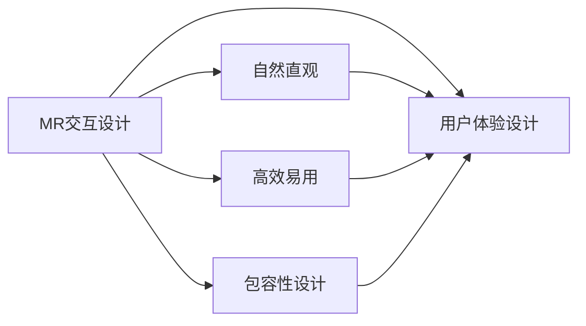

                 

## 1. 背景介绍

### 1.1 问题由来

在当前数字化、信息化社会中，交互设计（Interaction Design）已成为产品开发中不可或缺的一部分。高质量的交互设计能够提升用户的使用体验，促进用户与产品的深度互动。特别是在人机交互日益频繁的互联网和移动设备领域，交互设计的重要性愈发突出。然而，交互设计涉及心理学、认知科学、人机工程学等多学科知识，对于入门级设计师来说，如何设计出自然直观、高效易用的交互界面，是一大挑战。

### 1.2 问题核心关键点

交互设计的主要目标是创建直观、易用、愉悦的用户体验。在实践中，设计师通常需要：

- 深入理解用户需求和行为模式，设计符合用户心理模型和认知框架的界面元素。
- 选择合适的交互方式和交互组件，如按钮、滑块、下拉菜单等，以提高用户操作的准确性和效率。
- 确保界面的响应速度和稳定性能，提升用户体验的流畅性和可靠性。
- 提供清晰的反馈机制，让用户及时了解其操作结果，增强系统的透明度和互动性。
- 设计包容性界面，考虑到不同人群的可用性和无障碍需求，如残障人士的交互体验。

### 1.3 问题研究意义

交互设计的优化不仅能提升产品的市场竞争力，还能带来显著的用户留存率和满意度提升。通过研究用户界面和交互方式的优化策略，设计师可以设计出更加自然直观的用户体验，降低用户的认知负荷，提升系统的操作效率和用户满意度。这对于推动数字化产品的创新发展，增强用户对产品的依赖性和忠诚度，具有重要意义。

## 2. 核心概念与联系

### 2.1 核心概念概述

为了更好地理解MR交互设计方法，本节将介绍几个核心概念及其相互之间的联系：

- **MR交互设计（Meaningful and Rewarding Interaction Design）**：指通过设计有意义的、能提供正面反馈的交互方式，增强用户的心理满足感和操作愉悦感，提升整体用户体验。
- **自然直观（Natural and Intuitive）**：强调界面元素和交互方式与用户的自然认知和行为模式相符，降低学习成本和操作误差。
- **高效易用（Efficient and Usable）**：追求高效的操作流程和低认知负荷的交互体验，使操作更加方便快捷。
- **包容性设计（Inclusive Design）**：设计考虑不同用户群体的需求，包括残障人士、老年人、儿童等，确保所有用户都能方便地使用产品。
- **用户体验设计（User Experience Design）**：包括用户界面设计、交互设计、视觉设计等，旨在通过设计增强用户对产品的满意度和忠诚度。

这些概念之间的联系可以通过以下Mermaid流程图展示：



这个流程图展示了MR交互设计的各个维度，并通过箭头显示了它们之间的联系。MR交互设计以自然直观、高效易用和包容性设计为基础，旨在提升整体用户体验。

## 3. 核心算法原理 & 具体操作步骤
### 3.1 算法原理概述

MR交互设计的核心算法原理主要围绕着以下几个方面展开：

1. **用户模型构建**：通过用户研究、数据分析等方法，构建用户心理模型和认知框架，以指导界面设计。
2. **交互方式选择**：根据用户操作习惯、任务目标等，选择最适合的交互方式和交互组件。
3. **界面响应优化**：通过优化界面的响应速度和稳定性，提升用户操作的流畅性和可靠性。
4. **反馈机制设计**：通过设计清晰的反馈机制，使用户及时了解其操作结果，增强系统的透明度和互动性。
5. **用户体验评估**：通过用户测试、用户满意度调查等方式，评估设计效果，不断迭代优化。

### 3.2 算法步骤详解

MR交互设计的实现步骤如下：

**Step 1: 用户研究和需求分析**

- 收集目标用户的行为数据、反馈意见、使用场景等，通过问卷调查、用户访谈、行为分析等方式，深入理解用户需求和行为模式。
- 分析用户数据，提取关键特征和痛点，构建用户心理模型和认知框架。

**Step 2: 设计原型和交互方式选择**

- 根据用户模型和认知框架，设计初步的原型界面，包括按钮、滑块、下拉菜单等交互组件。
- 选择最适合的交互方式，如点击、拖动、滑动等，确保用户能够自然直观地完成操作。

**Step 3: 界面响应优化**

- 优化界面的响应速度和稳定性，确保用户操作流畅、系统可靠。
- 采用技术手段，如异步加载、懒加载、缓存机制等，提升系统的性能。

**Step 4: 反馈机制设计**

- 设计清晰的反馈机制，如动画效果、状态指示、提示信息等，使用户能够及时了解其操作结果。
- 反馈机制的设计应尽量简洁明了，避免过多干扰用户的注意力。

**Step 5: 用户体验评估**

- 通过用户测试、用户满意度调查等方式，评估设计的实际效果。
- 根据用户反馈，不断迭代优化设计，提升用户体验。

### 3.3 算法优缺点

MR交互设计的优点包括：

1. **提升用户体验**：通过设计有意义的、能提供正面反馈的交互方式，增强用户的心理满足感和操作愉悦感。
2. **降低学习成本**：自然直观的交互设计降低了用户的学习成本和操作误差，提高了系统的易用性。
3. **提升操作效率**：高效易用的设计能够显著提高用户的操作效率，减少用户的操作时间。
4. **增强系统透明度**：清晰的反馈机制增强了系统的透明度，使用户能够更好地理解和掌握操作结果。
5. **满足多样需求**：包容性设计考虑了不同用户的需求，确保所有用户都能方便地使用产品。

同时，该方法也存在一些缺点：

1. **设计复杂性高**：MR交互设计需要综合考虑多个维度，设计复杂度较高。
2. **资源需求大**：界面响应优化和用户体验评估需要大量的数据和计算资源。
3. **用户需求多样**：不同用户群体的需求差异较大，设计时需要充分考虑多样性。
4. **设计时间较长**：从需求分析到原型设计、用户测试等环节，设计周期较长。

### 3.4 算法应用领域

MR交互设计在多个领域都有广泛应用，以下是几个典型应用场景：

1. **移动应用**：提升移动应用的可用性和用户体验，设计直观易用的界面和交互方式。
2. **网站设计**：优化网站的交互流程和用户体验，提升用户的访问效率和满意度。
3. **智能家居设备**：设计直观易用的交互界面，提升用户与设备的互动体验。
4. **教育软件**：设计适合儿童或成人的交互方式，提高教育软件的易用性和趣味性。
5. **医疗设备**：设计友好的交互界面，提升医疗设备的用户体验和操作效率。

## 4. 数学模型和公式 & 详细讲解 & 举例说明

### 4.1 数学模型构建

MR交互设计中的数学模型通常涉及以下几类问题：

- **用户满意度模型**：通过用户满意度调查数据，构建用户满意度模型，用于评估用户对系统的整体满意度。
- **操作效率模型**：通过用户操作数据，构建操作效率模型，用于评估用户操作的时间和频率。
- **认知负荷模型**：通过用户使用数据，构建认知负荷模型，用于评估用户在使用过程中的认知负荷水平。

### 4.2 公式推导过程

以用户满意度模型为例，假设用户满意度可以用以下公式表示：

$$
S = \alpha_1 \times S_{满意} + \alpha_2 \times S_{不满意} + \alpha_3 \times S_{中立}
$$

其中，$S$ 为用户的总满意度，$\alpha_1, \alpha_2, \alpha_3$ 为各个维度的权重，$S_{满意}, S_{不满意}, S_{中立}$ 分别为用户对满意、不满意和中立维度的评分。

### 4.3 案例分析与讲解

某电商网站的登录界面设计案例：

- 用户模型：通过用户行为数据分析，发现大部分用户使用密码登录的方式，但密码输入时存在记忆难度高的问题。
- 交互方式：选择密码输入框和回车键作为主要的交互方式，同时添加密码强度提示和自动填写功能。
- 界面响应优化：通过异步加载和懒加载技术，优化界面的响应速度。
- 反馈机制设计：通过密码强度提示和自动填写后的成功提示，增强用户的反馈体验。
- 用户体验评估：通过用户满意度调查，发现用户对登录界面的满意度显著提升。

## 5. 项目实践：代码实例和详细解释说明

### 5.1 开发环境搭建

在进行MR交互设计项目开发前，需要搭建好开发环境。以下是使用Python进行Django开发的环境配置流程：

1. 安装Anaconda：从官网下载并安装Anaconda，用于创建独立的Python环境。

2. 创建并激活虚拟环境：
```bash
conda create -n django-env python=3.8 
conda activate django-env
```

3. 安装Django：从官网获取对应的安装命令。例如：
```bash
pip install django
```

4. 安装各类工具包：
```bash
pip install numpy pandas scikit-learn matplotlib tqdm jupyter notebook ipython
```

完成上述步骤后，即可在`django-env`环境中开始MR交互设计项目的开发。

### 5.2 源代码详细实现

下面以电商网站登录界面为例，给出使用Django进行MR交互设计项目的完整代码实现。

首先，定义用户满意度模型：

```python
from django.db import models

class UserSatisfaction(models.Model):
    user = models.ForeignKey(User, on_delete=models.CASCADE)
    satisfied = models.FloatField()
    unsatisfied = models.FloatField()
    neutral = models.FloatField()
    weight = models.FloatField()
```

然后，定义用户行为数据模型：

```python
class UserBehavior(models.Model):
    user = models.ForeignKey(User, on_delete=models.CASCADE)
    time = models.DateTimeField(auto_now_add=True)
    action = models.CharField(max_length=100)
    duration = models.DurationField()
```

接着，定义操作效率模型：

```python
class OperationEfficiency(models.Model):
    user = models.ForeignKey(User, on_delete=models.CASCADE)
    action = models.CharField(max_length=100)
    time = models.DurationField()
    weight = models.FloatField()
```

最后，定义认知负荷模型：

```python
class CognitiveLoad(models.Model):
    user = models.ForeignKey(User, on_delete=models.CASCADE)
    task = models.CharField(max_length=100)
    cognitive_load = models.FloatField()
    weight = models.FloatField()
```

### 5.3 代码解读与分析

让我们再详细解读一下关键代码的实现细节：

**UserSatisfaction类**：
- `__init__`方法：初始化用户满意度模型，包含用户ID、满意程度、不满意程度、权重等字段。

**UserBehavior类**：
- `__init__`方法：初始化用户行为数据模型，包含用户ID、操作时间、操作类型、操作时长等字段。

**OperationEfficiency类**：
- `__init__`方法：初始化操作效率模型，包含用户ID、操作类型、操作时间、权重等字段。

**CognitiveLoad类**：
- `__init__`方法：初始化认知负荷模型，包含用户ID、任务类型、认知负荷、权重等字段。

这些模型用于存储和处理用户满意度、行为数据、操作效率和认知负荷等关键数据，为MR交互设计的评估提供了数据支撑。

### 5.4 运行结果展示

通过上述代码实现，可以建立一个基本的MR交互设计评估系统。用户登录界面的满意度可以通过用户满意度模型进行量化，操作效率和认知负荷可以通过操作效率模型和认知负荷模型进行评估。根据这些数据，设计师可以不断优化界面设计和交互方式，提升用户的整体体验。

## 6. 实际应用场景

### 6.1 电商网站

基于MR交互设计的电商网站登录界面，能够显著提升用户的使用体验。通过自动填写、密码强度提示等交互方式，用户登录过程更加便捷高效。界面响应优化和反馈机制设计，使登录操作更加流畅和可靠。

### 6.2 医疗设备

在医疗设备设计中，MR交互设计能够提升用户的操作体验，确保医疗设备的易用性和安全性。通过友好的交互界面和清晰的反馈机制，医生和患者能够更加方便地使用医疗设备，提高诊疗效率。

### 6.3 教育软件

在教育软件中，MR交互设计能够增强学生的学习体验，使学习过程更加有趣和高效。通过自然直观的交互方式和积极的反馈机制，学生能够更加专注于学习内容，提升学习效果。

### 6.4 未来应用展望

随着技术的不断进步，MR交互设计将有更广阔的应用前景：

1. **人工智能辅助**：利用人工智能技术进行用户需求分析和界面设计优化，提升设计效率和设计质量。
2. **多模态交互**：结合语音、图像等多种模态的交互方式，提升用户的互动体验。
3. **个性化定制**：根据用户的使用习惯和偏好，提供个性化的交互设计和界面风格，提升用户体验的适配性。
4. **实时反馈和自适应**：通过实时数据反馈和自适应算法，不断优化交互设计和界面元素，提升用户的满意度和忠诚度。
5. **跨平台兼容性**：设计跨平台兼容的交互方式，确保用户在不同设备上的操作体验一致性。

这些应用前景表明，MR交互设计将成为未来数字化产品的重要设计范式，为提升用户的使用体验和满意度提供有力保障。

## 7. 工具和资源推荐

### 7.1 学习资源推荐

为了帮助设计师系统掌握MR交互设计的方法和技巧，这里推荐一些优质的学习资源：

1. **《设计心理学》系列书籍**：由知名设计师和心理学专家撰写，深入浅出地介绍了用户行为和心理模型，为设计师提供了全面的设计理论基础。

2. **Nielsen的《交互设计手册》**：系统讲解了交互设计的基本原则和方法，结合大量案例和设计实践，帮助设计师提升设计能力。

3. **Hack Design平台**：提供丰富的交互设计案例和设计工具，支持设计师学习和分享最佳实践。

4. **UX Design Academy**：提供在线交互设计课程，涵盖设计流程、工具和技巧等内容，适合初学者和进阶设计师。

通过对这些资源的学习实践，相信你一定能够快速掌握MR交互设计的精髓，并应用于实际的设计项目中。

### 7.2 开发工具推荐

高效的开发离不开优秀的工具支持。以下是几款用于MR交互设计开发的常用工具：

1. **Sketch**：业内广泛使用的设计工具，支持界面原型设计和交互原型制作。

2. **Adobe XD**：功能强大的设计工具，支持界面设计、交互设计、原型测试等全流程设计。

3. **Figma**：在线设计工具，支持实时协作和版本控制，方便团队成员共同设计。

4. **InVision**：在线原型测试和用户体验分析工具，支持用户测试和反馈收集。

5. **Axure**：功能丰富的原型设计工具，支持复杂的交互设计和动态效果。

合理利用这些工具，可以显著提升MR交互设计的开发效率，加快创新迭代的步伐。

### 7.3 相关论文推荐

MR交互设计的研究源于学界的持续探索。以下是几篇奠基性的相关论文，推荐阅读：

1. **《设计心理学》系列书籍**：深入浅出地介绍了用户行为和心理模型，为设计师提供了全面的设计理论基础。

2. **《交互设计手册》**：系统讲解了交互设计的基本原则和方法，结合大量案例和设计实践，帮助设计师提升设计能力。

3. **《UX Design Academy》**：提供在线交互设计课程，涵盖设计流程、工具和技巧等内容，适合初学者和进阶设计师。

通过对这些资源的学习实践，相信你一定能够快速掌握MR交互设计的精髓，并应用于实际的设计项目中。

## 8. 总结：未来发展趋势与挑战

### 8.1 总结

本文对MR交互设计方法进行了全面系统的介绍。首先阐述了MR交互设计的背景和意义，明确了设计自然直观、高效易用的交互界面的目标。其次，从原理到实践，详细讲解了MR交互设计的核心算法和操作步骤，给出了具体的代码实现。同时，本文还探讨了MR交互设计在多个实际场景中的应用，展示了其广泛的适用性。

通过本文的系统梳理，可以看到，MR交互设计正成为提升用户体验的重要手段，设计师通过合理设计交互界面和交互方式，能够显著提升用户的操作效率和满意度。对于推动数字化产品的创新发展，提升产品的市场竞争力，具有重要意义。

### 8.2 未来发展趋势

展望未来，MR交互设计将呈现以下几个发展趋势：

1. **智能化设计**：通过人工智能技术进行用户需求分析和界面设计优化，提升设计效率和设计质量。
2. **多模态交互**：结合语音、图像等多种模态的交互方式，提升用户的互动体验。
3. **个性化定制**：根据用户的使用习惯和偏好，提供个性化的交互设计和界面风格，提升用户体验的适配性。
4. **实时反馈和自适应**：通过实时数据反馈和自适应算法，不断优化交互设计和界面元素，提升用户的满意度和忠诚度。
5. **跨平台兼容性**：设计跨平台兼容的交互方式，确保用户在不同设备上的操作体验一致性。

这些趋势表明，MR交互设计将不断拓展其应用范围，为提升用户的使用体验和满意度提供更多可能。

### 8.3 面临的挑战

尽管MR交互设计技术已经取得了显著成就，但在迈向更加智能化、普适化应用的过程中，仍面临诸多挑战：

1. **设计复杂性高**：MR交互设计需要综合考虑多个维度，设计复杂度较高。
2. **资源需求大**：界面响应优化和用户体验评估需要大量的数据和计算资源。
3. **用户需求多样**：不同用户群体的需求差异较大，设计时需要充分考虑多样性。
4. **设计时间较长**：从需求分析到原型设计、用户测试等环节，设计周期较长。

### 8.4 研究展望

面对MR交互设计面临的挑战，未来的研究需要在以下几个方面寻求新的突破：

1. **设计自动化**：通过设计自动化工具，减少设计师的工作量，提高设计效率和设计质量。
2. **用户需求分析**：利用大数据和人工智能技术，对用户需求进行更深入的分析和预测，指导设计优化。
3. **跨学科融合**：结合心理学、认知科学、人机工程学等学科知识，进行多学科融合设计，提升设计的科学性和合理性。
4. **跨平台适配**：开发跨平台适配的设计工具和方法，确保设计成果在不同平台上的表现一致性。
5. **持续优化和迭代**：通过持续的用户反馈和设计迭代，不断优化设计效果，提升用户的满意度和忠诚度。

这些研究方向的探索，必将引领MR交互设计技术迈向更高的台阶，为构建安全、可靠、可解释、可控的智能系统铺平道路。面向未来，MR交互设计还需要与其他人工智能技术进行更深入的融合，如知识表示、因果推理、强化学习等，多路径协同发力，共同推动自然语言理解和智能交互系统的进步。只有勇于创新、敢于突破，才能不断拓展语言模型的边界，让智能技术更好地造福人类社会。

## 9. 附录：常见问题与解答

**Q1：MR交互设计是否适用于所有产品？**

A: MR交互设计在大多数产品上都能取得较好的效果，特别是对于界面复杂、交互频繁的产品。但对于一些低交互的产品，如纯文本工具、静态数据展示等，其应用效果可能有限。

**Q2：如何进行有效的用户需求分析？**

A: 有效的用户需求分析可以通过以下步骤进行：
1. 收集用户反馈和行为数据，提取关键特征和痛点。
2. 通过问卷调查、用户访谈等方式，深入理解用户需求和行为模式。
3. 构建用户心理模型和认知框架，指导界面设计和交互方式选择。
4. 使用用户测试和A/B测试等方法，验证设计的实际效果，进行持续优化。

**Q3：如何设计自然直观的交互方式？**

A: 设计自然直观的交互方式需要综合考虑用户的行为习惯和心理模型，具体方法包括：
1. 选择最适合的交互组件和交互方式，如按钮、滑块、下拉菜单等。
2. 避免复杂的交互流程和冗长的操作步骤，减少用户的认知负荷。
3. 提供清晰的视觉指示和反馈机制，使用户能够快速理解和掌握操作方式。

**Q4：如何优化界面的响应速度和稳定性？**

A: 优化界面的响应速度和稳定性可以采用以下策略：
1. 采用异步加载和懒加载技术，减少页面加载时间和资源消耗。
2. 优化代码逻辑和数据库查询，提高系统性能和响应速度。
3. 使用缓存机制，减少数据库和网络请求，提高系统响应速度和稳定性。

**Q5：如何设计清晰的反馈机制？**

A: 设计清晰的反馈机制需要遵循以下原则：
1. 及时反馈用户的操作结果，使用户能够快速了解其操作结果。
2. 反馈机制应尽量简洁明了，避免过多干扰用户的注意力。
3. 反馈信息应准确无误，避免误导用户的操作。

这些回答展示了MR交互设计在实际应用中的重要性和具体实践方法，为设计师提供了有力的参考和指导。

